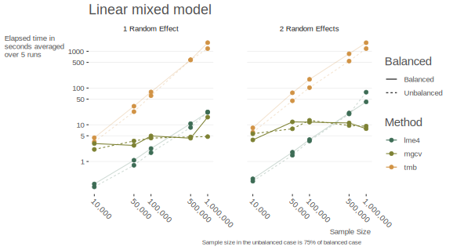
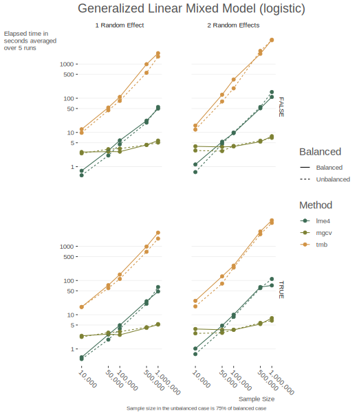
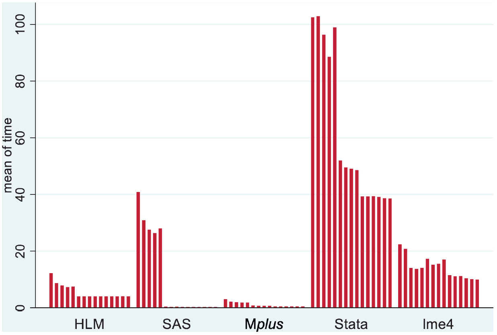
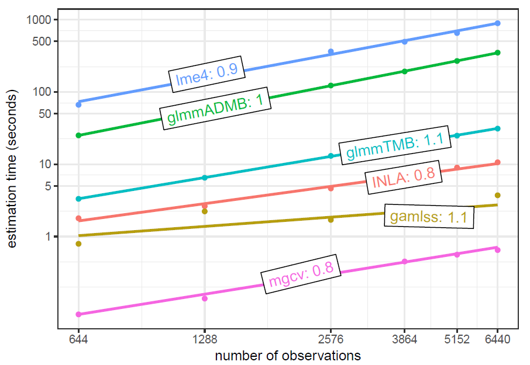
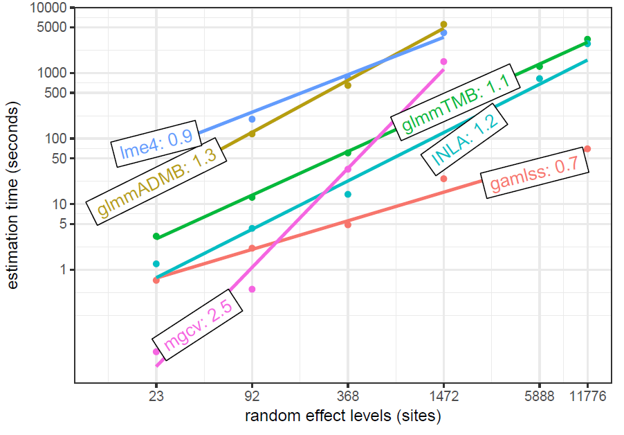
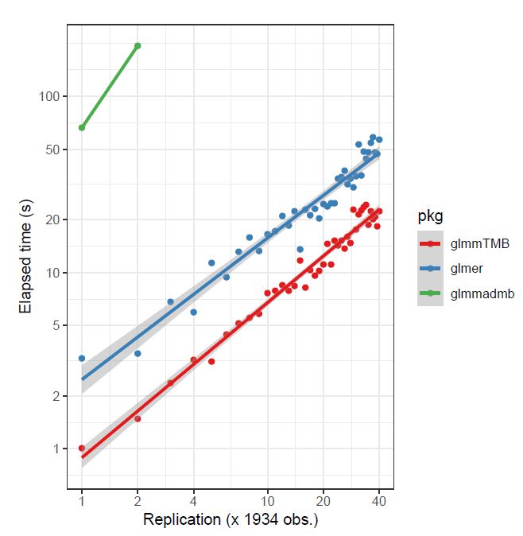
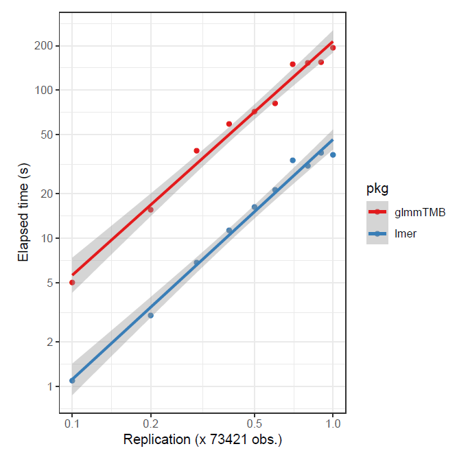

```{r setup, include=FALSE}
knitr::opts_chunk$set(
  echo = T,
  message = F,
  warning = F,
  comment = NA,
  R.options = list(width = 120),
  cache.rebuild = F,
  cache = T,
  fig.align = 'center', 
  fig.asp = .7,
  dev = 'svglite', 
  dev.args = list(bg = 'transparent')
)

library(tidyverse)
library(tidyext)
library(broom)
library(kableExtra)
library(visibly)

kable_df <- function(..., digits=3) {
  kable(..., digits=digits) %>% 
    kable_styling(full_width = F)
}
```

## Introduction

With mixed models, it is easy to run into data that is larger in size than some more typical data scenarios.  Consider a cross-sectional data set with 200 individuals.  This is fairly small data.  Now, if we observe them each five times, as in a longitudinal setting, we suddenly have 1000 observations.  There may be less than 200 countries in the world, but if we survey 100s or 1000s of people in many of them, we suddenly have a notable data set size, and still would potentially like to model a country-level random effect.  What are our options when dealing with possibly gigabytes of data?

<aside>Background required:

For the following you should have familiarity with [mixed models](https://m-clark.github.io/mixed-models-with-R/).  Knowledge of the <span class="pack" style = "">lme4</span> package would be useful but isn't required. Likewise, knowledge of [generalized additive models](https://m-clark.github.io/generalized-additive-models/) and <span class="pack" style = "">mgcv</span> would be helpful, but I don't think it's required to follow the demonstration.
</aside>

## R Packages for Mixed Models with Large Data

While many tools abound to conduct mixed models for larger data sizes, their limitations can be found pretty quickly.  R's <span class="pack" style = "">lme4</span> is a standard, but powerful mixed model tool.   More to the point, it is very computationally efficient, such  that it can handle very large sample sizes for simpler mixed models.  For linear mixed models this can include hundreds of thousands of observations with possibly multiple random effects, still running on a basic laptop.  For such models, it's still largely the tool of choice, and its approach has even been copied/ported into other statistical packages.

We'll first create some data to model.  This is just a simple random intercepts setting.

```{r data-prep}
set.seed(12358)
N = 1e6
n_groups = 1000
g = rep(1:n_groups, e = N/n_groups)

x = rnorm(N)                             # an observation level continuous variable
b = rbinom(n_groups, size = 1, prob=.5)  # a cluster level categorical variable
b = b[g]

sd_g = .5     # standard deviation for the random effect
sigma = 1     # standard deviation for the observation

re0 = rnorm(n_groups, sd = sd_g)  # random effects
re  = re0[g]

lp = 0 + .5*x + .25*b + re        # linear predictor 

y = rnorm(N, mean = lp, sd = sigma)               # create a continuous target variable
y_bin = rbinom(N, size = 1, prob = plogis(lp))    # create a binary target variable

d = tibble(x, b, y, y_bin, g = factor(g))
```

<br>

Let's take a look at the data first.

```{r show-data, echo=FALSE}
kable_df(head_tail(d))
```

Now with the data in place, let's try <span class="pack" style = "">lme4</span> to model the continuous outcome.


```{r simple_mixed}
library(lme4)

system.time({
  mixed_big = lmer(y ~ x + b + (1|g))
})

summary(mixed_big, cor = FALSE)
```

This is great! We just ran a mixed model for `r scales::comma(N)` observations and `r scales::comma(n_groups)` groups for our random effect in just a few seconds.

But the problem comes as soon as you move to the generalized mixed model, e.g. having a binary outcome, or include additional complexity while still dealing with large data.  The following is essentially the same model, but for a binary outcome.

```{r simple_big_mixed_binary}
system.time({
  mixed_big_glmm = glmer(y_bin ~ x + b + (1|g), family = binomial)
})
```

To begin with, you shouldn't be worried about models taking a few minutes to run, or even a couple hours. Once you have your model(s) squared away, the testing of which can be done on a smaller sample of the data set, there is no need to repeatedly run it.  But in this case we had a greater than 15 fold increase in time for a very simple data scenario.  So it's good to have options when you need them. Let's turn to those.

## Additive Models as Mixed Models

Simon Wood's wonderful work on generalized additive models (GAM) and the <span class="pack" style = "">mgcv</span> package make it one of the better modeling tools in the R kingdom.  As his text[@wood_generalized_2017] and other work shows, additive models can be seen as random effects models, and he exploits this by providing numerous ways to include and explore random effects in the GAM approach.  One key difference between the GAM and a standard linear mixed model approach is that the random effects are estimated parameters of the model, not BLUPs, as with <span class="pack" style = "">lme4</span>.  Those coefficients are penalized, in a similar way as L2/ridge regression.  The 'fixed effects' are not penalized, and so that part is basically just a generalized linear model.  As we will see though, the results will be nearly the same between <span class="pack" style = "">mgcv</span> and <span class="pack" style = "">lme4</span>. 

The following demonstrates the link between the approaches by showing a model that includes a random intercept and slope. We will use the standard <span class="pack" style = "">mgcv</span> approach for specifying a smooth term, but alternatives are shown for those familiar with the package.

<aside>If you just use <span class="func" style = "">coef</span> on the following gam objects, you will see that the random effects are lumped in with the other estimated coefficients.</aside>


```{r basic_model}
library(lme4)
library(mgcv)

mixed_model = lmer(
  Reaction ~ Days + (1 | Subject) + (0 + Days | Subject),
  data = sleepstudy
)

ga_model = gam(
  Reaction ~  Days + s(Subject, bs = 're') + s(Days, Subject, bs = 're'),
  data = sleepstudy,
  method = 'REML'
)

# Using gamm and gamm4 for the same model
# ga_model = gamm(
#   Reaction ~  Days ,
#   random = list(Subject = ~ 0 + Days),
#   data = sleepstudy,
#   method = 'REML'
# )
# 
# ga_model = gamm4::gamm4(
#   Reaction ~  Days,
#   random =  ~ (Days||Subject),
#   data = sleepstudy,
#   REML = TRUE
# )
```


Note that we use <span class="func" style = "">s</span> to denote a <span class="emph" style = "">smooth term</span> in the parlance of additive models, and the `bs = 're'` specifies that we want it as a random effect (as opposed to a spline or other basis function).  The second smooth term `s(Days, Subject, bs = 're')` denotes random coefficients for the `Days` covariate.  


<aside> As shown, one could use the <span class="func" style = "">gamm</span> function for the <span class="pack" style = "">nlme</span> style, or Wood's <span class="pack" style = "">gamm4</span> package to use the <span class="pack" style = "">lme4</span> syntax.  These alternate approaches allow for more flexibility in some ways, but will not be useful to us for big data.</aside>

### Comparison of GAM to the Mixed Model

Aside from the syntax, the underlying model between the two is the same, and the following shows that we obtain the same results for both <span class="pack" style = "">lme4</span> and <span class="pack" style = "">mgcv</span>.  


```{r basic_model_summary}
summary(mixed_model, cor = FALSE)
summary(ga_model)
```

I don't want to go into the details of the printout for <span class="pack" style = "">mgcv</span>, but it is worth noting that the parametric part is equivalent to the fixed effects portion of the <span class="pack" style = "">lme4</span> output. Likewise the smooth terms output is related to the random effects, but we'll extract them in a manner more suited to typical mixed model output instead.  So let's compare the variance components, and get them ready for later comparison to <span class="func" style = "">bam</span> results.  Note, I've been using <span class="pack" style = "">mgcv</span> a lot for mixed models lately, so I created a package called <span class="pack" style = "">gammit</span> to provide tidier output in general, and which is more similar to <span class="pack" style = "">lme4</span>.   I note the corresponding <span class="pack" style = "">mgcv</span> function where appropriate.

<aside>The <span class="pack" style = "">gammit</span> package is available on [GitHub](https://github.com/m-clark/gammit).</aside>


```{r initial-vc}
library(gammit)

# extract just the fixed effects for later.
mixed_fe = fixef(mixed_model)
gam_fe   = extract_fixed(ga_model)  # coefs with se and confidence interval

# variance components
lmer_vcov = data.frame(VarCorr(mixed_model))
gam_vcov  = extract_vc(ga_model)    # cleaner gam.vcomp
```

```{r initial-vc-show, echo=FALSE}
kable_df(lmer_vcov, caption = 'LME Result')
kable_df(gam_vcov, caption = 'GAM Result')
```


<aside>The penalty parameter in the GAM model is inversely related to the variance estimate of the random effects.  See [this demo](https://m-clark.github.io/generalized-additive-models/appendix.html#a-comparison-to-mixed-models).</aside>

### The bam approach 

For large data, <span class="pack" style = "">mgcv</span> provides the <span class="func" style = "">bam</span> function.  For this small data setting we don't really need it, but we can establish that we would get similar results using it without having to wait.  We will see the benefits when we apply <span class="func" style = "">bam</span> to large data later.  None of our syntax changes, just the function.

```{r basic_model_bam}
ba_model = bam(Reaction ~  Days + s(Subject, bs='re') + s(Days, Subject, bs='re'), 
               data = sleepstudy)

bam_fe   = extract_fixed(ba_model)
bam_vcov = extract_vc(ba_model)
```

How does it work? The function uses a parallelized approach where possible, essentially working on subsets of the model matrices simultaneously. Details can be found in the references[@li_faster_2019][@wood_generalized_2015][@wood_generalized_2017-1], but basically <span class="pack" style = "">mgcv</span> parallelizes the parts that can be, and additionally provides an option to discretize the data to work with the minimal information necessary to produce viable estimates.  The following uses the discrete option.  As there isn't really anything to discretize with so little data, this is just to demonstrate the syntax. 

```{r basic_model_bam_discrete}
ba_d_model = bam(Reaction ~  Days + s(Subject, bs='re') + s(Days, Subject, bs='re'), 
                 data = sleepstudy,
                 discrete = TRUE)

bam_d_fe   = extract_fixed(ba_d_model)
bam_d_vcov = extract_vc(ba_d_model)
```

### Fixed effects comparison

We start by comparing the fixed effects of all models run thus far.  No surprises here, the results are the same.

```{r compare-fixef, echo=FALSE}
rbind(
  mixed = mixed_fe,
  gam   = gam_fe$Estimate,
  bam   = bam_fe$Estimate,
  bam_d = bam_d_fe$Estimate
  ) %>% 
  data.frame() %>% 
  rownames_to_column('Model') %>% 
  rename(Intercept = X.Intercept.) %>% 
  kable_df(caption = 'Fixed Effects Estimates')
```

Let's examine the standard errors.  Note that there are options for the GAM models for standard error estimation, including a Bayesian one.  For more details, see `?gamObject`, but I will offer the summary:

##### Ve 
frequentist estimated covariance matrix for the parameter estimators. Particularly useful for testing whether terms are zero. Not so useful for CI's as smooths are usually biased.

##### Vp
estimated covariance matrix for the parameters. This is a Bayesian posterior covariance matrix that results from adopting a particular Bayesian model of the smoothing process. Particularly useful for creating credible/confidence intervals.

##### Vc
Under ML or REML smoothing parameter estimation it is possible to correct the covariance matrix Vp for smoothing parameter uncertainty. This is the corrected version.


 We will use the Bayesian estimates (`Vp`), but for this setting there are no appreciable differences.  I expand the digits to show they are in fact different to some decimal place.
 
```{r compare-fixef-se, echo=FALSE}
rbind(
  mixed = summary(mixed_model)$coefficients[,'Std. Error'],
  gam   = gam_fe$SE,
  bam   = bam_fe$SE,
  bam_d = bam_d_fe$SE
  ) %>% 
  data.frame() %>% 
  rownames_to_column('Model') %>% 
  rename(Intercept = X.Intercept.) %>% 
  kable_df(caption = 'Fixed Effects Standard Errors', digits = 5)
```

### Variance components comparison

Now we move to the variance component estimates. Reported are the standard deviations for subject level random effects for intercept, `Days` coefficient, and residual.

```{r compare-vc, echo=FALSE}
rbind(
  mixed = lmer_vcov$sd,
  gam   = gam_vcov[['std.dev']],
  bam   = bam_vcov[['std.dev']],
  bam_d = bam_d_vcov[['std.dev']]
  ) %>% 
  data.frame() %>% 
  rename(Intercept = X1, Days = X2, Residual = X3) %>% 
  kable_df(caption = 'Variance Components Estimates')
```


We can also look at their interval estimates.  We use the profile likelihood for the <span class="pack" style = "">lme4</span> mixed model.  In this case we can see slightly wider and somewhat different boundary estimates.


```{r compare-vc-int, echo=FALSE}
mixed_vc_int = confint(mixed_model)
mixed_vc_int = mixed_vc_int %>% 
  data.frame() %>% 
  filter(str_detect(rownames(.), 'sig')) %>% 
  mutate(sd = c('Intercept', 'Days', 'scale')) %>% 
  rename(
    component = sd,
    lower     = X2.5.., 
    upper     = X97.5..
    ) %>% 
  select(component, everything()) 
```

```{r compare-vc-int-table, echo=FALSE}
list(mixed = mixed_vc_int,
     gam   = gam_vcov,
     bam   = bam_vcov,
     bam_d = bam_d_vcov) %>% 
  bind_rows(.id = 'Model') %>% 
  mutate(component = if_else(component=='scale', 'Residual', component)) %>% 
  select(Model:upper) %>% 
  kable_df(caption = 'Interval Estimates for Variance Components', digits = 4) %>% 
  collapse_rows(valign = 'top')
```


### Estimated random effects

Now let's look at the random effect estimates.

```{r re, echo=1:5}
mixed_re = ranef(mixed_model)[[1]] %>% 
  rename(mixed_Subject = `(Intercept)`, `mixed_Days|Subject` = Days)

gam_re_init   = extract_ranef(ga_model)
bam_re_init   = extract_ranef(ba_model)
bam_d_re_init = extract_ranef(ba_d_model)

gam_re = gam_re_init %>% 
  pivot_wider(
    names_from = component, 
    values_from = re, 
    names_prefix = 'gam_',
    -(se:upper)
  ) %>% 
  select(-group)

bam_re = bam_re_init %>% 
  pivot_wider(
    names_from = component, 
    values_from = re, 
    names_prefix = 'bam_',
    -(se:upper)
  ) %>% 
  select(-group)

bam_d_re = bam_d_re_init %>% 
  pivot_wider(
    names_from = component, 
    values_from = re, 
    names_prefix = 'bam_d_',
    -(se:upper)
  ) %>% 
  select(-group)

all_re = bind_cols(mget(ls(pattern = '_re$')))
```

We'll start with the random effects for the intercept. To several decimal places, we start to see differences, so again we know they aren't doing exactly the same thing.

```{r re-int, echo=FALSE}
all_re %>% 
  select(
    `mixed_Subject`,
    `gam_Subject`,
    `bam_Subject`,
    `bam_d_Subject`
    ) %>% 
  kable_df(digits = 5, caption = 'Estimated Random Effects')
```


Random effects for the Days coefficient.

```{r re-days, echo=FALSE}
all_re %>% 
  select(
    `mixed_Days|Subject`,
    `gam_Days|Subject`,
    `bam_Days|Subject`,
    `bam_d_Days|Subject`
    ) %>% 
  kable_df(digits = 5, caption = 'Estimated Random Intercepts')
```

Standard errors for the random effects.  In the balanced design these are essentially constant across clusters. We can see that the Bayesian estimates from <span class="pack" style = "">mgcv</span> reflect greater uncertainty.

<aside>The <span class="func" style = "">bam</span> results may actually be slightly different for some clusters.</aside>

<br>

```{r re-int-se, echo=FALSE}
list(
  mixed = unique(data.frame(ranef(mixed_model))$condsd, 2),
  gam   = unique(round(gam_re_init$se, 5)),
  bam   = unique(round(bam_re_init$se, 5)),
  bam_discrete = unique(round(bam_d_re_init$se, 5))
) %>% 
  bind_rows() %>% 
  t() %>% 
  data.frame() %>% 
  rownames_to_column(var = 'Model') %>% 
  rename(Intercepts = X1, Days = X2) %>% 
  kable_df(caption = 'Standard Errors of the Random Coefficients')
```

### Comparisons to Bayesian Estimates

As we have noted, one of the differences between <span class="pack" style = "">lme4</span> and <span class="pack" style = "">mgcv</span> output is that the default uncertainty estimates for the GAM are Bayesian.  As such, it might be interesting to compare these to a fully Bayes approach.  We'll use <span class="pack" style = "">rstanarm</span>, which uses the <span class="pack" style = "">lme4</span> style syntax.

```{r bayes}
library(rstanarm)
bayes = stan_lmer(Reaction ~ Days + (1|Subject) + (0+Days|Subject), 
                  data=sleepstudy,
                  cores = 4)

bayes_fe = broom::tidy(bayes)
bayes_vc = broom::tidy(bayes, 'hierarchical')
bayes_re = broom::tidy(bayes, 'varying')
```

```{r bayes-compare, echo=FALSE}
bind_rows(bayes_fe, bayes_vc) %>% 
  kable_df(caption = 'Bayesian fixed effects and variance components')

bayes_re %>% 
  pivot_wider(names_from = term, values_from = estimate, -std.error) %>% 
  kable_df(caption = 'Bayesian random effects')

bayes_re %>% 
  pivot_wider(names_from = term, values_from = std.error, -estimate)  %>% 
  kable_df(caption = 'Random effect standard errors')

avg_re_se_bayes = bayes_re %>% 
  pivot_wider(names_from = term, values_from = std.error, -estimate) %>% 
  mutate_if(is.numeric, mean) %>% 
  distinct(`(Intercept)`, Days)

avg_re_se_mgcv = gam_re_init %>% 
  group_by(component) %>% 
  summarise(se = mean(se)) 
```

We can see that the <span class="pack" style = "">mgcv</span> estimates for standard errors of the random effects are close to the average standard errors from the fully Bayesian approach. For the Bayesian result we have (`r rnd(avg_re_se_bayes[['(Intercept)']])` and `r rnd(avg_re_se_bayes$Days)` for Intercept and Days coefficient respectively, while for <span class="pack" style = "">mgcv</span> this is `r rnd(avg_re_se_mgcv$se[2])` and `r rnd(avg_re_se_mgcv$se[1])`.


## Back to the initial problem


So we've established that both default <span class="func" style = "">gam</span>) and <span class="func" style = "">bam</span> functions are providing what we want.  However, the reason for using <span class="pack" style = "">mgcv</span> for mixed models is the speed gain we'll get with big data.  So let's return to the binary outcome example that took over a minute for <span class="pack" style = "">lme4</span> to run.

```{r bam_big, cache.rebuild=FALSE}
system.time({
  bam_big <- bam(
    y_bin ~ x + b + s(g, bs='re'), 
    data = d,
    nthreads = 8,
    family = binomial
  )
})
```

That didn't actually improve our situation, and was much worse in time- more than 20 minutes!  Remember though, that the <span class="pack" style = "">mgcv</span> approach has to estimate all those random effect coefficients, while <span class="pack" style = "">lme4</span> is dealing with a perfectly balanced data set with which to estimate a single variance component. In practice, with additional complexities <span class="func" style = "">bam</span> would win out eventually[^bamwins].  

However, even here we haven't used all our secret weapons.  Another option with <span class="func" style = "">bam</span> works on a modified data set using binned/rounded values for continuous covariates, and working with only the minimum data necessary to estimate the coefficients[@wood_generalized_2015]. With large enough data, as is the case here, the estimated parameters might not be different at all, while the efficiency gains could be tremendous.  Let's add `discrete = TRUE` and see what happens.

<aside>We just need the distinct set of values after rounding.</aside>

```{r bam_big_discrete, cache.rebuild=FALSE}
system.time({
  bam_big_d <- bam(
    y_bin ~ x + b + s(g, bs='re'), 
    data = d,
    nthreads = 8,
    family = binomial, 
    discrete = TRUE
  )
})
```

**Wow!** That was as fast almost as <span class="pack" style = "">lme4</span> with the linear mixed model! Let's check the results.  We'll start with the fixed effects.  I add some digits to the result so we can see the very slight differences.

```{r mixed_big_glmm_fe_results, echo=FALSE}
# don't want to rerun if possible, as confint will take forever for some methods
# and/or variance components
mixed_big_glmm_fe = summary(mixed_big_glmm)$coefficients %>% 
  data.frame() %>% 
  rownames_to_column(var = 'Term') %>% 
  rename(SE = 'Std..Error') %>% 
  mutate(Model = 'lme4')

mixed_big_ci = confint(mixed_big_glmm, parm = 'beta_', method = 'Wald') 
```

```{r bam-fe-results, echo=FALSE}
big_results = list(bam_big = bam_big, bam_big_d = bam_big_d)

tibble(
  Model = rep('True', 3),
  Term  = c('(Intercept)', 'x', 'b'),
  Estimate = c(0, .5, .25)
) %>% 
  bind_rows(
    big_results %>% 
      map(extract_fixed) %>% 
      bind_rows(
        .id = 'Model'
      ) 
  ) %>% 
  bind_rows(
    mixed_big_glmm_fe %>% 
      select(-z.value, -Pr...z..) %>% 
      mutate(LL = mixed_big_ci[,1], UL = mixed_big_ci[,2])
  ) %>% 
  kable_df(caption = 'Fixed Effects', digits = 8)
```

Now for the variance components.

```{r big-vc-results, echo=FALSE}
bind_rows(
  true = tibble(std.dev = .5, variance = std.dev^2),
  bam_big   = extract_vc(bam_big) %>% select(std.dev, variance),
  bam_big_d = extract_vc(bam_big_d) %>% select(std.dev, variance),
  lme4 = data.frame(VarCorr(mixed_big_glmm)) %>% 
    select(sdcor, vcov) %>% 
    rename(std.dev=sdcor, variance = vcov),
  .id = 'Model'
) %>% 
  kable_df(caption = 'Variance Components', digits = 6)
```

And finally, let's look at the estimated random effects for the first 5 clusters.

<aside>Just a note, unless you have very many observations per cluster, you should not expect to get very close to the true values of the random effects except on average.  For example, if you just want to estimate a noisy mean, how many observations would you need to get reasonably close?</aside>

```{r big-re-results, echo=FALSE}
re_big = tibble(
  true = re0[1:5],
  bam_big   = extract_ranef(bam_big) %>% slice(1:5) %>% pull(re),
  bam_big_d = extract_ranef(bam_big_d) %>% slice(1:5) %>% pull(re),
  lme4 = ranef(mixed_big_glmm)[['g']][1:5, 1]
) 

re_big %>% 
  rownames_to_column(var = 'cluster') %>% 
  kable_df(digits = 7, caption = 'Estimated Random Effects')

# cor(re_big)
# ranef(mixed_big_glmm)[['g']] %>% rownames_to_column() %>% head_tail()
```


```{r glmmTMB_big, echo=FALSE, eval=FALSE}
system.time({
  mixed_big_tmb = glmmTMB::glmmTMB(y_bin ~ x + b + (1|g), family = binomial)
})
summary(mixed_big_tmb)
```

```{r glmm_big_bayes, echo=FALSE, eval=FALSE}
system.time({
  mixed_big_bayes = rstanarm::stan_glmer(y_bin ~ x + b + (1|g),
                                         data = d,
                                         cores = 4,
                                         family = binomial)
})
summary(test)
```


So we're getting what we should in general.

## When to use bam

The following are some guidelines for when <span class="func" style = "">bam</span> might be preferable compared to other mixed modeling tools.

### Linear Mixed Models

In general you'll probably need very large data for <span class="func" style = "">bam</span> to be preferred to <span class="pack" style = "">lme4</span> for linear mixed models unless:

- You have complicated structure that begins to bog down lme4
- You want to add smooth terms[^smoothlme4]
- You have memory issues

The following shows some timings for <span class="pack" style = "">lme4</span>, glmmTMB, and <span class="pack" style = "">mgcv</span> for the linear mixed model case under a variety of settings with large data.  In some sense, this is not exactly a fair comparison as <span class="pack" style = "">mgcv</span> parallelizes computations while <span class="pack" style = "">lme4</span> and <span class="pack" style = "">glmmTMB</span> do not.  However, this is also exactly the point of the demonstration - those who can, do.  In general though, the <span class="pack" style = "">lme4</span> advantage holds until around 1 million observations. We can see that the main issue for <span class="func" style = "">bam</span> is not so much the sample size, but the number of parameters to estimate.

<aside>For <span class="pack" style = "">lme4</span>, I set at least one setting to possibly improve speed/performance for both lme and glmm models, though this only shaved a few seconds for the largest sample size settings for the linear mixed model (See tips [here](https://cran.r-project.org/web/packages/lme4/vignettes/lmerperf.html) and [here](http://svmiller.com/blog/2018/06/mixed-effects-models-optimizer-checks/)).  For <span class="pack" style = "">mgcv</span> I only used 12 cores for parallelization so as to be similar to what is common on modern machines (8-12), but anyone with access to a better machine or cluster computing environment would see even more speed gain by utilizing additional cores. For <span class="pack" style = "">glmmTMB</span>, settings were left at defaults, as I've not come across any specific speed recommendations. See Brooks et al.[@brooks_glmmtmb_2017] (@brooks_glmmtmb_2017) for more speed comparisons of <span class="pack" style = "">glmmTMB</span>, <span class="pack" style = "">mgcv</span>, <span class="pack" style = "">lme4</span>, and others, as well as the [glmmTMB vignette](https://cran.r-project.org/web/packages/glmmTMB/vignettes/glmmTMB.pdf).</aside>

```{r lme-timings, echo=FALSE, background='transparent'}
# 

load('_posts/2019-09-30-big-mixed-models/lme_results_summary.RData')


lme_results_gathered %>% 
  mutate(
    re = if_else(tau_2 == 0, '1 Random Effect', '2 Random Effects'),
    balanced2 = if_else(balanced == 1, 'Balanced', 'Unbalanced'),
    elapsed_avg = elapsed/5
  ) %>% 
  rename(method = test) %>% 
  ggplot(aes(N, elapsed_avg)) +
  geom_point(aes(color = method)) +
  geom_line(aes(color = method, lty = balanced2, alpha = method=='mgcv')) +
  facet_grid(cols = vars(re)) +
  labs(
    x = 'Sample Size',
    y = 'Elapsed time in\nseconds averaged\nover 5 runs',
    title = 'Linear mixed model',
    caption = 'Sample size in the unbalanced case is 75% of balanced case'
  ) +
  scale_alpha_discrete(range = c(.25, 1)) +
  scale_x_continuous(
    breaks = round(unique(lme_results_gathered$N)),
    limits = c(range(lme_results_gathered$N)),
    trans = 'log',
    labels = scales::comma) +
  scale_y_continuous(
    breaks = c(0, 1, 5, 10, 50, 100, 500, 1000), 
    limits = c(range(lme_results_gathered$elapsed/5)),
    trans = 'log'
  ) +
  scico::scale_color_scico_d(name = 'Method', begin = .33, end = .66) + 
  scale_linetype(name = 'Balanced') + 
  guides(alpha = 'none') +
  visibly::theme_clean() + 
  theme(
    axis.text.x = element_text(angle = -45, hjust = 0), 
    axis.title.y = element_text(hjust = 0), 
    panel.grid.major.y = element_line(colour = 'gray92'),
    panel.spacing = unit(3, "lines"),
    plot.title = element_text(size = 12),
    plot.caption = element_text(size = 8),
    plot.background = ggplot2::element_rect(fill = "transparent", colour = NA),
    legend.key = ggplot2::element_rect(fill='transparent', colour = NA),
    legend.background = ggplot2::element_rect(fill='transparent', colour = NA),
    legend.text = element_text(size = 8),
    legend.title = element_text(size = 10)
  )
```

```{r lme-timings-data, echo=FALSE, eval=FALSE}
# in case we add the grid searched
load('_posts/2019-09-30-big-mixed-models/lme_results.RData')
kable_df(lme_results_gathered)
```


### Generalized Linear Mixed Models


For the generalized setting with binary, count, and other outcomes:

- <span class="pack" style = "">lme4</span>, at least at the time of this writing, will almost certainly start giving convergence warnings even in well-behaved data settings, and as such, will require tweaking to mitigate
- <span class="pack" style = "">glmmTMB</span> is probably viable up to 100k and one or two random effects, but would be the slower option
- Use <span class="pack" style = "">mgcv</span> for same reasons as above, but it potentially becomes an advantage with as few as 50k.

```{r gmm-timings, echo=FALSE, background='transparent'}
# 

load('_posts/2019-09-30-big-mixed-models/gmm_results_summary.RData')

gmm_results_gathered %>% 
  mutate(
    re = if_else(tau_2 == 0, '1 Random Effect', '2 Random Effects'),
    balanced2 = if_else(balanced == 1, 'Balanced', 'Unbalanced'),
    elapsed_avg = elapsed/5,
    rare = factor(rare, labels = c('Common', 'Rare'))
  ) %>% 
  rename(method = test) %>% 
  ggplot(aes(N, elapsed_avg)) +
  geom_point(aes(color = method)) +
  geom_line(aes(color = method, lty = balanced2, alpha = method=='mgcv')) +
  facet_grid(rows = vars(rare), cols = vars(re)) +
  labs(
    x = 'Sample Size',
    y = 'Elapsed time in\nseconds averaged\nover 5 runs',
    title = 'Generalized Linear Mixed Model (logistic)',
    caption = 'Sample size in the unbalanced case is 75% of balanced case'
  ) +
  scale_alpha_discrete(range = c(.25, 1)) +
  scale_x_continuous(
    breaks = round(unique(gmm_results_gathered$N)),
    limits = c(range(gmm_results_gathered$N)),
    trans = 'log',
    labels = scales::comma) +
  scale_y_continuous(
    breaks = c(0, 1, 5, 10, 50, 100, 500, 1000), 
    limits = c(range(gmm_results_gathered$elapsed/5)),
    trans = 'log'
  ) +
  guides(alpha = 'none') +
  scico::scale_color_scico_d(name = 'Method', begin = .33, end = .66) + 
  scale_linetype(name = 'Balanced') + 
  visibly::theme_clean() + 
  theme(
    axis.text.x = element_text(angle = -45, hjust = 0), 
    axis.title.y = element_text(hjust = 0), 
    panel.grid.major.y = element_line(colour = 'gray92'),
    panel.spacing = unit(3, "lines"),
    plot.title = element_text(size = 12),
    plot.caption = element_text(size = 8),
    plot.background = ggplot2::element_rect(fill = "transparent", colour = NA),
    legend.key = ggplot2::element_rect(fill='transparent', colour = NA),
    legend.background = ggplot2::element_rect(fill='transparent', colour = NA),
    legend.text = element_text(size = 8),
    legend.title = element_text(size = 10)
  )
```


<aside>I have also done some timings on a local machine with as many as 10000 levels for one of the random effects, or 5 million observations for a binary outcome. Depending on the computational setup this could take 2-3 hours.</aside>

### Other options

When looking into mixed models for big data, you typically won't find much in the way of options.  I've seen some packages or offerings for some machine learning approaches like random forests[^mixrf], but this doesn't address the issue of large data.  A Spark module provided by LinkedIn is available, [photonML](https://github.com/linkedin/photon-ml), but it's not clear how easy it is to implement.  Julia has recently made multithreading a viable option for any function.  This is notable since Doug Bates, one of the <span class="pack" style = "">lme4</span> authors, develops the [MixedModels](https://github.com/dmbates/MixedModels.jl) module for Julia.  Should multithreading functionality be added, it could be a very powerful tool[^deepmixed].  

Among proprietary options, SAS and Stata are the more commonly used tools.  SAS PROC HPMIXED essentially uses the <span class="pack" style = "">lme4</span> approach, but can be faster for well-behaved data. Stata, while commonly used for mixed models, is generally slower than the <span class="pack" style = "">lme4</span> even for standard settings and the smallest data settings noted here[^mccoach].

<aside>SAS uses disk rather than RAM for processing, so may be preferred for low RAM devices.</aside>

Here is a summary of other timings of various tools for mixed models.


##### McCoach et al. 2018

The results from McCoach et al.[@mccoach2018] with a standard linear mixed model. Sample size fixed at 10000. In the first five cases, a true variance parameter was set to zero, a situation <span class="pack" style = "">lme4</span> handles well[^mccoach]. 

```{r mccoach, echo=FALSE, background='transparent'}

```

##### Brooks et al. 2018 timing as a function of sample size

Brooks et al. uses the Salamander data from the <span class="pack" style = "">glmmTMB</span> package.  Starting sample size is `r nrow(glmmTMB::Salamanders)`, which is then replicated to produce larger data. This is a negative binomial count model.

```{r brooksn, echo=FALSE, background='transparent', caption = 'Brooks et al 2018 timing as a function of sample size'}

```

##### Brooks et al. 2018 timing as a function of number of levels

This data is simulated based on models from the previous, and adds increasing numbers of (balanced) levels to the random effect. This shows a similar effect on <span class="pack" style = "">mgcv</span> as the study here.

```{r brooksnlev, echo=FALSE, background='transparent', caption = 'Brooks et al 2018 timing as a function of number of levels'}

```

##### TMB timings

Depending on the data, and whether the target is assumed gaussian or not, <span class="pack" style = "">glmmTMB</span> might be preferable.  For the following, in the first case a small data set was replicated to create larger data, and in the second, a larger data set was sub-sampled[^bolker_summary].

```{r tmb_vignette, echo=FALSE, background='transparent', caption = 'TMB timings'}


```


## Limitations

To summarize the limitations of the <span class="pack" style = "">mgcv</span> approach, we can note the following:
    
- The number of parameters to estimate increases greatly, which may void any gains until very large data with complex models
- No estimation of random effect correlations, e.g. slopes and intercepts
- When `discrete = TRUE`, some <span class="func" style = "">predict.gam</span> functionality may be lost 

All in all, these are pretty minor, and the last one likely will be remedied in a future release.


## Summary

The take home point here is that you now have viable tools to run mixed models on very large data.  This doesn't mean you won't have to wait for it, especially for more complicated models, but you may even be able to run some of these on standard machines in reasonable times.  The alternative estimation procedures may even make otherwise problematic models more 


## Supplemental

I will set up a repo with the simulation code at some point and link it here.

[^bamwins]: Even just adding an additional random effect would possibly be enough for this data example.

[^mixrf]: See [REEMtree](https://cran.r-project.org/web/packages/REEMtree/), [mixRF](https://cran.r-project.org/web/packages/MixRF/) for example.

[^smoothlme4]: You could use construct the smooth with <span class="pack" style = "">mgcv</span> and add it to the model matrix for <span class="pack" style = "">lme4</span>. 

[^mccoach]: See McCoach reference [@mccoach2018].  They also look at HLM and Mplus. However, I haven't in years consulted with anyone across dozens of disciplines that was using HLM for mixed models. With Mplus, the verbosity of the syntax, plus additional data processing required, plus huge lack of post-processing of the model would negate any speed gain one might get from simply running the model. Couple this with the fact that campus-wide licenses are rare for either, neither could be recommended for mixed models.  Note also, that one setting of <span class="func" style = "">lmer</span> probably would have negated almost all their convergence issues.

[^bolker_summary]: "In general, we expect <span class="pack" style = "">glmmTMB</span>'s advantages over <span class="pack" style = "">lme4</span> to be (1) greater flexibility (zero-inflation etc.); (2) greater speed for GLMMs, especially those with large number of 'top-level' parameters (fixed effects plus random-effects variance-covariance parameters). In contrast, lme4 should be faster for LMMs."

[^deepmixed]: While I haven't seen it done, so it may have to serve as a later post, it should be possible to use deep learning tools like Keras or fastai by regularizing only weights associated with the random effects.  If one takes an actual deep learning approach, then one can estimate functions of the 'fixed' covariates (like the smooth terms in typical GAM) and possibly get at correlations of the clusters themselves (a la spatial random effects).
