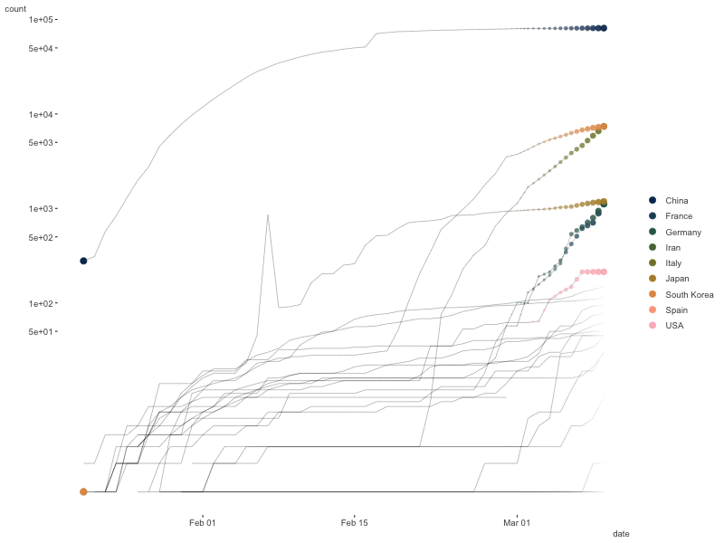

```{r setup, include=FALSE}
knitr::opts_chunk$set(
  echo = TRUE,
  message = FALSE,
  warning = FALSE,
  comment = NA,
  R.options = list(width = 120),
  cache.rebuild = FALSE,
  cache = FALSE,
  fig.align = 'center',
  fig.asp = .7,
  dev = 'svglite',
  dev.args = list(bg = 'transparent')
)

library(tidyverse)
library(kableExtra)
library(scico)

kable_df <- function(..., digits=3) {
  kable(..., digits=digits) %>% 
    kable_styling(full_width = F)
}

rnd = tidyext::rnd
```

<aside>First posted 2020-03-23.</aside>


## Introduction

This is some code to get processed data and visualizations regarding the COVID-19 outbreak.   The goal here is just to present some code that I'm playing with that may also make it easier for others to get their hands dirty. In other words, this is for enabling others to play with the data as well, while presenting some clean code and data. There are actually already some R packages doing some of this, but they are currently (in my opinion) problematic, slow to update, and or don't really offer much than what you could just do yourself, as demonstrated below.  I'll likely be updating this daily for the time being.

I actually started scraping Wikipedia's WHO incidence report tables, but any cursory glance showed numerous issues and lots of cleaning, coupled with a format that changed almost daily.  I then started playing with the data behind the [Johns Hopkins dashboard](https://coronavirus.jhu.edu/map.html), which was notably better, but didn't have some info and there are issues there as well. I settled on Open Covid, but may revisit JH after their changes take place, as they will also have U.S. county level counts.

I use some custom functions in the following, and I don't show every bit of code, but most of these cases are inconsequential.  The bulk of this code should be usable by anyone pretty easily if they are familiar with the <span class="pack" style = "">tidyverse</span>.

Resources:

For the country level plots:

- Open COVID-19: https://github.com/open-covid-19/data
- Open COVID categorical data: https://open-covid-19.github.io/data/data_categories.csv

For U.S. county level plots:

- Johns Hopkins: https://github.com/CSSEGISandData/COVID-19
- NY Times finally put their data up on March 27: https://github.com/nytimes/covid-19-data

Check out CSCAR chum Alex Cao's more local efforts here:

- https://observablehq.com/@caocscar/covid-19-michigan-data

## Getting Started

### Functions

The following are functions that process the data from different sources.  I only show parts as they are a bit long, but they can be found [here](https://m-clark.github.io/scripts/covid_functions.R). They all require <span class="pack" style = "">tidyverse</span>, or at least <span class="pack" style = "">dplyr</span> and <span class="pack" style = "">readr</span>.

#### Open-Covid Data

The Open Covid was one of the more usable data sets early on.  A bonus with this data is that it already includes population, and as it's one source, the function doesn't take much code. The one drawback I've had with it was some unnecessary column changes, which effectively break the initial read as the function tries to verify column types.  Other issues include misspelled names and other minor things.

```{r read_open_covid_data-show, eval=FALSE}
read_open_covid_data <- function(
  country = NULL,     # Filter to specific country
  current = FALSE,    # Only the current data
  totals  = FALSE     # Only totals (no regional)
) {
  
  if (current) {
    data = read_csv('https://open-covid-19.github.io/data/data_latest.csv',
                    col_types = 'Dcccccddddd')
  }
  else {
    data = read_csv('https://open-covid-19.github.io/data/data.csv',
                    col_types = 'Dcccccddddd')
  }
  
  if (!is.null(country)) {
     data = filter(data, CountryCode == country | CountryName == country)
  }
  
  .
  .
  .
  
```


```{r read_open_covid_data, echo=FALSE}
read_open_covid_data <- function(
  country = NULL,     # Filter to specific country
  current = FALSE,    # Only the current data
  totals  = FALSE     # Only totals (no regional)
) {
  
  if (current) {
    data = readr::read_csv('https://open-covid-19.github.io/data/data_latest.csv',
                           col_types = 'Dcccccddddd')
  }
  else {
    data = read_csv('https://open-covid-19.github.io/data/data.csv',
                    col_types = 'Dcccccddddd')
  }
  
  if (!is.null(country)) {
     data = filter(data, CountryCode == country | CountryName == country)
  }
  
  # other cleanup and additions
  data = data %>% 
    rename(
      country_code = CountryCode,
      country_name = CountryName,
      region_code  = RegionCode,
      region_name  = RegionName,
      total_confirmed = Confirmed,
      total_deaths    = Deaths
    ) %>% 
    rename_all(tolower) %>% 
    group_by(country_code, region_code) %>% 
    mutate(
      total_deaths    = ifelse(is.na(total_deaths), 0, total_deaths),
      daily_confirmed = total_confirmed - lag(total_confirmed),
      daily_deaths    = total_deaths - lag(total_deaths),
      region_name     = if_else(region_name == 'South Caroline', 'South Carolina', region_name),
      death_rate      = total_deaths/total_confirmed
    ) %>% 
    mutate_at(vars(contains('daily')), function(x) ifelse(is.na(x), 0, x)) %>% 
    select(date:region_name, contains('daily'), contains('total'), death_rate, everything()) %>% 
    ungroup()
  
  if (totals) data = filter(data, is.na(region_code))
  
  ungroup(data)
}
```

#### Johns Hopkins Data

Here is the start of the function for the Johns Hopkins data. This data is presumably used for the website that is so popular, but there are issues.  For some bizarre reason, they appear to randomly *not* provide country totals for Australia, Canada and China, only the province level data, so for country totals this must be dealt with. In addition, confirmed cases, deaths, and recovered are needlessly separated.

```{r read_jh_data_show, eval=FALSE}
read_jh_covid_data <- function(
  first_date = lubridate::mdy('01-22-2020'),
  last_date  = Sys.Date() - 1,
  country_state = NULL,     # country if global data, state if US
  include_regions = FALSE,  # for world data, include province/state specific data?
  us         = FALSE,
  wider      = TRUE
) {
  
  if (!us) {
    cleanup_global = function(data) {
    data = data %>% 
      pivot_longer(
        -c(`Province/State`, `Country/Region`, Lat, Long),
        names_to = 'date',
        values_to = 'count'
      ) %>% 
      mutate(date = lubridate::mdy(date)) %>%  
      rename(
        province_state = `Province/State`,
        country_region = `Country/Region`,
      ) %>% 
      rename_all(tolower)
  }
    
    init_confirmed = readr::read_csv('https://raw.githubusercontent.com/CSSEGISandData/COVID-19/master/csse_covid_19_data/csse_covid_19_time_series/time_series_covid19_confirmed_global.csv')
    init_deaths    = readr::read_csv('https://raw.githubusercontent.com/CSSEGISandData/COVID-19/master/csse_covid_19_data/csse_covid_19_time_series/time_series_covid19_deaths_global.csv')
    init_recovered = readr::read_csv('https://raw.githubusercontent.com/CSSEGISandData/COVID-19/master/csse_covid_19_data/csse_covid_19_time_series/time_series_covid19_recovered_global.csv')
    
    .
    .
    .
    
```

```{r read_jh_data, echo=F}
read_jh_covid_data <- function(
  first_date = lubridate::mdy('01-22-2020'),
  last_date  = Sys.Date() - 1,
  country_state = NULL,     # country if global data, state if US
  include_regions = FALSE,  # for world data, include province/state specific data?
  us         = FALSE,
  wider      = TRUE
) {
  
  if (!us) {
    cleanup_global = function(data) {
    data = data %>% 
      pivot_longer(
        -c(`Province/State`, `Country/Region`, Lat, Long),
        names_to = 'date',
        values_to = 'count'
      ) %>% 
      mutate(date = lubridate::mdy(date)) %>%  
      rename(
        province_state = `Province/State`,
        country_region = `Country/Region`,
      ) %>% 
      rename_all(tolower)
  }
    
    init_confirmed  = readr::read_csv('https://raw.githubusercontent.com/CSSEGISandData/COVID-19/master/csse_covid_19_data/csse_covid_19_time_series/time_series_covid19_confirmed_global.csv')
    init_deaths  = readr::read_csv('https://raw.githubusercontent.com/CSSEGISandData/COVID-19/master/csse_covid_19_data/csse_covid_19_time_series/time_series_covid19_deaths_global.csv')
    init_recovered  = readr::read_csv('https://raw.githubusercontent.com/CSSEGISandData/COVID-19/master/csse_covid_19_data/csse_covid_19_time_series/time_series_covid19_recovered_global.csv')
    
    data = map_df(list(init_confirmed, init_deaths, init_recovered),
                  cleanup_global,
                  .id = 'type') %>%
      mutate(type = factor(type, labels = c('confirmed', 'deaths', 'recovered')))
    
    if (!is.null(country_state))
      data = data %>% filter(country_region == country_state)
    
    if (!include_regions) {
      
      # fix can, chin, aus by creating an 'NA' for total counts
      can_chin_aus = data %>% 
        filter(country_region %in% c('Australia', 'Canada', 'China')) %>% 
        group_by(type, country_region, date) %>% 
        summarise(count = sum(count)) %>% 
        mutate(lat = NA, long = NA)
      
      data = data %>% 
        filter(is.na(province_state)) %>%
        select(-province_state) %>% 
        bind_rows(can_chin_aus)
    }
  }
  
  if (us) {
    
    cleanup_us = function(data) {
      data = data %>% 
        pivot_longer(
          -c(UID:Combined_Key),
          names_to = 'date',
          values_to = 'count'
        ) %>% 
        mutate(date = lubridate::mdy(date)) %>%  
        rename(
          province_state = Province_State,
          country_region = Country_Region,
        ) %>% 
        rename_all(tolower)
    }
    
    init_confirmed  = readr::read_csv('https://raw.githubusercontent.com/CSSEGISandData/COVID-19/master/csse_covid_19_data/csse_covid_19_time_series/time_series_covid19_confirmed_US.csv')
    init_deaths  = readr::read_csv('https://raw.githubusercontent.com/CSSEGISandData/COVID-19/master/csse_covid_19_data/csse_covid_19_time_series/time_series_covid19_deaths_US.csv')
    
    data = map_df(list(init_confirmed, init_deaths), cleanup_us, .id = 'type') %>%
      mutate(type = factor(type, labels = c('confirmed', 'deaths')))
    
    data = data %>%  
      rename(
        county = admin2,
        state  = province_state,
        long   = long_
      ) %>% 
      filter(
        country_region == 'US',
        !state %in% c(
          'Puerto Rico',
          'Guam',
          'Northern Mariana Islands',
          'American Samoa',
          'Wuhan Evacuee',
          'Virgin Islands',
          'Grand Princess',
          'Diamond Princess'
        )
      )
    
    if (!is.null(country_state))
      data = data %>% filter(state == country_state)
  }
  
  if (wider) {
    data = data %>%  
      pivot_wider(values_from = count, names_from = type) 
  }
  
  data
}

# debugonce(read_jh_covid_data)
# test = read_jh_covid_data()
# test = read_jh_covid_data(us = T, country_state = 'Michigan')
```

#### New York Times Data

The NYT data is clean and 'tidy', and so a great resource for starting out. There are still some issues however (e.g. Georgia suddenly having fewer cumulative cases from one day to the next).

```{r read_nyt_data-show, eval=F}
read_nyt_data <- function(states = TRUE) {
  if (states) {
    us_states0 <- readr::read_csv(
      "https://raw.githubusercontent.com/nytimes/covid-19-data/master/us-states.csv",
      col_types = 'Dccdd'
    )
    
    data = us_states0 %>%
      filter(!state %in% c(
        'Puerto Rico',
        'Guam',
        'Northern Mariana Islands',
        'Virgin Islands',
        'American Samoa')
      ) %>% 
      arrange(state, date) %>%
      group_by(state) %>%
      mutate(
        daily_cases = cases - lag(cases, default = NA),
        daily_cases = if_else(is.na(daily_cases), cases, daily_cases),
        daily_deaths = deaths - lag(deaths, default = NA),
        daily_deaths = if_else(is.na(daily_deaths), deaths, daily_deaths)
      ) %>% 
      ungroup() %>% 
      left_join(tibble(state = state.name, state_abb = state.abb)) %>% 
      mutate(state_abb = as.factor(state_abb))
  }
  .
  .
  .
```

```{r read_nyt_data, echo=F}
read_nyt_data <- function(states = TRUE) {
  if (states) {
    us_states0 <- readr::read_csv(
      "https://raw.githubusercontent.com/nytimes/covid-19-data/master/us-states.csv",
      col_types = 'Dccdd'
    )
    
    data = us_states0 %>%
      filter(!state %in% c(
        'Puerto Rico',
        'Guam',
        'Northern Mariana Islands',
        'Virgin Islands',
        'American Samoa')
      ) %>% 
      arrange(state, date) %>%
      group_by(state) %>%
      mutate(
        daily_cases = cases - lag(cases, default = NA),
        daily_cases = if_else(is.na(daily_cases), cases, daily_cases),
        daily_deaths = deaths - lag(deaths, default = NA),
        daily_deaths = if_else(is.na(daily_deaths), deaths, daily_deaths)
      ) %>% 
      ungroup() %>% 
      left_join(tibble(state = state.name, state_abb = state.abb)) %>% 
      mutate(state_abb = as.factor(state_abb))
  }
  else {
    counties0 <- readr::read_csv(
      "https://raw.githubusercontent.com/nytimes/covid-19-data/master/us-counties.csv",
      col_types = 'Dcccdd'
    )
    
    data = counties0 %>%
      filter(!state %in% c(
        'Puerto Rico',
        'Guam',
        'Northern Mariana Islands',
        'Virgin Islands',
        'American Samoa')
      ) %>% 
      arrange(state, date) %>%
      group_by(state, county) %>%
      mutate(
        daily_cases = cases - lag(cases, default = NA),
        daily_cases = if_else(is.na(daily_cases), cases, daily_cases),
        daily_deaths = deaths - lag(deaths, default = NA),
        daily_deaths = if_else(is.na(daily_deaths), deaths, daily_deaths)
      ) %>% 
      ungroup() %>% 
      left_join(tibble(state = state.name, state_abb = state.abb)) %>% 
      mutate(state_abb = as.factor(state_abb))
  }
  
  data
}
```

### Read the data

```{r read_data_old, echo = F, eval = F, cache.rebuild=F}
library(tidyverse)  # required for function

main = read_open_covid_data()  # all of the data

world_totals = read_open_covid_data(current = TRUE, totals = TRUE)  # only country current totals

countries = main %>% filter(is.na(region_code))   # country-level for all dates

us = read_open_covid_data(country = 'US')  # all US data

us_current = read_open_covid_data(country = 'US', current = TRUE) # only current US state totals
```

```{r read_data, cache.rebuild=TRUE}
library(tidyverse)  # required for function

countries =  read_jh_covid_data()    # country-level for all dates

world_totals = countries %>% 
  group_by(country_region) %>% 
  filter(date == max(date))

us = read_nyt_data()  # all US data

us_current = us %>% 
  filter(date == max(date))  # only current US state totals

county_trends = read_nyt_data(states = FALSE)
```


```{r death-rates, echo=FALSE, cache.rebuild=TRUE}
world_death_rates = countries %>%
  group_by(country_region) %>% 
  filter(date == max(date)) %>% 
  ungroup() %>% 
  drop_na() %>% 
  summarise(
    `Total Confirmed` = sum(confirmed),
    `Total Deaths`    = sum(deaths),
    `Death Rate`      = `Total Deaths` / `Total Confirmed`,
    `Death Rate (minus Italy & Spain)` = 
      sum(deaths[!country_region %in% c('Spain', 'Italy')]) / 
      sum(confirmed[!country_region %in% c('Spain', 'Italy')])
  )


us_death_rates = countries %>%
   filter(date == max(date), country_region == 'US') %>% 
    summarise(
    `Total Confirmed` = confirmed,
    `Total Deaths`    = deaths,
    `Death Rate`      = `Total Deaths` / `Total Confirmed`
  )

mi_death_rates = us_current %>% 
  filter(state == 'Michigan') %>% 
    summarise(
    `Total Confirmed` = cases,
    `Total Deaths`    = deaths,
    `Death Rate`      = `Total Deaths` / `Total Confirmed`
  )
```

## Initial Look

### World

Now that we have the data, we can see what's going on.

```{r table-of-world-current-counts, echo=FALSE, cache=FALSE}
world_death_rates %>% 
  mutate_at(vars(-contains('rate')), scales::comma) %>% 
  mutate_at(vars(contains('rate')), scales::percent, accuracy = .1) %>% 
  mutate_all(function(x) cell_spec(x, "html", color = '#ff5500', font_size = 36)) %>% 
  kable_df(
    escape = FALSE,
    align = 'c', 
    table.attr='class="covid-table"'
  ) 
```

### United States

```{r table-of-us-current-counts, echo=FALSE, cache=FALSE}
us_death_rates %>% 
  rename_all(function(x) str_to_title(str_replace_all(x, '_', ' ' ))) %>% 
  mutate_at(vars(-contains('rate')), scales::comma) %>% 
  mutate_at(vars(contains('rate')), scales::percent, accuracy = .1) %>% 
  mutate_all(function(x) cell_spec(x, "html", color = '#ff5500', font_size = 36)) %>% 
  kable_df(
    escape = FALSE,
    align = 'c', 
    table.attr='class="covid-table"'
  )
```

### Michigan

```{r table-of-michigan-current-counts, echo=FALSE, cache=FALSE}
mi_death_rates %>% 
  rename_all(function(x) str_to_title(str_replace_all(x, '_', ' ' ))) %>% 
  mutate_at(vars(-contains('rate')), scales::comma) %>% 
  mutate_at(vars(contains('rate')), scales::percent, accuracy = .1) %>% 
  mutate_all(function(x) cell_spec(x, "html", color = '#ff5500', font_size = 36)) %>% 
  kable_df(
    escape = FALSE,
    align = 'c', 
    table.attr='class="covid-table"'
  )
```

### Washtenaw County

The following uses <span class="pack" style = "">rvest</span> to grab the current tally for this county from the county website.

```{r washtenaw}
URL = 'https://www.washtenaw.org/3108/Cases'

library(rvest)

init = read_html(URL) %>% 
  html_table()

washtenaw_cases = as_tibble(init[[1]])
```

```{r washtenaw-show, echo=FALSE}
washtenaw_cases %>% 
  rename(
    `Total Confirmed` = grep(colnames(washtenaw_cases), pattern = 'cases'),
    `Total Deaths` =  grep(colnames(washtenaw_cases), pattern = 'Deaths'),
    `Total Hospitalized` =  grep(colnames(washtenaw_cases), pattern = 'Hospitalization'),
    `Total Recovered` =  grep(colnames(washtenaw_cases), pattern = 'Recovered'),
  ) %>% 
  select(`Total Confirmed`,`Total Hospitalized`, `Total Recovered`, `Total Deaths`) %>% 
  mutate(`Death Rate` = `Total Deaths`/`Total Confirmed`) %>%   
  mutate_at(vars(-contains('rate')), scales::comma) %>% 
  mutate_at(vars(contains('rate')), scales::percent, accuracy = .1) %>% 
  mutate_all(function(x) cell_spec(x, "html", color = '#ff5500', font_size = 36)) %>% 
  kable_df(
    escape = FALSE,
    align = 'c', 
    table.attr='class="covid-table"'
  )
```


<!-- ## The Data -->

<!-- The following is adapted from the ReadMe file at the open covid repo, and includes the generated columns. -->

<!-- The columns of the main dataset are: -->

<!-- | Name | Description | Example | -->
<!-- | ---- | ----------- | ------- | -->
<!-- | **date** | ISO 8601 date (YYYY-MM-DD) of the datapoint | 2020-03-21 | -->
<!-- | **country_code** | ISO 3166-1 code of the country | CN | -->
<!-- | **country_name** | American English name of the country | China | -->
<!-- | **region_code** | (Optional) ISO 3166-2 code of the region | HB | -->
<!-- | **region_name** | (Optional) American English name of the region | Hubei | -->
<!-- | **total_confirmed** | Total number of cases confirmed after positive test | 67800 | -->
<!-- | **total_deaths** | Total number of deaths from a positive COVID-19 case | 3139 | -->
<!-- | **death_rate** | Rate of deaths from a positive COVID-19 case | 0.04629794 | -->
<!-- | **daily_confirmed** | Daily number of cases confirmed after positive test | 0 | -->
<!-- | **daily_deaths** | Daily number of deaths from a positive COVID-19 case | 6 | -->
<!-- | **latitude** | Floating point representing the geographic coordinate | 30.9756 | -->
<!-- | **longitude** | Floating point representing the geographic coordinate | 112.2707 | -->
<!-- | **population** | Total count of humans living in the region | TODO | -->

<!-- <br> -->

<!-- For countries where both country-level and region-level data is available, the -->
<!-- entry which has a null value for the `region_code` and `region_name` columns -->
<!-- indicates country-level aggregation. Please note that, sometimes, the -->
<!-- country-level data and the region-level data come from different sources so -->
<!-- adding up all region-level values may not equal exactly to the reported -->
<!-- country-level value. -->


## Country Level Trends

The following does some additional processing before going to a plot of the trends. I pick some countries to highlight (not necessarily the ones with the most cases), and I treat the world total as a separate addition to the plot.  

```{r country-trend-static-proc}
highlight = c(
  'US',
  'China',
  'Japan',
  'Korea, South',
  'Italy',
  'Iran',
  'United Kingdom',
  'France',
  'Germany',
  'Spain'
)

world = countries %>%
  group_by(date) %>%
  summarise(confirmed = sum(confirmed, na.rm = T))
```

Now we can just do a basic plot.  I use <span class="pack" style = "">ggrepel</span> to see more clearly where the highest cases are currently.

```{r country-trend-static}
library(ggrepel)
p = countries %>% 
  ggplot(aes(x = date, y = confirmed)) +
  geom_path(aes(group = country_region), alpha = .005) +
  geom_point(
    aes(),
    size  = 5,
    alpha = .1,
    data  = world
  ) +
  geom_point(
    aes(color = country_region),
    size  = 1.5,
    alpha = .5,
    data  = filter(countries, country_region %in% highlight)
  ) +
  geom_text_repel(
    aes(label = country_region, color = country_region),
    size  = 2,
    alpha = .85,
    data  = filter(countries, country_region %in% highlight, date == max(date)-1),
    show.legend = FALSE
  ) +
  scale_color_scico_d(begin = .1, end = .9) +
  scale_x_date(
    date_breaks = '2 weeks',
    labels = function(x) format(x, format = "%m/%d")
  ) +
  scale_y_continuous(
    position = "right",
    trans    = 'log',
    breaks   = c(50, unlist(map(c(1,5), function(x) x*10^(2:6)))), 
    labels   = scales::comma
  ) +
  visibly::theme_clean() + 
  labs(
    x = '', 
    y = '',
    subtitle =  'Total Confirmed Cases',
    caption  = 'Dark large dot is world total'
    ) +
  theme(
    axis.text.x  = element_text(size = 6),
    axis.text.y  = element_text(size = 6),
    axis.title.y = element_text(size = 6),
    axis.ticks.y = element_blank(),
    legend.title       = element_blank(),
    legend.key.size    = unit(.25, 'cm'),
    legend.text        = element_text(size = 6),
    legend.box.spacing = unit(0, 'mm'),
    legend.box.margin  = margin(0),
    legend.position    = 'left',
    title = element_text(size = 12)
  )

p
```

```{r country-trend-static-save, echo=FALSE, eval=FALSE}
ggsave('img/covid.svg')
```


The following animates the previous via <span class="pack" style = "">gganimate</span>.

```{r country-trend-animate, cache=TRUE, dev='png', eval=F, echo = -1, dev.args=list(bg = '#fffff8')}
# note, this will create the files in the top level directory, so they need to
# be moved to the directory of the post to see
library(gganimate)

p_anim = p +
  transition_reveal(date) +
  shadow_wake(wake_length = 1/3, falloff = "cubic-in-out")

p_animate = animate(
  p_anim,
  nframes = 120,
  fps = 10,
  start_pause = 5,
  end_pause   = 15,
  width  = 800,
  height = 600,
  device =  'png',
  res    = 144
)
```

```{r country-trend-animate-save, echo=1, eval=FALSE}
p_animate

anim_save('_posts/2020-03-23-covid/img/covid.gif')

# for preview
p_animate_preview = animate(
  p_anim,
  nframes = 120,
  fps = 10,
  start_pause = 5,
  end_pause   = 15,
  width  = 400,
  height = 300,
  device =  'png',
  res    = 72
)

p_animate_preview
  
anim_save('img/covid_preview.gif')
```

```{r  country-trend-animate-show, echo=FALSE, layout='l-body'}
knitr::include_graphics('img/covid.gif')
```


<!--  -->

### NY Times-style Daily Count

The following is similar to the plot shown on the [New York Times daily count](https://www.nytimes.com/interactive/2020/world/coronavirus-maps.html), just without the unnecessary discretizing of the color (the legend already does that for you).  I chose what I thought was a similar palette, but obviously you can play around with that.

```{r nytimes-daily}
# reduce to just the 20 countries with the most cases
top_20 = world_totals  %>% 
  ungroup() %>% 
  top_n(20, confirmed) %>% 
  arrange(desc(confirmed))
 
# this is to create a ruled effect, not necessary
plot_data = countries %>%
  filter(country_region %in% top_20$country_region) %>%
  group_by(country_region) %>% 
  mutate(
    daily_confirmed = confirmed - lag(confirmed),
    daily_confirmed = if_else(is.na(daily_confirmed), confirmed, daily_confirmed)
  ) %>% 
  ungroup() %>% 
  mutate(
    country_region   = ordered(country_region, levels = rev(top_20$country_region)),
    line_positions = as.numeric(country_region) + .5,
    line_positions = ifelse(line_positions == max(line_positions), NA, line_positions)
  ) 
  
plot_data %>% 
  ggplot(aes(x = date, y = country_region)) +
  geom_tile(
    aes(
      fill   = daily_confirmed,
      width  = .9,
      height = 0.5
    ),
    na.rm = T,
    size  = 2
  ) +
  geom_hline(
    aes(yintercept = line_positions),
    color = 'gray92',
    size  = .25
  ) +
  scale_fill_scico(
    end = .75,
    na.value = 'gray98',
    palette  = 'lajolla',
    trans    = 'log',
    breaks   = c(5, 25, 100, 500, 2500)
  ) +
  labs(x = '', y = '') +
  guides(fill = guide_legend(title = 'New Cases')) +
  visibly::theme_clean() +
  theme(
    axis.ticks.y = element_blank(),
    legend.text  = element_text(size = 6),
    legend.title = element_text(size = 10)
  )
```


The following shows the percentage increase in cases over the previous day (capped at 100 or greater).  Early on this isn't very useful (e.g. going from 5 to 10 is a 100% increase).  We can see that China and South Korea have minimal to no increase day to day at present, while other countries are continuing to see relatively large increases.

```{r percent-new-cases, echo = FALSE}
plot_data = countries %>%
  filter(country_region %in% top_20$country_region) %>%
  group_by(country_region) %>% 
  mutate(
    daily_perc = 100 * (confirmed / lag(confirmed) - 1), 
    daily_perc = ifelse(daily_perc > 100, 100, daily_perc)
  ) %>% 
  ungroup() %>% 
  mutate(
    country_region   = ordered(country_region, levels = rev(top_20$country_region)),
    line_positions = as.numeric(country_region) + .5,
    line_positions = ifelse(line_positions == max(line_positions), NA, line_positions)
  ) 
  

plot_data %>% 
  ggplot(aes(x = date, y = country_region)) +
  geom_tile(
    aes(
      fill   = daily_perc,
      width  = .9,
      height = 0.5
    ),
    na.rm = T,
    size  = 2
  ) +
  geom_hline(
    aes(yintercept = line_positions),
    color = 'gray92',
    size  = .25
  ) +
  scale_fill_scico(
    end = .75,
    na.value = 'gray98',
    palette  = 'lajolla',
    # trans    = 'log',
    # breaks   = c(seq(0, 100, 10))
  ) +
  labs(x = '', y = '') +
  guides(fill = guide_legend(title = '% New Cases')) +
  visibly::theme_clean() +
  theme(
    axis.ticks.y = element_blank(),
    legend.text  = element_text(size = 6),
    legend.title = element_text(size = 10)
  )
```

### Per Capita Country Trends

The following shows the number of confirmed cases per 10000 people using the Open Covid data, which includes population.  However, this obviously doesn't account for the lack of testing.  To keep things clean, we again focus on the twenty countries with the most cases.

```{r read-oc-data, echo=1}
countries_oc = read_open_covid_data() %>% filter(is.na(region_code))

top_20 = countries_oc  %>% 
  filter(date == Sys.Date()-1) %>% 
  top_n(20, total_confirmed) %>% 
  arrange(desc(total_confirmed))
```


```{r world-top-20-per-capita, dpi = 320, echo=FALSE}
countries_rate = countries_oc %>% 
  filter(country_code %in% top_20$country_code) %>% 
  mutate(rate = 10000*total_confirmed/population)

p = countries_rate %>% 
  ggplot(aes(x = date, y = rate)) +
  geom_path(aes(group = country_code), alpha = .1) +
  geom_point(
    aes(color = country_code),
    size  = .5,
    alpha = .5
  ) +
  geom_text_repel(
    aes(label = country_code, color = country_code),
    size  = 2,
    alpha = 1,
    data  = filter(countries_rate, date == max(date)-1),
    show.legend = FALSE
  ) +
  scale_color_scico_d(begin = .1, end = .9) +
  scale_x_date(
    date_breaks = '2 weeks',
    labels = function(x) format(x, format = "%m/%d")
  ) +
  scale_y_continuous(
    position = "right"
  ) +
  visibly::theme_clean() + 
  labs(
    x = '', 
    y = '',
    subtitle =  'Confirmed Cases Per Ten Thousand People'
    ) +
  theme(
    axis.text.x  = element_text(size = 6),
    axis.text.y  = element_text(size = 6),
    axis.title.y = element_text(size = 6),
    axis.ticks.y = element_blank(),
    legend.title       = element_blank(),
    legend.key.size    = unit(.25, 'cm'),
    legend.text        = element_text(size = 6),
    legend.box.spacing = unit(0, 'mm'),
    legend.box.margin  = margin(0),
    legend.position    = 'left',
    title = element_text(size = 12)
  )

p
```


## US Trends

### State Totals

Here is a data table for easy look-up of current U.S. It is based on the New York Times database.

```{r us-current-state-lookup, echo=FALSE}
us_current %>% 
  DT::datatable(
    width = 800,
    filter = "top",  # allows filtering on each column
    extensions = c(
      "Buttons",  # add download buttons, etc
      "Scroller"  # for scrolling down the rows rather than pagination
    ),
    rownames = FALSE,
    options = list(
      dom = "Blrtip", 
      pageLength = 20,
      deferRender = TRUE,
      scrollY = 300,
      scrollX = '100px',
      buttons = list(
        # I("colvis"),  # turn columns on and off
        "csv",   # download as .csv
        "excel"  # download as .xlsx
      )
    )
  )
```


### Trends

We can visualize the state level data in numerous ways.  Here is the world trend plot previously seen, now applied just to the U.S. 


```{r state_trends, cache.rebuild=F, layout='l-body-offset'}
highlight = us_current %>% 
  top_n(10, cases) %>% 
  pull(state_abb)

p = us %>% 
  ggplot(aes(x = date, y = cases)) +
  geom_path(aes(group = state), alpha = .01) +
  geom_point(
    aes(),
    size  = 6,
    alpha = .1,
    data  = filter(us, is.na(state))
  ) +
  geom_point(
    aes(color = state),
    size  = 1.5,
    alpha = .5,
    data  = filter(us, state_abb %in% highlight)
  ) +
  geom_text_repel(
    aes(label = state, color = state),
    size  = 2,
    alpha = .85,
    data  = filter(us_current, state_abb %in% highlight)
  ) +
  scale_color_scico_d(begin = .1, end = .9) +
  scale_x_date(date_breaks = '2 weeks') +
  scale_y_continuous(
    position = "right",
    trans    = 'log',
    breaks   = c(50, unlist(map(c(1,5), function(x) x*10^(2:6)))), 
    labels   = scales::comma
    ) +
  visibly::theme_clean() + 
  labs(
    x = '', 
    y = '',
    subtitle =  'Total Confirmed Cases',
    caption = 'Dark large dot is U.S. total'
    ) +
  theme(
    axis.text.x  = element_text(size = 6),
    axis.text.y  = element_text(size = 6),
    axis.title.y = element_text(size = 6),
    axis.ticks.y = element_blank(),
    legend.title       = element_blank(),
    legend.key.size    = unit(.25, 'cm'),
    legend.text        = element_text(size = 6),
    legend.box.spacing = unit(0, 'mm'),
    legend.box.margin  = margin(0),
    legend.position = 'left',
    title = element_text(size = 12)
  )

p
```

```{r trends-us-save, echo=FALSE}
ggsave('img/covid_us.svg')
```

### State Bins

Here we look at counts and death rates via a 'binned' map.  There are numerous issues with trying to depict numeric information on a map.  This at least tries to solve the issue of state size by making them all equal while retaining the basic shape of the U.S.


```{r statebins, layout="l-body-outset", cache.rebuild=F, out.width='800px'}
library(statebins)

us_current %>% 
  filter(state != 'District of Columbia') %>%
  statebins(
    state_col = 'state',
    value_col = "log(cases)",
    palette   = "OrRd", 
    direction = 1,
    name = "Covid Counts (log)"
  ) +
  theme_statebins(base_size = 8)

us_current %>% 
  mutate(death_rate = deaths/cases) %>% 
  statebins(
    state_col = 'state',
    value_col = "death_rate",
    palette   = "OrRd", 
    direction = 1,
    name = "Death Rate"
  ) +
  theme_statebins(base_size = 8)
```

### Geofacet

We can plot trends in a map-like fashion too, and the following uses the <span class="pack" style = "">geofacet</span> package. As of early April, this is one of the scarier graphics, with no flattening in sight at the state level.

```{r geo-facet-trends, layout='l-page'}
library(geofacet)

us %>% 
  filter(cases != 0, state != 'District of Columbia') %>%
  ggplot(aes(date, cases, group = state)) +
  geom_path(color = '#ff550080') +
  labs(y = '', x = '') +
  facet_geo(~state, scales = 'free') +
  visibly::theme_clean() +
  theme(
    axis.text.x  = element_blank(),
    axis.ticks.x = element_blank(),
    axis.text.y  = element_text(size = 4),
    strip.text   = element_text(size = 4),
  )
```


### Daily counts

We can do the daily counts as before.

```{r us-daily, dpi = 144, cache.rebuild=F}
levs = us_current %>% 
  arrange(cases) %>% 
  pull(state)

plot_data = us %>%
  mutate(
    state    = ordered(state, levels = levs),
    line_positions = as.numeric(state) + .5,
    line_positions = ifelse(line_positions == max(line_positions), NA, line_positions)
  ) 
  
plot_data %>% 
  ggplot(aes(x = date, y = state)) +
  geom_tile(
    aes(
      fill   = daily_cases,
      width  = .9,
      height = 0.5
    ),
    na.rm = T,
    size  = 2
  ) +
  geom_hline(
    aes(yintercept = line_positions),
    color = 'gray92',
    size  = .25
  ) +
  scale_fill_scico(
    end = .75,
    na.value = 'gray98',
    palette  = 'lajolla',
    trans    = 'log',
    breaks   = c(5, 25, 100, 500, 2500)
  ) +
  labs(x = '', y = '') +
  guides(fill = guide_legend(title = 'New Cases')) +
  visibly::theme_clean() +
  theme(
    axis.text.y  = element_text(size = 6),
    axis.ticks.y = element_blank(),
    legend.text  = element_text(size = 6),
    legend.title = element_text(size = 10)
  )
```

### Per Capita State Trends

The following shows the number of confirmed cases per 10000 people.  Highlighted are the states with the most total cases (top 10).

```{r us-top-20-per-capita, echo = F, dpi = 320}
state_pop = readxl::read_xlsx('data/census-pop-2019.xlsx', col_names = T, skip = 1) %>% 
  select(region, `2019`) %>% 
  mutate(region = str_remove_all(region, '\\.')) %>% 
  rename(state = region, population = `2019`)

us_rate = us %>% 
  left_join(state_pop, by = 'state') %>% 
  mutate(rate = 10000*cases/population)


p = us_rate %>% 
  ggplot(aes(x = date, y = rate)) +
  geom_path(aes(group = state), alpha = .05) +
  geom_point(
    aes(color = state),
    size  = 1.5,
    alpha = .5,
    data = filter(us_rate, state_abb %in% highlight)
  ) +
  geom_text_repel(
    aes(label = state_abb, color = state),
    size  = 2,
    alpha = 1,
    data  = filter(us_rate, state_abb %in% highlight, date == max(date)),
    show.legend = FALSE
  ) +
  scale_color_scico_d(begin = .1, end = .9) +
  scale_x_date(
    date_breaks = '2 weeks',
    labels = function(x) format(x, format = "%b %d")
  ) +
  scale_y_continuous(
    position = "right"
  ) +
  visibly::theme_clean() + 
  labs(
    x = '', 
    y = '',
    subtitle =  'Confirmed Cases Per Ten Thousand People'
    ) +
  theme(
    axis.text.x  = element_text(size = 6),
    axis.text.y  = element_text(size = 6),
    axis.title.y = element_text(size = 6),
    axis.ticks.y = element_blank(),
    legend.title       = element_blank(),
    legend.key.size    = unit(.25, 'cm'),
    legend.text        = element_text(size = 6),
    legend.box.spacing = unit(0, 'mm'),
    legend.box.margin  = margin(0),
    legend.position    = 'left',
    title = element_text(size = 12)
  )

p
```


## County Trends

Let's start to look at more specific results, such as county level counts.

### Michigan

The following creates an animated plot of Michigan counties over time.

```{r mi-county-map-animate}
library(sf)

mi_counties = county_trends %>% 
  filter(state == 'Michigan')

all_counties_sf = st_as_sf(maps::map("county", plot = FALSE, fill = TRUE))

prep_counties = mi_counties %>% 
  mutate(county = str_remove(tolower(county), '[[:punct:]]'), 
         state = tolower(state)) %>% 
  droplevels() %>% 
  arrange(county)

mi_counties_sf = all_counties_sf %>% 
  filter(grepl("michigan", ID)) %>% 
  separate(ID, into = c('state', 'county'), remove = F, sep = ',') %>%
  select(-state) %>%
  left_join(prep_counties) %>% 
  mutate(cases = if_else(is.na(cases), 0, cases))

mi_plot =  mi_counties_sf %>% 
  arrange(date) %>% 
  ggplot(aes(group=date)) +
  geom_sf(aes(fill = cases), color = NA) +
  coord_sf(xlim = c(-91,-82),
           ylim = c(41, 48.5),
           expand = FALSE) +
  scale_fill_scico(
    trans = 'log',
    breaks = c(1, 10, 50, 250, 1250, 5000),
    palette = 'lajolla',
    na.value = 'gray95'
  ) +
  guides(fill = guide_legend(title = '')) +
  theme_void() +
  theme(
    legend.key.size = unit(.25, 'cm'),
    legend.text     =  element_text(size = 6),
    legend.title    = element_text(size = 6)
  )

mi_plot
```

Now let's show it over time with <span class="pack" style = "">gganimate</span>.

```{r animate-show, eval=FALSE}
library(gganimate)

mi_plot_anim = mi_plot +
  labs(title = '{closest_state}') +
  transition_states(date, transition_length = 2, state_length = 2) +
  theme(title = element_text(color ='gray50'))

mi_plot_anim
```


```{r county-trend-anim-save, echo=FALSE, eval=FALSE}
animate(
  mi_plot_anim,
  nframes = 120,
  fps = 10,
  start_pause = 5,
  end_pause   = 15,
  width  = 800,
  height = 600,
  device =  'png',
  res    = 144
)


anim_save('_posts/2020-03-23-covid/img/mi-county-trend.gif')
```

```{r  county-trend-animate-show, echo=FALSE, layout='l-body'}
knitr::include_graphics('img/mi-county-trend.gif')
```

#### Interactive County Map

I thought I would try an interactive map for Michigan counties using highcharts via the <span class="pack" style = "">highcharter</span> package.  This requires creating a unique county code that is nothing more than a FIPS code (but oddly doesn't simply use the actual FIPS code).

```{r mi-county-interactive}
library(highcharter)

plot_data = mi_counties %>%
  filter(date == max(date)) %>%
  mutate(code = paste0('us-mi-', str_sub(fips, start = 3)))

hcmap(
  "countries/us/us-mi-all",
  data = plot_data,
  name = "Michigan",
  value = "cases",
  joinBy = c("hc-key", "code"),
  borderColor = "#fffff8",
  borderWidth = .1
) %>%
  hc_colorAxis(
    dataClasses = color_classes(
      c(0, 10, 100, 500, 1000, 2000, 5000, 1e4, 2e4),
      colors = scico(6, end = .9, palette = 'lajolla')
    )
  ) %>%
  hc_legend(
    layout = "vertical",
    align = "right",
    floating = TRUE,
    valueDecimals = 0#,
    # valueSuffix = "%"
  ) %>% 
  hc_credits(enabled = FALSE)
```

#### Washtenaw County

We can also do the trend for Washtenaw county here by just filtering the county trends data. There is a note at the county website:

> Most of the diagnoses in the 3/31 spike on the New COVID-19 Cases Reported per Day chart represent a backlog of labs that have been pending for 1-2 weeks. This means most of these individuals got sick and were tested at least a week ago, but are receiving test results now because labs are just now catching up on tests.

```{r washtenaw-trend, echo=F}
  # ggforce::geom_bspline(aes(), alpha = .8) +
  # ggalt::geom_xspline(aes(), alpha = .8) +

acton = scico(1, begin = .5, palette = 'acton')

washtenaw_plot =  county_trends %>% 
  filter(county == 'Washtenaw') %>% 
  ggplot(aes(date, cases)) +
  geom_path(aes(), alpha = .5, color = acton, size = 1) +
  geom_point(
    aes(color = 100 * (cases/lag(cases) - 1)),
    size  = 5,
    alpha = .5
  ) +
  geom_point(
    aes(color = 100 * (cases/lag(cases) - 1)),
    size  = 4,
    alpha = 1
  ) +
  scale_color_scico(
    breaks = seq(10, 100, 10),
    palette = 'acton',
    direction = -1,
    na.value = 'gray92'
  ) + 
  scale_x_date(
    date_breaks = '2 days',
    labels = function(x) format(x, format = "%m/%d")
  ) +
  scale_y_continuous(
    breaks = seq(0, 1000, 100)
  ) +
  guides(color = guide_legend(title = '% change'), x = guide_axis(n.dodge = 2)) +
  labs(x='', y = '', subtitle = 'Confirmed Washtenaw Cases') +
  visibly::theme_clean() +
  theme(
    axis.ticks.y = element_blank(),
    panel.grid.major.y = element_line(color = scales::alpha(acton, .25), size = .1),
    legend.key.size = unit(.25, 'cm'),
    legend.text     =  element_text(size = 6),
    legend.title    = element_text(size = 6)
  )

washtenaw_plot
```


### US

For the following map of the whole US, I wanted to do a point plot since counties are arbitrarily shaped, making it easy to think things are going weird in random places. We can use the county centroid locations, make very faint the county lines, and [not use a ridiculous point range size](https://www.nytimes.com/interactive/2020/us/coronavirus-us-cases.html) to get a better sense of the overall pattern.  I'm not used to the <span class="pack" style = "">sf</span> package, so it took a while to get what I wanted beyond a simple county map.  Adding points was not very intuitive, but I got it sorted out in the end, so you get the benefit of the cleaned up code.

```{r us-county-map, layout='l-page'}
library(sf)

prep_counties = county_trends %>% 
  mutate(
    county = str_remove(tolower(county), '[[:punct:]]'),
    state  = tolower(state),
    cases = if_else(is.na(cases), 0, cases)
  ) %>% 
  filter(
    !state %in% c(
      'alaska',
      'hawaii'
    )
  ) 

all_counties_sf2 = all_counties_sf %>% 
  separate(ID, into = c('state', 'county'), remove = F, sep = ',') %>%
  left_join(prep_counties) %>% 
  select(ID, geom, everything())

county_point_plot = 
  ggplot(data = all_counties_sf2) +
  geom_sf(fill = 'gray99', color = 'gray97', size = .1) +
  geom_sf(
    aes(
      color = cases,
      size  = cases
    ),
    data = st_centroid(all_counties_sf2),
    alpha = .05,
    show.legend = F
  ) +
  scale_color_scico(
    trans    = 'log',
    breaks   = c(1, 10, 50, 250, 1250, 5000),
    na.value = 'gray99'
  ) +
  labs(title = 'Confirmed cases') +
  scale_size_continuous(range =  c(.1, 10)) +
  theme_void()  +
  theme(title = element_text(color = 'gray50'))

county_point_plot
```

What's interesting is if we do a similar plot, but actually look for more anomalous results, rather than just calling more largely populated areas hotspots.  To do this we need either a per capita rate, a percentage change or similar, or even adjusting the size range, while making the assumption that populated areas are already the ones that are going to have the most cases.


I grabbed population values with <span class="pack" style = "">tidycensus</span> (not shown), then removed the top 20 most populated counties from consideration.  You can get the data [here](https://github.com/m-clark/m-clark.github.io/raw/master/data/census-county-population.csv). 


The visualization shows numerous hotspots across the deep south, and others not considered in the midwest, e.g. the Indianapolis area, Rocky Mountain areas, and more.  It definitely makes the spread more apparent than the simple counts might suggest.

```{r get-county-census-pop, eval=FALSE, echo=FALSE}
state_codes = state.abb

library(future)
library(furrr)

plan(multiprocess)

pop <- future_map_dfr(
  state.abb,
  function(state)
    get_acs(
      geography = "county", 
      variables = c(population = "B01003_001"), 
      state = state, 
      year = 2018
    )
)
  
plan(sequential)

write_csv(pop, 'data/census-county-population.csv')
```

```{r county-rates, layout='l-page', echo=FALSE}
pop = read_csv('data/census-county-population.csv')

prep_counties = county_trends %>% 
  filter(date == max(date)) %>% 
  left_join(pop, by = c('fips' = 'GEOID')) %>% 
  mutate(
    county = str_remove(tolower(county), '[[:punct:]]'),
    state  = tolower(state),
    # confirmed = if_else(is.na(confirmed), 0, confirmed)
  ) %>%
  rename(population = estimate) %>% 
  mutate(rate = 10000*cases/population) %>% 
  filter(
    !state %in% c(
      'alaska',
      'hawaii'
    )
  ) %>% 
  arrange(desc(population)) %>% 
  slice(-(1:20))
  
  
all_counties_sf2 = all_counties_sf %>% 
  separate(ID, into = c('state', 'county'), remove = F, sep = ',') %>%
  left_join(prep_counties) %>% 
  select(ID, geom, everything())

county_point_plot = 
  ggplot(data = all_counties_sf2) +
  geom_sf(fill = 'gray99', color = 'gray97', size = .1) +
  geom_sf(
    aes(
      color = rate,
      size  = rate
    ),
    data = st_centroid(all_counties_sf2),
    alpha = .1,
    show.legend = F
  ) +
  scale_color_scico(
    trans    = 'log',
    na.value = 'gray99'
  ) +
  scale_size_continuous(range =  c(.1, 5)) +
  labs(title = 'Cases per 10000', subtitle = 'Top 20 most populous counties not included') +
  theme_void() +
  theme(title = element_text(color = 'gray50'))

county_point_plot
```


```{r all-county-anim, echo=FALSE, eval=FALSE}
## old code
# library("rnaturalearth")
# library("rnaturalearthdata")
# 
# world_map <- ne_countries(scale = "medium", returnclass = "sf")
# world_map_2 <-
#   st_as_sf(maps::map("world", plot = FALSE, fill = TRUE))
# us_map <-
#   ne_countries(scale = "medium",
#                country = 'United States of America',
#                returnclass = "sf")
# us_map <-
#   ne_countries(
#     scale = "medium",
#     country = 'United States of America',
#     type = 'map_units',
#     returnclass = "sf"
#   )
# 
# all_states_sf <- st_as_sf(maps::map("state", plot = FALSE, fill = TRUE))

# doesn't really work
all_plot_anim = all_plot +
  labs(title = '{closest_state}') +
  transition_states(states = date) +
  theme(
    title = element_text(color ='gray50')
  )

all_plot_anim
```

#### Interactive County Map

If you do want an actual county map, here is an interactive one as before.  To make it easier I add state abbreviations to the original data before creating codes for every county. A value is initially missing for Oglala county South Dakota, because highcharts hasn't updated its map data source in several years, and it has since been renamed from Shannon county. Likewise, in Alaska, highcharts still refers to Wade Hampton rather than Kusilvak.

```{r us-county-interactive, layout='l-page'}
states = tibble(state = state.name, state_abb = state.abb)

plot_data = county_trends %>%
  filter(date == max(date)) %>% 
  left_join(states) %>% 
  mutate(
    code = paste0('us-', tolower(state_abb), '-', str_sub(fips, start = 3)),
    code = if_else(code == 'us-sd-102', 'us-sd-113', code),  # Oglala
    code = if_else(code == 'us-ak-158', 'us-ak-270', code),  # Kusilvak
  )
  

# plot_data

hcmap(
  "countries/us/us-all-all",
  data = plot_data,
  name = "Confirmed cases:",
  value = "cases",
  joinBy = c("hc-key", "code"),
  borderColor = "#fffff8",
  borderWidth = .1,
  download_map_data = T
) %>%
  hc_colorAxis(
    dataClasses = color_classes(
      c(0, sort(unlist(map(c(1, 5), function(x)  x * 10^(1:4))))),
      colors = scico(6, end = .9, palette = 'lajolla')
    )
  ) %>%
  hc_legend(
    layout = "vertical",
    align = "right",
    floating = TRUE,
    valueDecimals = 0#,
    # valueSuffix = "%"
  ) %>% 
  hc_credits(enabled = FALSE)
```

## Hospital Data

I've started playing with some [hospital data for a dashboard](https://m-clark.github.io/_posts/2020-03-23-covid/hospital_demo.html).  The (stilly pretty messy) source code is available on a link there as well, so feel free to play with it for your own needs.

## Models

The following models U.S. state daily trends. First we'll use data from NY Times, which seems to be cleaner than some other sources, but there are still random issues (e.g. Georgia suddenly having fewer cumulative cases from one day to the next). I add a bit of mild cleanup to provide each state a common starting point at the beginning of March, and do some other things specific to package requirements.  When I first started preliminary models, South Dakota, whose data starts in mid-

### US State Trends

```{r model-rebuild-flag, echo=FALSE, cache=FALSE}
model_rebuild_flag = FALSE
```

```{r us-state-daily-model-data, cache.rebuild=model_rebuild_flag}
us_for_model = us %>% 
  expand(date, state) %>% 
  filter(date >= '2020-03-01') %>% 
  left_join(us) %>% 
  arrange(state, date) %>% 
  group_by(state) %>% 
  fill(fips, state_abb, .direction = 'up')  %>% 
  mutate_at(vars(cases:daily_deaths), function(x) ifelse(is.na(x), 0, x)) %>% 
  ungroup() %>% 
  mutate(state_abb = fct_explicit_na(state_abb, na_level = 'DC')) %>% 
  filter(daily_cases >= 0)  # because some states evidently can't count

# us_for_model %>% filter(state == 'Michigan')  # check
```

To explore the trends, I will use a generalized additive model with <span class="pack" style = "">mgcv</span>, with a separate smooth for each state.  It's not clear to me whether a specific count distribution is really required given the very high number of daily counts, but we'll go ahead and use the negative binomial.  I also use a specific function to speed up processing, but this is not required for those willing to wait.  This is a fairly naive model, and, as implemented, has no natural way to project the eventual downward trend to zero. However it should be better than deterministic models for very short-term prediction.


```{r us-state-daily-model, cache=TRUE, cache.rebuild=model_rebuild_flag}
library(mgcv)

model_state = bam(
  daily_cases ~ s(date_num, state_abb, bs = 'fs'),
  family   = nb,
  data     = us_for_model,
  nthreads = 10
)

# summary(model_state)
```

```{r us-state-model-check, echo=FALSE, eval = FALSE}
gam.check(model_state)
visibly::plot_gam_check(model_state, kcheck = T)
```

We can visualize the estimated trends.  Looks to be fairly on point.

```{r us-state-model-plot, echo = FALSE, cache.rebuild=model_rebuild_flag}
library(lubridate)

highlight = us_current %>%  
  top_n(10, cases) %>% 
  pull(state)

highlight = us_for_model %>%
  filter(state %in% highlight) %>%
  pull(state_abb) %>% 
  unique()

visibly::plot_gam_by(
  model_state,
  date_num,
  state_abb,
  begin = .1,
  end = .8,
  alpha = .25
  ) +
  geom_text(
    aes(label = state_abb),
    size = 2,
    vjust = -.75,
    show.legend = FALSE,
    alpha = 1,
    data = . %>% filter(date_num == max(date_num) & state_abb %in% highlight)
  ) +
  guides(color = 'none')
```

The following plots the derivatives of each state curve using <span class="pack" style = "">gratia</span>. Each dot reflects a state's peak positive rate of change.  While most peaks are past, the expected trend is still positive for most states.

```{r us-state-model-deriv, echo = F, cache=TRUE, cache.rebuild=model_rebuild_flag}
library(gratia)

deriv_dat_1 = derivatives(model_state, term = 'date_num')

plot_dat = deriv_dat_1 %>%
  mutate(
    date = lubridate::as_date(data),
    state_abb = str_remove_all(smooth, 's\\(date_num\\):state_abb'),
    state_abb = fs_var
  )

plot_dat_peaks_valleys = plot_dat %>%
  group_by(state_abb) %>%
  slice(quantmod::findPeaks(derivative) - 1,
        quantmod::findValleys(derivative) - 1)  # see helpfile for why -1
```


```{r us-state-model-deriv-plot, echo = F, cache.rebuild=model_rebuild_flag}
library(ggrepel)

plot_dat %>%
  ggplot(aes(date, y = derivative)) +
  # geom_ribbon(aes(ymin=lower, ymax=upper, group=state_abb), alpha = .02) +
  geom_hline(yintercept = 0, color = 'gray92') +
  geom_line(aes(color = state_abb), alpha = .25) +
  geom_point(
    aes(color = state_abb),
    size = 4,
    alpha = .5,
    data = plot_dat_peaks_valleys %>% group_by(fs_var) %>% filter(derivative == max(derivative))
  ) +
  # geom_text_repel(
  #   aes(label = as.character(date), color = state_abb),
  #   size = 4,
  #   alpha = .5,
  #   data = plot_dat_peaks_valleys %>% filter(state_abb == 'NY')
  # ) +
  guides(color = 'none') +
  labs(x = '') +
  scale_color_scico_d(begin = .1, end = .9) +
  scale_y_continuous(breaks = 0) +
  visibly::theme_clean() +
  theme(
    axis.ticks.y = element_blank(),
    legend.position = 'bottom',
    )
```


```{r us-state-model-predict, echo = F, cache.rebuild=model_rebuild_flag}
predict_days = 4
start = as.numeric(Sys.Date()) - predict_days
end   = as.numeric(Sys.Date()) + predict_days

top_10_state = us_for_model %>% 
  filter(
    state_abb %in% unique(highlight)
  ) %>% 
  droplevels()

nd = crossing(
  date_num  = start:end,
  state_abb = unique(top_10_state$state_abb)
)

pred_data = predict(model_state, newdata = nd, se = TRUE) %>% 
  as_tibble() %>% 
  mutate(
    upper = fit + 1.96*se.fit,
    lower = fit - 1.96*se.fit,
    fit = exp(fit),
    upper = exp(upper),
    lower = exp(lower),
  ) %>% 
  bind_cols(nd) %>% 
  mutate(date = as_date(date_num))
```

The following predicts the next `r predict_days` days for the ten states with the most confirmed cases.


```{r us-state-model-predict-plot, echo=F, cache.rebuild=model_rebuild_flag}
max_pred = max(pred_data$fit) + 5000 

point_data = model_state$model %>% 
  filter(date_num >= start, state_abb %in% pred_data$state_abb)

pred_data %>%
  ggplot(aes(date, y = fit)) +
  # geom_ribbon(aes(ymin = lower, ymax = upper, fill = state_abb), alpha = .05) +
  geom_path(aes(color = state_abb)) +
  geom_point(aes(color = state_abb), data = left_join(point_data, pred_data)) +
  geom_text_repel(
    aes(label = state_abb, color = state_abb),
    size = 4,
    alpha = 1,
    data = pred_data %>% filter(date == max(date))
  ) +
  guides(color = 'none') +
  labs(x = '', y = '') +
  scale_color_scico_d(begin = .1, end = .9) +
  scale_y_continuous(
    breaks = seq(0, max_pred, by = 1000),
    # trans = 'log'
    ) +
  visibly::theme_clean() +
  theme(
    axis.text.y = element_text(color = 'gray50'),
    axis.ticks.y = element_blank(),
    legend.position = 'bottom',
    panel.grid.major.y = element_line(color = scales::alpha('black', .05))
  )
```


### A Bayesian SIR Model for Washtenaw County

This is based on the article and code from[@CHATZILENA2019]:

Contemporary statistical inference for infectious disease models using Stan. Chatzilenaa, van Leeuwen,Ratmann, Baguelin, & Demiris (2019)

The following is only a very slightly revised version of the code they made available in GitHub.

```{r sir-model, eval=FALSE}
functions {
  real[] SIR(real t,  // time
             real[] y,           // system state {susceptible,infected,recovered}
             real[] theta,       // parameters
             real[] x_r,
             int[]  x_i) {
    
    real dy_dt[3];
    
    dy_dt[1] = -theta[1] * y[1] * y[2];                     // S
    dy_dt[2] =  theta[1] * y[1] * y[2] - theta[2] * y[2];   // I
    dy_dt[3] =                           theta[2] * y[2];   // R
    
    return dy_dt;
  }
}

data {
  int<lower = 1> n_obs;       // number of days observed
  int<lower = 1> n_theta;     // number of model parameters
  int<lower = 1> n_difeq;     // number of differential equations
  int<lower = 1> n_pop;       // population 
  int y[n_obs];           // data, total number of infected individuals each day
  real t0;                // initial time point (zero)
  real ts[n_obs];         // time points observed
}

transformed data {
  real x_r[0];
  int x_i[0];
}

parameters {
  real<lower = 0> theta[n_theta]; // model parameters {beta, gamma}
  real<lower = 0, upper = 1> S0;  // initial fraction of susceptible individuals
}

transformed parameters{
  real y_hat[n_obs, n_difeq]; // solution from the ODE solver
  real y_init[n_difeq];       // initial conditions for both fractions of S and I
  
  y_init[1] = S0;
  y_init[2] = 1 - S0;
  y_init[3] = 0;
  
  y_hat = integrate_ode_rk45(SIR, y_init, t0, ts, theta, x_r, x_i);
}

model {
  real lambda[n_obs];      //poisson parameter
  
  //priors
  theta[1] ~ lognormal(0,1);
  theta[2] ~ gamma(0.004, 0.02);  //Assume mean infectious period = 5 days 
  S0 ~ beta(99, 1);
  
  //likelihood
  for (i in 1:n_obs) {
    lambda[i] = y_hat[i, 2] * n_pop;
  }
  y ~ poisson(lambda);
}

generated quantities {
  real R_0;      // Basic reproduction number
  
  R_0 = theta[1]/theta[2];
```

```{r stan_eval}
stan_model_rebuild_flag = FALSE
```

```{r stan-string, echo = FALSE, eval=stan_model_rebuild_flag}
sir_model_code <- "
functions {
  real[] SIR(real t,  // time
             real[] y,           // system state {susceptible,infected,recovered}
             real[] theta,       // parameters
             real[] x_r,
             int[]  x_i) {
    
    real dy_dt[3];
    
    dy_dt[1] = -theta[1] * y[1] * y[2];                     // S
    dy_dt[2] =  theta[1] * y[1] * y[2] - theta[2] * y[2];   // I
    dy_dt[3] =                           theta[2] * y[2];   // R
    
    return dy_dt;
  }
}

data {
  int<lower = 1> n_obs;       // number of days observed
  int<lower = 1> n_theta;     // number of model parameters
  int<lower = 1> n_difeq;     // number of differential equations
  int<lower = 1> n_pop;       // population 
  int y[n_obs];           // data, total number of infected individuals each day
  real t0;                // initial time point (zero)
  real ts[n_obs];         // time points observed
}

transformed data {
  real x_r[0];
  int  x_i[0];
}

parameters {
  real<lower = 0> theta[n_theta]; // model parameters {beta,gamma}
  real<lower = 0, upper = 1> S0;  // initial fraction of susceptible individuals
}

transformed parameters{
  real y_hat[n_obs, n_difeq]; // solution from the ODE solver
  real y_init[n_difeq];       // initial conditions for both fractions of S and I
  
  y_init[1] = S0;
  y_init[2] = 1 - S0;
  y_init[3] = 0;
  
  y_hat = integrate_ode_rk45(SIR, y_init, t0, ts, theta, x_r, x_i);
}

model {
  real lambda[n_obs];      //poisson parameter
  
  //priors
  theta[1] ~ lognormal(0,1);
  theta[2] ~ gamma(0.004, 0.02);  //Assume mean infectious period = 5 days 
  S0 ~ beta(99, 1);
  
  //likelihood
  for (i in 1:n_obs) {
    lambda[i] = y_hat[i, 2] * n_pop;
  }
  y ~ poisson(lambda);
}

generated quantities {
  real R_0;      // Basic reproduction number
  
  R_0 = theta[1]/theta[2];
}
"
```


Here are the data steps.  For ease we grab county info from the NY Times database.  Beyond that we set things up for the Stan.

```{r prep-stan-data}
washtenaw <- readr::read_csv(
  "https://raw.githubusercontent.com/nytimes/covid-19-data/master/us-counties.csv"
) %>%
  filter(county == 'Washtenaw')

washtenaw = washtenaw %>% 
  mutate(day = 0:(n()-1)) %>% 
  rename(infected = cases)

N = nrow(washtenaw)    # Number of days observed throughout the outbreak
pop = 370963           # Population (from Wikipedia)
sample_time = 1:N

# Specify parameters to monitor
parameters = c("y_hat", "y_init", "theta",  "R_0")  # SIR deterministic model parameters

# Modify data into a form suitable for Stan
covid_data = list(
  n_obs = N,
  n_theta = 2,
  n_difeq = 3,
  n_pop = pop,
  y = washtenaw$infected,
  t0 = 0,
  ts = sample_time
)


# Set initial values:
set.seed(123)

initial_values = function() {
  list(
    theta = c(runif(1, .5, 1), runif(1, 0.1, 0.4)),
    S0    = runif(1, (pop - 3) / pop, (pop - 1) / pop)
    )
}
```

```{r stan-run-model, eval=FALSE,echo=1:18}
library(rstan)

sir_model_fit = 
  stan(
    model_code = sir_model_code,
    data   = covid_data,
    pars   = parameters,
    init   = initial_values,
    cores  = 4,
    warmup = 2000,
    iter   = 4000,
    thin   = 8,
    seed   = 123,
    control = list(
      adapt_delta   = .99,
      max_treedepth = 15
    )
)

sir_model_fit = stan(
  fit = sir_model_fit,
  data   = covid_data,
  pars   = parameters,
  init   = initial_values,
  cores  = 4,
  warmup = 2000,
  iter = 6000,
  thin = 16,
  control = list(
    adapt_delta   = .95,
    max_treedepth = 15
  )
)
```


Now we are ready to plot the result. The following uses <span class="pack" style = "">tidybayes</span> package for the visualization of the predictions.  We can see that even adding a probabilistic approach to this deterministic model, it misses the mark, and notably undercounted some dates.  But in the end it does not miss it by too much except in one crucial aspect- determining the drop off.  

```{r stan-plot, echo=-(1:2)}
sir_model_fit = read_rds('data/sir_model_fit.rds')
# str(rstan::extract(sir_model_fit))
library(tidybayes)

sir_y_hat = gather_draws(sir_model_fit,  y_hat[day, type]) %>% 
  ungroup() %>% 
  mutate(type = factor(type, labels = c('S', 'I', 'R')))

samples_infected = sir_y_hat %>% 
  filter(type == 'I') %>% 
  select(day, type, .draw, .value) %>% 
  left_join(washtenaw %>% select(date, day)) %>% 
  rename(prop_infected = .value)  

bilbao = scico::scico(10)

samples_infected %>% 
  mutate(pred_infected = prop_infected*pop) %>% 
  ggplot(aes(x = date, y = pred_infected)) +
  stat_lineribbon(
    aes(y = pred_infected),
    color = bilbao[10],
    size = 1,
    .width = c(.99, .95, .8, .5),
    alpha = 0.25
  ) +
  geom_point(aes(y = infected), color = bilbao[10], alpha=.5, data = washtenaw) +
  guides(x = guide_axis(n.dodge = 2)) +
  labs(x = '', y = '', title = 'Bayesian SIR model for infected counts', subtitle = 'Washtenaw County') +
  scico::scale_fill_scico_d(begin = .25, palette = "bilbao") +
  scale_x_date(date_breaks = '3 days', date_labels = '%b-%d') +
  visibly::theme_clean()
```


<!-- ```{r country-level-model} -->

<!-- # plot doubling -->

<!-- countries %>% -->
<!--   qplot( -->
<!--   data = ., -->
<!--   x = date, -->
<!--   y = total_confirmed, -->
<!--   geom = 'path', -->
<!--   color = country_code, -->
<!--   show.legend = F -->
<!-- ) -->

<!-- # plot derivs -->
<!-- all_for_model = countries %>% -->
<!--   mutate(country_code = factor(country_code), -->
<!--          date_num = as.numeric(date)) %>% -->
<!--   filter(is.na(state_abb)) %>% -->
<!--   select(-contains('region'), -latitude, -longitude) %>% -->
<!--   group_by(country_name) %>% -->
<!--   mutate(N = n(), total_confirmed_log = log(total_confirmed + 1)) %>% -->
<!--   ungroup() %>% -->
<!--   filter( -->
<!--     (country_name %in% highlight | -->
<!--        N >= 40 -->
<!--     ) & -->
<!--       date >= '2020-02-01' -->
<!--   ) %>% -->
<!--   droplevels() -->


<!-- library(lubridate) -->

<!-- library(mgcv) -->

<!-- mod = bam( -->
<!--   total_confirmed ~ s(date_num, country_code, bs = 'fs', k = 5), -->
<!--   # family = ziP(), -->
<!--   # family = Gamma(link = 'log'), -->
<!--   family = gaussian(link = 'log'), -->
<!--   data = all_for_model, -->
<!--   # nthreads = 10, -->
<!--   discrete = FALSE -->
<!-- ) -->

<!-- summary(mod) -->
<!-- ``` -->

<!-- ```{r country-level-model-plot} -->
<!-- highlight = all_for_model %>% -->
<!--   filter(country_name %in% highlight) %>% -->
<!--   pull(country_code) -->

<!-- visibly::plot_gam_by( -->
<!--   mod, -->
<!--   date_num, -->
<!--   country_code, -->
<!--   begin = .1, -->
<!--   end = .8, -->
<!--   alpha = .25 -->
<!--   ) + -->
<!--   geom_text( -->
<!--     aes(label = country_code), -->
<!--     size = 2, -->
<!--     vjust = -.75, -->
<!--     show.legend = FALSE, -->
<!--     data = . %>% filter(date_num == max(date_num) & country_code %in% highlight) -->
<!--   ) + -->
<!--   guides(color = 'none') -->
<!-- ``` -->

<!-- ```{r country-level-model-deriv} -->
<!-- library(gratia) -->

<!-- deriv_dat_1 = derivatives(mod, term = 'date_num', n = 250) -->

<!-- plot_dat = deriv_dat_1 %>% -->
<!--   mutate( -->
<!--     date = lubridate::as_date(data), -->
<!--     country_code = str_remove_all(smooth, 's\\(date_num\\):country_code'), -->
<!--     country_code = fs_var -->
<!--   ) -->


<!-- plot_dat_peaks_valleys = plot_dat %>% -->
<!--   group_by(country_code) %>% -->
<!--   slice(quantmod::findPeaks(derivative) - 1, -->
<!--         quantmod::findValleys(derivative) - 1)  # see helpfile for why -1 -->

<!-- library(ggrepel) -->

<!-- plot_dat %>% -->
<!--   ggplot(aes(date, y = derivative)) + -->
<!--   # geom_ribbon(aes(ymin=lower, ymax=upper, group=country_code), alpha = .02) + -->
<!--   geom_hline(yintercept = 0, color = 'gray92') + -->
<!--   geom_line(aes(color = country_code), alpha = .5) + -->
<!--   # geom_point( -->
<!--   #   aes(color = country_code), -->
<!--   #   size = 2, -->
<!--   #   data = plot_dat_peaks_valleys %>% filter(country_code == 'CN') -->
<!--   # ) + -->
<!--   # geom_text_repel( -->
<!--   #   aes(label = as.character(date), color = country_code), -->
<!--   #   size = 2, -->
<!--   #   alpha = .5, -->
<!--   #   data = plot_dat_peaks_valleys %>% filter(country_code == 'CN') -->
<!--   # ) + -->
<!--   geom_text_repel( -->
<!--     aes(label = country_code), -->
<!--     size = 2, -->
<!--     alpha = .5, -->
<!--     data = plot_dat %>% filter(date == max(date) & derivative > 1000) -->
<!--   ) + -->
<!--   guides(color = 'none') + -->
<!--   labs(x = '') + -->
<!--   scale_color_scico_d(begin = .25, end = .75) + -->
<!--   visibly::theme_clean() + -->
<!--   theme(legend.position = 'bottom') -->
<!-- ``` -->

