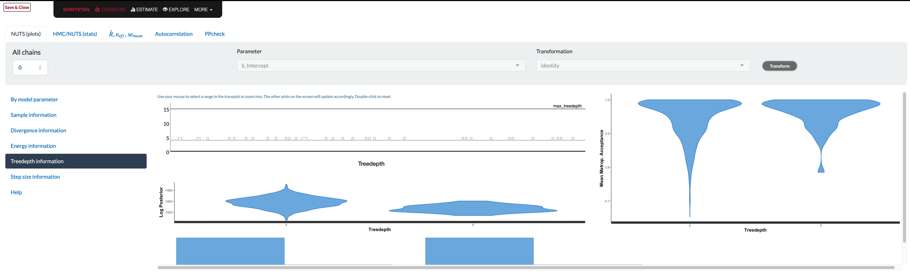

```{r setup, include=FALSE}
knitr::opts_chunk$set(
  echo      = T, 
  eval      = T, 
  message   = F, 
  warning   = F, 
  comment   = NA,
  R.options = list(width = 120),
  cache.rebuild = F,
  cache = T,
  fig.align = 'center',
  fig.asp = .7,
  dev = 'svg',
  dev.args = list(bg = 'transparent')
)

library(tidyverse)
library(broom)
library(kableExtra)
library(visibly)
library(bayesplot)

kable_df <- function(..., digits=3) {
  kable(..., digits=digits) %>% 
    kable_styling(full_width = F)
}

rnd = tidyext::rnd

color_scheme_set(scico::scico(6, palette = 'batlow', begin = .1, end = .9, direction = -1))
```


## Overview

```{r rstan-img, echo=FALSE, out.width='50%', eval=F}
knitr::include_graphics('img/r_and_stan.png')  # this doesn't work without creating an img dir in the post dir
```


<br>

Bayesian analysis takes some getting used to, but offers great advantages once you get into it.  While it can be difficult to get started, it typically should not take much to repeat an analysis one is already familiar with, say a standard regression with some (common) additional complexity like a binary outcome, interactions, random effects, etc.  What's great is that <span class="" style = "color: #b2001d;">**Stan**</span>, a programming language for Bayesian analysis, has come a long way and provides a means for (relatively) fast computation.  What's more, applied analysts do not need to know the Stan programming language to do common and even notably complicated models. Packages like rstanarm and brms, coupled with additional tools like bayesplot, tidybayes, and more, make getting and exploring results even easier than the R packages one already uses.

One of the advantages of doing Bayesian analysis with these tools is that there are many ways to diagnose model issues, problems, and failures.  This is great! Traditional analysis can often be notably more difficult in this regard, or at least typically requires more hands-on approaches, and often there can be serious model deficiencies without much notification or, if there is, there might be little one can do about it. On the other hand, current Bayesian packages are providing diagnostic information as a default part of results, have ready visualizations to explore issues, and more.


## The Stated Problem

<div style = 'text-align: center'>
<i class="far fa-question-circle fa-5x" style="padding: 20px"></i>
</div>


This is all great in general.  However, in consulting I see a consistent issue among clients starting out with Bayesian analysis and Stan packages.  Someone has a standard model, e.g. a basic regression or mixed model, but is getting problematic warnings, messages, or errors.  When they look up how to solve this problem, the documentation, forums, and other outlets, while great resources for the initiated, generally overwhelm newer and/or more applied users, as they are too technical, assume a great deal of background knowledge, are even underexplained (especially in the case of interpreting visualizations), and even suggest things that aren't typically possible (e.g. getting better data/model).  What seems straightforward to an advanced user or developer may not be even close to that for most applied analysts, and many of them (again, my experience) are left a bit deflated by the whole process.

In the beginning of Stan's ascension, the majority of people using Stan/rstan were more technically inclined, coded in Stan directly, and, when problems arose, they were willing to do a lot of extra work to solve the problems (reading articles, developing pseudo-expertise with various techniques, and more). But tools like rstanarm and brms make running Bayesian models as [easy to do](https://m-clark.github.io/easy-bayes/) as using base R functions and other non-Bayesian packages, and as Bayesian analysis has become more widely used, accepted, and presented, this has opened the Bayesian approach to practically anyone that wants to do it.

I personally don't think one needs to be an expert in Bayesian analysis to enjoy its benefits for common models, even if difficulties come up.  Nor do I think an exhaustive search through forums, technical articles, function documentation and more are necessary to deal issues that arise often.  So this is an attempt at a practical guide and one-stop shop for dealing with the most common issues that arise, interpreting results of diagnostics, and summarizing the options one can take.


## Audience

<div style = 'text-align: center'>
<i class="fas fa-users fa-5x" style="padding: 20px"></i><i class="fas fa-users fa-5x"></i><i class="fas fa-users fa-5x"></i>
</div>

Here is the presumed audience for this post:

- Wants to bayes
- Is not going to code anything in Stan directly
- Is not a statistician, nor desires technical insights about Bayesian analysis (at least not yet!)
- Is already having to learn a new tool/functions/possibly a whole system of inference
- Has probably never used the control argument for any model 


While you can do a Bayesian analysis just for the heck of it, you really need to understand a few key ideas to take advantage of what it offers. Some things you do need to know in order to use it on a basic level:

- The distributions: priors, likelihood, posterior, posterior predictive
- Iterative sampling to estimate  parameters. Even a cursory understanding of maximum likelihood would probably be enough.

You can obtain this basic info from my document [Bayesian Basics](m-clark.github.io/bayesian-basics/).


## Outline


Here is what we're going to do:

- Discuss the most common problems
- Explain conceptually what they indicate
- Provide quick solutions that should work most of the time
- Outline a practical approach for future endeavors (Part II)


## Installation issues

Your first hurdle is installation, so let's start there.  Applied users will use rstanarm, brms, or other higher level interfaces to the Stan programming language. These tools use Stan, but Stan itself requires compilation to C++. This means that to run a basic regression with brms, you'll likely be depending on multiple languages and packages for it to work.

$\rightarrow\quad$ package with basic R code  (brms, rstanarm)

$\quad\rightarrow\quad$ Model is translated to Stan (or use rstan with Stan code)
  
$\quad\quad\rightarrow\quad$ Compiled to C++  (requires compiler)
  
  
In general, installing the package you want to use will install the appropriate dependencies, and that should be enough as far as your interactive R part goes.  In some cases it may not be. If you have issues, it's maybe best to install rstan first, then your package of choice.  Issues beyond that make indicate an issue with the compiler, at which point you'll want to consult the forums.


### Mac

Mac's Catalina OS has been a problematic release to say the least.  There was a  period of time where Stan wasn't viable for many users without extensive workarounds, and even now, issues seemingly still arise with every update to Catalina. This is not specific to Stan, or R, by the way[^mac].  Then R 4.0 came along and helped some things, but also resulted in new issues That said, the Stan community have been excellent at helping people here. My own luck of late has been better, but I just assume at this point that if I update Catalina or update the packages, I may have to work through some problem.

Here are some discussions on the Stan forums for getting through installation problems.  Unfortunately a couple of these threads are now nearly a year old, and weren't closed, so some are still posting to them.  This means that any discussion prior to R 4.0 can be ignored, and you probably only want to skip towards the end of those discussions for the relevant parts.

- [Dealing with Catalina I](https://discourse.mc-stan.org/t/dealing-with-catalina/11285/) First post Oct 2019
- [Dealing with Catalina II](https://discourse.mc-stan.org/t/dealing-with-catalina-ii/11802/) First post Nov 2019
- [Dealing with Catalina III](https://discourse.mc-stan.org/t/dealing-with-catalina-iii/12731/) First post Jan 2020
- [Dealing with Catalina IV](https://discourse.mc-stan.org/t/dealing-with-catalina-iv/13502/) First post Mar 2020


### Windows

I rarely had installation issues on Windows' releases, though haven't had to use it lately.  It does require [rtools](https://cran.r-project.org/bin/windows/Rtools/) to be installed, which is good to install for R with Windows anyway.  If you are starting out, I would install it, then rstan, then your package of choice (e.g. brms). Again though, if you have issues, the Stan community will be very helpful.

[Search Windows Issues on Stan Forums](https://discourse.mc-stan.org/search?q=windows)


### Linux

I've only used Stan with Linux in a cluster computing environment. Applied users also need cluster computing on occasion, it's just that the problems will likely require IT support in that case.  I generally have not had issues, but it's not something I've done recently, and I don't have any basic Linux desktop experience.  Again though, plenty of Stan folks are willing to help.

[Search Linux Issues on Stan Forums](https://discourse.mc-stan.org/search?q=Linux)


### Other programming languages besides R

If you're using Stan with Python, Stata, Julia, etc., then you're using the Stan language directly, and you're likely already very familiar with the forums and dealing with a variety of issues.  That's not to say that you won't find something useful here, it's just that I have nothing to offer you regarding those platforms specifically.


## Example data


<div style = 'text-align: center'>
<i class="fas fa-database fa-5x" style="padding: 20px"></i>
</div>
<br>

To start out, I'm going to create some data for us to run some basic models with. To make things interesting, the true underlying model has categorical and continuous covariates, interactions, nonlinear relationships, random effects (observations are clustered in groups), and some variables are collinear.  You can skip these details if uninterested, but note that we will be purposely using under- and over-fitted models relative to this one to see what happens.

```{r create-data-setup}
library(tidyverse)

create_data <- function( N = 1000, ng = 100, seed = 1234) {
  
  set.seed(seed)
  
  X_mm = cbind(
    # a standard binary
    binary_1 = sample(0:1, N, replace = TRUE),                      
    # a relatively rare categorical
    binary_2 = sample(0:1, N, replace = TRUE, prob = c(.05, .95)),  
    # two partly collinear numeric
    mvtnorm::rmvnorm(N,
                     mean = rep(0, 3),
                     sigma = lazerhawk::create_corr(runif(3, max = .6)))
  )
  
  X_mm = cbind(
    # intercept
    1,
    X_mm,
    # a quadratic effect
    scale(poly(X_mm[,5], 3))[,2:3],
    # interaction of binary variables
    X_mm[,1]*X_mm[,2], 
    # interaction of binary 2 with numeric 1
    X_mm[,2]*X_mm[,3]
  )
  
  # add intercept
  colnames(X_mm) = c(
    'Intercept',
    'b1',
    'b2',
    'x1',
    'x2',
    'x3',
    'x3_sq',
    'x3_cub',
    'b1_b2',
    'b2_x1'
  )
  
  # coefficients
  beta = c(
    3.0,   # intercept
     .3,   # b1
    -.3,   # b2
     .5,   # x1
     .0,   # x2
     .3 ,  # x3 
     .3,   # x3_sq
    -.2,   # x3_cub
     .5,   # b1_b2 
    -.5    # b2_x1
  )
  
  # create target variable/linear predictor
  y = X_mm %*% beta
  
  # add random effect
  groups = sort(sample(1:ng, N, replace = T))
  
  re = rnorm(ng, sd = .5)[groups]  # re sd = .5
  
  # add re and residual noise
  y = y + re + rnorm(N)
  y = cbind(y, groups)
  colnames(y) = c('y', 'group')
  
  as_tibble(cbind(X_mm, y))
}


```

```{r save-true-parameters, echo=FALSE}
true_params = data.frame(
  parameter = c(
    'intercept',
    'b1',
    'b2',
    'x1',
    'x2',
    'x3 ',
    'x3_sq',
    'x3_cub',
    'b1_b2 ',
    'b2_x1',
    're sd',
    'sigma '
  ), 
    value = c(
    3.0,
     .3,
    -.3,
     .5,
     .0,
     .3,
     .3,
    -.2,
     .5,
    -.5,
     .5,
    1.0
  )
)
```


If you want to check that  the parameters are recovered, run the following.

```{r create-data-test, eval=FALSE}
dat = create_data(N = 10000)

mod = lme4::lmer(y ~ . -group + (1|group), data.frame(dat[,-1]))

mixedup::summarise_model(mod, ci = FALSE)
```

We do not need as much data for our purposes so we'll set the total sample size to 1000.  We'll drop unnecessary columns, and also make our binary covariates explicit factors, which will make things easier when want to visualize grouped effects later.

```{r create-data}
# create the primary data frame

main_df = 
  create_data(N = 1000) %>% 
  as_tibble() %>% 
  select(group, b1:x3, y) %>% 
  mutate(
    b1 = factor(b1),   # will help with visuals
    b2 = factor(b2)
  )

main_df
```


## Essential Steps for Practical Modeling

<div style = 'text-align: center'>
<i class="fa fa-shoe-prints fa-5x" style="padding: 20px"></i>
</div>

<br>


Once data is in hand there are basic steps to take for a practical modeling approach with Stan tools.


##### Use standard/default priors for the model

- For common regression models, normal or student t for the (fixed effect) coefficients. You will have to explicitly set this if using brms.
- (half) student-t for variances. Defaults are usually fine.
- Otherwise, look at the [recommendations](https://github.com/stan-dev/stan/wiki/Prior-Choice-Recommendations).


##### Build models in increasing complexity

- Never start with the 'final' model, if the fitting has issues with simpler models, things will only get worse with more complex models.
- Getting model settings squared away earlier will save time later (e.g. setting number of iterations, other options).


##### Examine convergence via Rhat, ESS, visualization

- If you run the model and get no warnings or messages, you are okay to proceed to summarize and visualize it. Any remaining issues, e.g. poor prediction, are likely to not have obvious solutions other than things like getting better data, revising theory, etc.
- Diagnostic plots are the main tool to diagnose issues that come from warnings.


##### Examine model effectiveness visually  

- There are entire packages at your disposal for visualizing model results such as <span class="pack" style = "">bayesplot</span>, tidybayes, etc.  However, standard plots can be called from rstanarm or brms functions, which are wrappers for bayesplot functions.
- Posterior predictive checks are a fundamental part of Bayesian analysis.
- Avoid using [bayes factors](https://statmodeling.stat.columbia.edu/2019/09/10/i-hate-bayes-factors-when-theyre-used-for-null-hypothesis-significance-testing/), at least as a way to substitute the null hypothesis test you would have done in the non-Bayesian setting, but also for other technical reasons.


##### Compare models using loo, posterior probabilities of models

- Compare models via predictive capabilities (leave-one-out approaches).
- There is no 'best' model in Bayesian approach or otherwise. Consider model averaging for final predictions.
- It is not necessary to lean on simpler models, though it may make things easier to do so.


Assuming you have no problems in the above process, you have more or less fulfilled the basic requirements to do more standard analyses in Bayesian form.  Great! 


## Warnings, What They Mean, and What to do About Them

<div style = 'text-align: center'>
<i class="fas fa-exclamation-triangle fa-5x" style="padding: 20px"></i>
</div>


Of course, if it was always that easy, we wouldn't be posting this. There are a few warnings that you're bound to come across at some point in modeling with the Stan ecosystem.  We'll cover these, as well as the most common solutions.  

Primary reference: [Brief Guide to Stan’s Warnings](https://mc-stan.org/misc/warnings.html)


### Rhat & Effective Sample Size

We will start with a simple standard regression model that we know is not adequate.  We will use default priors[^defaultprior] and run very few iterations. 

```{r model-start-100, warning=T, results='hide'}
# no priors, no complexity, all default settings, few iterations
library(brms)

model_start_100 = brm(
  y ~ b1 + b2 + x1 + x2 + x3, 
  data = main_df,
  iter = 100,
  verbose = F
)
```


```{r model-start-100-summary, message=TRUE}
summary(model_start_100)
```


The warnings about Rhat and effective sample size (ESS) are likely to pop up if you use default iterations for more complex models.  They mostly regard the efficiency of the sampling process, and whether you have enough samples to have stable parameter estimates.  Ideally Rhat is close to 1.0, and ESS is?

The fix for these warnings is usually simple, just let the model run for more iterations.  The default is 2000 iterations with warmup half of that.  Warmup iterations are not used in calculation of parameter estimates, so you can just increase the number of iterations relative to the warmup, or increase both by only increasing the `iter` argument.

As an example we can look at our short run model. If we plot the estimated values across each iteration for each chain, called a *trace plot*, we can see that the chains could be mixing better, but only if you are used to looking at these things.  


```{r model-start-trace-dens}
# plot(model_start_100, par = 'x1') # examine specific parameters
mcmc_plot(model_start_100, pars = c('b11', 'b2', 'x1'), type = 'combo')
```

To see what you would expect, just plot a series from a normal distribution.

```{r rnorm-trace-dens, out.width='50%'}
ggplot2::qplot(x = 1:1000,
               y = rnorm(1000),
               geom = 'line')

ggplot2::qplot(x = rnorm(1000), geom = 'density')
```

Other plots that might be of interest allow us to look at the same things from a different perspective or break out results by each chain.

```{r area-violin}
mcmc_plot(model_start_100, type = 'areas')
mcmc_plot(model_start_100, type = 'violin')
```


While things seem okay, what happens if we single out a particular chain, we might think otherwise.  In this case, the intercept and b2 coefficients may be problematic.

```{r trace-highlight}
mcmc_plot(model_start_100, highlight = 2, type = 'trace_highlight')
```


Some suggest to look at *rank plots* instead of traditional traceplots.  Really, all we've changed is looking for something 'fuzzy' to looking for 'approximately uniform', so my opinion is that it's not much of an improvement visually or intuitively.  In general, histograms, which are variants of bar charts, are rarely an improvement for any visualization.  If you do use it, you can use an overlay approach to see if the ranks are mixing, but this looks a lot like what I'd be looking for from a traceplot.

```{r rank-plots}
mcmc_plot(model_start_100, type = 'rank_hist')
mcmc_plot(model_start_100, type = 'rank_overlay')
```

#### Some technical details


##### Rhat

The $\hat{R}$ statistic measures  the ratio of the average variance of samples within each chain to the variance of the pooled samples across chains; if all chains are at equilibrium, these will be the same and Rhat will be 1.0. If the chains have not converged to a common distribution, the Rhat statistic will be greater than one.

**What we want**: values near 1.0 and less than 1.05

```{r rhat-plot}
mcmc_plot(model_start_100, type = 'rhat')  # > 1.05 problematic
```


##### ESS

Effective sample size is an estimate of the effective number of independent draws from the posterior distribution of the parameter of interest. Because the draws within a chain are not independent if there is autocorrelation, the effective sample size will be smaller than the total number of iterations.

- *Bulk ESS*: ESS for the mean/median
- *Tail ESS*: ESS for the 5% and 95% quantiles. Tail-ESS can help diagnose problems due to different scales of the chains and slow mixing in the tails.


**What we want**: ESS > 10% percent of total posterior samples for sure, but > 50% is best. Bulk-ESS > 100 times the number of chains.

```{r neff-plot}
mcmc_plot(model_start_100, type = 'neff')  # < .1 problem
```

    
##### Trace plot

Shows the estimated parameter values at each iteration.  In general you would like a random bouncing around an average value.

**What we want**: Something like random normal draws over a series.  'Grassy', 'Fuzzy caterpillar'


##### Rank plot

From bayesplot helpfile: 

> Whereas traditional trace plots visualize how the chains mix over the course of sampling, rank histograms visualize how the values from the chains mix together in terms of ranking. An ideal plot would show the rankings mixing or overlapping in a uniform distribution.  

See Vehtari et al. (2019) for details.

**What we want**: Uniform distribution, Good mixing of lines for overlay.


##### ACF plot

The acf, or autocorrelation function plot (see next section), is exactly the same thing you'd visualize for any time series.  It is a plot of a series correlation with specific lags of itself.  Autocorrelation does not bias estimates, but increased autocorrelation may be more inefficient/slower. At lag zero, the series estimates are perfectly correlated with themselves, so that's where the plot usually starts.

**What we want**: Quick drop off, but not really that important.


```{r acf-plot}
mcmc_plot(model_start_100, type = 'acf')  # < .1 problem
```


##### Efficiency plots

I have seen these often recommended, but I'm not aware of a package does them.  Aki Vehtari has supplied a walkthrough and some code, but there isn't really documentation for the functions, and they likely won't work outside of rstan objects, or at least I had limited success with brms.  Furthermore, these are getting into weeds that are beyond what I'd expect applied users to be wading through.

[Vehtari's walkthrough](https://avehtari.github.io/rhat_ess/rhat_ess.html)

[Code for functions](https://github.com/avehtari/rhat_ess/blob/master/code/monitornew.R)

[Code for plots](https://github.com/avehtari/rhat_ess/blob/master/code/monitorplot.R)


#### Solution for Rhat/ESS warnings

The general solution to Rhat and ESS warnings is simply to do more iterations. To keep posterior samples and model objects from becoming unwieldy in size[^bigobjects], consider thinning also. Thinning will also reduce autocorrelation, as the draws retained after thinning are not as correlated with one another as successive draws would be.

```{r increase-iter, eval=F}
brm(model)  # default with 4 chains, 1000 warmup 2000 total = 4*(2000 - 1000) = 4000 post-warmup draws
brm(model, warmup = 2000, iter = 4000)  # 4*(4000 - 2000) = 8000 posterior draws
brm(model, warmup = 2000, iter = 4000, thin = 8)  # 4*(4000 - 2000)/8 = 1000 posterior draws
```


### BFMI low

You may see a warning that says some number of chains had an estimated Bayesian Fraction of Missing Information (BFMI) that was too low. This implies that the adaptation phase of the Markov Chains did not turn out well, and those chains likely did not explore the posterior distribution efficiently. For more details on this diagnostic, you can see [Betancourt's article](https://arxiv.org/abs/1604.00695), but this will almost surely be too technical for many applied and even more advanced users.

In this case, the problem here is often remedied by just adding more iterations as before. I typically keep to 1000 posterior samples, which makes for nicer visualizations of distributions without creating relatively large model objects.

```{r model-start-checks, results='hide', warning=TRUE}
model_start = update(model_start_100, warmup = 2000, iter = 2250) # 1000 posterior draws
```


We no longer have any warnings, and even one of our more problematic coefficients looks fine now.

```{r model-start-checks-show}
summary(model_start)
plot(model_start, par = 'b2')
```


#### Solution for low BFMI

If there aren't other serious problems, add more iterations.  In some cases, switching from a heavy-tailed prior (e.g. student t) to normal would be helpful, but this typically would involve having to write Stan code directly to [reparameterize the model](https://mc-stan.org/docs/2_18/stan-users-guide/reparameterization-section.html). Otherwise, you will approach it similarly to the problem of [divergent transitions][divergent transitions].


### Tree Depth

Tree depth is a more technical warning that has to do with the details of Hamiltonian Monte Carlo. Practically speaking:

> Lack of convergence and hitting the maximum number of leapfrog steps (equivalently maximum tree depth) are indicative of improper posteriors ~ Stan User Guide

Sometimes you'll get a warning about hitting maximum tree depth, and without getting overly technical, the fix is easy enough.  Just set the maximum higher.


#### Solution for max tree depth

Use the control argument to increase the value beyond 10.

```{r tree-depth, eval=FALSE}
model_update_treedepth = update(
  model,
  warmup = 1750,
  iter = 2000,
  control = list(max_tree_depth = 15)
)
```


### Divergent Transitions

*Divergent transitions*  are a technical issue that indicates something may be notably wrong with the data or model ([technical details](https://mc-stan.org/docs/2_24/reference-manual/divergent-transitions.html)). They indicate that the sampling process has 'gone off the rails' and the iteration's results and anything based on them (i.e. subsequent draws, parameter estimates) can't be trusted.  Unlike the other problems we've discussed, this is the harder one to navigate.

Why might this happen?

- insufficient data for the model's complexity
- poor model
- high collinearity
- improper priors
- problematic priors
- separability (logistic regression)
- any number of other things


As an example, I'll make a relatively complex model with only a small random sample of the data, improper priors, and use very few warmups.

```{r divergent-model, warning=T, message = T, results='hide'}
model_problem = brm(
    bf(
      y ~ b1*b2*x1 + x2*b2 + x3*b2 + (1 + x1 + b2|group),
      sigma ~ x1 + b2
    ),
  data   = main_df %>% slice_sample(prop = .1),
  family = student,
  cores  = 4,
  warmup = 10,
  iter   = 1010,
  thin   = 4,
  seed   = 12
)
```

So what do we do in this case? Well let's start with visual inspection.


#### Visualization: Pairs plot

A  diagnostic tool that is typically suggested to look at with divergent transitions is the <span class="emph" style = "">pairs plot</span>.  It is just a scatterplot matrix of the parameters estimates (and log posterior value), but it suffers from a few issues.  The plot is slow to render even with few parameters, and simply too unwieldy to use for many typical modeling situations. If you somehow knew in advance which parameters were causing issues, you could narrow it down by only looking at those parameters. But if you knew which parameters were the problem, you wouldn't need the pairs plot.  

Another issue is that it isn't what you think it is at first glance.  The upper diagonal is not just the flipped coordinates of the lower diagonal like every other scatterplot matrix you've seen.  The chains are split such that half are used for the above diagonal plots, and the other for the lower, with the split being based on the amount of numerical error (above or below the median).   I suspect this may not help applied users interpret things, but the gist is, that if your red points show up on the upper diagonal, changing the `adapt_delta` part of the control argument may help ([see below][Solution for divergent transitions]), otherwise it likely won't.   

Let's take a look at the pairs plot anyway.  I'll use `hex` bins instead of standard points because the point plots have no transparency by default.  In addition, we'll use a density plot on the diagonal, instead of the histogram.

```{r pairs-plot-model-start-complex, echo=-1, cache.rebuild=T}
color_scheme_set()
mcmc_plot(
  model_problem,
  pars = c('b_b11', 'b_b21', 'sigma'),
  type = 'pairs',
  diag_fun = 'dens',
  off_diag_fun = 'hex',
  fixed = TRUE
)
```


```{r pairs-divergent, eval=FALSE, echo=FALSE}
# mcmc_pairs(
#   model_problem,
#   pars = c('b_b11', 'b_b21', 'sigma'),
#   # type = 'pairs',
#   diag_fun = 'dens',
#   off_diag_fun = 'hex',
#   np = nuts_params(model_problem),
#   condition = pairs_condition(nuts = 'divergent__')
# )
```


With problematic cases, what you might see on the off-diagonal plots is some sort of 'funneling', which would indicate where the sampler is getting stuck in the parameter space.  However, this visual notion isn't defined well, as it may be happening without being obvious, displaying just a bump[^funnelcloud].  But you'll also regularly see correlated parameters, but it's unclear whether these might necessarily be a problem in a given situation.

For the main model the pairs plot for all parameters takes several seconds to produce, and even with the hex option still looks pretty poor.  It shows the intercept and `b2` parameters to be notably correlated, possibly due to the poor priors.

```{r pairs-plot-model-start, echo=-1}
color_scheme_set()
mcmc_plot(
  model_start,
  type = 'pairs',
  off_diag_fun = 'hex',
  diag_fun = 'dens'
)
```

**What we want**: Roughly no relation among parameters.


#### Visualization: Parallel Coordinates Plot

It is also suggested to look at parallel coordinates[^parcoord], but unfortunately there are issues with these plots as well.  The order of these is arbitrary, but the order can definitely influence your perception of any patterns.  Also, unless everything is on similar scales, they simply aren't going to be very useful, but even if you scale your data in some fashion, the estimates given divergent transitions may be notably beyond a reasonable scale.  

As in our pairs plot, we'd be looking for a pattern among the divergences.  If these aren't the case we're told that the divergences are probably false positives[^FPdiv]

```{r par-coord}
library(bayesplot)

mcmc_parcoord(
  model_problem,
  pars = vars(matches('^b')),
  size = .25, 
  alpha = .01,
  np = nuts_params(model_problem),  # without this div trans won't be highlighted
  np_style = parcoord_style_np(
    div_color = "#ff5500",
    div_size = 1,
    div_alpha = .1
  )
)
```

**What we want**: Roughly no obvious pattern. If the divergence lines are not showing any particular concentration, it could be that these are false positives.


#### Solution for divergent transitions


Unfortunately the solution to divergent transitions is usually not straightforward. The typical starting point for solving the problem of divergent transitions is to use the control argument to increase `adapt_delta` to .99[^adapt_delta] and let your model have more warmup/total iterations. In the cases I see for myself and clients, increasing `adapt_delta` rarely helps, but it doesn't hurt to try[^pairsprob].

```{r adapt-delta, eval = F}
model = brm(..., control = list(adapt_delta = .99))
```

Aside from that you will have to look more deeply, including issues with priors, model specification, and more.  I find this problem often comes from poor data (e.g. not scaled, possible separation in logistic models, etc.) combined with a complex model, and beyond that, the priors may need to be amended.  As You may need to simplify the model.  As an example, for mixed models, it may be that some variance components are not necessary. You should at least not have uniform priors for any parameter, and as we'll see in Part II, you can use a simulation approach to help choose better priors.  Often the data and prior checks are better approach to solving the problem.


Many solutions offered on the forums assume you are coding in Stan directly so things like reparameterizing your model, using specific types of priors, etc.  If you are writing Stan code rather than using a modeling package, you definitely need to double check it, as typos or other mistakes can certainly result in a problematic model. However, this post is for those using modeling packages, so I will not offer such remedies.


Resource: [Case study: Divergences and Bias](https://mc-stan.org/users/documentation/case-studies/divergences_and_bias.html)

Resource: [Divergent Transitions A Primer](https://discourse.mc-stan.org/t/divergent-transitions-a-primer/17099)


### Other messages

Certain builds of rstan for certain settings (e.g. specific operating systems) will often have warnings or other messages.  Oftentimes it looks like a bunch of gobbledygook, which is typically something happening at the C++ level. If your model runs and produces output, you can typically ignore most cases. However, even then you should look it up on the forums just to be sure.

#### Parser warnings

Parser warnings are either a deprecation warning or another more serious kind (Jacobian). The latter will not happen if you're using higher level interfaces (e.g. brms) rather than programming in Stan directly. The other kind, deprecation warnings, are not something you can do anything about, but the developer of the package will likely need to make minor changes to the code to avoid them.  I've never seen parser warnings from using rstanarm or brms.


#### Compilation warnings

Compiler warnings happen regularly and indicate something going on at the compiler level, typically that something in Stan is being compiled but not used.  You can ignore these.


#### Solutions for other messages

If you are using a package to interface with Stan and not having an issue with the model (i.e. it runs), these messages can largely be ignored.


## Other Issues

### But it's slow!

Another problem people seem to be concerned with is the speed of the analysis.  If you have a lot of data, or more to the point, a lot of parameters, your model can be very slow.  For standard models with rstanarm and brms, there may be no real benefit if you have millions of data points and simpler models.  If your model is only taking a couple minutes, then you really have nothing to complain about- watch some YouTube or something while it runs. If your model takes on the order of hours, work with less data or simpler models until you have your modeling code, plots, etc. squared away.  At that point you can run your primary analysis and wait it out.


#### Solutions for a slow model

- Scale the data: for any model, Bayesian or otherwise, scaling the data will usually result in a more manageable estimation process.
- Use more informative priors: why explore areas of the posterior that aren't going to lead to plausible results?
- Possibly use less iterations if there are no other issues.
- If possible, work with less data or simpler models until ready for the real deal.
- If possible, work with a different version of the model that can still answer the question of interest. For example, if an ordinal model is causing a lot of issues, and you're not interested in category specific probabilities, just treat the target variable as numeric[^reparameterize].


### shinystan

The shinystan package makes exploring model diagnostics actually fun! Using launch_shinystan opens a browser window, providing interactive visualizations to help you see what's going on with your model.  You can look at many of the previous plots, plus a few others we haven't shown.

Unfortunately the documentation in the browser doesn't really tell you what to look for in these plots.  The glossary contains information that is likely overly technical for applied or new users, and if there is a problem, there's not really a whole lot to go on.  In addition, some plots are just poor (e.g. trying to assess whether overlapping histograms are similar), or are probably only useful if you have very obvious problem (e.g. lots of divergent transitions).  As an example, consider the tree depth plots.  What would be good here? 



The documentation tells you the value should be somewhere between 0 and whatever `max_treedepth` is set at.  If they are large, the documentation states the problem could be due to different things, but the solutions are to either reparameterize of the model (probably not possible unless using Stan code directly), or just increase the value.  It doesn't seem to tell you what those plots are supposed to look like, and unfortunately that renders them as not very useful. The divergence and energy plots are similarly underexplained.  Many refer users to Betancourt's wonderful articles on the details, but these are far too technical for those not already steeped in the approach[^betanwhat].

All that said, luckily there is a nice walkthrough if you do have a hankering to go down that path.  This provides more details on the statistics and on what you should be looking for in the visualizations.

- Resource: [Visual MCMC diagnostics](https://mc-stan.org/bayesplot/articles/visual-mcmc-diagnostics.html)


## Summary: The Practical Approach to Diagnostics

For applied analysts, I would suggest primarily focusing on the density plots and trace plots for parameters.  For the density plots of regression coefficients, these should be roughly normal looking, for variance parameters you may see skewness, especially if the estimate is relatively near zero with smaller data sets. Trace plots in general should look 'grassy' or like a 'fuzzy caterpillar', which isn't very helpful, but deviations are usually striking and obvious in my experience.  If you see chains that look like they are getting stuck around certain estimates, or separating from one another, this would indicate a problem.  If the chains are not converging with one another, you probably already were getting warnings and messages.  You can then examine other visualizations that might be appropriate to the problem, and take the appropriate steps outlined to try and solve those issues.

Many of the problems can be solved by increasing the warmup and number of iterations.  After that, setting control parameters may be enough.  For more serious issues, you may need to try different priors or even a different model.  If none of the above solves your problems, you are almost certainly trying too complex of a model for your data.

In general, doing Bayesian analysis can be easy, and hopefully it will be for you.  Many common problems have simple solutions, and the more serious ones will only make you a better Bayesian though the efforts you take to solve them. Rather than see them as a nuisance, see them as a learning opportunity, and you'll enjoy your results even more when you finally resolve them.  Remember that you may not be in your comfort zone, and that's okay.  Things will come around eventually, and you'll solve these problems more easily in the future!


## Resources

### General

[Aki Vehtari's website](https://avehtari.github.io/) has demos and explanation for things like model comparison, Rhat/Neff, and more.

[Bayesplot Vignette for Diagnostic Plots](https://mc-stan.org/bayesplot/articles/visual-mcmc-diagnostics.html)

[Jeffrey Arnold's Bayesian Notes](https://jrnold.github.io/bayesian_notes/) has nice examples of many models and good summaries otherwise.

[Bayesian Basics](m-clark.github.io/bayesian-basics/), an applied overview of Bayesian analysis with Stan as the backdrop.


### Priors

[Prior Choice Recommendations](https://github.com/stan-dev/stan/wiki/Prior-Choice-Recommendations) by the Stan group.

[rstanarm vignette](https://cran.r-project.org/web/packages/rstanarm/vignettes/priors.html)


### Rhat/ESS

[Stan Reference on Effective Sample Size](https://mc-stan.org/docs/2_24/reference-manual/effective-sample-size-section.html)


### Divergence

[Stan Reference on Divergent Transitions](https://mc-stan.org/docs/2_24/reference-manual/divergent-transitions.html)

[Divergent Transitions A Primer](https://discourse.mc-stan.org/t/divergent-transitions-a-primer/17099)

[Case study: Divergences and Bias](https://mc-stan.org/users/documentation/case-studies/divergences_and_bias.html)


### Misc

[brms vignettes](https://cran.r-project.org/web/packages/brms/)

[Use CmdStan to save memory](http://mc-stan.org/cmdstanr/articles/cmdstanr.html)


[^betanwhat]: Betancourt, whose work I admire greatly, typically makes my head spin.

[^defaultprior]: For this model, they are uniform/improper priors for the regression coefficients and half-t for the residual variance.  You can always use <span class="func" style = "">prior_summary</span> on a brms model to see this.

[^parcoord]: I swear sometimes we're taking a step back in time with some of these plots.  All of the diagnostic plots defaults appear to be styles you'd find in Tukey's EDA from 1950.  You don't necessarily need to get fancy, but surely the defaults could be better.

[^funnelcloud]: And I say this as someone with  experience detecting funnel clouds.

[^adapt_delta]: In my experience, there isn't a need to guess between .80 and .99 as the time differences are typically negligble.  If it doesn't work at .99, it won't at .9999 either.

[^bigobjects]: With more posterior samples comes slower visualizations and possibly other computations.

[^mac]: I will spare the details of my opinions, which are almost entirely negative.

[^lakeland]: In the same post, as a comment, Daniel Lakeland proposes an alternative approach is whether the posterior estimate falls within the 95% highest density interval of the prior.  This is available via the method argument:  `bayestestR::check_prior(model_baseline, method = 'lakeland')`.

[^looic]: The `looic` is just -2*`elpd_loo`, as we often use -2*log likelihood (a.k.a. deviance) in standard approaches for AIC.  In this case, `elpd_loo`, is a leave-one-out density.  `p_loo` is the 'effective number of parameters', which users of penalized regression and mixed models will have some familiarity with.

[^reparameterize]: It is often suggested in the Stan world to reparameterize models.  However, this advice doesn't really apply in the case of using rstanarm or brms (i.e. where you aren't writing Stan code directly), and it assumes a level of statistical expertise many would not have, or even if they do, route to respecifying the model may not be obvious.

[^pairsprob]: Another issue is that you could change how the chains are split and it could potentially dramatically change the how the pattern of divergent transitions looks. 

[^FPdiv]: This seems counter to the common suggestion that even 1 divergent transition renders results suspect.  I've never seen results meaningfully change for something with a couple divergent transitions to one that has none, and often when there are that few even rerunning the model will result in no problem.