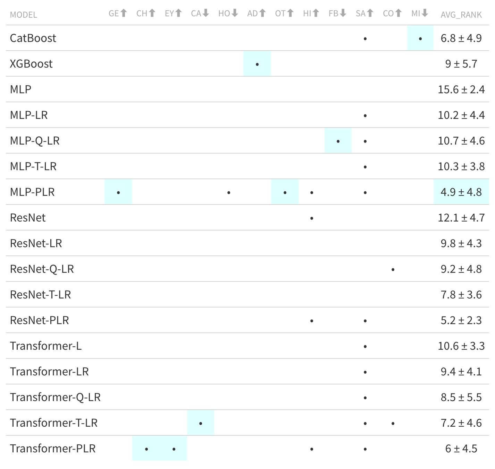

## Introduction

In a previous post, I offered [a summary of several articles](../2021-07-15-dl-for-tabular/) that came out over the summer of 2021 regarding the application of deep learning (DL) methods to tabular data.  DL has shown astounding success in the natural language processing, computer vision, and other fields, but when it comes to the sorts of data common in other situations, especially where data is usually smaller and of mixed source and type (e.g. demographic, social science, biological), results were mostly unimpressive.  In particular, it did not appear that DL methods could consistently compete with, much less consistently beat, standard machine learning (ML) approaches such as gradient boosting (e.g. XGBoost).  Here I provide a bit of an update, as another few articles have come along continuing the fight.

##  On Embeddings for Numerical Features in Tabular Deep Learning

- *Authors*: Gorishniy, Rubachev, & Babenko
- *Year*: 2022

### Overview

@gorishniy2022embeddings pit several architectures such as standard multilayer perceptron (MLP), ResNet, and their own transformer approach (see @gorishniy2021tabular). Their previous work, which was summarized in my earlier post, was focused on the architecture, while here they focus on the *embedding* approaches. The primary idea is to take the value of some feature and expand it to some embedding space, then use the embedding in lieu of the raw feature. It can essentially be seen as a pre-processing task. 

One approach they use is *piecewise linear encoding* (PLE), which they at one point describe as 'a continuous alternative to the one-hot encoding', to give some context[^bspline].  Another embedding they use is basically an fourier transform, which is something that people (including our team at [Strong](https://strong.io)) have used in boosting, so I'm a bit curious why they don't do Boosting + embeddings for comparison, but I digress.

[^bspline]: A quick look suggests it's not too  dissimilar to a [b-spline](https://en.wikipedia.org/wiki/B-spline#Definition). 

### Data

- 12 public datasets mostly from  previous works on tabular DL and Kaggle competitions.
- Sizes were from ~10K to >1M. 
- Target variables were binary, multiclass, or numeric. 
- The number of features ranged from 8 to 200.  
- 9 of 12 data sets had only numeric features, two had a single categorical feature, and unfortunately, only one of these might be called truly *heterogenous*, i.e., with a notable mix of categorical and numeric features[^heteroboost].  

[^heteroboost]: I'll let you go ahead and make your own prediction about which method was best on that data set.

### Models Explored

- *CatBoost*
- *XGBoost*
- *MLP*, *MLP\**
- *ResNet*, *ResNet\**
- *Transformer\**

\* Using proposed embeddings

### Quick Summary

- A mix of results with no clear/obvious winners (results are less distinguishable if one keeps to the actual precision of the metrics, and even less so if talking about statistical differences in performance)
- Embedding-based approaches tend to improve over their non-embedding counter parts (e.g. MLP + embedding > MLP), this was possibly the strongest result
- I'm not sure we could say the same for ResNet, where results were similar with or without embedding
- XGBoost was best on the one truly heterogenous dataset

 

## SAINT: Improved neural networks for tabular data via row attention and contrastive pre-training

- *Authors*: Somepalli, Goldblum, Schwarzschild, Bayan-Bruss, & Goldstein
- *Year*: 2021

### Overview

Uses *attention* over rows and columns, along with embedding/data augmentation.  They distinguish the standard attention over features, with intersample attention of rows.  In addition, they use *CutMix* for data augmentation (originally devised for images), which basically combines pairs of observations to create a new observation[^smote].

[^smote]: This seems a bit simple to me, and it's not clear at first how well this would actually preserve feature correlations. My gut tells me the feature correlations of this approach would be reduced relative to the observed, since the variability of the new observations is likely reduced.  I would think something like SMOTE, random (bootstrap) sampling, or other approaches might do the same or better.

### Data

- 16 data sets
- All classification, 2 multiclass 
- 6 are heterogenous, 2 notably so
- Sizes 200 to almost 500K

### Models Explored

- Logistic Regression (!)
- Random Forest
- Boosting
  - CatBoost
  - XGBoost
  - LightGBM
- MLP
- TabNet
- VIME
- TabTransformer
- SAINT

### Quick Summary

- First blush suggests the SAINT does quite well on some of the data and average AUROC across all datasets is higher than XGB 

- Main table shows only 9 data though, which they call 'representative' but it's not clear what that means when you only have 16 to start. One dataset showed near perfect classification for all models so will not be considered. Of the 15 remaining:

- SAINT wins 10 (including 3 heterogenous)
- Boosting wins 5 (including 2 heterogenous)

- Issue, SAINT benefits from data augmentation. This could have been applied to any of the other models but was not done so.

- At least they also used some form of logistic regression as a baseline, though no details provided on implementation (e.g. regularization, including interactions). I don't think this is done enough.

This is an interesting result, but notably dampened by lack of including a numeric target /approach and more heterogenous settings.  The authors include small data settings which is great, and are careful to not generalize despite some good results.  I can appreciate this.

## Kossen paper

### Overview

- focus on wholistic processing of multiple inputs
- though author's acknowledge a clear thread/history here, GPs, Kernel regression, DL versions thereof, so I'm not sure this is the fundamental shift they claim vs. further extension/expansion into the DL domain.  Also, auto learning of feature interactions is standard even in basic regularized regression settings, but here their focus is on observation interactions (but see knn regression)
- at predict they utilize the correlations of inputs of training to ultimately make a prediction (knn regression for DL?)

###  Data

- 10 datasets from UCI, 2 are image
- 4 binary, 2 multiclass, 4 numeric

### Models Explored

- NPT
- Boosting
  - GB
  - XGB
  - CatBoost
  - LightGBM
- Random Forest
- TabNet
- Knn

### Quick Summary

- No strong difference between performance of these models and best boosting model for any type of data
- was best on binary classification, but similar to catboost
- same as xgb and similar to MLP on multiclass
- Boost better on numeric outcomes, but NPT similar
- TabNet continues to underperform
- Knn worst but knew that was going to be the case

## Conclusion

I feel like ground has been made in that architectures can now consistently perform as well as boosting methods.  In the end, it doesn't appear strong enough to warrant a switch from boosting for truly heterogenous data, or even tabular data in general.  And to my knowledge no work looks at highly structured data, but I suspect this won't matter too much for pure prediction results.

Questions possibly answered:
- odds of complexity winning on hetero vs. non-hetero data
- odds of complexity winning with numeric vs. classification

## Guidelines for future research

- Always use heterogenous data. For giggles let's say 20%+ of the  minority feature type.
- Features should at least be minimally correlated, if not notably so.
- Image data results are not interesting (who is using boosting on this in practice?)
- Numeric outcomes should at least be as much of focus as categorical outcomes
- Include small data 
- Include very structured data (e.g. clustered with repeated observations, geo points, time series)
- Use a flexible GAM or similar penalized regression as a baseline statistical model
- Don't claim differences that you don't have precision to do so, or at least back up with a statistical test
- Note your model variants **before** analyzing any data. Tweaking/torturing model architecture after results don't pan out is akin ot p-hacking in the statistical realm, and wastes both researcher and reader's time
- It is unlikely anyone will be interested in three decimal place differences for rmse/acc type metrics, and statistically, results often don't even support two decimal precision
- If MoE result in the metrics overlapping, while statistically they could be different, practically they probably aren't to most readers. Don't make a big deal about it.
- Report how your obtaining uncertainty in estimates

