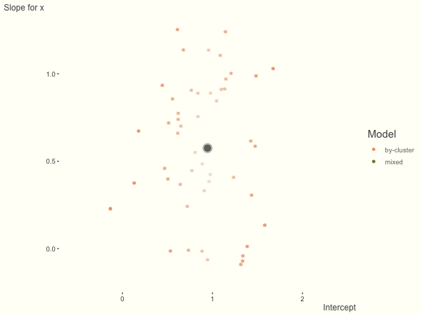

```{r setup, include=FALSE}
knitr::opts_chunk$set(
  echo = T, 
  eval = F,
  message = F, 
  warning = F, 
  comment = NA,
  R.options=list(width=120), 
  cache.rebuild=F, 
  cache=FALSE,
  fig.align='center', 
  fig.asp=1,
  dev = 'svg', 
  dev.args=list(bg = 'transparent')
)

options(gganimate.dev_args = list(
  width = 600, 
  height = 450#, 
  # bg = 'transparent'   # this will just mess up traces unfortunately
  )
) 

library(tidyverse); library(broom); library(kableExtra); library(visibly)

kable_df <- function(..., digits=3) {
  kable(..., digits=digits) %>% 
    kable_styling(full_width = F)
}
```


## Introduction

The following is a demonstration of <span class="emph">shrinkage</span>, sometimes called <span class="emph">partial-pooling</span>, as it occurs in <span class="emph">mixed effects models</span>.   For some background, one can see the section of my document on mixed models [here](https://m-clark.github.io/mixed-models-with-R/random_slopes.html#comparison-to-many-regressions), and the document in general for an introduction to mixed models.  Part of the inspiration of this document comes from some of the visuals seen [here](https://www.tjmahr.com/plotting-partial-pooling-in-mixed-effects-models/).

It is often the case that we have data such that observations are clustered in some way (e.g. repeated observations for units over time, students within schools, etc.).  In mixed models, we obtain cluster-specific effects in addition to those for standard coefficients of our regression model. The former are called <span class="emph">random effects</span>, while the latter are typically referred to as <span class="emph">fixed effects</span> or <span class="emph">population-average</span> effects.

In other circumstances, we could ignore the clustering, and run a basic regression model.  Unfortunately this assumes that all observations behave in the same way, i.e. that there are no cluster-specific effects, which would often be an untenable assumption.  Another approach would be to run separate models for each cluster.  However, aside from being problematic due to potentially small cluster sizes in common data settings, this ignores the fact that clusters are not isolated and potentially have some commonality.

Mixed models provide an alternative where we have cluster specific effects, but 'borrow strength' from the population-average effects.  In general, this borrowing is more apparent for what would otherwise be more extreme clusters, and those that have less data.  The following will demonstrate how shrinkage arises in different data situations. 

## Analysis

For the following we run a basic mixed model with a random intercept and random slopes for a single predictor variable. There are a number of ways  to write such models, and the following does so for a single cluster $c$ and observation $i$. $y$ is a function of the lone covariate $x$, and otherwise we have a basic linear regression model.  In this formulation, the random effects for a given cluster ($re_{*c}$) are added to each fixed effect (intercept $b_0$ and the effect of $x$, $b_1$). The random effects are multivariate normally distributed with some covariance.  The per observation noise $\sigma$ is assumed constant across observations.

$$\mu_{ic} = (b_0 + \mathrm{re}_{0c})+ (b_1+\mathrm{re}_{1c})*x_{ic}$$
$$\mathrm{re}_{0}, \mathrm{re}_{1} \sim \mathcal{N}(0, \Sigma)$$
$$y \sim \mathcal{N}(\mu, \sigma^2)$$

Such models are highly flexible and have many extensions, but this simple model is enough for our purposes.


### Data

Default settings for data creation are as follows:

- `obs_per_cluster` (observations per cluster) = 10
- `n_cluster` (number of clusters) = 100
- `intercept` (intercept) = 1
- `beta` (coefficient for x) = .5
- `sigma` (observation level standard deviation) = 1
- `sd_int` (standard deviation for intercept random effect)= .5
- `sd_slope` (standard deviation for x random effect)= .25
- `cor` (correlation of random effect) = 0
- `balanced` (fraction of overall sample size) = 1
- `seed` (for reproducibility) = 888

In this setting, $x$ is a standardized variable with mean zero and standard deviation of 1. Unless a fraction is provided for `balanced`, the $N$, i.e. the total sample size, is equal to `n_cluster` * `obs_per_cluster`. The following is the function that will be used to create the data, which tries to  follow the model depiction above. It requires the tidyverse package to work.

```{r create_data, eval=TRUE}
create_data <- function(  
  obs_per_cluster = 10,
  n_cluster = 100,
  intercept = 1,
  beta = .5,
  sigma = 1,
  sd_int = .5,
  sd_slope = .25,
  cor = 0,
  balanced = TRUE,
  seed = 888
  ) {
  
  set.seed(seed)

  cluster = rep(1:n_cluster, each = obs_per_cluster)
  N = n_cluster * obs_per_cluster
  x = rnorm(N)

  varmat = matrix(c(sd_int^2, cor, cor, sd_slope^2), 2, 2)
  
  re = mvtnorm::rmvnorm(n_cluster, sigma = varmat)
  colnames(re) = c('Intercept', 'x')
  
  y = (intercept + re[cluster, 'Intercept']) + (beta + re[cluster, 'x'])*x + rnorm(N, sd = sigma)
  
  df = tibble(
    y,
    x,
    cluster
  )
  
  if (balanced < 0 | balanced > 1) {
    stop('Balanced should be a proportion to sample.')
  } else {
    df = sample_frac(df, balanced)
  }
  
  df
}
```

The plotting functions can be found on [GitHub]() for those interested, but won't be shown here[^plotfun].  

```{r create_plot_data, echo=FALSE, eval=TRUE}
create_plot_data <- function(model, data = df) 
  {
  # bind re + lm by group results
  plot_data_re_lm = 
    bind_rows(
      coef(mod)$cluster %>% 
        rownames_to_column(var = 'cluster') %>% 
        mutate(Model = 'mixed'),
      map_df(lmList(y ~ x|cluster, data), 
             function(x) as.data.frame(t(coef(x))), 
             .id = 'cluster') %>% 
        mutate(Model = 'by-cluster')
  ) %>% 
    rename(Intercept = `(Intercept)`)
  
  # fixed effect estimates
  fe_data =  fixef(mod) %>% 
    t() %>%  
    data.frame() %>% 
    rename(Intercept = X.Intercept.) %>% 
    mutate(cluster=1,
           Model = 'by-cluster')
  
  list(coefficients = plot_data_re_lm, 
       fixed_effects = fe_data)
}
```


```{r plot_fun, echo=FALSE, eval=TRUE}
# right now, this will not work when rendering with knitr, as the 'along' is not
# an axis.  It works fine in general, so not sure what to do.
plot_fun <- function(
  plot_data, 
  pt_size = 1, 
  fe_size = 6, 
  line_alpha = .1,
  animate = T,
  zoom = T,
  int_multiplier = .5,
  slope_multiplier = .25,
  ...) 
  {
  library(gganimate)
  
  if (!is.numeric(pt_size)) {
    plot_data$coefficients$pt_size = plot_data$coefficients[[pt_size]]  # pt size based on varname
  } 
  
  # points closer to FE should be more transparent
  transparency = plot_data$coefficients %>% 
    filter(Model == 'by-cluster') %>% 
    select(Intercept, x) %>% 
    apply(., 1, function(r) r - plot_data$fixed_effects %>% select(Intercept, x)) %>% 
    do.call(rbind, .) %>% 
    scale() %>% 
    abs() %>% 
    rowMeans() 
  
  transparency[is.na(transparency)] = 0   # if unbalanced, might not have slope if n_obs = 1
  
  plot_data$coefficients$transparency = scales::rescale(rep(transparency, 2), to=c(0, 1))
  
  # base point plot
  
  p0 = plot_data$coefficients %>% 
    ggplot(aes(x = Intercept, y = x, group = cluster)) 
  
  # deal with point size input
  if (is.numeric(pt_size) & length(pt_size == 1)) {
    p = p0 + 
      geom_point(aes(color=Model, alpha = transparency),
                 size = pt_size)
  } else {
    p = p0 +
      geom_point(aes(color = Model, 
                     alpha = transparency, 
                     size  = pt_size))
  }
    
  p = p +
    geom_point(size = fe_size - 2, alpha = .5, data = plot_data$fixed_effects) +
    geom_point(size = fe_size, alpha = .25, data = plot_data$fixed_effects) +
    geom_path(color = 'black',
              alpha = line_alpha,
              arrow = arrow(length = unit(.01, "npc"), ends='first')
              ) +
    {
      if (animate) {
        transition_reveal(as.integer(factor(Model)), keep_last = T) }
    } +
    {
      # attempt to zoom based on sd input
      if (zoom) {
        coord_cartesian(xlim = c(plot_data$fixed_effects[1, 'Intercept'] - 3*int_multiplier,
                                 plot_data$fixed_effects[1, 'Intercept'] + 3*int_multiplier),
                        ylim = c(plot_data$fixed_effects[1, 'x'] - 3*slope_multiplier, 
                                 plot_data$fixed_effects[1, 'x'] + 3*slope_multiplier))}
    }  +
    scico::scale_color_scico_d(begin = .5, end = .75, direction = -1) + 
    scale_size_continuous(range = c(.5, 4)) +
    guides(alpha = 'none', size = 'none') +
    theme_trueMinimal() + 
    # transparency ignored by animate; so make same as bg
    theme(panel.background = element_rect(fill = "#fffff8", color = NA),  
          plot.background = element_rect(fill = "#fffff8", color = NA),
          axis.title.y = element_text(angle = 0))
  
  if (animate) animate(p, ...)  # see bg note above, transparency will screw up plot
  else p
  
}
```

## Run the baseline model

We will use <span class="pack">lme4</span> to run the analysis.  We can see that the model recovers the parameters fairly well, even with the default of only 1000 observations.

```{r run_baseline_model, eval=TRUE}
df = create_data()

library(lme4)
mod = lmer(y ~ x + (x|cluster), df)
summary(mod, cor=F) 
```


## Visualize baseline model

Now it is time to visualize the results.  We will use <span class="pack">gganimate</span> to bring the shrinkage into focus.  We start with the estimates that would be obtained by a fixed effects, or 'regression-by-cluster' approach.  The movement shown will be of those (default 100) cluster-specific estimates toward the mixed model estimates.  On the x axis is the estimate for the intercepts, on the y axis are the estimated slopes of the `x` covariate.  The plots for this and other settings are zoomed in based on the random effect variance inputs for this baseline model, in an attempt to make the plots more consistent and comparable across the different settings.  As such, the most extreme points often will not be shown at their starting point.

```{r vis_baseline_model, echo=FALSE, eval=F}
plot_data = create_plot_data(model = mod)
p = plot_fun(plot_data = plot_data, end_pause = 20)
p
anim_save('img/shrinkage/baseline.gif')
```

<!-- Relative to post folder -->

```{r baseline_gif, echo=F, eval=T, dev.args=list(bg = 'transparent'), cache=FALSE}
knitr::include_graphics('../../img/shrinkage/baseline.gif')
```


We see more clearly what the mixed model does.  The general result  is that cluster-specific effects (lighter color) are shrunk back toward the population-average effects (the 'black hole'), as the imposed normal distribution for the random effects makes the extreme values less probable. Likewise, those more extreme cluster-specific effects, some of which are not displayed as they are so far from the population average, will generally have the most shrinkage imposed.  In terms of prediction, it is akin to introducing bias for the cluster specific effects while lowering variance for prediction of new data, and allows us to make predictions on new categories we have not previously seen - we just assume an 'average' cluster effect, i.e. a random effect of 0.

Now we'll look at what happens under different data circumstances.

## More subject level variance

What happens when we add more subject level variance?  The mixed model will show relatively less shrinkage, as what were previously less probable outcomes are now more probable[^hownormalworks], and thus opting for the clusters to speak for themselves.

```{r add_subject_var, echo = 1}
df = create_data(sd_int = 1, sd_slope = 1)
mod = lmer(y ~ x + (x|cluster), df)
plot_data = create_plot_data(model = mod)
plot_fun(plot_data = plot_data, end_pause = 20)
anim_save('img/shrinkage/add_subject_level_variance.gif')
```


## More slope variance

If we add more slope variance relative to the intercept variance, this more  or less changes the orientation of the original plot.  The shrinkage will be more along the x axis.

One point to keep in mind is that the slope variance is naturally on a very different scale than the intercept variance, usually many times smaller[^slopescale]. This can make the model more difficult to estimate.  As such, scaling the covariate (e.g. to mean 0 and standard deviation of 1) is typically recommended, and at least in the linear model case, scaling the target variable can help as well. 

```{r add_slope_var, echo=1}
df = create_data(sd_int = .25, sd_slope = 1)
mod = lmer(y ~ x + (x|cluster), df)
plot_data = create_plot_data(model = mod)
plot_fun(plot_data = plot_data, end_pause = 20)
anim_save('img/shrinkage/more_slope_var.gif')
```



## Fewer observations per cluster

If we have fewer observations within each cluster, the more likely extreme values will present in the by-cluster approach, and thus more shrinkage is applied when using a mixed model. In this setting, we have relatively less knowledge about the groups, so we would prefer to lean our cluster estimates toward the population average. In the most extreme case of having only one or two observations per cluster, we could only estimate the fixed effects as the cluster-specific effects[^singletons].

```{r fewer_observations, echo = 1}
df = create_data(obs_per_cluster = 3)
mod = lmer(y ~ x + (x|cluster), df)
plot_data = create_plot_data(model = mod)
plot_fun(plot_data = plot_data, end_pause = 20)
anim_save('img/shrinkage/fewer_obs.gif')
```


## More observations per cluster

The opposite case is seen with more observations.  We see that the estimates do not so easily fly to extreme values to begin with.  With enough observations per cluster, you likely will see little shrinkage except with the more extreme cases.  

```{r more_observations, echo = 1}
df = create_data(obs_per_cluster = 100)
mod = lmer(y ~ x + (x|cluster), df)
plot_data = create_plot_data(model = mod)
plot_fun(plot_data = plot_data, end_pause = 20)
anim_save('img/shrinkage/more_obs.gif')
```


## Unbalanced

With unbalanced data, we see the combination of having more vs. fewer observations per group. Those clusters with more observations will generally exhibit less shrinkage, and those with fewer observations the opposite, though this is tempered by the relative variance components.  In the following, the point size represents the cluster size.

```{r unbalanced, echo = 1}
df = create_data(balanced = .5, sd_int = .5, sd_slope = .5, sigma = .25)
mod = lmer(y ~ x + (x|cluster), df)
# mod

plot_data = create_plot_data(model = mod)
clus_counts = df %>% count(cluster) %>% pull(n)
# table(clus_counts)

plot_data$coefficients = plot_data$coefficients %>% 
  mutate(n_clus = rep(clus_counts, 2))

plot_fun(plot_data = plot_data, pt_size = 'n_clus', end_pause = 40)

re = plot_data$coefficients %>% filter(Model == 'mixed') %>% select(Intercept, x)
fe = plot_data$coefficients %>% filter(Model == 'by-cluster') %>% select(Intercept, x)

shrink = abs(fe) - abs(re)

# cor(shrink, clus_counts, use = 'pair')

anim_save('img/shrinkage/unbalanced.gif')
```


## Summary

Mixed models incorporate some amount of shrinkage for cluster-specific effects.  Data nuances will determine the relative amount of 'strength borrowed', but in general, such models provide a good way for the data to speak for itself when it should, and reflect an 'average' when there is little information.  An additional benefit is that thinking about models in this way can be seen as a precursor to Bayesian approaches, which can allow for even more flexibility via priors, and more control over how shrinkage is added to the model.

## Other demos

[Ben Bolker, author <span class="pack">lme4</span> on stackexchange](https://stats.stackexchange.com/questions/142810/estimates-of-random-effects-in-binomial-model-lme4)

[Tristan Mahr, Plotting partial pooling in mixed-effects models](https://www.tjmahr.com/plotting-partial-pooling-in-mixed-effects-models/)

[Discussion on cluster size](https://stats.stackexchange.com/questions/388937/minimum-sample-size-per-cluster-in-a-random-effect-model)

[^hownormalworks]: Think of a normal distribution with standard deviation of 1- almost all of the probability is for values falling between 3 and -3. The probability of values beyond that would be less than .001.  On the other hand, if the standard deviation is 3, the probability of a value beyond $\pm$ 3 is ~ .32, i.e. very likely.

[^slopescale]: For example, if you had income in dollars as a target and education level (in years) as a covariate, the intercept would be on the scale of income, roughly somewhere between 0 - max income (i.e. a range of potentially millions), while the effect of one year of education might only have a range of 0 to a few thousand.

[^plotfun]: They are a bit messy, as I'm sort of tricking gganimate to do this sort of plot while supplying numerous options for myself for testing and eventual use.


[^singletons]: In order to have a random effects model you'd need at least two observations per cluster, though this would only allow you to estimate random intercepts.  Note that with unbalanced data, it is fine to have singletons or only very few observations.  Singletons can only contribute to the intercept estimate however.