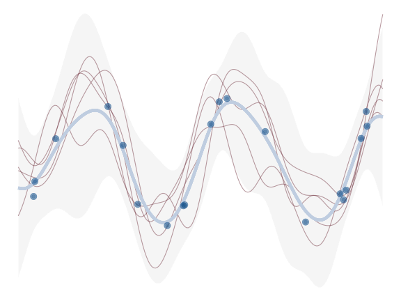
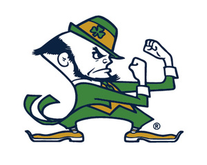
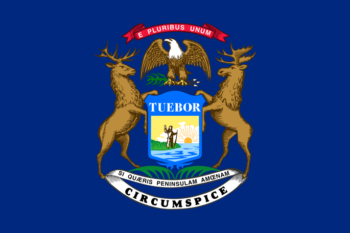
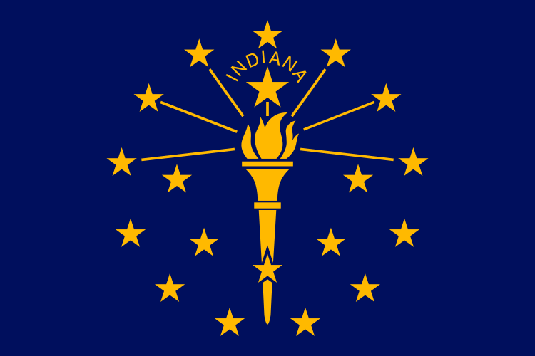
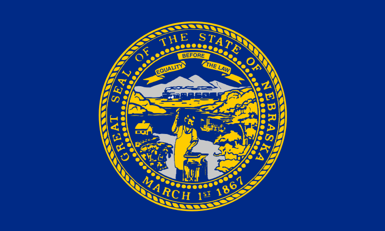

## What I do 

I am currently a Senior Machine Learning Scientist for [OneSix](https://www.onesixsolutions.com/), where I engage with client projects across multiple industries, helping them get the most from their data to maximize customer satisfaction, increase profitability, and explore new data-enabled territory. In my role, I strive to translate complex results into actionable insights for non-technical and technical stakeholders alike.

Throughout my career in data science, I have navigated a vast landscape of *modeling*, *visualizing*, and *understanding* data. I have conducted causal inference for marketing campaigns, classified biomedical images to detect pathology, analyzed text to uncover political sentiment, and explored baboon survival rates based on their social status. My experience spans dozens of industries and academic disciplines, from Fortune 100 companies to top research institutions, helping clients and researchers unlock the full potential of their data with statistical analysis, machine learning, and AI.

Additionally, I have a strong background in teaching, writing, and conducting workshops on these topics, enabling others to gain expertise and become self-sufficient. Recently, I authored a book - [Models Demystified](https://m-clark.github.io/book-of-models/) - which offers a comprehensive overview of the statistical and machine learning landscape, along with related topics. It is available from [CRC Press](https://www.routledge.com/Models-Demystified-A-Practical-Guide-from-Linear-Regression-to-Deep-Learning/Clark-Berry/p/book/9781032582580) and on [Amazon](https://www.amazon.com/Models-Demystified-Chapman-Hall-Science/dp/1032582588). It is widely acknowledged as one of the greatest book covers in the history of data science 😆.

I enjoy *empowering* people and helping them *discover* the secrets hidden within their data, and I am passionate about doing quality work that answers the questions at hand. What drew me to the world of data science - and keeps my interest - is that it frees me to engage in many different domains, and it provides a great many tools with which to discover more about the things we humans are most interested in.

## Academic Background    

While my interest is in data science generally, I started off majoring in [psychology](https://www.psy.tcu.edu/) and [philosophy](https://www.phil.tcu.edu/) as an undergraduate, and eventually obtained a Ph.D. in [Experimental Psychology](https://psychology.unt.edu/). During graduate school, I became interested in statistical science for practical reasons, eventually choosing it as a concentration, and I also started consulting at that time. That turned out to be a good fit for me, and I’ve been exploring and analyzing data ever since. After my formal education, I worked as a data science consultant at the Universities of North Texas, Notre Dame and Michigan.

## Personal     

I was born and raised in Texas, and aside from high school, was there throughout grad school and beyond. I have also lived a good chunk of my life in the Midwest, but I recently moved to the Research Triangle area of North Carolina with my wife, our daughter, and our dog Sulu. We tend to keep things simple, and like to go on walks and hikes in the neighborhood and surrounding areas, take the occasional trip to some place new, and make big deals out of the little things.

I have a non-academic CV [here](cv-non-acad.llms.md), but if interested in more details, feel free to [inquire via email](mailto:stats.data.sci@gmail.com), or DM me on LinkedIn.

  

  

MICHAEL CLARK

## Reuse

[CC BY-SA 4.0](https://creativecommons.org/licenses/by-sa/4.0/)
