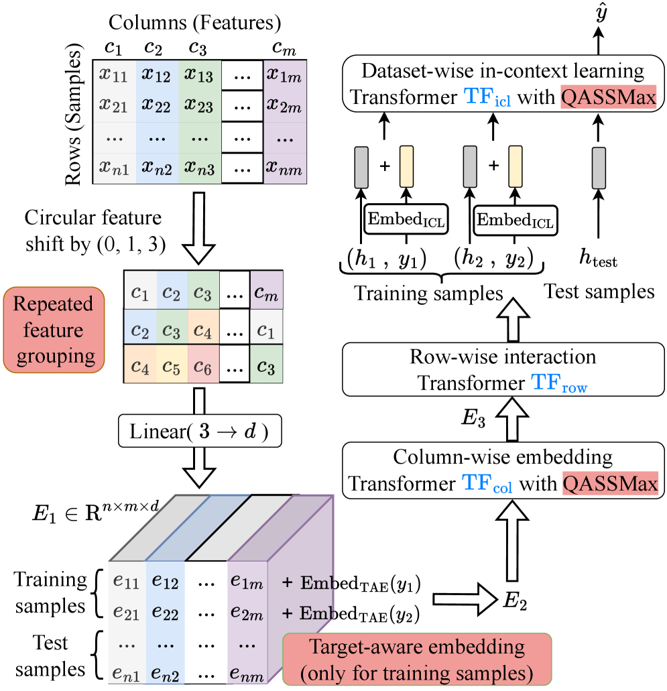
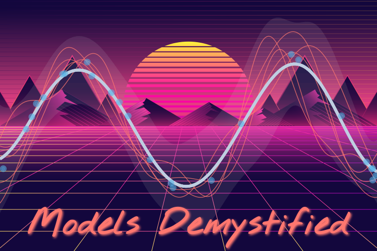
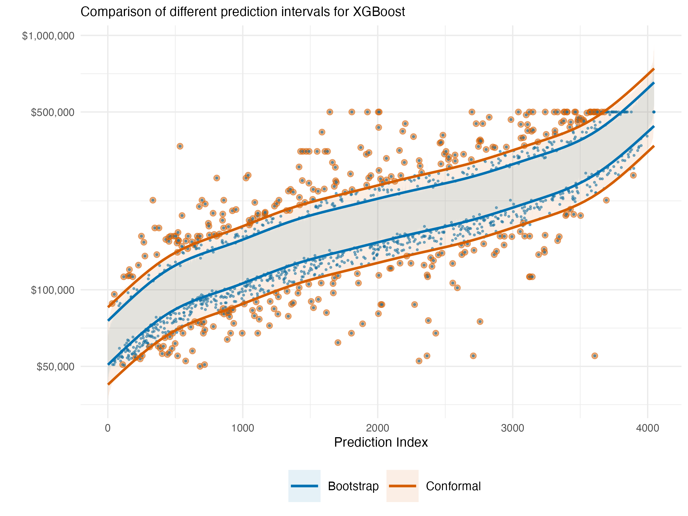
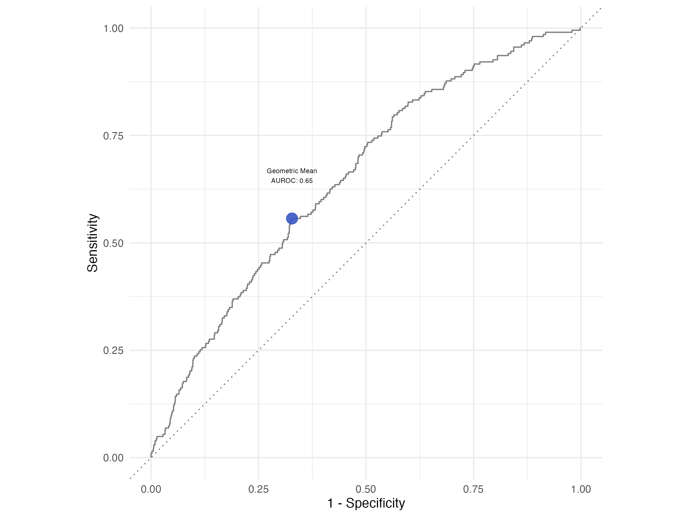

# Models Demystified

  

[](posts/2026-03-01-dl-for-tabular-foundational/index.llms.md)

### [Is Boosting Still All You Need for Tabular Data?](posts/2026-03-01-dl-for-tabular-foundational/index.llms.md)

An update on the state of deep learning for tabular data, featuring practical model implementation.

Mar 1, 2026

Michael Clark

[](posts/2025-08-15-models-demystified/index.llms.md)

### [My Book is Out!](posts/2025-08-15-models-demystified/index.llms.md)

A long journey finally culminates in a published book!

Aug 15, 2025

Michael Clark

[](posts/2025-06-01-conformal/index.llms.md)

### [Uncertainty Estimation with Conformal Prediction](posts/2025-06-01-conformal/index.llms.md)

More options for uncertainty estimation

Jun 1, 2025

Michael Clark

[](posts/2025-04-07-class-imbalance/index.llms.md)

### [Imbalanced Outcomes](posts/2025-04-07-class-imbalance/index.llms.md)

Challenges and solutions for this common situation

Apr 7, 2025

Michael Clark

[](posts/2025-01-01-news/index.llms.md)

### [Some News for the New Year](posts/2025-01-01-news/index.llms.md)

Fatherhood, a book on the way, a merger, and a long-overdue move to Quarto.

Jan 1, 2025

Michael Clark

### [Long time no see…](posts/2024-05-20/index.llms.md)

New modeling book under way!

May 20, 2024

Michael Clark

### [Stuff Going On](posts/2023-03-misc/index.llms.md)

Penalty kicks, class imbalance, tabular deep learning, industry and academia

Mar 10, 2023

Michael Clark

### [Deep Linear Models](posts/2022-09-deep-linear-models/index.llms.md)

A demonstration using pytorch

Oct 10, 2022

Michael Clark

### [Exploring Time](posts/2021-05-time-series/index.llms.md)

Demonstrating some times series approaches

Aug 10, 2022

Michael Clark

### [Programming Odds & Ends](posts/2022-07-25-programming/index.llms.md)

Explorations in faster data processing and other problems.

Jul 25, 2022

Michael Clark

### [Deep Learning for Tabular Data](posts/2022-04-01-more-dl-for-tabular/index.llms.md)

A continuing exploration

May 1, 2022

Michael Clark

### [Double Descent](posts/2021-10-30-double-descent/index.llms.md)

Rethinking what we thought we knew.

Nov 13, 2021

Michael Clark

### [This is definitely not all you need](posts/2021-07-15-dl-for-tabular/index.llms.md)

A summary of findings regarding deep learning for tabular data.

Jul 19, 2021

Michael Clark

### [Practical Bayes Part I](posts/2021-02-28-practical-bayes-part-i/index.llms.md)

Dealing with common model problems.

Feb 28, 2021

Michael Clark

### [Practical Bayes Part II](posts/2021-02-28-practical-bayes-part-ii/index.llms.md)

Taking a better approach and avoiding issues.

Feb 28, 2021

Michael Clark

### [Models by Example](posts/2020-11-30-models-by-example/index.llms.md)

Roll your own to understand more.

Nov 30, 2020

Michael Clark

### [Micro-macro models](posts/2020-08-31-micro-macro-mlm/index.llms.md)

An analysis in the wrong direction? Predicting group level targets with lower level covariates.

Aug 31, 2020

Michael Clark

### [Exploratory Data Analysis](posts/2020-07-10-eda/index.llms.md)

Exploring how to explore data.

Jul 10, 2020

Michael Clark

### [Predictions with an offset](posts/2020-06-15-predict-with-offset/index.llms.md)

Reconciling R and Stata Approaches

Jun 16, 2020

Michael Clark

### [Factor Analysis with the psych package](posts/2020-04-10-psych-explained/index.llms.md)

Making sense of the results

Apr 10, 2020

Michael Clark

### [Exploring the Pandemic](posts/2020-03-23-covid/index.llms.md)

Processing and Visualizing Covid-19 Data

Mar 23, 2020

Michael Clark

### [Convergence Problems](posts/2020-03-16-convergence/index.llms.md)

Lack of convergence got ya down? A plan of attack.

Mar 16, 2020

Michael Clark

### [Categorical Effects as Random](posts/2020-03-01-random-categorical/index.llms.md)

Exploring random slopes for categorical covariates and similar models

Mar 1, 2020

Michael Clark

### [Mixed Models for Big Data](posts/2019-10-20-big-mixed-models/index.llms.md)

Explorations of a fast penalized regression approach with mgcv

Oct 20, 2019

Michael Clark

### [Fractional Regression](posts/2019-08-20-fractional-regression/index.llms.md)

A quick primer regarding data between zero and one, including zero and one

Aug 20, 2019

Michael Clark

### [Comparisons of the Unseen](posts/2019-08-05-comparing-latent-variables/index.llms.md)

Examining group differences across latent variables

Aug 5, 2019

Michael Clark

### [Empirical Bayes](posts/2019-06-21-empirical-bayes/index.llms.md)

Revisiting an old post

Jun 21, 2019

Michael Clark

### [Shrinkage in Mixed Effects Models](posts/2019-05-14-shrinkage-in-mixed-models/index.llms.md)

A demonstration of random effects

May 14, 2019

Michael Clark

### [Mediation Models](posts/2019-03-12-mediation-models/index.llms.md)

Various package options for conducting mediation analysis

Mar 12, 2019

Michael Clark

## Reuse

[CC BY-SA 4.0](https://creativecommons.org/licenses/by-sa/4.0/)

## Citation

BibTeX citation:

``` quarto-appendix-bibtex
@online{untitled,
  author = {},
  title = {Models {Demystified}},
  url = {https://m-clark.github.io/},
  langid = {en}
}
```

For attribution, please cite this work as:

“Models Demystified.” n.d. <https://m-clark.github.io/>.
