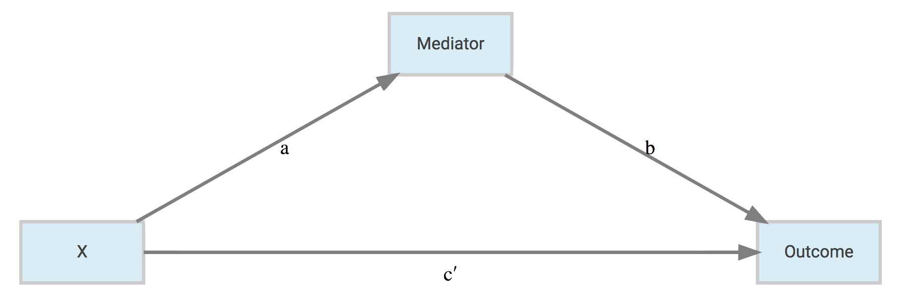
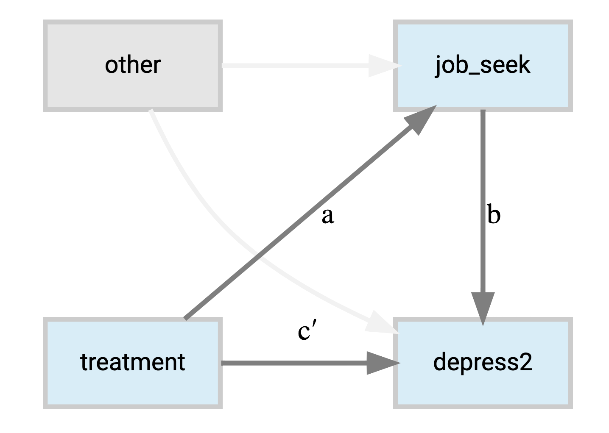
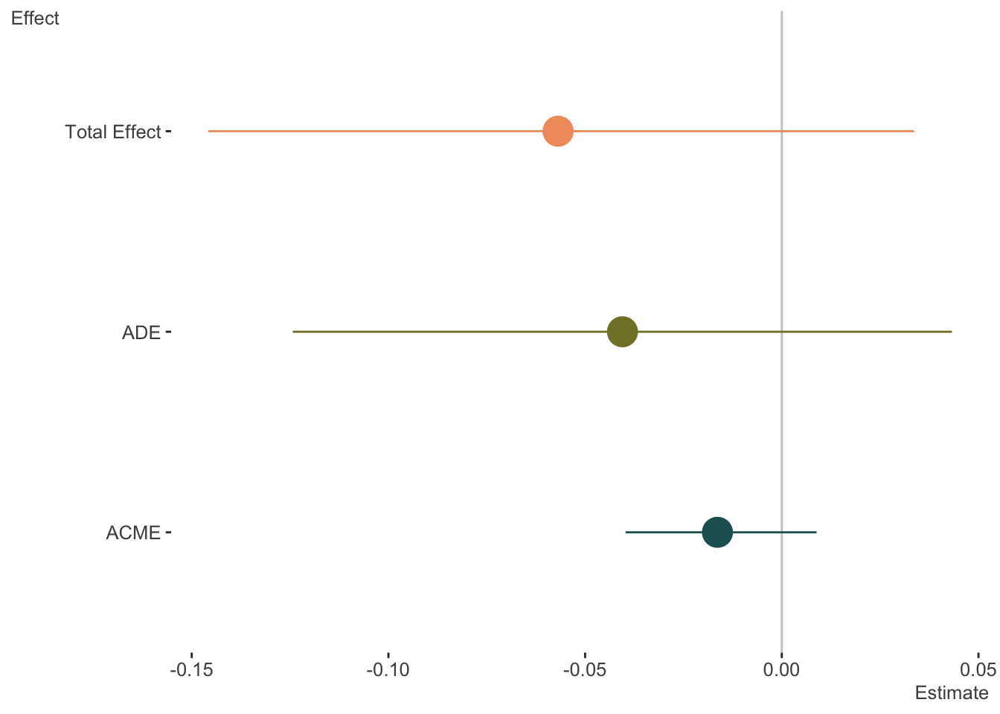
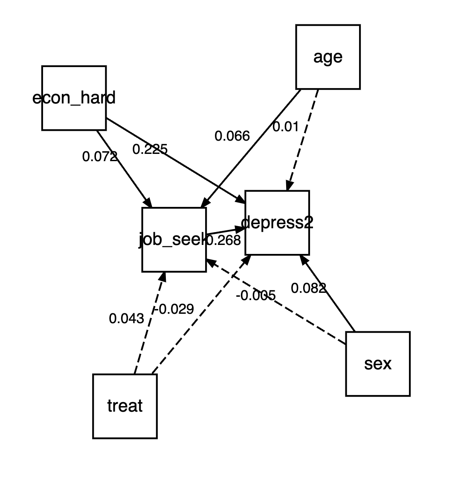
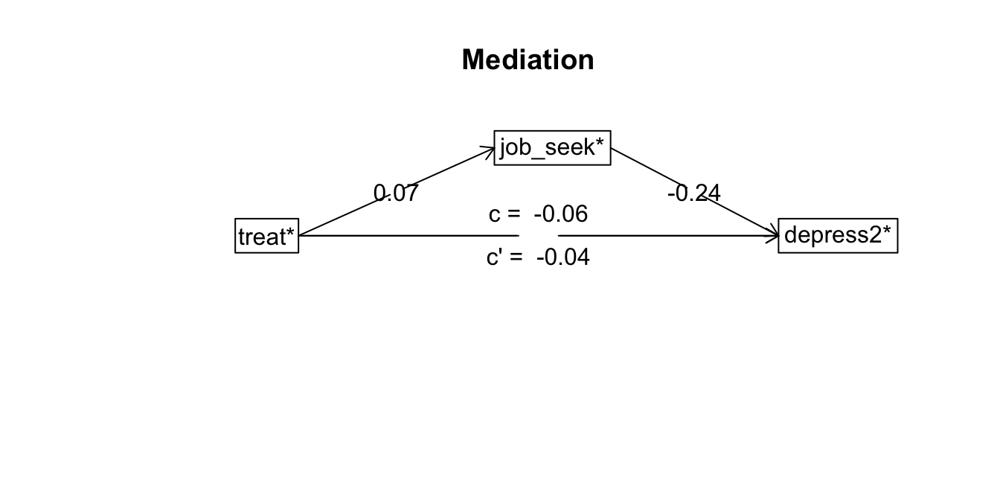
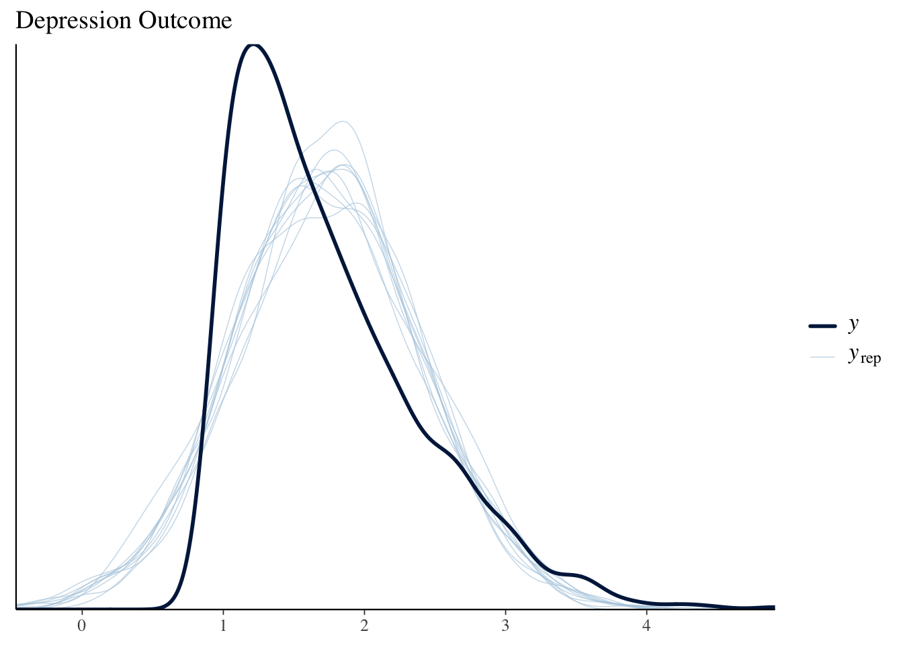
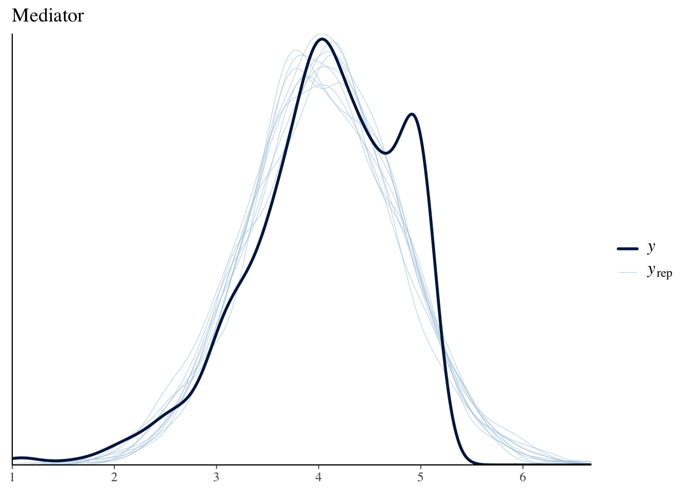
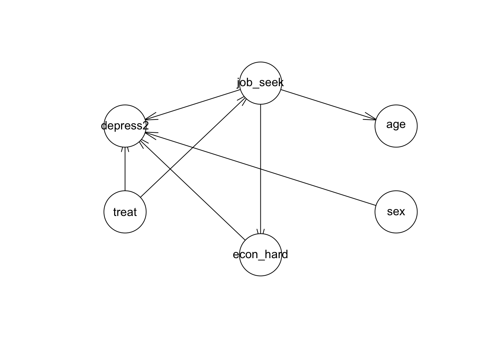
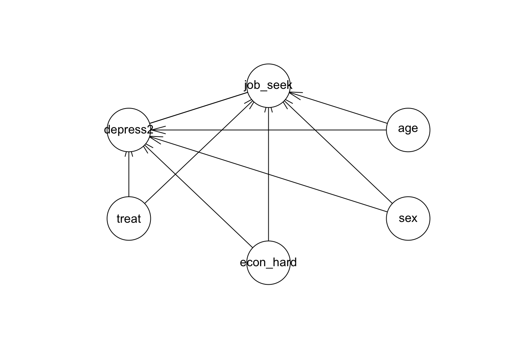

> NB: This post was revisited when updating the website early 2025, and some changes were required. Attempts to keep things consistent were made, but if you feel you’ve found an issue, please post it at [GitHub](http://github.com/m-clark/m-clark.github.io/issues).

Updated January 02, 2025. Code can be downloaded [here](https://raw.githubusercontent.com/m-clark/m-clark.github.io/master/_posts/2019-03-12-mediation-models/mediation-models-code.R).

  

## Introduction

In some situations we may consider the indirect effect of some variable on an outcome or result. As an example, poor living conditions at home in childhood may decrease learning outcomes in school, which subsequently have a negative effect on later quality of life, for example, lifetime income earnings. In another case we might consider a single variable collected at multiple time points, such that there exists an effect of the variable at time 1 on time 2, and time 2 on time 3. The basic idea is something like:

\\\mathcal{A} \rightarrow \mathcal{B} \rightarrow \mathcal{C}\\

In other words, \\\mathcal{A}\\ leads to \\\mathcal{B}\\, and then \\\mathcal{B}\\ leads to \\\mathcal{C}\\. With mediation models, we posit an intervening variable between the normal covariate \\\rightarrow\\ outcome path that we might have in the standard regression setting, and these models allow us to investigate such behaviors. In the above, the intervening variable, or *mediator*, is \\\mathcal{B}\\. It is often the case that we still might have a direct effect of \\\mathcal{A}\\ on \\\mathcal{C}\\, but as with the model in general, this would be theoretically motivated.

Mediation analysis is very popular in social science disciplines, though by no means restricted to those, and usually conducted under the guise of structural equation modeling (SEM), which itself is a specific orientation of graphical models more generally[^1]. The graphical model of a mediation model might look like the following.

Confounding and mediation are not distinguishable statistically in the standard linear model setting, only conceptually. One way to think about it is that confounding doesn’t require a causal relationship, and/or could be a common cause between the variable of interest and the outcome. See [MacKinnon et al.](https://www.ncbi.nlm.nih.gov/pmc/articles/PMC2819361/)



In this case, `a` and `b` reflect the indirect path of the effect of \\\mathrm{X}\\ on the outcome through the mediator, while `c'` is the direct effect of \\\mathrm{X}\\ on the outcome after the indirect path has been removed (`c` would be the effect before positing the indirect effect, and `c` - `c'` equals the indirect effect). The total effect of \\\mathrm{X}\\ is the combined indirect and direct effects.

I should note a few things based on what I see in consulting across dozens of disciplines. To begin, it seems very few people who think they need a mediation model actually do. For example, if you cannot think of your model in temporal or physical terms, such that \\\mathrm{X}\\ *necessarily* leads to the mediator, which then *necessarily* leads to the outcome, you likely do not need a mediation model. If you could see the arrows going either direction, again, you probably don’t need such a model. Also, if when describing your model, everyone thinks you’re talking about an interaction (a.k.a. moderation), you might not need this. And finally, as one might suspect, if there is no **strong** correlation between key variables (\\\mathrm{X}\\) and mediator (path `a`), and if there is no **strong** correlation between mediator and the outcome(s) (path `b`), you probably don’t need this. While nothing will stop you from doing mediation analysis, without such prerequisites, you will almost certainly have a weak and probably more confusing model than you otherwise would have.

In short, mediation works best when there are strongly implied causal connections among the variables. Even then, such a model should be compared to simpler model of no mediation[^2]. In any case, there are a few very easy ways to investigate such models in R, and that is the goal here, just to demonstrate how you can get started.

## Data

For demonstration of mediation models with the different packages, we will use the jobs data set that comes with the mediation package. Here is the description.

Job Search Intervention Study (JOBS II). JOBS II is a randomized field experiment that investigates the efficacy of a job training intervention on unemployed workers. The program is designed to not only increase reemployment among the unemployed but also enhance the mental health of the job seekers. In the JOBS II field experiment, 1,801 unemployed workers received a pre-screening questionnaire and were then randomly assigned to treatment and control groups. Those in the treatment group participated in job-skills workshops. In the workshops, respondents learned job-search skills and coping strategies for dealing with setbacks in the job-search process. Those in the control condition received a booklet describing job-search tips. In follow-up interviews, the two key outcome variables were a continuous measure of depressive symptoms based on the Hopkins Symptom Checklist, and a binary variable, representing whether the respondent had become employed.

Here is a description of the variables in this demonstration. There are others available you might also want to play around with.

- econ_hard: Level of economic hardship pre-treatment with values from 1 to 5.
- sex: Indicator variable for sex. 1 = female
- age: Age in years.
- educ: Factor with five categories for educational attainment.
- job_seek: A continuous scale measuring the level of job-search self-efficacy with values from 1 to 5. The mediator variable.
- depress2: Measure of depressive symptoms post-treatment. The outcome variable.
- treat: Indicator variable for whether participant was randomly selected for the JOBS II training program. 1 = assignment to participation.

``` r
data(jobs, package = 'mediation')
```

## Model

Given this data the models for the mediator and outcome are as follows:

\\ \begin{aligned} \mathrm{\color{#00b294}{job\\seek}} &\sim \mathrm{\color{#b2001d}{treatment} + econ\\hard + sex + age} \\ \mathrm{depression} &\sim \mathrm{\color{#b2001d}{treatment} + econ\\hard + sex + age + \color{#00b294}{job\\seek}} \end{aligned} \\

Thus we expect the job skills training to have a negative effect on depression (i.e. an increase in well-being), but at least part of this would be due to a positive effect on job search.

As a graphical model, we might depict it succinctly as follows.



## Packages

We will look at the following packages to demonstrate how one can conduct mediation analysis in R:

- mediation
- lavaan
- psych
- brms

While these will be the focus, I’ll also note some other alternatives, including Python and Stata.

### mediation

We will start with the mediation package, as it basically requires no more programming ability to conduct than one possesses already from running standard regression models in R. The package provides the average causal mediation effect, defined as follows from the help file and Imai’s articles[^3]:

> The average causal mediation effect (ACME) represents the expected difference in the potential outcome when the mediator took the value that would realize under the treatment condition as opposed to the control condition, while the treatment status itself is held constant.

Note how this definition is focused on expected or predicted values conditional on the treatment value. This notion of counterfactuals, or what would the observation look like under the opposite setting, has a long history in modeling at this point. Think of it this way, if one is in the treatment group, they would have a specific value for the mediator, and, given that, they would then have a specific expected value for the outcome. However, we could posit the same observation as being in the control group as well, and assess the effect on the outcome through the mediator just the same. We can assess the potential outcomes while holding the treatment constant. Thinking of outcome changes given the value of the mediator makes no assumption about the model type. This is how the mediation package is able to incorporate different models for the mediator vs. the outcome. For example, the mediator could be binary, requiring a logistic regression model, while the outcome model might be a survival model.

As this document is a tools-based demo and not for depth, see the works of [Judea Pearl](http://bayes.cs.ucla.edu/jp_home.html) for more details.

In our example, we will stick with standard (normal) linear models. Note also, that while our treatment is a binary variable, this generalizes to the continuous case, where we consider the result of a one unit movement on the ‘treatment’. For the mediation package to work, we simply run our respective models for the mediator and outcome, then use the mediate function to get the final result.

``` r
library(mediation)

model_mediator <- lm(job_seek ~ treat + econ_hard + sex + age, data = jobs)
model_outcome  <- lm(depress2 ~ treat + econ_hard + sex + age + job_seek, data = jobs)

# Estimation via quasi-Bayesian approximation
# ?mediate
mediation_result <- mediate(
  model.m = model_mediator, 
  model.y = model_outcome, 
  sims = 500,
  treat = "treat",
  mediator = "job_seek"
)

detach(package:mediation)
detach(package:MASS)
```

The result is based on simulations of a multivariate normal draw of the coefficients given their estimated covariance matrix. The algorithm is summarized as follows (from Imai et al. 2010)

1.  Fit models for the observed outcome and mediator variables.
2.  Simulate model parameters from their sampling distribution.
3.  Repeat the following three steps:
    1.  simulate the potential values of the mediator,
    2.  simulate the potential outcomes given the simulated values of the mediator,
    3.  compute the causal mediation effects.
4.  Compute summary statistics such as point estimates and confidence intervals.

With this approach we can obtain the average difference and corresponding quantiles based on the simulated draws.

``` r
summary(mediation_result)
plot(mediation_result)
```

|                | Estimate | 95% CI Lower | 95% CI Upper | p-value |
|:---------------|---------:|-------------:|-------------:|--------:|
| ACME           |   -0.016 |       -0.040 |        0.009 |   0.168 |
| ADE            |   -0.041 |       -0.124 |        0.043 |   0.384 |
| Total Effect   |   -0.057 |       -0.146 |        0.034 |   0.204 |
| Prop. Mediated |    0.242 |       -1.213 |        2.737 |   0.292 |



The results above demonstrate that the ACME is not statistically distinct from zero, or no mediation. The average direct effect is negative but likewise not statistically notable, neither is the total effect (indirect + direct effect). Also provided is the soi disant ‘proportion mediated’, which is the ratio of the indirect effect to the total. However this is not a proportion, and can even be negative, and so is mostly a meaningless number.

#### Pros

- Standard R models and syntax
- Multiple types of models for both mediator and outcome
- Provides multiple results simultaneously
- Good documentation and associated articles are freely available
- Can do ‘moderated’ mediation

#### Limitations

- Use of MASS[^4]
- Simple random effects models
- Functionality maybe limited with some model complexities
- No latent variable capabilities

### lavaan

In the specific case where both mediation and outcome models are standard linear models with a normal distribution for the target variable, the indirect effect is equivalent to the product of the `a` and `b` paths in the previous diagram. The direct effect is the `c'` path. A comparison of standalone direct effect, which we might call `c`, vs this estimated direct effect in the mediation model `c'`, is such that `c - c' = a*b`. What was mentioned earlier might now be more clear, if either `a` or `b` are nearly zero, then the indirect effect can only be nearly zero, so it is prudent to investigate such relationships beforehand.


This product-of-paths (or difference in coefficients) approach is the one we will take with the lavaan package, and in fact, as of this writing, that is our only way of going about it. lavaan is specifically geared toward structural equation modeling, such as factor analysis, growth models, and mediation models like we’re conducting here, and is highly recommended for such models. While it is limited to the standard linear model case to assess mediation, it is the only one of our tools that can incorporate latent variables readily[^5]. For example, we could have our depression outcome as a latent variable underlying the individual questionnaire items. In addition, we could also incorporate multiple mediators and multiple outcomes.

lavaan can still estimate the model with binary or ordinal variables, there just is no way to produce the proper indirect effect, at least not without a lot more effort.

To keep things as we have been discussing, I will label the `a`, `b` and `c'` paths in lavaan according to how they have been depicted previously. Otherwise lavaan is very easy to use, and in the case of observed variables, uses standard R formula notation for the models. Beyond that we define the effects of interest that we want to calculate with the `:=` operator. We specify the model in its entirety as a simple character string, then use the sem function to do the analysis.

``` r
library(lavaan)

sem_model = '
  job_seek ~ a*treat + econ_hard + sex + age
  depress2 ~ c*treat + econ_hard + sex + age + b*job_seek
 
  # direct effect
  direct := c
 
  # indirect effect
  indirect := a*b
 
  # total effect
  total := c + (a*b)
'

model_sem = sem(sem_model, data=jobs, se='boot', bootstrap=500)
summary(model_sem, rsq=T)  # compare with ACME in mediation
```

    lavaan 0.6.17 ended normally after 1 iteration

      Estimator                                         ML
      Optimization method                           NLMINB
      Number of model parameters                        11

      Number of observations                           899

    Model Test User Model:
                                                          
      Test statistic                                 0.000
      Degrees of freedom                                 0

    Parameter Estimates:

      Standard errors                            Bootstrap
      Number of requested bootstrap draws              500
      Number of successful bootstrap draws             500

    Regressions:
                       Estimate  Std.Err  z-value  P(>|z|)
      job_seek ~                                          
        treat      (a)    0.066    0.050    1.317    0.188
        econ_hard         0.053    0.023    2.282    0.023
        sex              -0.008    0.048   -0.158    0.874
        age               0.005    0.002    1.878    0.060
      depress2 ~                                          
        treat      (c)   -0.040    0.045   -0.896    0.370
        econ_hard         0.149    0.021    7.239    0.000
        sex               0.107    0.040    2.641    0.008
        age               0.001    0.002    0.321    0.748
        job_seek   (b)   -0.240    0.029   -8.392    0.000

    Variances:
                       Estimate  Std.Err  z-value  P(>|z|)
       .job_seek          0.524    0.030   17.550    0.000
       .depress2          0.373    0.021   17.654    0.000

    R-Square:
                       Estimate
        job_seek          0.011
        depress2          0.120

    Defined Parameters:
                       Estimate  Std.Err  z-value  P(>|z|)
        direct           -0.040    0.045   -0.895    0.371
        indirect         -0.016    0.012   -1.263    0.206
        total            -0.056    0.046   -1.218    0.223

We see the same output before and can compare our `indirect` parameter to the ACME we had before, the `direct` effect is compared to the ADE, and the `total` compares to the previous total effect. The values are essentially the same.

Note also that the output shows the \\R^2\\ value for both models. In the case of `job_seek`, we can see that the reason we’re not finding much in the way of mediation is because the covariates involved do not explain any variation in the mediator to begin with. Preliminary investigation would have saved us the trouble in this case.

#### Pros

- Can handle multiple mediators
- Can handle multiple ‘treatments’
- Can handle multiple outcomes
- Can use latent variables
- Some multilevel support
- Can do moderated mediation and mediated moderation (though not for latent variables)

#### Limitations

- Requires additional coding to estimate the indirect effect
- Single random effects
- While the models could incorporate binary or ordinal variables for the mediator/outcomes, there is no straightforward way to calculate the indirect effect in the manner of the mediation package in those settings.

### piecewiseSEM

The piecewiseSEM package works very similar to the mediation package. The nice thing about this relative to the mediation package is that piecewiseSEM can handle additional types of models, as well as provide additional output (e.g. standardized results), additional options (e.g. multigroup, correlated residuals), and visualization of the model.

``` r
library(piecewiseSEM)

model_mediator <- lm(job_seek ~ treat + econ_hard + sex + age, data = jobs)
model_outcome  <- lm(depress2 ~ treat + econ_hard + sex + age + job_seek, data = jobs)

mediation_result <-  psem(model_mediator, model_outcome, data = jobs)

summary(mediation_result)
```


    Structural Equation Model of mediation_result 

    Call:
      job_seek ~ treat + econ_hard + sex + age
      depress2 ~ treat + econ_hard + sex + age + job_seek

        AIC
     3661.375

    ---
    Tests of directed separation:

     No independence claims present. Tests of directed separation not possible.

    --
    Global goodness-of-fit:

    Chi-Squared = 0 with P-value = 1 and on 0 degrees of freedom
    Fisher's C = NA with P-value = NA and on 0 degrees of freedom

    ---
    Coefficients:

      Response Predictor Estimate Std.Error  DF Crit.Value P.Value Std.Estimate    
      job_seek     treat   0.0656    0.0515 894     1.2748  0.2027       0.0425    
      job_seek econ_hard   0.0532    0.0246 894     2.1612  0.0309       0.0720   *
      job_seek       sex  -0.0076    0.0487 894    -0.1567  0.8755      -0.0052    
      job_seek       age   0.0046    0.0023 894     1.9779  0.0482       0.0658   *
      depress2     treat  -0.0403    0.0435 893    -0.9255  0.3550      -0.0291    
      depress2 econ_hard   0.1485    0.0208 893     7.1323  0.0000       0.2248 ***
      depress2       sex   0.1068    0.0411 893     2.5957  0.0096       0.0818  **
      depress2       age   0.0006    0.0020 893     0.3306  0.7410       0.0104    
      depress2  job_seek  -0.2400    0.0282 893    -8.4960  0.0000      -0.2682 ***

      Signif. codes:  0 '***' 0.001 '**' 0.01 '*' 0.05

    ---
    Individual R-squared:

      Response method R.squared
      job_seek   none      0.01
      depress2   none      0.12

We can use it’s plotting capabilities to create a quick visualization of the model.

The plot is using Diagrammer and graphviz under the hood, which is appealing to me as I use those anyway, so could use the generated code as a starting point.

``` r
plot(mediation_result)
```



Unfortunately, there is no automatic way to calculate the indirect effects at present, so one would have to bootstrap the results by hand.

There used to be a package to calculate indirect effects of a psem object, semEff, but it currently [doesn’t work](https://github.com/murphymv/semEff/issues/5).

#### Pros

- Standard R models and syntax
- Multiple types of models for both mediator and outcome
- Some SEM-style results (e.g. fit, standardized coefficients, AIC)
- Quick plot of results
- Can handle multiple mediators, ‘treatments’, and outcomes

#### Limitations

- Doesn’t automatically calculate indirect effects
- No latent variable capabilities

### psych

The psych package takes advantage of the fact that in the standard linear model case, one can obtain the results via the appropriate regression models based on the covariance matrices alone. It’s very similar to lavaan, although using an ordinary least squares approach as opposed to maximum likelihood. The nice thing here is a syntax that allows you to focus only on the effect of interest, or include everything, which is nice if you were interested in the indirect effects for economic hardship, age, and sex as well.

For this demo we’ll use the cleaned up version using the `-`, instead of `+`, for the non-treatment effects. This just means they are included with the models, but results are not shown concerning them. The mediator is identified with `()`. Another bonus is a quick plot of the results, showing the difference between the unadjusted and adjusted direct effects, and the appropriate bootstrapped interval.

``` r
library(psych)

mediation_psych = mediate(
  depress2 ~ treat + (job_seek) - econ_hard - sex - age, 
  data = jobs,
  n.iter = 500
)
```



``` r
mediation_psych
```


    Mediation/Moderation Analysis 
    Call: mediate(y = depress2 ~ treat + (job_seek) - econ_hard - sex - 
        age, data = jobs, n.iter = 500)

    The DV (Y) was  depress2* . The IV (X) was  Intercept* treat* . The mediating variable(s) =  job_seek* . Variable(s)  partialled out were econ_hard sex age

    Total effect(c) of  Intercept*  on  depress2*  =  -0.06   S.E. =  0.05  t  =  -1.24  df=  894   with p =  0.22
    Direct effect (c') of  Intercept*  on  depress2*  removing  job_seek*  =  -0.04   S.E. =  0.04  t  =  -0.93  df=  893   with p =  0.35
    Indirect effect (ab) of  Intercept*  on  depress2*  through  job_seek*   =  -0.02 
    Mean bootstrapped indirect effect =  -0.02  with standard error =  0.01  Lower CI =  -0.04    Upper CI =  0.01

    Error in x$direct[i + 1, j]: subscript out of bounds

``` r
summary(mediation_psych)
```

    Call: mediate(y = depress2 ~ treat + (job_seek) - econ_hard - sex - 
        age, data = jobs, n.iter = 500)

    Direct effect estimates (traditional regression)    (c') X + M on Y 
              depress2*   se     t  df     Prob
    Intercept      2.21 0.15 14.91 893 4.60e-45
    treat         -0.04 0.04 -0.93 893 3.55e-01
    job_seek      -0.24 0.03 -8.50 893 8.14e-17

    R = 1.07 R2 = 1.15   F = -3510.4 on 2 and 893 DF   p-value:  1 

     Total effect estimates (c) (X on Y) 
              depress2*   se     t  df     Prob
    Intercept      1.33 0.11 12.08 894 3.10e-31
    treat         -0.06 0.05 -1.24 894 2.15e-01

     'a'  effect estimates (X on M) 
              job_seek   se     t  df      Prob
    Intercept     3.67 0.13 29.33 894 5.65e-133
    treat         0.07 0.05  1.27 894  2.03e-01

     'b'  effect estimates (M on Y controlling for X) 
             depress2*   se    t  df     Prob
    job_seek     -0.24 0.03 -8.5 893 8.14e-17

     'ab'  effect estimates (through all  mediators)
          depress2*  boot   sd lower upper
    treat     -0.02 -0.02 0.01 -0.04  0.01

Same results, different packaging, but possibly the easiest route yet as it only required one function call. The psych package also handles multiple mediators and outcomes as a bonus.

#### Pros

- Easiest syntax, basically a one line model
- Quick plot of results
- Can handle multiple mediators, ‘treatments’, and outcomes
- Can do ‘moderated’ mediation

#### Limitations

- Limited to standard linear model (`lm`)
- Use of MASS

### brms

For our next demo we come to what I feel is the most powerful package, brms. The name stands for Bayesian Regression Modeling with Stan, and Stan is a powerful probabilistic programming language for Bayesian analysis. I won’t go into details about Bayesian analysis, but feel free to see [my document](https://m-clark.github.io/bayesian-basics/) that does.

We generally do as we have before, specifying the mediator model and the outcome model. brms doesn’t do anything special for mediation analysis, but its hypothesis function can allow us to test the product-of-paths approach. Furthermore, the sjstats package will essentially provide the results in the same way the mediation package does for us, and for that matter, the mediation package is basically an attempt at a Bayesian solution using frequentist methods anyway. If we did have different distributions for the outcome and mediator, we’d have an relatively easy time getting these average prediction values and their differences, as Bayesian approaches are always thinking about posterior predictive distributions. In any case, here is the code.

``` r
library(brms)

model_mediator <- bf(job_seek ~ treat + econ_hard + sex + age)
model_outcome  <- bf(depress2 ~ treat + job_seek + econ_hard + sex + age)

med_result = brm(
  model_mediator + model_outcome + set_rescor(FALSE), 
  data = jobs
)
save(med_result, file = 'data/mediation_brms.RData')
```

``` r
load('data/mediation_brms.RData')
summary(med_result)
```

     Family: MV(gaussian, gaussian) 
      Links: mu = identity; sigma = identity
             mu = identity; sigma = identity 
    Formula: job_seek ~ treat + econ_hard + sex + age 
             depress2 ~ treat + job_seek + econ_hard + sex + age 
       Data: jobs (Number of observations: 899) 
      Draws: 4 chains, each with iter = 2000; warmup = 1000; thin = 1;
             total post-warmup draws = 4000

    Regression Coefficients:
                       Estimate Est.Error l-95% CI u-95% CI Rhat Bulk_ESS Tail_ESS
    jobseek_Intercept      3.67      0.12     3.43     3.91 1.00     6703     3749
    depress2_Intercept     2.21      0.15     1.92     2.50 1.00     6173     3091
    jobseek_treat          0.07      0.05    -0.03     0.17 1.00     6321     2709
    jobseek_econ_hard      0.05      0.02     0.00     0.10 1.00     6266     2656
    jobseek_sex           -0.01      0.05    -0.10     0.09 1.00     5741     2655
    jobseek_age            0.00      0.00     0.00     0.01 1.00     6538     2846
    depress2_treat        -0.04      0.04    -0.12     0.04 1.00     5458     3102
    depress2_job_seek     -0.24      0.03    -0.30    -0.18 1.00     5950     2938
    depress2_econ_hard     0.15      0.02     0.11     0.19 1.00     7545     3102
    depress2_sex           0.11      0.04     0.03     0.19 1.00     5600     2699
    depress2_age           0.00      0.00    -0.00     0.00 1.00     4558     2887

    Further Distributional Parameters:
                   Estimate Est.Error l-95% CI u-95% CI Rhat Bulk_ESS Tail_ESS
    sigma_jobseek      0.73      0.02     0.69     0.76 1.00     6640     3276
    sigma_depress2     0.61      0.01     0.59     0.64 1.00     6145     2987

    Draws were sampled using sampling(NUTS). For each parameter, Bulk_ESS
    and Tail_ESS are effective sample size measures, and Rhat is the potential
    scale reduction factor on split chains (at convergence, Rhat = 1).

``` r
# using brms we can calculate the indirect effect as follows
# hypothesis(med_result, 'jobseek_treat*depress2_job_seek = 0')

# bayestestR provides similar printing as the mediation package
# print(bayestestR::mediation(med_result), digits=4)
```

| Effect                 | Estimate | CI_low | CI_high |
|------------------------|----------|--------|---------|
| Direct Effect (ADE)    | −0.04    | −0.12  | 0.04    |
| Indirect Effect (ACME) | −0.02    | −0.04  | 0.01    |
| Mediator Effect        | −0.24    | −0.30  | −0.18   |
| Total Effect           | −0.06    | −0.14  | 0.03    |
| Proportion Mediated    | 0.28     | −1.98  | 2.54    |

In the output, anything with `jobseek_*` is a result for the mediator model, while `depress2_*` is for the outcome. We have the same old story at this point, but with the Bayesian approach we have more fun things to look at. For example, we can see that we aren’t actually capturing the skewness of depression outcome well. Our predicted values vs. the observed don’t quite match up. We’re a little better for the mediator, but perhaps still a little high with some of our model-based predictions.

``` r
pp_check(med_result, resp = 'depress2') + ggtitle('Depression Outcome')
```



``` r
pp_check(med_result, resp = 'jobseek') + ggtitle('Mediator')
```



The faint lines (`yrep`) are posterior predictive draws.

#### Pros

- Straightforward syntax
- Extremely powerful- Models are mostly limited to one’s imagination
- Basically does what the mediation package approximates
- All the perks of Bayesian inference: diagnostics, posterior predictive checks, model comparison, etc.

#### Limitations

- Slower to estimate
- ‘By-hand’ calculations needed for going beyond the standard linear model, but this is already a common approach from the Bayesian perspective
- Some comfort with the Bayesian approach required

## More complexity

Some of the packages mentioned can handle more complex models or provide additional approaches to investigate indirect effects.

### Interactions

Some models involve interactions either for the mediation model or outcome, and unfortunately this is often referred to as mediated moderation or moderated mediation. I personally don’t see the advantage to giving ambiguous names to what otherwise might be a straightforward concept (if still not-so-straightforward model), but that ship sailed long ago. I’m not going to go into the details, but the idea is that you might have an interaction term somewhere in the model, and the interaction might involve the treatment variable, the mediator, or both.

Suffice it to say, since we’re using standard modeling tools like `lm` and extensions of it, incorporating interactions is trivial for all of the above packages, but the product-of-paths type of approach doesn’t hold (`a*b != c'`).

### Generalized Linear Models

In some cases our mediator or outcome may be binary, count, or something where assuming a normal distribution might not be the best idea. Or we might want to investigate nonlinear relationships among the treatment/mediator/outcome. Or we might have data that has correlated observations like repeated measurements or similar. The mediation package prides itself on this in particular, but brms can do anything it can do and more, though you might have to do a little more work to actually calculate the result. lavaan can actually do a limited set of models for binary and ordinal variables, but getting the appropriate indirect estimate would require a very tedious by-hand approach.

### Missing data

Often when dealing with such data, especially in the social sciences, data is often missing on any of the covariates. Sometimes we can drop these if there isn’t too many, but in other cases we will want to do something about it. The packages lavaan, psych, and brms provide one or more ways to deal with the situation (e.g. multiple imputation).

## Alternatives

We have been depicting the models as networks of nodes, with arcs/edges/paths connecting them. Our discussion revolves around what are called Directed Acyclic Graphs (DAG) where the arrows can only go one direction with no feedback loops. The result of any outcome variable is a function of the arrows preceding it, and conditionally independent of others. Some theoretical models may relax this, and others may have no arrows at all, i.e. are undirected, such that we are interested in just the connections (e.g. with some social networks).

### bnlearn

The bnlearn package allows investigation of directed, partially directed, and undirected graphs. In terms of DAGs, we can use it to essentially duplicate the mediation models we’ve been discussing. The nice thing though is that this package will efficiently test paths for inclusion rather than assume them, but we can still impose theoretical constraints as needed. Not only can we then search for the paths of interest in a principled way with bayesian networks and Pearl’s causal graph theory as a basis, we also will have tools to further avoid overfitting via cross-validation.

For the initial model, we’ll make sure that paths exist between treatment - mediator, treatment - outcome, and mediator - outcome (the whitelist). We will disallow nonsensical paths like having arrows to the treatment (which was randomly assigned), sex, economic hardship, and age (the blacklist). Otherwise, we’ll see what the data suggests.

``` r
whitelist = data.frame(
  from = c('treat', 'treat', 'job_seek'),
  to   = c('job_seek', 'depress2', 'depress2')
)

blacklist = expand.grid(
  from = colnames(mediation_result$model.y$model),
  to   = c('treat', 'sex', 'age', 'econ_hard')
)

# For simpler output we'll use treatment and sex as numeric (explained later)
library(dplyr)

jobs_trim = jobs %>% 
  select(depress2, treat, econ_hard, sex, age, job_seek) %>% 
  mutate(
    treat = as.numeric(jobs$treat),
    sex = as.numeric(jobs$sex)
    )


# extract path coefficients if desired
# parameters = bn.fit(model, jobs_trim)
# parameters$job_seek
# parameters$econ_hard
# parameters$depress2
```

``` r
library(bnlearn)

model = gs(jobs_trim, whitelist = whitelist, blacklist = blacklist)

plot(model)
```



We see in the plot that things have changed a bit. For example, age now only relates to job seeking self-efficacy, and sex only has an effect on depression.

If we restrict the paths to only be what they are in our previous examples, we’d get the same results.

``` r
library(bnlearn)

whitelist = data.frame(
  from = c('treat', 'age', 'sex', 'econ_hard', 'treat', 'job_seek', 'age', 'sex', 'econ_hard'),
  to   = c('job_seek', 'job_seek','job_seek','job_seek', 'depress2', 'depress2', 'depress2', 'depress2', 'depress2')
)

blacklist = expand.grid(
  from = colnames(mediation_result$model.y$model),
  to   = c('treat', 'sex', 'age', 'econ_hard')
)

# this no longer guarantees DAG. see note in ?gs; use cextend as below
model = gs(
  jobs_trim,
  whitelist = whitelist,
  blacklist = blacklist,
  undirected = FALSE  
)
plot(model)
```



``` r
parameters = bn.fit(cextend(model), jobs_trim)

parameters$depress2$coefficients
```

      (Intercept)         treat     econ_hard           sex           age 
     2.2076414333 -0.0402647000  0.1485433818  0.1068048699  0.0006488642 
         job_seek 
    -0.2399549527 

``` r
parameters$job_seek$coefficients
```

     (Intercept)        treat    econ_hard          sex          age 
     3.670584908  0.065615003  0.053162413 -0.007637336  0.004586492 

The main thing to note is that the estimated parameters equal the same thing we got with previous packages. It’s essentially equivalent to using lavaan with the default maximum likelihood estimator.

If we use treatment and sex as factors, bnlearn will produce conditional models that are different depending on the factor value taken. In other words, one would have a separate model for when `treatment == 'treatment'` and one for when `treatment == control`. In our case, this would be identical to allowing everything to interact with treatment, e.g. `lm( job_seek ~ treat * (econ_hard + sex + age))`, and likewise for the depression model. This would extend to potentially any binary variable (e.g. including sex). If the mediator is a binary variable, this is likely what we’d want to do.

### Python

CSCAR director Kerby Shedden has given a Python workshop on mediation models, so I show the statsmodels implementation here. It follows the Imai approach and so can be seen as the Python version of the mediation package. The output is essentially the same as what you would have using treatment as a factor variable, where you get separate results for each treatment category. This is unnecessary for our demo, so you can just compare the ‘average’ results to the previous mediation package results.

``` python
import statsmodels.api as sm
from statsmodels.stats.mediation import Mediation
import numpy as np
import pandas as pd

jobs = pd.read_csv('data/jobs.csv')

outcome_model = sm.OLS.from_formula("depress2 ~ treat + econ_hard + sex + age + job_seek",
                                    data = jobs)

mediator_model = sm.OLS.from_formula("job_seek ~ treat + econ_hard + sex + age",
                                     data = jobs)

med = Mediation(outcome_model, mediator_model, "treat", "job_seek")

med_result = med.fit(n_rep = 500)

print(np.round(med_result.summary(), decimals = 3))
```

                              Estimate  Lower CI bound  Upper CI bound  P-value
    ACME (control)              -0.016          -0.046           0.016    0.268
    ACME (treated)              -0.016          -0.046           0.016    0.268
    ADE (control)               -0.040          -0.122           0.048    0.368
    ADE (treated)               -0.040          -0.122           0.048    0.368
    Total effect                -0.056          -0.138           0.036    0.216
    Prop. mediated (control)     0.237          -1.543           2.707    0.348
    Prop. mediated (treated)     0.237          -1.543           2.707    0.348
    ACME (average)              -0.016          -0.046           0.016    0.268
    ADE (average)               -0.040          -0.122           0.048    0.368
    Prop. mediated (average)     0.237          -1.543           2.707    0.348

### Stata

Finally, I provide an option in Stata using its `sem` command. Stata makes it easy to get the indirect effects in this example, but it does so for every covariate, so the output is a bit verbose to say the least[^6]. For those working with Stata, they do not need a separate SEM package to get these sorts of results.

``` stata

use "data\jobs.dta"

sem (job_seek <- treat econ_hard sex age) (depress2 <- treat econ_hard sex age job_seek), cformat(%9.3f) pformat(%5.2f)

estat teffects, compact cformat(%9.3f) pformat(%5.2f)
```


    . use 'data\jobs.dta'

    . 
    . sem (job_seek <- treat econ_hard sex age) (depress2 <- treat econ_hard sex age job_seek), 
    cformat(%9.3f) pformat(%5.2f)

    Endogenous variables

    Observed:  job_seek depress2

    Exogenous variables

    Observed:  treat econ_hard sex age

    Fitting target model:

    Iteration 0:   log likelihood = -7711.0956  
    Iteration 1:   log likelihood = -7711.0956  

    Structural equation model                       Number of obs     =        899
    Estimation method  = ml
    Log likelihood     = -7711.0956

    ------------------------------------------------------------------------------
                 |                 OIM
                 |      Coef.   Std. Err.      z    P>|z|     [95% Conf. Interval]
    -------------+----------------------------------------------------------------
    Structural   |
      job_seek   |
           treat |      0.066      0.051     1.28    0.20       -0.035       0.166
       econ_hard |      0.053      0.025     2.17    0.03        0.005       0.101
             sex |     -0.008      0.049    -0.16    0.88       -0.103       0.088
             age |      0.005      0.002     1.98    0.05        0.000       0.009
           _cons |      3.671      0.125    29.41    0.00        3.426       3.915
      -----------+----------------------------------------------------------------
      depress2   |
        job_seek |     -0.240      0.028    -8.52    0.00       -0.295      -0.185
           treat |     -0.040      0.043    -0.93    0.35       -0.125       0.045
       econ_hard |      0.149      0.021     7.16    0.00        0.108       0.189
             sex |      0.107      0.041     2.60    0.01        0.026       0.187
             age |      0.001      0.002     0.33    0.74       -0.003       0.004
           _cons |      2.208      0.148    14.96    0.00        1.918       2.497
    -------------+----------------------------------------------------------------
    var(e.job_~k)|      0.524      0.025                         0.478       0.575
    var(e.depr~2)|      0.373      0.018                         0.340       0.409
    ------------------------------------------------------------------------------
    LR test of model vs. saturated: chi2(0)   =      0.00, Prob > chi2 =      .

    . 
    . estat teffects, compact cformat(%9.3f) pformat(%5.2f)


    Direct effects
    ------------------------------------------------------------------------------
                 |                 OIM
                 |      Coef.   Std. Err.      z    P>|z|     [95% Conf. Interval]
    -------------+----------------------------------------------------------------
    Structural   |
      job_seek   |
           treat |      0.066      0.051     1.28    0.20       -0.035       0.166
       econ_hard |      0.053      0.025     2.17    0.03        0.005       0.101
             sex |     -0.008      0.049    -0.16    0.88       -0.103       0.088
             age |      0.005      0.002     1.98    0.05        0.000       0.009
      -----------+----------------------------------------------------------------
      depress2   |
        job_seek |     -0.240      0.028    -8.52    0.00       -0.295      -0.185
           treat |     -0.040      0.043    -0.93    0.35       -0.125       0.045
       econ_hard |      0.149      0.021     7.16    0.00        0.108       0.189
             sex |      0.107      0.041     2.60    0.01        0.026       0.187
             age |      0.001      0.002     0.33    0.74       -0.003       0.004
    ------------------------------------------------------------------------------


    Indirect effects
    ------------------------------------------------------------------------------
                 |                 OIM
                 |      Coef.   Std. Err.      z    P>|z|     [95% Conf. Interval]
    -------------+----------------------------------------------------------------
    Structural   |
      job_seek   |
      -----------+----------------------------------------------------------------
      depress2   |
           treat |     -0.016      0.012    -1.26    0.21       -0.040       0.009
       econ_hard |     -0.013      0.006    -2.10    0.04       -0.025      -0.001
             sex |      0.002      0.012     0.16    0.88       -0.021       0.025
             age |     -0.001      0.001    -1.93    0.05       -0.002       0.000
    ------------------------------------------------------------------------------


    Total effects
    ------------------------------------------------------------------------------
                 |                 OIM
                 |      Coef.   Std. Err.      z    P>|z|     [95% Conf. Interval]
    -------------+----------------------------------------------------------------
    Structural   |
      job_seek   |
           treat |      0.066      0.051     1.28    0.20       -0.035       0.166
       econ_hard |      0.053      0.025     2.17    0.03        0.005       0.101
             sex |     -0.008      0.049    -0.16    0.88       -0.103       0.088
             age |      0.005      0.002     1.98    0.05        0.000       0.009
      -----------+----------------------------------------------------------------
      depress2   |
        job_seek |     -0.240      0.028    -8.52    0.00       -0.295      -0.185
           treat |     -0.056      0.045    -1.24    0.21       -0.144       0.032
       econ_hard |      0.136      0.022     6.31    0.00        0.094       0.178
             sex |      0.109      0.043     2.55    0.01        0.025       0.192
             age |     -0.000      0.002    -0.22    0.82       -0.004       0.004
    ------------------------------------------------------------------------------
      

## Summary

Models with indirect effects require careful theoretical consideration to employ for data analysis. However, if the model is appropriate for your data situation, it is quite easy to get results from a variety of packages in R. Furthermore, one does not need to use a structural equation modeling package to conduct an analysis with indirect effects, and in fact, one can get far using standard R syntax. For strictly observed, i.e. no latent, variables, no SEM tool is necessary, or even recommended.

\\\mathcal{Enjoy\\ your\\ model\\ exploration!}\\

##### Package comparison summarized

The following table may help one decide which package to use for their needs given their theoretical considerations.

|  | mediation | lavaan | piecewiseSEM | psych | brms |
|:---|:---|:---|:---|:---|:---|
| Automatic | • |  |  | • | •^(\*) |
| Multiple Treatments^(☺) | • | • | • | • | • |
| Multiple Mediators | • | • | • | • | • |
| Multiple Outcomes |  | • | • | • | • |
| Beyond SLM^(†) | • | • | • |  | • |
| Random Effects | • | • | • |  | • |
| Missing Values |  | • |  | •\* | • |
| Latent Variables |  | • |  |  | •\* |
| ^(\*) approximately, with some caveats |  |  |  |  |  |
| ^(^(☺)) May require rerunning aspects of the model |  |  |  |  |  |
| ^(^(†)) Standard linear model, as estimated by \`lm\` |  |  |  |  |  |

## Footnotes

## Reuse

[CC BY-SA 4.0](https://creativecommons.org/licenses/by-sa/4.0/)

## Citation

BibTeX citation:

``` quarto-appendix-bibtex
@online{clark2019,
  author = {Clark, Michael},
  title = {Mediation {Models}},
  date = {2019-03-12},
  url = {https://m-clark.github.io/posts/2019-03-12-mediation-models/},
  langid = {en}
}
```

For attribution, please cite this work as:

Clark, Michael. 2019. “Mediation Models.” March 12. <https://m-clark.github.io/posts/2019-03-12-mediation-models/>.

[^1]: I have a much more [detailed document on SEM](https://m-clark.github.io/sem/), including mediation analysis.

[^2]: For some reason you don’t see this in practice much, and one wonders what was done to make the data amenable to such a model if it wasn’t warranted.

[^3]: Imai makes his articles available at his [website](https://imai.fas.harvard.edu/projects/mechanisms.html).

[^4]: MASS has been superseded by others for over a decade at this point, and it mostly just tends to muck up your tidyverse and other packages when it’s loaded. It’s a fine package (and was great back in the day), but if you want to use it in a package, it would be good to not load it (or other packages) in the environment just to use a function or two. I mostly just see it used for mvrnorm (multivariate normal distribution) and glm.nb, but there are other packages with that functionality that would provide additional benefits, and not mask dplyr functions, which are among the most commonly used in the R community.

[^5]: [brms is working on it](https://github.com/paul-buerkner/brms/issues/304).

[^6]: The options in the code are there to suppress/minimize what can be.
