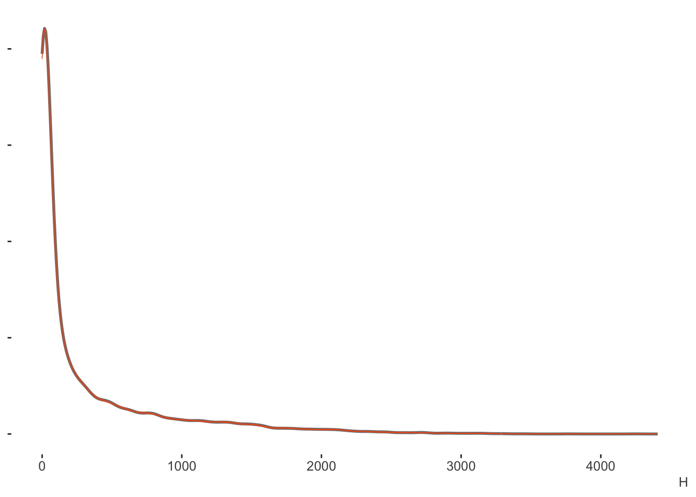
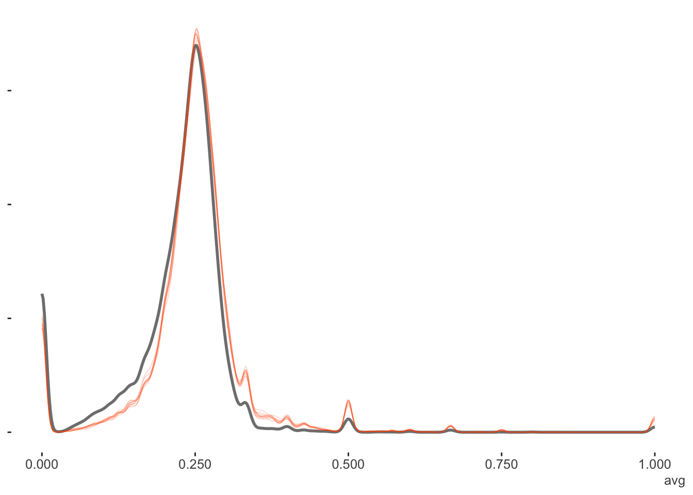
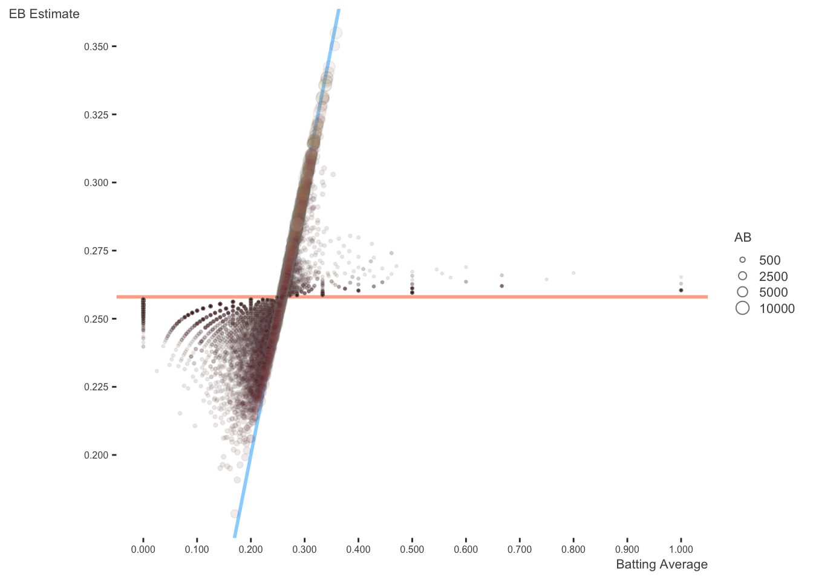
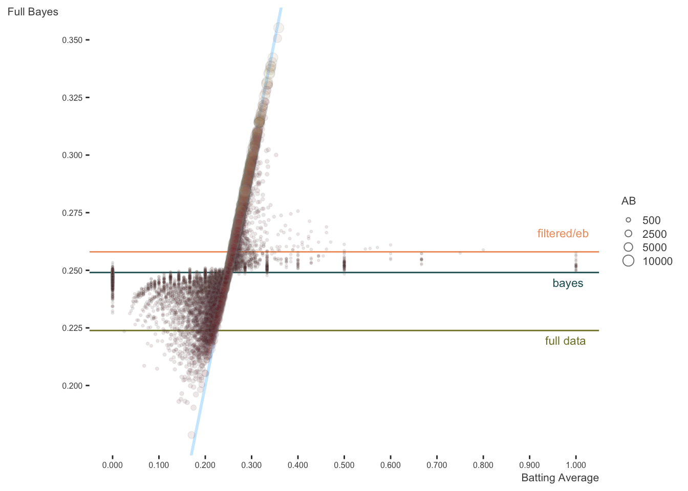
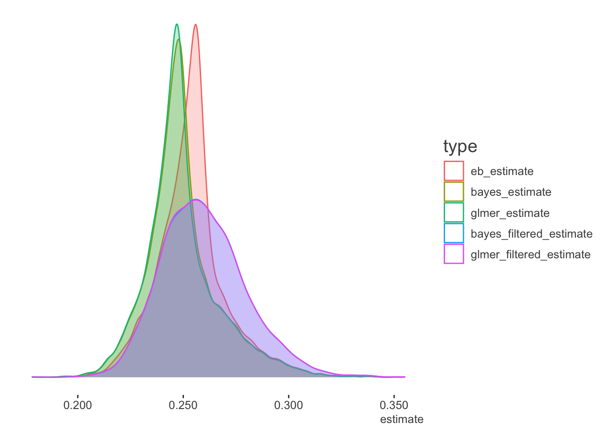

> NB: This post was revisited when updating the website early 2025, and some changes were required. Attempts to keep things consistent were made, but if you feel you’ve found an issue, please post it at [GitHub](http://github.com/m-clark/m-clark.github.io/issues).

## Introduction

A couple of folks I work with in different capacities independently came across [an article](http://varianceexplained.org/r/empirical_bayes_baseball/) by Data Camp’s [David Robinson](http://varianceexplained.org)[^1] demonstrating empirical bayes. It provides a nice and simple example of how to create a prior from the observed data, allowing it to induce shrinkage in estimates, in that case, career batting averages of Major League Baseball players. This would better allow one to compare someone that had only a relatively few at-bats to those that had longer careers.

It is a simple and straightforward demo, and admits that it doesn’t account for many other things that could be brought into the model, but that’s also why it’s effective at demonstrating the technique. However, shrinkage of parameter estimates can be accomplished in other ways, so I thought I’d compare it to two of my preferred ways to do so - a fully Bayesian approach and a random effects/mixed-model approach.

I demonstrate shrinkage in mixed models in more detail [here](http://m-clark.github.io/posts/2019-05-14-shrinkage-in-mixed-models/) and [here](https://m-clark.github.io/mixed-models-with-R/), and I’m not going to explain Bayesian analysis in general, [but feel free to see my doc on it](https://m-clark.github.io/bayesian-basics/). This post is just to provide a quick comparison of techniques.

## Data Setup

We’ll start as we typically do, with the data. The following just duplicates David’s code from the article. Nothing new here. If you want the details, [please read it](http://varianceexplained.org/r/empirical_bayes_baseball/).

``` r
library(dplyr)
library(tidyr)
library(Lahman)

career <- Batting %>%
  filter(AB > 0) %>%
  anti_join(Pitching, by = "playerID") %>%  # This removes Babe Ruth!
  group_by(playerID) %>%
  summarize(H = sum(H), AB = sum(AB)) %>%
  mutate(average = H / AB)

# use names along with the player IDs
career <- People %>%
  as_tibble() %>%
  select(playerID, nameFirst, nameLast) %>%
  unite(name, nameFirst, nameLast, sep = " ") %>%
  inner_join(career, by = "playerID") 

career_filtered <- career %>%
  filter(AB >= 500)
```

With data in place, we can get the empirical bayes estimates. Again, this is just the original code. As a reminder, we assume a beta distribution for batting average, and the mean of the filtered data is 0.258. This finds the corresponding \\\alpha\\ and \\\beta\\ values for the beta distribution using MASS.

The beta distribution can be reparameterized as having a mean and variance: \\\mu = \frac{\alpha}{\alpha + \beta}\\ \\\sigma^2 = \frac{\alpha\beta}{(\alpha + \beta)^2(\alpha + \beta + 1)}\\

``` r
m <- MASS::fitdistr(career_filtered$average, 
                    dbeta,
                    start = list(shape1 = 1, shape2 = 10))

alpha0 <- m$estimate[1]
beta0 <- m$estimate[2]

career_eb <- career %>%
  mutate(eb_estimate = (H + alpha0) / (AB + alpha0 + beta0))
```

  

We use the estimated parameters as input for the beta prior. Let’s examine what we’ve got.

  

Just to refresh, we can see how the EB estimates are able to guess something more meaningful for someone with just a few at-bats than say, a 0 batting average. Even for Ody Abbot there, we would guess something closer to the overall average than their .186 average after 70 plate appearances. With Frank Abercrombie, who had no hits in a measly 4 at bats, with so little information, we’d give him the benefit of the doubt of being average.

From Wikipedia:

> Francis Patterson Abercrombie (January 2, 1851 - November 11, 1939) was an American professional baseball player who played in the National Association for one game as a shortstop in 1871. Born in Fort Towson, Oklahoma, then part of Indian Territory, he played for the Troy Haymakers. He died at age 88 in Philadelphia, Pennsylvania.

Pretty sure that does not qualify for Wikipedia’s notability standards, but oh well.

## Models

As mentioned, I will compare the empirical bayes results to those of a couple of other approaches. They are:

- Bayesian mixed model on full data (using brms)
- Standard mixed model on full data (using lme4)
- Bayesian mixed model on filtered data (at bats greater than 500)
- Standard mixed model on filtered data

The advantages to these are that using a fully Bayesian approach allows us to not approximate the Bayesian and just do it. In the other case, the standard mixed model provides shrinkage with a penalized regression approach which also approximates the Bayesian, but doesn’t require any double dipping of the data to get at a prior, or any additional steps aside from running the model.

In both cases, we can accomplish the desired result with just a standard R modeling approach. In particular, the model is a standard binomial model for counts. With base R glm, we would do something like the following:

``` r
glm(cbind(H, AB-H) ~ ..., data = career_eb, family = binomial)
```

The model is actually for the count of successes out of the total, which R has always oddly done in glm as `cbind(# successes, # failures)` rather than the more intuitive route (my opinion). The brms package will make it more obvious, but glmer uses the glm approach. The key difference for both models relative to the standard binomial is that we add a per-observation random effect for `playerID`[^2].

## Bayesian Model

We’ll start with the full Bayesian approach using brms. This model will struggle a bit[^3], and takes a while to run, as it’s estimating 9983 parameters. But in the end we get what we want.

I later learned the Bayesian model’s depicted here are essentially the same as in the example for one of the [Stan vignettes](https://mc-stan.org/rstanarm/articles/pooling.html).

``` r
# in case anyone wants to use rstanarm I show it here
# library(rstanarm)
# bayes_full = stan_glmer(cbind(H, AB-H) ~ 1 + (1|playerID),
#                         data = career_eb,
#                         family = binomial)

library(brms)
bayes_full = brm(H|trials(AB) ~ 1 + (1|playerID), 
                 data = career_eb,
                 family = binomial,
                 seed = 1234,
                 iter = 1000,
                 thin = 4,
                 cores = 4)
```

With the posterior predictive check we can see right off the bat[^4] that this approach estimates the data well. Our posterior predictive distribution for the number of hits is hardly distinguishable from the observed data.



Again, the binomial model is for counts (out of some total), in this case, the number of hits. But if we wanted proportions, which in this case are the batting averages, we could just divide this result by the AB (at bats) column. Here we can see a little more nuance, especially that the model shies away from the lower values more, but this would still be a good fit by any standards.



## Mixed Model

The lme4 model takes the glm approach as far as syntax goes `cbind(successes, non-successes)`. Very straightforward, and fast, as it doesn’t actually estimate the random effects, but instead *predicts* them. The predicted random effects are in fact akin to empirical bayes estimates[^5].

``` r
glmer_full = lme4::glmer(cbind(H, AB-H) ~ 1 + (1|playerID), 
                         data = career_eb,
                         family = binomial)
```

## Filtered Data Models

Since David’s original ‘prior’ was based only on observations for those who had at least 500+ at bats (essentially a full season), the following re-runs the previous models just for the filtered data set, to see how those comparisons turn out.

``` r
bayes_filtered = brm(H|trials(AB) ~ 1 + (1|playerID), 
                     data = career_eb %>% filter(AB >= 500),
                     family = binomial,
                     iter = 1000,
                     seed = 1234,
                     thin = 4,
                     cores = 4)

glmer_filtered = lme4::glmer(cbind(H, AB-H) ~ 1 + (1|playerID), 
                             data = career_eb %>% filter(AB >= 500),
                             family = binomial)
```

## Prediction Comparisons

Now we’re ready to make some comparisons. We’ll combine the fits from the models to the original data set.

``` r
career_other = career_eb %>% 
  mutate(
    bayes_estimate = fitted(bayes_full)[,1] / AB,
    glmer_estimate = fitted(glmer_full),
  )

career_other_filtered = career_filtered %>% 
  mutate(
    bayes_filtered_estimate = fitted(bayes_filtered)[,1] / AB,
    glmer_filtered_estimate = fitted(glmer_filtered),
  ) %>% 
  select(playerID, contains('filter'))

career_all = left_join(career_other, 
                       career_other_filtered)
```

We can see that the fully Bayesian and standard mixed models are essentially giving us the same values. We start to see slight differences with the EB estimates, especially for those with fewer at-bats. When there is less data, the EB estimates appear to pull more sharply toward the prior.

### Top and bottom predictions

If we just look at the top 10, we would not come to any different conclusions (only full data models shown).

``` r
top_10_eb = career_all %>% 
  top_n(10, eb_estimate) %>% 
  select(playerID, eb_estimate)

top_10_bayes = career_all %>% 
  top_n(10, bayes_estimate) %>% 
  select(playerID, bayes_estimate)

top_10_mixed = career_all %>% 
  top_n(10, glmer_estimate) %>% 
  select(playerID, glmer_estimate)
```

| playerID  | eb_estimate | bayes_estimate | glmer_estimate |
|:----------|------------:|---------------:|---------------:|
| delahed01 |       0.342 |          0.342 |          0.342 |
| gehrilo01 |       0.337 |          0.337 |          0.337 |
| gwynnto01 |       0.336 |          0.335 |          0.336 |
| hamilbi01 |       0.340 |          0.340 |          0.341 |
| heilmha01 |       0.338 |          0.338 |          0.339 |
| hornsro01 |       0.355 |          0.355 |          0.355 |
| jacksjo01 |       0.350 |          0.351 |          0.350 |
| keelewi01 |       0.338 |          0.339 |          0.338 |
| lajoina01 |       0.336 |          0.336 |          0.336 |
| terrybi01 |       0.337 |          0.338 |          0.337 |

Same for the bottom 10, although we see a little more wavering on the fitted values, as some of these are the ones who have relatively fewer at bats, and would see more shrinkage as a result.

``` r
bottom_10_eb = career_all %>% 
  top_n(-10, eb_estimate) %>% 
  select(playerID, eb_estimate)

bottom_10_bayes = career_all %>% 
  top_n(-10, bayes_estimate) %>% 
  select(playerID, bayes_estimate)

bottom_10_mixed = career_all %>% 
  top_n(-10, glmer_estimate) %>% 
  select(playerID, glmer_estimate)
```

| playerID  | eb_estimate | bayes_estimate | glmer_estimate |
|:----------|------------:|---------------:|---------------:|
| armbrch01 |       0.199 |          0.197 |          0.197 |
| bakerge01 |       0.196 |          0.193 |          0.194 |
| bergebi01 |       0.178 |          0.179 |          0.178 |
| eastehe01 |       0.196 |          0.196 |          0.195 |
| gladmbu01 |       0.196 |          0.194 |          0.194 |
| hedgeau01 |       0.199 |          0.198 |          0.198 |
| humphjo01 |       0.195 |          0.193 |          0.193 |
| oylerra01 |       0.191 |          0.190 |          0.190 |
| traffbi01 |       0.201 |          0.199 |          0.199 |
| vukovjo01 |       0.195 |          0.193 |          0.193 |

### Extreme predictions

Now let’s look at some more extreme predictions. Those who averaged 0 or 1 for their lifetime batting average. Note that none of these will have very many plate appearances, and will show the greatest shrinkage. As a reminder, the filtered models did not include any of these individuals, and so are not shown.

  

  

## Visualizing the Results

The following reproduces David’s plots. I start with his [original image](http://varianceexplained.org/figs/2015-10-01-empirical_bayes_baseball/unnamed-chunk-11-1.png), altered only to be consistent with my visualization choices that use different color choices, add transparency, and allow size to reflect the number of at bats. Here is his explanation:

> The horizontal dashed red line marks \\y=\alpha_0/\alpha_0+\beta_0=0.259\\ - that’s what we would guess someone’s batting average was if we had no evidence at all. Notice that points above that line tend to move down towards it, while points below it move up. The diagonal red line marks \\x=y\\. Points that lie close to it are the ones that didn’t get shrunk at all by empirical Bayes. Notice that they’re the ones with the highest number of at-bats (the brightest blue): they have enough evidence that we’re willing to believe the naive batting average estimate.



Again, this is the same plot, but the size (along with color), which represents the number of at-bats, shows more clearly how observations don’t exhibit as much shrinkage when there is enough information.

Here is the same plot against the full bayes estimates. The original lines are kept, but I add lines representing the average of the whole data, and the intercept from the Bayesian analysis (which is essentially the same as with the mixed model). In this case, estimates are pulled toward the estimated model mean.



  

We can also look at the density plots for more perspective. The full data models for the Bayesian and mixed models are basically coming to the same conclusions. The filtered data estimates center on the filtered data mean batting average as expected, but the mixed and Bayesian models show more variability in the estimates, as they are not based on the full data. As the EB prior is based on the filtered data, the distribution of values is similar to the others, but shifted to the filtered data mean. Thus it is coming to slightly different conclusions about the expected batting averages in general[^6].

  



## Summary

Here we have enhanced the original empirical bayes story with the addition of full bayes estimates and those from a standard mixed model. In terms of approximating Bayesian results, the empirical bayes are similar, but shifted due to the choice of prior. On the practical side, the mixed model would be easier to run and appears to more closely approximate the full bayes approach. In your own situation, any of these might be viable.

## Addendum

### Beta-binomial

David mentioned the beta-binomial distribution in his post. In this case, the prior for the probability of the binomial is assumed to be beta distributed. The [brms vignette](https://cran.r-project.org/web/packages/brms/vignettes/brms_customfamilies.html) shows an example of how to use this distribution, and the following reproduces it for our data. You will likely need more iterations and possibly other fiddling to obtain convergence.

``` r
beta_binomial2 <- custom_family(
  "beta_binomial2", 
  dpars = c("mu", "phi"),
  links = c("logit", "log"), 
  lb = c(NA, 0),
  type = "int", 
  vars = "trials[n]"
)


stan_funs <- "
  real beta_binomial2_lpmf(int y, real mu, real phi, int T) {
    return beta_binomial_lpmf(y | T, mu * phi, (1 - mu) * phi);
  }
  int beta_binomial2_rng(real mu, real phi, int T) {
    return beta_binomial_rng(T, mu * phi, (1 - mu) * phi);
  }
"


stanvars <- stanvar(scode = stan_funs, block = "functions") +
  stanvar(as.integer(career_eb$AB), name = "trials")

fit2 <- brm(
  H ~ (1|playerID), 
  data = career_eb, 
  family = beta_binomial2, 
  stanvars = stanvars,
  seed = 1234,
  iter = 1000,
  cores = 4
)

summary(fit2)

expose_functions(fit2, vectorize = TRUE)

predict_beta_binomial2 <- function(i, draws, ...) {
  mu <- draws$dpars$mu[, i]
  phi <- draws$dpars$phi
  N <- draws$data$trials[i]
  beta_binomial2_rng(mu, phi, N)
}

fitted_beta_binomial2 <- function(draws) {
  mu <- draws$dpars$mu
  trials <- draws$data$trials
  trials <- matrix(trials, nrow = nrow(mu), ncol = ncol(mu), byrow = TRUE)
  mu * trials
}

pp_check(fit2)
fitted(fit2, summary = T)[,1]
fitted(fit2, summary = T)[,1]/career_eb$AB
prior_summary(fit2)


## Using stan for just an intercept only model to get the parameter estimates
# takes about a minute per chain

model_code = "
data {
  int N;
  int H [N];
  int AB [N];

}

parameters {
  real alpha;  // setting lower = 0 provides serious estimation problems, without, just warnings
  real beta;
}

model {
  H ~ beta_binomial(AB, alpha, beta);
}

generated quantities {
  vector[N] avg;
  int pred [N];

  pred = beta_binomial_rng(AB, alpha, beta);

  for (n in 1:N) avg[n] = 1.0*pred[n] / AB[n];
}
"

library(rstan)
data_list = list(H = career_eb$H, AB = career_eb$AB, N = nrow(career_eb))

bayes_beta_binomial = stan(model_code = model_code,
                           data  = data_list,
                           seed  = 1234,
                           iter  = 1000,
                           cores = 4)

print(bayes_beta_binomial, digits = 3)
# dr_bin = c(78.661, 224.875)           # beta estimates from DR post
# dr_betabin = c(75, 222)               # beta binomial estimates from DR pots
# stan_betabin = c(74.784, 223.451)     # stan estimates from above ~ .251 avg
```

## Footnotes

## Reuse

[CC BY-SA 4.0](https://creativecommons.org/licenses/by-sa/4.0/)

## Citation

BibTeX citation:

``` quarto-appendix-bibtex
@online{clark2019,
  author = {Clark, Michael},
  title = {Empirical {Bayes}},
  date = {2019-06-21},
  url = {https://m-clark.github.io/posts/2019-06-21-empirical-bayes/},
  langid = {en}
}
```

For attribution, please cite this work as:

Clark, Michael. 2019. “Empirical Bayes.” June 21. <https://m-clark.github.io/posts/2019-06-21-empirical-bayes/>.

[^1]: David is actually responsible for me starting to do blog posts this year as a supplement to my more involved documents and workshops. At his talk at the RStudio conference, he laid out the benefits of blogging and in general doing anything to share one’s work with the greater community, and it made sense to me to use this as a less formal outlet.

[^2]: This is possible for mixed models for counts like binomial and poisson (and other distributions) where we don’t estimate the residual variance, as it is determined by the nature of the distribution’s mean-variance relationship. In this case, it allows us to deal with overdispersion in this model via the random effect variance. See the [GLMM FAQ](https://bbolker.github.io/mixedmodels-misc/glmmFAQ.html#fitting-models-with-overdispersion).

[^3]: One chain always struggled with the brms defaults, but diagnostics were okay.

[^4]: Not sorry!

[^5]: See [Bates’ comment](https://stat.ethz.ch/pipermail/r-sig-mixed-models/2009q4/002984.html).

[^6]: I actually redid the empirical bayes based on the full data. One issue was that fitting the beta required nudging the 0s and 1s, because the beta distribution doesn’t include 0 and 1. In the end, the resulting estimates mostly followed the original data. It had a very large and long tail for values less than .200, and on the the other end, estimated some batting averages over .500.
