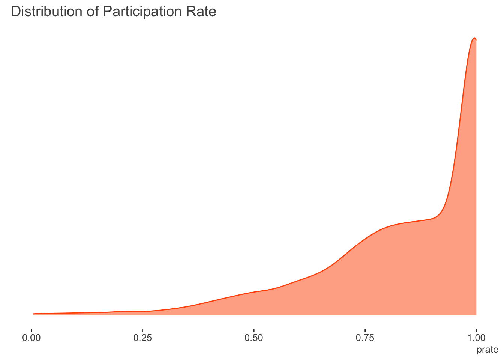

> NB: This post was revisited when updating the website early 2025, and some changes were required. Attempts to keep things consistent were made, but if you feel you’ve found an issue, please post it at [GitHub](http://github.com/m-clark/m-clark.github.io/issues).

## Introduction

It is sometimes the case that you might have data that falls primarily between zero and one. For example, these may be proportions, grades from 0-100 that can be transformed as such, reported percentile values, and similar. If you had the raw counts where you also knew the denominator or total value that created the proportion, you would be able to just use standard logistic regression with the binomial distribution. Similarly, if you had a binary outcome (i.e. just zeros and ones), this is just a special case, so the same model would be applicable. Alternatively, if all the target variable values lie between zero and one, beta regression is a natural choice for which to model such data. However, if the variable you wish to model has values between zero and one, and additionally, you also have zeros or ones, what should you do?

Some suggest adding a ‘fudge factor’ to the zeros or ones to put all values on the (0, 1) interval, so that beta regression could still be employed. Others might implement zero/one-inflated beta regression if a larger percentage of the observations are at the boundaries. However, as we will see, you already have more standard tools that are appropriate for this modeling situation, and this post will demonstrate some of them.

#### Related models

- Binomial logistic for binary and count/proportional data, i.e. \\x\\ successes out of \\n\\ trials (can use standard glm tools)
- Beta regression for (0, 1), i.e. only values *between* 0 and 1 (see [betareg](https://cran.r-project.org/web/packages/betareg/vignettes/betareg.pdf), [DirichletReg](https://cran.r-project.org/web/packages/DirichletReg/vignettes/DirichletReg-vig.pdf), [mgcv](https://cran.r-project.org/web/packages/mgcv/), [brms](https://cran.r-project.org/web/packages/brms/) packages)
- Zero/One-inflated binomial or beta regression for cases including a relatively high amount of zeros and ones ([brms](https://cran.r-project.org/web/packages/brms/vignettes/brms_overview.pdf), [VGAM](https://www.stat.auckland.ac.nz/~yee/VGAM/), [gamlss](https://www.gamlss.com/))

## Stata example

It might seem strange to start with an example using Stata[^1], but if you look this sort of thing up, you’ll almost certainly come across the [Stata demonstration](https://www.stata.com/features/overview/fractional-outcome-models/) using the fracreg command. For comparison we’ll use the data in the corresponding [documentation](https://www.stata.com/manuals/rfracreg.pdf). The data regards the expected participation rate in 401(k) plans for a cross-section of firms[^2]. They define participation rate (`prate`) as the fraction of eligible employees in a firm that participate in a 401(k) plan. This is modeled by the matching rate of employee 401(k) contributions (`mrate`), the (natural) log of the total number of employees (`ltotemp`), the age of the plan (`age`), and whether the 401(k) plan is the only retirement plan offered by the employer (`sole`). Here we do not use quadratic effects for `ltotemp` and `age` as in the Stata documentation, though we do use an additive modeling approach later that could be implemented for the same purpose instead[^3].

The following shows the distribution of the target variable. There are no zeroes in the participation rate, however the amount of ones is 33.2%.

  



The following specifies a fractional regression with logit link. Probit and heteroscedastic probit are also available.

``` stata
use http://www.stata-press.com/data/r14/401k

fracreg logit prate mrate c.ltotemp c.age i.sole
```

    . use http://www.stata-press.com/data/r14/4. 
    . fracreg logit prate mrate c.ltotemp c.age i.sole

    Iteration 0:   log pseudolikelihood = -1985.1469  
    Iteration 1:   log pseudolikelihood = -1689.2659  
    Iteration 2:   log pseudolikelihood = -1681.1055  
    Iteration 3:   log pseudolikelihood = -1681.0263  
    Iteration 4:   log pseudolikelihood = -1681.0263  

    Fractional logistic regression                  Number of obs     =      4,075
                                                    Wald chi2(4)      =     685.26
                                                    Prob > chi2       =     0.0000
    Log pseudolikelihood = -1681.0263               Pseudo R2         =     0.0596

    ------------------------------------------------------------------------------
                 |               Robust
           prate |      Coef.   Std. Err.      z    P>|z|     [95% Conf. Interval]
    -------------+----------------------------------------------------------------
           mrate |   1.157832   .0749231    15.45   0.000     1.010986    1.304679
         ltotemp |  -.2072429   .0141468   -14.65   0.000      -.23497   -.1795157
             age |   .0345786   .0027604    12.53   0.000     .0291684    .0399888
                 |
            sole |
      only plan  |   .1655762   .0506445     3.27   0.001     .0663147    .2648377
           _cons |   2.391717   .1061292    22.54   0.000     2.183707    2.599726
    ------------------------------------------------------------------------------

Perhaps not surprisingly, all of the covariates are statistically notable. With the logistic link, the coefficients can be exponentiated to provide odds ratios[^4]. Stata’s is one of the few tools that is specifically advertised to model such outcomes, but as we’re about to see, you don’t need Stata’s command, or even a special package in R, once you know what’s going on.

## R GLM

It turns out that the underlying likelihood for fractional regression in Stata is the same as the standard binomial likelihood we would use for binary or count/proportional outcomes. In the following, \\y\\ is our target variable, \\X\beta\\ is the linear predictor, and \\g(.)\\ is the link function, for example, the logit.

\\\mathcal{L} \sim y(\ln{g(X\beta)}) + (1-y)(1-\ln{g(X\beta)})\\

As such, we can just use glm like we would for count or binary outcomes. It will warn you that the outcome isn’t integer as it expects, but in this case we can just ignore the warning.

``` r
d = haven::read_dta('data/401k.dta')

model_glm = glm(
  prate ~ mrate + ltotemp + age + sole,
  data = d,
  family = binomial
)
```

    Warning in eval(family$initialize): non-integer #successes in a binomial glm!

``` r
# summary(model_glm)
```

| term        | estimate | std.error | statistic | p.value |
|:------------|---------:|----------:|----------:|--------:|
| (Intercept) |    2.392 |     0.227 |    10.520 |   0.000 |
| mrate       |    1.158 |     0.147 |     7.887 |   0.000 |
| ltotemp     |   -0.207 |     0.029 |    -7.143 |   0.000 |
| age         |    0.035 |     0.006 |     5.678 |   0.000 |
| sole        |    0.166 |     0.104 |     1.591 |   0.112 |

So the model runs fine, and the coefficients are the same as the Stata example. The only difference regards the standard errors, but we can fix that.

## Robust standard errors

The difference in the standard errors is that, by default, Stata reports robust standard errors. We can use the sandwich package to get them in R. The lmtest package provides a nice summary table.

``` r
library(lmtest)
library(sandwich)

se_glm_robust = coeftest(model_glm, vcov = vcovHC(model_glm, type="HC"))
```

| term        | estimate | std.error | statistic | p.value |
|:------------|---------:|----------:|----------:|--------:|
| (Intercept) |    2.392 |     0.106 |    22.539 |   0.000 |
| mrate       |    1.158 |     0.075 |    15.455 |   0.000 |
| ltotemp     |   -0.207 |     0.014 |   -14.651 |   0.000 |
| age         |    0.035 |     0.003 |    12.528 |   0.000 |
| sole        |    0.166 |     0.051 |     3.270 |   0.001 |

So now we have the same result via a standard R generalized linear model and Stata. Likewise, you could just use the glm command in Stata with the `vce(robust)` option.

## Quasibinomial

We could also use the quasibinomial family. [Quasi-likelihoods](https://en.wikipedia.org/wiki/Quasi-likelihood) are similar to standard likelihood functions, but technically do not relate to any particular probability distribution[^5]. Using this family would provide the same result as the previous glm, but without the warning.

From the R help file for `?family`: The quasibinomial and quasipoisson families differ from the binomial and poisson families only in that the dispersion parameter is not fixed at one, so they can model over-dispersion.

Also, as noted in the StackExchange link in the [references](#references), while by default the variance estimate is ‘robust’, possibly leading to standard errors that are similar, the basic result is not the same as using the robust standard errors.

``` r
model_quasi = glm(
  prate ~ mrate + ltotemp + age + sole,
  data = d,
  family = quasibinomial
)

# summary(model_quasi)
```

| term        | estimate | std.error | statistic | p.value |
|:------------|---------:|----------:|----------:|--------:|
| (Intercept) |    2.392 |     0.105 |    22.684 |   0.000 |
| mrate       |    1.158 |     0.068 |    17.006 |   0.000 |
| ltotemp     |   -0.207 |     0.013 |   -15.402 |   0.000 |
| age         |    0.035 |     0.003 |    12.244 |   0.000 |
| sole        |    0.166 |     0.048 |     3.431 |   0.001 |

We can get robust standard errors for the quasi-likelihood approach as well, but they were already pretty close.

``` r
se_glm_robust_quasi = coeftest(model_quasi, vcov = vcovHC(model_quasi, type="HC"))
```

| term        | estimate | std.error | statistic | p.value |
|:------------|---------:|----------:|----------:|--------:|
| (Intercept) |    2.392 |     0.106 |    22.539 |   0.000 |
| mrate       |    1.158 |     0.075 |    15.455 |   0.000 |
| ltotemp     |   -0.207 |     0.014 |   -14.651 |   0.000 |
| age         |    0.035 |     0.003 |    12.528 |   0.000 |
| sole        |    0.166 |     0.051 |     3.270 |   0.001 |

## Mixed model with per-observation random effect

It turns out that we can also use a [mixed model](https://m-clark.github.io/mixed-models-with-R/) approach. For some distributions such as binomial and poisson, the variance is directly tied to the mean function, and so does not have to be estimated. In these scenarios, we can insert a per-observation random effect and estimate the associated variance. This extra source of variance can account for overdispersion, similar to what the scale parameter estimate does for the quasibinomial.

I initially attempted to do so using the popular mixed model package lme4 and its glmer function, with an observation level random effect. While I’ve had success using this package with such models in the past, in this particular instance, all failed to converge with default optimization settings across multiple optimizers. As such, those results are not shown.

``` r
d$id = 1:nrow(d)

## model_glmm = lme4::glmer(
##   prate ~ mrate + ltotemp + age + sole + (1 | id),
##   data = d,
##   family = binomial
## )
## 
## summary(model_glmm, cor=F)
## 
## test_models = lme4::allFit(model_glmm)
## 
## summary(test_models)
```

  

We have options though. The glmmTMB package was able to estimate the model.

  

``` r
library(glmmTMB)

model_glmm = glmmTMB(
  prate ~ mrate + ltotemp + age + sole + (1 | id),
  data = d,
  family = binomial,
  REML = TRUE
)

# summary(model_glmm)
```

| term        | estimate | std.error | statistic | p.value |
|:------------|---------:|----------:|----------:|--------:|
| (Intercept) |    2.392 |     0.227 |    10.520 |   0.000 |
| mrate       |    1.158 |     0.147 |     7.887 |   0.000 |
| ltotemp     |   -0.207 |     0.029 |    -7.143 |   0.000 |
| age         |    0.035 |     0.006 |     5.678 |   0.000 |
| sole        |    0.166 |     0.104 |     1.591 |   0.112 |

We can maybe guess why glmer was struggling. The extra variance is estimated by glmmTMB to be basically zero.

Lately, I’ve been using mgcv to do most of my mixed models, so we can try a GAM instead. The following is equivalent to the glm-quasibinomial approach before.

``` r
library(mgcv)

model_gam_std = gam(
  prate ~ mrate + ltotemp + age + sole, 
  data = d, 
  family = quasibinomial
)

# summary(model_gam_std)
```

| term        | estimate | std.error | statistic | p.value |
|:------------|---------:|----------:|----------:|--------:|
| (Intercept) |    2.392 |     0.104 |    22.908 |   0.000 |
| mrate       |    1.158 |     0.067 |    17.174 |   0.000 |
| ltotemp     |   -0.207 |     0.013 |   -15.554 |   0.000 |
| age         |    0.035 |     0.003 |    12.365 |   0.000 |
| sole        |    0.166 |     0.048 |     3.464 |   0.001 |

The following adds the per observation random effect as with the mixed model. Unlike with lme4 or glmmTMB, you can technically use the `quasi` family here as well, but I will follow Bates’ thinking and avoid doing so[^6]. I will also calculate the robust standard errors.

``` r
model_gam_re = gam(
  prate ~ mrate + ltotemp + age + sole + s(id, bs = 're'),
  data = d,
  family = binomial,
  method = 'REML'
)

# summary(model_gam_re)
```

| term        | estimate | std.error | statistic | p.value |
|:------------|---------:|----------:|----------:|--------:|
| (Intercept) |    2.392 |     0.227 |    10.519 |   0.000 |
| mrate       |    1.158 |     0.147 |     7.887 |   0.000 |
| ltotemp     |   -0.207 |     0.029 |    -7.143 |   0.000 |
| age         |    0.035 |     0.006 |     5.678 |   0.000 |
| sole        |    0.166 |     0.104 |     1.591 |   0.112 |

## Summarized results

The following tables show the results of the models. The first table regards the estimated coefficients, the second the standard errors. There are no differences for the coefficients. For standard errors, some approaches are definitely working better than others.

| baseline_glm | stata | glm_robust | glm_robust_quasi | gam_re_robust | gam_std | glmm_std |
|---:|---:|---:|---:|---:|---:|---:|
| 2.3917 | -2.3917 | 2.3917 | 2.3917 | 2.3917 | 2.3917 | 2.3917 |
| 1.1578 | 1.1578 | 1.1578 | 1.1578 | 1.1578 | 1.1578 | 1.1578 |
| -0.2072 | -0.2072 | -0.2072 | -0.2072 | -0.2072 | -0.2072 | -0.2072 |
| 0.0346 | 0.0346 | 0.0346 | 0.0346 | 0.0346 | 0.0346 | 0.0346 |
| 0.1656 | 0.1656 | 0.1656 | 0.1656 | 0.1656 | 0.1656 | 0.1656 |

Coefficients {.table .caption-top .table-sm .table-striped .small}

| baseline_glm |  stata | glm_robust | glm_robust_quasi | gam_re_robust | gam_std | glmm_std |
|-------------:|-------:|-----------:|-----------------:|--------------:|--------:|---------:|
|       0.2274 | 0.1061 |     0.1061 |           0.1061 |        0.1061 |  0.1044 |   0.2274 |
|       0.1468 | 0.0749 |     0.0749 |           0.0749 |        0.0749 |  0.0674 |   0.1468 |
|       0.0290 | 0.0141 |     0.0141 |           0.0141 |        0.0141 |  0.0133 |   0.0290 |
|       0.0061 | 0.0028 |     0.0028 |           0.0028 |        0.0028 |  0.0028 |   0.0061 |
|       0.1041 | 0.0506 |     0.0506 |           0.0506 |        0.0506 |  0.0478 |   0.1041 |

Standard Errors {.table .caption-top .table-sm .table-striped .small}

## Conclusion

Fractional data occurs from time to time. While Stata and R have specific functionality for such outcomes, more commonly used statistical tools can be used, which might provide additional means of model exploration. In the demo above, a standard glm with robust errors would be fine, and the simplest to pull off. With that as a basis, other complexities could be incorporated in more or less a standard fashion.

## References

[Stata demo](https://www.stata.com/features/overview/fractional-outcome-models/)

[Stata reference on fracreg command](https://www.stata.com/manuals/rfracreg.pdf)

McCullagh P. and Nelder, J. A. (1989) Generalized Linear Models. London: Chapman and Hall.

Papke & Wooldridge. (1996) Econometric Methods For Fractional Response Variables With An Application To 401 (K) Plan Participation Rates. [link](https://onlinelibrary.wiley.com/doi/epdf/10.1002/%28SICI%291099-1255%28199611%2911%3A6%3C619%3A%3AAID-JAE418%3E3.0.CO%3B2-1)

Ramalho, E., Ramalho, J. & Coelho, L. (2016) Exponential Regression of Fractional-Response Fixed-Effects Models with an Application to Firm Capital Structure. Journal of Econometric Methods. [link](https://www.degruyter.com/view/j/jem.2018.7.issue-1/jem-2015-0019/jem-2015-0019.xml)

Ramalho, E., Ramalho, J. & Murteira, J. (2011) Alternative Estimating And Testing Empirical Strategies For Fractional Regression Models. [link](https://onlinelibrary.wiley.com/doi/full/10.1111/j.1467-6419.2009.00602.x)

StackExchange has some more useful discussion, e.g. more on standard error differences between the approaches and other context [link](https://stats.stackexchange.com/questions/89999/how-to-replicate-statas-robust-binomial-glm-for-proportion-data-in-r/205040), [link2](https://stats.stackexchange.com/questions/189190/glm-with-logit-link-and-gaussian-family-to-predict-a-continuous-dv-between-0-and)

## Footnotes

## Reuse

[CC BY-SA 4.0](https://creativecommons.org/licenses/by-sa/4.0/)

## Citation

BibTeX citation:

``` quarto-appendix-bibtex
@online{clark2019,
  author = {Clark, Michael},
  title = {Fractional {Regression}},
  date = {2019-08-20},
  url = {https://m-clark.github.io/posts/2019-08-20-fractional-regression/},
  langid = {en}
}
```

For attribution, please cite this work as:

Clark, Michael. 2019. “Fractional Regression.” August 20. <https://m-clark.github.io/posts/2019-08-20-fractional-regression/>.

[^1]: Given that I’m an avid R user. But if that was not apparent, then using Stata is possibly no surprise at all! 😄

[^2]: I added the original data, which has the raw values and many more observations, to my [noiris package](https://github.com/m-clark/noiris).

[^3]: I actually played with this a bit. The quadratic would be okay for `age`, but log firm size has a little more going on and `mrate` should also be allowed to wiggle. There would also be some interesting smooth interactions. In short, a [generalized additive model](https://m-clark.github.io/generalized-additive-models/) is pretty much always a better option than trying to guess polynomials.

[^4]: In Stata you can just add the option `, or` to the end of the model line.

[^5]: This is in fact what fracreg in Stata is doing.

[^6]: From [Doug Bates](lme4.r-forge.r-project.org/slides/2011-03-16-Amsterdam/5GLMM.pdf): In many application areas using ‘pseudo’ distribution families, such as quasibinomial and quasipoisson, is a popular and well-accepted technique for accommodating variability that is apparently larger than would be expected from a binomial or a Poisson distribution. This amounts to adding an extra parameter, like σ, the common scale parameter in a LMM, to the distribution of the response. It is possible to form an estimate of such a quantity during the IRLS algorithm but it is an artificial construct. There is no probability distribution with such a parameter. I find it difficult to define maximum likelihood estimates without a probability model. It is not clear how this ‘distribution which is not a distribution’ could be incorporated into a GLMM. This, of course, does not stop people from doing it but I don’t know what the estimates from such a model would mean.
