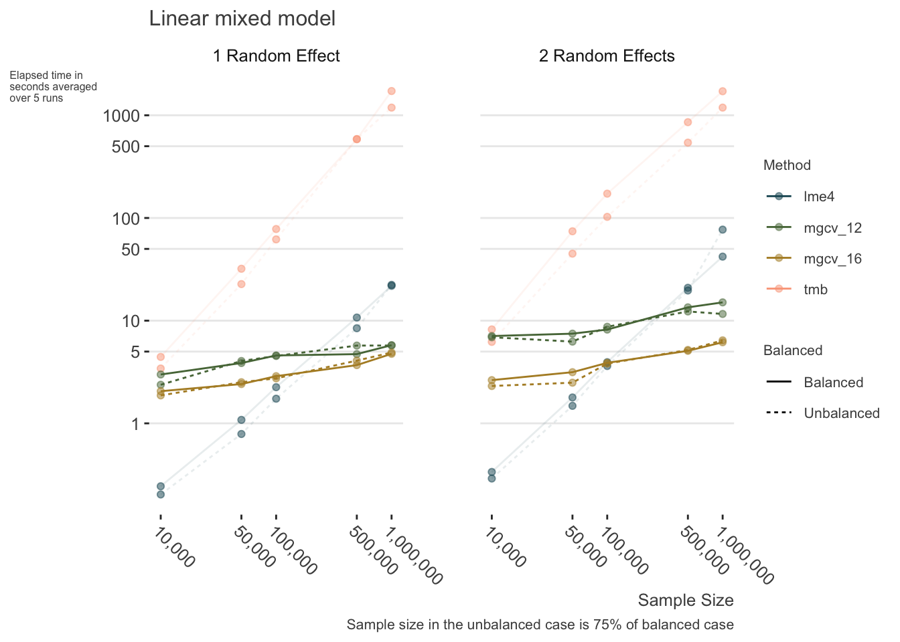
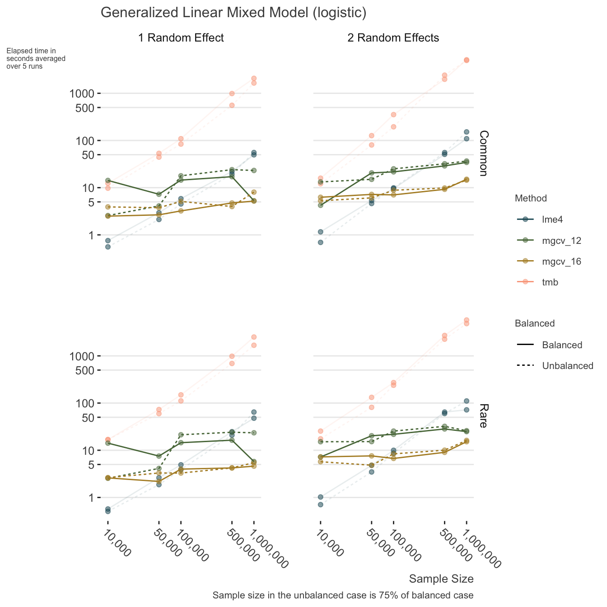
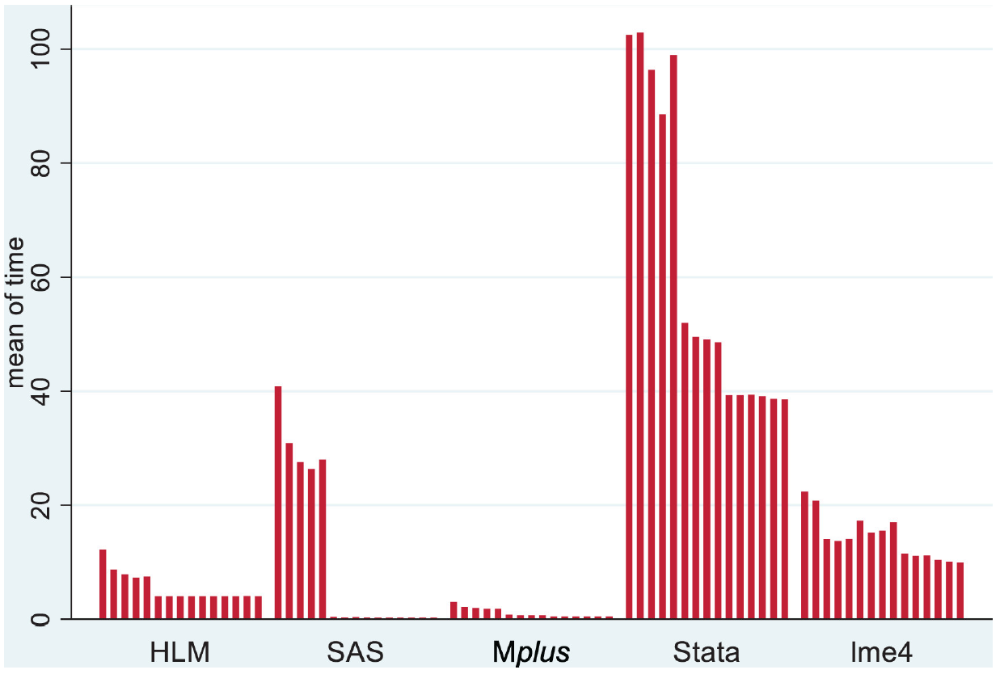
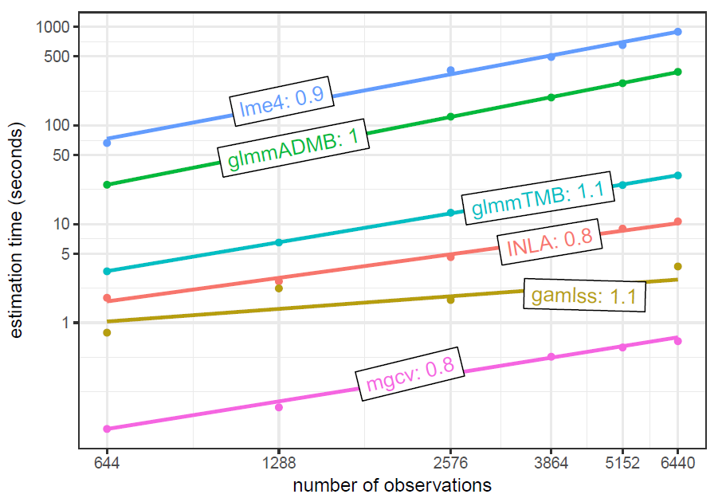
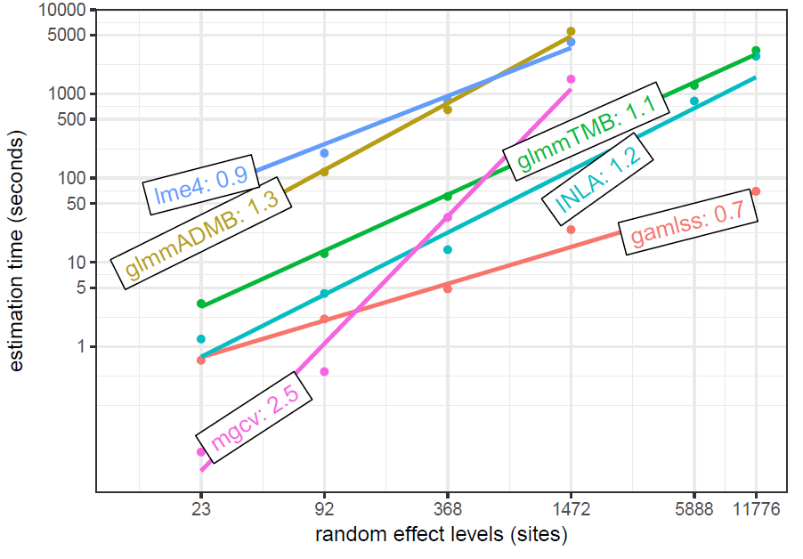
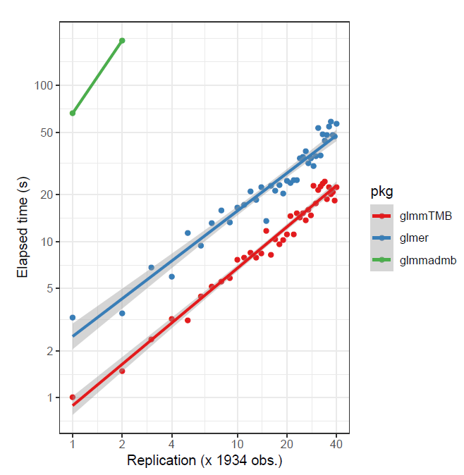
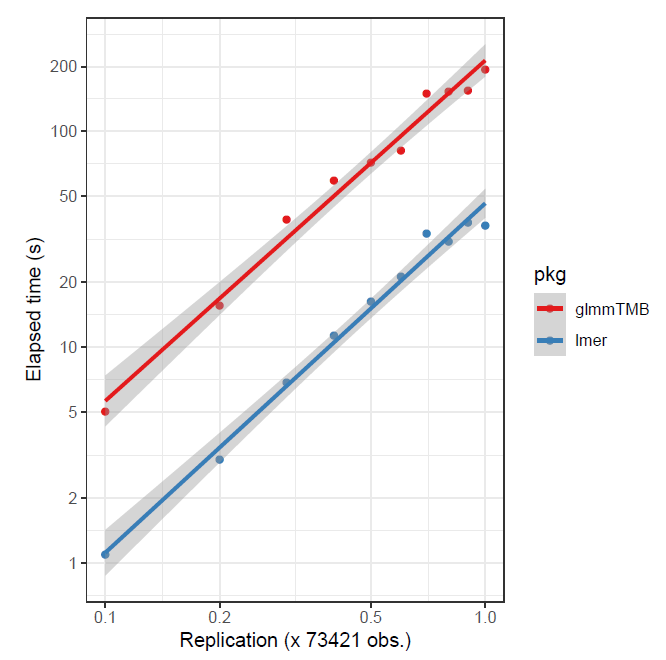

Last updated January 02, 2025. Timings based on original date of posting.

NOTE: When redoing my website, some of the results were not saved as needed, so it may be possible to see a mismatch with printed results vs. text description. It was also easier to run bam in parallel, but nowadays this requires openmp which likely won’t be recognized even if you have it installed. As of 2023, I have some packages work with it (data.table), and others not (mgcv).

## Introduction

With mixed models, it is easy to run into data that is larger in size than some more typical data scenarios. Consider a cross-sectional data set with 200 individuals. This is fairly small data. Now, if we observe them each five times, as in a longitudinal setting, we suddenly have 1000 observations. There may be less than 200 countries in the world, but if we survey 100s or 1000s of people in many of them, we suddenly have a notable data set size, and still would potentially like to model a country-level random effect. What are our options when dealing with possibly gigabytes of data?

This post will demonstrate an approach that can be used with potentially millions of data points, multiple random effects, and possibly other complexities. First we’ll demonstrate how to get typical mixed model results using the approach used for generalized additive models. We’ll compare the output of the GAM, lme4, and even fully Bayesian mixed models. Then we’ll show some timings to compare the speed of the different approaches of common tools, and summarize some findings from other places.

\[Background required:

For the following you should have familiarity with [mixed models](https://m-clark.github.io/mixed-models-with-R/). Knowledge of the lme4 package would be useful but isn’t required. Likewise, knowledge of [generalized additive models](https://m-clark.github.io/generalized-additive-models/) and mgcv would be helpful, but I don’t think it’s required to follow the demonstration.\]{.aside}

## R Packages for Mixed Models with Large Data

While many tools abound to conduct mixed models for larger data sizes, their limitations can be found pretty quickly. R’s lme4 is a standard, but powerful mixed model tool. More to the point, it is computationally efficient, such that it can handle very large sample sizes for simpler mixed models. For linear mixed models this can include hundreds of thousands of observations with possibly multiple random effects, still running on a basic laptop. For such models, it’s still largely the tool of choice, and its approach has even been copied/ported into other statistical packages.

We’ll first create some data to model. This is just a simple random intercepts setting.

``` r
set.seed(12358)
N = 1e6                                  # total sample size
n_groups = 1000                          # number of groups
g = rep(1:n_groups, e = N/n_groups)      # the group identifier

x = rnorm(N)                             # an observation level continuous variable
b = rbinom(n_groups, size = 1, prob=.5)  # a cluster level categorical variable
b = b[g]

sd_g = .5     # standard deviation for the random effect
sigma = 1     # standard deviation for the observation

re0 = rnorm(n_groups, sd = sd_g)  # random effects
re  = re0[g]

lp = 0 + .5*x + .25*b + re        # linear predictor 

y = rnorm(N, mean = lp, sd = sigma)               # create a continuous target variable
y_bin = rbinom(N, size = 1, prob = plogis(lp))    # create a binary target variable

d = tibble(x, b, y, y_bin, g = factor(g))
```

  

Let’s take a look at the data first.

|   index |      x |   b |      y | y_bin | g    |
|--------:|-------:|----:|-------:|------:|:-----|
|       1 | -0.378 |   0 | -0.278 |     1 | 1    |
|       2 | -0.812 |   0 | -0.343 |     0 | 1    |
|       3 |  0.218 |   0 | -0.810 |     1 | 1    |
|       4 |  1.529 |   0 |  0.465 |     1 | 1    |
|       5 | -1.877 |   0 | -1.570 |     0 | 1    |
|       6 | -0.427 |   0 |  0.047 |     0 | 1    |
|  999995 | -1.181 |   1 | -1.111 |     0 | 1000 |
|  999996 | -1.487 |   1 |  0.563 |     1 | 1000 |
|  999997 | -1.236 |   1 | -0.603 |     0 | 1000 |
|  999998 |  0.412 |   1 |  0.736 |     0 | 1000 |
|  999999 | -0.644 |   1 | -1.257 |     1 | 1000 |
| 1000000 |  0.409 |   1 |  0.520 |     1 | 1000 |

Now with the data in place, let’s try lme4 to model the continuous outcome.

The time to focus on is `elapsed`, which is the number of seconds the function took to run.

``` r
library(lme4)

system.time({
  mixed_big = lmer(y ~ x + b + (1|g))
})
```

       user  system elapsed 
      3.573   0.250   3.902 

``` r
summary(mixed_big, cor = FALSE)
```

    Linear mixed model fit by REML ['lmerMod']
    Formula: y ~ x + b + (1 | g)

    REML criterion at convergence: 2841256

    Scaled residuals: 
        Min      1Q  Median      3Q     Max 
    -4.6066 -0.6743 -0.0004  0.6744  5.0367 

    Random effects:
     Groups   Name        Variance Std.Dev.
     g        (Intercept) 0.2509   0.5009  
     Residual             0.9978   0.9989  
    Number of obs: 1000000, groups:  g, 1000

    Fixed effects:
                 Estimate Std. Error t value
    (Intercept) 0.0364754  0.0223332   1.633
    x           0.5017616  0.0009987 502.409
    b           0.1904534  0.0317430   6.000

This is great! We just ran a mixed model for 1,000,000 observations and 1,000 groups for our random effect in just a few seconds.

But one problem comes as soon as you move to the generalized mixed model, e.g. having a binary outcome, or include additional complexity while still dealing with large data. The following is essentially the same model, but for a binary outcome.

``` r
system.time({
  mixed_big_glmm = glmer(y_bin ~ x + b + (1|g), family = binomial)
})
```

       user  system elapsed 
     58.090   6.462  65.693 

To begin with, you shouldn’t be worried about models taking a few minutes to run, or even a couple hours. Once you have your model(s) squared away, the testing of which can be done on a smaller sample of the data set, there is no need to repeatedly run it. But in this case we had a greater than 15 fold increase in time for a very simple data scenario. So it’s good to have options when you need them. Let’s turn to those.

## Additive Models as Mixed Models

Simon Wood’s wonderful work on generalized additive models (GAM) and the mgcv package make it one of the better modeling tools in the R kingdom. As his text([Wood 2017](#ref-wood_generalized_2017)) and other work shows, additive models constructed be posited in a similar way as mixed models, and he exploits this by providing numerous ways to include and explore random effects in the GAM approach. One key difference between the GAM and a standard linear mixed model approach is the way parameters are estimated. For the GAM, the random effects are estimated as are other fixed effect coefficients. Those random effects are penalized, in a similar way as L2/ridge regression. The ‘fixed effects’ are not penalized, and so that part is basically just a generalized linear model. As we will see though, the results will be nearly the same between mgcv and lme4.

The following demonstrates the link between the approaches by showing a model that includes a random intercept and slope. We will use the standard mgcv approach for specifying a smooth term, but alternatives are shown for those familiar with the package.

If you just use coef on the following gam objects, you will see that the random effects are lumped in with the other estimated coefficients.

``` r
library(lme4)
library(mgcv)

mixed_model = lmer(
  Reaction ~ Days + (1 | Subject) + (0 + Days | Subject),
  data = sleepstudy
)

ga_model = gam(
  Reaction ~  Days + s(Subject, bs = 're') + s(Days, Subject, bs = 're'),
  data = sleepstudy,
  method = 'REML'
)

# Using gamm and gamm4 for the same model
# ga_model = gamm(
#   Reaction ~  Days ,
#   random = list(Subject = ~ 0 + Days),
#   data = sleepstudy,
#   method = 'REML'
# )
# 
# ga_model = gamm4::gamm4(
#   Reaction ~  Days,
#   random =  ~ (Days||Subject),
#   data = sleepstudy,
#   REML = TRUE
# )
```

Note that we use s to denote a smooth term in the parlance of additive models, and the `bs = 're'` specifies that we want it as a random effect (as opposed to a spline or other basis function). The second smooth term `s(Days, Subject, bs = 're')` denotes random coefficients for the `Days` covariate.

As shown, one could use the gamm function for the nlme style, or Wood’s gamm4 package to use the lme4 syntax. These alternate approaches allow for more flexibility in some ways, but will not be useful to us for big data.

### Comparison of GAM to the Mixed Model

Aside from the syntax, the underlying model between the two is the same, and the following shows that we obtain the same results for both lme4 and mgcv.

``` r
summary(mixed_model, cor = FALSE)
```

    Linear mixed model fit by REML ['lmerMod']
    Formula: Reaction ~ Days + (1 | Subject) + (0 + Days | Subject)
       Data: sleepstudy

    REML criterion at convergence: 1743.7

    Scaled residuals: 
        Min      1Q  Median      3Q     Max 
    -3.9626 -0.4625  0.0204  0.4653  5.1860 

    Random effects:
     Groups    Name        Variance Std.Dev.
     Subject   (Intercept) 627.57   25.051  
     Subject.1 Days         35.86    5.988  
     Residual              653.58   25.565  
    Number of obs: 180, groups:  Subject, 18

    Fixed effects:
                Estimate Std. Error t value
    (Intercept)  251.405      6.885  36.513
    Days          10.467      1.560   6.712

``` r
summary(ga_model)
```


    Family: gaussian 
    Link function: identity 

    Formula:
    Reaction ~ Days + s(Subject, bs = "re") + s(Days, Subject, bs = "re")

    Parametric coefficients:
                Estimate Std. Error t value Pr(>|t|)    
    (Intercept)  251.405      6.885  36.513  < 2e-16 ***
    Days          10.467      1.560   6.712 3.67e-10 ***
    ---
    Signif. codes:  0 '***' 0.001 '**' 0.01 '*' 0.05 '.' 0.1 ' ' 1

    Approximate significance of smooth terms:
                      edf Ref.df      F  p-value    
    s(Subject)      12.94     17  89.29 1.09e-06 ***
    s(Days,Subject) 14.41     17 104.56  < 2e-16 ***
    ---
    Signif. codes:  0 '***' 0.001 '**' 0.01 '*' 0.05 '.' 0.1 ' ' 1

    R-sq.(adj) =  0.794   Deviance explained = 82.7%
    -REML = 871.83  Scale est. = 653.58    n = 180

I don’t want to go into the details of the printout for mgcv, but it is worth noting that the parametric part is equivalent to the fixed effects portion of the lme4 output. Likewise the smooth terms output is related to the random effects, but we’ll extract them in a manner more suited to typical mixed model output instead. So let’s compare the variance components, and get them ready for later comparison to bam results. Note, I’ve use several packages for mixed models, so I created a package called mixedup to provide tidier and consistent output, and which is more similar to lme4. I note the corresponding mgcv function where appropriate.

The mixedup package is available on [GitHub](https://m-clark/github.com/mixedup).

``` r
library(mixedup)

# extract just the fixed effects for later.
mixed_fe = extract_fixed_effects(mixed_model, digits = 5)
gam_fe   = extract_fixed_effects(ga_model, digits = 5)  # coefs with se and confidence interval

# variance components
lmer_vcov = extract_vc(mixed_model, digits = 5)
gam_vcov  = extract_vc(ga_model, digits = 5)    # cleaner gam.vcomp
```

| group     | effect    | variance |     sd | sd_2.5 | sd_97.5 | var_prop |
|:----------|:----------|---------:|-------:|-------:|--------:|---------:|
| Subject   | Intercept |  627.569 | 25.051 | 15.259 |  37.786 |    0.477 |
| Subject.1 | Days      |   35.858 |  5.988 |  3.964 |   8.769 |    0.027 |
| Residual  | NA        |  653.584 | 25.565 | 22.881 |  28.788 |    0.496 |

LME Result {.table .caption-top .table-sm .table-striped .small}

| group    | effect    | variance |     sd | sd_2.5 | sd_97.5 | var_prop |
|:---------|:----------|---------:|-------:|-------:|--------:|---------:|
| Subject  | Intercept |  627.571 | 25.051 | 16.085 |  39.015 |    0.477 |
| Subject  | Days      |   35.858 |  5.988 |  4.025 |   8.908 |    0.027 |
| Residual | NA        |  653.582 | 25.565 | 22.792 |  28.676 |    0.496 |

GAM Result {.table .caption-top .table-sm .table-striped .small}

The penalty parameter in the GAM model is inversely related to the variance estimate of the random effects. See [this demo](https://m-clark.github.io/generalized-additive-models/appendix.html#a-comparison-to-mixed-models).

### The bam approach

For large data, mgcv provides the bam function. For this small data setting we don’t really need it, but we can establish that we would get similar results using it without having to wait. We will see the benefits when we apply bam to large data later. None of our syntax changes, just the function.

``` r
ba_model = bam(
  Reaction ~  Days + s(Subject, bs='re') + s(Days, Subject, bs='re'), 
  data = sleepstudy
)

bam_fe   = extract_fixed_effects(ba_model, digits = 5)
bam_vcov = extract_vc(ba_model, digits = 5)
```

How does it work? The function uses a parallelized approach where possible, essentially working on subsets of the model matrices simultaneously. Details can be found in the references\[Li and Wood ([2019](#ref-li_faster_2019))\]([Wood et al. 2015a](#ref-wood_generalized_2015))([Wood et al. 2017](#ref-wood_generalized_2017-1)), but basically mgcv parallelizes the parts that can be, and additionally provides an option to discretize the data to work with the minimal information necessary to produce viable estimates. The following uses the discrete option. As there isn’t really anything to discretize with so little data, this is just to demonstrate the syntax.

``` r
ba_d_model = bam(
  Reaction ~  Days + s(Subject, bs='re') + s(Days, Subject, bs='re'), 
  data = sleepstudy,
  discrete = TRUE
)

bam_d_fe   = extract_fixed_effects(ba_d_model, digits = 5)
bam_d_vcov = extract_vc(ba_d_model, digits = 5)
```

### Fixed effects comparison

We start by comparing the fixed effects of all models run thus far. No surprises here, the results are the same.

| term      |   mixed |     gam |     bam |   bam_d |
|:----------|--------:|--------:|--------:|--------:|
| Intercept | 251.405 | 251.405 | 251.405 | 251.405 |
| Days      |  10.467 |  10.467 |  10.467 |  10.467 |

Fixed Effects Estimates {.table .caption-top .table-sm .table-striped .small}

Let’s examine the standard errors. Note that there are options for the GAM models for standard error estimation, including a Bayesian one. For more details, see `?gamObject`, but I will offer the summary:

##### Ve

frequentist estimated covariance matrix for the parameter estimators. Particularly useful for testing whether terms are zero. Not so useful for CI’s as smooths are usually biased.

##### Vp

estimated covariance matrix for the parameters. This is a Bayesian posterior covariance matrix that results from adopting a particular Bayesian model of the smoothing process. Particularly useful for creating credible/confidence intervals.

##### Vc

Under ML or REML smoothing parameter estimation it is possible to correct the covariance matrix Vp for smoothing parameter uncertainty. This is the corrected version.

We will use the Bayesian estimates (`Vp`), but for this setting there are no appreciable differences. I expand the digits to show they are in fact different to some decimal place.

| term      |   mixed |     gam |     bam |   bam_d |
|:----------|--------:|--------:|--------:|--------:|
| Intercept | 6.88538 | 6.88540 | 6.88538 | 6.88538 |
| Days      | 1.55957 | 1.55956 | 1.55957 | 1.55957 |

Fixed Effects Standard Errors {.table .caption-top .table-sm .table-striped .small}

### Variance components comparison

Now we move to the variance component estimates. Reported are the standard deviations for subject level random effects for intercept, `Days` coefficient, and residual.

|       | Intercept |  Days | Residual |
|:------|----------:|------:|---------:|
| mixed |    25.051 | 5.988 |   25.565 |
| gam   |    25.051 | 5.988 |   25.565 |
| bam   |    25.051 | 5.988 |   25.565 |
| bam_d |    25.051 | 5.988 |   25.565 |

Variance Components Estimates {.table .caption-top .table-sm .table-striped .small}

We can also look at their interval estimates. We use the profile likelihood for the lme4 mixed model. In this case we can see slightly wider and somewhat different boundary estimates for the variance components, but not too dissimilar.

| Model | group    | effect    | variance |      sd |  sd_2.5 | sd_97.5 |   width |
|:------|:---------|:----------|---------:|--------:|--------:|--------:|--------:|
| mixed | Subject  | Intercept | 627.5690 | 25.0513 | 15.2586 | 37.7865 | 22.5278 |
|       |          | Days      |  35.8584 |  5.9882 |  3.9641 |  8.7692 |  4.8051 |
|       | Residual | NA        | 653.5835 | 25.5653 | 22.8805 | 28.7876 |  5.9071 |
| gam   | Subject  | Intercept | 627.5712 | 25.0514 | 16.0854 | 39.0150 | 22.9297 |
|       |          | Days      |  35.8580 |  5.9882 |  4.0252 |  8.9083 |  4.8830 |
|       | Residual | NA        | 653.5822 | 25.5652 | 22.7918 | 28.6763 |  5.8845 |
| bam   | Subject  | Intercept | 627.5691 | 25.0513 | 16.0853 | 39.0150 | 22.9297 |
|       |          | Days      |  35.8582 |  5.9882 |  4.0253 |  8.9083 |  4.8830 |
|       | Residual | NA        | 653.5838 | 25.5653 | 22.7918 | 28.6763 |  5.8845 |
| bam_d | Subject  | Intercept | 627.5691 | 25.0513 | 16.0853 | 39.0150 | 22.9297 |
|       |          | Days      |  35.8582 |  5.9882 |  4.0253 |  8.9083 |  4.8830 |
|       | Residual | NA        | 653.5838 | 25.5653 | 22.7918 | 28.6763 |  5.8845 |

Interval Estimates for Variance Components {.table .caption-top .table-sm .table-striped .small}

### Estimated random effects

Now let’s look at the random effect estimates.

``` r
mixed_re_init = extract_ranef(mixed_model, digits = 5)
gam_re_init   = extract_ranef(ga_model, digits = 5)
bam_re_init   = extract_ranef(ba_model, digits = 5)
bam_d_re_init = extract_ranef(ba_d_model, digits = 5)
```

We’ll start with the random effects for the intercept. To several decimal places, we start to see differences, so again we know they aren’t doing exactly the same thing, but they are coming to the same conclusion.

| bam_d_re_init | bam_re_init | gam_re_init | mixed_re_init |
|--------------:|------------:|------------:|--------------:|
|       1.51270 |     1.51270 |     1.51272 |       1.51266 |
|     -40.37390 |   -40.37390 |   -40.37397 |     -40.37387 |
|     -39.18104 |   -39.18104 |   -39.18111 |     -39.18103 |
|      24.51890 |    24.51890 |    24.51893 |      24.51892 |
|      22.91443 |    22.91443 |    22.91446 |      22.91445 |
|       9.22197 |     9.22197 |     9.22199 |       9.22198 |
|      17.15612 |    17.15612 |    17.15614 |      17.15612 |
|      -7.45173 |    -7.45173 |    -7.45174 |      -7.45174 |
|       0.57872 |     0.57872 |     0.57870 |       0.57876 |
|      34.76793 |    34.76793 |    34.76800 |      34.76790 |
|     -25.75432 |   -25.75432 |   -25.75436 |     -25.75433 |
|     -13.86504 |   -13.86504 |   -13.86504 |     -13.86506 |
|       4.91598 |     4.91598 |     4.91598 |       4.91599 |
|      20.92904 |    20.92904 |    20.92908 |      20.92903 |
|       3.25865 |     3.25865 |     3.25865 |       3.25864 |
|     -26.47583 |   -26.47583 |   -26.47585 |     -26.47585 |
|       0.90565 |     0.90565 |     0.90565 |       0.90565 |
|      12.42176 |    12.42176 |    12.42178 |      12.42175 |

Estimated Random Intercepts {.table .caption-top .table-sm .table-striped .small}

Random effects for the Days coefficient.

| bam_d_re_init | bam_re_init | gam_re_init | mixed_re_init |
|--------------:|------------:|------------:|--------------:|
|       9.32349 |     9.32349 |     9.32348 |       9.32350 |
|      -8.59917 |    -8.59917 |    -8.59916 |      -8.59918 |
|      -5.38779 |    -5.38779 |    -5.38778 |      -5.38779 |
|      -4.96865 |    -4.96865 |    -4.96865 |      -4.96865 |
|      -3.19393 |    -3.19393 |    -3.19394 |      -3.19394 |
|      -0.30849 |    -0.30849 |    -0.30850 |      -0.30849 |
|      -0.28721 |    -0.28721 |    -0.28721 |      -0.28721 |
|       1.11599 |     1.11599 |     1.11599 |       1.11599 |
|     -10.90597 |   -10.90597 |   -10.90596 |     -10.90598 |
|       8.62762 |     8.62762 |     8.62760 |       8.62762 |
|       1.28069 |     1.28069 |     1.28069 |       1.28069 |
|       6.75640 |     6.75640 |     6.75640 |       6.75641 |
|      -3.07513 |    -3.07513 |    -3.07513 |      -3.07514 |
|       3.51221 |     3.51221 |     3.51220 |       3.51221 |
|       0.87305 |     0.87305 |     0.87305 |       0.87305 |
|       4.98379 |     4.98379 |     4.98379 |       4.98379 |
|      -1.00529 |    -1.00529 |    -1.00529 |      -1.00529 |
|       1.25840 |     1.25840 |     1.25840 |       1.25840 |

Estimated Random Intercepts {.table .caption-top .table-sm .table-striped .small}

Standard errors for the random effects. In the balanced design these are essentially constant across clusters. We can see that the Bayesian estimates from mgcv reflect greater uncertainty.

The bam results may actually be slightly different for some clusters.

  

| Model        | Intercepts |  Days |
|:-------------|-----------:|------:|
| mixed        |     12.239 | 2.335 |
| gam          |     13.279 | 2.673 |
| bam          |     13.279 | 2.673 |
| bam_discrete |     13.279 | 2.673 |

Standard Errors of the Random Coefficients {.table .caption-top .table-sm .table-striped .small}

### Comparisons to Bayesian Estimates

As we have noted, one of the differences between lme4 and mgcv output is that the default uncertainty estimates for the GAM are Bayesian. As such, it might be interesting to compare these to a fully Bayes approach. We’ll use rstanarm, which uses the lme4 style syntax.

For those familiar with Bayesian models, the Stan group provides a vignette with information about the [priors in this model and comparisons to lme4 and gamm4](http://mc-stan.org/rstanarm/articles/glmer.html).

``` r
library(rstanarm)
bayes = stan_lmer(Reaction ~ Days + (1|Subject) + (0 + Days|Subject), 
                  data = sleepstudy,
                  cores = 4)

bayes_fe = extract_fixed_effects(bayes)
bayes_vc = extract_vc(bayes)
bayes_re = extract_random_effects(bayes)
```

| term      |   value |    se | lower_2.5 | upper_97.5 |
|:----------|--------:|------:|----------:|-----------:|
| Intercept | 251.276 | 7.054 |   237.681 |    265.017 |
| Days      |  10.415 | 1.695 |     7.156 |     13.757 |

Bayesian fixed effects {.table .caption-top .table-sm .table-striped .small}

| group    | effect    | variance |     sd | sd_2.5 | sd_97.5 | var_prop |
|:---------|:----------|---------:|-------:|-------:|--------:|---------:|
| Subject  | Intercept |  697.634 | 26.413 | 15.909 |  39.397 |    0.497 |
| Subject  | Days      |   43.464 |  6.593 |  4.253 |   9.501 |    0.031 |
| Residual | NA        |  662.481 | 25.739 |     NA |      NA |    0.472 |

Bayesian variance components {.table .caption-top .table-sm .table-striped .small}

| effect    | group |   value |     se | lower_2.5 | upper_97.5 |
|:----------|:------|--------:|-------:|----------:|-----------:|
| Intercept | 308   |   1.421 | 12.347 |   -22.778 |     25.621 |
| Intercept | 309   | -39.502 | 12.347 |   -63.701 |    -15.302 |
| Intercept | 310   | -38.157 | 12.347 |   -62.356 |    -13.957 |
| Intercept | 330   |  23.994 | 12.347 |    -0.205 |     48.194 |
| Intercept | 331   |  22.666 | 12.347 |    -1.533 |     46.866 |
| Intercept | 332   |   9.140 | 12.347 |   -15.060 |     33.339 |
| Intercept | 333   |  16.476 | 12.347 |    -7.724 |     40.676 |
| Intercept | 334   |  -7.232 | 12.347 |   -31.432 |     16.968 |
| Intercept | 335   |   0.946 | 12.347 |   -23.254 |     25.145 |
| Intercept | 337   |  33.940 | 12.347 |     9.741 |     58.140 |
| Intercept | 349   | -25.148 | 12.347 |   -49.347 |     -0.948 |
| Intercept | 350   | -13.861 | 12.347 |   -38.061 |     10.338 |
| Intercept | 351   |   5.064 | 12.347 |   -19.136 |     29.263 |
| Intercept | 352   |  20.650 | 12.347 |    -3.550 |     44.849 |
| Intercept | 369   |   3.039 | 12.347 |   -21.161 |     27.238 |
| Intercept | 370   | -25.923 | 12.347 |   -50.123 |     -1.724 |
| Intercept | 371   |   1.149 | 12.347 |   -23.051 |     25.348 |
| Intercept | 372   |  12.153 | 12.347 |   -12.047 |     36.353 |
| Days      | 308   |   9.406 |  2.417 |     4.668 |     14.143 |
| Days      | 309   |  -8.680 |  2.417 |   -13.417 |     -3.942 |
| Days      | 310   |  -5.383 |  2.417 |   -10.120 |     -0.645 |
| Days      | 330   |  -4.862 |  2.417 |    -9.599 |     -0.124 |
| Days      | 331   |  -3.052 |  2.417 |    -7.790 |      1.685 |
| Days      | 332   |  -0.274 |  2.417 |    -5.011 |      4.464 |
| Days      | 333   |  -0.119 |  2.417 |    -4.857 |      4.618 |
| Days      | 334   |   1.189 |  2.417 |    -3.549 |      5.927 |
| Days      | 335   | -10.870 |  2.417 |   -15.607 |     -6.132 |
| Days      | 337   |   8.819 |  2.417 |     4.081 |     13.557 |
| Days      | 349   |   1.280 |  2.417 |    -3.457 |      6.018 |
| Days      | 350   |   6.778 |  2.417 |     2.040 |     11.515 |
| Days      | 351   |  -3.036 |  2.417 |    -7.773 |      1.702 |
| Days      | 352   |   3.589 |  2.417 |    -1.149 |      8.326 |
| Days      | 369   |   0.940 |  2.417 |    -3.797 |      5.678 |
| Days      | 370   |   4.968 |  2.417 |     0.231 |      9.706 |
| Days      | 371   |  -0.979 |  2.417 |    -5.717 |      3.758 |
| Days      | 372   |   1.359 |  2.417 |    -3.378 |      6.097 |

Bayesian random effects {.table .caption-top .table-sm .table-striped .small}

| effect    | group |   value |     se | lower_2.5 | upper_97.5 |
|:----------|:------|--------:|-------:|----------:|-----------:|
| Intercept | 308   |   1.421 | 12.347 |   -22.778 |     25.621 |
| Intercept | 309   | -39.502 | 12.347 |   -63.701 |    -15.302 |
| Intercept | 310   | -38.157 | 12.347 |   -62.356 |    -13.957 |
| Intercept | 330   |  23.994 | 12.347 |    -0.205 |     48.194 |
| Intercept | 331   |  22.666 | 12.347 |    -1.533 |     46.866 |
| Intercept | 332   |   9.140 | 12.347 |   -15.060 |     33.339 |
| Intercept | 333   |  16.476 | 12.347 |    -7.724 |     40.676 |
| Intercept | 334   |  -7.232 | 12.347 |   -31.432 |     16.968 |
| Intercept | 335   |   0.946 | 12.347 |   -23.254 |     25.145 |
| Intercept | 337   |  33.940 | 12.347 |     9.741 |     58.140 |
| Intercept | 349   | -25.148 | 12.347 |   -49.347 |     -0.948 |
| Intercept | 350   | -13.861 | 12.347 |   -38.061 |     10.338 |
| Intercept | 351   |   5.064 | 12.347 |   -19.136 |     29.263 |
| Intercept | 352   |  20.650 | 12.347 |    -3.550 |     44.849 |
| Intercept | 369   |   3.039 | 12.347 |   -21.161 |     27.238 |
| Intercept | 370   | -25.923 | 12.347 |   -50.123 |     -1.724 |
| Intercept | 371   |   1.149 | 12.347 |   -23.051 |     25.348 |
| Intercept | 372   |  12.153 | 12.347 |   -12.047 |     36.353 |
| Days      | 308   |   9.406 |  2.417 |     4.668 |     14.143 |
| Days      | 309   |  -8.680 |  2.417 |   -13.417 |     -3.942 |
| Days      | 310   |  -5.383 |  2.417 |   -10.120 |     -0.645 |
| Days      | 330   |  -4.862 |  2.417 |    -9.599 |     -0.124 |
| Days      | 331   |  -3.052 |  2.417 |    -7.790 |      1.685 |
| Days      | 332   |  -0.274 |  2.417 |    -5.011 |      4.464 |
| Days      | 333   |  -0.119 |  2.417 |    -4.857 |      4.618 |
| Days      | 334   |   1.189 |  2.417 |    -3.549 |      5.927 |
| Days      | 335   | -10.870 |  2.417 |   -15.607 |     -6.132 |
| Days      | 337   |   8.819 |  2.417 |     4.081 |     13.557 |
| Days      | 349   |   1.280 |  2.417 |    -3.457 |      6.018 |
| Days      | 350   |   6.778 |  2.417 |     2.040 |     11.515 |
| Days      | 351   |  -3.036 |  2.417 |    -7.773 |      1.702 |
| Days      | 352   |   3.589 |  2.417 |    -1.149 |      8.326 |
| Days      | 369   |   0.940 |  2.417 |    -3.797 |      5.678 |
| Days      | 370   |   4.968 |  2.417 |     0.231 |      9.706 |
| Days      | 371   |  -0.979 |  2.417 |    -5.717 |      3.758 |
| Days      | 372   |   1.359 |  2.417 |    -3.378 |      6.097 |

Random effect standard errors {.table .caption-top .table-sm .table-striped .small}

We can see that the mgcv estimates for standard errors of the random effects are close to the average standard errors from the fully Bayesian approach. For the Bayesian result we have 12.347 and 2.417 for Intercept and Days coefficient respectively, while for mgcv this is 13.27913 and 2.67273.

## Back to the initial problem

So we’ve established that both default gam and bam functions are providing what we want. However, the reason we’re here is to use demonstrate the speed gain we’ll get with big data using mgcv for mixed models. So let’s return to the binary outcome example that took over a minute for lme4 to run.

``` r
system.time({
  bam_big <- bam(
    y_bin ~ x + b + s(g, bs='re'), 
    data = d,
    nthreads = 8,
    family = binomial
  )
})
```


        user   system  elapsed 
    8164.817  120.570 1298.584 

That didn’t actually improve our situation, and was much worse in time- more than 20 minutes! Remember though, that the mgcv approach has to estimate all those random effect coefficients, while lme4 is able to take advantage of design for mixed models among other things.

However, even here we haven’t used all our secret weapons. Another option with bam works on a modified data set using binned/rounded values for continuous covariates, and working with only the minimum data necessary to estimate the coefficients([Wood et al. 2015a](#ref-wood_generalized_2015)). With large enough data, as is the case here, the estimated parameters might not be different at all, while the efficiency gains could be tremendous. Let’s add `discrete = TRUE` and see what happens.

We just need the distinct set of values after rounding.

``` r
system.time({
  bam_big_d <- bam(
    y_bin ~ x + b + s(g, bs='re'), 
    data = d,
    nthreads = 8,
    family = binomial, 
    discrete = TRUE
  )
})
```


       user  system elapsed 
     43.542   2.649  12.387 
        

**Wow!** That was almost as fast as lme4 with the linear mixed model! Let’s check the results. We’ll start with the fixed effects. I add some digits to the result so we can see the very slight differences.

| Model          | term        |      value |         se |   lower_2.5 | upper_97.5 |
|:---------------|:------------|-----------:|-----------:|------------:|-----------:|
| True           | (Intercept) | 0.00000000 |         NA |          NA |         NA |
| True           | x           | 0.50000000 |         NA |          NA |         NA |
| True           | b           | 0.25000000 |         NA |          NA |         NA |
| bam_big        | Intercept   | 0.03730496 | 0.02257804 | -0.00694725 | 0.08155716 |
| bam_big        | x           | 0.50087021 | 0.00223195 |  0.49649565 | 0.50524476 |
| bam_big        | b           | 0.19083417 | 0.03209232 |  0.12793430 | 0.25373405 |
| bam_big_d      | Intercept   | 0.03730460 | 0.02257842 | -0.00694835 | 0.08155755 |
| bam_big_d      | x           | 0.50087441 | 0.00223195 |  0.49649987 | 0.50524895 |
| bam_big_d      | b           | 0.19083450 | 0.03209286 |  0.12793357 | 0.25373543 |
| mixed_big_glmm | Intercept   | 0.03734700 | 0.02254374 | -0.00683792 | 0.08153193 |
| mixed_big_glmm | x           | 0.50136881 | 0.00223342 |  0.49699138 | 0.50574624 |
| mixed_big_glmm | b           | 0.19104484 | 0.03205912 |  0.12821011 | 0.25387957 |

Fixed Effects {.table .caption-top .table-sm .table-striped .small}

Now for the variance components.

| Model     |    sd | variance |
|:----------|------:|---------:|
| true      | 0.500 |    0.250 |
| bam_big   | 0.503 |    0.253 |
| bam_big_d | 0.503 |    0.253 |
| lme4      | 0.503 |    0.253 |

Variance Components {.table .caption-top .table-sm .table-striped .small}

And finally, let’s look at the estimated random effects for the first 5 clusters.

Just a note, unless you have very many observations per cluster, you should not expect to get very close to the true values of the random effects except on average, which should serve as a caution for any 2-step approach one might undertake using the estimates. The rank correlations of the estimates vs. the true values in this example are 1.0.

| cluster |       true | bam_big | bam_big_d |   lme4 |
|:--------|-----------:|--------:|----------:|-------:|
| 1       |  0.0912404 |  -0.036 |    -0.036 | -0.036 |
| 2       |  0.1310768 |   0.148 |     0.148 |  0.148 |
| 3       | -0.0562572 |  -0.142 |    -0.143 | -0.143 |
| 4       |  0.6194238 |   0.556 |     0.556 |  0.556 |
| 5       | -0.5022289 |  -0.415 |    -0.415 | -0.415 |

Estimated Random Effects {.table .caption-top .table-sm .table-striped .small}

So we’re getting what we should in general.

## When to use bam

The following are some guidelines for when bam might be preferable compared to other mixed modeling tools. To help with this, I’ve conducted my own examinations on very large data sets of up to [one million observations](#simulation-settings), and included timing results from other relevant studies, which will be presented here.

### Linear Mixed Models

As we’ll see, in general you’ll probably need very large data for bam to be preferred to lme4 for linear mixed models unless:

- You have complicated structure that begins to bog down lme4
- You want to add smooth terms[^1]
- You have memory issues
- You have a computing setup that can take advantage of bam

The following shows some timings for lme4, glmmTMB, and mgcv for the linear mixed model case under a variety of settings with large data. In some sense, this is not exactly a fair comparison as mgcv parallelizes computations while lme4 and glmmTMB do not. However, this is also exactly the point of the demonstration - those who can, do. In general though, the lme4 advantage holds until around 500k observations. We can see that the main issue for bam is not so much the sample size, but the number of parameters to estimate.

For lme4, I set at least one argument to possibly improve speed/performance for both lme and glmm models, though this only shaved a few seconds for the largest sample size settings for the linear mixed model. For mgcv I only used 12 cores for parallelization so as to be similar to what is common on modern machines (8-12), but anyone with access to a better machine or cluster computing environment would see even more speed gain by utilizing additional cores, so I also looked at 16 cores. For glmmTMB, settings were left at defaults, as I’ve not come across any specific speed recommendations. See Brooks et al.([Brooks et al. 2017](#ref-brooks_glmmtmb_2017)) (Brooks et al. ([2017](#ref-brooks_glmmtmb_2017))) for more speed comparisons of glmmTMB, mgcv, lme4, and others, as well as the [glmmTMB vignette](https://cran.r-project.org/web/packages/glmmTMB/vignettes/glmmTMB.pdf).



### Generalized Linear Mixed Models

For the generalized setting with binary, count, and other outcomes:

- lme4, at least at the time of this writing, will almost certainly start giving convergence warnings even in well-behaved data settings, and as such, will require tweaking to mitigate.
- glmmTMB is probably viable up to 100k and one or two random effects, but may generally be a slower option.
- Use mgcv for same reasons as with linear mixed models, but here it potentially becomes an advantage with as few as 100k.



I have also done some timings on a local machine with as many as 10000 levels for one of the random effects, 1000 for the other, and 5 million observations. Depending on the computational setup, this could take 30 minutes for a linear mixed model and 24 cores, to 2-3 hours for a logistic mixed model using 12 cores.

### Other options

When looking into mixed models for big data, you typically won’t find much in the way of options. I’ve seen some packages or offerings for some machine learning approaches like random forests[^2], but this doesn’t address the issue of large data. A Spark module provided by LinkedIn is available, [photonML](https://github.com/linkedin/photon-ml), but it’s not clear how easy it is to implement. Julia has recently made multithreading a viable option for any function. This is notable since Doug Bates, one of the lme4 authors, develops the [MixedModels](https://github.com/dmbates/MixedModels.jl) module for Julia. Should multithreading functionality be added, it could be a very powerful tool[^3].

Among proprietary options, SAS and Stata are the more commonly used tools. SAS PROC HPMIXED essentially uses the lme4 approach, but can be faster for well-behaved data. Stata, while commonly used for mixed models, is generally slower than the lme4 even for standard settings, and is likely prohibitively slow for settings above[^4].

SAS uses disk rather than RAM for processing, so may be preferred for low RAM devices.

Here is a summary of other timings of various tools for mixed models.

##### McCoach et al. 2018

These are the results from McCoach et al.([McCoach et al. 2018](#ref-mccoach2018)) with a standard linear mixed model. Sample size fixed at 10000, with a single grouping factor with only 50 levels. Models included five covariates each with a random slope. In the first five cases, a true variance parameter was set to zero, a situation lme4 handles well[^5]. SAS is very speedy for such settings if data is well-behaved.



##### Brooks et al. 2018 timing as a function of sample size

Brooks et al. uses the Salamander data from the glmmTMB package. It has a single grouping factor for the random effect with 23 levels. Starting sample size is 644, which is then replicated to produce larger data. This is a negative binomial count model. In this particular setting glmmTMB has an advantage.



##### Brooks et al. 2018 timing as a function of number of levels

This data is simulated based on models from the previous, and adds increasing numbers of (balanced) levels to the random effect. This shows a similar effect of the number of levels on mgcv as the simulation presented in this post, though they are not using the functionality of bam.



##### glmmTMB timings

As previously noted, depending on the data, and whether the target is assumed gaussian or not, glmmTMB might be preferable. For the following, in the first case a small data set was replicated to create larger data, and in the second, a larger data set was sub-sampled[^6]. The advantage is to glmmTMB in the first case, and lme4 in the second.





## Limitations

There are limitations to the use of the mgcv approach.

- The number of parameters to estimate increases with the number of random effect levels, which may void any gains until very large data with complex models
- No estimation of random effect correlations, e.g. between slopes and intercepts

All in all, these are pretty minor, and the last one likely will be remedied in a future release.

## Summary

The take home point here is that you now have viable tools to run mixed models on even very large data with millions of observations. This doesn’t mean you won’t have to wait for it, especially for more complicated models, but you may even be able to run some of these on standard machines in reasonable times. The alternative estimation procedures may even make otherwise problematic models more feasible in smaller data settings. Good luck!

## Supplemental

### Simulation Settings

I will set up a repo with the simulation code at some point and link it here. But the settings for the timings can be summarized as follows.

#### Linear mixed model

The following are for the linear mixed model. `N` is the sample size, balanced refers to whether a random 75% sample was taken with proportion equivalent to the group index (first grouping variable for both 1 and 2 random effect settings), and `tau_2` is zero if there is only one random effect, or refers to the standard deviation of the second random effect. Each of these settings was run 5 times, and the previous visualizations display the average timing of those.

|     N | balanced | tau_2 |
|------:|---------:|------:|
| 1e+04 |     0.75 |   0.0 |
| 1e+04 |     0.75 |   0.5 |
| 1e+04 |     1.00 |   0.0 |
| 1e+04 |     1.00 |   0.5 |
| 5e+04 |     0.75 |   0.0 |
| 5e+04 |     0.75 |   0.5 |
| 5e+04 |     1.00 |   0.0 |
| 5e+04 |     1.00 |   0.5 |
| 1e+05 |     0.75 |   0.0 |
| 1e+05 |     0.75 |   0.5 |
| 1e+05 |     1.00 |   0.0 |
| 1e+05 |     1.00 |   0.5 |
| 5e+05 |     0.75 |   0.0 |
| 5e+05 |     0.75 |   0.5 |
| 5e+05 |     1.00 |   0.0 |
| 5e+05 |     1.00 |   0.5 |
| 1e+06 |     0.75 |   0.0 |
| 1e+06 |     0.75 |   0.5 |
| 1e+06 |     1.00 |   0.0 |
| 1e+06 |     1.00 |   0.5 |

Held constant are:

- The number of covariates: 20, all drawn from a standardized normal distribution
- Fixed effect coefficients: drawn from a random uniform (-1, 1)
- Residual standard deviation: 1
- The number of levels in each factor: 1000 for the first, 100 for the second
- The standard deviations of the random effects: .5 for both

#### Generalized linear mixed model

For the generalized linear mixed model, the settings are the same but we also add a case where the outcome is rare or not in this binary setting (~ 10% prevalence or less).

|     N | balanced | tau_2 | rare  |
|------:|---------:|------:|:------|
| 1e+04 |     0.75 |   0.0 | FALSE |
| 1e+04 |     0.75 |   0.0 | TRUE  |
| 1e+04 |     0.75 |   0.5 | FALSE |
| 1e+04 |     0.75 |   0.5 | TRUE  |
| 1e+04 |     1.00 |   0.0 | FALSE |
| 1e+04 |     1.00 |   0.0 | TRUE  |
| 1e+04 |     1.00 |   0.5 | FALSE |
| 1e+04 |     1.00 |   0.5 | TRUE  |
| 5e+04 |     0.75 |   0.0 | FALSE |
| 5e+04 |     0.75 |   0.0 | TRUE  |
| 5e+04 |     0.75 |   0.5 | FALSE |
| 5e+04 |     0.75 |   0.5 | TRUE  |
| 5e+04 |     1.00 |   0.0 | FALSE |
| 5e+04 |     1.00 |   0.0 | TRUE  |
| 5e+04 |     1.00 |   0.5 | FALSE |
| 5e+04 |     1.00 |   0.5 | TRUE  |
| 1e+05 |     0.75 |   0.0 | FALSE |
| 1e+05 |     0.75 |   0.0 | TRUE  |
| 1e+05 |     0.75 |   0.5 | FALSE |
| 1e+05 |     0.75 |   0.5 | TRUE  |
| 1e+05 |     1.00 |   0.0 | FALSE |
| 1e+05 |     1.00 |   0.0 | TRUE  |
| 1e+05 |     1.00 |   0.5 | FALSE |
| 1e+05 |     1.00 |   0.5 | TRUE  |
| 5e+05 |     0.75 |   0.0 | FALSE |
| 5e+05 |     0.75 |   0.0 | TRUE  |
| 5e+05 |     0.75 |   0.5 | FALSE |
| 5e+05 |     0.75 |   0.5 | TRUE  |
| 5e+05 |     1.00 |   0.0 | FALSE |
| 5e+05 |     1.00 |   0.0 | TRUE  |
| 5e+05 |     1.00 |   0.5 | FALSE |
| 5e+05 |     1.00 |   0.5 | TRUE  |
| 1e+06 |     0.75 |   0.0 | FALSE |
| 1e+06 |     0.75 |   0.0 | TRUE  |
| 1e+06 |     0.75 |   0.5 | FALSE |
| 1e+06 |     0.75 |   0.5 | TRUE  |
| 1e+06 |     1.00 |   0.0 | FALSE |
| 1e+06 |     1.00 |   0.0 | TRUE  |
| 1e+06 |     1.00 |   0.5 | FALSE |
| 1e+06 |     1.00 |   0.5 | TRUE  |

#### Function arguments

For g/lmer I set `check.derivatives = FALSE` and for the GLMM I additionally set `nAGQ = 0`, as this is precisely the setting one would do so[^7]. I did not mess with the optimizers but it is possible to get a speed gain there in some settings. See performance tips [here](https://cran.r-project.org/web/packages/lme4/vignettes/lmerperf.html) and demonstrated [here](http://svmiller.com/blog/2018/06/mixed-effects-models-optimizer-checks/).

For bam I set the following.

- `gc.level = 0`
- `use.chol = TRUE`
- `nthreads = 12/16`
- `chunk.size = 1000`
- `samfrac = .1`

glmmTMB was left at defaults as I’m not aware of a specific approach for speed gain.

## References

Brooks, Mollie E., Kasper Kristensen, Koen J. van Benthem, et al. 2017. “glmmTMB Balances Speed and Flexibility Among Packages for Zero-Inflated Generalized Linear Mixed Modeling.” *The R Journal* 9 (2): 378–400. <https://journal.r-project.org/archive/2017/RJ-2017-066>.

Li, Zheyuan, and Simon N. Wood. 2019. “Faster Model Matrix Crossproducts for Large Generalized Linear Models with Discretized Covariates.” *Statistics and Computing*, ahead of print, March. <https://doi.org/10.1007/s11222-019-09864-2>.

McCoach, D Betsy, Graham G Rifenbark, Sarah D Newton, et al. 2018. “Does the Package Matter? A Comparison of Five Common Multilevel Modeling Software Packages.” *Journal of Educational and Behavioral Statistics* 43 (5): 594–627. <https://journals.sagepub.com/doi/10.3102/1076998618776348>.

Wood, Simon. 2012. *Mgcv: Mixed GAM Computation Vehicle with GCV/AIC/REML Smoothness Estimation*. October. <https://researchportal.bath.ac.uk/en/publications/mgcv-mixed-gam-computation-vehicle-with-gcvaicreml-smoothness-est>.

Wood, Simon N. 2017. *Generalized Additive Models : An Introduction with r, Second Edition*. Chapman; Hall/CRC. <https://doi.org/10.1201/9781315370279>.

Wood, Simon N., Yannig Goude, and Simon Shaw. 2015a. “Generalized Additive Models for Large Data Sets.” *Journal of the Royal Statistical Society: Series C (Applied Statistics)* 64 (1): 139–55. <https://doi.org/10.1111/rssc.12068>.

Wood, Simon N., Yannig Goude, and Simon Shaw. 2015b. “Generalized Additive Models for Large Data Sets.” *Journal of the Royal Statistical Society: Series C (Applied Statistics)* 64 (1): 139–55. <https://doi.org/10.1111/rssc.12068>.

Wood, Simon N., Zheyuan Li, Gavin Shaddick, and Nicole H. Augustin. 2017. “Generalized Additive Models for Gigadata: Modeling the u.k. Black Smoke Network Daily Data.” *Journal of the American Statistical Association* 112 (519): 1199–210. <https://doi.org/10.1080/01621459.2016.1195744>.

## Footnotes

## Reuse

[CC BY-SA 4.0](https://creativecommons.org/licenses/by-sa/4.0/)

## Citation

BibTeX citation:

``` quarto-appendix-bibtex
@online{clark2019,
  author = {Clark, Michael and Clark, Michael},
  title = {Mixed {Models} for {Big} {Data}},
  date = {2019-10-20},
  url = {https://m-clark.github.io/posts/2019-10-20-big-mixed-models/},
  langid = {en}
}
```

For attribution, please cite this work as:

Clark, Michael, and Michael Clark. 2019. “Mixed Models for Big Data.” October 20. <https://m-clark.github.io/posts/2019-10-20-big-mixed-models/>.

[^1]: You could use construct the smooth with mgcv and add it to the model matrix for lme4.

[^2]: See [REEMtree](https://cran.r-project.org/web/packages/REEMtree/), [mixRF](https://cran.r-project.org/web/packages/MixRF/) for example.

[^3]: While I haven’t seen it done, so it may have to serve as a later post, it should be possible to use deep learning tools like Keras or fastai by regularizing only weights associated with the random effects. If one takes an actual deep learning approach, then one can estimate functions of the ‘fixed’ covariates (like the smooth terms in typical GAM) and possibly get at correlations of the clusters themselves (a la spatial random effects).

[^4]: See McCoach reference ([McCoach et al. 2018](#ref-mccoach2018)). They also look at HLM and Mplus. However, I haven’t in years consulted with anyone across dozens of disciplines that was using HLM for mixed models. With Mplus, the verbosity of the syntax, plus additional data processing required, plus huge lack of post-processing of the model would negate any speed gain one might get from simply running the model. Couple this with the fact that campus-wide licenses are rare for either, neither could be recommended for mixed models. Note also, that one setting of lmer probably would have negated almost all their reported convergence issues.

[^5]: See McCoach reference ([McCoach et al. 2018](#ref-mccoach2018)). They also look at HLM and Mplus. However, I haven’t in years consulted with anyone across dozens of disciplines that was using HLM for mixed models. With Mplus, the verbosity of the syntax, plus additional data processing required, plus huge lack of post-processing of the model would negate any speed gain one might get from simply running the model. Couple this with the fact that campus-wide licenses are rare for either, neither could be recommended for mixed models. Note also, that one setting of lmer probably would have negated almost all their reported convergence issues.

[^6]: “In general, we expect glmmTMB‘s advantages over lme4 to be (1) greater flexibility (zero-inflation etc.); (2) greater speed for GLMMs, especially those with large number of ’top-level’ parameters (fixed effects plus random-effects variance-covariance parameters). In contrast, lme4 should be faster for LMMs.”

[^7]: See this R user group thread for a [discussion](https://stat.ethz.ch/pipermail/r-sig-mixed-models/2017q3/025938.html), this [stackoverflow exchange](https://stats.stackexchange.com/questions/77313/why-cant-i-match-glmer-family-binomial-output-with-manual-implementation-of-g) involving one of the lme4 contributors, and Bates [Julia notebook](https://github.com/dmbates/MixedModelsinJulia/blob/master/nAGQ.ipynb) for more detail.
