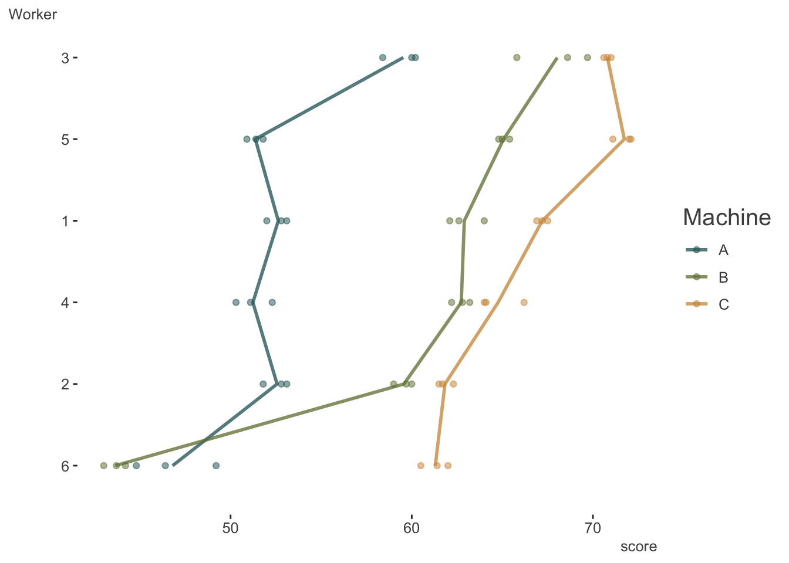

> NB: This post was revisited when updating the website early 2025, and some changes were required. Attempts to keep things consistent were made, but if you feel you’ve found an issue, please post it at [GitHub](http://github.com/m-clark/m-clark.github.io/issues).

Prerequisites: familiarity with [mixed models](https://m-clark.github.io/mixed-models-with-R/)

## Introduction

It’s often the case where, for mixed models, we want to look at random ‘slopes’ as well as random intercepts, such that coefficients for the fixed effects are expected to vary by group. This is very common in longitudinal settings, were we want to examine an overall trend, but allow the trend to vary by individual.

In such settings, when time is numeric, things are straightforward. The variance components are decomposed into parts for the intercept, the coefficient for the time indicator, and the residual variance (for linear mixed models). But what happens if we have only three time points? Does it make sense to treat it as numeric and hope for the best?

This came up in consulting because someone had a similar issue, and tried to keep the format for random slopes while treating the time indicator as categorical. This led to convergence issues, so we thought about what models might be possible. This post explores that scenario.

Packages used:

``` r
library(tidyverse)
library(lme4)
library(mixedup)  # http://m-clark.github.io/mixedup
```

## Machines

### The Data

Let’s start with a very simple data set from the nlme package, which comes with the standard R installation. The reason I chose this is because [Doug Bates has a good treatment on this topic](http://pages.stat.wisc.edu/~bates/UseR2008/WorkshopD.pdf) using that example (starting at slide 85), which I just extend a bit.

Here is the data description from the help file.

> Data on an experiment to compare three brands of machines used in an industrial process are presented in Milliken and Johnson (p. 285, 1992). Six workers were chosen randomly among the employees of a factory to operate each machine three times. The response is an overall productivity score taking into account the number and quality of components produced.

So for each worker and each machine, we’ll have three scores. Let’s look.

``` r
machines = nlme::Machines

# for some reason worker is an ordered factor.
machines = machines %>% 
  mutate(Worker = factor(Worker, levels = 1:6, ordered = FALSE))
```

|     | Worker | Machine | score |
|:----|:-------|:--------|------:|
| 1   | 1      | A       |  52.0 |
| 2   | 1      | A       |  52.8 |
| 3   | 1      | A       |  53.1 |
| 19  | 1      | B       |  62.1 |
| 20  | 1      | B       |  62.6 |
| 21  | 1      | B       |  64.0 |

This duplicates the plot in Bates’ notes and visually describes the entire data set. There likely is variability due to both workers and machines.



### Random Effects Models

The random effects of potential interest are for worker and machine, so how do we specify this? Let’s try a standard approach. The following is the type of model tried by our client.

``` r
model_m_slope = lmer(score ~ Machine + (1 + Machine | Worker), machines)
```

This was exactly the same issue our client had- problematic convergence. This could be more of an issue with lme4, and we could certainly explore tweaks to make the problem go away (or use a different package like glmmTMB), but let’s go ahead and keep it.

``` r
summarize_model(model_m_slope, ci = FALSE, cor_re = TRUE)
```


    Variance Components:

        Group    Effect Variance   SD Var_prop
       Worker Intercept    16.64 4.08     0.25
       Worker  MachineB    34.55 5.88     0.53
       Worker  MachineC    13.62 3.69     0.21
     Residual        NA     0.92 0.96     0.01


    Fixed Effects:

          Term Value   SE     t P_value Lower_2.5 Upper_97.5
     Intercept 52.36 1.68 31.15    0.00     49.06      55.65
      MachineB  7.97 2.42  3.29    0.00      3.22      12.71
      MachineC 13.92 1.54  9.04    0.00     10.90      16.94

We get the variance components we expect, i.e. the variance attributable to the intercept (i.e. Machine A), as well as for the slopes for the difference in machine B vs. A, and C vs. A. We also see the correlations among the random effects. It’s this part that Bates acknowledges is hard to estimate, and incurs estimating potentially notably more parameters than typical random effects models. We have different options that will be available to us though, so let’s try some.

Let’s start with the simplest, most plausible models. The first would be to have at least a worker effect. The next baseline model could be if we only had a machine by worker effect, i.e. a separate effect of each machine for each worker, essentially treating the interaction term as the sole clustering unit.

``` r
model_base_w  = lmer(score ~ Machine + (1 | Worker), machines)
model_base_wm = lmer(score ~ Machine + (1 | Worker:Machine), machines)
```

Examining the random effects makes clear the difference between the two models. For our first baseline model, we only have 6 effects, one for each worker. For the second we have an effect of each machine for each worker.

``` r
extract_random_effects(model_base_w)  # only 6 effects
extract_random_effects(model_base_wm) # 6 workers by 3 machines = 18 effects
```

| group_var | effect    | group |  value |    se | lower_2.5 | upper_97.5 |
|:----------|:----------|:------|-------:|------:|----------:|-----------:|
| Worker    | Intercept | 1     |  1.210 | 1.032 |    -0.813 |      3.234 |
| Worker    | Intercept | 2     | -1.594 | 1.032 |    -3.618 |      0.429 |
| Worker    | Intercept | 3     |  6.212 | 1.032 |     4.188 |      8.235 |
| Worker    | Intercept | 4     | -0.069 | 1.032 |    -2.093 |      1.954 |
| Worker    | Intercept | 5     |  2.949 | 1.032 |     0.925 |      4.972 |
| Worker    | Intercept | 6     | -8.707 | 1.032 |   -10.731 |     -6.684 |

| group_var      | effect    | group |   value |    se | lower_2.5 | upper_97.5 |
|:---------------|:----------|:------|--------:|------:|----------:|-----------:|
| Worker:Machine | Intercept | 1:A   |   0.275 | 0.553 |    -0.808 |      1.359 |
| Worker:Machine | Intercept | 1:B   |   2.556 | 0.553 |     1.473 |      3.640 |
| Worker:Machine | Intercept | 1:C   |   0.920 | 0.553 |    -0.164 |      2.004 |
| Worker:Machine | Intercept | 2:A   |   0.209 | 0.553 |    -0.874 |      1.293 |
| Worker:Machine | Intercept | 2:B   |  -0.749 | 0.553 |    -1.833 |      0.334 |
| Worker:Machine | Intercept | 2:C   |  -4.402 | 0.553 |    -5.486 |     -3.318 |
| Worker:Machine | Intercept | 3:A   |   7.118 | 0.553 |     6.035 |      8.202 |
| Worker:Machine | Intercept | 3:B   |   7.647 | 0.553 |     6.563 |      8.731 |
| Worker:Machine | Intercept | 3:C   |   4.490 | 0.553 |     3.407 |      5.574 |
| Worker:Machine | Intercept | 4:A   |  -1.113 | 0.553 |    -2.196 |     -0.029 |
| Worker:Machine | Intercept | 4:B   |   2.391 | 0.553 |     1.307 |      3.475 |
| Worker:Machine | Intercept | 4:C   |  -1.493 | 0.553 |    -2.577 |     -0.409 |
| Worker:Machine | Intercept | 5:A   |  -0.981 | 0.553 |    -2.064 |      0.103 |
| Worker:Machine | Intercept | 5:B   |   4.705 | 0.553 |     3.621 |      5.789 |
| Worker:Machine | Intercept | 5:C   |   5.416 | 0.553 |     4.332 |      6.499 |
| Worker:Machine | Intercept | 6:A   |  -5.509 | 0.553 |    -6.593 |     -4.426 |
| Worker:Machine | Intercept | 6:B   | -16.550 | 0.553 |   -17.634 |    -15.467 |
| Worker:Machine | Intercept | 6:C   |  -4.931 | 0.553 |    -6.014 |     -3.847 |

As a next step, we’ll essentially combine our two baseline models.

``` r
model_w_wm = lmer(score ~ Machine + (1 | Worker) + (1 | Worker:Machine), machines)
```

Now we have 6 worker effects plus 18 machine within worker effects[^1].

``` r
extract_random_effects(model_w_wm)
```

| group_var      | effect    | group |  value |    se | lower_2.5 | upper_97.5 |
|:---------------|:----------|:------|-------:|------:|----------:|-----------:|
| Worker:Machine | Intercept | 1:A   | -0.750 | 2.015 |    -4.699 |      3.198 |
| Worker:Machine | Intercept | 1:B   |  1.500 | 2.015 |    -2.449 |      5.449 |
| Worker:Machine | Intercept | 1:C   | -0.114 | 2.015 |    -4.063 |      3.834 |
| Worker:Machine | Intercept | 2:A   |  1.553 | 2.015 |    -2.396 |      5.501 |
| Worker:Machine | Intercept | 2:B   |  0.607 | 2.015 |    -3.342 |      4.555 |
| Worker:Machine | Intercept | 2:C   | -2.997 | 2.015 |    -6.945 |      0.952 |
| Worker:Machine | Intercept | 3:A   |  1.778 | 2.015 |    -2.171 |      5.726 |
| Worker:Machine | Intercept | 3:B   |  2.299 | 2.015 |    -1.649 |      6.248 |
| Worker:Machine | Intercept | 3:C   | -0.815 | 2.015 |    -4.763 |      3.134 |
| Worker:Machine | Intercept | 4:A   | -1.039 | 2.015 |    -4.988 |      2.909 |
| Worker:Machine | Intercept | 4:B   |  2.417 | 2.015 |    -1.531 |      6.366 |
| Worker:Machine | Intercept | 4:C   | -1.414 | 2.015 |    -5.363 |      2.534 |
| Worker:Machine | Intercept | 5:A   | -3.457 | 2.015 |    -7.405 |      0.492 |
| Worker:Machine | Intercept | 5:B   |  2.152 | 2.015 |    -1.796 |      6.101 |
| Worker:Machine | Intercept | 5:C   |  2.853 | 2.015 |    -1.095 |      6.802 |
| Worker:Machine | Intercept | 6:A   |  1.916 | 2.015 |    -2.032 |      5.865 |
| Worker:Machine | Intercept | 6:B   | -8.976 | 2.015 |   -12.924 |     -5.027 |
| Worker:Machine | Intercept | 6:C   |  2.487 | 2.015 |    -1.462 |      6.435 |
| Worker         | Intercept | 1     |  1.045 | 1.981 |    -2.839 |      4.928 |
| Worker         | Intercept | 2     | -1.376 | 1.981 |    -5.259 |      2.507 |
| Worker         | Intercept | 3     |  5.361 | 1.981 |     1.478 |      9.244 |
| Worker         | Intercept | 4     | -0.060 | 1.981 |    -3.943 |      3.823 |
| Worker         | Intercept | 5     |  2.545 | 1.981 |    -1.339 |      6.428 |
| Worker         | Intercept | 6     | -7.514 | 1.981 |   -11.397 |     -3.631 |

If you look closely at these effects, and add them together, you will get a value similar to our second baseline model, which is probably not too surprising. For example in the above model `1:B + 1` = 1.5 `+` 1.045. Looking at the initial model, the estimated random effect for `1:B` was 2.556. Likewise if we look at the variance components, we can see that the sum of the non-residual effect variances for `model_w_wm` equals the variance of `model_base_wm` (36.8). So this latest model allows us to disentangle the worker and machine effects, where our baseline models did not.

Next we’ll do the ‘vector-valued’ model Bates describes. This removes the intercept portion of the formula in the original random slopes model, but is otherwise the same. We can look at the results here, but I will hold off description for comparing it to other models. Note that at least have no convergence problem.

``` r
model_m_vv = lmer(score ~ Machine + (0 + Machine | Worker), machines)

summarize_model(model_m_vv, ci = 0, cor_re = TRUE)
```


    Variance Components:

        Group   Effect Variance   SD Var_prop
       Worker MachineA    16.64 4.08     0.15
       Worker MachineB    74.39 8.63     0.67
       Worker MachineC    19.27 4.39     0.17
     Residual       NA     0.92 0.96     0.01


    Fixed Effects:

          Term Value   SE     t P_value Lower_2.5 Upper_97.5
     Intercept 52.36 1.68 31.15    0.00     49.06      55.65
      MachineB  7.97 2.42  3.29    0.00      3.22      12.71
      MachineC 13.92 1.54  9.04    0.00     10.90      16.94

### Summarize All the Models

Now let’s extract the fixed effect and variance component summaries for all the models.

``` r
model_list = mget(ls(pattern = 'model_'))

fe = map_df(model_list, extract_fixed_effects, .id = 'model')

vc = map_df(model_list, extract_vc, ci_level = 0, .id = 'model')
```

First, let’s look at the fixed effects. We see that there are no differences in the coefficients for the fixed effect of machine, which is our only covariate in the model. However, there are notable differences for the estimated standard errors. Practically we’d come to no differences in our conclusions, but the uncertainty associated with them would be different.

| model         | term      |  value |    se |      t | p_value | lower_2.5 | upper_97.5 |
|:--------------|:----------|-------:|------:|-------:|--------:|----------:|-----------:|
| model_base_w  | Intercept | 52.356 | 2.229 | 23.485 |   0.000 |    47.986 |     56.725 |
| model_base_w  | MachineB  |  7.967 | 1.054 |  7.559 |   0.000 |     5.901 |     10.032 |
| model_base_w  | MachineC  | 13.917 | 1.054 | 13.205 |   0.000 |    11.851 |     15.982 |
| model_base_wm | Intercept | 52.356 | 2.486 | 21.062 |   0.000 |    47.483 |     57.228 |
| model_base_wm | MachineB  |  7.967 | 3.515 |  2.266 |   0.023 |     1.076 |     14.857 |
| model_base_wm | MachineC  | 13.917 | 3.515 |  3.959 |   0.000 |     7.026 |     20.807 |
| model_m_slope | Intercept | 52.356 | 1.681 | 31.152 |   0.000 |    49.062 |     55.650 |
| model_m_slope | MachineB  |  7.967 | 2.421 |  3.291 |   0.001 |     3.221 |     12.712 |
| model_m_slope | MachineC  | 13.917 | 1.540 |  9.036 |   0.000 |    10.898 |     16.935 |
| model_m_vv    | Intercept | 52.356 | 1.681 | 31.151 |   0.000 |    49.061 |     55.650 |
| model_m_vv    | MachineB  |  7.967 | 2.421 |  3.291 |   0.001 |     3.222 |     12.712 |
| model_m_vv    | MachineC  | 13.917 | 1.540 |  9.036 |   0.000 |    10.898 |     16.935 |
| model_w_wm    | Intercept | 52.356 | 2.486 | 21.062 |   0.000 |    47.483 |     57.228 |
| model_w_wm    | MachineB  |  7.967 | 2.177 |  3.660 |   0.000 |     3.700 |     12.233 |
| model_w_wm    | MachineC  | 13.917 | 2.177 |  6.393 |   0.000 |     9.650 |     18.183 |

Here are the variance components, there are definitely some differences here, but, as we’ll see, maybe not as much as we suspect.

| model         | group          | effect    | variance |    sd | var_prop |
|:--------------|:---------------|:----------|---------:|------:|---------:|
| model_base_w  | Worker         | Intercept |   26.487 | 5.147 |    0.726 |
| model_base_w  | Residual       | NA        |    9.996 | 3.162 |    0.274 |
| model_base_wm | Worker:Machine | Intercept |   36.768 | 6.064 |    0.975 |
| model_base_wm | Residual       | NA        |    0.925 | 0.962 |    0.025 |
| model_m_slope | Worker         | Intercept |   16.639 | 4.079 |    0.253 |
| model_m_slope | Worker         | MachineB  |   34.554 | 5.878 |    0.526 |
| model_m_slope | Worker         | MachineC  |   13.617 | 3.690 |    0.207 |
| model_m_slope | Residual       | NA        |    0.925 | 0.962 |    0.014 |
| model_m_vv    | Worker         | MachineA  |   16.640 | 4.079 |    0.150 |
| model_m_vv    | Worker         | MachineB  |   74.395 | 8.625 |    0.669 |
| model_m_vv    | Worker         | MachineC  |   19.270 | 4.390 |    0.173 |
| model_m_vv    | Residual       | NA        |    0.925 | 0.962 |    0.008 |
| model_w_wm    | Worker:Machine | Intercept |   13.909 | 3.730 |    0.369 |
| model_w_wm    | Worker         | Intercept |   22.858 | 4.781 |    0.606 |
| model_w_wm    | Residual       | NA        |    0.925 | 0.962 |    0.025 |

We can see that the `base_wm` model has (non-residual) variance 36.768. This equals the total of the two (non-residual) variance components of the `w_wm` model 13.909 `+` 22.858, which again speaks to the latter model decomposing a machine effect into worker + machine effects. This value also equals the variance of the vector-valued model divided by the number of groups (16.64 + 74.395 + 19.27) `/` 3.

We can see that the estimated random effects from the vector-valued model (`m_vv`) are essentially the same as from the baseline, interaction-only model. However, the way it is estimated allows for incorporation of correlations among the machine random effects, so they are not identical (but pretty close).

``` r
extract_random_effects(model_m_vv)

extract_random_effects(model_base_wm) 
```

| group_var | effect   | group |   value |    se | lower_2.5 | upper_97.5 |
|:----------|:---------|:------|--------:|------:|----------:|-----------:|
| Worker    | MachineA | 1     |   0.312 | 0.541 |    -0.749 |      1.373 |
| Worker    | MachineB | 1     |   2.553 | 0.551 |     1.474 |      3.632 |
| Worker    | MachineC | 1     |   0.930 | 0.545 |    -0.137 |      1.998 |
| Worker    | MachineA | 2     |   0.184 | 0.541 |    -0.877 |      1.245 |
| Worker    | MachineB | 2     |  -0.803 | 0.551 |    -1.882 |      0.276 |
| Worker    | MachineC | 2     |  -4.282 | 0.545 |    -5.350 |     -3.215 |
| Worker    | MachineA | 3     |   6.969 | 0.541 |     5.908 |      8.030 |
| Worker    | MachineB | 3     |   7.779 | 0.551 |     6.700 |      8.858 |
| Worker    | MachineC | 3     |   4.474 | 0.545 |     3.406 |      5.541 |
| Worker    | MachineA | 4     |  -1.024 | 0.541 |    -2.085 |      0.037 |
| Worker    | MachineB | 4     |   2.328 | 0.551 |     1.249 |      3.407 |
| Worker    | MachineC | 4     |  -1.415 | 0.545 |    -2.482 |     -0.347 |
| Worker    | MachineA | 5     |  -0.850 | 0.541 |    -1.911 |      0.211 |
| Worker    | MachineB | 5     |   4.726 | 0.551 |     3.647 |      5.805 |
| Worker    | MachineC | 5     |   5.323 | 0.545 |     4.256 |      6.391 |
| Worker    | MachineA | 6     |  -5.592 | 0.541 |    -6.653 |     -4.531 |
| Worker    | MachineB | 6     | -16.584 | 0.551 |   -17.663 |    -15.505 |
| Worker    | MachineC | 6     |  -5.030 | 0.545 |    -6.098 |     -3.963 |

| group_var      | effect    | group |   value |    se | lower_2.5 | upper_97.5 |
|:---------------|:----------|:------|--------:|------:|----------:|-----------:|
| Worker:Machine | Intercept | 1:A   |   0.275 | 0.553 |    -0.808 |      1.359 |
| Worker:Machine | Intercept | 1:B   |   2.556 | 0.553 |     1.473 |      3.640 |
| Worker:Machine | Intercept | 1:C   |   0.920 | 0.553 |    -0.164 |      2.004 |
| Worker:Machine | Intercept | 2:A   |   0.209 | 0.553 |    -0.874 |      1.293 |
| Worker:Machine | Intercept | 2:B   |  -0.749 | 0.553 |    -1.833 |      0.334 |
| Worker:Machine | Intercept | 2:C   |  -4.402 | 0.553 |    -5.486 |     -3.318 |
| Worker:Machine | Intercept | 3:A   |   7.118 | 0.553 |     6.035 |      8.202 |
| Worker:Machine | Intercept | 3:B   |   7.647 | 0.553 |     6.563 |      8.731 |
| Worker:Machine | Intercept | 3:C   |   4.490 | 0.553 |     3.407 |      5.574 |
| Worker:Machine | Intercept | 4:A   |  -1.113 | 0.553 |    -2.196 |     -0.029 |
| Worker:Machine | Intercept | 4:B   |   2.391 | 0.553 |     1.307 |      3.475 |
| Worker:Machine | Intercept | 4:C   |  -1.493 | 0.553 |    -2.577 |     -0.409 |
| Worker:Machine | Intercept | 5:A   |  -0.981 | 0.553 |    -2.064 |      0.103 |
| Worker:Machine | Intercept | 5:B   |   4.705 | 0.553 |     3.621 |      5.789 |
| Worker:Machine | Intercept | 5:C   |   5.416 | 0.553 |     4.332 |      6.499 |
| Worker:Machine | Intercept | 6:A   |  -5.509 | 0.553 |    -6.593 |     -4.426 |
| Worker:Machine | Intercept | 6:B   | -16.550 | 0.553 |   -17.634 |    -15.467 |
| Worker:Machine | Intercept | 6:C   |  -4.931 | 0.553 |    -6.014 |     -3.847 |

Even the default way that the extracted random effects are structured implies this difference. In the vector-valued model we have a multivariate normal draw for 3 machines (i.e. 3 variances and 3 covariances) for each of six workers. In the baseline model, we do not estimate any covariances and assume equal variance to draw for 18 groups (1 variance).

``` r
ranef(model_m_vv)
```

    $Worker
        MachineA    MachineB   MachineC
    1  0.3119847   2.5532230  0.9303029
    2  0.1838934  -0.8033384 -4.2822788
    3  6.9692298   7.7793441  4.4735177
    4 -1.0238759   2.3284494 -1.4146165
    5 -0.8496428   4.7261139  5.3231867
    6 -5.5915891 -16.5837920 -5.0301120

    with conditional variances for "Worker" 

``` r
ranef(model_base_wm)
```

    $`Worker:Machine`
        (Intercept)
    1:A   0.2754686
    1:B   2.5563490
    1:C   0.9200653
    2:A   0.2093562
    2:B  -0.7492747
    2:C  -4.4019889
    3:A   7.1181097
    3:B   7.6470094
    3:C   4.4901388
    4:A  -1.1128933
    4:B   2.3910678
    4:C  -1.4930400
    5:A  -0.9806684
    5:B   4.7050044
    5:C   5.4157135
    6:A  -5.5093728
    6:B -16.5501559
    6:C  -4.9308887

    with conditional variances for "Worker:Machine" 

Now let’s compare the models directly via AIC. As we would expect if we dummy coded a predictor vs. running a model without the intercept (e.g. `lm(score ~ machine)`, vs. `lm(score ~ -1 + machine)`), the random slope model and vector-valued models are identical and produce the same AIC. Likewise the intercept variance of the former is equal to the first group variance of the vector-valued model.

| model_base_w | model_base_wm | model_m_slope | model_m_vv | model_w_wm |
|-------------:|--------------:|--------------:|-----------:|-----------:|
|      296.878 |       231.256 |       228.311 |    228.311 |    227.688 |

While such a model is doing better than either of our baseline models, it turns out that our other approach is slightly better, as the additional complexity of estimating the covariances and separate variances wasn’t really worth it.

At this point we’ve seen a couple of ways of doing a model in this situation. Some may be a little too simplistic for a given scenario, others may not capture the correlation structure the way we’d want. In any case, we have options to explore.

## Simulation

The following is a simplified approach to creating data in this scenario, and allows us to play around with the settings to see what happens.

### Data Creation

First we need some data. The following creates a group identifier similar to `Worker` in our previous example, a `cat_var` like our `Machine`, and other covariates just to make it interesting.

``` r
# for simplicity keeping to 3 cat levels
set.seed(1234)
ng = 5000     # n groups
cat_levs = 3  # n levels per group
reps = 4      # number of obs per level per cat

id = rep(1:ng, each = cat_levs * reps)           # id indicator (e.g. like Worker)
cat_var = rep(1:cat_levs, times = ng, e = reps)  # categorical variable (e.g. Machine)
x = rnorm(ng * cat_levs * reps)                  # continuous covariate
x_c = rep(rnorm(ng), e = cat_levs * reps)        # continuous cluster level covariate
```

So we have the basic data in place, now we need to create the random effects. There are several ways we could do this, including more efficient ones, but this approach focuses on a conceptual approach and on the model that got us here, i.e. something of the form `(1 + cat_var | group)`. In this case we assume this model is ‘correct’, so we’re going to create a multivariate normal draw of random effects for each level of the `cat_var`, which is only 3 levels. The correlations depicted are the estimates we expect from our model for the random effects[^2].

``` r
# as correlated  (1, .5, .5) var, (1, .25, .25) sd 
cov_mat = lazerhawk::create_corr(c(.1, .25, .25), diagonal = c(1, .5, .5))

cov2cor(cov_mat)  # these will be the estimated correlations for the random_slope model
```

              [,1]      [,2]      [,3]
    [1,] 1.0000000 0.1414214 0.3535534
    [2,] 0.1414214 1.0000000 0.5000000
    [3,] 0.3535534 0.5000000 1.0000000

Now we create the random effects by drawing an effect for each categorical level for each group.

``` r
# take a multivariate normal draw for each of the groups in `id`
re_id_cat_lev = mvtnorm::rmvnorm(ng, mean = rep(0, 3), sigma = cov_mat) %>% 
  data.frame()

head(re_id_cat_lev)
```

              X1          X2          X3
    1  0.5618465  0.62780841  1.15175459
    2  0.6588685  0.78045939  0.25942427
    3  0.2680315 -0.06403496  1.30173301
    4 -0.3711184  0.37579392 -0.03242486
    5 -1.1306064 -0.08450038 -0.38165685
    6 -0.7537223  0.65320469  0.33269260

Now that we have the random effects, we can create our target variable. We do this by adding our first effect to the intercept, and the others to their respective coefficients.

``` r
y = 
  # fixed effect = (2, .5, -.5)
  2  + .5*x - .5*x_c +   
  # random intercept
  rep(re_id_cat_lev[, 1], each = cat_levs * reps) +                           
  # .25 is the fixef for group 2 vs. 1
  (.25 + rep(re_id_cat_lev[, 2], each = cat_levs * reps)) * (cat_var == 2) +  
  # .40 is the fixef for group 3 vs. 1
  (.40 + rep(re_id_cat_lev[, 3], each = cat_levs * reps)) * (cat_var == 3) +  
  rnorm(ng * cat_levs * reps, sd = .5)
```

Now we create a data frame so we can see everything together.

``` r
df = tibble(
    id,
    cat_var,
    x,
    x_c,
    y,
    re_id = rep(re_id_cat_lev[, 1], each = cat_levs*reps),
    re_id_cat_lev2 = rep(re_id_cat_lev[, 2], each = cat_levs*reps),
    re_id_cat_lev3 = rep(re_id_cat_lev[, 3], each = cat_levs*reps)
  ) %>% 
  mutate(
    cat_var = factor(cat_var),
    cat_as_num = as.integer(cat_var),
    id = factor(id)
  )

df %>% print(n = 30)
```

    # A tibble: 60,000 × 9
       id    cat_var       x    x_c     y re_id re_id_cat_lev2 re_id_cat_lev3
       <fct> <fct>     <dbl>  <dbl> <dbl> <dbl>          <dbl>          <dbl>
     1 1     1       -1.21   -1.43  3.04  0.562         0.628           1.15 
     2 1     1        0.277  -1.43  3.35  0.562         0.628           1.15 
     3 1     1        1.08   -1.43  3.46  0.562         0.628           1.15 
     4 1     1       -2.35   -1.43  2.64  0.562         0.628           1.15 
     5 1     2        0.429  -1.43  4.59  0.562         0.628           1.15 
     6 1     2        0.506  -1.43  3.61  0.562         0.628           1.15 
     7 1     2       -0.575  -1.43  3.54  0.562         0.628           1.15 
     8 1     2       -0.547  -1.43  2.98  0.562         0.628           1.15 
     9 1     3       -0.564  -1.43  5.28  0.562         0.628           1.15 
    10 1     3       -0.890  -1.43  4.06  0.562         0.628           1.15 
    11 1     3       -0.477  -1.43  4.31  0.562         0.628           1.15 
    12 1     3       -0.998  -1.43  4.70  0.562         0.628           1.15 
    13 2     1       -0.776   0.126 2.25  0.659         0.780           0.259
    14 2     1        0.0645  0.126 2.48  0.659         0.780           0.259
    15 2     1        0.959   0.126 2.99  0.659         0.780           0.259
    16 2     1       -0.110   0.126 2.55  0.659         0.780           0.259
    17 2     2       -0.511   0.126 3.94  0.659         0.780           0.259
    18 2     2       -0.911   0.126 3.22  0.659         0.780           0.259
    19 2     2       -0.837   0.126 3.98  0.659         0.780           0.259
    20 2     2        2.42    0.126 4.59  0.659         0.780           0.259
    21 2     3        0.134   0.126 3.58  0.659         0.780           0.259
    22 2     3       -0.491   0.126 3.31  0.659         0.780           0.259
    23 2     3       -0.441   0.126 2.66  0.659         0.780           0.259
    24 2     3        0.460   0.126 3.42  0.659         0.780           0.259
    25 3     1       -0.694   0.437 0.985 0.268        -0.0640          1.30 
    26 3     1       -1.45    0.437 2.08  0.268        -0.0640          1.30 
    27 3     1        0.575   0.437 2.62  0.268        -0.0640          1.30 
    28 3     1       -1.02    0.437 1.24  0.268        -0.0640          1.30 
    29 3     2       -0.0151  0.437 2.24  0.268        -0.0640          1.30 
    30 3     2       -0.936   0.437 2.57  0.268        -0.0640          1.30 
    # ℹ 59,970 more rows
    # ℹ 1 more variable: cat_as_num <int>

### Run the Models & Summarize

With everything in place, let’s run four models similar to our previous models from the Machine example:

1.  The baseline model that does not distinguish the id from cat_var variance.
2.  The random slope approach (data generating model)
3.  The vector valued model (equivalent to \#2)
4.  The scalar model that does not estimate the random effect correlations

``` r
m_interaction_only = lmer(y ~ x + x_c + cat_var + (1 | id:cat_var), df)
m_random_slope = lmer(y ~ x + x_c + cat_var + (1 + cat_var | id), df)    
m_vector_valued = lmer(y ~ x + x_c + cat_var + (0 + cat_var | id), df)
m_separate_re = lmer(y ~ x + x_c + cat_var + (1 | id) + (1 | id:cat_var), df)
```

``` r
model_mixed = list(
  m_interaction_only = m_interaction_only,
  m_random_slope = m_random_slope,
  m_vector_valued = m_vector_valued,
  m_separate_re = m_separate_re
)

# model summaries if desired
# map(model_mixed, summarize_model, ci = 0, cor_re = TRUE)
fe = map_df(model_mixed, extract_fixed_effects, .id = 'model') 
vc = map_df(model_mixed, extract_vc, ci_level = 0, .id = 'model')
```

Looking at the fixed effects, we get what we should but, as before, we do see differences in the standard errors.

| model              | term      |  value |    se |       t | p_value | lower_2.5 | upper_97.5 |
|:-------------------|:----------|-------:|------:|--------:|--------:|----------:|-----------:|
| m_interaction_only | Intercept |  2.006 | 0.018 | 111.051 |       0 |     1.971 |      2.042 |
| m_interaction_only | x         |  0.497 | 0.002 | 212.962 |       0 |     0.492 |      0.501 |
| m_interaction_only | x_c       | -0.489 | 0.010 | -46.776 |       0 |    -0.509 |     -0.469 |
| m_interaction_only | cat_var2  |  0.256 | 0.026 |  10.026 |       0 |     0.206 |      0.306 |
| m_interaction_only | cat_var3  |  0.389 | 0.026 |  15.228 |       0 |     0.339 |      0.439 |
| m_random_slope     | Intercept |  2.006 | 0.015 | 136.943 |       0 |     1.977 |      2.035 |
| m_random_slope     | x         |  0.497 | 0.002 | 217.676 |       0 |     0.493 |      0.502 |
| m_random_slope     | x_c       | -0.495 | 0.014 | -34.636 |       0 |    -0.523 |     -0.467 |
| m_random_slope     | cat_var2  |  0.256 | 0.011 |  23.038 |       0 |     0.234 |      0.278 |
| m_random_slope     | cat_var3  |  0.389 | 0.011 |  34.969 |       0 |     0.367 |      0.411 |
| m_vector_valued    | Intercept |  2.006 | 0.015 | 136.940 |       0 |     1.977 |      2.035 |
| m_vector_valued    | x         |  0.497 | 0.002 | 217.677 |       0 |     0.493 |      0.502 |
| m_vector_valued    | x_c       | -0.495 | 0.014 | -34.635 |       0 |    -0.523 |     -0.467 |
| m_vector_valued    | cat_var2  |  0.256 | 0.011 |  23.038 |       0 |     0.234 |      0.278 |
| m_vector_valued    | cat_var3  |  0.389 | 0.011 |  34.971 |       0 |     0.367 |      0.411 |
| m_separate_re      | Intercept |  2.006 | 0.018 | 111.045 |       0 |     1.971 |      2.042 |
| m_separate_re      | x         |  0.497 | 0.002 | 216.586 |       0 |     0.493 |      0.502 |
| m_separate_re      | x_c       | -0.489 | 0.017 | -28.883 |       0 |    -0.522 |     -0.456 |
| m_separate_re      | cat_var2  |  0.256 | 0.011 |  23.077 |       0 |     0.234 |      0.278 |
| m_separate_re      | cat_var3  |  0.389 | 0.011 |  35.050 |       0 |     0.367 |      0.411 |

The variance components break down as before.

| model              | group      | effect    | variance |    sd | var_prop |
|:-------------------|:-----------|:----------|---------:|------:|---------:|
| m_interaction_only | id:cat_var | Intercept |    1.570 | 1.253 |    0.864 |
| m_interaction_only | Residual   | NA        |    0.247 | 0.497 |    0.136 |
| m_random_slope     | id         | Intercept |    1.011 | 1.006 |    0.450 |
| m_random_slope     | id         | cat_var2  |    0.494 | 0.703 |    0.220 |
| m_random_slope     | id         | cat_var3  |    0.495 | 0.704 |    0.220 |
| m_random_slope     | Residual   | NA        |    0.247 | 0.497 |    0.110 |
| m_vector_valued    | id         | cat_var1  |    1.011 | 1.006 |    0.204 |
| m_vector_valued    | id         | cat_var2  |    1.709 | 1.307 |    0.345 |
| m_vector_valued    | id         | cat_var3  |    1.990 | 1.411 |    0.401 |
| m_vector_valued    | Residual   | NA        |    0.247 | 0.497 |    0.050 |
| m_separate_re      | id:cat_var | Intercept |    0.246 | 0.496 |    0.135 |
| m_separate_re      | id         | Intercept |    1.324 | 1.151 |    0.728 |
| m_separate_re      | Residual   | NA        |    0.247 | 0.497 |    0.136 |

In this case, we know the model with correlated random effects is the more accurate model, and this is born out via AIC.

| m_interaction_only | m_random_slope | m_vector_valued | m_separate_re |
|-------------------:|---------------:|----------------:|--------------:|
|           135592.8 |       122051.9 |        122051.9 |      123745.2 |

### Change the model orientation

Now I will make the `vector_valued` model reduce to the `separate_re` model. First, we create a covariance matrix that has equal variances/covariances (i.e. compound symmetry), and for demonstration, we will apply the random effects a little differently. So, when we create the target variable, we make a slight alteration to apply it to the vector valued model instead.

``` r
set.seed(1234)

cov_mat = lazerhawk::create_corr(c(0.1, 0.1, 0.1), diagonal = c(.5, .5, .5))

cov2cor(cov_mat)  # these will now be the estimated correlations for the vector_valued model
```

         [,1] [,2] [,3]
    [1,]  1.0  0.2  0.2
    [2,]  0.2  1.0  0.2
    [3,]  0.2  0.2  1.0

``` r
re_id_cat_lev = mvtnorm::rmvnorm(ng, mean = rep(0, 3), sigma = cov_mat) %>% 
  data.frame()

y = 2  + .5*x - .5*x_c +   # fixed effect = (2, .5, -.5)
  rep(re_id_cat_lev[, 1], each = cat_levs * reps) * (cat_var == 1) +     # added this
  rep(re_id_cat_lev[, 2], each = cat_levs * reps) * (cat_var == 2) +
  rep(re_id_cat_lev[, 3], each = cat_levs * reps) * (cat_var == 3) +
  .25 * (cat_var == 2) +  # .25 is the fixef for group 2 vs. 1
  .40 * (cat_var == 3) +  # .40 is the fixef for group 3 vs. 1
  rnorm(ng * cat_levs * reps, sd = .5)


df = tibble(
    id,
    cat_var  = factor(cat_var),
    x,
    x_c,
    y
  )
```

Rerun the models.

``` r
m_random_slope  = lmer(y ~ x + x_c + cat_var + (1 + cat_var | id), df)  # still problems!
m_vector_valued = lmer(y ~ x + x_c + cat_var + (0 + cat_var | id), df)   
m_separate_re   = lmer(y ~ x + x_c + cat_var + (1 | id) + (1 | id:cat_var), df)
```

Examine the variance components.

``` r
model_mixed = list(
  m_random_slope  = m_random_slope,
  m_vector_valued = m_vector_valued,
  m_separate_re   = m_separate_re
)

# model summaries if desired
# map(model_mixed, summarize_model, ci = 0, cor_re = TRUE)

# fixed effects if desired
# fe = map_df(model_mixed, extract_fixed_effects, .id = 'model')

vc = map_df(model_mixed, extract_vc, ci_level = 0, .id = 'model')
```

| model           | group      | effect    | variance |    sd | var_prop |
|:----------------|:-----------|:----------|---------:|------:|---------:|
| m_random_slope  | id         | Intercept |    0.491 | 0.700 |    0.213 |
| m_random_slope  | id         | cat_var2  |    0.786 | 0.886 |    0.341 |
| m_random_slope  | id         | cat_var3  |    0.778 | 0.882 |    0.337 |
| m_random_slope  | Residual   | NA        |    0.251 | 0.501 |    0.109 |
| m_vector_valued | id         | cat_var1  |    0.491 | 0.700 |    0.283 |
| m_vector_valued | id         | cat_var2  |    0.497 | 0.705 |    0.287 |
| m_vector_valued | id         | cat_var3  |    0.492 | 0.702 |    0.284 |
| m_vector_valued | Residual   | NA        |    0.251 | 0.501 |    0.145 |
| m_separate_re   | id:cat_var | Intercept |    0.395 | 0.628 |    0.530 |
| m_separate_re   | id         | Intercept |    0.099 | 0.314 |    0.133 |
| m_separate_re   | Residual   | NA        |    0.251 | 0.501 |    0.337 |

In this case, we know the true case regards zero correlations and equal variances, so estimating them is adding complexity we don’t need, thus our simpler model wins (-log likelihoods are essentially the same).

| parameter | m_random_slope | m_vector_valued | m_separate_re |
|:----------|---------------:|----------------:|--------------:|
| LL        |       -59818.9 |        -59818.9 |     -59819.72 |
| AIC       |       119661.8 |        119661.8 |     119655.45 |

## Summary

Here we’ve demonstrated a couple of different ways to specify a particular model with random slopes for a categorical covariate. Intuition may lead to a model that is not easy to estimate, often leading to convergence problems. Sometimes, this model may be overly complicated, and a simpler version will likely have less estimation difficulty. Try it out if you run into trouble!

## Footnotes

## Reuse

[CC BY-SA 4.0](https://creativecommons.org/licenses/by-sa/4.0/)

## Citation

BibTeX citation:

``` quarto-appendix-bibtex
@online{clark2020,
  author = {Clark, Michael and Clark, Michael},
  title = {Categorical {Effects} as {Random}},
  date = {2020-03-01},
  url = {https://m-clark.github.io/posts/2020-03-01-random-categorical/},
  langid = {en}
}
```

For attribution, please cite this work as:

Clark, Michael, and Michael Clark. 2020. “Categorical Effects as Random.” March 1. <https://m-clark.github.io/posts/2020-03-01-random-categorical/>.

[^1]: Though I use the word ‘within’, do not take it to mean we have nested data.

[^2]: I use a personal package to create the matrix where I can just specify the lower diagonal, as this comes up a lot for simulation. Feel free to just create the matrix directly given it’s just a 3x3.
