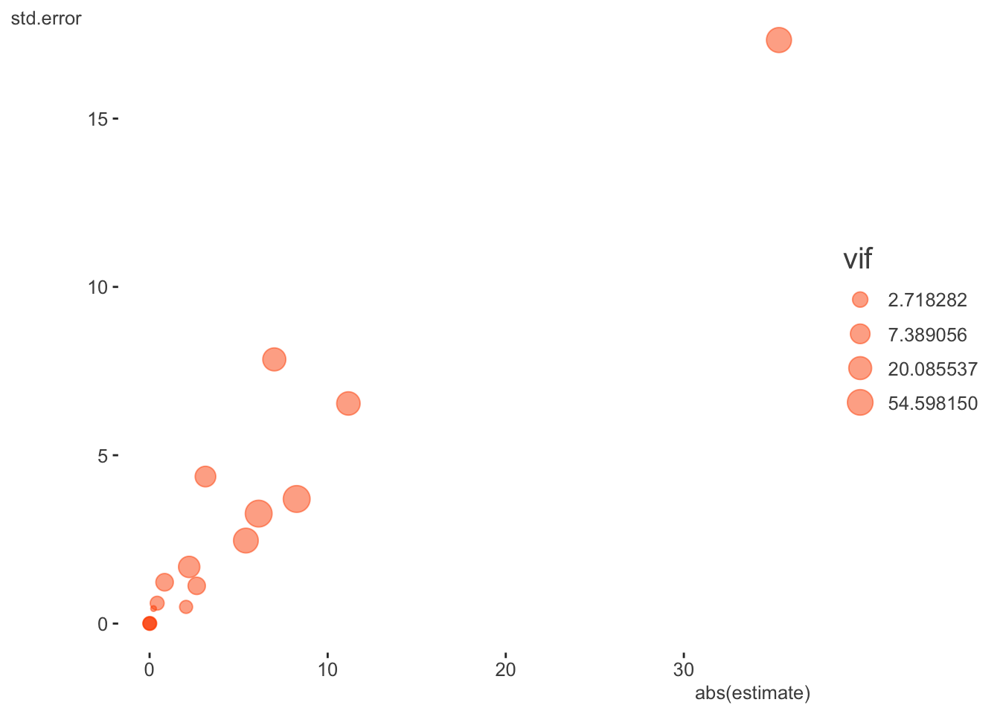

> NB: This post was revisited when updating the website early 2025, and some changes were required. Attempts to keep things consistent were made, but if you feel you’ve found an issue, please post it at [GitHub](http://github.com/m-clark/m-clark.github.io/issues).

Prerequisite: Knowledge of regression modeling. Helpful would be to know something about mixed models and optimization.

Primary packages used:

``` r
library(tidyverse)
library(tidyext)
library(broom)
library(kableExtra)
library(visibly)

library(lme4)
library(mixedup)  # http://m-clark.github.io/mixedup
```

## Intro

It is not uncommon that complex models lead to difficulties with convergence. Though the following example is a demo with the R package lme4, most of it would potentially apply to any complex modeling situation where convergence problems arise. The goal is provide some steps one can take to get their models back on track. The running example is taken from the data posted at this [stackoverflow question](https://stackoverflow.com/questions/23478792/warning-messages-when-trying-to-run-glmer-in-r). Ben Bolker’s[^1] response there can be seen as the basis for this post, along with some extensions, updates and other organization.

## Data Setup

You can download the data from [here](https://github.com/m-clark/m-clark.github.io/raw/master/data/convergence.RDS) (RDS file), or go to the [stackoverflow discussion](https://stackoverflow.com/questions/23478792/warning-messages-when-trying-to-run-glmer-in-r) and paste the code there. There isn’t any real explanation of the variables unfortunately, though you can get a sense of some of them (e.g. Day, replicate, temperature, etc.).

``` r
# df = readRDS(
#   gzcon(
#     url('https://github.com/m-clark/m-clark.github.io/raw/master/data/convergence.RDS')
#   )
# )

df = readRDS('data/convergence.RDS')

df = df %>% 
  mutate(
    SUR.ID = factor(SUR.ID),
    replicate = factor(replicate),
    Unit = factor(1:n())
  )
```

## Initial model

The following is the model that led to the stackoverflow post. It’s fairly complicated with multiple interactions and random effects, modeling the proportion of valid detections via a binomial model. The `Unit` effect is used to account for overdispersion, a common issue in count modeling.

``` r
model_mixed_0 = glmer(
  cbind(ValidDetections, FalseDetections) ~ 
    tm:Area + tm:c.distance + c.distance:Area + c.tm.depth:Area + 
    c.receiver.depth:Area + c.temp:Area + c.wind:Area + c.tm.depth + 
    c.receiver.depth + c.temp + c.wind + tm + c.distance + Area + replicate + 
    (1|SUR.ID) + (1|Day) + (1|Unit), 
  data = df, 
  family = binomial()
)
```

    Warning in checkConv(attr(opt, "derivs"), opt$par, ctrl = control$checkConv, :
    Model failed to converge with max|grad| = 0.0991801 (tol = 0.002, component 1)

    Warning in checkConv(attr(opt, "derivs"), opt$par, ctrl = control$checkConv, : Model is nearly unidentifiable: very large eigenvalue
     - Rescale variables?;Model is nearly unidentifiable: large eigenvalue ratio
     - Rescale variables?

This gives several warnings, the more egregious of which is that the model has not converged, meaning the estimates may not be trustworthy. So what do we do?

## Step back

The first step is to step back and look at the data. Are there issues that can be spotted? Are some essentially collinear with others? In the following, we can see that some variables are only a few levels, and some, like `Day`, `c.tm.depth` and `c.receiver.depth`, are both notably correlated with each other and with other predictor variables.

    $`Numeric Variables`
    # A tibble: 9 × 10
      Variable        N  Mean     SD     Min      Q1 Median    Q3    Max `% Missing`
      <chr>       <dbl> <dbl>  <dbl>   <dbl>   <dbl>  <dbl> <dbl>  <dbl>       <dbl>
    1 ValidDetec…   220  6.49  10.1     0       0      1     7     45              0
    2 CountDetec…   220  6.85  10.1     0       0      2     7     45              0
    3 FalseDetec…   220  0.36   0.73    0       0      0     0      4              0
    4 R.det         220  0.52   0.47    0       0      0.68  1      1              0
    5 c.receiver…   220 -0.06   0.31   -0.4    -0.34  -0.18  0.21   0.54           0
    6 c.tm.depth    220 -0.01   0.48   -0.62   -0.55   0.03  0.4    0.78           0
    7 c.temp        220 -0.46   2.38   -4.22   -3.62   0.54  1.55   2.84           0
    8 c.wind        220 -0.26   3.29   -2.97   -2.97  -2.94  1.28   5.88           0
    9 c.distance    220 -6.36 129.   -160    -110    -10    90    190              0

    $`Categorical Variables`
    # A tibble: 14 × 4
       Variable  Group        Frequency   `%`
       <chr>     <fct>            <int> <dbl>
     1 SUR.ID    10185               74    34
     2 SUR.ID    10186               74    34
     3 SUR.ID    10250               72    33
     4 tm        CT                 110    50
     5 tm        PT-04              110    50
     6 replicate 1                  120    55
     7 replicate 2                  100    45
     8 Area      Drug Channel       120    55
     9 Area      Finger             100    45
    10 Day       03/06/13            60    27
    11 Day       2/22/13             60    27
    12 Day       2/27/13             60    27
    13 Day       3/14/13             28    13
    14 Day       2/26/13             12     5

We can obtain a rough metric of total correlation of a variable with the others by looking at the [variance inflation factor](https://en.wikipedia.org/wiki/Variance_inflation_factor) (VIF)[^2]. For this, we’ll treat any binary or ordered data as numeric, and we can use the car package to get the VIF. This requires running an arbitrary regression model that includes the covariates of interest, but the value is derived only from the predictor variables. If we just try it with a dummy model, we get an error, since the linear model has perfect collinearity. We find out that `Day` is probably causing issues, and we’ll see why later.

``` r
# the model used to acquire the vif doesn't matter- anything could be used for
# the target variable

# this produces errors about aliased coefficients
# car::vif(lm(CountDetections ~ . - Unit - FalseDetections - ValidDetections, dat = df))

attributes(alias(
  lm(
    CountDetections ~ . - Unit - FalseDetections - ValidDetections,
    dat = df
  )
)$Complete)$dimnames[[1]]
```

    [1] "Day3/14/13" "c.wind"    

``` r
car::vif(lm(CountDetections ~ . -Unit -Day -FalseDetections, dat = df))
```

                          GVIF Df GVIF^(1/(2*Df))
    SUR.ID            1.200902  2        1.046832
    tm                1.066227  1        1.032583
    ValidDetections   2.708644  1        1.645796
    replicate         1.057540  1        1.028368
    Area              5.795510  1        2.407387
    R.det             2.393891  1        1.547220
    c.receiver.depth  8.674740  1        2.945291
    c.tm.depth       13.438407  1        3.665843
    c.temp            2.956315  1        1.719394
    c.wind            3.041363  1        1.743950
    c.distance        2.065335  1        1.437127

It looks like, along with `Day`, `tm.depth` is probably going to cause a problem, as more than 90% of its variance is accounted for by the other covariates. So at this point we can consider both it and `Day` as potential predictors to remove. Wind is less an issue once `Day` is removed.

An alternative approach I tried (not shown) was just running a PCA on the predictor variables. Only six components were needed to account for nearly almost 90% of the total variance, so I think it’s safe to say there is a notable amount of redundancy in this data.

One final note is that the target variable is a potential problem as well. More than half of the data is a 1.0 proportion of `Valid Detections`, and it also turns out this doesn’t appear to be proportional data per se, as sometimes both Valid and False Detections can be zero, meaning such observations don’t contribute meaningfully to the model. This isn’t necessarily a problem as these observations are basically dropped dropped from the model, and you will note in the GLM results that follow that the residual degrees of freedom will be notably lower than the total number of observations (220). This is due to the dropout of those observations, which is about 37% of the data. Even so, the lack of variability may be an underlying issue in general. Especially in the case of interactions, it is likely that some cells have no variability in the outcome.

## Start simply

So we know there are some data issues, so let’s start with a model that’s relatively simple but still plausible. If we just look at a GLM without any random effects, can we spot any issues?

``` r
model_glm_1 = glm(
  cbind(ValidDetections, FalseDetections) ~
    tm:Area + tm:c.distance + c.distance:Area + c.tm.depth:Area +
    c.receiver.depth:Area + c.temp:Area + c.wind:Area + c.tm.depth +
    c.receiver.depth + c.temp + c.wind + tm + c.distance + Area + replicate +
    SUR.ID + Day,
  data = df,
  family = binomial(link = 'logit')
)

summary(model_glm_1)
```


    Call:
    glm(formula = cbind(ValidDetections, FalseDetections) ~ tm:Area + 
        tm:c.distance + c.distance:Area + c.tm.depth:Area + c.receiver.depth:Area + 
        c.temp:Area + c.wind:Area + c.tm.depth + c.receiver.depth + 
        c.temp + c.wind + tm + c.distance + Area + replicate + SUR.ID + 
        Day, family = binomial(link = "logit"), data = df)

    Coefficients: (3 not defined because of singularities)
                                  Estimate Std. Error z value Pr(>|z|)    
    (Intercept)                 -1.125e+01  6.504e+00  -1.730  0.08372 .  
    c.tm.depth                  -8.406e-01  1.228e+00  -0.684  0.49376    
    c.receiver.depth             7.026e+00  7.852e+00   0.895  0.37095    
    c.temp                      -5.514e+00  2.538e+00  -2.172  0.02983 *  
    c.wind                      -6.256e+00  3.349e+00  -1.868  0.06179 .  
    tmPT-04                     -2.053e+00  4.961e-01  -4.139  3.5e-05 ***
    c.distance                  -3.685e-03  2.614e-03  -1.410  0.15864    
    AreaFinger                   5.901e+01  2.775e+01   2.127  0.03346 *  
    replicate2                   2.700e+00  1.161e+00   2.326  0.02000 *  
    SUR.ID10186                 -2.227e-01  4.456e-01  -0.500  0.61721    
    SUR.ID10250                 -2.995e-01  4.469e-01  -0.670  0.50281    
    Day2/22/13                  -7.114e+01  3.463e+01  -2.054  0.03996 *  
    Day2/26/13                   3.306e+00  1.134e+03   0.003  0.99767    
    Day2/27/13                          NA         NA      NA       NA    
    Day3/14/13                          NA         NA      NA       NA    
    tmPT-04:AreaFinger           4.308e-01  6.066e-01   0.710  0.47759    
    tmPT-04:c.distance          -5.332e-03  3.186e-03  -1.674  0.09419 .  
    AreaFinger:c.distance        1.192e-02  3.855e-03   3.091  0.00199 ** 
    AreaFinger:c.tm.depth       -2.815e+00  4.731e+00  -0.595  0.55189    
    AreaFinger:c.receiver.depth -3.211e+01  2.545e+01  -1.262  0.20708    
    AreaFinger:c.temp            2.377e+00  1.902e+00   1.250  0.21141    
    AreaFinger:c.wind                   NA         NA      NA       NA    
    ---
    Signif. codes:  0 '***' 0.001 '**' 0.01 '*' 0.05 '.' 0.1 ' ' 1

    (Dispersion parameter for binomial family taken to be 1)

        Null deviance: 334.57  on 137  degrees of freedom
    Residual deviance: 135.23  on 119  degrees of freedom
    AIC: 253.65

    Number of Fisher Scoring iterations: 17

Sure enough, there are problems. What’s going on with `Day` and `Area`? One issue is that `Area` only couples with certain days, so having one already tells you a lot about what the other could tell you.

``` r
with(df, table(Day, Area))
```

              Area
    Day        Drug Channel Finger
      03/06/13           60      0
      2/22/13             0     60
      2/26/13             0     12
      2/27/13            60      0
      3/14/13             0     28

You could potentially create a combined type of variable to deal with this for example, but otherwise the problem will persist with both in the model. There are likely remaining collinearities besides, but let’s take Day out for example.

``` r
model_glm_2 = update(model_glm_1, . ~ . -Day)

summary(model_glm_2)
```


    Call:
    glm(formula = cbind(ValidDetections, FalseDetections) ~ c.tm.depth + 
        c.receiver.depth + c.temp + c.wind + tm + c.distance + Area + 
        replicate + SUR.ID + tm:Area + tm:c.distance + Area:c.distance + 
        Area:c.tm.depth + Area:c.receiver.depth + Area:c.temp + Area:c.wind, 
        family = binomial(link = "logit"), data = df)

    Coefficients:
                                  Estimate Std. Error z value Pr(>|z|)    
    (Intercept)                 -10.980797   6.323591  -1.736  0.08248 .  
    c.tm.depth                   -0.842695   1.227579  -0.686  0.49242    
    c.receiver.depth              7.003401   7.846631   0.893  0.37211    
    c.temp                       -5.407822   2.465579  -2.193  0.02828 *  
    c.wind                       -6.125119   3.266203  -1.875  0.06075 .  
    tmPT-04                      -2.049088   0.495012  -4.139 3.48e-05 ***
    c.distance                   -0.003755   0.002586  -1.452  0.14644    
    AreaFinger                   11.163412   6.537806   1.708  0.08773 .  
    replicate2                    2.646675   1.120176   2.363  0.01814 *  
    SUR.ID10186                  -0.223527   0.445491  -0.502  0.61584    
    SUR.ID10250                  -0.300337   0.446936  -0.672  0.50159    
    tmPT-04:AreaFinger            0.425446   0.605567   0.703  0.48233    
    tmPT-04:c.distance           -0.005304   0.003175  -1.670  0.09483 .  
    c.distance:AreaFinger         0.011937   0.003849   3.101  0.00193 ** 
    c.tm.depth:AreaFinger        -3.137815   4.366782  -0.719  0.47241    
    c.receiver.depth:AreaFinger -35.342161  17.332674  -2.039  0.04145 *  
    c.temp:AreaFinger             2.222685   1.682491   1.321  0.18648    
    c.wind:AreaFinger             8.259864   3.700848   2.232  0.02562 *  
    ---
    Signif. codes:  0 '***' 0.001 '**' 0.01 '*' 0.05 '.' 0.1 ' ' 1

    (Dispersion parameter for binomial family taken to be 1)

        Null deviance: 334.57  on 137  degrees of freedom
    Residual deviance: 135.27  on 120  degrees of freedom
    AIC: 251.69

    Number of Fisher Scoring iterations: 10

Well, at least we got rid of the complete collinearity- no `NA` remains. However, those familiar with such models can still see that some of these coefficients and their associated standard errors are exceedingly large for this setting, so we shouldn’t really be surprised there would still be issues with the more complicated mixed models. With binary logistic models, large absolute coefficients and their standard errors are usually a sign of collinearity/separation, and we now know from our previous exploration that something similar is going on in this proportional binomial model. Here is a table of the more egregious offenders and a plot of all coefficients, their standard errors, and the VIF (size).

| term                        | estimate | std.error | statistic | p.value |    vif |
|:----------------------------|---------:|----------:|----------:|--------:|-------:|
| c.receiver.depth            |    7.003 |     7.847 |     0.893 |   0.372 | 21.202 |
| c.wind                      |   -6.125 |     3.266 |    -1.875 |   0.061 | 88.124 |
| AreaFinger                  |   11.163 |     6.538 |     1.708 |   0.088 | 24.372 |
| c.receiver.depth:AreaFinger |  -35.342 |    17.333 |    -2.039 |   0.041 | 43.537 |
| c.wind:AreaFinger           |    8.260 |     3.701 |     2.232 |   0.026 | 89.504 |



At this point I would not assume anything about the mixed model itself being a problem, and be leaning toward this being primarily a data issue. Or, at the very least, data issues will need to be sorted out. So let’s begin the restart of our mixed model effort by pulling out some of those variables we thought had some collinearity issues. You might have noticed from the GLM that `SUR.ID` was only 3 levels, so let’s move that to a fixed effect also. In keeping things simple, I’m not including any interactions.

``` r
model_mixed_1 = glmer(
  cbind(ValidDetections, FalseDetections) ~ 
    # tm:Area + tm:c.distance + c.distance:Area + #c.tm.depth:Area + 
    # c.receiver.depth:Area + c.temp:Area + c.wind:Area + #c.tm.depth + 
    c.receiver.depth + c.temp + c.wind + tm + c.distance + Area + replicate + 
    SUR.ID + 
    (1|Unit), #  + (1|Day)
  data = df,
  family = binomial(link = 'logit')
)
```

    Warning in checkConv(attr(opt, "derivs"), opt$par, ctrl = control$checkConv, :
    Model failed to converge with max|grad| = 0.117672 (tol = 0.002, component 1)

``` r
summarize_model(model_mixed_1, ci = FALSE)
```


    Variance Components:

     Group    Effect Variance   SD Var_prop
      Unit Intercept     0.90 0.95     1.00


    Fixed Effects:

                 Term Value   SE     Z P_value Lower_2.5 Upper_97.5
            Intercept  2.39 0.73  3.26    0.00      0.95       3.82
     c.receiver.depth -3.80 1.08 -3.53    0.00     -5.91      -1.69
               c.temp  0.25 0.19  1.28    0.20     -0.13       0.63
               c.wind  0.13 0.15  0.88    0.38     -0.16       0.43
              tmPT-04 -1.36 0.36 -3.77    0.00     -2.07      -0.65
           c.distance -0.01 0.00 -5.09    0.00     -0.01      -0.01
           AreaFinger  1.22 0.62  1.99    0.05      0.02       2.43
           replicate2 -0.39 0.37 -1.05    0.29     -1.11       0.33
          SUR.ID10186 -0.13 0.55 -0.23    0.82     -1.20       0.95
          SUR.ID10250 -0.20 0.54 -0.36    0.72     -1.26       0.87

Well, we still have issues, so what else can we try?

## Rescale variables

Let’s go ahead with the easy part and rescale our variables, which might as well be done with any model. I will standardize the numeric variables.

``` r
sc = function(x) scale(x)[, 1]

df = df %>% 
  mutate(
    c.receiver.depth_sc = sc(c.receiver.depth),
    c.tm.depth_sc = sc(c.tm.depth),
    c.temp_sc     = sc(c.temp),
    c.wind_sc     = sc(c.wind),
    c.distance_sc = sc(c.distance),
  )

model_mixed_2 = glmer(
  cbind(ValidDetections, FalseDetections) ~ 
    # tm:Area + tm:c.distance_sc + c.distance_sc:Area + 
    # c.receiver.depth_sc:Area + c.temp_sc:Area + c.wind_sc:Area +
    c.receiver.depth_sc + c.temp_sc + c.wind_sc + tm + c.distance_sc + Area + replicate + 
    SUR.ID +
    (1|Unit), 
  data = df,
  family = binomial(link = 'logit')
)
```

    Warning in checkConv(attr(opt, "derivs"), opt$par, ctrl = control$checkConv, :
    Model failed to converge with max|grad| = 0.13583 (tol = 0.002, component 1)

``` r
summarize_model(model_mixed_2, ci = FALSE)
```


    Variance Components:

     Group    Effect Variance   SD Var_prop
      Unit Intercept     0.87 0.93     1.00


    Fixed Effects:

                    Term Value   SE     Z P_value Lower_2.5 Upper_97.5
               Intercept  2.48 0.69  3.59    0.00      1.13       3.84
     c.receiver.depth_sc -1.18 0.33 -3.56    0.00     -1.83      -0.53
               c.temp_sc  0.58 0.45  1.27    0.20     -0.31       1.47
               c.wind_sc  0.42 0.49  0.86    0.39     -0.54       1.38
                 tmPT-04 -1.36 0.36 -3.78    0.00     -2.07      -0.66
           c.distance_sc -1.19 0.23 -5.15    0.00     -1.64      -0.73
              AreaFinger  1.23 0.61  2.01    0.04      0.03       2.43
              replicate2 -0.39 0.37 -1.07    0.28     -1.11       0.33
             SUR.ID10186 -0.11 0.54 -0.20    0.84     -1.17       0.95
             SUR.ID10250 -0.19 0.54 -0.35    0.73     -1.25       0.87

So at least we have the rescaling taken care of, and while that got rid of one warning, we still have the convergence problem. What can we check for next? I looked to see if there was any further imbalance of categorical variables, didn’t spot much issue, but then discovered something else. A couple covariates - `c.wind` and `c.distance` - have only five unique values, and for the former, some of those values only occur a few times. In addition, `c.wind` was unique per day, so was essentially confounded with it. So we can feel fine with having previously removed Day.

``` r
df %>% 
  select(-ends_with('sc')) %>% 
  map_int(n_distinct)
```

              SUR.ID               tm  ValidDetections  CountDetections 
                   3                2               35               35 
     FalseDetections        replicate             Area              Day 
                   5                2                2                5 
               R.det c.receiver.depth       c.tm.depth           c.temp 
                  21               30               31               37 
              c.wind       c.distance             Unit 
                   5                5              220 

``` r
table(df$c.wind, df$Day)
```

                  
                   03/06/13 2/22/13 2/26/13 2/27/13 3/14/13
      -2.96855001         0      60       0       0       0
      -2.939182972        0       0       0      60       0
      1.27535159         60       0       0       0       0
      4.71144999          0       0      12       0       0
      5.88092439          0       0       0       0      28

  

If we treat these as categorical what happens? I’ll do it just for the GLM again.

``` r
model_glm_3 = glm(
  cbind(ValidDetections, FalseDetections) ~
    # tm:Area + tm:c.distance_sc + c.distance_sc:Area +
    # c.receiver.depth_sc:Area + c.temp_sc:Area + c.wind_sc:Area +
    c.receiver.depth_sc + c.temp_sc + factor(c.wind) + tm + factor(c.distance) + Area + replicate +
    SUR.ID ,
  data = df,
  family = binomial(link = 'logit')
)

summary(model_glm_3)
```


    Call:
    glm(formula = cbind(ValidDetections, FalseDetections) ~ c.receiver.depth_sc + 
        c.temp_sc + factor(c.wind) + tm + factor(c.distance) + Area + 
        replicate + SUR.ID, family = binomial(link = "logit"), data = df)

    Coefficients: (1 not defined because of singularities)
                                Estimate Std. Error z value Pr(>|z|)    
    (Intercept)                   7.8190     2.2057   3.545 0.000393 ***
    c.receiver.depth_sc           1.3883     2.1912   0.634 0.526349    
    c.temp_sc                    -2.3820     1.4315  -1.664 0.096116 .  
    factor(c.wind)-2.939182972   -5.0028     4.0691  -1.229 0.218901    
    factor(c.wind)1.27535159     -7.8429     2.9788  -2.633 0.008466 ** 
    factor(c.wind)4.71144999     17.9094  1180.6959   0.015 0.987898    
    factor(c.wind)5.88092439     -9.1668     6.3781  -1.437 0.150654    
    tmPT-04                      -1.2459     0.2823  -4.413 1.02e-05 ***
    factor(c.distance)-110       -0.3953     0.3908  -1.011 0.311786    
    factor(c.distance)-10        -0.9887     0.4110  -2.405 0.016162 *  
    factor(c.distance)90         -0.8547     0.5253  -1.627 0.103694    
    factor(c.distance)190        -3.2681     0.7664  -4.264 2.01e-05 ***
    AreaFinger                        NA         NA      NA       NA    
    replicate2                    0.7647     0.5249   1.457 0.145120    
    SUR.ID10186                  -0.1224     0.4384  -0.279 0.780057    
    SUR.ID10250                  -0.2700     0.4363  -0.619 0.536010    
    ---
    Signif. codes:  0 '***' 0.001 '**' 0.01 '*' 0.05 '.' 0.1 ' ' 1

    (Dispersion parameter for binomial family taken to be 1)

        Null deviance: 334.57  on 137  degrees of freedom
    Residual deviance: 146.17  on 123  degrees of freedom
    AIC: 256.59

    Number of Fisher Scoring iterations: 17

Ah! So now we see that `Area` is also accounted for by other factors. In addition, wind is still problematic. Let’s take out `Area`, while still treating wind and distance as categorical for our diagnostic adventure.

``` r
model_glm_4 =  update(model_glm_3, . ~ . - Area)

summary(model_glm_4)
```


    Call:
    glm(formula = cbind(ValidDetections, FalseDetections) ~ c.receiver.depth_sc + 
        c.temp_sc + factor(c.wind) + tm + factor(c.distance) + replicate + 
        SUR.ID, family = binomial(link = "logit"), data = df)

    Coefficients:
                                Estimate Std. Error z value Pr(>|z|)    
    (Intercept)                   7.8190     2.2057   3.545 0.000393 ***
    c.receiver.depth_sc           1.3883     2.1912   0.634 0.526349    
    c.temp_sc                    -2.3820     1.4315  -1.664 0.096116 .  
    factor(c.wind)-2.939182972   -5.0028     4.0691  -1.229 0.218901    
    factor(c.wind)1.27535159     -7.8429     2.9788  -2.633 0.008466 ** 
    factor(c.wind)4.71144999     17.9094  1180.6959   0.015 0.987898    
    factor(c.wind)5.88092439     -9.1668     6.3781  -1.437 0.150654    
    tmPT-04                      -1.2459     0.2823  -4.413 1.02e-05 ***
    factor(c.distance)-110       -0.3953     0.3908  -1.011 0.311786    
    factor(c.distance)-10        -0.9887     0.4110  -2.405 0.016162 *  
    factor(c.distance)90         -0.8547     0.5253  -1.627 0.103694    
    factor(c.distance)190        -3.2681     0.7664  -4.264 2.01e-05 ***
    replicate2                    0.7647     0.5249   1.457 0.145120    
    SUR.ID10186                  -0.1224     0.4384  -0.279 0.780057    
    SUR.ID10250                  -0.2700     0.4363  -0.619 0.536010    
    ---
    Signif. codes:  0 '***' 0.001 '**' 0.01 '*' 0.05 '.' 0.1 ' ' 1

    (Dispersion parameter for binomial family taken to be 1)

        Null deviance: 334.57  on 137  degrees of freedom
    Residual deviance: 146.17  on 123  degrees of freedom
    AIC: 256.59

    Number of Fisher Scoring iterations: 17

The remaining collinearity is due to the relatively few observations for that value of wind, but at least most of the other covariates effects have settled down. Let’s try collapsing wind values and officially making it categorical.

``` r
df = df %>% 
  mutate(wind = fct_lump(factor(c.wind), 3, other_level = 'Higher'))

table(df$wind)
```


     -2.96855001 -2.939182972   1.27535159       Higher 
              60           60           60           40 

``` r
model_mixed_3 = glmer(
  cbind(ValidDetections, FalseDetections) ~ 
    # tm:Area + tm:c.distance_sc + c.distance_sc:Area + 
    # c.receiver.depth_sc:Area + c.temp_sc:Area + c.wind_sc:Area +
    c.receiver.depth_sc + c.temp_sc + wind + tm + factor(c.distance) + #Area + 
    replicate + SUR.ID +
    (1|Unit), 
  data = df, 
  family = binomial(link = 'logit')
)

summarize_model(model_mixed_3, ci = FALSE)
```

     Group    Effect Variance   SD Var_prop
      Unit Intercept     0.78 0.88     1.00
                     Term Value   SE     Z P_value Lower_2.5 Upper_97.5
                Intercept  3.67 1.16  3.16    0.00      1.40       5.94
      c.receiver.depth_sc -3.02 1.40 -2.16    0.03     -5.76      -0.28
                c.temp_sc -1.72 1.70 -1.02    0.31     -5.05       1.60
         wind-2.939182972  2.73 2.87  0.95    0.34     -2.89       8.35
           wind1.27535159 -4.20 2.88 -1.46    0.14     -9.85       1.44
               windHigher  4.41 2.81  1.57    0.12     -1.11       9.92
                  tmPT-04 -1.31 0.36 -3.65    0.00     -2.01      -0.60
     factorc.distance-110 -0.62 0.48 -1.31    0.19     -1.56       0.31
      factorc.distance-10 -1.44 0.50 -2.87    0.00     -2.42      -0.45
       factorc.distance90 -1.23 0.62 -1.97    0.05     -2.44      -0.01
      factorc.distance190 -4.21 0.96 -4.39    0.00     -6.09      -2.33
               replicate2  0.20 0.58  0.34    0.73     -0.93       1.33
              SUR.ID10186 -0.06 0.54 -0.12    0.90     -1.12       0.99
              SUR.ID10250 -0.16 0.54 -0.30    0.76     -1.21       0.89

Checking VIF adjusted for the degrees of freedom associated with the covariate (which is greater for categorical variables), we still have some issues. Below I show VIF both with and without wind as an example.

| covariate           | VIF_adj_orig | VIF_adj |
|:--------------------|-------------:|--------:|
| c.receiver.depth_sc |       10.017 |   1.277 |
| c.temp_sc           |        9.437 |   1.065 |
| wind                |        3.914 |      NA |
| tm                  |        1.059 |   1.047 |
| factor(c.distance)  |        1.080 |   1.062 |
| replicate           |        1.769 |   1.101 |
| SUR.ID              |        1.075 |   1.029 |

Let’s see what happens if we remove wind from the model.

``` r
model_mixed_4 = glmer(
  cbind(ValidDetections, FalseDetections) ~ 
    # tm:Area + tm:c.distance_sc + c.distance_sc:Area + 
    # c.receiver.depth_sc:Area + c.temp_sc:Area + c.wind_sc:Area +
    c.receiver.depth_sc +  c.temp_sc  + tm + factor(c.distance) + #Area + 
    replicate + SUR.ID +
    (1|Unit), 
  data = df,
  family = binomial(link = 'logit')
)
```

    Warning in checkConv(attr(opt, "derivs"), opt$par, ctrl = control$checkConv, :
    Model failed to converge with max|grad| = 0.0547352 (tol = 0.002, component 1)

``` r
summarize_model(model_mixed_4, ci = FALSE)
```

     Group    Effect Variance   SD Var_prop
      Unit Intercept     1.45 1.20     1.00
                     Term Value   SE     Z P_value Lower_2.5 Upper_97.5
                Intercept  5.62 0.74  7.63    0.00      4.18       7.06
      c.receiver.depth_sc -1.08 0.19 -5.57    0.00     -1.46      -0.70
                c.temp_sc  0.50 0.21  2.34    0.02      0.08       0.92
                  tmPT-04 -1.28 0.40 -3.19    0.00     -2.08      -0.49
     factorc.distance-110 -0.99 0.53 -1.86    0.06     -2.04       0.05
      factorc.distance-10 -1.87 0.55 -3.41    0.00     -2.95      -0.80
       factorc.distance90 -1.87 0.66 -2.83    0.00     -3.17      -0.58
      factorc.distance190 -5.60 1.04 -5.38    0.00     -7.65      -3.56
               replicate2 -0.37 0.40 -0.94    0.35     -1.15       0.40
              SUR.ID10186 -0.90 0.56 -1.60    0.11     -1.99       0.20
              SUR.ID10250 -0.98 0.56 -1.74    0.08     -2.07       0.12

We’re doing better, as our `max|grad|` value is closer to the tolerance value, but we’re still not where we want to be. What else can we do?

## Remove zero random effects

If any variance components estimates are zero we could remove them. However, at this point we already have. `Day` was zero because it was already accounted for by other covariates. `SUR.ID` moved to a fixed effect, where it still appears to be a small effect, but at least won’t cause computational problems. The remaining `Unit` effect does appear to capture some overdispersion, so we can leave it for now.

## Technical options

At this point, we have explored some of the more problematic aspects of the data. Some might feel that they are missing out on some of their theoretical priorities by removing some covariates, but if they are confounded with other covariates, their story can’t be easily disentangled anyway. As noted, we could still play around with creation of different categorical effects through further collapsing or combining, but a lot of that would be arbitrary, so must be done with caution.

In general, the problems with the model appear to actually be entirely with the data, but we can move on for demonstration. At some point in your own modeling adventure, you may exhaust what you can do data-wise, and still have convergence issues. This leaves exploration of the more technical side of things to see what tweaks can be made to help further. In order to best check these more technical aspects, it helps to know something about the underlying optimization algorithms, or at least optimization in general. And in general, I suggest refraining from this unless the previous steps have failed. It is very common that once the data has been sorted, convergence gets solved as well, so the data must be ruled out. In any case, let’s see what else we can do!

### Check singularity

This is a mixed model-specific check[^3], and in general, checking singularity[^4] goes along with removing zero random effects. These days, you’ll usually get a singularity warning when it is likely the case. In the past, Bolker suggested checking this problem as follows, but for this example concluded the result wasn’t close enough to zero to be a real concern. The `theta` below are just our random effect standard deviations, and I would say that the ones besides `Unit` probably weren’t meaningfully different from zero.

``` r
thetas = getME(model_mixed_0, "theta")

thetas
```

      Unit.(Intercept)    Day.(Intercept) SUR.ID.(Intercept) 
           0.681180197        0.008987371        0.007219970 

``` r
ll = getME(model_mixed_0, "lower") # lower bounds on model parameters (random effects parameters only)

min(thetas[ll == 0])
```

    [1] 0.00721997

Nowadays lme4 provides the function isSingular which uses the steps above to check the minimum value against some specified tolerance.

``` r
isSingular(model_mixed_0, tol = 1e-5)
```

    [1] FALSE

``` r
# rePCA(model_mixed_0)  # via PCA of the random-effects variance-covariance estimates
```

### Double-checking gradient calculations

For the mixed model setting, Bolker notes the following:

> One general problem is that large scaled gradients are often associated with small absolute gradients: we might decide that we’re more interested in testing the (parallel) minimum of these two quantities.

We can do this as follows for the initial mixed model.

``` r
derivs_init  = model_mixed_0@optinfo$derivs

sc_grad_init = with(derivs_init, solve(Hessian, gradient))

max(abs(sc_grad_init))
```

    [1] 1.526361

``` r
max(pmin(abs(sc_grad_init), abs(derivs_init$gradient)))
```

    [1] 0.09918011

We see that the unscaled gradient results in a lower maximum value, but is still large relative to the tolerance. That value is what is reported in the warning message.

``` r
model_mixed_0@optinfo$conv$lme4$messages[[1]]
```

    [1] "Model failed to converge with max|grad| = 0.0991801 (tol = 0.002, component 1)"

It may be instructive to compare the result to the model where we scaled the inputs. In this case the scaled gradient results in the lower max value.

``` r
derivs_model_mixed_2 = model_mixed_2@optinfo$derivs

sc_grad_model_mixed_2 = with(derivs_model_mixed_2, solve(Hessian, gradient))

max(abs(sc_grad_model_mixed_2))
```

    [1] 0.01645048

``` r
max(pmin(abs(sc_grad_model_mixed_2), abs(derivs_model_mixed_2$gradient)))
```

    [1] 0.01645048

Bolker also suggests checking if the result varies from using a different calculation, but it’s not clear what we’d do if this was the case. In any event, the results would be similar.

``` r
devfun_init  = update(model_mixed_0, devFunOnly = TRUE)
pars_init    = unlist(getME(model_mixed_0, c("theta", "fixef")))
grad_init    = numDeriv::grad(devfun_init, pars_init)
hess_init    = numDeriv::hessian(devfun_init, pars_init)
sc_grad_init = solve(hess_init, grad_init)

max(pmin(abs(sc_grad_init), abs(grad_init)))
```

    [1] 0.09917939

``` r
max(pmin(abs(sc_grad_init), abs(derivs_init$gradient)))
```

    [1] 0.09918011

### Restart the fit

As another step along our technical travails, we can just let the optimizer keep going until it does converge. Many R modeling packages allow for you to access the optimizer and change various settings. Most optimizers have a `maxit` type of argument to let you set the number of iterations, and we can use update to continue where we left off. Unfortunately there is no standard argument name for the total number of iterations, or even if you do happen to remember, guessing is required as to what we should set it at. So instead, we can just call update iteratively until there is no convergence warning. I check this by seeing if there is any output to `@optinfo$conv$lme4`, as it will only be there if it doesn’t converge[^5].

``` r
model_mixed_5 = model_mixed_4

while (length(model_mixed_5@optinfo$conv$lme4) > 0) {
  pars = getME(model_mixed_5,c("theta","fixef"))
  model_mixed_5 <-
    update(model_mixed_5,
           start = pars,
           control = glmerControl(optCtrl = list(maxfun = 2e5)))
}

max(
  abs(
    with(
      model_mixed_5@optinfo$derivs, solve(Hessian, gradient)
    )
  )
)  
```

    [1] 0.0001935103

``` r
# we win!
```

So at this point we have converged with no warnings. Hooray for us! However, the following shows us that we were pretty close anyway. The estimates from the last model with warnings and the converged model are nearly identical.

``` r
summarize_model(model_mixed_4, ci = 0)
```


    Variance Components:

     Group    Effect Variance   SD Var_prop
      Unit Intercept     1.45 1.20     1.00


    Fixed Effects:

                     Term Value   SE     Z P_value Lower_2.5 Upper_97.5
                Intercept  5.62 0.74  7.63    0.00      4.18       7.06
      c.receiver.depth_sc -1.08 0.19 -5.57    0.00     -1.46      -0.70
                c.temp_sc  0.50 0.21  2.34    0.02      0.08       0.92
                  tmPT-04 -1.28 0.40 -3.19    0.00     -2.08      -0.49
     factorc.distance-110 -0.99 0.53 -1.86    0.06     -2.04       0.05
      factorc.distance-10 -1.87 0.55 -3.41    0.00     -2.95      -0.80
       factorc.distance90 -1.87 0.66 -2.83    0.00     -3.17      -0.58
      factorc.distance190 -5.60 1.04 -5.38    0.00     -7.65      -3.56
               replicate2 -0.37 0.40 -0.94    0.35     -1.15       0.40
              SUR.ID10186 -0.90 0.56 -1.60    0.11     -1.99       0.20
              SUR.ID10250 -0.98 0.56 -1.74    0.08     -2.07       0.12

``` r
summarize_model(model_mixed_5, ci = 0)
```


    Variance Components:

     Group    Effect Variance   SD Var_prop
      Unit Intercept     1.46 1.21     1.00


    Fixed Effects:

                     Term Value   SE     Z P_value Lower_2.5 Upper_97.5
                Intercept  5.63 0.74  7.62    0.00      4.18       7.08
      c.receiver.depth_sc -1.07 0.19 -5.54    0.00     -1.45      -0.69
                c.temp_sc  0.50 0.22  2.34    0.02      0.08       0.92
                  tmPT-04 -1.28 0.40 -3.18    0.00     -2.08      -0.49
     factorc.distance-110 -0.99 0.53 -1.85    0.06     -2.03       0.06
      factorc.distance-10 -1.87 0.55 -3.39    0.00     -2.95      -0.79
       factorc.distance90 -1.87 0.66 -2.82    0.00     -3.16      -0.57
      factorc.distance190 -5.59 1.04 -5.37    0.00     -7.63      -3.55
               replicate2 -0.38 0.40 -0.96    0.34     -1.15       0.40
              SUR.ID10186 -0.91 0.56 -1.61    0.11     -2.01       0.20
              SUR.ID10250 -0.99 0.56 -1.76    0.08     -2.09       0.11

As an additional point, one may provide starting estimates from the outset. For example you could run a a simpler model, e.g. standard GLM, and feed the estimates there for the fixed effects coefficients of the mixed model, or even run a model to obtain starting values for the random effects (see this [example](https://gist.githubusercontent.com/bbolker/ea8ed558d9fe0a4a1a6909039242eb87/raw/a493a6c5dc8231577b22de9fc29808ac02da29c7/lme4_GH858.R)).

### Change the optimizer

As a last effort among the more technical knobs to turn, we can start fiddling with the optimizer options. The lme4 package has a nice function allFit that will search across several different optimizers (some may require additional packages to be installed). However, in any particular modeling setting you could potentially do this, though often you may not be able to without quite a bit of effort relative to what lme4 allows. I’ll do this with our last non-converged model.

``` r
library(optimx)  # required for some optimizers

glmm_all = allFit(model_mixed_4)
```

    bobyqa : [OK]
    Nelder_Mead : [OK]
    nlminbwrap : [OK]
    optimx.L-BFGS-B : [OK]
    nloptwrap.NLOPT_LN_NELDERMEAD : [OK]
    nloptwrap.NLOPT_LN_BOBYQA : [OK]

``` r
glmm_all_summary = summary(glmm_all)
```

The ‘\[OK\]’ just means there wasn’t an error, however we can see that several have convergence problems, but even a couple of those are almost to the tolerance level. In the end though, the estimates and log likelihoods are not meaningfully different across the optimizers.

| opt | OK | Message |
|:---|:---|:---|
| Nelder_Mead | TRUE | Model failed to converge with max&#124;grad&#124; = 0.00620032 (tol = 0.002, component 1) |

| optimizer | (Intercept) | c.receiver.depth_sc | c.temp_sc | tmPT-04 | factor(c.distance)-110 | factor(c.distance)-10 | factor(c.distance)90 | factor(c.distance)190 | replicate2 | SUR.ID10186 | SUR.ID10250 | ll |
|:---|---:|---:|---:|---:|---:|---:|---:|---:|---:|---:|---:|---:|
| bobyqa | 5.633 | -1.072 | 0.503 | -1.284 | -0.987 | -1.867 | -1.867 | -5.591 | -0.379 | -0.905 | -0.989 | -121.842 |
| Nelder_Mead | 5.632 | -1.073 | 0.503 | -1.284 | -0.986 | -1.866 | -1.867 | -5.590 | -0.378 | -0.906 | -0.989 | -121.842 |
| nlminbwrap | 5.633 | -1.072 | 0.503 | -1.284 | -0.987 | -1.867 | -1.867 | -5.591 | -0.379 | -0.905 | -0.989 | -121.842 |
| optimx.L-BFGS-B | 5.632 | -1.072 | 0.503 | -1.284 | -0.987 | -1.867 | -1.867 | -5.591 | -0.379 | -0.905 | -0.989 | -121.842 |
| nloptwrap.NLOPT_LN_NELDERMEAD | 5.633 | -1.072 | 0.503 | -1.284 | -0.987 | -1.867 | -1.867 | -5.591 | -0.379 | -0.905 | -0.989 | -121.842 |
| nloptwrap.NLOPT_LN_BOBYQA | 5.634 | -1.072 | 0.503 | -1.284 | -0.987 | -1.868 | -1.868 | -5.591 | -0.379 | -0.906 | -0.990 | -121.842 |

The conclusion would be that our estimates are probably okay regardless of chosen optimizer, but the data likely has issues that still need to be overcome.

Along with different optimizers comes trying different packages. Some packages, in this case like glmmTMB or brms, would be viable options. In my playing around with those, glmmTMB converged, but obviously doesn’t magically overcome the collinearity problems. Likewise, brms appeared to converge, but had other estimation issues specific to it. Unlike the others, brms also noted that the zero count observations could not be used.

## Final Step

The final step would be to make some hard decisions about the model. Which predictors are most meaningful? Is this the best target variable available? Is this the right way to think about the distribution of the target? Is the research question clear enough? Is it strongly related to the available data, enough to be answerable?[^6]

However, these are more theoretical problems, not so much statistical ones, and there may be no right answer in the end. That is perfectly fine, and just what you’d report to others. The following model has no issues, but may leave more questions than answers.

``` r
model_mixed_final = glmer(
  ValidDetections ~ 
    c.receiver.depth_sc + c.temp_sc + tm + 
    replicate + SUR.ID + (1|Unit),
    data = df,
    family = poisson
    )

summarize_model(model_mixed_final, ci = 0)
```


    Variance Components:

     Group    Effect Variance   SD Var_prop
      Unit Intercept     2.96 1.72     1.00


    Fixed Effects:

                    Term Value   SE     Z P_value Lower_2.5 Upper_97.5
               Intercept -0.01 0.33 -0.02    0.98     -0.66       0.64
     c.receiver.depth_sc -0.86 0.14 -6.16    0.00     -1.13      -0.58
               c.temp_sc  0.60 0.14  4.27    0.00      0.33       0.88
                 tmPT-04 -0.62 0.27 -2.27    0.02     -1.16      -0.08
              replicate2 -0.11 0.27 -0.41    0.68     -0.65       0.42
             SUR.ID10186  0.92 0.35  2.67    0.01      0.25       1.60
             SUR.ID10250  1.10 0.35  3.18    0.00      0.42       1.78

## Summary

We can summarize our approach to convergence problems as follows:

0.  Step back and look at your data. Are there issues? Are some variables essentially collinear with others or otherwise can be practically reduced?

1.  Start with the simplest but still plausible model. Do you spot any additional issues? If there are, these probably need to be remedied before moving to more complex models.

2.  Scale your continuous variables. You should be doing this anyway. If some categorical levels have very relatively few observations, consider collapsing.

3.  For mixed models, if some of your random effects only have a few levels, treat them as fixed or see if they are even needed in the model.

4.  For mixed models, are any random effect variance estimates zero or nearly zero? Remove.

5.  After some initial technical checks, if possible, restart the model using previous starting values, and run until convergence. Many packages provide some functionality in this regard, but what exactly is provided may be limited.

6.  Change the optimizer (if a small mixed model using lme4, compare several with allFit function).

    - If log-likelihood and parameter estimates are pretty much the same across optimizers (and they are rarely notably different in my experience), pick one and go with it.

7.  Use a different package. The different estimation approach may simply work better for the current problem or provide other opportunities for tweaks. For example, with mixed models one could use glmmTMB or brms (Bayesian) in lieu of lme4.

In my experience with many clients with many types of data coming across many fields of study, the usual problem with convergence and lme4 (and others) is typically a fixable data problem, or a problematically specified model. In this case, the lme4 developers have worked hard over a number of years to build this awesome tool, and it works very well, so if it is having problems, you should be inspecting your data closely and thinking hard about your model. If it is an lme4 problem, switching optimizers will likely get you to convergence, but going through technical solutions should be a last resort.

## References

Bates et al.([Bates et al. 2015](#ref-bates2015parsimonious))

  

Stackoverflow question([StackOverflow 2014](#ref-stackoverflow2014))

  

Bolker’s answer given a little more cleanly([Bolker 2014?](#ref-bolker2014))

  

Help file for convergence([Bolker 2020](#ref-lme4convergence2020))

## References

Bates, Douglas, Reinhold Kliegl, Shravan Vasishth, and Harald Baayen. 2015. “Parsimonious Mixed Models.” *arXiv Preprint arXiv:1506.04967*. <https://arxiv.org/abs/1506.04967>.

Bolker, Ben. 2014? *Lme4 Convergence Warnings: Troubleshooting*. <https://rstudio-pubs-static.s3.amazonaws.com/33653_57fc7b8e5d484c909b615d8633c01d51.html>.

Bolker, Ben. 2020. *Lme4 Help File for Convergence*. <https://rdrr.io/cran/lme4/man/convergence.html>.

StackOverflow. 2014. *Warning Messages When Trying to Run Glmer in r*. <https://stackoverflow.com/questions/23478792/warning-messages-when-trying-to-run-glmer-in-r>.

## Footnotes

## Reuse

[CC BY-SA 4.0](https://creativecommons.org/licenses/by-sa/4.0/)

## Citation

BibTeX citation:

``` quarto-appendix-bibtex
@online{clark2020,
  author = {Clark, Michael},
  title = {Convergence {Problems}},
  date = {2020-03-16},
  url = {https://m-clark.github.io/posts/2020-03-16-convergence/},
  langid = {en}
}
```

For attribution, please cite this work as:

Clark, Michael. 2020. “Convergence Problems.” March 16. <https://m-clark.github.io/posts/2020-03-16-convergence/>.

[^1]: Ben Bolker is one of the primary developers of the lme4 package.

[^2]: For a basic linear model situation, \\1-1/VIF = R^2\\, where \\R^2\\ is a regression model where a covariate is predicted by all the other covariates. We wouldn’t typically use a standard linear regression for binary outcomes or other scenarios, but this provides a quick and rough metric. The car package actually also provides a ‘generalized’ VIF though. In terms of interpretation, it tells us how much the standard error increases relative to the covariate if it was independent of the others. We would be concerned with redundancy of anything of VIF \> 10 / \\R^2\\ \> .90, but maybe even less. As a final note, collinearity is basically a sample size issue, as larger data would reduce the standard errors, and we’d likely get a fuller sense of true variability in the covariates.

[^3]: This outline mostly follows the documentation in the help file for `?convergence` for lme4.

[^4]: Think of doing a principal components analysis on the variance-covariance matrix for the random effects. If one of those components is essentially accounting for zero variance, it may suggest at least one of the estimated random effects is not needed.

[^5]: Unfortunately there doesn’t appear to be much documentation on what should be listed in `optinfo`.

[^6]: To paraphrase Barthelme slightly: “What is wonderful? Are these results wonderful? Are they significant? Are they what I need?”
