I once did quite a deep dive into the available covid data when the pandemic was at its height. The data was always changing then and as you can maybe guess, it’s changed a lot since then. I don’t care enough to try and make that post all work again, but in the interest of posterity I show some plots that came out of that. My main takeaway was that epidemiological models were absolute rubbish for predicting anything realtime, and the data/reporting was so inconsistent as to be almost meaningless as far as making specific claims. That said, it was a fun modeling and visualization exercise.

Note that I began the post early on and updated it sometime in the summer.

#### World

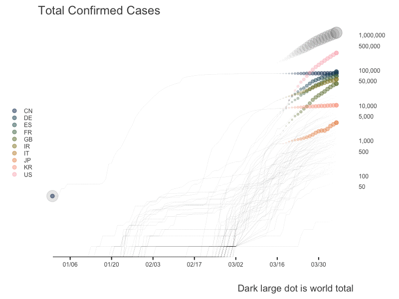

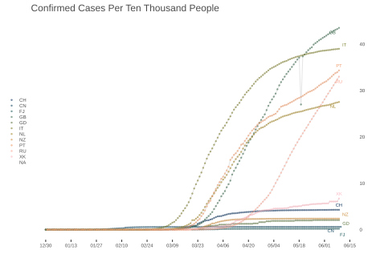

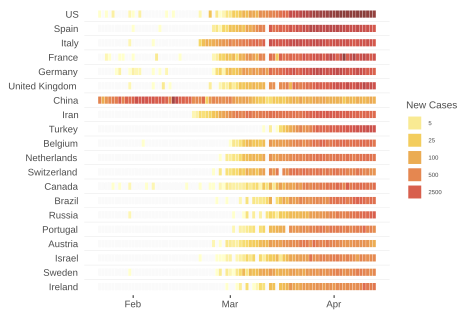

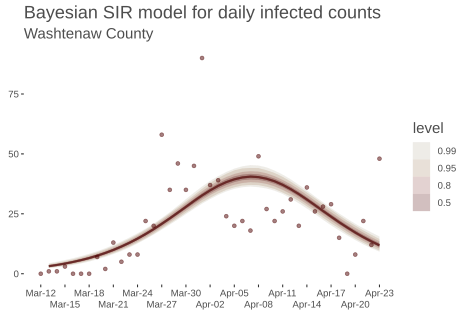

#### US State Level

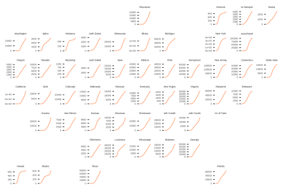 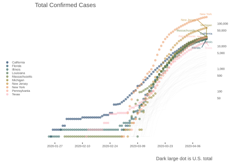 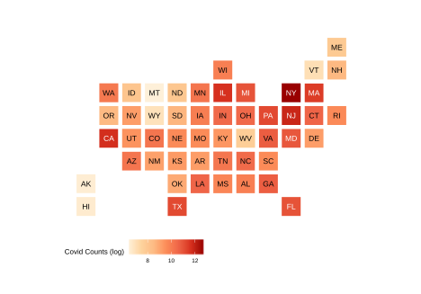 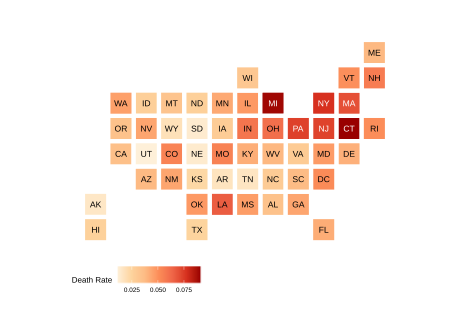

#### Counties


#### Michigan

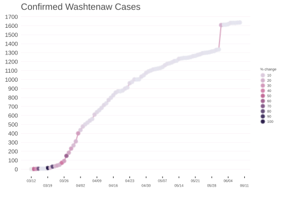 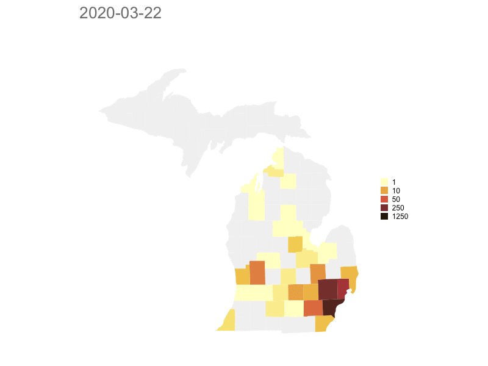

#### Model based

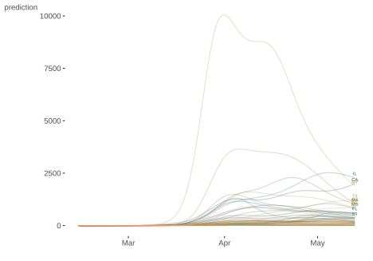 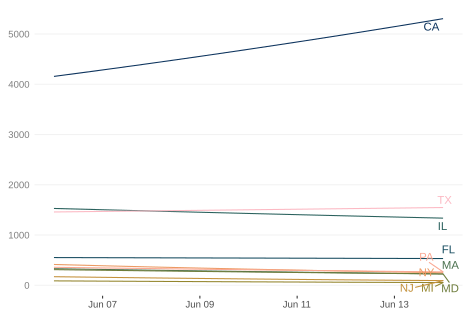 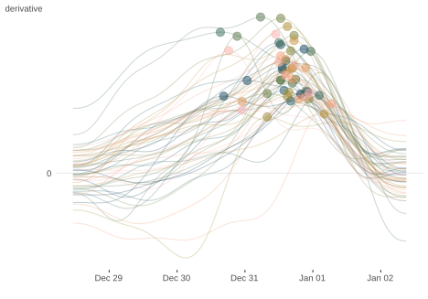

## Reuse

[CC BY-SA 4.0](https://creativecommons.org/licenses/by-sa/4.0/)

## Citation

BibTeX citation:

``` quarto-appendix-bibtex
@online{clark2020,
  author = {Clark, Michael},
  title = {Exploring the {Pandemic}},
  date = {2020-03-23},
  url = {https://m-clark.github.io/posts/2020-03-23-covid/},
  langid = {en}
}
```

For attribution, please cite this work as:

Clark, Michael. 2020. “Exploring the Pandemic.” March 23. <https://m-clark.github.io/posts/2020-03-23-covid/>.
