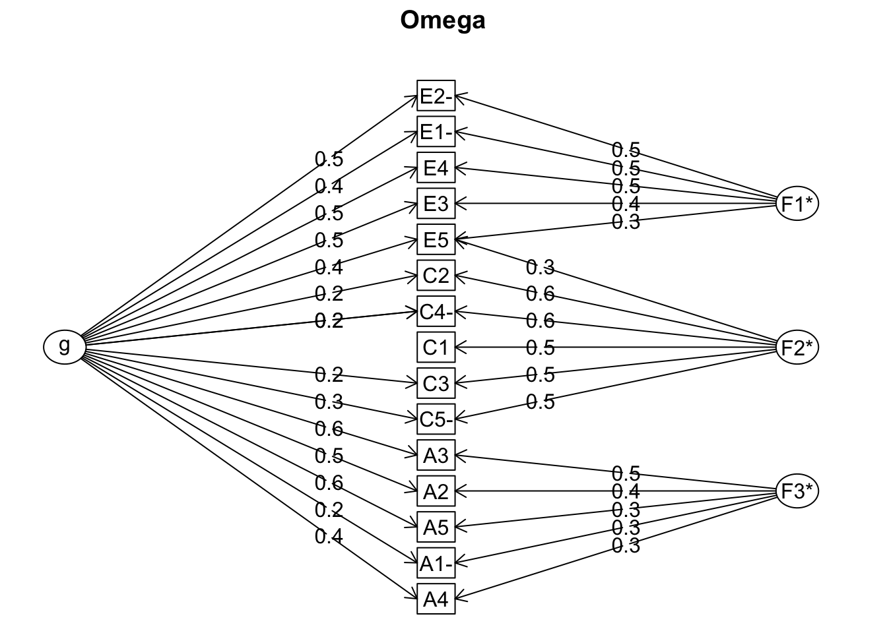
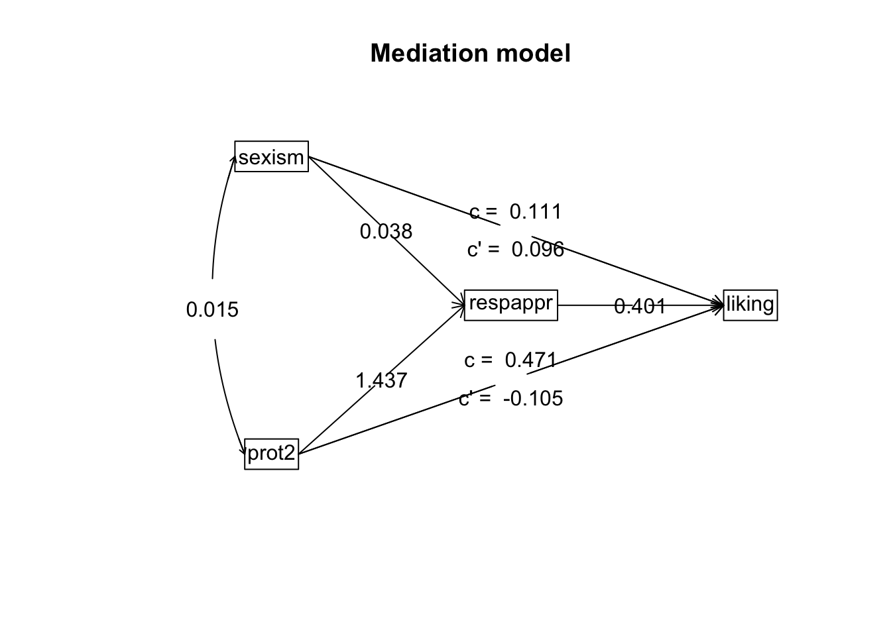

> NB: This post was revisited when updating the website early 2025, and some changes were required. Attempts to keep things consistent were made, but if you feel you’ve found an issue, please post it at [GitHub](http://github.com/m-clark/m-clark.github.io/issues).

Last updated January 02, 2025.

Prerequisites: familiarity with [factor analysis](https://m-clark.github.io/sem/)

## Introduction

The psych package is a great tool for assessing underlying latent structure. It can provide reliability statistics, do cluster analysis, principal components analysis, mediation models, and, of course factor analysis. However, it’s been around a very long time, and many things have added to, subtracted, renamed, debugged, etc. And while the package author and noted psychometrician [William Revelle](https://www.psychology.northwestern.edu/people/faculty/core/profiles/william-revelle.html) even provides a [freely available book](http://www.personality-project.org/r/book/) on the details, it can still be difficult for many to ‘jump right in’ with the package. This is because it provides so much more than other tools, which is great, but which also can be overwhelming. Even I don’t recall what some of the output regards for factor analysis, and I use the package often. While a lot of it doesn’t matter for most use, it’d be nice to have a clean reference, so here it is.

What follows is an explanation of the factor analysis results from the psych package, but much of it carries over into printed results for principal components via principal, reliability via omega, very simple structure via vss and others. Note that this is not an [introduction to factor analysis, reliability, and related](m-clark.github.io/sem). It’s assumed you are already familiar with the techniques to some extent, and are interested in using the package for those analyses.

## Demonstration

We will use the classic [big-five personality measures](https://en.wikipedia.org/wiki/Big_Five_personality_traits), which comes with the package, but for our purposes, we’re just going to look at the agreeableness and neuroticism items. See `?bfi` for details. With data in place we run a standard factor analysis, in this case, assuming two factors.

``` r
library(tidyverse)
library(psych)

data(bfi)

bfi_trim = bfi %>% select(matches('^A[1-5]|^N'))

model = fa(bfi_trim, 2)
model
```

    Factor Analysis using method =  minres
    Call: fa(r = bfi_trim, nfactors = 2)
    Standardized loadings (pattern matrix) based upon correlation matrix
         MR1   MR2   h2   u2 com
    A1  0.07 -0.36 0.14 0.86 1.1
    A2  0.05  0.69 0.47 0.53 1.0
    A3  0.03  0.76 0.56 0.44 1.0
    A4 -0.05  0.47 0.24 0.76 1.0
    A5 -0.12  0.60 0.39 0.61 1.1
    N1  0.78 -0.03 0.61 0.39 1.0
    N2  0.76 -0.02 0.58 0.42 1.0
    N3  0.77  0.05 0.58 0.42 1.0
    N4  0.58 -0.08 0.36 0.64 1.0
    N5  0.54  0.08 0.29 0.71 1.0

                           MR1  MR2
    SS loadings           2.44 1.78
    Proportion Var        0.24 0.18
    Cumulative Var        0.24 0.42
    Proportion Explained  0.58 0.42
    Cumulative Proportion 0.58 1.00

     With factor correlations of 
          MR1   MR2
    MR1  1.00 -0.19
    MR2 -0.19  1.00

    Mean item complexity =  1
    Test of the hypothesis that 2 factors are sufficient.

    df null model =  45  with the objective function =  2.82 with Chi Square =  7880.99
    df of  the model are 26  and the objective function was  0.23 

    The root mean square of the residuals (RMSR) is  0.04 
    The df corrected root mean square of the residuals is  0.05 

    The harmonic n.obs is  2759 with the empirical chi square  396.78  with prob <  5.7e-68 
    The total n.obs was  2800  with Likelihood Chi Square =  636.27  with prob <  1.6e-117 

    Tucker Lewis Index of factoring reliability =  0.865
    RMSEA index =  0.092  and the 90 % confidence intervals are  0.085 0.098
    BIC =  429.9
    Fit based upon off diagonal values = 0.98
    Measures of factor score adequacy             
                                                       MR1  MR2
    Correlation of (regression) scores with factors   0.92 0.88
    Multiple R square of scores with factors          0.84 0.77
    Minimum correlation of possible factor scores     0.68 0.54

### Loadings

That’s a lot of stuff to work though. Let’s go through each part of the printed output.

- What’s `MR`, `ML`, `PC` etc.? These are factors, and the name merely reflects the fitting method, e.g. minimum residual, maximum likelihood, principal components. The default is minimum residual, so in this case `MR`.
- Why are they ‘out of order’? the number assigned is arbitrary, but this has to do with a rotated solution. See the help file for more details, otherwise they are numbered in terms of variance accounted for.
- `h2`: the amount of variance in the item/variable explained by the (retained) factors. It is the sum of the squared loadings, a.k.a. *communality*.
- `u2`: 1 - `h2`. residual variance, a.k.a. *uniqueness*
- `com`: Item complexity. Specifically it is “Hoffman’s index of complexity for each item. This is just \\{(Σ λ_i^2)^2}/{Σ λ_i^4}\\ where \\λ_i\\ is the factor loading on the i^(th) factor. From Hofmann (1978), MBR. See also Pettersson and Turkheimer (2010).” It equals one if an item loads only on one factor, 2 if evenly loads on two factors, etc. Basically it tells you how much an item reflects a single construct. It will be lower for relatively lower loadings.

### Variance accounted for

                           MR1  MR2
    SS loadings           2.44 1.78
    Proportion Var        0.24 0.18
    Cumulative Var        0.24 0.42
    Proportion Explained  0.58 0.42
    Cumulative Proportion 0.58 1.00

The variance accounted for portion of the output can be explained as follows:

- `SS loadings`: These are the eigenvalues, the sum of the squared loadings. In this case where we are using a correlation matrix, summing across all factors would equal the number of variables used in the analysis.
- `Proportion Var`: tells us how much of the overall variance the factor accounts for out of all the variables.
- `Cumulative Var`: the cumulative sum of `Proportion Var`.
- `Proportion Explained`: The relative amount of variance explained- Proportion Var`/sum(`Proportion Var`)`.
- `Cumulative Proportion`: the cumulative sum of `Proportion Explained`.

These are contained in `model$Vaccounted`.

### Factor correlations

     With factor correlations of 
          MR1   MR2
    MR1  1.00 -0.19
    MR2 -0.19  1.00

Whether you get this part of the analysis depends on whether or not these are estimated. You have to have multiple factors and a rotation that allows for the correlations.

- `factor correlations`: the correlation matrix for the factors. \\\phi\\ (phi)
- `Mean item complexity`: the mean of `com`.

These are contained in `model$Phi`.

### Model test results

    Test of the hypothesis that 2 factors are sufficient.

    The degrees of freedom for the null model are  45  and the objective function was  2.82 with Chi Square of  7880.99
    The degrees of freedom for the model are 26  and the objective function was  0.23 

- `null model`: The degrees of freedom for the null model that assumes no correlation structure.
- `objective function`: The value of the function that is minimized by a specific procedure.
- `model`: The one you’re actually interested in. Where p = Number of items, nf = number of factors then: degrees of freedom = \\p \* (p-1)/2 - p \* nf + nf\*(nf-1)/2\\ For the null model this is \\p \* (p-1)/2\\.
- `Chi-square`: If `f` is the objective function value. Then \\\chi^2 = (n.obs - 1 - (2 \* p + 5)/6 - (2 \* nf)/3)) \* f\\  
  Strangely this is reported for the null but not the primary model result, which comes later.

### Number of observations

    The harmonic number of observations is  2759 with the empirical chi square  396.78  with prob <  5.7e-68 
    The total number of observations was  2800  with Likelihood Chi Square =  636.27  with prob <  1.6e-117 

- `total`: the number of rows in the data you supplied for analysis
- `harmonic`: while one would assume it is the harmonic mean of the number of observations across items, it’s not this exactly, but is instead the harmonic mean of all the pairwise counts of observations (see `?pairwiseCount`).

The \\\chi^2\\ reported here regards the primary model. So for your model you can report `model$STATISTIC`, `model$dof`, `model$PVAL`, which is what you see in the printed output for the total number of observations. As this regards the residual correlation matrix, a smaller value is better, as in SEM. The empirical chi-square is based on the harmonic sample size, so might be better, but I’ve never seen it reported.

### Fit indices

    The root mean square of the residuals (RMSR) is  0.04 
    The df corrected root mean square of the residuals is  0.05 

    ...

    Tucker Lewis Index of factoring reliability =  0.865
    RMSEA index =  0.092  and the 90 % confidence intervals are  0.085 0.098
    BIC =  429.9
    Fit based upon off diagonal values = 0.98

The nice thing about the psych package is that it reports SEM-style fit indices for standard factor analysis. You can find some more information via `?factor.stats`.

- `TLI`: Tucker Lewis fit index, typically reported in SEM. Generally want \> .9
- `RMSEA`: Root mean square error of approximation. Also reported is the so-called ‘test of close fit’.
- `RMSR`: The (standardized) root mean square of the residuals. Also provided is a ‘corrected’ version, but I doubt this is reported by many.
- `Fit based upon off diagonal values`: This is not documented anywhere I can find. However, you can think of it as `1 - resid^2 / cor^2`, or a kind of \\R^2\\ applied to a correlation matrix instead of raw data. It is calculated via factor.stats.
- `BIC`: Useful for model comparison purposes only.

### Measures of factor score adequacy

    Measures of factor score adequacy             
                                                       MR1  MR2
    Correlation of (regression) scores with factors   0.92 0.88
    Multiple R square of scores with factors          0.84 0.77
    Minimum correlation of possible factor scores     0.68 0.54

Unfortunately these are named in such a way as to be nearly indistinguishable, but there is some documentation for them in `?factor.stats`. In general, these tell us how representative the factor score estimates are of the underlying constructs, and can be called indeterminancy indices. Indeterminancy refers to the fact that an infinite number of factor scores can be derived that would be consistent with a given set of loadings. In Revelle’s text, [chapter 6.9](http://www.personality-project.org/r/book/#chapter6) goes into detail, while Grice (2001) is a thorough review of the problem.

- `Correlation of (regression) scores with factors`: square root of the `Multiple R square`. These can be seen as upper bounds of the determinancy of the factor score estimates that can be computed based on the model. It is essentially the (multiple) correlation of the factor and the observed data, as the name now more clearly suggests.
- `Multiple R square...`: “The multiple R square between the factors and factor score estimates, if they were to be found. (From Grice, 2001).” Computationally, it is roughly `t(model$weights) %*% model$loadings`, where the weights are the factor score coefficients, and can be seen as the maximum proportion of determinancy (higher is better). One way you can think about this is as an \\R^2\\ for a regression model of the items predicting the estimated factor score.
- `Minimum correlation...`: Not documented, and is only shown as part of the print method, as it is not calculated as part of the factor analysis. But it is \\2 \cdot R^2 - 1\\, and so ranges from -1 to +1. If your \\R^2\\ is less than .5, it will be negative, which is not good.

### Miscellaneous results

There is a lot of other stuff in these objects, like a sample size corrected BIC, Grice’s validity coefficients, the actual residuals for the correlation matrix and more.

``` r
str(model, 1)
```

    List of 54
     $ residual     : num [1:10, 1:10] 0.8556 -0.0899 0.0122 0.0377 0.0573 ...
      ..- attr(*, "dimnames")=List of 2
     $ dof          : num 26
     $ chi          : num 397
     $ nh           : num 2759
     $ rms          : num 0.04
     $ EPVAL        : num 5.71e-68
     $ crms         : num 0.0526
     $ EBIC         : num 191
     $ ESABIC       : num 273
     $ fit          : num 0.789
     $ fit.off      : num 0.981
     $ sd           : num 0.0382
     $ factors      : num 2
     $ complexity   : Named num [1:10] 1.09 1.01 1 1.02 1.08 ...
      ..- attr(*, "names")= chr [1:10] "A1" "A2" "A3" "A4" ...
     $ n.obs        : int 2800
     $ objective    : num 0.228
     $ criteria     : Named num [1:3] 0.228 NA NA
      ..- attr(*, "names")= chr [1:3] "objective" "" ""
     $ STATISTIC    : num 636
     $ PVAL         : num 1.6e-117
     $ Call         : language fa(r = bfi_trim, nfactors = 2)
     $ null.model   : num 2.82
     $ null.dof     : num 45
     $ null.chisq   : num 7881
     $ TLI          : num 0.865
     $ CFI          : num 0.922
     $ RMSEA        : Named num [1:4] 0.0916 0.0855 0.0978 0.9
      ..- attr(*, "names")= chr [1:4] "RMSEA" "lower" "upper" "confidence"
     $ BIC          : num 430
     $ SABIC        : num 513
     $ r.scores     : num [1:2, 1:2] 1 -0.227 -0.227 1
     $ R2           : num [1:2] 0.842 0.768
     $ valid        : num [1:2] 0.905 0.852
     $ score.cor    : num [1:2, 1:2] 1 -0.185 -0.185 1
     $ weights      : num [1:10, 1:2] 0.00559 0.00986 -0.00452 -0.01416 -0.03449 ...
      ..- attr(*, "dimnames")=List of 2
     $ rotation     : chr "oblimin"
     $ hyperplane   : Named num [1:2] 5 5
      ..- attr(*, "names")= chr [1:2] "MR1" "MR2"
     $ communality  : Named num [1:10] 0.144 0.467 0.563 0.237 0.395 ...
      ..- attr(*, "names")= chr [1:10] "A1" "A2" "A3" "A4" ...
     $ communalities: Named num [1:10] 0.144 0.467 0.563 0.237 0.395 ...
      ..- attr(*, "names")= chr [1:10] "A1" "A2" "A3" "A4" ...
     $ uniquenesses : Named num [1:10] 0.856 0.533 0.437 0.763 0.605 ...
      ..- attr(*, "names")= chr [1:10] "A1" "A2" "A3" "A4" ...
     $ values       : num [1:10] 2.6714 1.5564 0.2727 0.1283 0.0455 ...
     $ e.values     : num [1:10] 3.185 2.11 0.938 0.768 0.71 ...
     $ loadings     : 'loadings' num [1:10, 1:2] 0.0744 0.0541 0.0311 -0.0519 -0.1191 ...
      ..- attr(*, "dimnames")=List of 2
     $ model        : num [1:10, 1:10] 0.144 -0.25 -0.277 -0.184 -0.239 ...
      ..- attr(*, "dimnames")=List of 2
     $ fm           : chr "minres"
     $ rot.mat      : num [1:2, 1:2] 0.857 0.549 -0.38 0.944
     $ Phi          : num [1:2, 1:2] 1 -0.186 -0.186 1
      ..- attr(*, "dimnames")=List of 2
     $ Structure    : 'loadings' num [1:10, 1:2] 0.1413 -0.0748 -0.1098 -0.1402 -0.23 ...
      ..- attr(*, "dimnames")=List of 2
     $ method       : chr "regression"
     $ scores       : num [1:2800, 1:2] -0.224 0.2186 0.532 -0.2429 -0.0564 ...
      ..- attr(*, "dimnames")=List of 2
     $ R2.scores    : Named num [1:2] 0.842 0.768
      ..- attr(*, "names")= chr [1:2] "MR1" "MR2"
     $ r            : num [1:10, 1:10] 1 -0.34 -0.265 -0.146 -0.181 ...
      ..- attr(*, "dimnames")=List of 2
     $ np.obs       : num [1:10, 1:10] 2784 2757 2759 2767 2769 ...
      ..- attr(*, "dimnames")=List of 2
     $ fn           : chr "fa"
     $ Vaccounted   : num [1:5, 1:2] 2.443 0.244 0.244 0.578 0.578 ...
      ..- attr(*, "dimnames")=List of 2
     $ ECV          : Named num [1:2] 0.578 1
      ..- attr(*, "names")= chr [1:2] "MR1" "MR2"
     - attr(*, "class")= chr [1:2] "psych" "fa"

In turn, these are:

- `residual`: The residual correlation matrix
- `dof`: The model degrees of freedom
- `chi`: The empirical model \\X^2\\
- `nh`: The harmonic sample size
- `rms`: Root mean square residual
- `EPVAL`: p-value for the empirical chi-square
- `crms`: a ‘corrected’ rms
- `EBIC`: BIC for the empirical model
- `ESABIC`: sample-size corrected BIC for the empirical model
- `fit`: Similar to `fit.off`. General fit index (how well is the observed correlation reproduced)
- `fit.off`: Fit based on off diagonals. Reported in the output. See above.
- `sd`: standard deviation of the off-diagonals of the residual correlation matrix.
- `factors`: the number of factors
- `complexity`: The complexity scores. See above.
- `n.obs`: The number of observations (assuming complete data)
- `objective`: The objective function for the model
- `criteria`: Along with the objective function, additional fitting results
- `STATISTIC`: The model-based \\X^2\\
- `PVAL`: The p-value for the model-based \\X^2\\
- `Call`: The function call
- `null.model`: \\X^2\\ test results for the null model
- `null.dof`: \\X^2\\ test results for the null model
- `null.chisq`: \\X^2\\ test results for the null model
- `TLI`: Tucker-Lewis fit index
- `RMSEA`: Root mean square error of approximation with upper and lower bounds
- `BIC`: Bayesian Information Criterion for the model
- `SABIC`: sample-size corrected BIC for the model
- `r.scores`: The correlations of the factor score estimates using the specified model, if they were to be found. Comparing these correlations with that of the scores themselves will show, if an alternative estimate of factor scores is used (e.g., the tenBerge method), the problem of factor indeterminacy. For these correlations will not necessarily be the same.
- `R2`: correlation of factors and estimated factor scores (squared)
- `valid`: validity coefficients
- `score.cor`: The correlation matrix of course coded (unit weighted) factor score estimates (i.e. sum scores), if they were to be found, based upon the loadings matrix rather than the weights matrix.
- `weights`: weights used to construct factor scores
- `rotation`: rotation used
- `communality`: communality scores `h2`
- `communalities`: So nice they put them twice (actually not entirely equal)
- `uniquenesses`: Uniquenesses `u2`
- `values` eigenvalues of the model implied correlation matrix
- `e.values`: eigenvalues of the correlation matrix
- `loadings`: the factor loadings
- `model`: the model-implied correlation matrix
- `fm`: the estimation approach
- `rot.mat`: matrix used in the rotated solution
- `Phi`: factor score correlation matrix
- `Structure`: this is just the loadings (pattern) matrix times the factor intercorrelation matrix (Phi).
- `method`: method used to construct the factor scores
- `scores`: estimated factor scores
- `R2.scores`: estimated correlation of factor scores with the factor (squared)
- `r`: the (possibly smoothed) correlation matrix of the observation
- `np.obs`: pairwise sample sizes (used to get the harmonic mean)
- `fn`: the function used
- `Vaccounted`: the SS loadings output.

## Additional Notes for Factor Analysis

- Most of the above would apply to other versions of fa and principal for principal components analysis.

- Though rarely done, if you only provide a correlation matrix as your data, you will not get a variety of metrics in the results, nor factor scores.

- Certain rotations will lead to differently named factors, and possibly lacking some output (e.g. varimax won’t have factor correlations).

## Other Functions

While the previous will help explain factor analysis and related models, a similar issue arises elsewhere with other package functions that might be of interest. I’ll explain some of those here as interest and personal use dictates.

### Alpha

This is a quick reminder for the results of the reliability coefficient \\\alpha\\. For this we’ll just use the agreeableness items to keep things succinct.

#### Basic Results

``` r
agreeableness = bfi_trim[,1:5]

# check.keys will rescale negatively scored items
alpha_results = alpha(agreeableness, check.keys = TRUE, n.iter=10) 
alpha_results
```


    Reliability analysis   
    Call: alpha(x = agreeableness, check.keys = TRUE, n.iter = 10)

      raw_alpha std.alpha G6(smc) average_r  S/N   ase mean  sd median_r
           0.7      0.46    0.53      0.14 0.85 0.009  4.7 0.9     0.32

        95% confidence boundaries 
                 lower alpha upper
    Feldt         0.69   0.7  0.72
    Duhachek      0.69   0.7  0.72
    bootstrapped  0.69   0.7  0.72

     Reliability if an item is dropped:
        raw_alpha std.alpha G6(smc) average_r  S/N alpha se  var.r med.r
    A1-      0.72      0.72    0.67     0.397 2.63   0.0087 0.0065 0.375
    A2       0.62      0.30    0.39     0.096 0.43   0.0119 0.1095 0.081
    A3       0.60      0.21    0.31     0.061 0.26   0.0124 0.1014 0.081
    A4       0.69      0.30    0.44     0.099 0.44   0.0098 0.1604 0.104
    A5       0.64      0.24    0.36     0.071 0.31   0.0111 0.1309 0.094

     Item statistics 
           n raw.r std.r r.cor r.drop mean  sd
    A1- 2784  0.58 0.024 -0.39   0.31  4.6 1.4
    A2  2773  0.73 0.665  0.58   0.56  4.8 1.2
    A3  2774  0.76 0.742  0.71   0.59  4.6 1.3
    A4  2781  0.65 0.661  0.50   0.39  4.7 1.5
    A5  2784  0.69 0.719  0.64   0.49  4.6 1.3

    Non missing response frequency for each item
          1    2    3    4    5    6 miss
    A1 0.33 0.29 0.14 0.12 0.08 0.03 0.01
    A2 0.02 0.05 0.05 0.20 0.37 0.31 0.01
    A3 0.03 0.06 0.07 0.20 0.36 0.27 0.01
    A4 0.05 0.08 0.07 0.16 0.24 0.41 0.01
    A5 0.02 0.07 0.09 0.22 0.35 0.25 0.01

- `raw_alpha`: Raw estimate of alpha (based on covariances)
- `std.alpha`: Standardized estimate. This value is what is typically reported (though most applied researchers would probably not be able to tell you which they reported). Identical to raw if data is already standardized.
- `G6 (smc)`: Guttman’s \\\lambda_6\\, the amount of variance in each item that can be accounted for the linear regression of all of the other items
- `average_r`: Average inter-item correlation among the items.
- `S/N`: Signal to noise ratio, \\n \cdot r/(1-r)\\ where r is the `average_r`
- `ase`: standard error for raw \\\alpha\\ (used for the confidence interval, bootstrapped would be better)
- `mean`: the mean of the total/mean score of the items
- `sd`: the standard deviation of the total/mean score of the items
- `median_r`: median inter-item correlation

After the initial statistics, the same stats are reported but for a result where a specific item is dropped. For example, if your \\\alpha\\ goes up when an item is dropped, it probably isn’t a good item. In this case, the negatively scored item is probably worst, which isn’t an uncommon result.

#### Item statistics

Next we get the item statistics, they are as follows.

     Item statistics 
           n raw.r std.r r.cor r.drop mean  sd
    A1- 2784  0.58  0.57  0.38   0.31  4.6 1.4
    A2  2773  0.73  0.75  0.67   0.56  4.8 1.2
    A3  2774  0.76  0.77  0.71   0.59  4.6 1.3
    A4  2781  0.65  0.63  0.47   0.39  4.7 1.5
    A5  2784  0.69  0.70  0.60   0.49  4.6 1.3

- `n`: number of complete observations
- `raw.r`: correlation of each item with the total score
- `std.r`: correlation of each item with the total score if the items were all standardized
- `r.cor`: item correlation corrected for item overlap and scale reliability
- `r.drop` item correlation for this item against the scale without this item
- `mean`: item mean
- `sd`: item standard deviation

#### Response frequency

Finally we have information about the missingness of each item. The initial values show the proportion of each level observed, while the last column shows the percentage missing.

    Non missing response frequency for each item
          1    2    3    4    5    6 miss
    A1 0.33 0.29 0.14 0.12 0.08 0.03 0.01
    A2 0.02 0.05 0.05 0.20 0.37 0.31 0.01
    A3 0.03 0.06 0.07 0.20 0.36 0.27 0.01
    A4 0.05 0.08 0.07 0.16 0.24 0.41 0.01
    A5 0.02 0.07 0.09 0.22 0.35 0.25 0.01

#### Other Output

In addition to these we have a bit more from the output.

``` r
str(alpha_results[5:length(alpha_results)])
```

    List of 11
     $ keys   :List of 1
      ..$ : chr [1:5] "-A1" "A2" "A3" "A4" ...
     $ scores : Named num [1:2800] 4 4.2 3.8 4.6 4 4.6 4.6 2.6 3.6 5.4 ...
      ..- attr(*, "names")= chr [1:2800] "61617" "61618" "61620" "61621" ...
     $ nvar   : int 5
     $ boot.ci: Named num [1:3] 0.692 0.702 0.717
      ..- attr(*, "names")= chr [1:3] "2.5%" "50%" "97.5%"
     $ boot   : num [1:10, 1:10] 0.712 0.692 0.711 0.718 0.695 ...
      ..- attr(*, "dimnames")=List of 2
      .. ..$ : NULL
      .. ..$ : chr [1:10] "raw_alpha" "std.alpha" "G6(smc)" "average_r" ...
     $ feldt  :List of 4
      ..$ lower.ci:'data.frame':    1 obs. of  1 variable:
      .. ..$ raw_alpha: num 0.685
      ..$ alpha   :'data.frame':    1 obs. of  1 variable:
      .. ..$ raw_alpha: num 0.703
      ..$ upper.ci:'data.frame':    1 obs. of  1 variable:
      .. ..$ raw_alpha: num 0.72
      ..$ r.bar   :'data.frame':    1 obs. of  1 variable:
      .. ..$ raw_alpha: num 0.321
      ..- attr(*, "class")= chr [1:2] "psych" "alpha.ci"
     $ Unidim :List of 1
      ..$ Unidim: num 0.237
     $ var.r  : num 0.112
     $ Fit    :List of 1
      ..$ Fit.off: num 0.879
     $ call   : language alpha(x = agreeableness, check.keys = TRUE, n.iter = 10)
     $ title  : NULL

In turn these are:

- `keys`: how the items are score (-1 if reverse scored)
- `scores`: row means/sums depending on the `cumulative` argument
- `nvar`: the number of variables/items
- `boot.ci`: the bootstrapped confidence interval for \\\alpha\\ (if requested)
- `boot`: the bootstrapped values of \\\alpha\\ and other statistics (if requested)
- `Unidim`: index of unidimensionalty. \\\alpha\\ is a lower bound of a reliability estimate if the data is not unidimensional. See `?unidim` for details.
- `var.r`: This doesn’t appear to be documented anywhere, but it is depicted in the `Reliability if item is dropped` section. It is the variance of the values of the lower triangle of a correlation matrix.
- `Fit`: see `Fit based upon off diagonal values` for the factor analysis section above.
- `call`: the function call
- `title`: title of the results (if requested)

### Omega

Omega is another reliability metric that finally has been catching on. The psych function omega requires a factor analysis to be run behind the scenes, specifically a *bifactor* model, so most of the output is the same as with other factor analysis. In addition, the results also provide coefficient \\\alpha\\ and Guttman’s \\\lambda_6\\ that were explained in the [alpha](#alpha) section.

However there is a little more to it, so we’ll explain those aspects. The key help files are `?omega` and `?schmid`.

``` r
omega_result = omega(bfi[,1:15])
```



``` r
omega_result
```

    Omega 
    Call: omegah(m = m, nfactors = nfactors, fm = fm, key = key, flip = flip, 
        digits = digits, title = title, sl = sl, labels = labels, 
        plot = plot, n.obs = n.obs, rotate = rotate, Phi = Phi, option = option, 
        covar = covar)
    Alpha:                 0.81 
    G.6:                   0.83 
    Omega Hierarchical:    0.54 
    Omega H asymptotic:    0.64 
    Omega Total            0.85 

    Schmid Leiman Factor loadings greater than  0.2 
            g   F1*   F2*   F3*   h2   u2   p2
    A1-  0.24              0.30 0.16 0.84 0.36
    A2   0.52              0.44 0.47 0.53 0.58
    A3   0.59              0.45 0.56 0.44 0.63
    A4   0.39              0.28 0.25 0.75 0.62
    A5   0.56              0.31 0.44 0.56 0.70
    C1               0.53       0.31 0.69 0.11
    C2   0.23        0.60       0.42 0.58 0.12
    C3   0.21        0.51       0.32 0.68 0.14
    C4-  0.25        0.59       0.41 0.59 0.15
    C5-  0.28        0.51       0.34 0.66 0.23
    E1-  0.37  0.47             0.37 0.63 0.38
    E2-  0.48  0.54             0.53 0.47 0.43
    E3   0.47  0.36             0.37 0.63 0.61
    E4   0.54  0.46             0.51 0.49 0.57
    E5   0.41  0.32  0.25       0.33 0.67 0.51

    With Sums of squares  of:
       g  F1*  F2*  F3* 
    2.47 1.03 1.60 0.69 

    general/max  1.54   max/min =   2.32
    mean percent general =  0.41    with sd =  0.21 and cv of  0.52 
    Explained Common Variance of the general factor =  0.43 

    The degrees of freedom are 63  and the fit is  0.34 
    The number of observations was  2800  with Chi Square =  961.82  with prob <  6.4e-161
    The root mean square of the residuals is  0.04 
    The df corrected root mean square of the residuals is  0.05
    RMSEA index =  0.071  and the 10 % confidence intervals are  0.067 0.075
    BIC =  461.77

    Compare this with the adequacy of just a general factor and no group factors
    The degrees of freedom for just the general factor are 90  and the fit is  1.58 
    The number of observations was  2800  with Chi Square =  4407.94  with prob <  0
    The root mean square of the residuals is  0.13 
    The df corrected root mean square of the residuals is  0.14 

    RMSEA index =  0.131  and the 10 % confidence intervals are  0.128 0.134
    BIC =  3693.57 

    Measures of factor score adequacy             
                                                     g   F1*  F2*   F3*
    Correlation of scores with factors            0.78  0.70 0.82  0.60
    Multiple R square of scores with factors      0.61  0.49 0.68  0.36
    Minimum correlation of factor score estimates 0.22 -0.01 0.36 -0.28

     Total, General and Subset omega for each subset
                                                     g  F1*  F2*  F3*
    Omega total for total scores and subscales    0.85 0.77 0.73 0.73
    Omega general for total scores and subscales  0.54 0.40 0.11 0.46
    Omega group for total scores and subscales    0.25 0.36 0.62 0.27

The bifactor model requires a single general factor and minimally three specific factors, as the plot shows. However, you can run it on single factor just to get the omega total statistic, but any less than three factors will produce a warning and some metrics will either be unavailable or not make much sense.

#### Reliability

    Alpha:                 0.81 
    G.6:                   0.83 
    Omega Hierarchical:    0.54 
    Omega H asymptotic:    0.64 
    Omega Total            0.85 

The first two pieces of info are as in [alpha](#alpha), the next regard \\\omega\\ specifically. \\\omega\\ is based on the squared factor loadings. \\\omega\_{hierarchical}\\ regards just the loadings of the general factor. The asymptotic is the same for a ‘test of infinite items’, and so can be seen as an upper bound. \\\omega\_{total}\\ is based on all the general and specific factor loadings. I personally like to think of the ratio of \\\frac{\omega\_{hier}}{\omega\_{total}}\\, which if very high, say .9 or so, may suggest unidimensionality.

#### Loadings

    Schmid Leiman Factor loadings greater than  0.2 
            g   F1*   F2*   F3*   h2   u2   p2
    A1-  0.24              0.30 0.16 0.84 0.36
    A2   0.52              0.44 0.47 0.53 0.58
    A3   0.59              0.45 0.56 0.44 0.63
    A4   0.39              0.28 0.25 0.75 0.62
    A5   0.56              0.31 0.44 0.56 0.70
    C1               0.53       0.31 0.69 0.11
    C2   0.23        0.60       0.42 0.58 0.12
    C3   0.21        0.51       0.32 0.68 0.14
    C4-  0.25        0.59       0.41 0.59 0.15
    C5-  0.28        0.51       0.34 0.66 0.23
    E1-  0.37  0.47             0.37 0.63 0.38
    E2-  0.48  0.54             0.53 0.47 0.43
    E3   0.47  0.36             0.37 0.63 0.61
    E4   0.54  0.46             0.51 0.49 0.57
    E5   0.41  0.32  0.25       0.33 0.67 0.51

    With eigenvalues of:
       g  F1*  F2*  F3* 
    2.47 1.03 1.60 0.69 

    general/max  1.54   max/min =   2.32
    mean percent general =  0.41    with sd =  0.21 and cv of  0.52 
    Explained Common Variance of the general factor =  0.43 

The loadings are for the general and specific factors are provided, as well as the communalities and uniquenesses. In addition there is a column for `p2`, which is considered a diagnostic tool for the appropriateness of a hierarchical model. It is defined as “percent of the common variance for each variable that is general factor variance”, which is just `g`²/`h2`. The line of `mean percent general...` isn’t documented and is a result of the unexported print.psych.omega function. It wasn’t obvious to me, but these are merely statistics regarding the `p2` column (`cv` is the coefficient of variation).

Next you get eigenvalue/variance accounted as in standard factor analysis. Then `general/max` and `max/min` regard those ratios of the corresponding eigenvalues. Explained common variance is the percent of variance attributable to the general factor (g/sum(all eigenvalues))

#### Model test results & fit

    The degrees of freedom are 63  and the fit is  0.34 
    The number of observations was  2800  with Chi Square =  961.82  with prob <  6.4e-161
    The root mean square of the residuals is  0.04 
    The df corrected root mean square of the residuals is  0.05
    RMSEA index =  0.071  and the 10 % confidence intervals are  0.067 0.075
    BIC =  461.77

    Compare this with the adequacy of just a general factor and no group factors
    The degrees of freedom for just the general factor are 90  and the fit is  1.58 
    The number of observations was  2800  with Chi Square =  4407.94  with prob <  0
    The root mean square of the residuals is  0.13 
    The df corrected root mean square of the residuals is  0.14 

    RMSEA index =  0.131  and the 10 % confidence intervals are  0.128 0.134
    BIC =  3693.57 

The only thing different here relative to the standard factor analysis results is that there are two models considered- a model with general and specific factors and a model with no specific factors.

#### Measures of factor score adequacy

    Measures of factor score adequacy             
                                                     g   F1*  F2*   F3*
    Correlation of scores with factors            0.78  0.70 0.82  0.60
    Multiple R square of scores with factors      0.61  0.49 0.68  0.36
    Minimum correlation of factor score estimates 0.22 -0.01 0.36 -0.28

This first part of the output is the same as standard factor analysis (see [above](#measures-of-factor-score-adequacy-1)).

#### Variance accounted for by group and specific factors

     Total, General and Subset omega for each subset
                                                     g  F1*  F2*  F3*
    Omega total for total scores and subscales    0.85 0.77 0.73 0.73
    Omega general for total scores and subscales  0.54 0.40 0.11 0.46
    Omega group for total scores and subscales    0.25 0.36 0.62 0.27

This part is explained in the `?omega` helpfile as:

> The notion of omega may be applied to the individual factors as well as the overall test. A typical use of omega is to identify subscales of a total inventory. Some of that variability is due to the general factor of the inventory, some to the specific variance of each subscale. Thus, we can find a number of different omega estimates: what percentage of the variance of the items identified with each subfactor is actually due to the general factor. What variance is common but unique to the subfactor, and what is the total reliable variance of each subfactor. These results are reported in omega.group object and in the last few lines of the normal output.

As noted, this is contained in `omega_result$omega.group`. For the unique factors, these sum very simply as total = general + group. The ones for unique factors pertain only to the loadings and part of the correlation matrix for those items specific to that factor. Take agreeableness for example, we are only concerned with the variance of those items. The ‘general’ part regards the loadings of `g` for the agreeableness items, the `group` part the loadings of the agreeableness items, and the ‘total’ is just their sum.

The first column, `g`, just regurgitates \\\omega\\ and \\\omega_h\\ from the beginning for the first two values, and adds yet another statistic, based only on the sum of variance attributable to each unique factor. Unlike the \\\omega\_{total}\\, this calculation does not include off-loadings the unique factors have, only the items that are grouped with each factor. In pseudo-code:

    for (i in specific) {
     specific_var[i] = sum(specific[i]$loadings[specific_items[i]])^2)
    }

    value = sum(specific_var) / total_var

That is the variance uniquely defined by the specific factors. Had it included all the loadings for each specific factor calculation, then `group + general = total` for `g` as well.

### Unidimensionality

Revelle provides an ‘exploratory’ statistic of *unidimensionality*, or how well a set of variables may be explained by one construct. In practice, you may find multiple factors fit better, e.g. via BIC, but the resulting factors may be highly correlated, so you might still want to consider a single construct. Something like unidim will help make a decision on how viable using a sum score might be for regression or other models. It is explained in the help file as follows:

> The fit FF’ (model implied correlation matrix based on a one factor model) should be identical to the (observed) correlation matrix minus the uniquenesses. unidim is just the ratio of these two estimates. The higher it is, the more the evidence for unidimensionality.

I’ll run it for both the case where there is only a single construct vs. two underlying constructs.

``` r
unidim(bfi[,1:5])
```


    A measure of unidimensionality 
     Call: unidim(keys = bfi[, 1:5])

    Unidimensionality index = 
           u      tau      con    alpha     av.r median.r      CFI      ECV 
        0.89     0.90     0.99     0.71     0.33     0.34     0.97     0.85 

    unidim adjusted index reverses negatively scored items.
    alpha    Based upon reverse scoring some items.
    average and median  correlations are based upon reversed scored items

``` r
unidim(bfi_trim)
```


    A measure of unidimensionality 
     Call: unidim(keys = bfi_trim)

    Unidimensionality index = 
           u      tau      con    alpha     av.r median.r      CFI      ECV 
        0.45     0.62     0.73     0.75     0.23     0.17     0.60     0.58 

    unidim adjusted index reverses negatively scored items.
    alpha    Based upon reverse scoring some items.
    average and median  correlations are based upon reversed scored items

The values reported are as follows. In general, you’d pay attention to the `adjusted` results that are based on items that are reverse scored if needed. If there are no reverse scored items (which you generally should be doing), then these adjusted metrics will be identical to the raw metrics.

- `Raw Unidim`: The raw value of the unidimensional criterion
- `Adjusted`: The unidimensional criterion when items are keyed in positive direction.
- `Fit1`: The off diagonal fit from fa. ([explained above](#fit-indices))
- `alpha`: Standardized \\\alpha\\ of the keyed items (after appropriate reversals)
- `av.r`: The average inter-item correlation of the keyed items.
- `original model`: The ratio of the FF’ (model implied correlation matrix based on the loadings) model to the sum(R).
- `adjusted model`: The ratio of the FF’ model to the sum(R) when items are flipped.
- `raw.total`: sum(R - uniqueness)/sum(R)
- `adjusted total`: raw.total ratio with flipped items

### Mediate

The psych makes even somewhat complicated mediation models about as easily conducted as they can be, assuming you are only dealing with fully observed (no latent) variables and linear models with continuous endogenous variables that are assumed to be normally distributed. Though the output should be straightforward if one understands basic regression as well as the basics of mediation, we demonstrate it here.

#### Initial Model

Garcia, Schmitt, Branscome, and Ellemers (2010) report data for 129 subjects on the effects of perceived sexism on anger and liking of women’s reactions to in-group members who protest discrimination. We will predict liking (how much the individual liked the target) while using protest (`prot2` yes or no) and sexism (a scale score based on multiple items) as predictors, and a scaled score of the appropriateness of the target’s response as the mediator (`respappr`).

``` r
data(GSBE)   # The Garcia et al data set; see ?GSBE for details

model <- mediate(
  liking ~  sexism + prot2 + (respappr),
  data   = Garcia,
  n.iter = 500,
  plot   = FALSE
)   
```

#### Visual Results

To start, most of the output of psych is straightforward if you understand what mediation is, as it follows the same depiction and even uses the same labels as most initial demonstrations of mediation I’ve come across. So if it’s confusing, you probably need to review what such models are attempting to accomplish. The visualization it automatically produces is even clearer for storytelling. I reserved plotting for display here so as to make it easier to compare to the printed output.

``` r
mediate.diagram(model, digits = 3)
```



We see the original effects of `sexism` and `prot2` as `c`, and what they are after including the mediator `c'`, where the difference between those values is equivalent to `a * b`, i.e. the indirect effect (`a` is the coefficient from the predictor to mediator, `b` is from the mediator to the outcome). The rest are standard path/regression coefficients as well.

#### Statistical Results

Now we will just print the result.

``` r
print(model, digits = 3)
```


    Mediation/Moderation Analysis 
    Call: mediate(y = liking ~ sexism + prot2 + (respappr), data = Garcia, 
        n.iter = 500, plot = FALSE)

    The DV (Y) was  liking . The IV (X) was  sexism prot2 . The mediating variable(s) =  respappr .

    Total effect(c) of  sexism  on  liking  =  0.111   S.E. =  0.116  t  =  0.956  df=  126   with p =  0.341
    Direct effect (c') of  sexism  on  liking  removing  respappr  =  0.096   S.E. =  0.104  t  =  0.923  df=  125   with p =  0.358
    Indirect effect (ab) of  sexism  on  liking  through  respappr   =  0.015 
    Mean bootstrapped indirect effect =  0.018  with standard error =  0.056  Lower CI =  -0.09    Upper CI =  0.129

    Total effect(c) of  prot2  on  liking  =  0.471   S.E. =  0.195  t  =  2.417  df=  126   with p =  0.0171
    Direct effect (c') of  prot2  on  liking  removing  respappr  =  -0.105   S.E. =  0.201  t  =  -0.522  df=  125   with p =  0.602
    Indirect effect (ab) of  prot2  on  liking  through  respappr   =  0.576 
    Mean bootstrapped indirect effect =  0.563  with standard error =  0.15  Lower CI =  0.306    Upper CI =  0.887
    R = 0.501 R2 = 0.251   F = 13.967 on 3 and 125 DF   p-value:  1.903e-09 

     To see the longer output, specify short = FALSE in the print statement or ask for the summary

The output simply shows the same results as the graph. The total effect is the effect of a covariate on the outcome, without the mediator. For example, the effect of sexism on liking without the mediation is 0.111. We can reproduce it as follows. The statistical result is identical to the `lm` output.

``` r
summary(lm(liking ~  sexism + prot2, data = Garcia))
```


    Call:
    lm(formula = liking ~ sexism + prot2, data = Garcia)

    Residuals:
        Min      1Q  Median      3Q     Max 
    -4.3857 -0.6246  0.0599  0.7754  1.7954 

    Coefficients:
                Estimate Std. Error t value Pr(>|t|)    
    (Intercept)   4.7468     0.6110   7.768 2.41e-12 ***
    sexism        0.1111     0.1162   0.956   0.3410    
    prot2         0.4711     0.1949   2.417   0.0171 *  
    ---
    Signif. codes:  0 '***' 0.001 '**' 0.01 '*' 0.05 '.' 0.1 ' ' 1

    Residual standard error: 1.03 on 126 degrees of freedom
    Multiple R-squared:  0.0523,    Adjusted R-squared:  0.03726 
    F-statistic: 3.477 on 2 and 126 DF,  p-value: 0.03391

The direct effect is the effect of sexism with the mediator in the model. We can reproduce the effect here. However this version of the model printout currently has a bug where, after the coefficient, it is reporting SE t etc. from the intercept. If you do a `summary(model)`, as we will shortly, you’ll get the correct statistical test until it is fixed.

``` r
summary(lm(liking ~  sexism + prot2 + respappr, data = Garcia))
```


    Call:
    lm(formula = liking ~ sexism + prot2 + respappr, data = Garcia)

    Residuals:
        Min      1Q  Median      3Q     Max 
    -4.0210 -0.5337  0.0874  0.6591  2.6760 

    Coefficients:
                Estimate Std. Error t value Pr(>|t|)    
    (Intercept)  3.26766    0.60281   5.421 2.94e-07 ***
    sexism       0.09584    0.10379   0.923    0.358    
    prot2       -0.10482    0.20065  -0.522    0.602    
    respappr     0.40075    0.06958   5.760 6.18e-08 ***
    ---
    Signif. codes:  0 '***' 0.001 '**' 0.01 '*' 0.05 '.' 0.1 ' ' 1

    Residual standard error: 0.9193 on 125 degrees of freedom
    Multiple R-squared:  0.2511,    Adjusted R-squared:  0.2331 
    F-statistic: 13.97 on 3 and 125 DF,  p-value: 6.545e-08

The indirect effect coefficient is the product of the `a` and `b` paths: 0.038 \* 0.401. Along with this, the bootstrapped interval estimate is provided (you can ignore the `mean bootstrapped effect`, which is equal to the effect with enough iterations). There is no p-value, but it’s not needed anyway for any of these results.

After that, the same results are provided for the `prot2` predictor. Finally, the \\R^2\\ and F test for the overall model are reported, which are identical to the `lm` summary results that include all effects. I would suggest reporting the adjusted \\R^2\\ from that instead.

A much cleaner result that incorporates the `lm` results we did can be obtained by summarizing instead of printing the fitted model. All of this output is available as elements of the model object itself.

``` r
summary(model)
```

    Call: mediate(y = liking ~ sexism + prot2 + (respappr), data = Garcia, 
        n.iter = 500, plot = FALSE)

    Direct effect estimates (traditional regression)    (c') X + M on Y 
              liking   se     t  df     Prob
    Intercept   3.27 0.60  5.42 125 2.94e-07
    sexism      0.10 0.10  0.92 125 3.58e-01
    prot2      -0.10 0.20 -0.52 125 6.02e-01
    respappr    0.40 0.07  5.76 125 6.18e-08

    R = 0.5 R2 = 0.25   F = 13.97 on 3 and 125 DF   p-value:  6.54e-08 

     Total effect estimates (c) (X on Y) 
              liking   se    t  df     Prob
    Intercept   4.75 0.61 7.77 126 2.41e-12
    sexism      0.11 0.12 0.96 126 3.41e-01
    prot2       0.47 0.19 2.42 126 1.71e-02

     'a'  effect estimates (X on M) 
              respappr   se    t  df     Prob
    Intercept     3.69 0.70 5.29 126 5.33e-07
    sexism        0.04 0.13 0.29 126 7.75e-01
    prot2         1.44 0.22 6.45 126 2.15e-09

     'b'  effect estimates (M on Y controlling for X) 
             liking   se    t  df     Prob
    respappr    0.4 0.07 5.76 125 6.18e-08

     'ab'  effect estimates (through all  mediators)
           liking boot   sd lower upper
    sexism   0.02 0.02 0.06 -0.09  0.13
    prot2    0.58 0.56 0.15 -0.09  0.13

If you are doing mediation with linear models only, you would be hard-pressed to find an easier tool to use than the psych package. It can incorporate multiple mediators and so-called ‘moderated mediation’ as well. However, just because it is easy to do a mediation model, doesn’t mean you should.

## Conclusion

The psych package is very powerful and provides a lot of results from just a single line of code. However, the documentation, while excellent in general, fails to note many pieces of output, or clearly explain it, at least, not without consulting other references (which are provided). Hopefully this saves others some time when they use it. I may add some other functions to explain in time, so check back at some point.

## Reuse

[CC BY-SA 4.0](https://creativecommons.org/licenses/by-sa/4.0/)

## Citation

BibTeX citation:

``` quarto-appendix-bibtex
@online{clark2020,
  author = {Clark, Michael},
  title = {Factor {Analysis} with the Psych Package},
  date = {2020-04-10},
  url = {https://m-clark.github.io/posts/2020-04-10-psych-explained/},
  langid = {en}
}
```

For attribution, please cite this work as:

Clark, Michael. 2020. “Factor Analysis with the Psych Package.” April 10. <https://m-clark.github.io/posts/2020-04-10-psych-explained/>.
