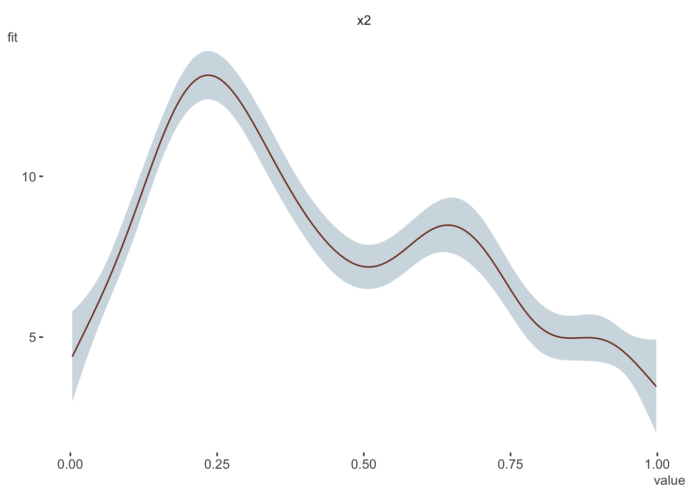

> NB: This post was revisited when updating the website early 2025, and some changes were required. Attempts to keep things consistent were made, but if you feel you’ve found an issue, please post it at [GitHub](http://github.com/m-clark/m-clark.github.io/issues). Also for this particular post, Stata is not something I’ve used in years nor have access to. So for those interested who do have access, I can only show you the code, since at the time, it wasn’t something I could save. But since I’m here, check out the fantastic marginaleffects package in R.

## Introduction

Getting predictions in R is and always has been pretty easy for the vast majority of packages providing modeling functions, as they also provide a predict method for the model objects. For those in the Stata world, they typically use `margins` for this, but when they come to R, there is no obvious option for how to go about it in the same way[^1]. Likewise, some in the R world catch a whiff of Stata’s margins and would want something similar, but may not be sure where to turn.

A little digging will reveal there are [several packages](#r-packages) that will provide the same sort of thing. In addition, there are numerous [resources](#resources) for both R and Stata for getting marginal results (i.e. predictions). However, here we note the issues that arise when models include an *offset*. Offsets are commonly used to model rates when the target variable is a count, but are used in other contexts as well. The Stata [documentation for the margins command](https://www.stata.com/manuals/rmargins.pdf) offers no specific details of how the offset/exposure is treated, and some R packages appear not to know what to do with it, or offer few options to deal with it. So even when the models are identical, marginal estimates might be different in R and Stata. Here we’ll try to sort some of this out.

## Get some data

We will use the Insurance data from the MASS package which most with R will have access to. From the helpfile:

> The data given in data frame Insurance consist of the numbers of policyholders of an insurance company who were exposed to risk, and the numbers of car insurance claims made by those policyholders.

- **District**: district of residence of policyholder (1 to 4): 4 is major cities.
- **Group**: group of car with levels \<1 litre, 1–1.5 litre, 1.5–2 litre, \>2 litre
- **Age**: the age of the insured in 4 groups labelled \<25, 25–29, 30–35, \>35
- **Holders**: number of policyholders
- **Claims**: number of claims

We do a bit of minor processing, and I save the data as a [Stata file](https://github.com/m-clark/m-clark.github.io/raw/master/data/insurance.dta) in case anyone wants to play with it in that realm.

``` r
library(tidyverse)

set.seed(123)

insurance = MASS::Insurance %>%
  rename_all(tolower) %>%
  mutate(
    # create standard rather than ordered factors for typical output
    age   = factor(age, ordered = FALSE),
    group = factor(group, ordered = FALSE),
    
    # create a numeric age covariate for later
    age_num = case_when(
      age == '<25'   ~ sample(18:25, n(), replace = T),
      age == '25-29' ~ sample(25:29, n(), replace = T),
      age == '30-35' ~ sample(30:35, n(), replace = T),
      age == '>35'   ~ sample(36:75, n(), replace = T),
    ),
    
    # for stata consistency
    ln_holders = log(holders)
  )


haven::write_dta(insurance, 'data/insurance.dta')
```

Let’s take a quick peek to get our bearings.

    $`Numeric Variables`
    # A tibble: 4 × 10
      Variable       N  Mean     SD   Min    Q1 Median     Q3     Max `% Missing`
      <chr>      <dbl> <dbl>  <dbl> <dbl> <dbl>  <dbl>  <dbl>   <dbl>       <dbl>
    1 holders       64 365.  623.     3   46.8  136    328.   3582              0
    2 claims        64  49.2  71.2    0    9.5   22     55.5   400              0
    3 age_num       64  35.2  15.8   18   25     29.5   35.5    75              0
    4 ln_holders    64   4.9   1.48   1.1  3.84   4.91   5.79    8.18           0

    $`Categorical Variables`
    # A tibble: 12 × 4
       Variable Group  Frequency   `%`
       <chr>    <fct>      <int> <dbl>
     1 district 1             16    25
     2 district 2             16    25
     3 district 3             16    25
     4 district 4             16    25
     5 group    <1l           16    25
     6 group    >2l           16    25
     7 group    1-1.5l        16    25
     8 group    1.5-2l        16    25
     9 age      <25           16    25
    10 age      >35           16    25
    11 age      25-29         16    25
    12 age      30-35         16    25

## Model

Starting out, we run a model in as simple a form as possible. I use just a standard negative binomial with a single covariate `age`, so we can clearly see how the ouptut is being produced. Note that `age` has four categories as seen above.

``` r
nb_glm_offset = MASS::glm.nb(claims ~  age + offset(ln_holders), data = insurance)

summary(nb_glm_offset)
```


    Call:
    MASS::glm.nb(formula = claims ~ age + offset(ln_holders), data = insurance, 
        init.theta = 28.40119393, link = log)

    Coefficients:
                Estimate Std. Error z value Pr(>|z|)    
    (Intercept) -1.59233    0.09071 -17.554  < 2e-16 ***
    age25-29    -0.12697    0.11743  -1.081   0.2796    
    age30-35    -0.25340    0.11558  -2.193   0.0283 *  
    age>35      -0.41940    0.10583  -3.963  7.4e-05 ***
    ---
    Signif. codes:  0 '***' 0.001 '**' 0.01 '*' 0.05 '.' 0.1 ' ' 1

    (Dispersion parameter for Negative Binomial(28.4012) family taken to be 1)

        Null deviance: 86.761  on 63  degrees of freedom
    Residual deviance: 67.602  on 60  degrees of freedom
    AIC: 444.38

    Number of Fisher Scoring iterations: 1

                  Theta:  28.40 
              Std. Err.:  9.80 

     2 x log-likelihood:  -434.385 

Now we run it with Stata. We get the same result, so this means we can’t get different predictions if we do the same thing in both R or Stata[^2].

``` stata
nbreg claims i.age, offset(ln_holders) nolog
```

## emmeans

First let’s use emmeans, a very popular package for getting *estimated marginal means*, to get the predicted counts for each age group.

``` r
library(emmeans)

emmeans(
  nb_glm_offset,
  ~ age,
  type = "response",
  offset = mean(insurance$ln_holders)  #  default
)
```

| age   | response |    SE |  df | asymp.LCL | asymp.UCL |
|:------|---------:|------:|----:|----------:|----------:|
| \<25  |   27.437 | 2.489 | Inf |    22.968 |    32.776 |
| 25-29 |   24.166 | 1.802 | Inf |    20.880 |    27.969 |
| 30-35 |   21.295 | 1.525 | Inf |    18.507 |    24.505 |
| \>35  |   18.038 | 0.983 | Inf |    16.211 |    20.072 |

How is this result obtained? It is just the prediction at each value of the covariate, with the offset held at its mean. We can duplicate this result by using the predict method and specifying a data frame with the values of interest.

``` r
nd = data.frame(
  age = levels(insurance$age),
  ln_holders = mean(insurance$ln_holders)
)

predict(
  nb_glm_offset,
  newdata = nd,
  type = 'response'
)
```

| prediction |
|-----------:|
|     27.437 |
|     24.166 |
|     21.295 |
|     18.038 |

As an explicit comparison, the intercept represents group ‘\<25’, and if we exponentiate and add the mean offset we get:

\\exp(Intercept + \overline{ln\\holders}) = e^{-1.59+4.90} = \qquad\\ 27.437

## Stata: basic margins

Now let’s look at Stata. First we want just the basic margins output.

``` stata
margins age 
```

These values, while consistent in pattern, are much different than the emmeans output, so what is going on?

### R by hand

In this model, we only have the `age` covariate and the offset, so there really isn’t much to focus on besides the latter. To replicate the Stata output in R, we will use *all* values of the offset for *every* level of `age`, and subsequently get an average prediction for each age group. First, we create a data frame for prediction using expand.grid, get the predictions for all those values, then get mean prediction per group.

``` r
predictions = 
  expand.grid(
    age        = levels(insurance$age), 
    ln_holders = insurance$ln_holders
  ) %>% 
  mutate(prediction = predict(nb_glm_offset, newdata = ., type = 'response')) %>% 
  group_by(age) %>% 
  summarise(avg_prediction = mean(prediction)) 
```

| age   | avg_prediction |
|:------|---------------:|
| \<25  |         74.257 |
| 25-29 |         65.403 |
| 30-35 |         57.635 |
| \>35  |         48.820 |

### emmeans

The emmeans doesn’t appear to allow one to provide all values of the offset, as adding additional values just applies them to each group and then recycles. In this case, it would just use the first four values of `ln_holders` for each age group respectively, which is not what we want.

``` r
emmeans(
  nb_glm_offset,
  ~ age,
  type = "response",
  offset = insurance$ln_holders
)
```

     age   response    SE  df asymp.LCL asymp.UCL
     <25       40.1  3.64 Inf      33.6      47.9
     25-29     47.3  3.53 Inf      40.9      54.8
     30-35     38.8  2.78 Inf      33.8      44.7
     >35      224.7 12.25 Inf     201.9     250.0

    Confidence level used: 0.95 
    Intervals are back-transformed from the log scale 

``` r
insurance$ln_holders[1:4]
```

    [1] 5.283204 5.575949 5.505332 7.426549

If we add the offset to the `spec` argument, it still just fixes it at the mean (and I tried variations on the spec). So at least using the standard approaches with this model does not appear to give you the same thing as Stata.

``` r
emmeans(
  nb_glm_offset,
  ~ age + offset(ln_holders),
  type = "response"
)
```

     age   ln_holders response    SE  df asymp.LCL asymp.UCL
     <25          4.9     27.4 2.489 Inf      23.0      32.8
     25-29        4.9     24.2 1.802 Inf      20.9      28.0
     30-35        4.9     21.3 1.525 Inf      18.5      24.5
     >35          4.9     18.0 0.983 Inf      16.2      20.1

    Confidence level used: 0.95 
    Intervals are back-transformed from the log scale 

Unfortunately Stata has the opposite issue. Trying to set the offset to the mean results in an error, and using `atmeans` doesn’t change the previous result.

``` stata
margins age, atmeans
margins age, at(ln_holders = 10.27)
```

### margins

The margins package explicitly attempts to duplicate Stata’s margins command, but here we can see it has an issue with the offset.

``` r
library(margins)

margins(
  nb_glm_offset,
  variables = 'age',
  type = "response"  # default
)
```

    Error in offset(ln_holders): could not find function "offset"

The offset function is part of the stats package of the base R installation, so I tried rerunning the model using `stats::offset`, but this makes the offset just like any other covariate, i.e. it did not have a fixed coefficient of 1. Changing the model to a standard `glm` class with poisson and moving the offset to the `offset` argument did work, and produces the results for the differences in predictions for each group from the reference group (`dydx` in Stata), but we’ll visit this type of result later[^3]. However, the `offset` argument is not available to glm.nb, so we’re stuck for now.

``` r
pois_glm_offset = glm(
  claims ~  age,
  data   = insurance,
  family = 'poisson',
  offset = ln_holders
)

margins(
  pois_glm_offset,
  variables = 'age',
  type = "response"  # default
)
```

     age25-29 age30-35 age>35
       -10.32   -18.46 -28.79

``` r
expand.grid(
    age        = levels(insurance$age), 
    ln_holders = insurance$ln_holders
  ) %>% 
  mutate(prediction = predict(pois_glm_offset, newdata = ., type = 'response')) %>% 
  group_by(age) %>% 
  summarise(avg_prediction = mean(prediction)) %>% 
  mutate(diff = avg_prediction - avg_prediction[1]) 
```

    # A tibble: 4 × 3
      age   avg_prediction  diff
      <fct>          <dbl> <dbl>
    1 <25             73.4   0  
    2 25-29           63.1 -10.3
    3 30-35           55.0 -18.5
    4 >35             44.7 -28.8

## Stata: over

In Stata, with categorical values we can also use the `over` approach. What do we get in this case?

``` stata
margins, over(age)
```

These are very different from our previous results for Stata, so what’s happening here?

### R by hand

This can be duplicated with the predict function as follows. While similar to the previous approach, here *only the observed values of the offset for each group are used*. We then make predictions for all values of the data and average them by group.

``` r
predictions_over = insurance %>%
  group_by(age) %>%
  group_modify(
    ~ data.frame(
        prediction = mean(
          predict(nb_glm_offset, newdata = ., type = 'response')
        )
      ),
    keep = TRUE
  ) 
```

| age   | prediction |
|:------|-----------:|
| \<25  |     14.471 |
| 25-29 |     26.162 |
| 30-35 |     29.677 |
| \>35  |    141.098 |

The pattern is actually in the opposite direction, which is unexpected, but probably just reflects the fact that we just don’t have much data. However, it’s good to note that these respective approaches would not necessarily tell you the same thing.

### emmeans

I currently don’t know of an equivalence for emmeans in this offset case, and initial searches didn’t turn up much, though it is hard to distinguish specific ‘average predictions’ from many other similar scenarios. I attempted the following, which keeps the values of `ln_holders`, but it only keeps unique ones, and it’s not reproducing what I would expect, although it implies that it is averaging over the offset values.

``` r
rg = ref_grid(nb_glm_offset, cov.keep = c('ln_holders'))

em_over = emmeans(rg, ~age, type = 'response')  

data.frame(em_over)
```

        age  response        SE  df asymp.LCL  asymp.UCL
    1   <25  7.814354 0.7088454 Inf   6.54154   9.334825
    2 25-29 17.042911 1.2709131 Inf  14.72545  19.725092
    3 30-35 20.304984 1.4542076 Inf  17.64579  23.364916
    4   >35 96.993166 5.2865742 Inf  87.16592 107.928350

### margins

The over approach for the margins package is not explicitly supported. The package author states:

> At present, margins() does not implement the over option. The reason for this is also simple: R already makes data subsetting operations quite simple using simple `[` extraction. If, for example, one wanted to calculate marginal effects on subsets of a data frame, those subsets can be passed directly to margins() via the data argument (as in a call to prediction()).

It would look something like the following, but we still have the offset problem for this negative binomial class, so I don’t show a result.

``` r
insurance %>% 
  group_by(age) %>% 
  group_map(~margins(nb_glm_offset, .), keep = TRUE) 
```

## Stata: dydx

### Categorical Covariate

Sometimes people want differences as you move from one level (e.g. the reference level) to the next for some covariate, the ‘average marginal effect’. In Stata this is obtained with the `dydx` option.

``` stata
margins, dydx(age)
```

In R, we can get this from our initial predictions that used all offset values by just taking the differences in the predicted values.

``` r
predictions %>% 
  mutate(dydx = avg_prediction - avg_prediction[1])
```

| age   | avg_prediction |    dydx |
|:------|---------------:|--------:|
| \<25  |         74.257 |   0.000 |
| 25-29 |         65.403 |  -8.854 |
| 30-35 |         57.635 | -16.622 |
| \>35  |         48.820 | -25.437 |

### Continuous predictor

Now we’ll consider a continuous covariate. Here we’ll again just focus on a simple example where we rerun the model, but with age as numeric rather than binned[^4]. For comparison we’ll set the numeric age values at roughly the midpoint of the binned categories. We can do this using the `at` option.

``` stata
margins, at(age_num = (21, 27, 32, 50))
```

Again, we can duplicate this with the basic predict function. We just predict at that value of the covariate for all values of the offset, and get the average prediction as we did before.

``` r
nb_glm_offset_cont = MASS::glm.nb(claims ~  age_num + offset(ln_holders), data = insurance)

predictions = expand.grid(
  age_num = c(21, 27, 32, 50),
  ln_holders = insurance$ln_holders
) %>% 
  mutate(pred = 
           predict(
             nb_glm_offset_cont,
             newdata = .,
             type = 'response'
           )
  ) %>% 
  group_by(age_num) %>% 
  summarise(average_prediction = mean(pred))
```

| age_num | average_prediction |
|--------:|-------------------:|
|      21 |             67.500 |
|      27 |             64.366 |
|      32 |             61.865 |
|      50 |             53.639 |

We can also get the `dydx` for the continuous covariate, which is the derivative of the target with respect to the covariate. In linear models, this is just the regression coefficient, but here we have to do things a little differently.

``` stata
margins, dydx(age_num)
```

As noted for the categorical case, this value is the *average marginal effect*. As the Stata reference describes:

> It is not necessarily true that dydx() = 0.5 means that “y increases by 0.5 if x increases by 1”. It is true that “y increases with x at a rate such that, if the rate were constant, y would increase by 0.5 if x increased by 1”

This qualified interpretation may not be of much value in contexts where the rate is not constant, but we can still see what Stata is doing.

### R by hand

For `dydx`, when it comes to continuous covariates, there isn’t an obvious change in the covariate to use (i.e. the `dx`) to evaluate at each point, as is the case with categorical variables, which can use a reference group. So what we do is use a small arbitrary difference (\\\epsilon\\) for the covariate at its observed values, get the predictions for the values above and below the observed value, and then average those differences in predicted values. For comparison to Stata, I set \\\epsilon\\ to the value used by the `margins` command. Note that we are only using the observed values for the offset.

``` r
h = function(x, epsilon = 1e-5) max(abs(x), 1) * sqrt(epsilon)

age_dx_plus = insurance %>% 
  select(age_num, ln_holders) %>% 
  mutate(age_num = age_num + h(age_num))

age_dx_minus = insurance %>% 
  select(age_num, ln_holders) %>% 
  mutate(age_num = age_num - h(age_num))

predictions_dydx = 
  tibble(
    dy = 
      predict(nb_glm_offset_cont, age_dx_plus,  type = 'response') -
      predict(nb_glm_offset_cont, age_dx_minus, type = 'response'), 
    dx   = age_dx_plus$age_num - age_dx_minus$age_num,
    dydx = dy/dx
  )

# summarise(predictions_dydx, ame = mean(dydx))
```

|      ame |
|---------:|
| -0.42552 |

So we just get predictions for a small difference in age for each value of age, and average that difference in predictions.

### emmeans

The emmeans package is primarily geared toward factor variables, but does have support for numeric variables interacting with factors. However, this isn’t what we’re really looking for here.

### margins

We can however use the margins package for this, and it provides the same result as before. For whatever reason, it doesn’t have an issue with the offset if we use the lower level dydx function.

``` r
dydx(
  insurance,
  nb_glm_offset_cont,
  variable = 'age_num',
  eps = 1e-5
) %>%
  summarise(ame = mean(dydx_age_num))
```

|      ame |
|---------:|
| -0.42552 |

For more on the `dydx` case for continuous variables in general, see the resources.

## Other complications

Obviously models will have more than one covariate, and in the particular case that was brought to my attention, there were also random effects. I may explore more in the future, but the general result should hold in those circumstances. As a quick example[^5], we can get the same age results for both, by getting the age group predictions with all values of the dataset (not just the offset).

``` r
nb_glm_offset_full = MASS::glm.nb(
  claims ~  age + group + district + offset(ln_holders), 
  data = insurance
)

summary(nb_glm_offset_full)
```


    Call:
    MASS::glm.nb(formula = claims ~ age + group + district + offset(ln_holders), 
        data = insurance, init.theta = 449932.7775, link = log)

    Coefficients:
                Estimate Std. Error z value Pr(>|z|)    
    (Intercept) -1.82174    0.07679 -23.723  < 2e-16 ***
    age25-29    -0.19101    0.08286  -2.305 0.021155 *  
    age30-35    -0.34495    0.08138  -4.239 2.25e-05 ***
    age>35      -0.53667    0.06996  -7.671 1.70e-14 ***
    group1-1.5l  0.16133    0.05054   3.192 0.001412 ** 
    group1.5-2l  0.39281    0.05500   7.142 9.23e-13 ***
    group>2l     0.56341    0.07232   7.791 6.67e-15 ***
    district2    0.02587    0.04302   0.601 0.547637    
    district3    0.03853    0.05052   0.763 0.445686    
    district4    0.23421    0.06168   3.797 0.000146 ***
    ---
    Signif. codes:  0 '***' 0.001 '**' 0.01 '*' 0.05 '.' 0.1 ' ' 1

    (Dispersion parameter for Negative Binomial(449932.8) family taken to be 1)

        Null deviance: 236.212  on 63  degrees of freedom
    Residual deviance:  51.416  on 54  degrees of freedom
    AIC: 390.74

    Number of Fisher Scoring iterations: 1

                  Theta:  449933 
              Std. Err.:  4185437 
    Warning while fitting theta: iteration limit reached 

     2 x log-likelihood:  -368.745 

``` stata
nbreg claims i.age i.group i.district, offset(ln_holders) nolog
margins age
```

To do this with predict, we make predictions for all observed values as if they were at each level of age. Then we average them for each age group, just like we did before.

``` r
predictions_full_model =  
  map_df(1:4, function(i) mutate(insurance, age = levels(age)[i])) %>% 
  mutate(
    age = factor(age, levels(insurance$age)),   # convert back to factor
    prediction = predict(nb_glm_offset_full, newdata = ., type = 'response')
  )  %>% 
  group_by(age) %>% 
  summarise(avg_prediction = mean(prediction)) 
```

| age   | avg_prediction |
|:------|---------------:|
| \<25  |         76.397 |
| 25-29 |         63.113 |
| 30-35 |         54.109 |
| \>35  |         44.669 |

## R Packages

To summarize R’s capabilities with Stata-like margins with models using an offset, we have a few options we can note. First, we can get the values using the predict method. Then there are the packages to help with getting these types of predictions. margins explicitly attempts to replicate Stata-like margins for standard and some more complex models, but there doesn’t appear to be documentation on how the offset is dealt with by default. Furthermore, care must be taken if it isn’t an explicitly supported model. As we have also seen, emmeans provides many predictions of the sort discussed here, supports many more models, produces results in a nice format, and has plotting capabilities. However, it’s mostly suited toward factor variables.

Beyond those, ggeffects uses predict and emmeans under the hood, so offers a nice way to do the same sorts of things, but with a more viable plot as a result. Other packages and functions are available for specific settings. For example, conditional_effects in the brms package provides predictions and visualization for the bayesian setting.

## Summary

Hopefully this will clarify the discrepancies between R and Stata with models using an offset. Honestly, I pretty much always use the predict function with my specified data values because I know what it’s doing and I can understand the results without hesitation regardless of model or package used. Furthermore, if one knows their data at all, it should be possible to specify covariate values that are meaningful pretty easily. On the other hand, getting predictions at averages can cause conceptual issues with categorical variables in many settings, and getting *average* effects often also can be hard to interpret (e.g. nonlinear relationships).

One thing you don’t get with some of the averaged predictions using the predict function are interval estimates, but this could be obtained via bootstrapping. Otherwise, most predict methods provide the standard error for a prediction with an additional argument (e.g. `se.fit = TRUE`), so if you getting predictions at key values of the variables it is trivial to get the interval estimate. In general, most R packages are just using predict under the hood, so being familiar with it will likely get you what you need on its own.

## Resources

### Reference

[Stata reference for margins](https://www.stata.com/manuals/rmargins.pdf)

[emmeans](https://cran.r-project.org/web/packages/emmeans/index.html)

[margins](https://cloud.r-project.org/web/packages/margins/vignettes/Introduction.html)

[ggeffects](https://strengejacke.github.io/ggeffects)

### Notes

[Marginal Effects- Rich Williams notes- 1](https://www3.nd.edu/~rwilliam/stats3/Margins01.pdf)

[Marginal Effects- Rich Williams notes- 2](https://www3.nd.edu/~rwilliam/stats3/Margins02.pdf)

[Marginal Effects- Rich Williams notes- 3](https://www3.nd.edu/~rwilliam/stats3/Margins03.pdf)

[Marginal Effects Stata Article by Rich Williams](https://www.stata-journal.com/article.html?article=st0260)

[Josh Errickson’s comparisons of Stata, emmeans, and ggeffects](https://errickson.net/marginsnotes/)

[UCLA IDRE FAQ (Margins command section)](https://stats.idre.ucla.edu/stata/faq/)

[Stata FAQ (based on old mfx command)](https://www.stata.com/support/faqs/statistics/marginal-effects-after-offset/)

## Appendix

Just for giggles, I did an average marginal effect for a GAM, though I find little utility in it for the relationship shown. Confirmed via gratia and margins.

``` r
library(mgcv)
set.seed(2)
dat <- gamSim(1, n = 400, dist = "normal", scale = 2)
```

    Gu & Wahba 4 term additive model

``` r
b <- gam(y ~ s(x2), data = dat)

visibly::plot_gam(b)
```



``` r
# set change step
h = 1e-5

b_dx_plus = dat %>% 
  select(x2) %>% 
  mutate(x2 = x2 + h)

b_dx_minus = dat %>% 
  select(x2) %>% 
  mutate(x2 = x2 - h)

predictions_dydx = 
  tibble(
    x2 = dat$x2,
    dy = 
      predict(b, b_dx_plus,  type = 'response') -
      predict(b, b_dx_minus, type = 'response'), 
    dx   = b_dx_plus$x2 - b_dx_minus$x2,
    dydx = dy/dx
  ) 

gratia_result  = gratia::derivatives(b, newdata = dat, eps = h)
margins_result = margins::dydx(dat, b, variable = 'x2', eps = h^2)  # note that margins uses the h function specified previously

all.equal(as.numeric(predictions_dydx$dydx), gratia_result$derivative)
```

    [1] "names for current but not for target" 
    [2] "Mean relative difference: 5.59627e-05"

``` r
all.equal(as.numeric(predictions_dydx$dydx), as.numeric(margins_result$dydx_x2))
```

    [1] TRUE

``` r
summarise(
  predictions_dydx, 
  ame = mean(dydx), 
  ame_gratia = mean(gratia_result$derivative),
  ame_margins = mean(margins_result$dydx_x2)
) 
```

    # A tibble: 1 × 3
        ame ame_gratia ame_margins
      <dbl>      <dbl>       <dbl>
    1  1.76       1.76        1.76

## Footnotes

## Reuse

[CC BY-SA 4.0](https://creativecommons.org/licenses/by-sa/4.0/)

## Citation

BibTeX citation:

``` quarto-appendix-bibtex
@online{clark2020,
  author = {Clark, Michael},
  title = {Predictions with an Offset},
  date = {2020-06-16},
  url = {https://m-clark.github.io/posts/2020-06-15-predict-with-offset/},
  langid = {en}
}
```

For attribution, please cite this work as:

Clark, Michael. 2020. “Predictions with an Offset.” June 16. <https://m-clark.github.io/posts/2020-06-15-predict-with-offset/>.

[^1]: Not the least of which is that most outside of econometrics don’t call predictions *margins*, since these days we aren’t adding results to the margin of a hand-written table.

[^2]: For those in the R world, the `i.age` tells Stata to treat the age factor as, well, a factor. Stata’s `alpha` is 1/`theta` from R’s output.

[^3]: The margins package does do predictions rather than the marginal effects, but it, like others, is just a wrapper for the predict method, and doesn’t appear to average them, so I don’t demonstrate that.

[^4]: There is rarely a justifiable reason to discretize age as near as I can tell, and doing so inevitably results in less satisfying and less reliable conclusions.

[^5]: There is a weird print issue where the Stata output isn’t showing the coefficient for one of the levels of `group`, but the model is correct and was verified directly using Stata.
