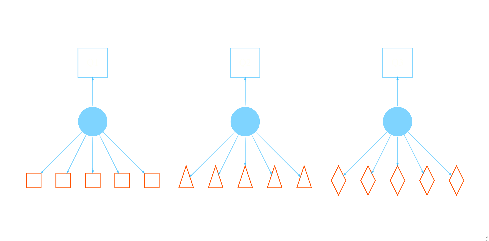
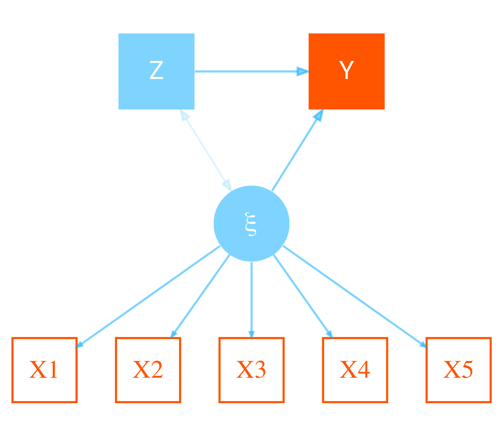

> NB: This post was revisited when updating the website early 2025, and some changes were required. Attempts to keep things consistent were made, but if you feel you’ve found an issue, please post it at [GitHub](http://github.com/m-clark/m-clark.github.io/issues).



## Introduction

Every once in a while, it comes up that someone has clustered data, with covariates that vary at different levels, and where mixed models or similar would normally be implemented, but in which the target variable only varies at the cluster level (or ‘group’ level- I will use the terms interchangeably). Though the outcome is at the cluster level, the individual may still want to use information from lower-level/within-cluster variables. Such situations are generically referred to as *micro-macro* models, to distinguish between the standard setting where the target varies at the lower level (which does not require a special name). An example might be using team member traits to predict team level scores. While conceptually one wants to use all available information in a model, normally we just run a model at the cluster (team) level using summaries of variables that would otherwise vary within the cluster, for example, using mean scores or proportions. Not only is it natural, it makes conceptual sense, and as such it is the default approach. Alternatives include using the within cluster variables as predictors, but this wouldn’t be applicable except in balanced settings where they would represent the same thing for each group, and even in the balanced settings collinearity might be a notable issue. So how would we deal with this?

#### Prequsites

For the following you should have familiarity with mixed/multilevel models, and it would help to have an understanding of factor analysis and structural equation modeling.

## Predicting Group-Level Outcomes

Croon and van Veldhoven Croon and Veldhoven ([2007](#ref-croon2007predicting)) (CV) present a group-level regression model (e.g. a basic linear model) as follows.

\\y_g = \beta_0 + \xi_g\beta_1 + Z_g\beta_2 + \epsilon_g\\

In this depiction, \\y_g\\ is the group level target variable, the \\Z_g\\ represent the typical observed group-level covariates and corresponding coefficients (\\\beta_2\\). If this were the entirety of the model, there would be no ‘levels’ to consider and we could use a standard model, say OLS regression. In the case we are interested in, some variables vary within these clusters, while others do not. Again, normally we might do a mixed model, but remember, \\y_g\\ only varies at the group level, so that won’t really work.

In this setting then, \\\xi_g\\ represents an aggregated effect of the lower level variables. In standard practice it would just be the calculated mean, proportion, or some other metric with values for each cluster. In the CV depiction however, it is a *latent* (or perhaps several) latent variables and their corresponding effects \\\beta_1\\.

If we assume a single \\\xi_g\\ variable, the model for the underlying within-cluster variables is the standard latent variable model, a.k.a factor analysis. With an observed multivariate \\x\\, e.g. repeated observations of some measure for an individual or, as before, team member scores, we have the [latent linear model](https://m-clark.github.io/docs/FA_notes.html) as follows:

\\\textbf{x}\_{ig} = \xi_g\lambda + v\_{ig}\\

where \\x\_{ig}\\ are the (possibly repeated) observations \\i\\ for a group/individual \\g\\, \\\lambda\\ are the factor loadings and variances are constant. We can now see the full model as a structural equation model as follows for a situation with five observations per group.



## Issues with Aggregate Approaches

CV suggest that simple aggregation, e.g. using a group mean, will result in problems, specifically biased estimates. They simulate data that varies the number of groups/clusters, the number of observations within groups, the intraclass correlation of observations within a group. In most of the cases they explore, the bias for the aggregate mean effect is notable, and there is sometimes small bias for the group level covariates, if they are collinear with the aggregate covariate. We will duplicate this approach later.

An approach to adjusting the group mean is offered by CV, with the structural model implied. These adjusted group means, or in their parlance, best linear unbiased predictors (BLUPs), result in a bias-free result. The notion of a BLUP will be familiar to those who use mixed models, as that is what the random effects are for a standard linear mixed model. As such, later on we’ll take a look at using a mixed model as a possible solution. In any case, once the adjusted means are calculated, you can then run your standard regression with the bias mostly eliminated.

## Issues with Adjustment

It turns out the the weighting calculation proffered by CV is somewhat complicated, not easily implemented, and rarely used. Foster-Johnson & Kromrey Foster-Johnson and Kromrey ([2018](#ref-foster2018predicting)) (FJK) looked further into its utility, as well as other possible solutions that might be easier to implement. As far as type I error rate goes, FJK demonstrated that using the CV adjusted group means offers no advantage over unadjusted, and even showed less statistical power. They suggested that a standard correction for heteroscedasticity (White’s) might be enough. In applying corrected standard errors for both unadjusted and adjusted group means, FJK found there to be additional power for both approaches, but if anything still favored the standard group mean. What’s more, while the bias remained, there was actually notable variability in the adjusted mean results. FJK’s final recommendation was to use the usual group means with robust standard errors, easily implemented in any statistical package.

I will add that the adjustment still uses an underlying factor model of equal loadings and variances across the observations. For notably reliable scales this might be reasonable, but it isn’t a necessity. In repeated measures settings for example, we might see decreased variability across time, or practice effects, which might make the assumption more tenuous.

## My Perspective

My first glance at the issue raised by CV immediately called to mind the standard measurement model typically employed for factor analysis, i.e. a latent linear model. So my interpretation was that we are simply talking about a well known fact in measurement: that reliability of the measure is key in using a mean or sum score, and decreased reliability attenuates the correlation among the variables in question. I even did [a simulation demonstrating the problem](https://m-clark.github.io/docs/lv_sim.html) a while back. So in this case, I’m interested in the issue from a reliability perspective.

It turns out that factor models and mixed models share a lot in common. Those familiar with *growth curve models* know that they are equivalent to mixed models, but the comparison is a more general one of random effects methods. To demonstrate the equivalence, I’ll use a cleaned up version of the [Big 5](https://en.wikipedia.org/wiki/Big_Five_personality_traits) data in the psych package. Specifically, we’ll use the five items that belong to the Agreeableness measure.

First we make the data in both wide and long. The former makes it amenable to factor analysis, while the latter is what we need for a mixed model.

``` r
# data prep for long and wide format

agree_df = noiris::big_five %>% 
  select(A1:A5) %>% 
  drop_na()

agree_long = agree_df %>% 
  mutate(id = factor(row_number())) %>% 
  pivot_longer(-id, names_to = 'variable', values_to = 'value')
```

The standard factor model will have to be constrained to have equal loadings and item variances. In addition, we’ll estimate the intercepts, but otherwise this is your basic factor analysis.

``` r
 # or use growth() to save some of the model tedium
cfa_model_agree = "
  agree =~ a*A1 + a*A2 + a*A3 + a*A4 + a*A5
  
  A1 ~~ var*A1
  A2 ~~ var*A2
  A3 ~~ var*A3
  A4 ~~ var*A4
  A5 ~~ var*A5
"

library(lavaan)

cfa_fit_agree = cfa(cfa_model_agree, data = agree_df, meanstructure = T) 

summary(cfa_fit_agree)
```

    lavaan 0.6.17 ended normally after 11 iterations

      Estimator                                         ML
      Optimization method                           NLMINB
      Number of model parameters                        11
      Number of equality constraints                     4

      Number of observations                          2709

    Model Test User Model:
                                                          
      Test statistic                               744.709
      Degrees of freedom                                13
      P-value (Chi-square)                           0.000

    Parameter Estimates:

      Standard errors                             Standard
      Information                                 Expected
      Information saturated (h1) model          Structured

    Latent Variables:
                       Estimate  Std.Err  z-value  P(>|z|)
      agree =~                                            
        A1         (a)    1.000                           
        A2         (a)    1.000                           
        A3         (a)    1.000                           
        A4         (a)    1.000                           
        A5         (a)    1.000                           

    Intercepts:
                       Estimate  Std.Err  z-value  P(>|z|)
       .A1               -2.412    0.026  -94.340    0.000
       .A2                4.797    0.026  187.611    0.000
       .A3                4.599    0.026  179.859    0.000
       .A4                4.682    0.026  183.107    0.000
       .A5                4.551    0.026  177.982    0.000

    Variances:
                       Estimate  Std.Err  z-value  P(>|z|)
       .A1       (var)    1.201    0.016   73.607    0.000
       .A2       (var)    1.201    0.016   73.607    0.000
       .A3       (var)    1.201    0.016   73.607    0.000
       .A4       (var)    1.201    0.016   73.607    0.000
       .A5       (var)    1.201    0.016   73.607    0.000
        agree             0.571    0.022   25.621    0.000

When we run the mixed model, we get the same variance and intercept estimates.

``` r
library(lme4)
```

    Loading required package: Matrix


    Attaching package: 'Matrix'

    The following objects are masked from 'package:tidyr':

        expand, pack, unpack

``` r
library(mixedup) # for post-processing

mixed_fit = lmer(value ~ -1 + variable + (1 |id), data = agree_long,  REML = FALSE)
summarise_model(mixed_fit, digits = 3)
```

    Computing profile confidence intervals ...


    Variance Components:

        Group    Effect Variance    SD SD_2.5 SD_97.5 Var_prop
           id Intercept    0.571 0.755  0.727   0.785    0.322
     Residual        NA    1.201 1.096  1.081   1.111    0.678


    Fixed Effects:

           Term  Value    SE       t P_value Lower_2.5 Upper_97.5
     variableA1 -2.412 0.026 -94.340   0.000    -2.462     -2.362
     variableA2  4.797 0.026 187.611   0.000     4.747      4.847
     variableA3  4.599 0.026 179.859   0.000     4.549      4.649
     variableA4  4.682 0.026 183.107   0.000     4.632      4.732
     variableA5  4.551 0.026 177.982   0.000     4.501      4.601

We can also see that the estimated factor scores agree with the estimated random effects.

| index | Estimated.Factor.Scores | Estimated.Random.Effects |
|------:|------------------------:|-------------------------:|
|     1 |                  -0.453 |                   -0.453 |
|     2 |                  -0.312 |                   -0.312 |
|     3 |                  -0.594 |                   -0.594 |
|     4 |                  -0.031 |                   -0.031 |
|     5 |                  -0.453 |                   -0.453 |
|     6 |                  -0.031 |                   -0.031 |
|  2704 |                  -0.453 |                   -0.453 |
|  2705 |                  -1.720 |                   -1.720 |
|  2706 |                  -0.312 |                   -0.312 |
|  2707 |                  -0.453 |                   -0.453 |
|  2708 |                  -1.297 |                   -1.297 |
|  2709 |                  -1.157 |                   -1.157 |

Usually when the term BLUP comes up it is in reference to the random effects estimated from a linear mixed model. As such, I thought it might be interesting to see how a mixed or factor model might be used to deal with the bias. I also thought it was a bit odd that neither CV nor FJK actually conduct the implied SEM (but see the paper co-authored by the lavaan package author Devlieger et al. ([2016](#ref-devlieger2016hypothesis))), so I wanted to look at that too.

## Model Setup

For our demonstration, I will create some data as CV did and run a variety of models to see what we get. My focus is on bias, not coverage or power, as I think FJK covered those aspects plenty. The models in particular are:

- **Standard linear model**: a basic group level analysis using unadjusted means.
- **Random effects**: a group level model using estimated factor scores using lavaan, or the BLUPs from lme4, or those with heterogeneous variance via glmmTMB[^1]. These involved a two-step approach, with the factor/mixed model followed by the standard linear model.
- **Structural equation model**: A full, single-step SEM via lavaan. This model has the ability to account for the correlation of the Z and latent variable. It is exactly as CV depict in their Figure 1 and Figure @ref(fig:sem-plot) above.
- **Adjusted means**: Use CV’s approach

## Data Setup

I made a function[^2] to create data with the values shown in CV (p. 52) for a single aggregate \\X\\ and single group-level covariate \\Z\\. Using their notation, the model that generates the data is the following:

\\y_g = .3 + .3Z_g + .3\xi_g + \epsilon_g\\ \\x\_{ig} = \xi + \nu_g\\

As there, \\\sigma^2\_\epsilon\\ is .35. While they look at a variety of situations, I’ll just consider a single scenario for our purposes, where the correlation of the \\Z\\ and \\\xi\\ was .3, the intraclass correlation of the observed \\x\_{ig}\\ was .1 (i.e. \\\sigma^2\_\nu\\ = 9), the number of groups was 100 and the number of observations per group was balanced at 10 (row 16 of their table 1). I simulated 1000 such data sets so that we could examine the mean value of the estimated coefficients. I first started by analyzing the result with a factor analysis, and if there are any problems such as negative variances or lack of convergence, the data is regenerated, as that will also help with any issues the mixed model would have. So the final 1000 data sets don’t have convergence issues or other problems that might make the results a little wonky.

## Results

Here are the results. We can first take a peek at the estimated scores from the two-step approaches. The CV adjustment appears closely matched to the true score at first, but we see it’s range is very wild, which is what FJK found also. Interestingly, the BLUPs from the mixed models have less variance than the true scores. The factor score is in keeping with the BLUPs, but appears also to have notable extremes, but far less than the CV adjustment. We’ll talk about why these extremes may arise later.

| Variable          |     N | Mean |   SD |    Min |    Q1 | Median |   Q3 |   Max | % Missing |
|:------------------|------:|-----:|-----:|-------:|------:|-------:|-----:|------:|----------:|
| True              | 1e+05 | 0.01 | 1.00 |  -4.31 | -0.67 |      0 | 0.68 |  4.44 |         0 |
| CV Adj            | 1e+05 | 0.01 | 1.07 | -22.97 | -0.65 |      0 | 0.66 | 25.64 |         0 |
| Unadjusted        | 1e+05 | 0.00 | 1.39 |  -6.32 | -0.93 |      0 | 0.94 |  6.96 |         0 |
| BLUP_mixed        | 1e+05 | 0.00 | 0.74 |  -4.20 | -0.48 |      0 | 0.48 |  3.98 |         0 |
| BLUP_mixed_hetvar | 1e+05 | 0.00 | 0.74 |  -4.18 | -0.48 |      0 | 0.47 |  3.97 |         0 |
| Factor Score      | 1e+05 | 0.00 | 0.87 |  -7.29 | -0.47 |      0 | 0.46 |  6.54 |         0 |

Estimated scores {.table .caption-top .table-sm .table-striped .small}

Now let’s look at the bias in the estimates.

| Model             | Intercept |      Z |       X |
|:------------------|----------:|-------:|--------:|
| Unadjusted        |     0.149 | 14.494 | -49.877 |
| BLUP_mixed        |     0.051 | 14.494 |  -1.828 |
| BLUP_mixed_hetvar |     0.053 | 14.647 |  -1.673 |
| Factor Score      |     0.063 | 16.502 |  11.968 |
| CV Adj            |    -0.663 | -2.368 |   7.992 |
| SEM               |    -0.017 | -1.777 |   4.744 |
| True              |    -0.567 | -0.380 |   0.513 |

Percent bias {.table .caption-top .table-sm .table-striped .small}

The results suggest a couple things. First, the results of CV were duplicated for the unadjusted setting, where the group level covariate has a slight bias upward, but the aggregate is severely downwardly biased[^3]. We can also see that a two-step approach using BLUPs from a mixed model (with or without heterogeneous variances), or factor scores, either eliminate or notably reduce the bias for the aggregate score, but still have issue with the group level covariate. This is because of the correlation between the group level and lower level covariates, which if zero, would result in no bias, and has long been a known issue with mixed models. The factor scores had some very wild results at times, even after overcoming basic inadmissible results. In the end, we see that the calculated adjustment and SEM both essentially eliminate the bias by practical standards. It is worth noting that the bias for either the factor analysis or SEM would be completely eliminated if the model adds a regression of the latent variable onto the group level covariate \\Z\\.

Note that in practice, a two-step approach, such as using the mixed model BLUPs or factor scores, comes with the same issue of using an estimate rather than observed score that we have using the mean. Even if there is no bias, the estimated uncertainty would be optimistic as it doesn’t take into account the estimation process. This uncertainty decreases with the number of observations per group (or number of items from the factor analytic perspective), but would technically need to be dealt with, e.g. using ‘factor score regression’ Devlieger et al. ([2016](#ref-devlieger2016hypothesis)) or more simply, just doing the SEM.

## Reliability

Interestingly, if we look at the reliability of the measure, we shouldn’t be surprised at the results. Reliability may be thought of as the amount of variance in an observed score that is true score variance Revelle and Condon ([2019](#ref-revelle2019reliability)). Since the underlying construct is assumed unidimensional, we can examine something like coefficient \\\alpha\\, which gives a sense of how reliable the mean or total score would be. Doing so reveals a fairly poor measure for 10 observations per group under the CV settings. The mean coefficient \\\alpha\\ is 0.52, the max of which is 0.74, which, from a measurement model perspective, would be unacceptable[^4]. This is all to say that we have rediscovered attenuation in correlation due to (lack of) reliability, something [addressed by Spearman over a century ago](https://en.wikipedia.org/wiki/Correction_for_attenuation)[^5].

In actual repeated measures, or with constructed scales, it’s probably unlikely we would have this poor of a measure. Indeed, if we think a mean is appropriate in the first place, we are probably assuming that the scores are something that can be meaningfully combined in the first place, because if a latent construct doesn’t actually explain the observations well, then what is the point of estimating it?

In our current context, we can create a more reliable measure by decreasing the variance value for \\\sigma^2\_\nu\\ which is the residual variance for the observed items at the lower level. Decreasing it from 9 to 1, puts the observed scores in a notably better place (\\\alpha\\ = 0.91), and if we actually have a reliable measure (or even just increase the number of observations per group, as noted by CV), the results show hardly any bias for the group level effect and a near negligible one for the mean effect.

| Model      | Intercept |     Z |      X |
|:-----------|----------:|------:|-------:|
| Unadjusted |    -0.011 | 2.698 | -9.651 |

Percent bias {.table .caption-top .table-sm .table-striped .small}

## Summary

In the end we relearn a valuable, but very old lesson. The take home story here, at least to me, is to have a reliable measure and/or get more observations per group if you can, which would be the same advice for any clustered data situation. If you do have a reliable measure, such as a proportion of simple counts, or a known scale with good properties, using the mean should not give you too much pause. As a precaution, you might go ahead and use White’s correction as suggested by FJK. If you have enough data and the model isn’t overly complicated, consider doing the SEM.

last updated: 2025-01-02

## References

Croon, Marcel A, and Marc JPM van Veldhoven. 2007. “Predicting Group-Level Outcome Variables from Variables Measured at the Individual Level: A Latent Variable Multilevel Model.” *Psychological Methods* 12 (1): 45.

Devlieger, Ines, Axel Mayer, and Yves Rosseel. 2016. “Hypothesis Testing Using Factor Score Regression: A Comparison of Four Methods.” *Educational and Psychological Measurement* 76 (5): 741–70.

Foster-Johnson, Lynn, and Jeffrey D Kromrey. 2018. “Predicting Group-Level Outcome Variables: An Empirical Comparison of Analysis Strategies.” *Behavior Research Methods* 50 (6): 2461–79.

Revelle, William, and David M Condon. 2019. “Reliability from \\\alpha\\ to \\\omega\\: A Tutorial.” *Psychological Assessment* 31 (12): 1395.

## Footnotes

## Reuse

[CC BY-SA 4.0](https://creativecommons.org/licenses/by-sa/4.0/)

## Citation

BibTeX citation:

``` quarto-appendix-bibtex
@online{clark2020,
  author = {Clark, Michael},
  title = {Micro-Macro Models},
  date = {2020-08-31},
  url = {https://m-clark.github.io/posts/2020-08-31-micro-macro-mlm/},
  langid = {en}
}
```

For attribution, please cite this work as:

Clark, Michael. 2020. “Micro-Macro Models.” August 31. <https://m-clark.github.io/posts/2020-08-31-micro-macro-mlm/>.

[^1]: I wasn’t sure in the mixed model whether to include the item and or group level Z as fixed effects. Results did not change much, so I went with a mixed model with no fixed effects to make them closer to the scale of the mean scores.

[^2]: All code is contained within the [R markdown file](https://github.com/m-clark/m-clark.github.io/blob/master/_posts/2020-08-31-micro-macro-mlm/micro-macro.Rmd) that produced this post.

[^3]: For those who may not have access to the article, the values for percentage bias in CV were as follows: for the unadjusted model, the bias for the coefficients under these conditions was 0.6, 15.3, -50.4, and for the adjusted model, -1.1, -1.3, 5.0.

[^4]: A typical cutoff for coefficient \\\alpha\\ for a good measure is .8. We can actually use a ‘G-theory’ approach and calculate this by hand \\\frac{1}{1+9/10}\\, where 1 is the variance CV fixed for the true score, and 9 is residual variance. \\\frac{1}{1+9}\\ is the \\\rho_x\\, i.e. intraclass correlation, that they have in Table 1. In the better scenario \\\rho_x\\ = \\\frac{1}{1+4}\\ = .2 and the reliability is \\\frac{1}{1+4/10}\\ = .71, which is notably better, though still substandard. Even then we can see from their table dramatic decreases in bias from that improvement in reliability.

[^5]: The lack of reliability is likely the culprit behind the wider range in the estimated factor scores as well.
