> NB: This post was revisited when updating the website early 2025, and some changes were required. Attempts to keep things consistent were made, but if you feel you’ve found an issue, please post it at [GitHub](http://github.com/m-clark/m-clark.github.io/issues).

# Overview

In [Part I](https://m-clark.github.io/posts/2021-02-28-practical-bayes-part-i/), we talked about the basics one can do to run a Bayesian model with a high-level Stan package like brms, and what to do if there is a problem. But it might be nice if we could take steps to avoid the problems in the first place, and what’s more, our model might still be inadequate without any warnings, and we’ll still need to inspect diagnostics regardless. So let’s engage in some better practices you can use every time to help things run more smoothly, and get more from your models after you’ve run them.

This is part two of two posts on doing practical modeling with R and Stan in an applied fashion. Due to unforeseen circumstances (and plenty of procrastination), the bulk of the content of these posts was created many months before actual posting. It’s hoped that most of this will still be applicable and have the conceptual continuity as originally intended, but apologies in advance if some parts seem a little disjointed, off topic, etc.

## Outline for Better Bayesian Analysis

We’ll cover the following steps in more detail, but here is a general outline.

- First generate ‘fake data’ to assess viability of our priors
- With adequate priors, start with a simple, but plausible model
- For simple models you likely do not need many iterations, and for debugging/troubleshooting, starting with few iterations can possibly give you a sense of whether there will be problems[^1]. If you are doing standard GLM or simpler versions of common extensions, even the defaults are likely overkill. For example, a basic linear regression should converge almost immediately.
- If you have problems at this point, see [Part I](https://m-clark.github.io/posts/2021-02-28-practical-bayes-part-i/)

&nbsp;

- Explore and Visualize the Model Results
  - Visualize covariate relationships
  - Assess model effectiveness
    - Use posterior predictive checks
    - Other avenues
- Prediction and Model Comparisons
  - Get basic predictions for observations of interest
  - Explore a more viable model
    - Add interactions
    - Add nonlinear relations
    - Account for other structure (e.g. random effects)
  - Compare and/or average models
  - Use cross-validation to better assess performance

We’ll now demonstrate these steps.

# Example data

[As in Part I](https://m-clark.github.io/posts/2021-02-28-practical-bayes-part-i/), I’m going to create some data for us to run some basic models with, the same as Part I. As a reminder, the true underlying model has categorical and continuous covariates, interactions, nonlinear relationships, random effects (observations are clustered in groups), and some variables are collinear.

For our purposes so we’ll create a data frame with the total sample size of 1000.

``` r
# create the primary data frame

main_df = 
  create_data(N = 1000) %>% 
  as_tibble() %>% 
  select(group, b1:x3, y) %>% 
  mutate(
    b1 = factor(b1),   # will help with visuals
    b2 = factor(b2)
  )
```

# Simulate from priors

A good initial step in Bayesian analysis is to think about and produce some viable priors for the parameters. But the obvious question is, what priors should we choose? Thankfully, for standard models there is not much guesswork involved. Bayesian analysis has been around a long time, so the bulk of the work in determining suitable priors for standard models has been done for you. Even default settings should not affect things much, especially for rstanarm, which has some basic defaults that are informed by the data. However, due to the flexibility of the brms modeling functions, some priors are unspecified and left ‘flat’ (i.e. uniform), which is something we definitely don’t want. And even defaults could still cause problems for more complex situations. So how might we choose better ones?

The basic idea here is to generate parameters (e.g. regression coefficients) based on their corresponding prior distributions, predict data based on those prior draws, and then compare the predictions to our observed target variable that we are attempting to understand.

Thankfully, the brms package makes this very easy to do. We will check the following types of priors, that range from default settings to increasing specification for all parameters of interest.

We can use pp_check to examine the prior-generated data versus the observed target `y`, but I wait to show them all together at the end. Note the argument `sample_prior`, which we set to `'only'`.

``` r
library(brms)

# essentially the same as the defaults
pr_uniform = prior(uniform(-100, 100), lb = -100, ub = 100, 'b')

model_default_prior = brm(
  y ~ b1 + b2 + x1 + x2 + x3, 
  data = main_df,
  iter = 1000,
  sample_prior = 'only',
  prior = pr_uniform
)

# pp_check(model_default_prior, ndraws = 50)

# diffuse normal for reg coefficients 'b'
pr_norm_b_0_10 = prior(normal(0, 10), 'b')

model_0_norm_b_0_10 = brm(
  y ~ b1 + b2 + x1 + x2 + x3, 
  data = main_df,
  iter = 1000,
  sample_prior = 'only',
  prior = pr_norm_b_0_10
)

# pp_check(model_0_norm_b_0_10, ndraws = 50)

# rstanarm-like prior
pr_auto = sjstats::auto_prior(
  y ~ b1 + b2 + x1 + x2 + x3,
  data = main_df,
  gaussian = TRUE
)

model_auto_prior = brm(
  y ~ b1 + b2 + x1 + x2 + x3, 
  data = main_df,
  iter = 1000,
  sample_prior = 'only',
  prior = pr_auto
)

# pp_check(model_auto_prior, ndraws = 50)

# Since we have standardized data, Normal(0, 1) is reasonable for reg coefs
pr_norm_b_0_1 = prior(normal(0, 1), 'b')

model_0_norm_b_0_1 = brm(
  y ~ b1 + b2 + x1 + x2 + x3, 
  data = main_df,
  iter = 1000,
  sample_prior = 'only',
  prior = pr_norm_b_0_1
)

# pp_check(model_0_norm_b_0_1, ndraws = 50)

# Now we add one for the intercept based on the mean of y
pr_norm_b_norm_int = c(
  prior(normal(0, 1), class = 'b'),
  prior(normal(3, 1), class = 'Intercept')
)

model_0_norm_b_0_1_norm_Int = brm(
  y ~ b1 + b2 + x1 + x2 + x3, 
  data = main_df,
  iter = 1000,
  sample_prior = 'only',
  prior = pr_norm_b_norm_int
)

# pp_check(model_0_norm_b_0_1_norm_Int, ndraws = 50)

# Now add a prior for sigma based on the sd of y
pr_norm_b_norm_int_t_sigma = c(
  prior(normal(0, 1), class = 'b'),
  prior(normal(3, 1), class = 'Intercept'),
  prior(student_t(10, 1, 1), class = 'sigma') # first value is deg of freedom
)

model_0_norm_b_0_1_norm_Int_sigma = brm(
  y ~ b1 + b2 + x1 + x2 + x3, 
  data = main_df,
  iter = 1000,
  sample_prior = 'only',
  prior = pr_norm_b_norm_int_t_sigma
)

# pp_check(model_0_norm_b_0_1_norm_Int_sigma, ndraws = 50)
```

The following plot shows the model predictions based on priors only. We restrict the range of values for display purposes, so note that some of these settings would actually generate more extreme results. For example, the default prior setting could generate values into the \\\pm\\ 500 and beyond. I also mark the boundaries of the observed target variable with the vertical lines.

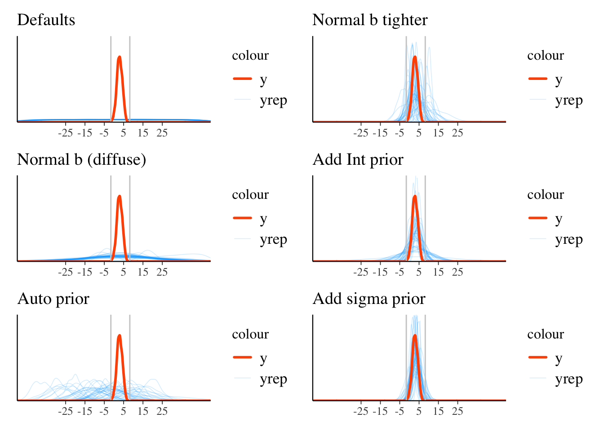

We can see in the visualization that the left side using defaults or notably diffuse priors results in nonsensical ranges for our target variable. When we actually run the model, this means we’d explore possible (the space of) parameter values that aren’t going to be useful for prediction. We would likely still should come to the same conclusions, it’s just that we might need many more iterations, and as we know from [Part I](https://m-clark.github.io/posts/2021-02-28-practical-bayes-part-i/), not having enough iterations can lead to many warnings.

So given that our target variable is between -2 and 8, it seems that just adding some basic, data-informed information to our priors resulted in more plausible results. This will generally help our models be more efficient and better behaved. Note that if all else fails, you can use a convenience function like auto_prior demonstrated above.

# Summarizing a Model

Now let’s run a baseline model, one that’s simple but plausible. Given that there will eventually be other complexities added to the model, I’ll go ahead and add some iterations, and increase `adapt_delta` and `max_treedepth` now to make the code reusable.

``` r
library(brms)

pr = c(
  prior(normal(0, 1), class = 'b'),
  prior(student_t(10, 1, 1), class = 'sigma'),
  prior(student_t(10, 1, 1), class = 'sd')  # prior for random intercept std dev
)

model_baseline = brm(
  y ~ b1 + b2 + x1 + x2 + x3 + (1 | group), 
  data    = main_df,
  warmup  = 5000,
  iter    = 6000,
  thin    = 4,
  prior   = pr, 
  cores   = 4,
  seed    = 1234, 
  control = list(
    adapt_delta   = .95,
    max_treedepth = 15
  ),
  save_pars = save_pars(all = TRUE)  # potentially allows for more  more post-processing functionality
)
```

``` r
summary(model_baseline)
```

     Family: gaussian 
      Links: mu = identity; sigma = identity 
    Formula: y ~ b1 + b2 + x1 + x2 + x3 + (1 | group) 
       Data: main_df (Number of observations: 1000) 
      Draws: 4 chains, each with iter = 6000; warmup = 5000; thin = 4;
             total post-warmup draws = 1000

    Multilevel Hyperparameters:
    ~group (Number of levels: 100) 
                  Estimate Est.Error l-95% CI u-95% CI Rhat Bulk_ESS Tail_ESS
    sd(Intercept)     0.87      0.07     0.74     1.02 1.00      710      782

    Regression Coefficients:
              Estimate Est.Error l-95% CI u-95% CI Rhat Bulk_ESS Tail_ESS
    Intercept     2.69      0.21     2.28     3.10 1.00      691      811
    b11           0.80      0.07     0.67     0.93 1.00      918      955
    b21          -0.14      0.18    -0.51     0.22 1.00      798      878
    x1            0.03      0.03    -0.03     0.10 1.01      792      869
    x2           -0.03      0.04    -0.10     0.05 1.00      994      990
    x3            0.27      0.04     0.19     0.34 1.00     1013      967

    Further Distributional Parameters:
          Estimate Est.Error l-95% CI u-95% CI Rhat Bulk_ESS Tail_ESS
    sigma     1.03      0.02     0.99     1.08 1.00      969      986

    Draws were sampled using sampling(NUTS). For each parameter, Bulk_ESS
    and Tail_ESS are effective sample size measures, and Rhat is the potential
    scale reduction factor on split chains (at convergence, Rhat = 1).

For reporting purposes, generally all you need are the `Estimate` and lower and upper bounds. You might also mention that the basic diagnostics suggested no problems, but you’ll still want to explore this a bit for yourself (as in [Part I](https://m-clark.github.io/posts/2021-02-28-practical-bayes-part-i/)). If you want a visual approach to these basic results, you can use something like the following types of plots.

``` r
mcmc_plot(model_baseline, type = 'areas')
```

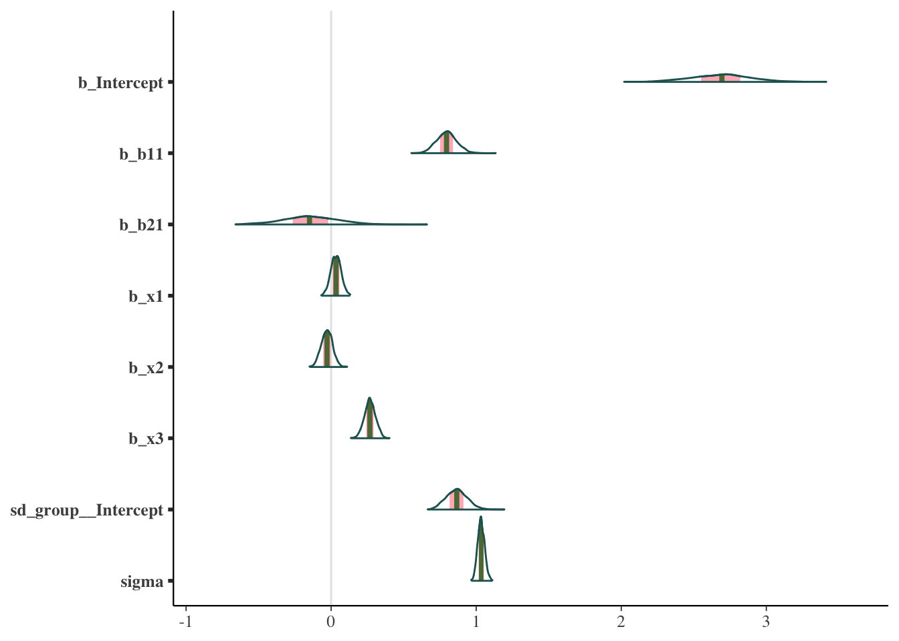

``` r
mcmc_plot(model_baseline, type = 'intervals')
```

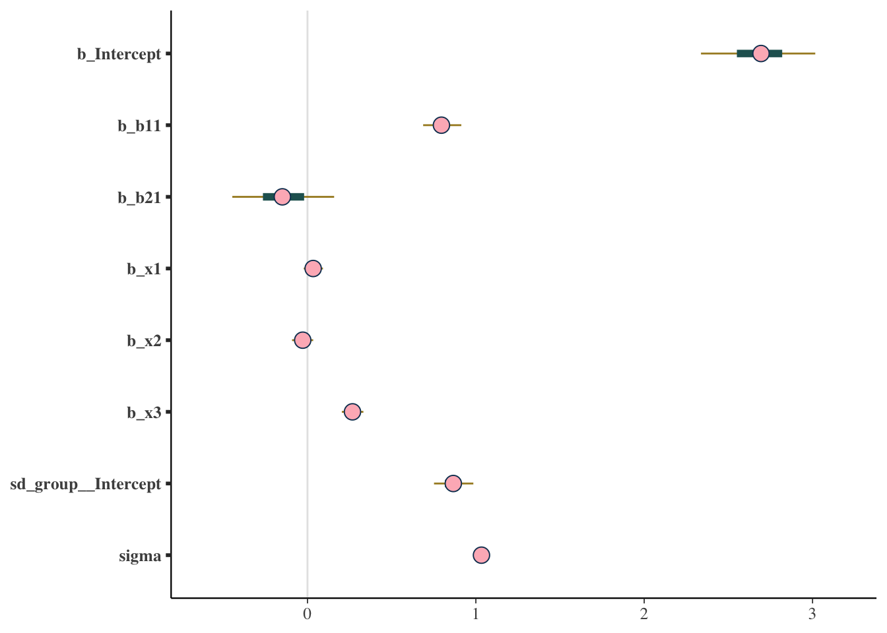

The tidybayes package offers some nice options as well. It takes a bit of getting used to, but can be very handy. As an example, the following gives a visual sense of the probability of regression coefficient values beyond a chosen point of interest, in this case, arbitrarily chosen as `abs(.25)`.

``` r
library(tidybayes)

# get_variables(model_baseline) %>% as_tibble() # to see variable names as required for plotting.

# grab fixed effects - intercept
tidy_plot_data_fe = model_baseline %>%
  spread_draws(`^b_(b|x).*`, regex = TRUE) %>% 
  pivot_longer(b_b11:b_x3, names_to = 'coefficient')

tidy_plot_data_fe %>%
  ggplot(aes(y = rev(coefficient), x = value)) +
  geom_vline(xintercept = c(-.25, .25), color = 'gray92', size = .5) +
  stat_dotsinterval(
    aes(fill = stat(abs(x) < .25)),
    quantiles = 40,
    point_color = '#b2001d',
    interval_color = '#b2001d',
    interval_alpha = .6
  ) +
  scico::scale_fill_scico_d(begin = .2, end = .6) +
  labs(y = '') +
  guides(fill = 'none') +
  theme_clean()
```

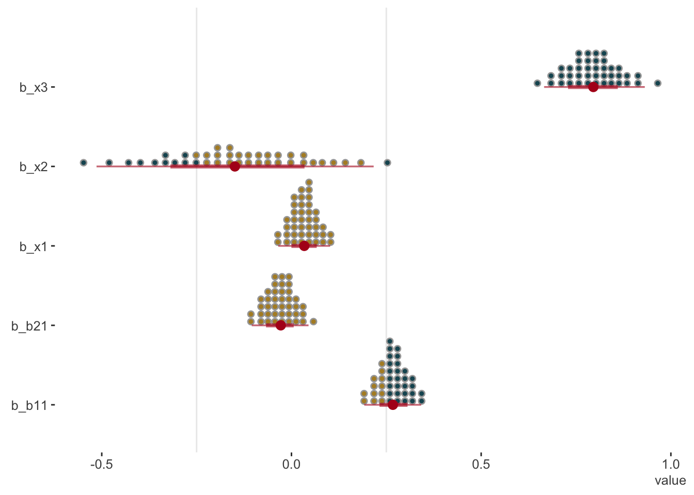

## Check Priors

Though we did some work to select our prior distributions beforehand, we might still be concerned about how influential our priors were. So how can we check whether our priors were informative? The following uses the bayestestR package to do a simple check of whether the posterior standard deviation is greater than 10% of the prior standard deviation[^2]. Having an informative prior isn’t really a problem in my opinion, unless it’s more informative than you wanted. For example, shrinkage of a coefficient towards zero will generally help avoid overfitting.

``` r
prior_summary(model_baseline)
```

                      prior     class      coef group resp dpar nlpar lb ub
               normal(0, 1)         b                                      
               normal(0, 1)         b       b11                            
               normal(0, 1)         b       b21                            
               normal(0, 1)         b        x1                            
               normal(0, 1)         b        x2                            
               normal(0, 1)         b        x3                            
     student_t(3, 2.9, 2.5) Intercept                                      
        student_t(10, 1, 1)        sd                                  0   
        student_t(10, 1, 1)        sd           group                  0   
        student_t(10, 1, 1)        sd Intercept group                  0   
        student_t(10, 1, 1)     sigma                                  0   
           source
             user
     (vectorized)
     (vectorized)
     (vectorized)
     (vectorized)
     (vectorized)
          default
             user
     (vectorized)
     (vectorized)
             user

``` r
bayestestR::check_prior(model_baseline)
```

        Parameter Prior_Quality
    1 b_Intercept uninformative
    2       b_b11 uninformative
    3       b_b21   informative
    4        b_x1 uninformative
    5        b_x2 uninformative
    6        b_x3 uninformative

These results suggest that we might be more informative, but for the intercept, which we largely aren’t too worried about, and for the factor that is highly unbalanced (`b2`), but which has no obvious solution. I personally would be fine with this result, especially since we took initial care in choosing these priors. If you really wanted to, you could change the priors that were informative.

## Explore and Visualize Results

Now that we are feeling pretty good about the results we have, we can explore the model further. We can plot covariate effects easily with brms. The conditional_effects function is what we want here. I show results for one effect below. Without interactions or other things going, on they aren’t very interesting, but it’s a useful tool nonetheless. We’ll come back to this later.

``` r
conditional_effects(model_baseline, 'b2')
```

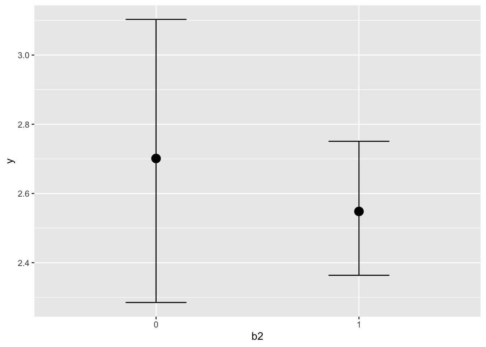

We can also use the hypothesis function to test for specific types of effects. By default they provide a one-sided probability and uncertainty interval. For starters, we can just duplicate what we saw in the previous summary for the `b2` effect. The only benefit is to easily obtain the one-sided p-value (e.g. that `b2` is less than zero) and the corresponding *evidence ratio*, which is just `p/(1-p)`.

``` r
hypothesis(model_baseline, 'b21 < 0')
```

    Hypothesis Tests for class b:
      Hypothesis Estimate Est.Error CI.Lower CI.Upper Evid.Ratio Post.Prob Star
    1  (b21) < 0    -0.14      0.18    -0.45     0.16       3.46      0.78     
    ---
    'CI': 90%-CI for one-sided and 95%-CI for two-sided hypotheses.
    '*': For one-sided hypotheses, the posterior probability exceeds 95%;
    for two-sided hypotheses, the value tested against lies outside the 95%-CI.
    Posterior probabilities of point hypotheses assume equal prior probabilities.

But we can really try anything, which is the power of this function. As an example, the following tests whether the combined effect of our categorical covariates is greater than twice the value of the `x1` effect[^3].

``` r
hypothesis(model_baseline, 'abs(b11) + abs(b21) > 2*x1')
```

    Hypothesis Tests for class b:
                    Hypothesis Estimate Est.Error CI.Lower CI.Upper Evid.Ratio
    1 (abs(b11)+abs(b21... > 0     0.92      0.17     0.67     1.22        Inf
      Post.Prob Star
    1         1    *
    ---
    'CI': 90%-CI for one-sided and 95%-CI for two-sided hypotheses.
    '*': For one-sided hypotheses, the posterior probability exceeds 95%;
    for two-sided hypotheses, the value tested against lies outside the 95%-CI.
    Posterior probabilities of point hypotheses assume equal prior probabilities.

One should get used to whatever tools are available for further understanding covariate effects or other parameters. This will likely lead to some of the more interesting discussion of your findings, or at least, notably more interesting than a standard regression table.

## Model Effectiveness

It is one thing to look at specific effects. but a natural question to ask is how useful our model actually is as a whole. This then suggests we need to know how to define such utility. Such an assessment definitely cannot be made with something like ‘statistical significance’. Science of any kind is nothing without prediction, so we we can start there.

### Posterior predictive checks

Posterior predictive checks are a key component of Bayesian analysis. The prior checks we did before are just a special case of this. Here we instead use the posterior distributions of parameters to generate the data, and compare this model-implied/synthetic data to what we actually observe. Doing so can give insight to where the model succeeds and fails.

``` r
pp_check(model_baseline, ndraws = 100)
```

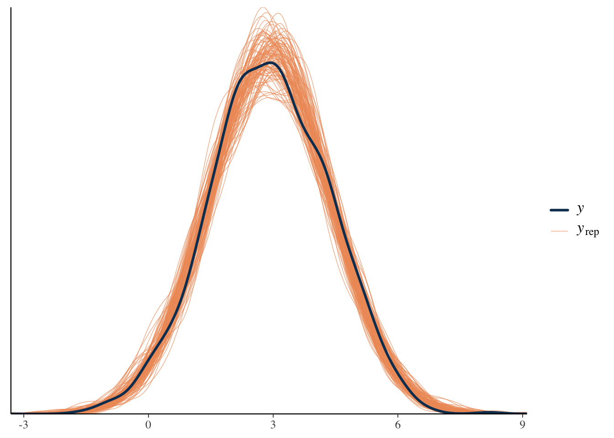

``` r
pp_check(model_baseline, ndraws = 10, type ='error_scatter_avg', alpha = .1)
```

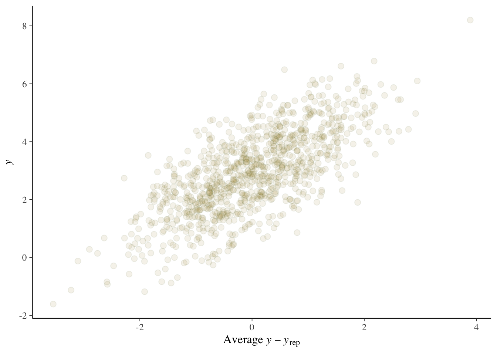

In this case, we see good alignment between model and data, and no obvious pattern to the types of errors we are getting. It is often the case that we see that the model does not capture the most extreme values well, but that’s not terribly surprising. With simulated data, our situation is more pristine to begin with, but you generally can’t expect such a clean result in practice.

As an example, consider predictions with and without random effects. Including the cluster-specific effects for prediction appear to do better with the capturing the tails.

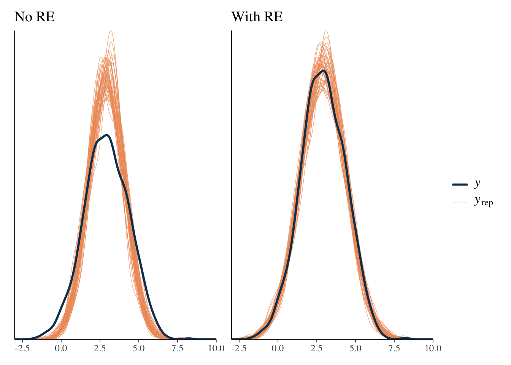

We can use the same approach to look at specific statistical measures of interest. For example, the following suggests our model is pretty good at capturing the minimum value, but typically underestimates the maximum value, which we noted earlier, is not especially unexpected in practice, particularly with smaller sample data.

``` r
pp_check(model_baseline, ndraws = 100, type ='stat', stat='median')
```

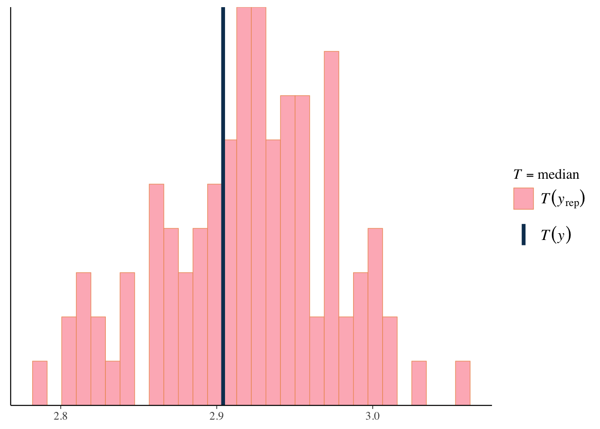

``` r
pp_check(model_baseline, ndraws = 100, type ='stat', stat = 'max')
```

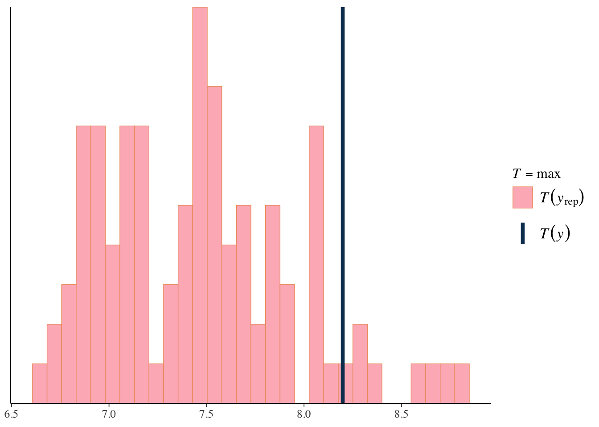

We can define any function to use for our posterior predictive check. The following shows how to examine the 10th and 90th quantiles. Minimum and maximum values are unlikely to be captured very well due to their inherent variability, so looking at less extreme quantiles (e.g. 10^(th) or 90^(th) percentile) might be a better way to assess whether the model captures the tails of a distribution.

``` r
q10 = function(y) quantile(y, 0.1)
q90 = function(y) quantile(y, 0.9)

pp_check(model_baseline, ndraws = 100, type ='stat', stat = 'q90')

pp_check(model_baseline, ndraws = 100, type ='stat_2d', stat = c('q10', 'q90'))
```

### Bayes R-squared

In this modeling scenario, we can examine the amount of variance accounted for in the target variable by the covariates. I don’t really recommend this beyond linear models that assume a normal distribution for the target, but people like to report it. Conceptually, it is simply a (squared) correlation of fitted values with the observed target values, so can be seen as descriptive statistic. Since we are Bayesians, we also get a ready-made interval for it, as it is based on the posterior predictive distribution. But to stress the complexity in trying to assess this, in this mixed model we can obtain the result with the random effect included (conditional) or without (unconditional). Both are reasonable ways to express the statistic, but the one including the group effect naturally will be superior, assuming the group-level variance is notable in the first place.

``` r
bayes_R2(model_baseline)                   # random effects included
```

        Estimate  Est.Error      Q2.5     Q97.5
    R2 0.4812032 0.01781973 0.4445528 0.5148587

``` r
bayes_R2(model_baseline, re_formula = NA)  # random effects not included
```

        Estimate  Est.Error       Q2.5    Q97.5
    R2 0.1161024 0.01498238 0.08729654 0.144502

``` r
# performance::r2_bayes(model_baseline)    # performance package provides both
```

To show the limitation of R², I rerun the model using a restrictive prior on the intercept. Intercepts for the resulting models are different but the other fixed effects are basically the same. The R² suggests equal performance of both models.

| model    |    R2 | Est.Error |  Q2.5 | Q97.5 |
|:---------|------:|----------:|------:|------:|
| baseline | 0.116 |     0.015 | 0.087 | 0.145 |
| modified | 0.116 |     0.014 | 0.089 | 0.143 |

However, a posterior predictive check shows clearly the failure of the modified model to capture the data.

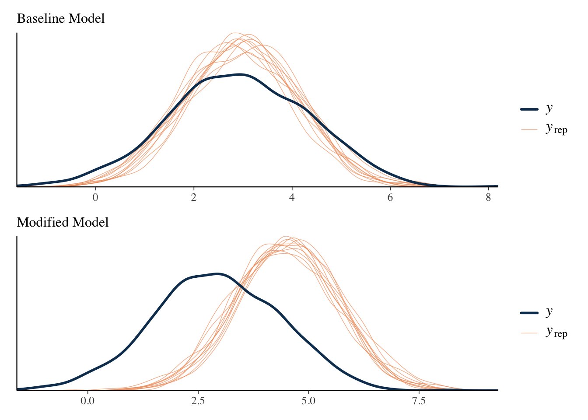

A variant of R², the ‘LOO’ R², is also available via the loo_R2 function. LOO stands for *leave-one-out*, as in leave-one-out cross-validation. It’s based on the residuals from the leave one out predictions. You can think of it as a better way to obtain an adjusted R² in this setting. The results suggests that the LOO R² actually picks up the difference in models, and would be lower for the modified model, even if we included the random effects.

For more on Bayesian R², see the [resources section](#r2)

# Prediction & Model Comparison

In general, a model is judged most by whether it has practical value. Even if we think a model is effective, there still might be another model that can do better. So it can be a good idea to have a couple of models to compare with one another. And one of the best ways to compare them is via prediction, especially by predicting on data the model wasn’t trained on to begin with.

For our demonstration, we will add two new models. The first adds interactions, the second adds a nonlinear relationship for one of the variables to that model, and is the closest to the underlying data generating mechanism.

``` r
model_interact = update(
  model_baseline,
  . ~ . + b1:b2 + b2:x1,
  cores = 4,
  seed  = 1234
)

model_interact_nonlin = update(
  model_interact,
  . ~ . + s(x3),
  cores = 4,
  seed  = 1234
)
```

## Basic prediction

With models in hand, let’s look at our basic predictive capabilities. We can get fitted values which include ‘confidence’ intervals, or predictions, which include ‘prediction’ intervals that include the uncertainty for a new observation. We can specify these as follows. First we create a small data set to make some predictions on. It will include both values for of the binary covariates, and the means of the numeric covariates (0).

``` r
prediction_data = crossing(
  b1 = 0:1,
  b2 = 0:1,
  x1 = 0,
  x2 = 0,
  x3 = 0
)

# fitted values
head(fitted(model_baseline))  
```

         Estimate Est.Error     Q2.5    Q97.5
    [1,] 3.517482 0.3382849 2.855822 4.167321
    [2,] 3.796906 0.3377263 3.118250 4.453510
    [3,] 3.866082 0.3346731 3.179920 4.511195
    [4,] 4.357828 0.3507970 3.688756 5.026747
    [5,] 3.185495 0.3381892 2.527887 3.825222
    [6,] 3.910027 0.3347265 3.244999 4.558492

``` r
# new predictions
data.frame(
  prediction_data,
  predict(model_baseline, newdata = prediction_data, re_formula = NA)
)
```

      b1 b2 x1 x2 x3 Estimate Est.Error      Q2.5    Q97.5
    1  0  0  0  0  0 2.696397  1.069881 0.5093926 4.709590
    2  0  1  0  0  0 2.557696  1.013811 0.5566073 4.603278
    3  1  0  0  0  0 3.450119  1.082413 1.3938133 5.471762
    4  1  1  0  0  0 3.324694  1.008474 1.3336782 5.300122

In general, we’d always like to visualize the predictions. We can do so as we did before with the conditional_effects function, which would also allow us to set specific covariate values. For the third plot of the nonlinear effect below, I modify the basic conditional effects plot that brms provides for a slightly cleaner visualization.

``` r
conditional_effects(model_baseline, effects = 'x2', conditions = prediction_data[1,])
```

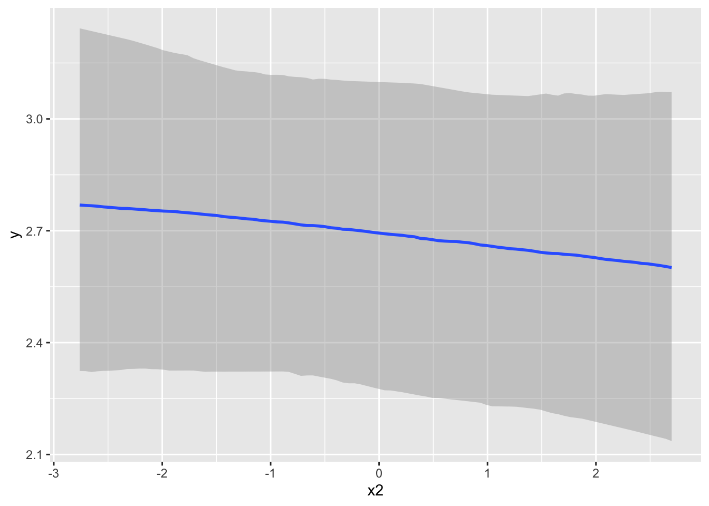

``` r
conditional_effects(model_interact, effects = 'x1:b2')
```

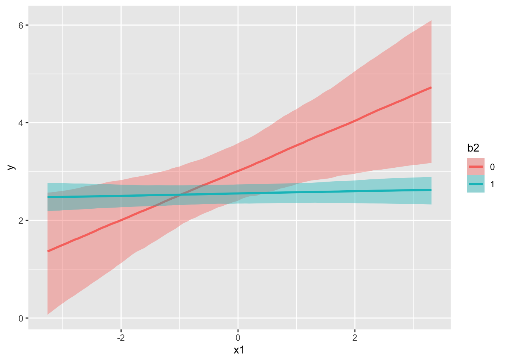

``` r
init = conditional_effects(model_interact_nonlin, effects = 'x3', spaghetti = T)
```

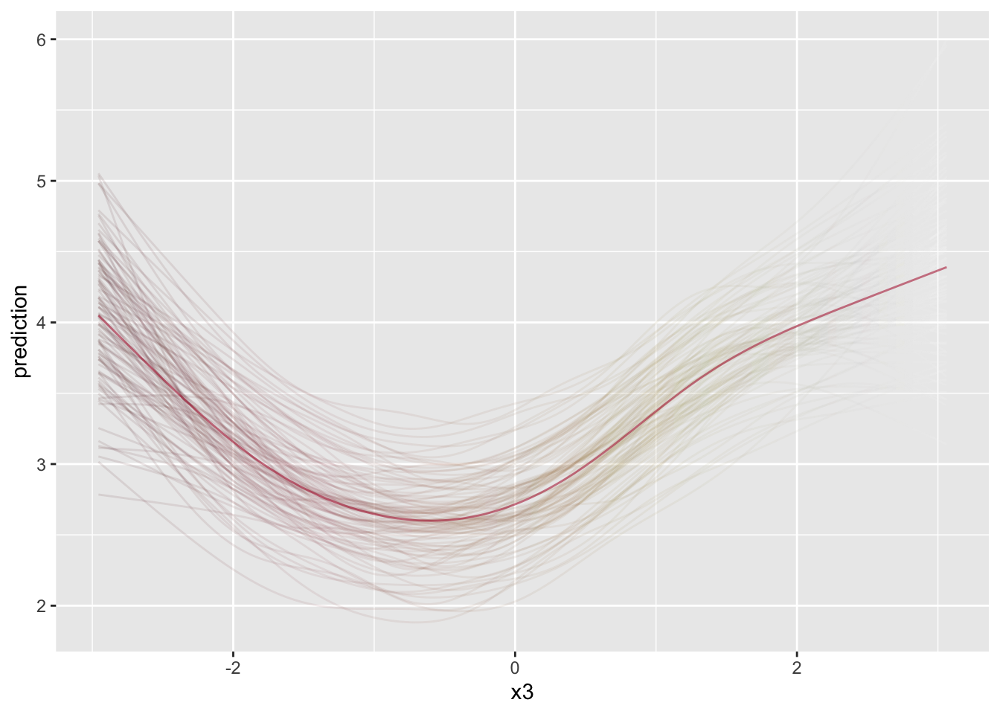

Expanding your story through prediction is essential to helping your audience understand the model on a practical level. You would do well to spend time looking at specific data scenarios, especially in the case of nonlinear models (e.g. GLM) and models with interactions.

## Model Comparison

In typical situations it is good to have competing models, and having additional models allows us to see if improvements can be made in one way or another, both to our models, and potentially to our way of thinking about them. In a general sense, we will go about things very similarly in the Bayesian context that we would elsewhere. However, we’ll also more easily apply other approaches that are not so commonly used (even if they can be).

### Choosing a model

In traditional contexts, we can use a specific approach to pit competing models against one another, selecting the ‘best’ model based on a particular metric, for example, AIC, cross-validation error, etc. With ‘error metrics’, the model with the lowest value is the winner. In this case, nothing is new in the Bayesian world. Here, we can use estimates like *WAIC* and *LOOIC* for model comparison, much like you would *AIC* to compare models in traditional frameworks. The values themselves don’t tell us much, but in comparing models, lower means less predictive error for these ‘information criteria’ metrics, which is what we want[^4], and since we’re Bayesian, we will even have estimates of uncertainty for these values as well. We also have cross-validation approaches (which IC metrics approximate), which we will demonstrate later.

With our new models added to the mix, we can now make some comparisons using loo_compare. First, we’ll add LOOIC estimates to our models, which are not estimated by default.

``` r
model_baseline = add_criterion(model_baseline,  'loo')
model_interact = add_criterion(model_interact, 'loo')
model_interact_nonlin = add_criterion(model_interact_nonlin, 'loo')
```

To start, we’ll show the LOOIC result for the baseline model. We have the total expected log probability (`elpd_loo`) for the leave-one-out observations. We also get stuff like `p_loo`, which is the effective number of parameters. For those familiar with penalized maximum likelihood, these are familiar analogues. However we also get a summary regarding `Pareto k values`, which we’ll talk about soon.

``` r
# example
loo(model_baseline)
```


    Computed from 1000 by 1000 log-likelihood matrix.

             Estimate   SE
    elpd_loo  -1500.6 21.9
    p_loo        88.0  3.8
    looic      3001.2 43.9
    ------
    MCSE of elpd_loo is 0.4.
    MCSE and ESS estimates assume MCMC draws (r_eff in [0.6, 1.3]).

    All Pareto k estimates are good (k < 0.67).
    See help('pareto-k-diagnostic') for details.

Let’s now compare the baseline model to the others models using loo_compare. It shows the ‘best’ (lowest-valued) model first, followed by the others. We get the difference of each elpd vs. the lowest, also get a standard error for this difference, which you could use to help assess how different the values are statistically. Just by this standard, the model that is based on the underlying data generating mechanism is the clear winner, as we would expect.

``` r
loo_compare(
  model_baseline, 
  model_interact,
  model_interact_nonlin
)
```

                          elpd_diff se_diff
    model_interact_nonlin   0.0       0.0  
    model_interact        -44.5       9.4  
    model_baseline        -46.3       9.7  

Now let’s compare several metrics available to us. In this particular setting, all are generally in agreement in the rank order of the models, though there appears to be no meaningful difference between the baseline and interaction models.

| model           |   R2 | loo_R2 |    WAIC |   LOOIC |     ELPD |       weight |
|:----------------|-----:|-------:|--------:|--------:|---------:|-------------:|
| baseline        | 0.48 |   0.43 | 2999.15 | 3001.18 | -1500.59 | 7.680717e-06 |
| interact        | 0.49 |   0.43 | 2995.28 | 2997.42 | -1498.71 | 4.067051e-06 |
| interact_nonlin | 0.53 |   0.48 | 2905.87 | 2908.49 | -1454.25 | 9.999883e-01 |

For our ultimate model comparison we want to stick to using the IC values. As far as choosing between WAIC vs. LOOIC, the latter has better diagnostics for noting whether there are potential problems in using it. In practice, they will almost always agree with one another. As we noted previously, LOOIC reflects the ELPD, and this value is used in constructing the model weights shown in the last column[^5]. The model weights can then be used in making final predictions (i.e. [model averaging](#model-averaging-1)), or just providing a different way for your audience to gauge which model might be preferred.

### Problems at the loo

After the model issues discussed in [Part I](https://m-clark.github.io/posts/2021-02-28-practical-bayes-part-i/), the next most common point of confusion I see people have is with model comparison, and using LOO in particular. Part of the reason is that this is an area of ongoing research and development, and most of the tools and documentation are notably technical. Another reason is that these are not perfect tools. They can fail to show notable problems for models that are definitely misspecified, and flag models that are essentially okay. Sometimes they flag models that other indicators may suggest are better models relatively speaking, which actually isn’t a contradiction, but which may indicate an overfit situation.

So in general, no tool is perfect, but in the real world we have to get things, so let’s address a couple issues.

##### Not so different models

Let’s start with the case where models do not appear to perform very differently. If two models aren’t very different from one another, the usual response is to go with the simpler model. For example, if we were only comparing the baseline model vs. the interaction model, there really isn’t much difference in terms of LOOIC/ELPD. However, we will have to consider things a little differently in the Bayesian context. Consider the following two thoughts.

> The general issue is that with *unregularized* estimation such as least squares or maximum likelihood, adding parameters to a model (or making a model more complex) leads to overfitting. With regularized estimation such as multilevel modeling, Bayesian inference, lasso, deep learning, etc., the regularization adds complexity but in a way that reduces the problem of overfitting. So traditional notions of model complexity and tradeoffs are overturned. ~ Andrew Gelman

> Sometimes a simple model will outperform a more complex model… Nevertheless, I believe that deliberately limiting the complexity of the model is not fruitful when the problem is evidently complex. Instead, if a simple model is found that outperforms some particular complex model, the appropriate response is to define a different complex model that captures whatever aspect of the problem led to the simple model performing well. ~ Radford Neal

The take-home message here is that *simpler is not always better*. And to be frank, using *penalized* (a.k.a. *regularized*) approaches (e.g. lasso, ridge, mixed models) should probably be our default model in the non-Bayesian context, and it turns out that such approaches actually approximate a Bayesian one with specific priors. In the end, you may have to think about things a little more carefully, and given that you are using methods that can help avoid overfitting, you may instead lean on a more complex model with otherwise similar performing models. And that would be closer to how nature works anyway, which is always more complex than our brains can easily understand.

##### Pareto values

Let’s look again at the basic result from using the loo function.

``` r
loo(model_interact)
```


    Computed from 1000 by 1000 log-likelihood matrix.

             Estimate   SE
    elpd_loo  -1498.7 22.0
    p_loo        89.5  3.9
    looic      2997.4 44.0
    ------
    MCSE of elpd_loo is 0.4.
    MCSE and ESS estimates assume MCMC draws (r_eff in [0.6, 1.2]).

    All Pareto k estimates are good (k < 0.67).
    See help('pareto-k-diagnostic') for details.

We haven’t yet discussed *Pareto values*, but it is not uncommon to get a result with some values that are not ‘good’ or ‘ok’. If you happen to see Pareto values in the ‘bad’ or ‘very bad’ group, what does it mean? You can read the definition provided [here](https://mc-stan.org/loo/reference/loo-glossary.html#pareto-k-estimates), but it may not help many due to the background knowledge needed to parse it. However, you can just understand it as an (leave-one-out) *extreme value* diagnostic, and if it is a problem, it mostly means your LOOIC may not be good for comparing models.

As in the standard model setting, ‘outliers’ indicate *model incompetence*, or in other words, the model is unable to understand such observations. Unless you have reason to suspect something inherently wrong in the data (e.g. an incorrect value/typo), an outlier is a sign that your model is not able to capture the data fully. It definitely is *not* a reason to remove the observation!

If you have Pareto values \> .7, you may recalculate LOOIC with the options provided by the loo function or use the reloo function, getting a better estimate that could then be used in, for example, [model stacking](#model-averaging-1) for prediction. If you don’t discover many outliers, it probably won’t make much difference in your final estimates and conclusions, and so probably isn’t worth the trouble pursing much further. The output for Pareto values doesn’t even save the row identifying information that would make it easy to find which observations are the problem, but you can do something like the following if you need to.

``` r
pareto = loo(model_interact_nonlin)

problems = pareto$pointwise %>% 
  data.frame() %>% 
  rowid_to_column() %>% 
  filter(influence_pareto_k > .5) %>% 
  pull(rowid)

model_interact_nonlin$data %>% 
  mutate(rank = rank(y)) %>% 
  slice(problems)
```

              y b1 b2        x1        x2         x3 group rank
    1  8.198540  1  1 0.3636720 0.0652158  1.3760312    68 1000
    2 -1.123859  1  0 0.8573758 0.6268734 -0.3354954    97    3

As we might have expected, the observations with the more extreme target values are likely to be problems (rank closer to 1 or 1000), but for some of these, there is nothing to suggest why they might be difficult, and it’s even harder to speculate in typical modeling situations with more predictors and complexity. Furthermore, outside of additional model complexity, which might then hamper interpretation, there is often little we can do about this, or at least, what we can do is generally not obvious in applied settings.

## Model Averaging

With the previous statistics for model comparison we can obtain relative model weights, using the model_weights function. This essentially spreads the total probability of the models across all those being compared. These weights in turn allow us to obtain (weighted) average predictions. The key idea being that we do not select a ‘best’ model, but rather combine their results for predictive purposes[^6].

We can start by comparing the first two models. Adding the interactions helped, and comparing the weights suggests that the interaction model would be contributing most to the averaged predictions.

    Method: stacking
    ------
                   weight
    model_baseline 0.234 
    model_interact 0.766 

If we compare the baseline to our most complex model, almost the entirety of the weight is placed on the latter.

``` r
loo_model_weights(model_baseline, model_interact_nonlin)
```

    Method: stacking
    ------
                          weight
    model_baseline        0.000 
    model_interact_nonlin 1.000 

Now we compare all three, with roughly the same conclusion.

| model_baseline | model_interact | model_interact_nonlin |
|---------------:|---------------:|----------------------:|
|          1e-05 |              0 |               0.99999 |

Now what about those average predictions? Let’s create a data frame that sets the continuous covariates at their means, and at each level of the categorical covariates. For our purposes here, we will also ignore group effects[^7]. We then will make average predictions for those observations using pp_average.

``` r
prediction_data = crossing(
  b1 = 0:1,
  b2 = 0:1,
  x1 = 0,
  x2 = 0,
  x3 = 0
)

average_predictions = pp_average(
  model_baseline,
  model_interact,
  model_interact_nonlin,
  newdata = prediction_data,
  re_formula = NA
)
```

| b1 | b2 | x1 | x2 | x3 | Estimate | Est.Error | Q2.5 | Q97.5 | Baseline Estimate | Model Nonlin Est. |
|---:|---:|---:|---:|---:|---:|---:|---:|---:|---:|---:|
| 0 | 0 | 0 | 0 | 0 | 2.73 | 1.03 | 0.67 | 4.70 | 2.69 | 2.73 |
| 0 | 1 | 0 | 0 | 0 | 2.29 | 0.98 | 0.31 | 4.21 | 2.54 | 2.30 |
| 1 | 0 | 0 | 0 | 0 | 2.95 | 1.03 | 1.00 | 4.98 | 3.48 | 2.93 |
| 1 | 1 | 0 | 0 | 0 | 3.09 | 1.02 | 1.07 | 5.04 | 3.34 | 3.08 |

As expected, we can see that the averaged predictions are essentially the same as what we would get from the model with all the weight. In other scenarios, you may be dealing with a more nuanced result.

## Cross-Validation

In machine learning contexts, cross-validation is the default approach to considerations of model performance. We can do so easily within the Bayesian context as well. I go ahead and do so for a single model, as well as all three models, so we can see how our previous performance metrics might change. In general, prediction on a validation set will be expected to be worse than on the training data[^8], but it is the better estimate of prediction error.

``` r
library(future)

plan(multisession)

model_interact_nonlin_cv = kfold(
  model_interact_nonlin,
  K = 5,
  chains = 1,
  save_fits = TRUE
)

model_all_cv = kfold(
  model_baseline,
  model_interact,
  model_interact_nonlin,
  K = 5,
  chains = 1,
  save_fits = TRUE
)

plan(sequential)
```

With a single cross-validation model in place, we can then make predictions with it to get the test error or other metrics of interest. As we expect, the training error, i.e. that on the original/full data is better than the test error, but the latter is the better estimate of our model error, and thus a better metric for comparing models.

``` r
test_predictions = kfold_predict(model_interact_nonlin_cv)


train_error = yardstick::rmse_vec(truth    = model_interact_nonlin$data$y,
                                  estimate = fitted(model_interact_nonlin)[, 1])

test_error  = yardstick::rmse_vec(truth    = test_predictions$y,
                                  estimate = colMeans(test_predictions$yrep))
```

| train_error | test_error |
|------------:|-----------:|
|       0.933 |      1.051 |

Now let’s revisit our LOOIC comparison, only now it is based on LOOIC via the cross-validation process. We would come to the same conclusions, but we can see that the differences, while still substantial, are not as great. In addition, other standard metrics can help validate the Bayesian-specific metrics, as RMSE does here.

``` r
## model_all_cv$diffs
```

| model                 | elpd_diff | se_diff | elpd_kfold | rmse |
|:----------------------|----------:|--------:|-----------:|-----:|
| model_interact_nonlin |      0.00 |    0.00 |   -1472.57 | 1.06 |
| model_baseline        |    -33.62 |   11.33 |   -1506.19 | 1.09 |
| model_interact        |    -41.59 |   11.05 |   -1514.16 | 1.10 |

### Variable Selection

If desired, we can use cross-validation to help with feature selection. We’ve already discussed why this really shouldn’t be a concern, namely because there rarely is a reason to throw out variables regardless of how minimally important they might be. Furthermore, interactions among variables are the norm, not the exception. So while a variable might not do well on its own, it can be extremely important in how it interacts with another feature.

In any case, one can use the projpred package to get a sense of this, and also why it can be problematic. For starters, we cannot test our nonlinear model due to its complexity[^9]. But we can also see that we would not choose the true underlying model using this approach. In addition, for expediency I had to turn off the random effects, otherwise this would take more time than I wanted to spend for this demo (the group effect would have been the first selected). In short, be prepared for issues that might accompany the complexities in your model[^10].

``` r
library(projpred)

model_feature_select_cv = update(model_interact, .~. - (1|group), cores = 4)
ref_model = get_refmodel(model_feature_select_cv)  # reference model structure

options(mc.cores = parallel::detectCores())
var_select = cv_varsel(ref_model)   # will take a very long time
```

With results in place we can summarize and visualize our results, similar to how we have done before. This is from `summary(var_select)`. You can see how often features are selected across all cv runs via the observation level folds, and the expected loo results.

| size | ranking     | cv_proportions |    elpd | elpd.se | elpd.diff | elpd.diff.se |
|-----:|:------------|---------------:|--------:|--------:|----------:|-------------:|
|    0 | (Intercept) |             NA | -1779.6 |    21.5 |     -63.5 |         11.3 |
|    1 | b1          |            1.0 | -1736.4 |    21.9 |     -20.3 |          7.1 |
|    2 | x3          |            1.0 | -1714.5 |    21.3 |       1.6 |          2.3 |
|    3 | b2          |            0.8 | -1723.1 |    21.7 |      -7.0 |          2.1 |
|    4 | x2          |            0.7 | -1725.1 |    21.7 |      -8.9 |          1.9 |
|    5 | x1          |            0.8 | -1720.1 |    21.7 |      -4.0 |          1.7 |
|    6 | b2:x1       |            0.8 | -1721.4 |    21.7 |      -5.3 |          1.3 |
|    7 | b1:b2       |            0.8 | -1715.9 |    21.6 |       0.2 |          0.1 |

The plot of elpd (higher better) and rmse (lower better) suggest a possible cutoff of submodel size 2, which would include `b1` and `x3`.

``` r
# plot predictive performance on training data
plot(var_select, stats = c('elpd', 'rmse'))
```

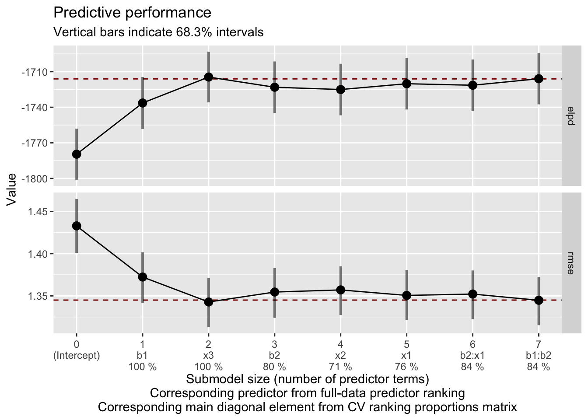

Here is the final rank ordering with density plots for the two best features + one other for comparison. Unexpectedly, the ‘top’ feature is almost centered on zero. Go figure.

``` r
ranking(var_select)$fulldata
```

    [1] "b1"    "x3"    "b2"    "x2"    "x1"    "b2:x1" "b1:b2"

``` r
mcmc_areas(
    as.matrix(ref_model$fit),
    pars = c('b_b11', 'b_x3', 'b_x1')
  ) +
  coord_cartesian(xlim = c(-2, 2))
```

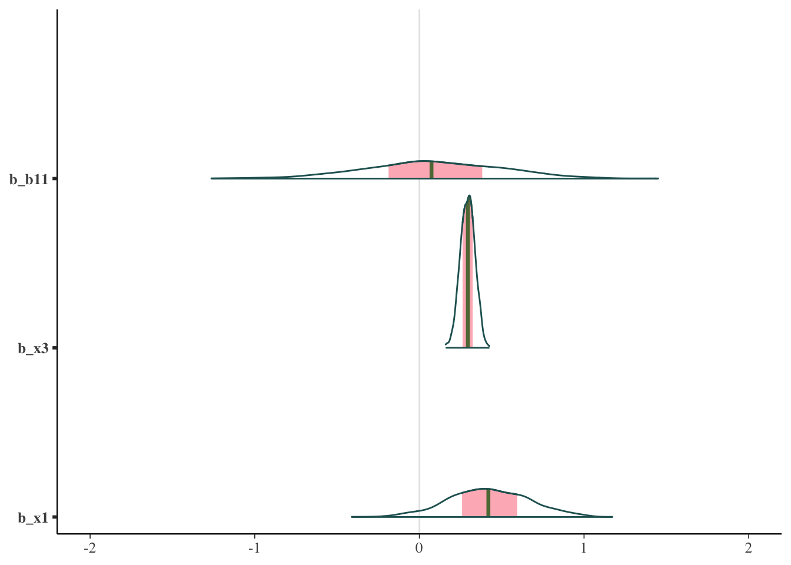

## The rabbit hole of model comparsion

If you start to look more into this, there are numerous technical articles, whole websites, and various discussions regarding how to go about it. I’m guessing many do not want to try and parse highly technical information, only to still feel confused about what to actually do. Many suggestions amount to ‘your model is probably misspecified’, but without additional thoughts on how to proceed. Some of the data issues that lead to problems are just the reality of data doing what data does. There are also suggestions that posterior predictive checks (PPCs) can be used to detect the problem. But a difficulty here is that these don’t detect anything by themselves without very specific directed action, nor do they typically have a standard metric to report, so the practical utility does have its limits. In addition, it’s not clear to me that issues or problems regarding specific statistics for model comparison (e.g. LOOIC estimation) should be a basis for altering a model, unless there is an obvious path for doing so. And let’s face it, if there was, you’d probably already be taking it.

For those that do want to go down the rabbit hole, I have numerous links in the [resources section](#resources).

## Solutions for Model Comparison

When doing model comparison, the following summarizes some basic steps you can take.

- Don’t assume you’ll have any certainty about some model being ‘best’.

- Use the metrics noted above, e.g. LOOIC, when making comparisons (not R²).

- Avoid the problem and fit the model that includes everything of interest, assuming you have a decent data size to do so. It is likely you can still learn some things about the model by comparing it to others.

- Variable selection is typically just a model comparison problem restated differently, and in a lot of cases I’ve come across, a misguided endeavor. If something is even minimally important, there is no reason to throw it out, as you’d just have worse predictions doing so. With complex models, you can’t assess one variable without consideration of others, so trying to say that one is more important than the others doesn’t really make sense.

- If some application performance measure is obvious and available to assess, pick a model that does best in that setting.

- If trying to select among many competing models, e.g. feature selection, you should consider why you are in this situation. If you don’t have much data, then the usual model selection criteria may lead you notably astray. If you have a lot of data, consider why you need to select a subset of predictors and not use all available. If you are somewhere in between, note that you’ll likely spend a lot more time here and still not be confident in the results. However, there are approaches, such as those in the projpred package, that might be useful, but likely will only work for simpler models.

# Summary: The Practical Approach to Bayesian Models

For applied analysts, just a few steps can go a long way toward making you feel better about your model. You can assess your priors in a straightforward fashion before starting, and that will not only help you have more confidence in your results, but likely also help you convince others of the results as well. Once you run the model, explore it in-depth, and take advantage of taking the Bayesian approach that allows you to more easily explore it. Many tools are available for you to asses model effectiveness, use them!

Key to understanding any model is through prediction, which can make even complex settings more relatable. You can pit models against one another to see which performs best in a predictive sense, but note that more complexity is more realistic, and in the Bayesian world, you don’t have to choose a ‘best’ model.

You can use the diagnostics to further understand why and how the model isn’t perfect, which might give you some ideas on how you might do things differently in the future. However, the diagnostic criteria and other statistics may themselves have problems, the solutions of which are difficult. You should be okay with leaving some aspects of your model imperfect. There’s always next time!

All in all, any modeling endeavor done well, Bayesian or otherwise, will take time, and often encounter difficulties. With the right tools, working through these difficulties can lead to a better understanding of both the data (i.e. the world around us), and how we think about it!

# Resources

### Prior Checks

- [Gelman’s prior check approach](https://statmodeling.stat.columbia.edu/2019/08/10/)
- [Stan Group’s Prior Choice Recommendations](https://github.com/stan-dev/stan/wiki/Prior-Choice-Recommendations)

### R²

- [Bayesian R2 and LOO-R2](https://avehtari.github.io/bayes_R2/bayes_R2.html) Vehtari et al.

- Andrew Gelman, Ben Goodrich, Jonah Gabry, and Aki Vehtari (2018). R-squared for Bayesian regression models. The American Statistician, doi:10.1080/00031305.2018.1549100. [Online Preprint](http://www.stat.columbia.edu/~gelman/research/unpublished/bayes_R2_v3.pdf).

### Model Comparison

- [The LOO glossary](https://mc-stan.org/loo/reference/loo-glossary.html)

- [LOO model weights](https://mc-stan.org/loo/articles/loo2-weights.html)

- [16 What to do if I have many high Pareto k’s?](https://avehtari.github.io/modelselection/CV-FAQ.html#16_What_to_do_if_I_have_many_high_Pareto_(k)%E2%80%99s)

#### Stan Forum Threads

- [Understanding LOOIC](https://discourse.mc-stan.org/t/understanding-looic/13409/6)

- [Can WAIC/LOOIC be used to compare models with different likelihoods?](https://discourse.mc-stan.org/t/can-waic-looic-be-used-to-compare-models-with-different-likelihoods/7380)

- [A quick note what I infer from p_loo and Pareto km values](https://discourse.mc-stan.org/t/a-quick-note-what-i-infer-from-p-loo-and-pareto-k-values/3446)

- [Recommendations for what to do when k exceeds 0.5 in the loo package?](https://discourse.mc-stan.org/t/recommendations-for-what-to-do-when-k-exceeds-0-5-in-the-loo-package/3417)

- [Improve model with some observations Pareto \>0.7](https://discourse.mc-stan.org/t/improve-model-with-some-observations-pareto-0-7/17500)

- [Pareto K for outlier detection 1](https://discourse.mc-stan.org/t/pareto-k-for-outlier-detection/12177/9)

- [Possibly incompatible metrics](https://discourse.mc-stan.org/t/good-pp-check-and-r-square-but-large-pareto-k-values/17678)

### Pareto values

- Vehtari, A., Simpson, D., Gelman, A., Yao, Y., and Gabry, J. (2019). Pareto smoothed importance sampling. [preprint arXiv:1507.02646](https://arxiv.org/abs/1507.02646/)

- [Aki Vehtari’s A quick note what I infer from p_loo and Pareto k values](https://discourse.mc-stan.org/t/a-quick-note-what-i-infer-from-p-loo-and-pareto-k-values/3446)

- [What to do if I have many high Pareto k?](https://avehtari.github.io/modelselection/CV-FAQ.html#16_What_to_do_if_I_have_many_high_Pareto_(k)%E2%80%99s)

### Model Averaging

- Vehtari, A., Gelman, A., and Gabry, J. (2017a). Practical Bayesian model evaluation using leave-one-out cross-validation and WAIC. Statistics and Computing. 27(5), 1413–1432. doi:10.1007/s11222-016-9696-4 ([journal version](http://link.springer.com/article/10.1007%2Fs11222-016-9696-4), [preprint arXiv:1507.04544](https://arxiv.org/abs/1507.04544)).

- Yao, Y., Vehtari, A., Simpson, D., and Gelman, A. (2018) Using stacking to average Bayesian predictive distributions. Bayesian Analysis, advance publication, doi:10.1214/17-BA1091. ([online](https://projecteuclid.org/euclid.ba/1516093227)).

### Cross-Validation

- [CV FAQ](https://avehtari.github.io/modelselection/CV-FAQ.html)

- [Projpred Quickstart](https://mc-stan.org/projpred/articles/quickstart.html)

- [Bayesian data analysis - roaches cross-validation demo](https://rawgit.com/avehtari/modelselection_tutorial/master/roaches.html#22_cross-validation_checking)

### Misc

- [Problematic Posteriors](https://mc-stan.org/docs/2_26/stan-users-guide/problematic-posteriors-chapter.html)

- Gabry, J. , Simpson, D. , Vehtari, A. , Betancourt, M. and Gelman, A. (2019), Visualization in Bayesian workflow. J. R. Stat. Soc. A, 182: 389-402. doi:10.1111/rssa.12378. ([journal version](https://rss.onlinelibrary.wiley.com/doi/abs/10.1111/rssa.12378), [arXiv preprint](https://arxiv.org/abs/1709.01449), [code on GitHub](https://github.com/jgabry/bayes-vis-paper))

- [Use CmdStan to save memory](http://mc-stan.org/cmdstanr/articles/cmdstanr.html)

- [Jeffrey Arnold’s Bayesian Notes](https://jrnold.github.io/bayesian_notes/) has nice examples of many models and good summaries otherwise

## Footnotes

## Reuse

[CC BY-SA 4.0](https://creativecommons.org/licenses/by-sa/4.0/)

## Citation

BibTeX citation:

``` quarto-appendix-bibtex
@online{clark2021,
  author = {Clark, Michael},
  title = {Practical {Bayes} {Part} {II}},
  date = {2021-02-28},
  url = {https://m-clark.github.io/posts/2021-02-28-practical-bayes-part-ii/},
  langid = {en}
}
```

For attribution, please cite this work as:

Clark, Michael. 2021. “Practical Bayes Part II.” February 28. <https://m-clark.github.io/posts/2021-02-28-practical-bayes-part-ii/>.

[^1]: If you were coding in Stan directly, you can run a single iteration to see if your code compiles at all.

[^2]: Daniel Lakeland proposes ([as a comment in the discussion of the 10% approach outlined](https://statmodeling.stat.columbia.edu/2019/08/10/)) an alternative approach is whether the posterior estimate falls within the 95% highest density interval of the prior. This is available via the method argument in the demonstrated function (`method = 'lakeland'`).

[^3]: As in the text of the output, this is the same as testing whether abs(b1) + abs(b2) - 2\*x1 \> 0. In this case the resulting value is greater than zero with high probability.

[^4]: Similar to AIC, LOOIC is ~ -2\*expected log posterior density (*ELPD*), similar to how we use -2\*log likelihood (a.k.a. deviance) in standard approaches for AIC. We don’t add a penalty for parameters here, and I think this is because the regularization is already built in to the modeling process, and the number of parameters might be more difficult to define in the Bayesian context with priors.

[^5]: Technically we can use WAIC to produce weights like we do with AIC, e.g. `exp(waic) / sum(exp(all_waics))`, but this isn’t recommended. The stacking approach allows similar models to share their weight, while more unique models will mostly keep their weight as additional models are added.

[^6]: Some might be familiar with Bayesian model averaging. Conceptually we aren’t changing much, but BMA assumes that one of our models is the true model, while the stacking approach underlying these weights does not. It is also different from conventional stacking in machine learning in that we are trying to average posterior predictive distributions, rather than point estimates.

[^7]: In other words, for prediction we set `re_formula = NA`.

[^8]: At the time of this writing, the underlying use of the furrr package defaults to not using a seed in it’s parallelization process, and then warns you that a seed has not been set for each repeated use of a cluster. Passing a seed through the seed argument won’t actually do anything presently here, so one will hope that furrr will change their default behavior. It’s a nuisance that can be ignored though.

[^9]: Perhaps this might be possible in a future release, but there are other complications that might make it problematic still.

[^10]: I revisited this late 2024, and it took *hours* to run the `cv_varsel` under these defaults, and I found the resulting objects even less intuitive to work with. They mention in the vignette there are many ways to speed it up, but accuracy will be compromised. In short, this is not something you could iterate over. On the plus side, the results were consistent with what I had seen before, for better or worse.
