> NB: This post was revisited when updating the website early 2025, and some changes were required. Attempts to keep things consistent were made, but if you feel you’ve found an issue, please post it at [GitHub](http://github.com/m-clark/m-clark.github.io/issues).

## Intro

> This post was mostly complete around May 2021, but for various reasons not actually posted until August of 2022. I haven’t changed much aside from adding a section on boosting, and have used the results I conjured up previously (for the most part). However, many package updates since then may mean that parts of the code may not work as well, especially for the torch code. I would also recommend modeltime as starting point for implementing a variety of model approaches for time series data with R. It was still pretty new when this was first written, but has many new features and capabilities, and could do some version of the models shown here.

It is extremely common to have data that exists over a period of time. For example, we might have yearly sports statistics, daily manufacturing records, server logs that might be occurring many times per second, and similar. There are many approaches we could use to model the data in these scenarios. When there are few time points and they are clustered within other units, like repeated observations of exercise data for many individuals, we often use tools like [mixed models](https://m-clark.github.io/mixed-models-with-R/) for example, and even with many observations in a series, we can still use tools like that. But sometimes there may be no natural clustering, or we might want to use other approaches to handle additional complexity.

This post is inspired by a co-worker’s efforts in using PyTorch to analyze Chicago Transit data. [Cody Dirks](https://twitter.com/codydirks) wrote [a post](https://www.strong.io/blog/forecasting-public-transport-utilization-in-chicago) where he used a [Python module](https://github.com/strongio/torchcast) developed by our group at [Strong Analytics](https://strong.io/) to analyze the ridership across all the ‘[L](https://en.wikipedia.org/wiki/Chicago_%22L%22)’. This post can be seen as a demonstration of some simpler models which might also be viable for a given situation such as this, allowing for quick dives, or even as ends in themselves.

## Outline

The models we’ll go through are the following:

- Error models and random effects
- GAM
- More elaborate time series with seasonal and other effects
- Boosting and Deep learning

In what follows I will show some more detailed code in the beginning, but won’t show it later for conciseness, focusing mostly just on the basic model code. You can always find the code for these posts on my [GitHub](https:://github.com/m-clark/m-clark.github.io).

## Quick Summary

- Classical econometrics approaches like ARIMA models may take notable effort to match the flexibility of other approaches one might take with time series. It’s also difficult to believe a specific lag/ma number will hold up with any data change.

- GAMs extend mixed models, and should probably be preferred if a probabilistic approach is desired. Prophet-style approaches would likely take notable effort and still likely lack performance, without adding interpretability.

- For black box methods, boosting can do very well without much feature engineering, but possibly take a bit more for parameter tuning. Deep learning methods may be your best bet given data size and other data modeling needs.

## Data Description

As noted in [Cody’s post](https://www.strong.io/blog/forecasting-public-transport-utilization-in-chicago), over 750,000 people use the Chicago Transit Authority’s ‘L’ system to get around the city. There are 8 interconnected rail lines named after colors- the Red, Blue, Green, Brown, Pink, Orange, Purple, and Yellow, 145 entry/exit stations, and over 2,300 combined trips by its railcars every day[^1].

The city of Chicago provides ridership data that can be accessed publicly.

- [ridership](https://data.cityofchicago.org/Transportation/CTA-Ridership-L-Station-Entries-Daily-Totals/5neh-572f)
- [station info](https://data.cityofchicago.org/Transportation/CTA-System-Information-List-of-L-Stops/8pix-ypme)

In Cody’s exploration, he added pertinent information regarding weather, sporting events, and more. You can access the [processed data](https://github.com/m-clark/m-clark.github.io/tree/master/data/time-series/processed_df.csv).

For our demonstrations we have daily ridership from 2012-2018, and we will use a variety of methods to model this. We will use a normalized ride count (mean of 0, standard deviation of 1) as our target variable.

### Import & Setup

To get things started we’ll use the tidyverse for some additional data processing, and lubridate for any date processing, for example, converting to weekdays.

``` r
# Data Processing

library(tidyverse)
library(lubridate)


# Misc

START_DT = '2008-06-01'
END_DT   = '2018-12-31'
SPLIT_DT = '2017-06-01'
```

##### Main data

I start with data having already been processed, but as mentioned the source is publicly available. I use data.table to read it in more quickly, but it’s default date class can cause issues with other packages, so I deal with that. I also extract the year, month, weekday, etc.

``` r
df = data.table::fread('data/time-series/processed_df.csv')

df_start = df %>% 
  as_tibble() %>% 
  select(-contains('_attributes'), -(tsun:wt22)) %>% 
  mutate(
    date      = as_date(date), # remove IDATE class
    rides_log = log(rides),
    year      = year(date),
    year_fac  = factor(year),
    month     = month(date, label = TRUE),
    day       = factor(wday(date, label = TRUE), ordered = FALSE),
    year_day  = lubridate::yday(date),
    line      = factor(line),
    snow_scaled = scale(snow)[, 1],
    colors = as.character(line),
    colors = ifelse(colors == 'purple_express', 'purple4', colors),
    red_line_modernization = 
      ifelse(
        between(date, as_date('2013-05-19'), as_date('2013-10-20')), 
        1, 
        0
      )
  ) %>% 
  arrange(date, line)
```

### Training and Validation

We split our data into training and validation sets, such that everything before 2017-06-01 is used for training, while everything after will be used for testing model performance[^2].

``` r
df_train = df_start %>% 
  filter(date < SPLIT_DT, !is.na(rides))

df_validate = df_start %>% 
  filter(date >= SPLIT_DT, !is.na(rides))

red_line_train = df_train %>% 
  filter(line == 'red')

red_line_validate = df_validate %>% 
  filter(line == 'red')
```

### Other

Holidays are available via the prophet package, which we’ll be demonstrating a model with later. The data we’re using already has a ‘holiday vs. not’ variable for simplicity, though it comes from a different source. The prophet version has both the actual date and the observed date counted as a holiday, and I prefer to use both.

``` r
holidays = prophet::generated_holidays %>% 
  filter(country == 'US') %>% 
  mutate(ds = as.numeric(as_date(ds))) %>%
  droplevels()
```

We’ll take a quick look at the red line similar to Cody’s post, so we can feel we have the data processed as we should.

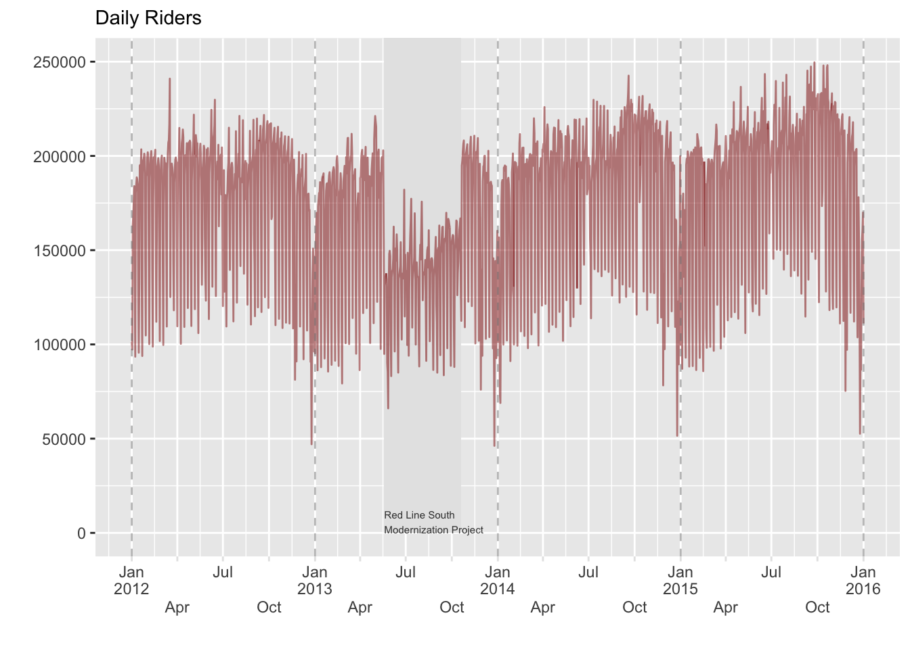

With the data ready to go, we are ready for modeling, so let’s get started!

## Classical Time Series

### Intro

Classical times series from an econometrics perspective often considers a error model that accounts for the correlation a current observation has with past observations. A traditional example is the so-called *autoregressive*, or *AR*, model, which lets a current observation be predicted by past observations up to a certain point. For example, would could start by just using the last observation to predict the current one. Next we extend this to predict the current based on the previous two observations, and so on. How many *lags* we use is part of the model exploration.

\\y_t = \alpha_1y\_{t-1} + \dots +\alpha\_{p}y\_{t-p} + \varepsilon_t\\

We can extend this to include not just past observations but also past residuals, called a *moving average*. So formally, our *ARMA* (p, q) model now looks like this for an observation \\y\\ at time \\t\\:

\\y_t = \alpha_1y\_{t-1} + \dots +\alpha\_{p}y\_{t-p} + (\varepsilon_t + \theta_1 \varepsilon\_{t-1} + \cdots +\theta_q \varepsilon\_{t-q})\\

We can also use [differencing](https://otexts.com/fpp3/stationarity.html), for example subtracting the previous time value from the current observation value for all values, to come to the final [*ARIMA* (p, d, q) model](https://en.wikipedia.org/wiki/Autoregressive_integrated_moving_average). See Hyndman and Athanasopoulos ([2021](#ref-Hyndman2021)) for more details.

### Model

Even base R comes with basic time series models such as this. However, as mentioned, we typically don’t know what to set the values of an ARIMA(p, d, q) to. A quick way to explore this is via the forecast package, which will search over the various hyperparameters and select one based on AIC. Note that fable, a package we will be using later, will also allow such an approach, and if you’d like to go ahead and start using it I show some commented code below.

``` r
model_arima = forecast::auto.arima(
  red_line_train$rides_scaled
)

# model_arima = red_line_train %>%
#   select(date, rides_scaled) %>%
#   tsibble::as_tsibble() %>%
#   fabletools::model(fable::ARIMA(
#     rides_scaled ~ 0 + PDQ(0,0,0),
#     stepwise = FALSE,
#     approximation = FALSE
#   ))
# fabletools::report(model_arima)
```

### Explore

In this case we have a selected AR of 3 and MA of 4 for the centered value. But looking at the predictions, we can see this is an almost useless result for any number of days out, and does little better than guessing.

``` r
broom::tidy(model_arima)
```

| term | estimate | std.error |
|:-----|---------:|----------:|
| ar1  |    0.238 |     0.048 |
| ar2  |   -0.285 |     0.035 |
| ar3  |    0.354 |     0.043 |
| ma1  |   -0.725 |     0.046 |
| ma2  |   -0.189 |     0.046 |
| ma3  |   -0.575 |     0.029 |
| ma4  |    0.552 |     0.025 |

``` r
# plot(acf(residuals(model_arima))) # weekly autocorrelation still exists

red_line_validate %>% 
  slice(1:30)  %>%
  mutate(pred = predict(model_arima, n.ahead = 30)$pred) %>%
  # mutate(pred = forecast(model_arima, h = 30)$.mean) %>%
  ggplot(aes(date, rides_scaled)) +
  geom_line(alpha = .25) +
  geom_line(aes(y = pred), alpha = .25, color = 'darkred')
```

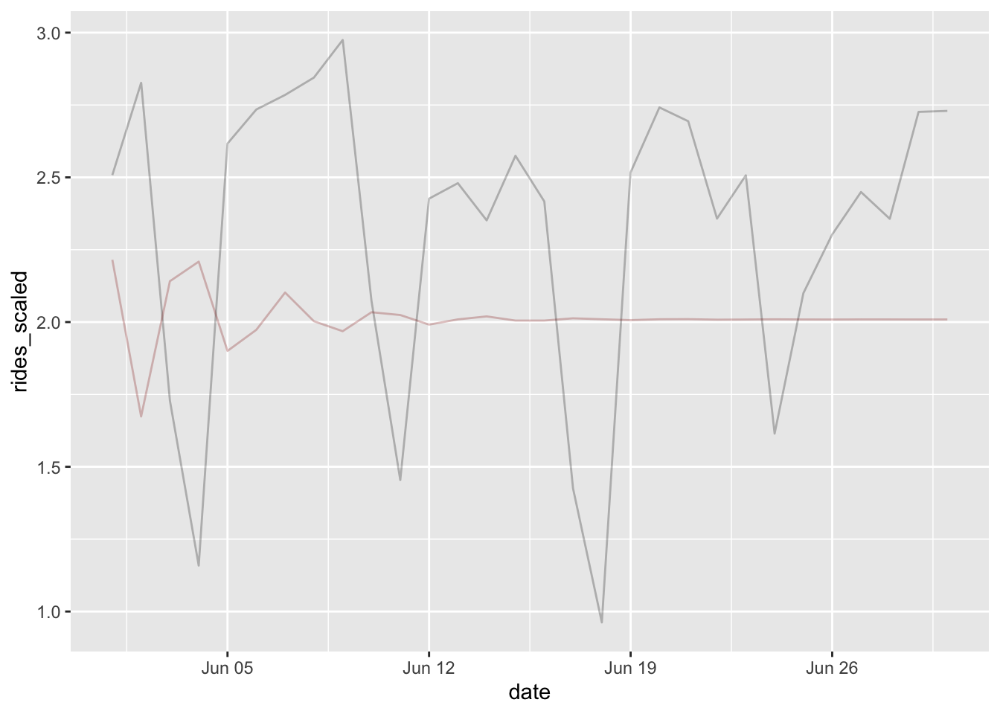

We’ll use yardstick to help us evaluate performance for this and subsequent models. In this case however, the visualization told us enough- a basic ARIMA isn’t going cut it.

``` r
library(yardstick)

# this function will be used for all subsequent models!
metric_score = metric_set(rmse, mae, rsq) 

# validation
data.frame(
  pred = predict(model_arima, newdata = red_line_validate, n.ahead = 30)$pred,
  observed = red_line_validate$rides_scaled[1:30]
) %>%
  metric_score(truth = observed, estimate = pred)
```

| .metric | .estimator | .estimate |
|:--------|:-----------|----------:|
| rmse    | standard   |     0.632 |
| mae     | standard   |     0.572 |
| rsq     | standard   |     0.132 |

One nice thing about the forecast package is that it can include additional features via the `xreg` argument, which is exactly what we need- additional information. Now our model looks something like this, where \\X\\ is our model matrix of features and \\\beta\\ their corresponding regression weights.

\\y_t = X_t\beta + \alpha_1y\_{t-1} + \dots +\alpha\_{p}y\_{t-p} + (\varepsilon_t + \theta_1 \varepsilon\_{t-1} + \cdots +\theta_q \varepsilon\_{t-q})\\

Adding these is not exactly straightforward, since it requires a matrix rather than a data frame, but this is not too big a deal once you are used to creating model matrices.

``` r
mm = model.matrix(
  ~ . - 1, 
  data = red_line_train %>% 
    select(is_weekend:is_sox_game, tmax_scaled, prcp_scaled, red_line_modernization)
)

model_arima_xreg = forecast::auto.arima(
  red_line_train$rides_scaled,
  max.p = 10,
  max.q = 10,
  xreg  = mm
)
```

| term                   | estimate | std.error |
|:-----------------------|---------:|----------:|
| ar1                    |   -0.444 |     0.018 |
| ar2                    |   -0.430 |     0.018 |
| ar3                    |   -0.370 |     0.019 |
| ar4                    |   -0.325 |     0.019 |
| ar5                    |   -0.312 |     0.019 |
| ar6                    |   -0.356 |     0.019 |
| ar7                    |    0.307 |     0.018 |
| ar8                    |   -0.051 |     0.017 |
| is_weekend             |   -1.154 |     0.023 |
| is_holiday             |   -1.045 |     0.021 |
| is_cubs_game           |    0.208 |     0.015 |
| is_sox_game            |    0.072 |     0.015 |
| tmax_scaled            |    0.085 |     0.011 |
| prcp_scaled            |   -0.031 |     0.004 |
| red_line_modernization |   -0.550 |     0.131 |

This is looking much better! We can also see how notably different the ARMA structure is relative to the previous model. We also see that adding weekend and holiday effects result in a huge drop in ridership as expected, while baseball games and good weather will lead to an increase.

In the following code, we create a model matrix similar to the training data that we can feed into the predict function. The forecast package also offers a glance method if desired.

``` r
nd = red_line_validate %>%
  select(is_weekend:is_sox_game, tmax_scaled, prcp_scaled, red_line_modernization) %>% 
  model.matrix( ~ . - 1, data = .)

preds = predict(model_arima_xreg, newxreg = nd, n.ahead = nrow(red_line_validate))$pred
```

``` r
p_arima_red = red_line_validate %>% 
  mutate(pred = preds) %>% 
  ggplot(aes(date, rides_scaled)) +
  geom_line(alpha = .25) +
  geom_line(aes(y = pred), alpha = .25, color = 'red') +
  labs(x = '', y = 'Rides (scaled)', subtitle = 'ARIMA')

p_arima_red
```

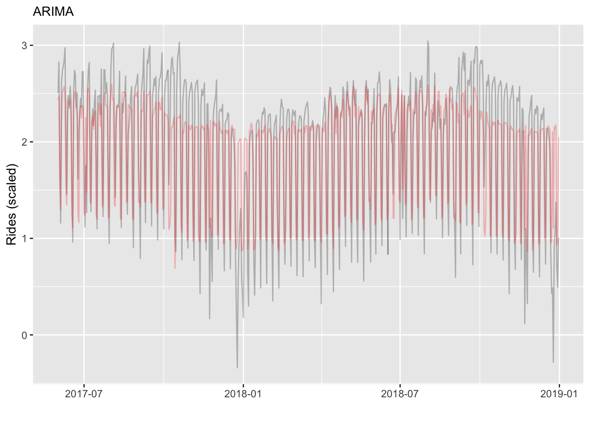

And here we can see performance is notably improved (restrict to first 30 obs for a direct comparison to the previous).

| .metric | .estimator | .estimate |
|:--------|:-----------|----------:|
| rmse    | standard   |     0.371 |
| mae     | standard   |     0.282 |
| rsq     | standard   |     0.747 |

## Mixed model with AR Structure

### Intro

More generally, we can think of that original AR error as a random effect, such that after the linear predictor is constructed, we add a random effect based on the correlation structure desired, in this case, autoregressive. In the mixed model setting, it is actually quite common to use an AR residual structure within a cluster or group, and here we can do so as well, as the data is naturally grouped by line.

To make this a bit more clear, we can state the AR effect more formally as follows for a single line at time \\t\\:

\\z_t \sim N(0, \Sigma\_{ar})\\ \\\Sigma\_{ar} = cov(z(s), z(t)) = \sigma^2\exp(-\theta\|t-s\|)\\

Where t,s are different time points, e.g. within a line.

If we were to simulate it for 4 time points, with autocovariance value of .5, we could do so as follows[^3].

``` r
n_clusters   = 1
n_timepoints = 4
mu  = 0
var = 1  # not actually used if the value is 1
S = .5^as.matrix(dist(1:n_timepoints))

S

z = MASS::mvrnorm(mu = rep(mu, n_timepoints), Sigma = S)

z
```

And here is our typical model with a single random effect, e.g. for line:

\\ y\_{tl} \sim X\beta + z^{line}\_{l} + e\_{tl}\\ \\\textrm{z}\_{l} \sim N(0, \sigma_l^2)\\ \\\epsilon \sim N(0, \sigma_e^2)\\

The X may be at either line or observation level, and potentially the \\\beta\\ could vary by line.

Putting it all together, we’re just adding the AR random effect to the standard mixed model for a single line.

\\ y\_{tl} \sim X\beta + z^{ar}\_t +z^{line}\_{l} + e\_{tl}\\

### Data Prep

So let’s try this! First some minor data prep to add holidays.

``` r
df_train_mixed = df_train %>% 
  mutate(date = as.numeric(date)) %>% 
  left_join(holidays, by = c('date' = 'ds', 'year' = 'year')) %>% 
  mutate(holiday = factor(ifelse(is.na(holiday), '0', as.character(holiday))))

df_validate_mixed = df_validate %>% 
  mutate(date = as.numeric(date)) %>% 
  left_join(holidays, by = c('date' = 'ds', 'year' = 'year')) %>% 
  mutate(holiday = factor(ifelse(is.na(holiday), '0', as.character(holiday))))
```

### Model

For the model, we can now easily think of it as we do other standard modeling scenarios. Along with standard features, we’ll add random effects for line, day, day x line interaction, etc. Finally we also add an AR random effect. For each line, we have an autoregressive structure for days, such that days right next to each other are correlated, and this correlation tapers off as days are further apart. This is not our only option, but seems straightforward to me.

Depending on what you include in the model, you may have convergence issues, so feel free to reduce the complexity if needed. For example, most of the day effect is captured by weekend vs. not, and a by line year trend wasn’t really necessary. In addition, the way the AR random effect variance is estimated as noted above, this essentially captures the line intercept variance.

``` r
model_mixed = 
  rides_scaled ~ 
  is_weekend +
  is_cubs_game +
  is_sox_game +
  tmax_scaled + 
  prcp_scaled + 
  snow_scaled +
  # year_day +
  ar1(0 + day|line) +     # the 0 + is a nuance of tmb's approach
  (1|holiday) +           # as RE with all holidays instead of just holiday vs. not
  (1|year) +     
  (1 | red_line_modernization:line) +  # the project shifted ridership from red to other lines
  # (1|day) #+ 
  # (1|line) +
  (1|day:line) #+
  # (1 + year_day|line)

library(glmmTMB)

fit_mixed = glmmTMB(model_mixed, data = df_train_mixed)
```

### Explore

The mixed model approach is nice because it is highly interpretable. We get both standard regression coefficients, and variance components to help us understand how the rest of the variance breaks down. For example, I would interpret the following that that line and weekend are the biggest contributors to the variability seen, and that we have high autocorrelation, as expected.

``` r
library(mixedup)

summarise_model(fit_mixed, digits = 4)

extract_cor_structure(fit_mixed, which_cor = 'ar1')
```

We can visually inspect how well it matches the data. In the following the colored lines are the predictions, while the observed is gray. It looks like performance tapers for more recent time periods, and holiday effects are not as prevalent for some lines (e.g. yellow). The latter could be helped by adding a `holiday:line` random effect.

``` r
library(glmmTMB)

p_mixed = df_validate_mixed %>% 
  droplevels() %>% 
  mutate(pred = predict(fit_mixed, newdata = ., allow.new.levels=TRUE)) %>%
  mutate(date = as_date(date)) %>% 
  ggplot(aes(date, rides_scaled)) +
  geom_line(alpha = .1) +
  geom_line(aes(y = pred, color = I(colors)), alpha = .25) +
  facet_grid(rows = vars(line), scales = 'free_y') +
  labs(x = '', y = 'Rides (scaled)', subtitle = 'Mixed')

p_mixed
```

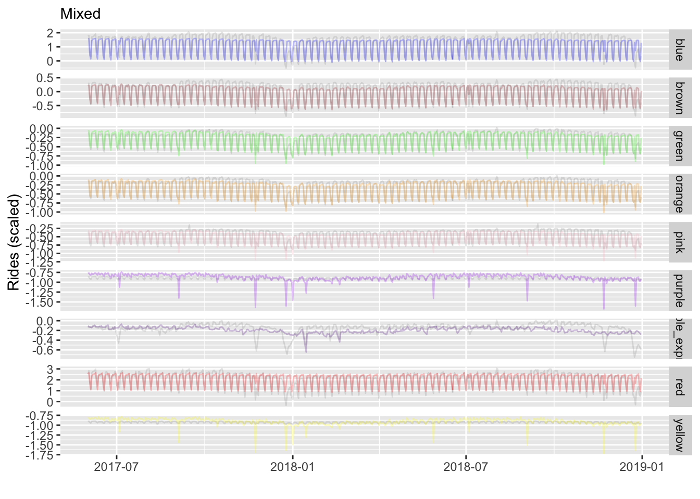

As before we can measure performance via yardstick. This model does appears to do very well.

``` r
# validation
data.frame(
  pred = predict(fit_mixed, newdata = df_validate_mixed, allow.new.levels = TRUE),
  observed = df_validate_mixed$rides_scaled
) %>%
  metric_score(truth = observed, estimate = pred)
```

| .metric | .estimator | .estimate |
|:--------|:-----------|----------:|
| rmse    | standard   |     0.189 |
| mae     | standard   |     0.110 |
| rsq     | standard   |     0.965 |

For more on autocorrelation structure in the mixed model setting, [see my mixed model document here](https://m-clark.github.io/mixed-models-with-R/extensions.html#autocorrelation)[^4].

## Generalized Additive Models

### Intro

We can generalize mixed models even further to incorporate nonlinear components, which may include cyclic or other effects. Such models are typically referred to as [generalized additive models](https://m-clark.github.io/generalized-additive-models/) (GAMs). AR processes themselves can be seen as a special case of [gaussian processes](http://www.gaussianprocess.org/), which can potentially be approximated via GAMs. As GAMs can accommodate spatial, temporal, nonlinear, and other effects, they are sometimes more generally referred to as *structured additive regression models*, or STARs.

### Data Prep

The data prep for the GAM is the same as with the mixed model, so we’ll just use that data.

``` r
df_train_gam = df_train_mixed

df_validate_gam = df_validate_mixed
```

### Model

With data in place we are ready to conduct the model. We have numerous options for how we’d like to take this. However, as an example, I tried various smooths, but didn’t really see much difference, which is actually a good thing. For any further improvements we’d likely have to tweak the core model itself. I also use bam for a quicker result, but this isn’t really necessary, as it didn’t even take a minute to run with standard gam. As with the mixed model, we will use holiday as a random effect, but we add the holiday by line interaction since we saw that need. In addition, our year-day by line interaction should help some with the tailing off of more recent predictions.

``` r
library(mgcv)

# for year, use year (numeric) or use year_fac, but for latter, it will not be
# able to predict any year not in the training data unless you use
# drop.unused.levels.
model_gam = 
  rides_scaled ~ 
  is_weekend +
  is_cubs_game +
  is_sox_game +
  s(tmax_scaled) + 
  s(prcp_scaled) + 
  s(snow_scaled) +
  s(red_line_modernization, line, bs = 're') +
  s(holiday,  bs = 're') +
  s(holiday, line,  bs = 're') +
  s(year_fac, bs = 're') +      
  s(day,  bs = 're') + 
  s(line, bs = 're') + 
  s(line, day, bs = 're') + 
  s(year_day, by = line, bs = c('ds', 'fs'))


# will take a while!
# fit_gam = gam(
#   model_gam, 
#   data     = df_train_gam,
#   drop.unused.levels = FALSE, 
#   method   = "REML"
# )

# fast even without parallel
fit_gam = bam(
  model_gam, 
  data     = df_train_gam,
  drop.unused.levels = FALSE, 
  method   = "fREML",
  discrete = TRUE     # will fit the model in a second rather than a couple seconds
  # nthreads = 8,     # this option assumes a cluster is available. not necessary for this.
)
```

### Explore

As with glmmTMB, I use a custom function to summarize the model, or extract different components from it. From the initial glance we can see things that we expect (e.g. line and weekend effects are large).

``` r
mixedup::summarise_model(fit_gam)
```


    Variance Components:

                           Group                 Effect Variance   SD SD_2.5
                     tmax_scaled              Intercept     0.01 0.09   0.04
                     prcp_scaled              Intercept     0.00 0.01   0.00
                     snow_scaled              Intercept     0.00 0.01   0.00
                            line red_line_modernization     0.09 0.31   0.19
                         holiday              Intercept     0.05 0.22   0.14
                         holiday                   line     0.04 0.21   0.18
                        year_fac              Intercept     0.00 0.06   0.04
                             day              Intercept     0.00 0.00   0.00
                            line              Intercept     0.49 0.70   0.42
                            line                    day     0.05 0.22   0.18
               year_day:lineblue              Intercept     0.00 0.00   0.00
              year_day:linebrown              Intercept     0.00 0.00   0.00
              year_day:linegreen              Intercept     0.00 0.00   0.00
             year_day:lineorange              Intercept     0.00 0.00   0.00
               year_day:linepink              Intercept     0.00 0.00   0.00
             year_day:linepurple              Intercept     0.00 0.00   0.00
     year_day:linepurple_express              Intercept     0.00 0.00   0.00
                year_day:linered              Intercept     0.00 0.00   0.00
             year_day:lineyellow              Intercept     0.00 0.00   0.00
                        Residual                     NA     0.02 0.13   0.13
          SD_97.5 Var_prop
     2.100000e-01     0.01
     2.000000e-02     0.00
     2.000000e-02     0.00
     4.900000e-01     0.13
     3.300000e-01     0.06
     2.400000e-01     0.06
     1.000000e-01     0.01
     4.162009e+69     0.00
     1.150000e+00     0.65
     2.700000e-01     0.06
     0.000000e+00     0.00
     0.000000e+00     0.00
     0.000000e+00     0.00
     0.000000e+00     0.00
     0.000000e+00     0.00
     0.000000e+00     0.00
     0.000000e+00     0.00
     0.000000e+00     0.00
     0.000000e+00     0.00
     1.300000e-01     0.02


    Fixed Effects:

             Term Value   SE     t P_value Lower_2.5 Upper_97.5
        Intercept -0.28 0.24 -1.14    0.25     -0.76       0.20
       is_weekend -0.54 0.06 -8.27    0.00     -0.66      -0.41
     is_cubs_game  0.04 0.00 13.81    0.00      0.03       0.04
      is_sox_game  0.01 0.00  3.81    0.00      0.00       0.02

Now we can visualize test predictions broken about by line. The greater flexibility of the GAM for fixed and other effects allows it to follow the trends more easily than the standard linear mixed model approach.

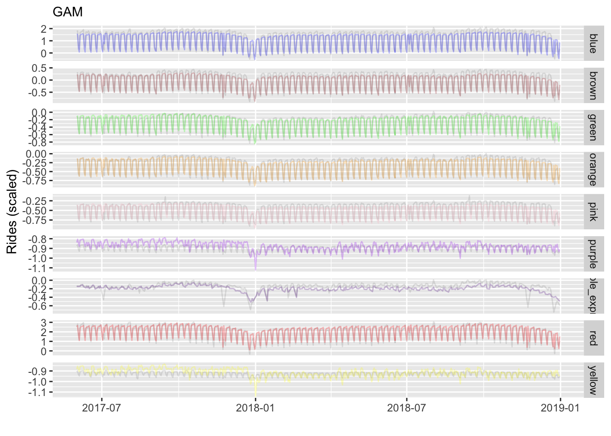

We can also see improvement over our standard mixed model approach, and our best performance yet.

| .metric | .estimator | .estimate |
|:--------|:-----------|----------:|
| rmse    | standard   |     0.140 |
| mae     | standard   |     0.087 |
| rsq     | standard   |     0.981 |

## Prophet

### Intro

*Prophet* is an approach from Facebook that uses Stan to estimate a time series model taking various trends, seasonality, and other factors under consideration. By default, it only uses Stan for optimization (e.g. via ‘BFGS’), but you can switch to fully Bayesian if desired, and take advantage of all that the Bayesian approach has to offer.

### Data Prep

The prophet package in R takes some getting used to. We have to have specific names for our variables, and unfortunately have to do extra work to incorporate categorical features. We can use recipes (like yardstick, part of the tidymodels ’verse) to set up the data (e.g. one-hot encoding).

``` r
library(prophet)
library(recipes)

df_train_prophet = df_train %>% 
  arrange(date, line) %>% 
  rename(y  = rides_scaled,
         ds = date)

rec = recipes::recipe(~., df_train_prophet)

df_train_prophet = rec %>% 
  step_dummy(line, one_hot = TRUE, keep_original_cols = TRUE) %>% 
  prep(training = df_train_prophet) %>% 
  bake(new_data = df_train_prophet) %>% 
  rename_with(.cols = starts_with('line_'), str_remove, 'line_')

df_validate_prophet = df_validate %>% 
  arrange(date, line)%>%
  rename(ds = date, y = rides_scaled)

rec = recipe(~., df_validate_prophet)

df_validate_prophet = rec %>% 
  step_dummy(line, one_hot = TRUE, keep_original_cols = TRUE) %>% 
  prep(training = df_train_prophet) %>% 
  bake(new_data = df_validate_prophet) %>% 
  rename_with(.cols = starts_with('line_'), str_remove, 'line_')
```

### Model

With data in place, we are ready to build the model. Note that later we will compare results to fable.prophet, which will mask some of the functions here, or vice versa depending on which you load first. I would suggest only doing the prophet model, or only doing the fable model, rather than trying to do both at the same time, to avoid any mix-up.

After setting up the model, you have to add additional features in separate steps. Prophet has a nice way to incorporate holidays though. When you run this model, you may have to wait for a minute or so.

``` r
# use prophet::prophet in case you have fable.prophet loaded also
model_prophet = prophet::prophet(
  holidays = generated_holidays %>% filter(country == 'US'),
  yearly.seasonality = FALSE,
  seasonality.mode = "multiplicative",
  changepoint.prior.scale = .5
)

line_names = c(
  'blue',
  'brown',
  'green',
  'orange',
  'pink',
  'purple',
  'purple_express',
  'red',
  'yellow'
)

predictors = c(
  'is_weekend',
  'is_cubs_game',
  'is_sox_game',
  # 'is_holiday',
  'tmax_scaled',
  'prcp_scaled',
  'snow_scaled',
  line_names
)

for (i in predictors) {
  model_prophet = add_regressor(model_prophet, i, standardize = FALSE, mode = 'additive')
}

model_prophet = add_country_holidays(model_prophet, country_name = 'US')

fit_prophet = fit.prophet(model_prophet, df = df_train_prophet)

forecast = predict(fit_prophet, df_validate_prophet)
```

### Explore

We now visualize predictions as we did with the [GAM](#generalized-additive-models). But one of the nice things with prophet is that you can plot the various parts of the model results via the plot method or prophet_plot_components (not shown). Unfortunately, our baseline effort seems to undersmooth our more popular lines (blue, red), and overreacts to some of the others (purple, yellow). This is because it’s not really changing the predictions according to line.

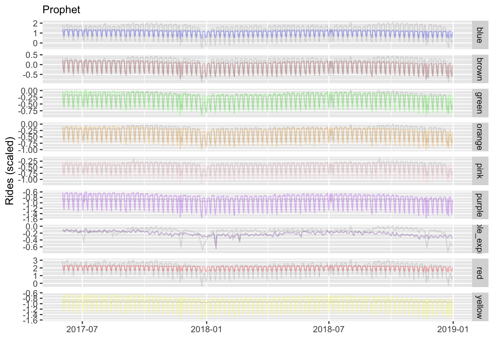

We can also assess performance as before, but note that prophet has it’s own cross-validation capabilities which would be better to utilize if this was your primary tool. Between the previous visualization and these metrics, our first stab doesn’t appear to do as well as the GAM, so you might like to go back and tweak things.

| .metric | .estimator | .estimate |
|:--------|:-----------|----------:|
| rmse    | standard   |     0.280 |
| mae     | standard   |     0.198 |
| rsq     | standard   |     0.925 |

## Fable

### Intro

I came across fable.prophet as a possibly easier way to engage prophet. It is an extension of fable and related packages, which are very useful for time series processing and analysis. Note that it is 0.1.0 version development, and hasn’t had much done with it in the past year, so your mileage may vary with regard to utility by the time you read this[^5]. But with it we can specify the model in more of an R fashion, and we now don’t have as much data pre-processing.

### Data Prep

One key difference using fable.prophet is that it works with `tsibble` objects, and thus must have unique date observations. We can do this by setting `line` as the key[^6].

``` r
library(fable.prophet)

df_train_fable = df_train_prophet %>% 
  as_tsibble(index = ds, key = line)

df_validate_fable = df_validate_prophet %>% 
  as_tsibble(index = ds, key = line)

holidays_fable = holidays %>% 
  filter(country == 'US') %>% 
  mutate(ds = as_date(ds)) %>% 
  as_tsibble()
```

### Model

Beyond this we use functions within our formula to set the various components. With line as the key, fable is actually running separate prophet models for each line, and we can do so in parallel if desired.

``` r
model_prophet = fable.prophet::prophet(
  y ~ 
    growth('linear', changepoint_prior_scale = 0.5) +
    season("week", type = "multiplicative") +
    holiday(holidays_fable) +
    xreg(
      is_weekend,
      is_cubs_game,
      is_sox_game,
      # is_holiday,
      tmax_scaled,
      prcp_scaled,
      snow_scaled
    ) 
)

# library(future)
# plan(multisession)

# furrr is used under the hood, and though it wants a seed, it doesn't
# automatically use one so will give warnings. I don't think it can be passed
# via the model function, so expect to see ignorable warnings (suppressed here).

fit_fable = model(df_train_fable, mdl = model_prophet)

forecast_fable = fit_fable %>% 
  forecast(df_validate_fable) 

# plan(sequential)
```

### Explore

With fable.prophet visualization, we have the more automatic plots, but again we’ll stick with the basic validation plot we’ve been doing.

``` r
components(fit_fable)
components(fit_fable) %>%
  autoplot()
forecast_fable %>%
  autoplot(level = 95, color = '#ff5500')
```

This model does well, and better than basic prophet, but we can see its limitations, for example, with the yellow line, and more recent ridership in general.

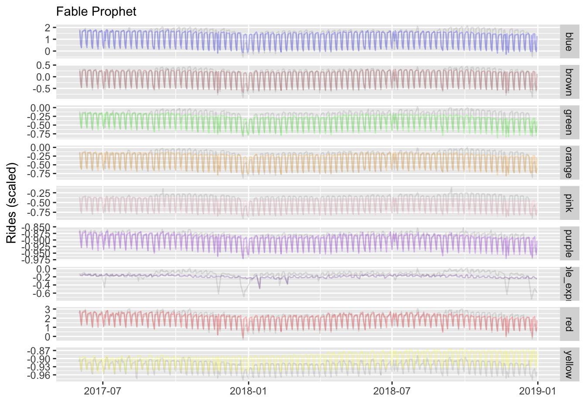

And we check performance as before. The fable model is doing almost as well as our [GAM](#generalized-additive-models) approach did.

| .metric | .estimator | .estimate |
|:--------|:-----------|----------:|
| rmse    | standard   |     0.154 |
| mae     | standard   |     0.092 |
| rsq     | standard   |     0.979 |

One nice thing about the fable approach is its internal performance metrics, which are easily obtained. It will give us results for each line[^7], validation data results shown. We see that we have more error for the popular lines as before, but in terms of percentage error, the other lines are showing more difficulty. You can find out more about the additional metrics available [here](https://otexts.com/fpp3/accuracy.html).

``` r
accuracy(fit_fable)
accuracy(forecast_fable, df_validate_fable)
```

| .model | line           | .type |     ME |  RMSE |   MAE |      MPE |    MAPE |  ACF1 |
|:-------|:---------------|:------|-------:|------:|------:|---------:|--------:|------:|
| mdl    | blue           | Test  |  0.083 | 0.251 | 0.180 |  -27.007 |  62.199 | 0.641 |
| mdl    | brown          | Test  |  0.001 | 0.126 | 0.084 |  -31.034 |  88.711 | 0.621 |
| mdl    | green          | Test  |  0.088 | 0.118 | 0.100 | -105.627 | 112.000 | 0.660 |
| mdl    | orange         | Test  |  0.035 | 0.084 | 0.063 |  -43.228 |  60.244 | 0.638 |
| mdl    | pink           | Test  |  0.058 | 0.089 | 0.072 |  -18.386 |  20.452 | 0.675 |
| mdl    | purple         | Test  |  0.006 | 0.012 | 0.009 |   -0.633 |   0.982 | 0.503 |
| mdl    | purple_express | Test  |  0.049 | 0.107 | 0.083 |  -41.459 | 218.861 | 0.752 |
| mdl    | red            | Test  |  0.045 | 0.297 | 0.211 |   -3.003 |  14.880 | 0.598 |
| mdl    | yellow         | Test  | -0.027 | 0.030 | 0.027 |    2.892 |   2.912 | 0.726 |

The fable results suggests what we already knew from our [GAM](#generalized-additive-models) and [mixed model](#mixed-model-with-ar-structure) approach, that interactions of the series with line are important. We weren’t easily able to do this with the default prophet (it would likely require adding time x line interaction regresssors), so it’s nice that we have the option here.

## GBM

### Intro

This part is actually new from when I first wrote up this post over a year ago. I basically wanted to test if a boosting approach would work decently out of the box without doing anything special regarding the structure of the data. I don’t add it to the summary visualizations, but provide the standard results here.

### Data Prep

I’ll use lightgbm which I’ve been increasingly using of late. It requires a matrix object for input, and so some additional processing as well.

``` r
library(lightgbm)

# lightgbm only accepts a matrix input
df_train_lgb_init = df_train %>% 
  select(
    rides_scaled,
    is_weekday,
    is_holiday,
    is_cubs_game,
    is_sox_game,
    tmax_scaled,
    prcp_scaled,
    line, 
    red_line_modernization,
    year,
    month,
    year_day
  ) %>% 
  mutate(
    line = as.integer(line),
    month = as.integer(month)
  )

X_train = as.matrix(df_train_lgb_init %>% select(-rides_scaled))

X_test  = df_validate %>% 
  select(
    is_weekday,
    is_holiday,
    is_cubs_game,
    is_sox_game,
    tmax_scaled,
    prcp_scaled,
    line, 
    red_line_modernization,
    year,
    month,
    year_day
  ) %>% 
  mutate(
    line = as.integer(line),
    month = as.integer(month)
  ) %>% 
  as.matrix()


df_train_lgb = lgb.Dataset(
  X_train,
  label = df_train_lgb_init$rides_scaled,
  categorical_feature = c(
    'is_weekday',
    'is_holiday',
    'is_cubs_game',
    'is_sox_game',
    'line',
    'year',
    'month'
  )
)

df_test_lgb  = lgb.Dataset.create.valid(
  df_train_lgb, 
  X_test,
  label = df_validate$rides_scaled
)
```

### Model

Typically we would perform some sort of search over the (many) parameters available to tweak with lightgbm, like the number of trees, learning rate, regularizer parameters and more. I ignore that, but I did fiddle with the learning rate and bumped up the `nrounds` (trees), but that’s it.

``` r
params = list(
  objective       = "regression"
  , metric        = "l2"
  , min_data      = 10L
  , learning_rate = .01
)

fit_gbm = lgb.train(
  params    = params
  , data    = df_train_lgb
  , nrounds = 2000L
)
```

### Explore

Some may be surprised at how well this does, but regular users of boosting probably are not. We didn’t have to do much and it’s already the best performing model.

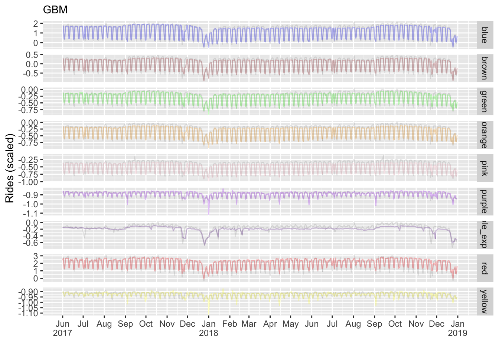

| .metric | .estimator | .estimate |
|:--------|:-----------|----------:|
| rmse    | standard   |     0.130 |
| mae     | standard   |     0.076 |
| rsq     | standard   |     0.984 |

## Torch

At this point we have a collection of models that are still relatively interpretable, and mostly within our standard regression model framework. It’s good to see them able to perform very well without too much complexity. However, we still have other methods available that would be more computationally demanding, are more opaque in operations, but which would potentially provide the most accurate forecasts. For this we turn to using PyTorch, which is now available via the torch package in R[^8].

In using torch, we’re going to follow the [demo series at the RStudio AI blog](https://blogs.rstudio.com/ai/posts/2021-03-19-forecasting-time-series-with-torch_4/) [^9]. It shows in four parts how to use a *recurrent neural network*. In their example, they use a data set for a single series with (summarized) daily values, similar to our daily counts here. We will use the final model demonstrated in the series, a soi disant *seq2seq* model that includes an *attention* mechanism. More detail can be found [here](https://www.deeplearningbook.org/contents/rnn.html). The conceptual gist of the model can be described as taking a set of time points to predict another set of future time points, and doing so for all points in the series.

To be clear, they only use a single series, no other information (e.g. additional regressors). So we will do the same, coming full circle to what we started out with, just looking at daily ridership- a single time series for the red line.

### Data

As usual we’ll need some data prep, both for initial training-test split creation, but also specifically for usage with Torch.

``` r
library(tsibble)
library(lubridate)
library(torch)


df_train_torch = df_train %>%
  filter(line == 'red', year < 2017) %>%
  pull(rides_scaled) %>%
  as.matrix()

df_validate_torch = df_validate %>%
  filter(line == 'red', year >= 2017) %>%
  pull(rides_scaled) %>%
  as.matrix()

df_test_torch = df_validate %>%
  filter(line == 'red', date > '2017-12-24') %>%
  pull(rides_scaled) %>%
  as.matrix()

train_mean = mean(df_train_torch)
train_sd   = sd(df_train_torch)
```

### Torch data

For our data, we will use a week behind lag to predict the following week. This seems appropriate for this problem, but for any particular time series problem we’d want to probably think hard about this and/or test different settings.

``` r
n_timesteps = 7    # we use a week instead of 14 days in original blog
n_forecast  = 7    # look ahead one week
```

``` r
cta_dataset <- dataset(
  name = "cta_dataset",

  initialize = function(x, n_timesteps, sample_frac = 1) {

    self$n_timesteps <- n_timesteps
    self$x <- torch_tensor((x - train_mean) / train_sd)

    n <- length(self$x) - self$n_timesteps - 1

    self$starts <- sort(sample.int(
      n = n,
      size = n * sample_frac
    ))

  },

  .getitem = function(i) {

    start <- self$starts[i]
    end <- start + self$n_timesteps - 1
    lag <- 1

    list(
      x = self$x[start:end],
      y = self$x[(start+lag):(end+lag)]$squeeze(2)
    )

  },

  .length = function() {
    length(self$starts)
  }
)

batch_size = 32

train_ds = cta_dataset(df_train_torch, n_timesteps)
train_dl = dataloader(train_ds, batch_size = batch_size, shuffle = TRUE)

valid_ds = cta_dataset(df_validate_torch, n_timesteps)
valid_dl = dataloader(valid_ds, batch_size = batch_size)

test_ds  = cta_dataset(df_test_torch, n_timesteps)
test_dl  = dataloader(test_ds, batch_size = 1)
```

### Model

I leave it to the [blog](https://blogs.rstudio.com/ai/posts/2021-03-19-forecasting-time-series-with-torch_4/#attention-module) for details, but briefly, there are four components to the model:

- **Encoder**: takes input, and produces outputs and states via RNN
- **Decoder**: takes the last predicted value as input and current context to make a new prediction
- **Seq2Seq**: essentially encodes once, and calls the decoder in a loop
- **Attention**: allows output from the encoder at a specific time point to provide ‘context’ for the decoder

``` r
net =
  seq2seq_module(
    "gru",
    input_size     = 1,
    hidden_size    = 32,
    attention_type = "multiplicative",
    attention_size = 8,
    n_forecast     = n_forecast
  )

b = dataloader_make_iter(train_dl) %>% dataloader_next()

net(b$x, b$y, teacher_forcing_ratio = 1)
```

### Training

With data in place, we’re ready to train the model. For the most part, not much is going on here that would be different from other deep learning situations, e.g. choosing an optimizer, number of epochs, etc. We’ll use mean squared error as our loss, and I create an object to store the validation loss over the epochs of training. I played around with it a bit, and you’re probably not going to see much improvement after letting it go for 100 epochs.

``` r
optimizer = optim_adam(net$parameters, lr = 0.001)

num_epochs = 100

train_batch <- function(b, teacher_forcing_ratio) {

  optimizer$zero_grad()
  output <- net(b$x, b$y, teacher_forcing_ratio)
  target <- b$y

  loss <- nnf_mse_loss(output, target[ , 1:(dim(output)[2])])
  loss$backward()
  optimizer$step()

  loss$item()

}

valid_batch <- function(b, teacher_forcing_ratio = 0) {

  output <- net(b$x, b$y, teacher_forcing_ratio)
  target <- b$y

  loss <- nnf_mse_loss(output, target[ , 1:(dim(output)[2])])

  loss$item()

}


all_valid_loss = c()

for (epoch in 1:num_epochs) {

  net$train()
  train_loss <- c()

  coro::loop(for (b in train_dl) {
    loss <- train_batch(b, teacher_forcing_ratio = 0.0)
    train_loss <- c(train_loss, loss)
  })

  cat(sprintf("\nEpoch %d, training: loss: %3.5f \n", epoch, mean(train_loss)))

  net$eval()
  valid_loss <- c()

  coro::loop(for (b in valid_dl) {
    loss <- valid_batch(b)
    valid_loss <- c(valid_loss, loss)
  })
  
  all_valid_loss = c(all_valid_loss, mean(valid_loss))

  cat(sprintf("\nEpoch %d, validation: loss: %3.5f \n", epoch, mean(valid_loss)))
}
```

### Evaluations

``` r
net$eval()

test_preds = vector(mode = "list", length = length(test_dl))

i = 1

coro::loop(for (b in test_dl) {

  if (i %% 100 == 0)
    print(i)

  output <- net(b$x, b$y, teacher_forcing_ratio = 0)
  preds <- as.numeric(output)

  test_preds[[i]] <- preds
  i <<- i + 1
})
```

For this visualization, we do things a little different. In our current setup, we have 7 timesteps predicting 7 day windows. We started our test set at the beginning of December so that the first prediction is January first, and then proceeds accordingly.

``` r
# same as test
df_eval_torch = df_validate %>%
  filter(line == 'red', date > '2017-12-01') %>%
  select(rides_scaled, date) %>%
  as_tsibble()

test_preds_plot = vector(mode = "list", length = length(test_preds))

for (i in 1:(length(test_preds_plot)-  n_forecast)) {
  test_preds_plot[[i]] =
    data.frame(
      pred = c(
        rep(NA, n_timesteps + (i - 1)),
        test_preds[[i]] * train_sd + train_mean,
        rep(NA, nrow(df_eval_torch) - (i - 1) - n_timesteps - n_forecast)
      )
    )
}

df_eval_torch_plot0 =
  bind_cols(df_eval_torch, bind_cols(test_preds_plot))
```

A visualization of the predictions makes this more clear. Each 7 day segment is making predictions for the next 7 days. The following predictions are for the last two months, with each column a set of 7 predictions for that time point.

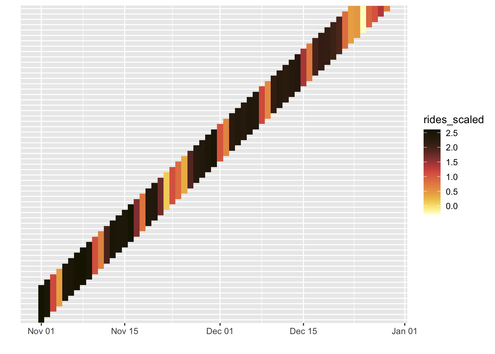

So for our red line plot, we’ll just use the average prediction at each date to make it comparable to the other plots. In general it looks to be doing okay, even armed with no contextual information. Certainly better than the base ARIMA plot.

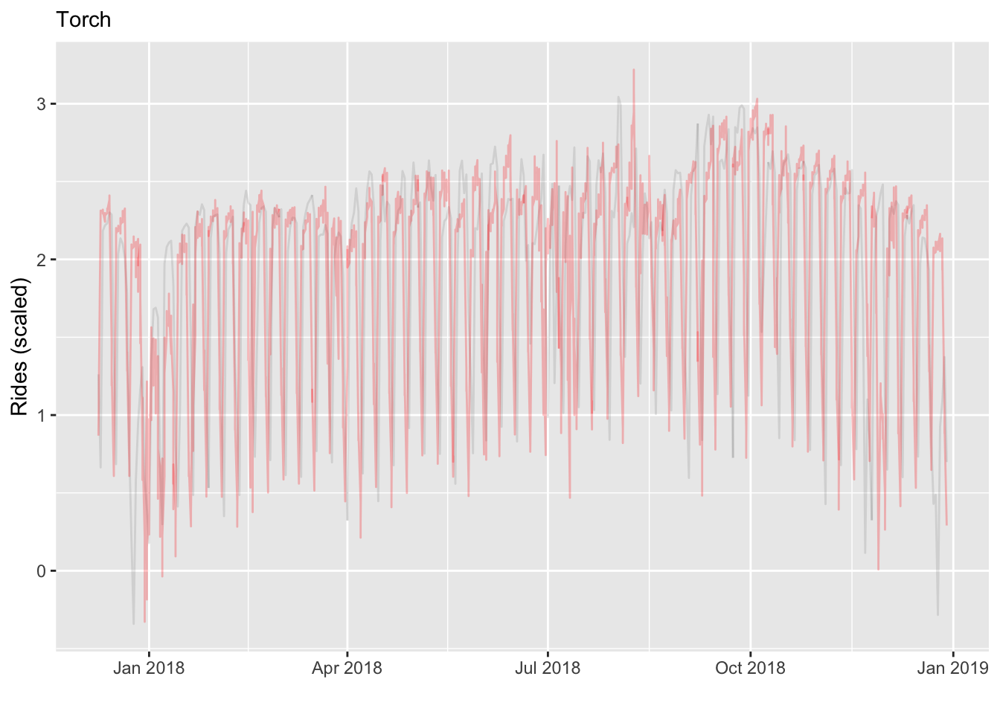

However, we can see that there is much information lost just adhering to the series alone.

| .metric | .estimator | .estimate |
|:--------|:-----------|----------:|
| rmse    | standard   |     0.804 |
| mae     | standard   |     0.584 |
| rsq     | standard   |     0.120 |

## All

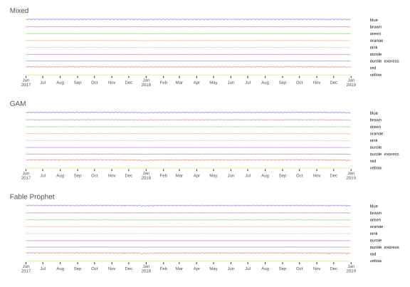

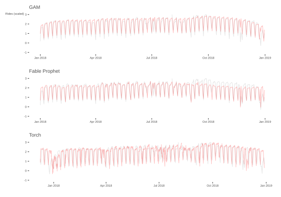

## Summary

- ARIMA: no real reason to still be doing such a simplified model
- Mixed Model: may be just what you need, but may lack in other settings
- GAM: great, more viable than some might suspect, easy implementation
- Prophet/Fable: Prophet needs notable work out of the box, though Fable saves you some of that work, and did great in this situation via by-group models
- GBM: can it really be this easy?
- Torch: pretty good even with minimal information

To get some information on what Torch would do at the next level, i.e. adding additional features and other considerations, see [Cody’s post](https://www.strong.io/blog/forecasting-public-transport-utilization-in-chicago).

## References

Hyndman, R. J., and G. Athanasopoulos. 2021. *Forecasting: Principles and Practice*. 3rd ed. <https://OTexts.com/fpp3>.

West, Brady T, Kathleen B Welch, and Andrzej T Galecki. 2022. *Linear Mixed Models: A Practical Guide Using Statistical Software*. Crc Press.

## Footnotes

## Reuse

[CC BY-SA 4.0](https://creativecommons.org/licenses/by-sa/4.0/)

## Citation

BibTeX citation:

``` quarto-appendix-bibtex
@online{clark2022,
  author = {Clark, Michael},
  title = {Exploring {Time}},
  date = {2022-08-10},
  url = {https://m-clark.github.io/posts/2021-05-time-series/},
  langid = {en}
}
```

For attribution, please cite this work as:

Clark, Michael. 2022. “Exploring Time.” August 10. <https://m-clark.github.io/posts/2021-05-time-series/>.

[^1]: There is also the Purple express line, which is very irregular compared to the others.

[^2]: Technically we should scale the test set using the mean/sd of the training set, and though with very large data this should not matter, for time series it’s a particular concern as data can ‘shift’ over time.

[^3]: This follows [Bolker’s demo](https://cran.r-project.org/web/packages/glmmTMB/vignettes/covstruct.html).

[^4]: I always appreciated the depiction of this topic in West et al. ([2022](#ref-west2022)) quite a bit.

[^5]: A year plus later after that statement, it still hasn’t gone beyond 0.1.0, so I don’t think this will continue to be useful for very long. Unfortunate, but honestly, it’s not clear prophet\</span itself can do much better than many other tools.

[^6]: fable.prophet may have a bug enabling the holidays functionality with parallel, so you can just use the original holiday column if you do so (single core doesn’t take too long).

[^7]: We can also do this with our previous method with a split-by-apply approach. You would obtain the same results, so this serves as a nice supplement to our ‘overall’ metrics.

[^8]: For the basics of using PyTorch via R, including installation, see [the RStudio](https://blogs.rstudio.com/ai/posts/2020-09-29-introducing-torch-for-r/) post.

[^9]: The blog code actually has several issues, but the [github repo](https://github.com/mlverse/torchbook_materials/blob/master/scripts/rnn_attention.R) should work fine and is what is followed for this demo.
