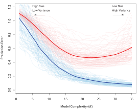
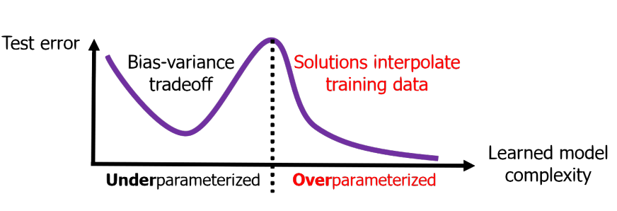
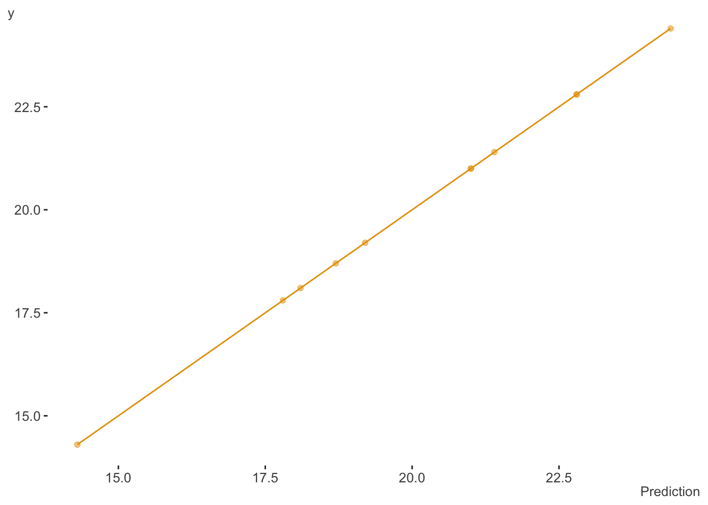
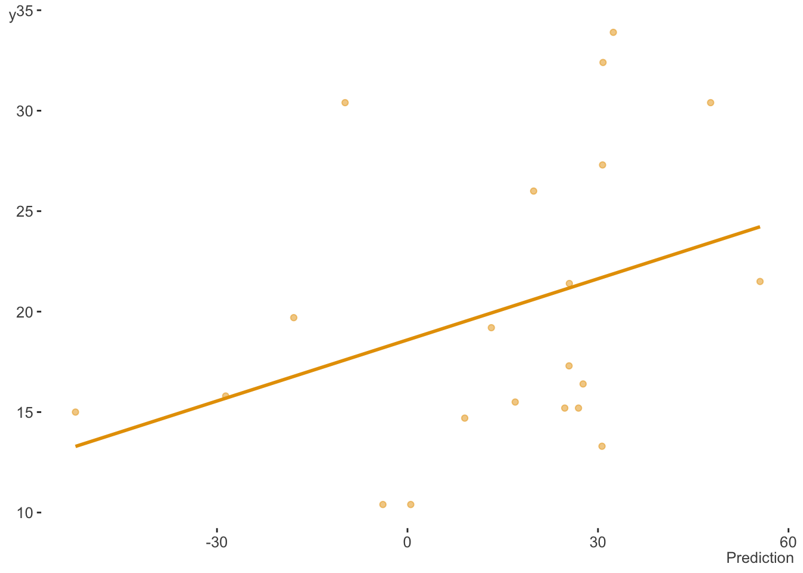
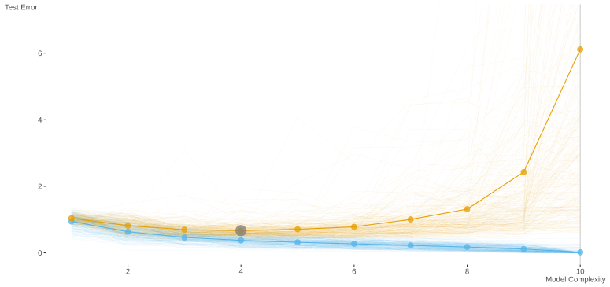
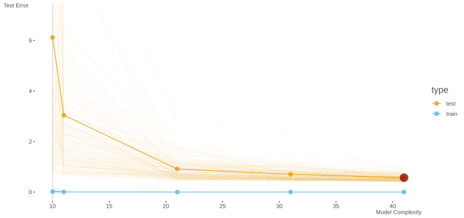
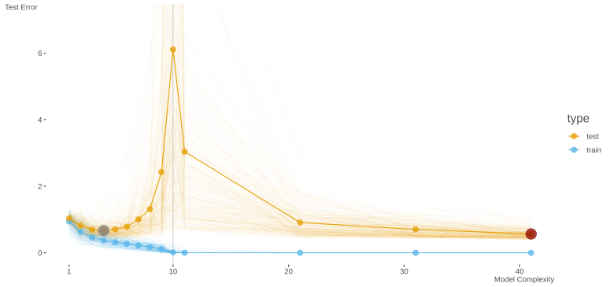

A co-worker passed along a recent article ([Dar et al. 2021](#ref-dar2021farewell)) on the topic of *double descent* in machine learning. I figured I’d summarize some key points I came across while perusing it and some referenced articles. In addition, I’ll provide an accessible example demonstrating the phenomenon.

## What is double descent?

### Bias-variance trade-off

To understand double descent you have to revisit the concept of the *bias-variance trade-off*. Without going into too much detail, the main idea with it is that having an overly complex model leads to *overfitting* the training data, which results in worse prediction on new data, at least relative to what simpler models would have done. The classic figure looks like the following, where blue is the *training error* and the red is the *test error*. Thin lines represent one path of complexity (e.g. across a random sample of the data), while the thicker lines are the average at a particular point of model complexity.



If we don’t have a sufficiently complex model, both training and test error will be poor, the case of *underfitting*. Our model is a poor approximation of the true underlying function, and predicts poorly on data both seen and unseen. When we have too much model complexity relative to the size of our data (e.g. more covariates, nonlinear effects, interactions, etc.), we pass into the overfit situation. Essentially, while our model function would result in a decrease in error with the data it’s trained on (lower bias as it better approximates the true underlying function), with too much complexity, you’d also eventually have notable changes in prediction (high variance) with any slight deviation in the underlying training data. We can even get to the point where we fit the training data perfectly, but it will be overly susceptible to the noise in the data, and not do well with unseen observations.

To combat this, we usually attempt to find a balance between overly simple and overly complex models. This would be the point where test error is among its lowest point for a desirable level of complexity (e.g. around 20-25 df in the figure above), before it begins to rise again. This may be accomplished more explicitly, for example, picking a model through cross-validation, or more implicitly, for example, through regularization (Belkin et al. ([2019](#ref-belkin2019reconciling))). For more detail on the bias-variance trade-off, you can look at the exposition in the main article noted above, [my document here](https://m-clark.github.io/introduction-to-machine-learning/concepts.html#bias-variance-tradeoff), or any number of places, as it is an extremely well-known idea in machine learning.

### Double Descent

The funny thing is, it turns out that the above actually only applies to a specific scenario, one which we will call *underparameterized* models. We can simplify this notion by just thinking of the case where the number of our parameters to estimate is less than or equal to the number of observations we have to work with. Nowadays though, it’s not uncommon to have what we’d call *overparameterized* models, such as random forests and neural networks, sometimes with even billions of parameters, far exceeding the data size. In this scenario, when we revisit the trade-off, something unusual happens!



Figure from Dar et al. ([2021](#ref-dar2021farewell))

Such models may have near zero training error, yet do well on unseen data. As we increase complexity, we see something like a second bias-variance trade-off beyond the point where the data is perfectly fit (interpolated). This point is where model complexity (e.g. in terms of number of parameters) *p* equals the number of observations *N*, and this is where the realm of the overparameterized models begins. Now test error begins to drop again with increasing complexity.

## An example

I thought it would be amusing to try this with the classic `mtcars` data set available in base R. With this data, our goal will be to predict fuel consumption in miles per gallon (`mpg`). First we will split the data into training and test components. We create a model where our number of parameters (`p`), in this case standard regression coefficients, will equal the number of observations (`N`). Some of the more technically savvy will know that if the number of features and/or parameters to estimate `p` equals the number of observations `N`, a standard linear regression model will fit the data perfectly[^1], demonstrated below.

If not familiar, the `mtcars` object is a data frame that comprises fuel consumption and 10 aspects of automobile design and performance for 32 automobiles (1973–74 models).

``` r
nc = ncol(mtcars) 
nr = nc
fit_perfect = lm(mpg ~ ., mtcars[1:nr, ])
# summary(fit_perfect) # not shown, all inferential estimates are NaN
```



Now let’s look at the test error, our prediction on the unseen data we didn’t use in fitting the model. When we do, we see the usual bias-variance trade-off. Our generalizability capabilities have plummeted, as we have overfit the training data and were unable to accommodate unseen observations. We are even predicting negative mpg in some cases!



### p ≤ N

Let’s extend the demonstration more fully. We now create models of increasing complexity, starting with an intercept only model (i.e. just using the mean for prediction), to one where all other columns (10) in the data are predictors. Here I repeatedly sampled `mtcars` of size \\N = 10\\ for training, the remainder for test, and also shuffled the columns each time, doing so for a total of 250 times[^2]. Here is the result- the classic bias variance trade-off curve. The larger dot shows the test error minimum, at about 3 covariates (plus intercept). The vertical line denotes our point of interpolation.



Double Descent in the underparameterized setting.

### p \> N

So with one of the simpler data sets around we were able to demonstrate the bias-variance trade-off clearly. But now let’s try overparameterized models! We don’t need anything fancy or complicated to do this, so for our purposes, I’m just going to add cubic spline basis expansions for the `wt`, `disp`, and `hp` features[^3]. This will definitely be enough to put us in a situation where we have more parameters than data, i.e. p \> N, but doesn’t make things too abstract[^4].

The basic linear model approach we might typically use fails to estimate the additional parameters in this situation, so we need a different estimator. Some are familiar with penalized regression techniques such as *lasso* and *ridge* regression, and we could use those here. However, I’ll use *ridgeless regression*, as depicted in Hastie et al. ([2019](#ref-hastie2019surprises)), and which, like ridge regression, is a straightforward variant of the usual least squares regression[^5]. I estimate the coefficients/weights on the training data, and make predictions for the training and test set, calculating their respective errors. Here is an example of the primary function used.

``` r
fit_ridgeless = function(X_train, y, X_test, y_test){
  # get the coefficient estimates
  b = pseudo_inv(crossprod(X_train)) %*% crossprod(X_train, y)
  
  # get training/test predictions
  predictions_train = X_train %*% b
  predictions_test  = X_test %*% b
  
  # get training/test error
  rmse_train = sqrt(mean((y - predictions_train[,1])^2))
  rmse_test  = sqrt(mean((y_test - predictions_test[,1])^2))
  
  # return result
  list(
    b = b,
    predictions_train = predictions_train,
    predictions_test  = predictions_test,
    rmse_train = rmse_train,
    rmse_test  = rmse_test
  )
}
```

We can test the function as follows with as little as 10 observations, where p (all predictor coefficients plus intercept = 11 parameters) is greater than N (10). This demonstrates that the ridgeless approach can provide an estimate for all the parameters (unlike the standard `lm` function), and we also see very low training error, but relatively high test error (in terms of the root mean square error.)

``` r
n = 10

X = as.matrix(cbind(1, mtcars[, -1]))
y = mtcars$mpg # mpg is the first column

X_train = X[1:n, ]
y_train = mtcars$mpg[1:n]
X_test  = X[-(1:n),]
y_test  = y[-(1:n)]

result = fit_ridgeless(X_train, y_train, X_test, y_test)
```

| b     |
|-------|
| 0.84  |
| −1.69 |
| 0.08  |
| −0.08 |
| 2.76  |
| −1.29 |
| 0.24  |
| 2.32  |
| 3.26  |
| 2.26  |
| 0.66  |

| rmse_train | rmse_test |
|------------|-----------|
| 0.05       | 5.79      |

Table 1

If we do this for more complex models (max linear features, plus each additional set of features associated with a cubic spline basis expansions), we obtain the following. Now we see the second descent in test error takes form!



Double Descent in the overparameterized setting.

Putting our results together gives us the double descent curve.



Double Descent in the overparameterized setting.

Note that this all holds for the most part with classification problems, including multiclass (or multivariate/class targets).

We not only see the double descent pattern, but we can also note that the global test error minimum occurs with the model with the most parameters. The gray dot is the lowest test error with the underparameterized settings, while the dark red is the global test error minimum.

## Why does this happen?

Understanding the double descent phenomenon is an area of active research, and there are some technical issues we won’t cover here. However, we can note a couple things more broadly. When we’re in the underparameterized situation, we ultimately begin to force features that have no association with the target to fit the data anyway. Once you move beyond the point of where these features are useful, test error begins to rise again, until the point of interpolation where test error is even worse than guessing (or just guessing in the classification case).

Beyond the interpolation point, all models we potentially employ using this estimation technique will have the capacity to fit the training data perfectly, i.e. zero bias. This allows us to fit the remaining noise in the data with the additional features employed by the more complex models. There is no guarantee that among the models you fit that the lowest test error will be found relative to the underparameterized setting. However, the lowest test error to be found is ‘out there’ somewhere[^6]. So adding complexity will potentially allow you to find improved test error.

Another way to put it is that we have a single class of models to consider, and under and overparameterized are special cases of that more general class. Any one of these might result in the lowest test error. The overparameterized models, which may contain complex nonlinearities and interactions, are likely to be more compatible with the data than the simpler models[^7]. So odds are good that at least one of them will have a smaller test error as well. In any case, restricting ourselves to the underparameterized setting is definitely no guarantee that we will find the most performant model.

One caveat is that the model we used is an example of ‘implicit’ regularization, one in which there is no hyper-parameter to set (or discover through cross-validation), like with ridge and lasso. With other techniques (e.g. optimally chosen ridge regression estimator) we may still be able to achieve optimal test error without complete interpolation, and show a reduced peak.

Dar et al. ([2021](#ref-dar2021farewell)) note that in the overparameterized setting, we can distinguish the signal part of the error term that reduces as a function of N/p, where the noise part of the error term is a function of p/N. In addition, there is a portion of test error related to model misspecification, which will always decrease with overparameterization. In addition, one must consider both feature correlations as well as correlations among observations. Having more complex covariance structure doesn’t negate the double descent phenomenon, but they suggest that, for example, cases where there is low effective dimension within these additional features will more readily display the double descent.

Another issue is that in any given situation it is difficult to know where in the realm of available models we exist presently. So additional complexity, or even additional data, may in fact hurt performance ([Nakkiran et al. 2019](#ref-nakkiran2019deep)).

## Conclusion

The double descent phenomenon is a quite surprising scenario, especially for those who have only heard of the classical bias-variance trade off. There is still much to learn regarding it, but such research is off and running. For practical purposes, it is worth keeping it in mind to aid us in model selection and thinking about our modeling strategies in general.

## References

Belkin, Mikhail, Daniel Hsu, Siyuan Ma, and Soumik Mandal. 2019. “Reconciling Modern Machine-Learning Practice and the Classical Bias–Variance Trade-Off.” *Proceedings of the National Academy of Sciences* 116 (32): 15849–54.

Dar, Yehuda, Vidya Muthukumar, and Richard G Baraniuk. 2021. “A Farewell to the Bias-Variance Tradeoff? An Overview of the Theory of Overparameterized Machine Learning.” *arXiv Preprint arXiv:2109.02355*.

Hastie, Trevor, Andrea Montanari, Saharon Rosset, and Ryan J Tibshirani. 2019. “Surprises in High-Dimensional Ridgeless Least Squares Interpolation.” *arXiv Preprint arXiv:1903.08560*.

Nakkiran, Preetum, Gal Kaplun, Yamini Bansal, Tristan Yang, Boaz Barak, and Ilya Sutskever. 2019. “Deep Double Descent: Where Bigger Models and More Data Hurt.” *arXiv Preprint arXiv:1912.02292*.

## Footnotes

## Reuse

[CC BY-SA 4.0](https://creativecommons.org/licenses/by-sa/4.0/)

## Citation

BibTeX citation:

``` quarto-appendix-bibtex
@online{clark2021,
  author = {Clark, Michael},
  title = {Double {Descent}},
  date = {2021-11-13},
  url = {https://m-clark.github.io/posts/2021-10-30-double-descent/},
  langid = {en}
}
```

For attribution, please cite this work as:

Clark, Michael. 2021. “Double Descent.” November 13. <https://m-clark.github.io/posts/2021-10-30-double-descent/>.

[^1]: R² = 1 in the standard linear model setting.

[^2]: Note that the intercept term is added after data shuffling so when p = 1 it is the intercept only model, i.e. guessing the mean.

[^3]: I used mgcv to so this, then added them in whole for each term to the previously shuffled model matrix. These columns are not shuffled. By default these will add 10 columns each to the model matrix.

[^4]: For more on generalized additive models, see [my document](https://m-clark.github.io/generalized-additive-models/).

[^5]: Ridgeless regression has the same form as the ‘normal’ equations for least squares, but instead of \\\beta \sim (X^TX)^{-1} \cdot X^Ty\\, we have \\\beta \sim (X^TX)^{+} \cdot X^Ty\\ where the first part is the pseudo-inverse of \\X\\. It is similar to equations for ridge regression (see my demo [here](https://m-clark.github.io/models-by-example/penalized-maximum-likelihood.html#l2-ridge-regularization)) and can be seen as an approximation to it as the ridge penalty tends toward zero.

[^6]: Fox Mulder told me so.

[^7]: Because nature is just funny that way.
