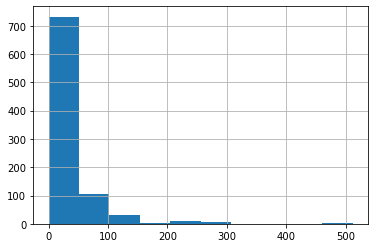
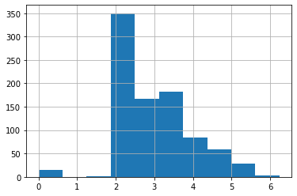
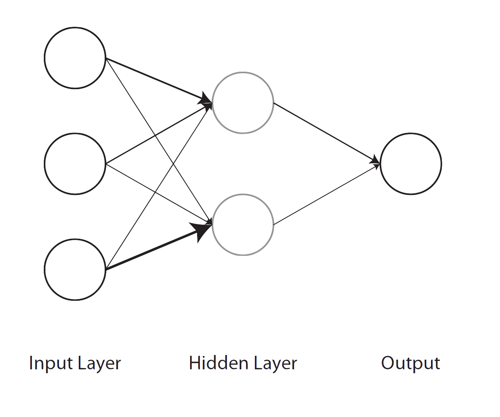

## Introduction

> NB: This post was revisited when updating the website early 2025, and some changes were required. Attempts to keep things consistent were made, but if you feel you’ve found an issue, please post it at [GitHub](http://github.com/m-clark/m-clark.github.io/issues).

This post gives a by-hand example of a linear model using pytorch. A good question to ask right off the bat would be- why would anyone do this? We use deep learning typically because linear regression isn’t up to the task! Well, for one thing, it serves as a stepping stone for those who know basic statistical methodology like linear regression, but want to get into deep learning in a conceptual manner. Another is to just see some pytorch basics in a simple setting. And one last reason is that maybe you want to incorporate a more standard statistical modeling approach into some other deep learning endeavor. Everyone can join the party!

For this demo we’ll use [an example by fastai](https://www.kaggle.com/code/jhoward/linear-model-and-neural-net-from-scratch), which is a great resource for [getting started with deep learning](https://course.fast.ai/). While their example serves as a basis, I will generalize the functionality so that you can play around with the settings and try other data examples[^1]. In addition, this post will assume you know things like why you would dummy code features and linear regression basics, and will use some other naming conventions[^2].

## Getting Started

Let’s get the primary packages loaded first.

``` python
import pandas as pd
import numpy as np
import lightgbm as lgb
import torch
```

Next, we’ll use the well-known [titanic dataset](https://www.kaggle.com/code/jhoward/linear-model-and-neural-net-from-scratch/data), and to start things off, we’ll need to get a sense of what we’re dealing with. The basic idea is that we’d like to predict survival based on key features like sex, age, ticket class and more.

``` python
# non-kaggle-requiring url here: https://raw.githubusercontent.com/m-clark/m-clark.github.io/master/data/dl-linear-regression/titanic/train.csv
df_titanic_train = pd.read_csv('data/dl-linear-regression/titanic/train.csv')
# df_titanic_train
```

``` python
df_titanic_train.describe()
```

           PassengerId    Survived      Pclass  ...       SibSp       Parch        Fare
    count   891.000000  891.000000  891.000000  ...  891.000000  891.000000  891.000000
    mean    446.000000    0.383838    2.308642  ...    0.523008    0.381594   32.204208
    std     257.353842    0.486592    0.836071  ...    1.102743    0.806057   49.693429
    min       1.000000    0.000000    1.000000  ...    0.000000    0.000000    0.000000
    25%     223.500000    0.000000    2.000000  ...    0.000000    0.000000    7.910400
    50%     446.000000    0.000000    3.000000  ...    0.000000    0.000000   14.454200
    75%     668.500000    1.000000    3.000000  ...    1.000000    0.000000   31.000000
    max     891.000000    1.000000    3.000000  ...    8.000000    6.000000  512.329200

    [8 rows x 7 columns]

## Initial Data Processing

The data is not ready for modeling as is, so we’ll do some additional processing to get it ready. We’ll check out the missing values and replace them with modes[^3].

``` python
df_titanic_train.isna().sum()
```

    PassengerId      0
    Survived         0
    Pclass           0
    Name             0
    Sex              0
    Age            177
    SibSp            0
    Parch            0
    Ticket           0
    Fare             0
    Cabin          687
    Embarked         2
    dtype: int64

``` python
modes = df_titanic_train.mode().iloc[0]

df_titanic_train.fillna(modes, inplace = True)

df_titanic_train.describe(include = (np.number))
```

           PassengerId    Survived      Pclass  ...       SibSp       Parch        Fare
    count   891.000000  891.000000  891.000000  ...  891.000000  891.000000  891.000000
    mean    446.000000    0.383838    2.308642  ...    0.523008    0.381594   32.204208
    std     257.353842    0.486592    0.836071  ...    1.102743    0.806057   49.693429
    min       1.000000    0.000000    1.000000  ...    0.000000    0.000000    0.000000
    25%     223.500000    0.000000    2.000000  ...    0.000000    0.000000    7.910400
    50%     446.000000    0.000000    3.000000  ...    0.000000    0.000000   14.454200
    75%     668.500000    1.000000    3.000000  ...    1.000000    0.000000   31.000000
    max     891.000000    1.000000    3.000000  ...    8.000000    6.000000  512.329200

    [8 rows x 7 columns]

With features, sometimes it is worthwhile to log transform data for potentially more efficient optimization search. Since we have zeros, we add 1 before taking the log.

``` python
df_titanic_train['Fare'].hist()
```



Now the transformed data looks a little more manageable. More to the point, we won’t potentially have huge coefficients relative to other covariates because of the range of the data.

``` python
df_titanic_train['LogFare'] = np.log1p(df_titanic_train['Fare'])

# df_titanic_train['LogFare'].hist()
```



The `Pclass` (passenger class) feature is actually categorical.

``` python
pclasses = sorted(df_titanic_train.Pclass.unique())
pclasses
```

    [np.int64(1), np.int64(2), np.int64(3)]

Here are the other categorical features.

``` python
df_titanic_train.describe(include = [object])
```

                               Name   Sex  Ticket    Cabin Embarked
    count                       891   891     891      891      891
    unique                      891     2     681      147        3
    top     Braund, Mr. Owen Harris  male  347082  B96 B98        S
    freq                          1   577       7      691      646

In order to use categorical variables, they need to be changed to numbers[^4], so we dummy code them here. There are other coding schemes, and for most deep learning approaches people will often use *embeddings*[^5], particularly for things that have lots of unique categories.

``` python
df_titanic_train = pd.get_dummies(df_titanic_train, columns = ["Sex", "Pclass", "Embarked"])
```

Let’s take a look at our data now.

``` python
df_titanic_train.columns
```

    Index(['PassengerId', 'Survived', 'Name', 'Age', 'SibSp', 'Parch', 'Ticket',
           'Fare', 'Cabin', 'LogFare', 'Sex_female', 'Sex_male', 'Pclass_1',
           'Pclass_2', 'Pclass_3', 'Embarked_C', 'Embarked_Q', 'Embarked_S'],
          dtype='object')

``` python
df_titanic_train.head()
```

       PassengerId  Survived  ... Embarked_Q  Embarked_S
    0            1         0  ...      False        True
    1            2         1  ...      False       False
    2            3         1  ...      False        True
    3            4         1  ...      False        True
    4            5         0  ...      False        True

    [5 rows x 18 columns]

## Getting Started with pytorch

### Setup

Now we are ready to prep things for specific use with pytorch. I will not use the same terminology as in Jeremy’s original post, so for us, `target` = ‘dependent variable’ and `X` is our feature matrix[^6]. Both of these will be pytorch *tensors*, which for our purposes is just another word for an array of arbitrary size.

``` python
from torch import tensor
device = torch.device('cpu')
target = tensor(df_titanic_train.Survived)
```

``` python
dummies = ['Sex_male', 'Sex_female', 'Pclass_1', 'Pclass_2', 'Pclass_3', 'Embarked_C', 'Embarked_Q', 'Embarked_S']
all_features = ['Age', 'SibSp', 'Parch', 'LogFare'] + dummies 

X = df_titanic_train[all_features].apply(pd.to_numeric).astype(float)
X = tensor(X.values, dtype = torch.float)

X.shape
```

    torch.Size([891, 12])

## Setting up a linear model

We have our feature matrix and target variable prepped. The next step is to map the features to the target by means of predicted values. In linear regression, we typically call the weights that produce the predictions *coefficients*, but in standard deep/machine learning terminology, they are usually called *weights*, or more generally, *parameters*. Here, we generate some random values between -.5 and .5 to get started[^7]:.

``` python
torch.manual_seed(442)
```

    <torch._C.Generator object at 0x162e724b0>

``` python
n_coeff = X.shape[1]
coeffs = torch.rand(n_coeff) - 0.5  # default would produce values from 0 to 1
coeffs
```

    tensor([-0.4629,  0.1386,  0.2409, -0.2262, -0.2632, -0.3147,  0.4876,  0.3136,
             0.2799, -0.4392,  0.2103,  0.3625])

The original post did a form of min-max scaling to the features, basically putting everything on a potentially \[0, 1\] scale. Here we’ll use standardization as an alternative, giving each feature a mean of zero and standard deviation of 1.

``` python
# vals,indices = X.max(dim=0)
# X = X / vals
X_means = X.mean(dim = 0, keepdim = True)
X_sds   = X.std(dim = 0)

X_sc = (X - X_means) / X_sds

# X_sc.mean(dim = 0)  # all means = 0 
# X_sc.std(dim = 0)   # all sd = 1
```

As noted in the original post and worth iterating here for our statistical modeling crowd, we don’t estimate an intercept for this model and keep all the dummy coded features. The following takes our coefficients, multiplies them by their respective feature, and sums them.

``` python
preds = (X_sc * coeffs).sum(axis = 1)
preds[:10]
```

    tensor([ 0.6000, -1.9341,  0.2080,  0.1723, -0.0032,  0.3088, -0.5066,  1.6219,
             0.6990, -1.2584])

We can calculate our *loss*, the difference in our predictions versus the target values, in many ways. Here we get the mean squared error.

``` python
loss = torch.square(preds - target).mean()
loss
```

    tensor(1.3960)

Now we’ll create functions that do the previous steps, and finally, give it a test run! In the original fastai formulation, they use mean absolute error for the loss, which actually is just the `L1loss` that is available in torch. For a change of pace, we’ll keep our mean squared error, which is sometimes called *L2* loss (this will create different results from the original notebook). I create the option within the function for you to do either. Also note that the functions we create here will take inputs generally, rather than being specific to the objects we create, so you can try this stuff out with other data.

``` python
def calc_preds(X, weights):
    return((X * weights).sum(axis = 1))

def calc_loss(X, weights, target, which = 'l2'):
    preds = calc_preds(X, weights)
    
    # torch.abs(calc_preds(X, coeffs)-target).mean()  # original

    if which == 'l2':
      loss = torch.nn.MSELoss()
    else: 
      loss = torch.nn.L1Loss()
      
    L = loss(preds, target.float())
      
    return(L)

calc_loss(X_sc, coeffs, target), calc_loss(X_sc, coeffs, target, which = 'l1')
```

    (tensor(1.3960), tensor(0.8891))

### Doing a Gradient Descent Step

We can continue our journey onward to actually estimating the weights rather than specifying them directly, since we definitely don’t want to just keep guessing! This is an iterative process where we still start with an initial (random) guess, then, at each step, refine our guess in a way that lowers our loss. For neural networks we call these steps *epochs*, and getting our next guess requires calculating what’s called a *gradient*. Here are some resources for more detail:

- [How Does a Neural Net Really Work?](https://www.kaggle.com/code/jhoward/how-does-a-neural-net-really-work): great intro by Jeremy Howard
- [Some by-hand code using gradient descent for linear regression, R](https://m-clark.github.io/models-by-example/stochastic-gradient-descent.html), [Python](https://m-clark.github.io/models-by-example/supplemental.html#python-sgd): By yours truly

In any case, this is basic functionality within pytorch, and it will keep track of each step taken.

``` python
coeffs.requires_grad_()
```

    tensor([-0.4629,  0.1386,  0.2409, -0.2262, -0.2632, -0.3147,  0.4876,  0.3136,
             0.2799, -0.4392,  0.2103,  0.3625], requires_grad=True)

``` python
loss = calc_loss(X_sc, coeffs, target)
loss
```

    tensor(1.3960, grad_fn=<MseLossBackward0>)

We use backward to calculate the gradients and inspect them.

``` python
loss.backward()

coeffs.grad
```

    tensor([-0.9311,  0.6245,  0.4957, -0.7423,  0.6008, -0.6008, -0.9158,  0.0938,
             0.7127, -1.7183,  0.1715,  1.3974])

Each time backward is called, the gradients are added to the previous values. We can see here that they’ve now doubled.

``` python
loss = calc_loss(X_sc, coeffs, target)

loss.backward()

coeffs.grad
```

    tensor([-1.8621,  1.2491,  0.9914, -1.4847,  1.2015, -1.2015, -1.8317,  0.1877,
             1.4254, -3.4366,  0.3431,  2.7947])

What we want instead is to set them back to zero after they are used for our estimation step. The following does this.

``` python
loss = calc_loss(X_sc, coeffs, target)

loss.backward()

with torch.no_grad():
    coeffs.sub_(coeffs.grad * 0.1)     # sub subtracts in place
    coeffs.grad.zero_()                # zeros out in place
    print(calc_loss(X, coeffs, target))
```

    tensor([-0.1836, -0.0488,  0.0922, -0.0035, -0.4435, -0.1345,  0.7624,  0.2854,
             0.0661,  0.0763,  0.1588, -0.0567], requires_grad=True)
    tensor([0., 0., 0., 0., 0., 0., 0., 0., 0., 0., 0., 0.])
    tensor(37.9424)

### Training the Linear Model

We typically would split our data into training and test. We can do so here, or keep this data as training and import `test.csv` for the test set. The latter is actually used for the Kaggle submission, but that’s not a goal here. We’ll use scikit-learn for the splitting.

``` python
from sklearn.model_selection import train_test_split

# test size .2 in keeping with fastai RandomSplitter default
train_x, valid_x, train_y, valid_y = train_test_split(
  X_sc, 
  target.float(), 
  test_size = 0.2, 
  random_state = 808
)
  

len(train_x), len(valid_x) # might be one off of the original notebook
```

    (712, 179)

As before, we’ll create functions to help automate our steps:

- one to initialize the weights
- a function to update weights
- one to do a full epoch (using weights to calculate loss, updating weights)
- one to train the entire model (run multiple times/epochs)

As mentioned, the approach here is to create functions that are general enough to take any X or target, so they look a little different from the original notebook. I also add in a verbosity option so you can see the loss at each `verbose` value epoch (e.g. `verbose = 10` means you’ll see the latest loss value every 10 epochs), so you can watch the iterations for as long as you like without it printing constantly (possibly not too big a deal depending on your IDE).

``` python
def init_weights(n_wts): 
    return (torch.rand(n_wts) - 0.5).requires_grad_()

def update_weights(weights, lr):
    weights.sub_(weights.grad * lr)
    weights.grad.zero_()

def one_epoch(X, weights, target, lr, verbose = 1, i = 1):
    loss = calc_loss(X, weights, target)
    loss.backward()
    
    with torch.no_grad(): update_weights(weights, lr)
    
    if verbose != 0:
        if i % verbose == 0:
            print(f'{loss: 3f}', end = '\n ')

def train_model(X, target, epochs = 30, lr = 1e-3, verbose = 1):
    torch.manual_seed(442)
    coeffs = init_weights(X.shape[1])
    
    for i in range(epochs): 
        one_epoch(X, coeffs, target, lr = lr, i = i, verbose = verbose)
    return coeffs
```

Try out the functions if you like (not shown).

``` python
calc_loss(X_sc, init_weights(X_sc.shape[1]), target).backward()
```

``` python
one_epoch(train_x, init_weights(train_x.shape[1]), train_y, .01)
```

Now train the model for multiple epochs. The loss drops very quickly before becoming more steady.

``` python
coeffs_est = train_model(train_x, train_y, epochs = 50, verbose = 5, lr = .2)
```

     1.375618
      0.296216
      0.284019
      0.281221
      0.280271
      0.279923
      0.279794
      0.279746
      0.279728
      0.279721
     

Let’s create a function to show our estimated parameters/weights/coefficients in a pretty fashion.

``` python
def show_coeffs(estimates): 
  coef_dict = dict(zip(all_features, estimates.requires_grad_(False).numpy()))
  return pd.DataFrame(coef_dict, index = ['value']).T

show_coeffs(coeffs_est)
```

                   value
    Age        -0.090825
    SibSp      -0.054449
    Parch      -0.016111
    LogFare     0.046320
    Sex_male   -0.406538
    Sex_female -0.171426
    Pclass_1    0.408707
    Pclass_2    0.335766
    Pclass_3    0.329800
    Embarked_C  0.057091
    Embarked_Q  0.032813
    Embarked_S  0.039464

### Measuring Accuracy

It’s one thing to get accuracy on the trained data, but a better estimate of model performance is to measure it on our test/validation data. The following function will convert our estimates to a binary value like our target, and compares them to the target. Depending on how you did your training setup, it might be pretty bad or at least better than guessing.

``` python
def acc(X, weights, target): 
    return (target.bool() == (calc_preds(X, weights) > 0.5)).float().mean()

acc(train_x, coeffs_est, train_y), acc(valid_x, coeffs_est, valid_y)
```

    (tensor(0.7051), tensor(0.6425))

### Using sigmoid

Nothing about the previous setup actually produces a result on the probability scale, so basing a cutoff of .5 is meaningless. you can inspect them and might see values are above 1 or below zero, which we generally don’t want[^8]. However we do have a solution. The *sigmoid function*[^9] allows us to transform our predictions to values between 0 and 1, i.e. probabilities in this context, and in particular, the probability of survival. Then our acc function will be more appropriate, where any probability \> .5 will be given a value of 1 (or `True` technically), while others will be 0/`False`.

``` python
def calc_preds(X, weights):
    return torch.sigmoid((X*weights).sum(axis = 1))
```

We also will do more iterations, and fiddle with the learning rate (a.k.a. step size)

``` python
coeffs_est = train_model(
  train_x,
  train_y,
  epochs = 500,
  lr = 1,
  verbose = 100
)
```

     0.314158
      0.154329
      0.154237
      0.154232
      0.154232
     

Not too shabby!

``` python
acc(train_x, coeffs_est, train_y), acc(valid_x, coeffs_est, valid_y)
```

    (tensor(0.7823), tensor(0.7989))

``` python
show_coeffs(coeffs_est)
```

                   value
    Age        -0.516476
    SibSp      -0.423656
    Parch      -0.179623
    LogFare     0.396468
    Sex_male   -0.927410
    Sex_female  0.349448
    Pclass_1    0.713895
    Pclass_2    0.320935
    Pclass_3    0.078919
    Embarked_C  0.107378
    Embarked_Q  0.082943
    Embarked_S -0.036137

In implementing the sigmoid, let’s go ahead and optimize how we calculate the predictions using a matrix shorthand for getting the predictions (which is also much more efficient/faster)[^10]. To do this, the coefficients will need to be a column vector, so we change our init_coeffs function slightly[^11].

``` python
def calc_preds(X, weights): 
    return torch.sigmoid(X@weights)

def init_coeffs(n_wts): 
    return (torch.rand(n_wts, 1) * 0.1).requires_grad_()
```

Now our functions are more like the mathematical notation we’d usually see for linear regression.

\\\hat{y} = X\beta\\

### Compare to Linear/Logistic Regression

Before getting too excited, let’s compare our results to basic linear and logistic regression. The linear regression is more like our model before using the sigmoid transformation, while the logistic is more like when we used it. Depending on your settings, the logistic regression is probably doing better at this point.

``` python
from sklearn import linear_model
from sklearn.metrics import accuracy_score


reg = linear_model.LinearRegression()
reg.fit(train_x, train_y)
```

    LinearRegression()

**In a Jupyter environment, please rerun this cell to show the HTML representation or trust the notebook.  
On GitHub, the HTML representation is unable to render, please try loading this page with nbviewer.org.**

LinearRegression

[?Documentation for LinearRegression](https://scikit-learn.org/1.6/modules/generated/sklearn.linear_model.LinearRegression.html)iFitted

    LinearRegression()

``` python
acc(valid_x, coeffs_est, valid_y), acc(valid_x, reg.coef_.T, valid_y)
```

    (tensor(0.7989), tensor(0.7821))

``` python
reg = linear_model.LogisticRegression()
reg.fit(train_x, train_y)
```

    LogisticRegression()

**In a Jupyter environment, please rerun this cell to show the HTML representation or trust the notebook.  
On GitHub, the HTML representation is unable to render, please try loading this page with nbviewer.org.**

LogisticRegression

[?Documentation for LogisticRegression](https://scikit-learn.org/1.6/modules/generated/sklearn.linear_model.LogisticRegression.html)iFitted

    LogisticRegression()

``` python
accuracy_score(valid_y.numpy(), reg.predict(valid_x))
```

    0.7821229050279329

It looks like our coefficient estimates are similar to the logistic regression ones.

``` python
show_coeffs(coeffs_est).assign(logreg = np.round(reg.coef_.T, 4))
```

                   value  logreg
    Age        -0.516476 -0.4799
    SibSp      -0.423656 -0.4191
    Parch      -0.179623 -0.1265
    LogFare     0.396468  0.3441
    Sex_male   -0.927410 -0.6262
    Sex_female  0.349448  0.6262
    Pclass_1    0.713895  0.3941
    Pclass_2    0.320935  0.0675
    Pclass_3    0.078919 -0.3945
    Embarked_C  0.107378  0.0546
    Embarked_Q  0.082943  0.0655
    Embarked_S -0.036137 -0.0890

## A Neural Network



At this point we’ve basically reproduced a general linear model. A *neural network*, on the other hand, has from one to many *hidden layers* of varying types in between input and output. Let’s say we have a single layer with two nodes. For a *fully connected* or *dense* network, we’d need weights to map our features to each node of the hidden layer (`n_wts` \* `n_hidden` parameters total), and then another set of weights to map the hidden nodes to our next layer, which is our output, basically creating the predicted values. You can think of it as a second hidden layer with a single output node. With additional hidden nodes we add more complexity, but also flexibility, to the model. But this may come at a price, e.g. more difficulty with training due to the additional parameters that have to be estimated.

So basically we need matrices of weights, and the following function allows us to create those. We also add a *bias/intercept/constant* for the hidden-to-output processing. In the first layer, we divide the weights by `n_hidden` to create sums at the next layer that are of similar magnitude as the inputs. In general though, there are many ways to [initialize weights](https://machinelearningmastery.com/weight-initialization-for-deep-learning-neural-networks/).

``` python
def init_weights(n_wts, n_hidden = 20):
    layer1 = (torch.rand(n_wts, n_hidden) - 0.5) / n_hidden # n_wts x n_hidden matrix of weights
    layer2 = torch.rand(n_hidden, 1) - 0.3                  # n_hidden weights
    const  = torch.rand(1)[0]                               # constant
    return layer1.requires_grad_(), layer2.requires_grad_(), const.requires_grad_()
```

Now we revise our calc_preds function to incorporate all the weights. Initially, we extract the different sets of weights that are estimated by the model. For the original inputs, we multiply them by the layer 1 weights and sum. Then we apply a transformation to them to induce nonlinearity. Typical approaches are the sigmoid function we used before, hyperbolic tangent, and, probably the most common, the [relu](https://en.wikipedia.org/wiki/Rectifier_(neural_networks)). The original notebook used relu, while I use a more recent one called *Mish*, which is a variant of relu. The hidden layer nodes then get multiplied by their respective weights and summed with the constant added. We then use our sigmoid function to get the probability scale as before.

``` python
import torch.nn.functional as F

def calc_preds(X, weights):
    l1, l2, const = weights
    res = F.mish(X@l1)
    res = res@l2 + const
    return torch.sigmoid(res).flatten()
```

With additional sets of weights, we use an update loop.

``` python
def update_weights(weights, lr):
    for layer in weights:
        layer.sub_(layer.grad * lr)
        layer.grad.zero_()
```

``` python
coeffs_est = train_model(train_x, train_y, epochs = 50, lr = 1, verbose = 10)
```

     0.325837
      0.155810
      0.141485
      0.137652
      0.136034
     

At this point we’re doing a little bit better in general, and even better than standard logistic regression on the test set!

``` python
acc(train_x, coeffs_est, train_y), \
acc(valid_x, coeffs_est, valid_y), \
accuracy_score(valid_y.numpy(), reg.predict(valid_x))
```

    (tensor(0.8160), tensor(0.8045), 0.7821229050279329)

## Deep Learning

We previously used a single hidden layer, but we want to go deeper! That’s the whole point of deep learning right? The following modifies our previous functions to allow for an arbitrary number of layers. You’ll note there are some hacks to get the weights in a good way for each layer[^12], but you normally wouldn’t have to do that on your own, since most tools will provide sensible modifications.

``` python
def one_epoch(X, weights, target, lr, verbose = 1, i = 1):
    loss = calc_loss(X, weights, target)
    loss.backward()
    
    with torch.no_grad(): update_weights(weights, lr)
    
    if verbose != 0:
        if i % verbose == 0:
            print(f'{loss: 3f}', end = '\n ')

# change loss to binary
def calc_loss(X, weights, target, which = 'l2'):
    preds = calc_preds(X, weights)

    loss = torch.nn.BCELoss()

    L = loss(preds, target.float())

    return(L)


def init_weights(n_wts, hiddens):  
    sizes = [n_wts] + hiddens + [1]
    n = len(sizes)
    layers = [(torch.rand(sizes[i], sizes[i + 1]) - 0.3)/sizes[i + 1] * 4 for i in range(n - 1)]
    consts = [(torch.rand(1)[0] - 0.5)*0.1 for i in range(n - 1)]
    for l in layers+consts: l.requires_grad_()
    return layers, consts


def calc_preds(X, weights):
    layers, consts = weights
    n = len(layers)
    res = X
    
    for i, l in enumerate(layers):
        res = res@l + consts[i]
    
    if i != n-1: 
      res = F.mish(res)
      
    
    return torch.sigmoid(res).flatten()

def update_weights(weights, lr):
    layers, consts = weights
    for layer in layers + consts:
        layer.sub_(layer.grad * lr)
        layer.grad.zero_()

def train_model(X, target, hiddens = [10, 10], epochs = 30, lr = 1e-3, verbose = 1):
    torch.manual_seed(442)
    coeffs = init_weights(X.shape[1], hiddens)
    
    for i in range(epochs): 
        if verbose != 0:
            one_epoch(X, coeffs, target, lr = lr, verbose = verbose, i = i)
    
    return coeffs
```

With everything set up, let’s do some deep linear modeling! You can play around with the number of hidden layers, number of nodes and other settings. Feel free to explore!

``` python
coeffs_est = train_model(
  train_x,
  train_y,
  hiddens = [500, 250, 100],
  epochs  = 500,
  lr      = 1e-4,
  verbose = 10
)
```

     5.123790
      0.666971
      0.653124
      0.640325
      0.628476
      0.617496
      0.607313
      0.597861
      0.589081
      0.580918
      0.573322
      0.566249
      0.559658
      0.553510
      0.547772
      0.542413
      0.537403
      0.532715
      0.528326
      0.524212
      0.520354
      0.516733
      0.513330
      0.510130
      0.507118
      0.504281
      0.501605
      0.499080
      0.496695
      0.494439
      0.492305
      0.490283
      0.488366
      0.486547
      0.484820
      0.483178
      0.481616
      0.480129
      0.478712
      0.477361
      0.476072
      0.474840
      0.473663
      0.472538
      0.471461
      0.470429
      0.469440
      0.468493
      0.467583
      0.466710
     

Hooray! Our best model yet (at least tied).

``` python
pd.DataFrame({
    'acc_train': acc(train_x, coeffs_est, train_y).flatten(), 
    'acc_test': acc(valid_x, coeffs_est, valid_y).flatten(), 
    'acc_test_glm': accuracy_score(valid_y.numpy(), (reg.predict(valid_x) > .5).astype(int))
}, index = ['value'])
```

           acc_train  acc_test  acc_test_glm
    value    0.77809  0.804469      0.782123

## The Elephant in the Room

As noted in my previous posts \[[1](https://m-clark.github.io/posts/2021-07-15-dl-for-tabular/), [2](https://m-clark.github.io/posts/2022-04-01-more-dl-for-tabular/)\], probably your biggest challenge in implementing a deep learning model for tabular data, one with mixed data types and other complexities, is beating an off the shelf boosting model. Here is a quick demo with lightgbm.

``` python
from lightgbm import LGBMClassifier

model = LGBMClassifier(
  # n_estimators = 500,  # the sorts of parameters you can play with (many more!)
  # max_depth    = 4,
  # reg_alpha    = .1
)

model.fit(train_x, train_y)
```

    LGBMClassifier()

**In a Jupyter environment, please rerun this cell to show the HTML representation or trust the notebook.  
On GitHub, the HTML representation is unable to render, please try loading this page with nbviewer.org.**

LGBMClassifier

iFitted

    LGBMClassifier()

``` python
model.score(valid_x, valid_y.numpy())
```

    0.8491620111731844

``` python


# sklearn example
# from sklearn.ensemble import HistGradientBoostingClassifier
# 
# res = HistGradientBoostingClassifier().fit(train_x.numpy(), train_y.numpy())
# 
# res.score(valid_x.numpy(), valid_y.numpy())
```

No tuning at all, and we’re already doing significantly better. Granted, if you use a packaged DL model for tabular data like the one in fastai, you should be doing better than our little demo. Even then though, you may still find the boosting results tough to beat.

``` python
df_accs = pd.DataFrame({ 
    'acc_test_dl':   acc(valid_x, coeffs_est, valid_y).flatten(), 
    'acc_test_glm':  accuracy_score(valid_y.numpy(), (reg.predict(valid_x) > .5).astype(int)),
    'acc_test_lgbm': model.score(valid_x, valid_y.numpy())
}, index = ['value']).round(4)

df_accs
```

           acc_test_dl  acc_test_glm  acc_test_lgbm
    value       0.8045        0.7821         0.8492

``` python
df_perc_improvement = 100 * (df_accs / df_accs.iloc[0,1] - 1)  # % improvement
df_perc_improvement
```

           acc_test_dl  acc_test_glm  acc_test_lgbm
    value     2.864075           0.0       8.579466

## Summary

This was a lot of work to do slightly better than a logistic regression! However, there is a lot going on with a typical DL model that would likely prove even better. But it also serves as a reminder to have a suitable baseline, and as we saw with the lightgbm model, it can take little effort to do very well without deep learning. Hopefully though, the peek behind the scenes to do some ‘deep’ linear modeling can make it more accessible for you.

## References

Clark, Michael. 2022a. *Deep Learning for Tabular Data*. <https://m-clark.github.io/posts/2022-04-01-more-dl-for-tabular/>.

Clark, Michael. 2022b. *This Is Definitely Not All You Need*. <https://m-clark.github.io/posts/2021-07-15-dl-for-tabular/>.

Howard, Jeremy. 2022a. “How Does a Neural Net Really Work?” *Kaggle*. <https://www.kaggle.com/code/jhoward/how-does-a-neural-net-really-work>.

Howard, Jeremy. 2022b. “Linear Model and Neural Net from Scratch.” *Kaggle*. <https://www.kaggle.com/code/jhoward/linear-model-and-neural-net-from-scratch>.

Howard, Jeremy. 2022c. “What Is Torch.nn Really?” *Kaggle*. <https://pytorch.org/tutorials/beginner/nn_tutorial.html>.

Raschka, Sebastian. 2022. *A Short Chronology of Deep Learning for Tabular Data*. <https://sebastianraschka.com/blog/2022/deep-learning-for-tabular-data.html>.

## Footnotes

## Reuse

[CC BY-SA 4.0](https://creativecommons.org/licenses/by-sa/4.0/)

## Citation

BibTeX citation:

``` quarto-appendix-bibtex
@online{clark2022,
  author = {Clark, Michael},
  title = {Deep {Linear} {Models}},
  date = {2022-10-10},
  url = {https://m-clark.github.io/posts/2022-09-deep-linear-models/},
  langid = {en}
}
```

For attribution, please cite this work as:

Clark, Michael. 2022. “Deep Linear Models.” October 10. <https://m-clark.github.io/posts/2022-09-deep-linear-models/>.

[^1]: I won’t actually use fastai, since they aren’t up to supporting M1/2 Macs very well. I think it was only used for the train/test data split anyway. I would rant a bit about this, but a lot of fastai is geared toward non-local computing, and the fault is really with Apple and NVidia as near as I can tell.

[^2]: I’m also not going to go into broadcasting, submitting to Kaggle, and other things that I don’t think are necessary for our purposes here.

[^3]: Just as an aside, this sort of approach to impute has largely been frowned upon in the statistical world for decades for numerous (and valid) reasons, but we just want something quick and dirty here, and sometimes that’s enough.

[^4]: Even though every modeling tool requires this, strangely very few in the Python world offer options for automatic handling of such things, but it’s getting better.

[^5]: We actually aren’t too far removed from this in our model coming up, the main difference is that we don’t treat the categorical feature part of the model separately.

[^6]: I’ll not perpetuate calling features/predictor variables that are clearly not independent as independent. That nomenclature really only works for randomized experiments, and that is definitely not the case here.

[^7]: You could use torch.randn to get standard normal values, and often times we’ll even start with just zeros if we really are just doing a standard linear model.

[^8]: Unless you are an economist, in which case you call it a *linear probability model* and ignore the ridiculous predictions because you have very fine standard errors.

[^9]: A lot of R folks seem unaware that the base R plogis function accomplishes this.

[^10]: The `@` operator is essentially the dot product, so `x@y` is `np.dot(x, y)`

[^11]: The fastai demo also changes the target to a column vector, but this doesn’t seem necessary.

[^12]: And they probably aren’t as good for the changes I’ve made.
