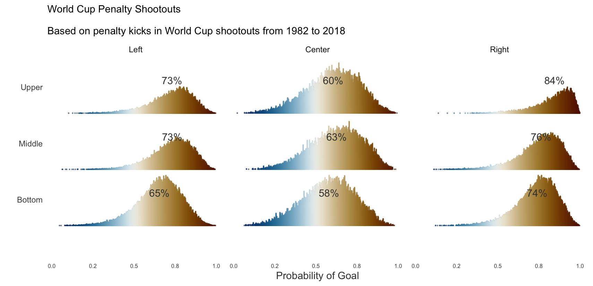
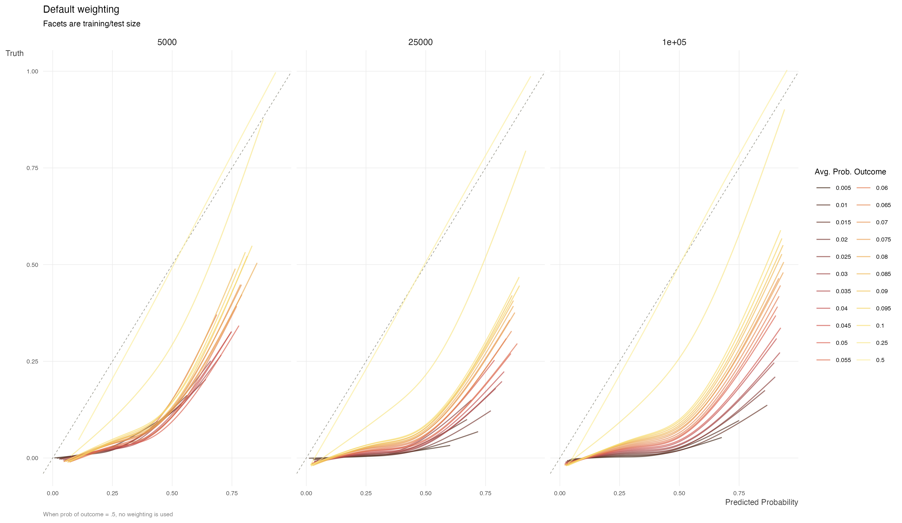

It’s been a bit so thought I’d force myself to post a couple things I’ve played around with, or that aren’t ready yet for a full post, or won’t be one.

## Football players still don’t know penalty kick basics

Did a quick and dirty Bayesian analysis to get posterior probabilities for location, controlling for various factors. As a side note, I won the office world cup challenge with a fancy model of which I will never reveal the details, but may or may not have included lots of guessing and luck.



## Tabular data post

I finally did my first post at the [Strong blog](https://www.strong.io/blog/)! It’s a [high-level overview of tabular data and deep learning](https://www.strong.io/blog/deep-learning-for-tabular-data-an-overview) that summarizes some of my previous posts [here](https://m-clark.github.io/posts/2022-04-01-more-dl-for-tabular/) and [here](https://m-clark.github.io/posts/2021-07-15-dl-for-tabular/).

## Class Imbalance

For my next post at the Strong blog, Elizabeth Monroe and I are working on a similarly high-level overview of issues with class imbalance we’ve been coming across. I will probably provide even more details and simulation results in a post on this site eventually, but here is a preview plot showing (mis)calibration plots at varying degrees of imbalance and different sample sizes.



## Two years at Strong

Hard to believe for me anyway, but I’ve been out of academia for two years now, after previously spending my professional lifetime there. Aside from some of the obvious differences, one of the more satisfying changes for me has been that the skills I’ve acquired are utilized on a daily basis, and something I need to continuously develop for the job. At Strong our clients want good results in a timely fashion, and though the results might be notably complex, they still need to be sufficiently interpretable as well as reproducible/production-ready. I also have come across more desire for causal explanations from clients, which might be surprising to what is typically assumed for academia vs. industry. Clients obviously require buy-in for what we do, but they ultimately defer to us for the expertise we provide.

[Strong Analytics](https://www.strong.io/) was a great move for me, because they clearly value the strong academic background of its employees, but are practically minded, and focus on skills that allow one to be nimble enough to get the clients what they need. Just like I was in academia, I am surrounded by a diverse group of smart folks I respect a lot, and am happy to solve some tough problems with. I feel I’ve learned how to get things done in a more efficient manner, and do a better job of explaining what I’ve done to wider audience.

Among some things I miss with academia, one was working with faculty and grad students who were just starting with an idea, and continuing a relationship with them until ultimately getting to publication or a successful dissertation defense after a very long journey. Another was giving workshops regularly where you could help people with their initial baby steps into the large world of data science. In general, it was easy to feel personally invested in the individuals you were working with, and their successes felt like your own.

However, in academia it was often a struggle to get buy-in for more complicated methods or new techniques, because the stakes were typically lower and people knew the minimum required to get them published, defended or whatever, and mostly just wanted help getting to that point. There’s nothing wrong with that necessarily, that’s just the practical reality, and a reflection of what’s valued in academia. Despite that, I can say I definitely had some good partnerships with people involved in challenging research that was very rewarding, and those projects made it generally very satisfying to work in academia.

Ultimately though, I’m happy to have made the jump. It’s a bit weird to me how much drama there is on this topic on twitter and elsewhere. It’s really not that big of a deal which route you go, and in the grand scheme of things, almost no one will care if you work in academia or industry but you. There are pros and cons to both, and people should just pick what will make them happier.

## Coming up

Whenever I can get around to it, I’ll try and post on those class imbalance simulations mentioned above, conformal prediction, and some other fun stuff. Stay tuned!

## Reuse

[CC BY-SA 4.0](https://creativecommons.org/licenses/by-sa/4.0/)

## Citation

BibTeX citation:

``` quarto-appendix-bibtex
@online{clark2023,
  author = {Clark, Michael},
  title = {Stuff {Going} {On}},
  date = {2023-03-10},
  url = {https://m-clark.github.io/posts/2023-03-misc/},
  langid = {en}
}
```

For attribution, please cite this work as:

Clark, Michael. 2023. “Stuff Going On.” March 10. <https://m-clark.github.io/posts/2023-03-misc/>.
