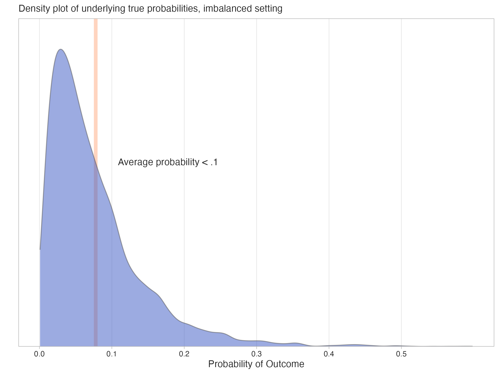
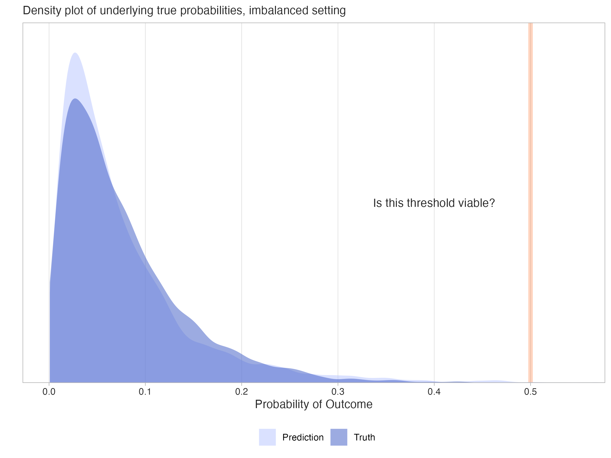
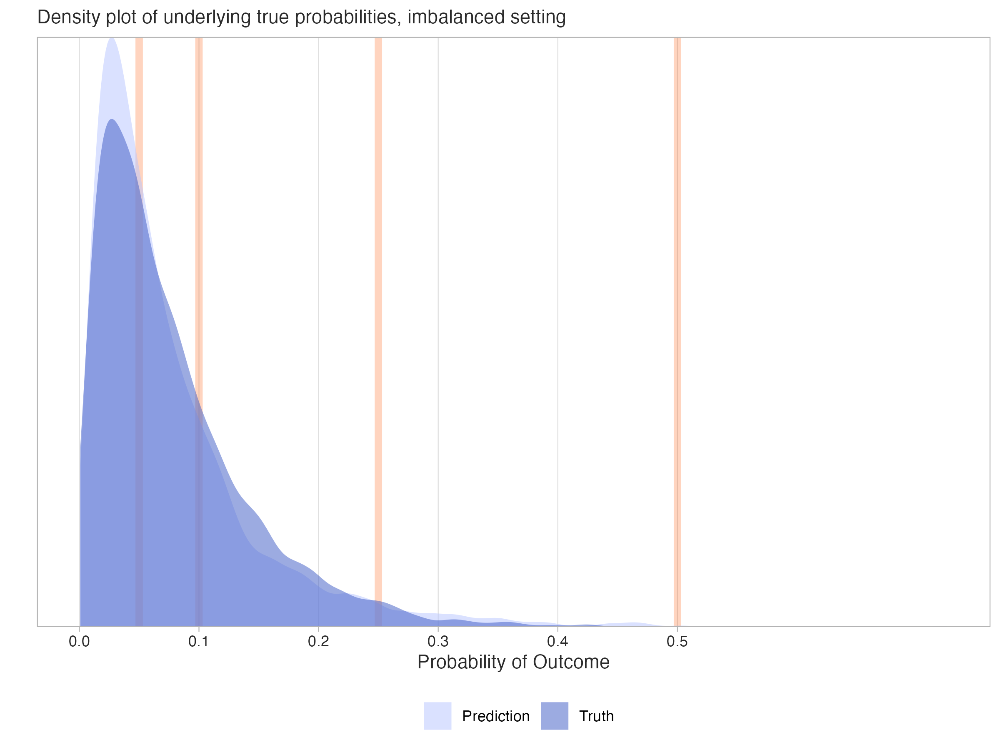
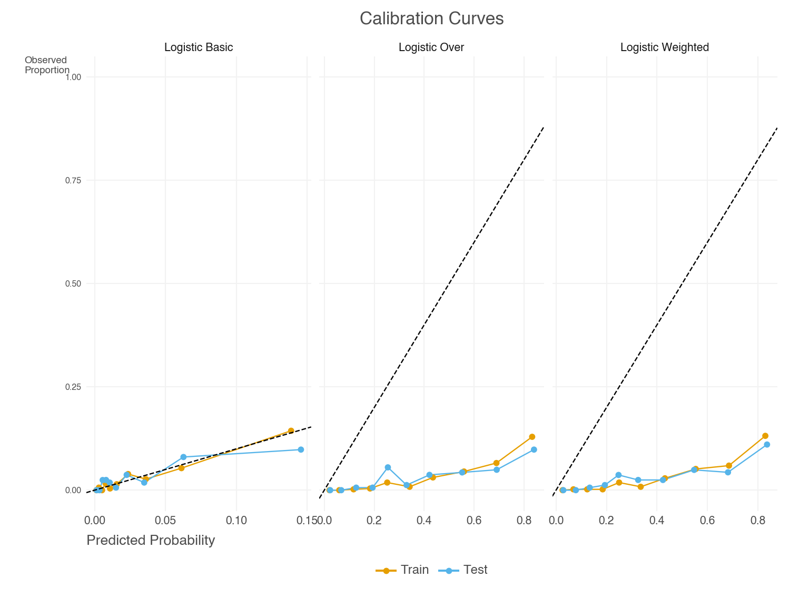
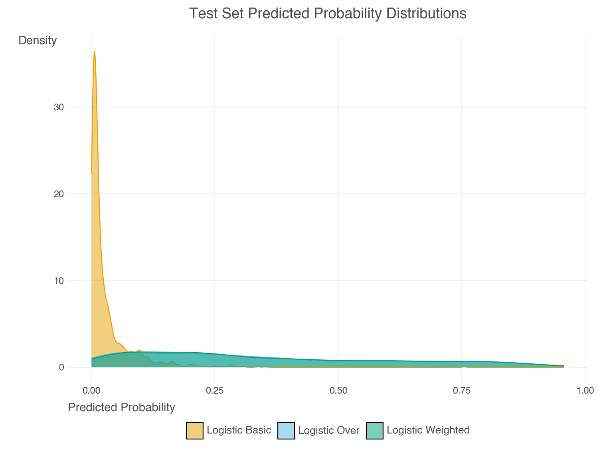

> This post began around two years ago and was initially intended for the Strong Analytics blog, but for various reasons never came to fruition. We still thought the spirit of the content was valuable, so we did what we could to get it out one way or another. Both the intended audience and focus have changed over time, but hopefully the end result is cohesive enough to be useful to a wide audience. Much gratitude is owed to Elizabeth Li for her contributions to the initial drafts, and editorial help beyond.

## Introduction

Imagine you’re working on a fraud detection system for a bank. Out of millions of financial transactions, only a tiny fraction are fraudulent. This is a classic example of *class imbalance*, where one class we are trying to predict (fraudulent transactions) is much rarer than the other (legitimate transactions). Depending on your modeling approach, ignoring the imbalance can lead to the predictions missing most of the fraudulent transactions, as well as other issues we’d like to avoid. Here we’ll explore various issues regarding class imbalance, as well as techniques to address it. As we’ll see, the problem is nuanced and, very often, simple approaches to deal with it can work very well.

### Goals

To guide our exploration, we have the following goals:

- Explain class imbalance generally
- Review examples and consequences of class imbalance
- Cover some common techniques for addressing the problem
- Investigate the effects of classification thresholds on performance metrics
- Explore a Case Study to see these concepts in action

By the end, you should have a good understanding of the challenges posed by imbalanced data, and how to address them in your own work.

## Understanding Imbalanced Data

The basic idea underpinning class imbalance is that one class is significantly less prevalent than the other, and this can happen for a variety of reasons, including the inherent nature of the data, or something about the way it was collected. For simplicity, we focus on the binary case, as it’s easier to get an intuitive understanding of what ‘imbalance’ would mean in that setting. However, the concepts discussed here can extend to multiclass settings also. Check out the [supplemental section](#sec-supp-multiclass) for a brief overview of the multiclass case.

In a typical classification task, we would use a default threshold of 0.5 to classify predicted probabilities into binary outcomes, with anything above the threshold going to one class and the rest to the other class. This approach works well when the classes are balanced or nearly so, but it can fail in imbalanced settings where the minority class is underrepresented. For example, if less than 1% of the target data belongs to the minority class, a model trained without accounting for this imbalance may struggle to identify minority class instances effectively, if at all, and fall short for the task at hand.

### Real-world Examples

Class imbalance is common in many real-world scenarios, such as:

- Fraud detection: As in our opening example, the vast majority of transactions are legitimate, but a small percentage are fraudulent.
- Click-through rate: Most users on a website do not click on ads, but a small percentage do.
- Disease detection: Consider classifying medical images for a rare disease. The vast majority of images may represent normal tissue, while only a small fraction show signs of the disease.
- Spam detection: In email datasets, the majority of emails are legitimate (non-spam), while only a small fraction are spam emails.

As one can see, it’s quite common and natural to have imbalanced data in many real-world applications. So how does it affect our modeling?

### Is imbalance a problem?

Is imbalance a problem? Well, not exactly, at least not inherently. The real challenge often arises from its implications, such as the sample size (of the minority class), model limitations, and the metrics we use to evaluate the model.

For example, let’s say you had 10 million observations and 1% of them were in the minority class. Despite the imbalanced classes, you would likely have enough to work with to discover the feature-target relationships, and obtain good estimates of a variety of metrics even after test and validation splits. But with a smaller total sample or even rarer class prevalence, the problems of imbalance can be exacerbated due to the lack of data to work with, making it difficult to learn meaningful patterns or evaluate the model reliably.

In other cases, our model may not produce good predictions for the minority class, even if we have enough data. Maybe the model is not well suited to the problem, or the features aren’t strong enough to make good classifications. In this case, even if your data was balanced you’d potentially still have poor performance, and it will likely be worse with imbalance.

And finally, some metrics, even common ones such as accuracy, can be deceptive in the imbalanced setting. As an example, they may reflect the majority class performance while ignoring the minority class.

Addressing these challenges requires a thoughtful modeling approach and use of performance metrics, which we will explore in the following sections.

## Techniques for Dealing with Imbalanced Data

There are a number of techniques one can use for handling imbalanced data to help meet modeling goals. Here, we will discuss a few commonly used methods, categorized into sampling-based techniques, algorithmic adjustments, and specialized approaches. Then we’ll see some in action later with our case study.

### Sampling-based Techniques

Sampling-based techniques involve modifying the original dataset to balance the class distribution. These techniques can be broadly grouped into oversampling, undersampling, and hybrid sampling.

#### Oversampling

*Oversampling* is a technique where we increase the number of observations in the minority class. Most commonly this is done by duplicating observations in the minority class or by generating synthetic observations.

*Random over-sampling* (ROS) is akin to a bootstrap approach where we duplicate observations by sampling with replacement from the minority class, and this in turn increases the total number of observations. This is the simplest oversampling approach, and is often enough to potentially improve model performance on metrics that may be of interest. Other more complicated oversampling techniques could be used, but in practice are rarely going to do much better. However, while effective, oversampling can lead to overfitting, as the model may learn to memorize the duplicated observations rather than generalize from them.

There are also several methods for generating synthetic observations. Popular techniques include *SMOTE* (Synthetic Minority Over-sampling Technique), along with SMOTE variants such as Borderline-SMOTE and *ADASYN* (Adaptive Synthetic Sampling). SMOTE generates synthetic observations by creating interpolations of nearest neighbors of the minority class observations. It can be useful if using a ‘weak learner’ for the model (e.g. a simple logistic regression), but generally does not lead to improvement for modeling techniques common in machine learning, such as tree-based methods.

A good package for implementing these techniques is the `imbalanced-learn` package in Python. The package is well-documented and easy to use, and is a good starting point for practitioners.

#### Undersampling

In contrast to oversampling, *undersampling* takes the opposite approach, reducing the number of observations in the majority class to make the target more balanced.

*Random under-sampling* (RUS) is a technique where we decrease the number of observations in the majority class by randomly selecting observations in the majority class to remove. The goal is again to create a more balanced dataset. While it can be effective in that regard, it can also lead to loss of important information, especially if the sample size is not very large to begin with.

Other techniques look at nearest neighbors of the majority class, i.e. observations that are very similar, and remove some of them assuming they are not adding useful information. Variations include approaches, e.g., *NearMiss*, that are similar to ‘matched samples’ techniques long employed in statistical settings.

#### Hybrid Sampling

Hybrid sampling is a technique where we combine oversampling and undersampling to create a (more) balanced dataset. This is often done by oversampling the minority class and undersampling the majority class, and as before this could be done in a random fashion. An alternative hybrid sampling approach could also involve removing some observations from both classes that would be nearest neighbors (*TOMEK* links), which would hopefully improve the model’s ability to classify the observations among those that remain, as they are more clearly delineated among the features.

### Algorithmic Techniques

We use the term ‘algorithmic techniques’ to refer to those that involve adjusting some aspect of the model estimation. Unlike sampling-based techniques, we do not manipulate the data directly.

#### Weighting

In some modeling contexts, we can adjust the importance of each example to handle the imbalance. The loss function is adjusted so that losses from the minority class contribute more than losses from the majority class. This is often done in the context of *cost-sensitive learning*, where the cost of misclassifying an observation in the minority class is higher than the cost of misclassifying an observation in the majority class.

For some models, like logistic regression, weighting would essentially be equivalent to what is done with simple resampling techniques, negating the need to employ the latter. For example, doubling the weight of an observation would be equivalent to having two copies of the observation in the dataset. However, for other models, like tree-based methods, weighting and resampling are not equivalent. For example, in a random forest, resampling changes the composition of the bootstrap samples used to build the trees, while weighting changes the importance of each observation in the calculation of splits within each tree. As such, the difference in how the data is used can lead to different model behaviors and outcomes.

#### Thresholding

Thresholding regards changing the classification cutoff to account for the imbalance in the data. The default threshold of 0.5 is an intuitive choice (Goorbergh et al. ([2022](#ref-van_den_goorbergh_harm_2022))), but is often not effective for imbalanced data. When modifying the threshold, we can use a lower threshold to potentially increase the number of positive classifications, or raise it to ensure we are only classifying the most confident observations as positive.

Identifying an optimal threshold can significantly improve certain metrics we may be interested in, especially when we want to avoid certain types of errors. And though this is a simple approach, it can actually be quite effective at achieving our goals in the context of imbalanced data, and there are a number of different techniques that can be used to identify the optimal threshold for our modeling purposes. Some of these are outlined in the [supplemental section](#sec-supp-thresh).

### Other Techniques

You can find other techniques that are used to handle imbalanced data for specific model settings. For example, in uplift modeling, the goal is to predict the difference in outcomes between two groups, and the data is often imbalanced. Some will use a *class variable transformation* to predict differences in outcomes between treatment and control groups.

In addition, some approaches have been used in the context of deep learning models. For example, some focus on using different loss functions like *focal loss* (Lin et al. ([2018](#ref-lin_focal_2018))) and *label smoothing*. Others try different optimization approaches like *sharpness-aware minimization* (SAM, see Foret et al. ([2021](#ref-foret_sharpness-aware_2021))), data augmentation, and more[^1]. At this time, it’s still difficult to know in advance whether deep learning models and associated methods for imbalance will work well for a typical tabular data setting, but they may be worth trying if you have the time and resources, and especially if your data is homogenous in nature[^2]. In general, you may need to try a few different approaches to see what works best for your data and your model.

## Performance Metrics with Imbalanced Data

When evaluating classification models, performance metrics are essential for understanding how well a model is performing and for identifying areas for improvement. However, in the context of imbalanced data, these metrics can be misleading if not used with care. This is because many metrics are sensitive to the classification threshold, so it’s important to consider how thresholds impact both classifications and the metrics derived from them.

### The Role of Thresholds in Balancing Trade-offs

As noted previously, when creating a classification label, we use a threshold, or cutoff point, to determine which class to assign to the observation based on predicted probability for that observation. Anything beyond the threshold is classified as the positive class, and anything below is classified as the negative class. So, the choice of threshold directly affects the resulting classifications, and the performance metrics derived from them.

It’s important to note that there is not an inherently right or wrong choice here. For example:

- A lower threshold, which would lead to more positive classifications, may be appropriate when missing positive cases (false negatives) is costly, such as in disease detection[^3].
- A higher threshold, leading to fewer positive classifications, may be better when false positives are more problematic, such as in fraud detection.

The impact of thresholds highlights the trade-offs inherent in classification tasks, and selecting a threshold that aligns with the specific goals and constraints of your application is critical. Now let’s take a closer look at how thresholds can affect performance metrics. If you feel you already have the gist, you can skip ahead to the [case study](#sec-case-study) to see how this plays out in practice.

### The Confusion Matrix

Many commonly used metrics such as accuracy, precision, recall, and F1 score, are derived from the *confusion matrix*. The confusion matrix is the initial summary of the relationship between the predicted and observed classes. However, any metric derived in this way will be sensitive to the classification threshold.

On the other hand, many other metrics derived from predicted probabilities. Examples include the area under a receiver operating curve (AUROC) and Brier score, and these metrics are independent of the classification threshold, and so can provide an additional view of model performance. These metrics are particularly valuable in imbalanced settings, where the threshold-dependent metrics may fail to capture the nuances of model behavior. Let’s now see how this works.

### Example: Classification with a .5 Threshold

In the following hypothetical example, the positive rate for the binary target is low - the true average underlying probability of the positive outcome is less than 0.1. Though in practice we’d not know the true probabilities, here we can visualize what their distribution might look like in the following density plot, where the mean probability of the positive class is marked by the line.



Figure 1: Density plot of underlying true probabilities, imbalanced setting

Now assume we have a model that predicts probabilities for the target outcome. It may even produce probabilities that correspond well to the true probabilities, as shown in the following plot.



Figure 2: Predicted vs. True Probabilities

Now, what might a confusion matrix for such data look like with a standard threshold of 0.5? In our hypothetical dataset, we have 100 total for the sample, but there are only five positive observations. Using the default threshold leads to ineffective classification of the minority class, as we only classified two observations as positive, and only one was correct. In this case our precision is 50%, meaning that half of the positive classifications were correct, but our recall is only 20%, meaning we only classified one out of five possible positive observations correctly.

|             | Observed - | Observed + | Metrics  |
|-------------|------------|------------|----------|
| Predicted - | 94         | 4          | NPV: .96 |
| Predicted + | 1          | 1          | PPV: .50 |
| Metrics     | TNR: .99   | TPR: .20   | ACC: .95 |

Table 1: Confusion Matrix 1: Standard Threshold

Abbreviations:

- *ACC*: Accuracy
- *TPR*: True Positive Rate/Sensitivity/Recall
- *TNR*: True Negative Rate/Specificity
- *PPV*: Positive Predictive Value/Precision
- *NPV*: Negative Predictive Value

Although classifying one observation out of five true positive cases is not something we’d probably be satisfied with, the accuracy score is 95% because almost all the negative observations were correctly classified (true negative rate = 99%). Without any additional context, someone might think 95% accuracy was a good result, but it’s actually no better than guessing, or just labeling all observations as the most common (negative) class, which would have also resulted in 95% accuracy. The other metrics in the confusion matrix like precision (PPV) and recall (TPR) provide the additional context that we need to understand the model’s performance - namely, that we are not doing so well with the positive class, which is typically not a desirable outcome.

### Example: Classification with a Lower Threshold

The next plot shows different possible threshold values we could use for the predicted probabilities. With each threshold, we’d potentially create different classifications, resulting in a new confusion matrix and different metrics based on those predicted classes.



Figure 3: Predicted vs. true probabilities with different thresholds

Now let’s see what happens to the performance metrics if we try using a lower classification threshold than 0.5, say something closer to ~.1. Here is what the resulting table might look like.

In this setting, the accuracy score has dropped from 95% to 84%, but we really shouldn’t too be concerned with this, as accuracy isn’t usually our focus in the imbalanced setting. Again, we could have guessed and gotten 95% correct. One new result is that the true positive rate (recall) has notably increased - from 20% to 80% - there are now four out of five possible correct positive classifications. This is much better! But looking further, it did come at the cost of a higher false positive rate - ~16% for this result vs. 1% previously[^4]. The positive predictive value (PPV) has also dropped from 50% to 21%, meaning that only about one in five of the positive classifications were correct. This is a common trade-off in imbalanced settings, where increasing recall often comes at the cost of precision, and vice versa. In general, this result suggests that the model is now doing a better job of capturing the positive class. But while we gain in some metrics, we’ve lost ground in others. Again, it’s a trade-off.

|             | Observed - | Observed + | Metrics  |
|-------------|------------|------------|----------|
| Predicted - | 80         | 1          | NPV: .99 |
| Predicted + | 15         | 4          | PPV: .21 |
| Metrics     | TNR: .84   | TPR: .80   | ACC: .84 |

Table 2: Confusion Matrix 2: Lower Threshold

The following table provides some additional metrics to consider for the two confusion matrices. In particular, we see the *F1 score*, the *balanced accuracy* score, the area under a receiver operating curve (*AUROC*) score. These are common alternatives used in the imbalanced setting.

| Metric | Conf. Matrix 1 | Conf. Matrix 2 |
|----|----|----|
| F1 | .29 | .33 |
| Bal. Acc. | .59 | .82 |
| AUROC | .70 | .70 |
| Confusion Matrix 1: Standard Threshold; Confusion Matrix 2: Lower Threshold |  |  |

Table 3: Additional Metrics

The F1 score is the harmonic mean of precision (positive predictive value) and recall (true positive rate), and balanced accuracy is the average of the true positive rate and true negative rate, or the average recall for both positive and negative classes. These are less sensitive to the class imbalance than accuracy, but they are still sensitive to the threshold used to create the classifications. In this case, both improve with a lower threshold, though the F1 score only changes slightly.

In contrast, the AUROC score is based on the predicted probabilities, and so is independent of the threshold, which is why it is constant in [Table 3](#tbl-add-metrics)[^5]. It is a useful metric in this context to consider because it considers the relationship between the true positive rate and true negative rate at many different thresholds, not just the single threshold you happened to select (Google ([2025](#ref-google_classification_2025))). As such, this score is often a preferred metric, even in the balanced classification setting.

We’ve now seen a few performance metrics, but there are many available, and we’ll see even more later. Each provides a different facet with which to view your model’s performance. With this in mind, you should decide which aspects of your model’s performance are most important to your use case, and choose your metrics accordingly.

## Case Study: Wine Quality Data

At this point, we have covered a lot of ground regarding imbalanced data. We have an idea of the concept generally, the different techniques we might use in the imbalanced setting, as well as the metrics we might use to evaluate our models. We’ve also seen how the choice of classification threshold can affect our model’s performance metrics. To illustrate the concepts discussed in practice, we will demonstrate the application of various techniques for approaching imbalanced data. For the full notebook that produced these, see [this repo link](https://github.com/m-clark/m-clark.github.io/blob/master/posts/2025-01-28-class-imbalance/wine_quality.ipynb) and play around with it yourself.

### Data Setup

We will be using the popular wine quality data. The raw data and more detail is available at the [UCI Repository](https://archive.ics.uci.edu/ml/datasets/wine+quality). Our data combines two datasets, one for red wine and one for white wine. There are 6497 total observations and 17 features that regard different aspects of the wine, like acidity, pH, and alcohol content. We also include a binary feature for whether the color of the wine is red.

The original target is numeric, but for our purposes we are attempting to classify wines with a rating of 8 or 9 as ‘high quality’. This represents 198 high quality wines, about 3.0% of the data. Data was randomly split into a 75% training set and a 25% test set. The test set has 50 high quality wines.

This is a good example of how imbalanced data can really make your data feel even smaller. We start with a decent amount of data, but only a small fraction of it is high quality wine, and our test set used for evaluation will only have 50 high quality wines. This is not a lot to work with, and results in noisy metrics based on classification, where just a slight change in the predictions could lead to a noticeable change in the metric. For example, if we had an accuracy of say, 80%, the lower and upper bound estimate would be 66% and 90%, respectively, which is a wide range.

### Models

We use two base models, a standard logistic regression model via sklearn and a boosting model via LightGBM. Both use all non-target columns as features. We will compare the performance of the following models:

- Basic approach that does nothing for imbalance and uses a threshold of 0.5
- Basic approach that uses an ‘optimal’ threshold for classification
- A weighted model (using `class_weight='balanced'` for the logistic and `is_unbalance=True` for the LGBM)[^6]
- A random oversampling approach (oversampling) [^7]

The optimal threshold can be determined in a variety of ways, and one can look at the [supplemental section](#sec-supplemental) for more details on choosing the optimal threshold. Here we used a threshold that maximizes the F-beta score on test, with beta = 2. This means we are giving more weight to recall than precision, which is often the case in imbalanced settings[^8].

In addition, LGBM models were compared both with and without tuning. The latter case makes a more straightforward comparison since the parameters are identical in each case. But realistically, we would tune this type of model, so we include models tuned for number of estimators/trees, learning rate, and max depth[^9].

Metrics and other exploration that follows focuses on the test set. We will also look at the calibration curves for some models, which can help us understand how well the predicted probabilities align with the observed class proportions.

### Metrics

Now let’s get to some results. Along with several metrics we’ve already discussed, we’ve added a few others including:

- *Brier Score*: A measure of the mean squared difference between predicted probabilities and the true outcome. This is equivalent to the MSE for a binary target. Lower is better (see [Harrell 2017](#ref-harrell_damage_2017) for additional perspective).
- *Adaptive Calibration Error*: A measure of the calibration of the model. Lower is better (see [Nixon et al. 2020](#ref-nixon_measuring_2020)).
- *FPR*: False Positive Rate.
- *FNR*: False Negative Rate.

These metrics help us shift focus to the calibration of the model and penalties for misclassification. For each of these we’d prefer lower values. In addition, we looked at the *F2 Score*, a variant of the F-score that gives more weight to recall than precision. This is useful when false negatives are more costly than false positives, such as in fraud detection or disease diagnosis. As with F1, higher is better.

### Logistic Model Results

With these in mind, let’s look at the logistic model results. We’ll first focus on metrics that are based on the predicted classes. For metric definitions used in all the tables, see the [supplemental section](#sec-supp-metrics). Best values are bolded/blue.

| Model | Threshold | Mean Pred | Precision | Recall | F1 Score | F2 Score | FPR | FNR | Total Pos Pred | Threshold Method |
|----|----|----|----|----|----|----|----|----|----|----|
| Logistic Basic | 0.500 | 0.031 | 0.000 | 0.000 | 0.000 | 0.000 | 0.001 | 1.000 | 1 | Default |
| Logistic Basic (T) | 0.063 | 0.031 | 0.105 | 0.500 | 0.174 | 0.286 | 0.135 | 0.500 | 237 | F2 |
| Logistic Over | 0.500 | 0.350 | 0.062 | 0.580 | 0.112 | 0.217 | 0.279 | 0.420 | 468 | Default |
| Logistic Weighted | 0.500 | 0.350 | 0.066 | 0.600 | 0.119 | 0.229 | 0.270 | 0.400 | 456 | Default |
| \(T\) means that classification is based on an optimal threshold, but the model is the same as the corresponding "Basic" model. See the supplemental section for details. |  |  |  |  |  |  |  |  |  |  |

Table 4: Test Set Model Classification Metrics for Logistic Regression

The basic logistic with default threshold of 0.5 does very poorly, predicting only 1 positive case, and it doesn’t even get that right! Shifting to a lower threshold for this model (~0.063) improves most metrics, and it’s better than the weighted and resampling approaches on several metrics. However, the threshold improvement is no free lunch - we now classify 237 cases as positive, which is probably too many. As a result, the FPR is increased.

The sampling and weighted approaches come to the same conclusions, which is expected for logistic regression. While both would be better than doing nothing at all, both predict far too many positive cases, ~9 times what’s observed in the data! The mean predicted probability is also high (~0.35), which is a sign that the model is overpredicting the minority class. However, this makes sense when considering the fact that the training data was resampled to a balanced state, or the model was estimated as if it were via weighting.

Now let’s look at the metrics that are based on the predicted probabilities. Again, consult the [supplemental section](#sec-supp-metrics) for brief definitions of these metrics. Since thresholding doesn’t matter here, we exclude it from the table, as it’s identical to the basic model.

| Model | Threshold | Mean Pred | AUROC | Avg Prec | Brier Score | ACE |
|----|----|----|----|----|----|----|
| Logistic Basic | 0.500 | 0.031 | 0.752 | 0.093 | 0.030 | 0.015 |
| Logistic Over | 0.500 | 0.350 | 0.744 | 0.084 | 0.186 | 0.319 |
| Logistic Weighted | 0.500 | 0.350 | 0.752 | 0.084 | 0.183 | 0.318 |
| \(T\) means that classification is based on an optimal threshold, but the model is the same as the corresponding "Basic" model. See the supplemental section for details. |  |  |  |  |  |  |

Table 5: Test Set Model Probability Metrics for Logistic Regression

While AUROC and average precision aren’t too different among the models, note how the Brier score and ACE are notably lower for the basic model. This suggests better calibration. Let’s see what this looks like in the [calibration curves](https://scikit-learn.org/stable/auto_examples/calibration/plot_calibration_curve.html) and the predicted probabilities.



Figure 4: Calibration Curves for Logistic Regression

  

We can see in [Figure 4](#fig-calibration-logistic) that the basic model predicted probabilities are well-calibrated, which is also reflected in the notably lower Brier and ACE scores. Weighting and resampling lead to over-prediction of the minority class. We can see this by also examining the predicted probabilities directly, as in [Figure 5](#fig-predicted-probs-logistic). Their mean prediction is well beyond the observed rate[^10].



Figure 5: Predicted Probabilities for Logistic Regression

### LGBM Model Results

Now let’s look at the LGBM model results, starting with the classification metrics.

| Model | Tuned | Threshold | Mean Pred | Precision | Recall | F1 Score | F2 Score | FPR | FNR | Total Pos Pred | Threshold Method |
|----|----|----|----|----|----|----|----|----|----|----|----|
| LGBM Basic | Not | 0.500 | 0.022 | 0.840 | 0.420 | 0.560 | 0.467 | 0.003 | 0.580 | 25 | Default |
| LGBM Basic | Tuned | 0.500 | 0.028 | 1.000 | 0.320 | 0.485 | 0.370 | 0.000 | 0.680 | 16 | Default |
| LGBM Basic (T) | Not | 0.028 | 0.022 | 0.256 | 0.620 | 0.363 | 0.483 | 0.057 | 0.380 | 121 | F2 |
| LGBM Basic (T) | Tuned | 0.061 | 0.028 | 0.228 | 0.660 | 0.338 | 0.478 | 0.071 | 0.340 | 145 | F2 |
| LGBM Over | Not | 0.500 | 0.041 | 0.522 | 0.480 | 0.500 | 0.488 | 0.014 | 0.520 | 46 | Default |
| LGBM Over | Tuned | 0.500 | 0.020 | 0.759 | 0.440 | 0.557 | 0.480 | 0.004 | 0.560 | 29 | Default |
| LGBM Weighted | Not | 0.500 | 0.045 | 0.500 | 0.500 | 0.500 | 0.500 | 0.016 | 0.500 | 50 | Default |
| LGBM Weighted | Tuned | 0.500 | 0.051 | 0.500 | 0.460 | 0.479 | 0.467 | 0.015 | 0.540 | 46 | Default |
| \(T\) means that classification is based on an optimal threshold, but the model is the same as the corresponding "Basic" model. See the supplemental section for details. |  |  |  |  |  |  |  |  |  |  |  |

Table 6: Test Set Model Classification Metrics for LGBM MOdel

There’s more to digest here, but in general we see the following:

- Unsurprisingly, these models did better than the logistic model approaches.
- The basic model with or without thresholding/tuning did better on several metrics than the weighted and resampling approaches.
- The issues with weighting and resampling were far less pronounced in the LGBM models, but were still present. For example, the mean predictions are higher than the basic models, and higher than the base rate, except for the over-sampled with tuning model.
- We also saw that the thresholding approach still led to far more predicted positives than would be expected, and with it, a higher false positive rate.

A couple other things to note. One model has perfect precision! However it comes at the cost of the highest false negative rate/lowest recall. In addition, our optimal threshold was chosen based on the value that maximized F2, but that model did not have the highest F2 score of all models. They did have the highest recall however, which is what F2 puts more weight on.

Now let’s look at the probability-based metrics. Again the thresholding results are removed as they aren’t applicable and duplicate the basic models.

| Model | Tuned | Threshold | Mean Pred | AUROC | Avg Prec | Brier Score | ACE |
|----|----|----|----|----|----|----|----|
| LGBM Basic | Not | 0.500 | 0.022 | 0.878 | 0.521 | 0.019 | 0.011 |
| LGBM Basic | Tuned | 0.500 | 0.028 | 0.876 | 0.510 | 0.020 | 0.008 |
| LGBM Over | Not | 0.500 | 0.041 | 0.849 | 0.515 | 0.026 | 0.031 |
| LGBM Over | Tuned | 0.500 | 0.020 | 0.850 | 0.526 | 0.020 | 0.014 |
| LGBM Weighted | Not | 0.500 | 0.045 | 0.852 | 0.519 | 0.027 | 0.029 |
| LGBM Weighted | Tuned | 0.500 | 0.051 | 0.850 | 0.518 | 0.027 | 0.034 |
| \(T\) means that classification is based on an optimal threshold, but the model is the same as the corresponding "Basic" model. See the supplemental section for details. |  |  |  |  |  |  |  |

Table 7: Test Set Model Probability Metrics for LGBM Model

Much the same story - neither weighting nor over-sampling helped much here. In general, all models performed pretty similarly on these metrics, though we might think the basic models did a bit better on AUROC.

## Discussion

In general, any of these model approaches might be viable, as the choice may depend mostly on your tolerance for certain types of classification errors. For example, if you are more concerned with false positives, i.e. you really don’t want to classify a wine as good if it’s not, you might \*not\* prefer the thresholding models, or maybe use a thresholding approach that emphasizes precision. On the other hand, if you are more concerned with correctly judging a good wine as good, you might prefer the thresholding LGBM models that did better on recall.

It’s worth pointing out that many metrics are very correlated with, or even directly dependent, upon one another. For example, if positive predictions are increased with a lower threshold, then the true positive rate will potentially increase, but the false positive rate might increase as well. Any metrics that are based on these rates will also necessarily change. This is why it’s important to consider the actual classifications and the trade-offs that come with them. Choosing a model based on one metric may be essentially equivalent to choosing one based on another metric.

Note again that several of the metrics are based on the predicted probabilities, not the classifications, so the reported value will not change with the classification threshold. For model selection, you might be better off using these, or the standard loss function for the model, rather than the classification metrics that can be easily manipulated. This would be more the case in smaller data settings or very rare positive rates, where metric values could swing wildly with only slightly different classifications.

## Summary

In this post, we explored various techniques for handling imbalanced data, including sampling-based and algorithmic methods. We demonstrated the impact of different classification thresholds on performance metrics, and discussed the importance of selecting appropriate metrics for the situation. Our case study on wine quality data highlighted the practical application of these techniques and their effect on model performance. In general, we saw that simple approaches often work well.

Key takeaways:

- Imbalanced data is common in real-world settings, and can lead to issues with various model performance metrics.
- There are a number of ways to approach imbalanced data, including sampling-based and algorithmic techniques.
- Using the default classification threshold of 0.5 may not be appropriate for classification with imbalanced data, and selecting an optimal threshold may prove beneficial.
- Depending on the setting, *you can do nothing and possibly be just fine*. But if you need to do something, simple approaches often do the job.
- With metrics that depend on classification, you need to carefully consider the trade-offs that come with them.
- Focusing on metrics that don’t rely on classification threshold can potentially help you avoid the pitfalls associated with class imbalance.

In conclusion, while class imbalance may present challenges for model development and evaluation, the solutions need not be complex. The key is to understand your specific use case—what types of errors are most costly, what metrics align with your goals, and what trade-offs you’re willing to make. Hopefully this exploration has provided you with practical insights and a clear framework for tackling imbalanced data in your own work.

## Supplemental

### Table Metrics

The first table for logistic and LGBM models shows the following metrics. An arrow (↑ or ↓) indicates whether a higher or lower value is better for the metric.

- *Threshold*: the threshold value used for classification.
- *Mean Pred*: the mean predicted probability for the positive class. Ideally this should be close to the observed proportion of positive cases.
- *Precision*: the proportion of correctly predicted positive cases among all predicted positive cases. ↑
- *Recall*: the proportion of correctly predicted positive cases among all actual positive cases. ↑
- *F1 Score*: the harmonic mean of precision and recall. ↑
- *F2 Score*: a variant of the F1 score that gives more weight to recall. ↑
- *FPR*: False Positive Rate, the proportion of incorrectly predicted positive cases among all actual negative cases. ↓
- *FNR*: False Negative Rate, the proportion of incorrectly predicted negative cases among all actual positive cases. ↓
- *Total Pos Pred*: the total number of positive predictions.
- *Threshold Method*: the method used to select the classification threshold.

The second table shows the following metrics:

- *Threshold*: the threshold/cutoff value used for classification.
- *Mean Pred*: the mean predicted probability for the positive class.
- *AUROC*: the area under the receiver operating characteristic curve. ↑
- *Avg Prec*: the average precision (area under the precision-recall curve). ↑
- *Brier Score*: a measure of the mean squared difference between predicted probabilities and the true outcome. ↓
- *ACE*: the adaptive calibration error (Nixon et al. ([2020](#ref-nixon_measuring_2020))). ↓

### Brief Discussion of the Multiclass Setting

While we’ve focused on binary classification, many real-world problems involve more than two classes. Multiclass settings can present additional challenges with imbalanced data, as the relationships between classes become more complex and the interpretation of performance metrics needs adjustment.

In multiclass settings, we often use the same core metrics as in binary classification (precision, recall, F1, etc.), but we need to consider how to aggregate these metrics across classes. Two common approaches are:

**Weighted Average**: This approach takes into account the number of instances in each class. Each class’s metric is weighted by the proportion of instances in that class. It may be useful when you want to account for class imbalance to ensure that metrics from larger classes have a greater impact on the overall score.

**Macro Average**: This approach calculates the metric independently for each class and then takes the average of these metrics. Each class is treated equally, regardless of its size. It is useful when you want to ensure that the model performance assessment is consistent across all classes, rather than being dominated by the performance on the more frequent classes.

As in the binary case, the choice between these approaches depends on your specific goals. Use weighted averaging when you want metrics to reflect the natural class distribution, and macro averaging when you want to ensure consistent performance across all classes.

### Choosing a Classification Threshold

As we have noted, the default threshold of 0.5 is often used as a classification threshold, but it may not be optimal in many cases, particularly in the imbalanced setting. Each of these and other similar methods have their own advantages and may be suitable for different scenarios. Here are some common methods for selecting a classification threshold:

1.  **Metric Optimization**: Choose a threshold that maximizes or minimizes a specific metric:

    - **F-Beta Scores**: Adjust the β parameter to weight the relative importance of precision vs. recall. \\F_1\\ gives equal weight, \\F_2\\ favors recall, and \\F\_{.5}\\ favors precision.
    - **Precision-Recall Trade-off**: Select a threshold based on the precision-recall curve to achieve desired balance between these metrics.
    - **ROC-based**: Choose the threshold that maximizes the geometric mean of sensitivity and specificity.

2.  **Cost-Sensitive Thresholding**: This involves selecting a threshold that minimizes the overall cost of misclassification. This can be done by assigning different weights to false positives and false negatives and choosing the threshold that results in the lowest weighted error. This does not require an algorithmic approach though, as you can just select a threshold based on domain knowledge.

3.  **Other Statistical Approaches**:

    - **Youden’s J Statistic**: Youden’s J is defined as sensitivity + specificity - 1. This approach maximizes the sum of sensitivity and specificity, and is equivalent to maximizing vertical distance from ROC curve to diagonal.
    - **Equal Error Rate (EER)**: Sets threshold where false positive rate equals false negative rate.

4.  **Data-driven**: Use the observed class proportion (base rate) as the threshold, which may be appropriate when you want predictions to reflect the natural class distribution. This is simple and good for a quick baseline, but may not be optimal in all cases.

For this post, we explored using different thresholds out of curiosity, and here are the results for the LGBM (Basic) models, and only those metrics that are actually affected by the threshold. The different methods explored included optimizing AUROC (`ROC`), AUPRC (`PRC`), F.5, F1, and F2 (`F*`), and simply using the base rate/observed proportion as a cutoff (`Obs. Prop.`). In the following, the untuned model parameters are identical, and the tuned models are also identical. Within each of those groups, the only difference is the threshold method used. All metrics regard the test set.

| Threshold | Precision | Recall | F.5 Score | F1 Score | F2 Score | FPR | FNR | Total Pos Pred | Tuned | Optimization Method |
|----|----|----|----|----|----|----|----|----|----|----|
| 0.00 | 0.09 | 0.82 | 0.12 | 0.17 | 0.32 | 0.25 | 0.18 | 433 | Not | ROC |
| 0.72 | 1.00 | 0.40 | 0.77 | 0.57 | 0.45 | 0.00 | 0.60 | 20 | Not | F.5 |
| 0.58 | 0.91 | 0.42 | 0.74 | 0.58 | 0.47 | 0.00 | 0.58 | 23 | Not | F1 |
| 0.03 | 0.26 | 0.62 | 0.29 | 0.36 | 0.48 | 0.06 | 0.38 | 121 | Not | F2 |
| 0.72 | 1.00 | 0.40 | 0.77 | 0.57 | 0.45 | 0.00 | 0.60 | 20 | Not | PRC |
| 0.03 | 0.26 | 0.60 | 0.29 | 0.36 | 0.48 | 0.05 | 0.40 | 115 | Not | Obs. Prop. |
| 0.06 | 0.23 | 0.66 | 0.26 | 0.34 | 0.48 | 0.07 | 0.34 | 145 | Tuned | ROC |
| 0.45 | 0.95 | 0.36 | 0.71 | 0.52 | 0.41 | 0.00 | 0.64 | 19 | Tuned | F.5 |
| 0.34 | 0.75 | 0.42 | 0.65 | 0.54 | 0.46 | 0.00 | 0.58 | 28 | Tuned | F1 |
| 0.06 | 0.23 | 0.66 | 0.26 | 0.34 | 0.48 | 0.07 | 0.34 | 145 | Tuned | F2 |
| 0.40 | 0.90 | 0.38 | 0.71 | 0.54 | 0.43 | 0.00 | 0.62 | 21 | Tuned | PRC |
| 0.03 | 0.13 | 0.68 | 0.15 | 0.21 | 0.36 | 0.15 | 0.32 | 270 | Tuned | Obs. Prop. |

Table 8: Comparison of Threshold Methods for the LGBM Models

In our case study, thresholding that was relatively more focused on precision (F.5/AUPRC) led to a high threshold, few positive predictions, and a low false positive rate. Thresholding that was relatively more focused on recall (F2) led to a notably lower threshold than .5, more positive predictions, and a higher false positive rate. The geometric mean/ROC approach led to the most positive predictions, and thus a notably high false positive rate, but also a lower false negative rate. By coincidence, the ROC and F2 approaches led to the same classification for the tuned model.

We ultimately chose the F2 threshold approach for the reported tables because we were interested in recall, and the ROC approach led to too many positives for the untuned model. However, there’s no reason for this choice other than our personal preference, and the other approaches could be just as valid depending on your own goals for wine classification. Cheers! 🍷

## References

Brownlee, Jason. 2018. “How to Use ROC Curves and Precision-Recall Curves for Classification in Python.” In *MachineLearningMastery.com*. <https://www.machinelearningmastery.com/roc-curves-and-precision-recall-curves-for-classification-in-python/>.

Elor, Yotam, and Hadar Averbuch-Elor. 2022. *To SMOTE, or Not to SMOTE?* arXiv. <https://doi.org/10.48550/arXiv.2201.08528>.

Foret, Pierre, Ariel Kleiner, Hossein Mobahi, and Behnam Neyshabur. 2021. *Sharpness-Aware Minimization for Efficiently Improving Generalization*. arXiv. <https://doi.org/10.48550/arXiv.2010.01412>.

Google. 2025. “Classification: ROC and AUC Machine Learning.” In *Google for Developers*. <https://developers.google.com/machine-learning/crash-course/classification/roc-and-auc>.

Goorbergh, Ruben van den, Maarten van Smeden, Dirk Timmerman, and Ben Van Calster. 2022. “The Harm of Class Imbalance Corrections for Risk Prediction Models: Illustration and Simulation Using Logistic Regression.” *Journal of the American Medical Informatics Association: JAMIA* 29 (9): 1525–34. <https://doi.org/10.1093/jamia/ocac093>.

Harrell, Frank. 2017. “Damage Caused by Classification Accuracy and Other Discontinuous Improper Accuracy Scoring Rules.” In *Statistical Thinking*. <https://www.fharrell.com/post/class-damage/>.

Kuhn, Max. 2014. “Optimizing Probability Thresholds for Class Imbalances.” In *Applied Predictive Modeling*. <http://appliedpredictivemodeling.com/blog/2014/2/1/lw6har9oewknvus176q4o41alqw2ow>.

Lin, Tsung-Yi, Priya Goyal, Ross Girshick, Kaiming He, and Piotr Dollár. 2018. *Focal Loss for Dense Object Detection*. arXiv. <https://doi.org/10.48550/arXiv.1708.02002>.

Molnar, Christoph. 2023. “Don’t "Fix" Your Imbalanced Data.” Substack newsletter. In *Mindful Modeler*. <https://mindfulmodeler.substack.com/p/dont-fix-your-imbalanced-data>.

Nixon, Jeremy, Michael W Dusenberry, Linchuan Zhang, Ghassen Jerfel, and Dustin Tran. 2020. *Measuring Calibration in Deep Learning*. <https://arxiv.org/abs/1904.01685>.

Shwartz-Ziv, Ravid, Micah Goldblum, Yucen Lily Li, C Bayan Bruss, and Andrew Gordon Wilson. 2022. *Simplifying Neural Network Training Under Class Imbalance*. <https://arxiv.org/abs/2312.02517>.

Thomas, Rachel, and David Uminsky. 2020. *The Problem with Metrics Is a Fundamental Problem for AI*. arXiv. <https://doi.org/10.48550/arXiv.2002.08512>.

## Footnotes

## Reuse

[CC BY-SA 4.0](https://creativecommons.org/licenses/by-sa/4.0/)

## Citation

BibTeX citation:

``` quarto-appendix-bibtex
@online{clark2025,
  author = {Clark, Michael and Clark, Michael},
  title = {Imbalanced {Outcomes}},
  date = {2025-04-07},
  url = {https://m-clark.github.io/posts/2025-04-07-class-imbalance/},
  langid = {en}
}
```

For attribution, please cite this work as:

Clark, Michael, and Michael Clark. 2025. “Imbalanced Outcomes.” April 7. <https://m-clark.github.io/posts/2025-04-07-class-imbalance/>.

[^1]: Shwartz-Ziv et al. ([2022](#ref-shwartz-ziv_simplifying_2022)) provides a nice overview.

[^2]: Homogenous data has features that are generally from the same source and/or are the same type. For example, a dataset of images would be homogenous, as would a dataset of text. In those settings we likely would only be considering deep learning models, and so the techniques mentioned would be more applicable. In contrast, tabular data is often heterogeneous, with different types of features, and so the techniques mentioned [may not be as performant](https://m-clark.github.io/posts/2022-04-01-more-dl-for-tabular/).

[^3]: It could also go the other way for disease detection, where the cost of a false positive would result in costly or invasive procedures, and so a higher threshold would be preferred. But typically it would likely just result in more testing to confirm the diagnosis, which is not ideal but not as costly.

[^4]: The false positive rate is the complement of the true negative rate, so it is 1 - TNR from the table.

[^5]: There is a way to approximate AUROC from the confusion matrix, but it is not exact, and would change with the threshold.

[^6]: For the weighted models, these default weights are inversely proportional to the class frequencies, meaning the minority class is weighted more heavily while the majority class is weighted less heavily. This is a common default, but it can be adjusted as needed.

[^7]: We don’t look at SMOTE and related techniques, both to keep things simple, and because they rarely outperform simple resampling, especially with models that are typically strong to begin with, like boosting approaches. See Molnar ([2023](#ref-molnar_dont_2023)) or Elor and Averbuch-Elor ([2022](#ref-elor_smote_2022)) for example.

[^8]: Ideally, if we didn’t just choose a metric to optimize for our threshold ahead of time based on the domain setting, the choice could be made via a separate validation process. For our data, this would have been a very noisy result anyway, so for simplicity we just went with using the test set as the thresholding validation.

[^9]: In our exploratory phase we saw that increasing depth appeared to help oversample/weighting approaches (decreased mean prediction, lower brier, ACE, FPR), while less depth and fewer iterations appeared better for the thresholding approach (higher ROC, fewer total positive predictions for thresholding approach).

[^10]: The oversampling and weighting approaches are overpredicting and producing nearly identical results, so are not easily distinguished in the visualization. Again this is expected for logistic regression, as weighting and oversampling are essentially equivalent in this case.
