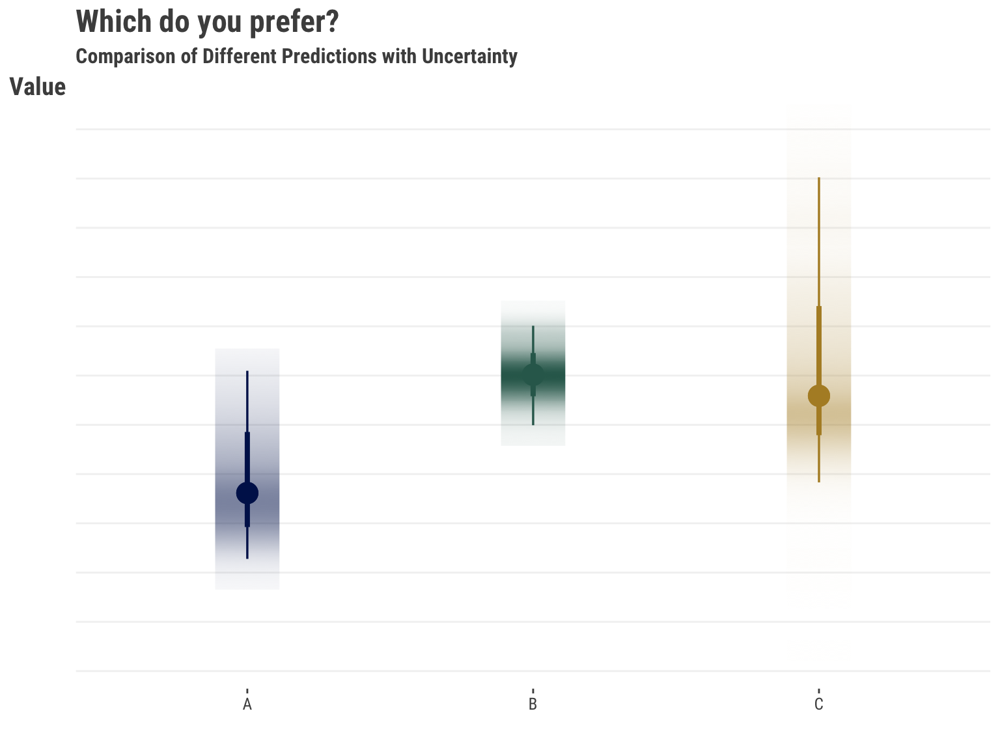
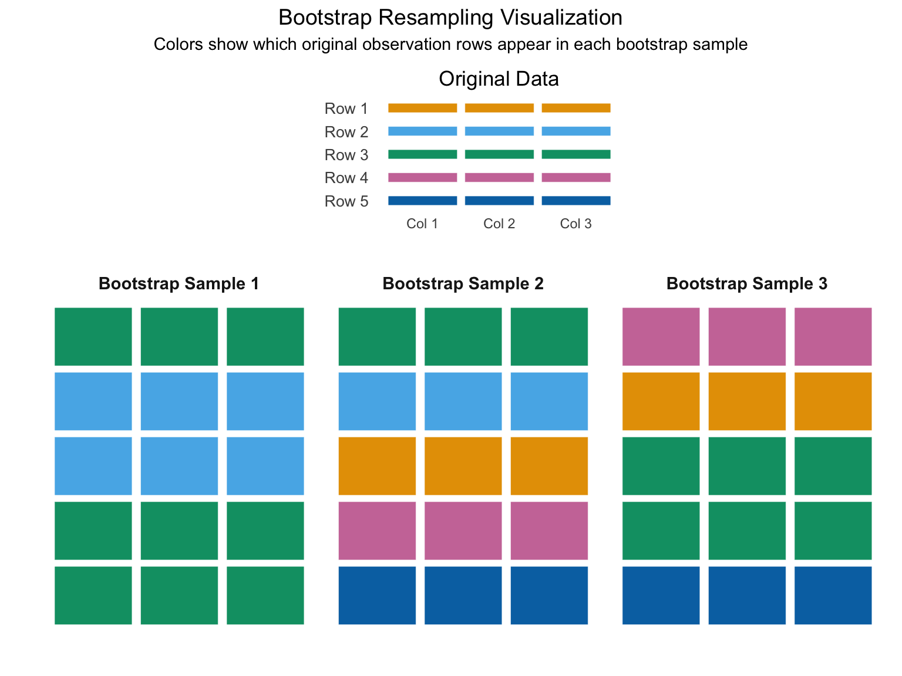
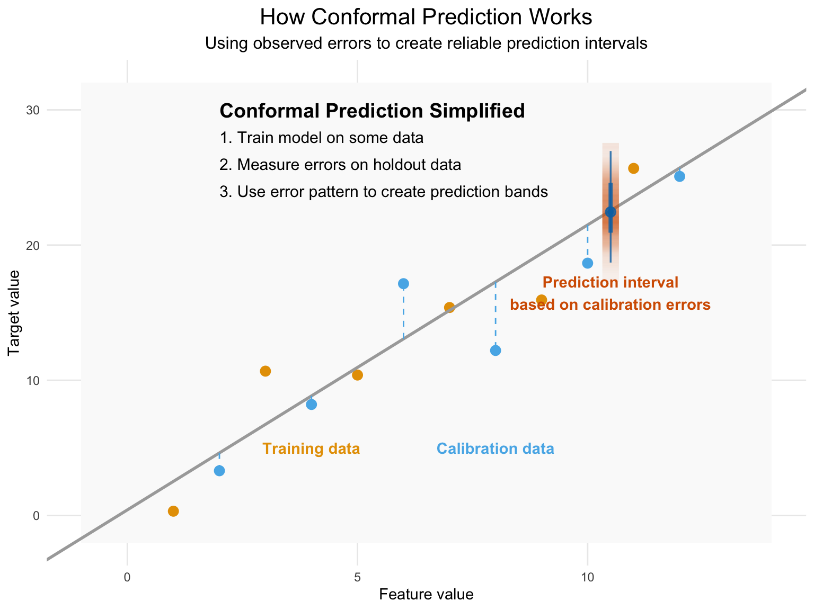
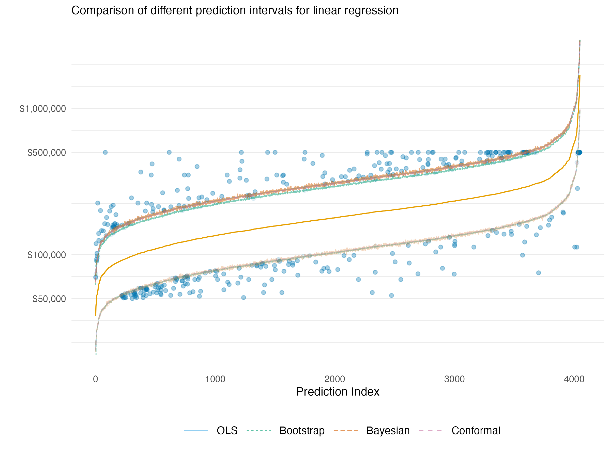
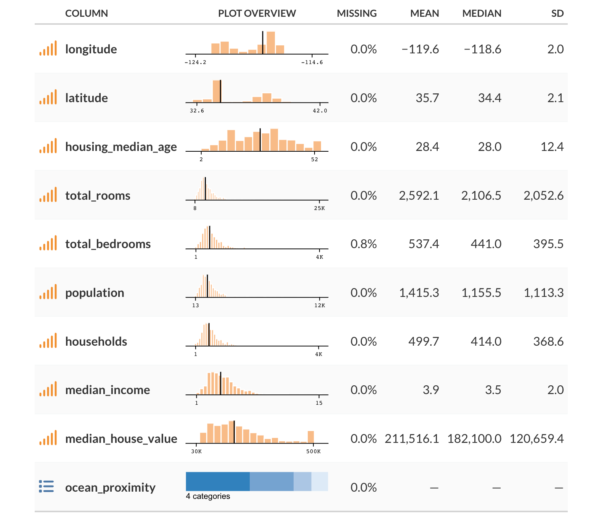

> As with the [last post on class imbalance](https://m-clark.github.io/posts/2025-04-07-class-imbalance/), this is a resurrection of sorts. I began this post a little after that one had gotten an initial draft completed. Since then, conformal prediction has caught on quite a bit, but there wasn’t much at the time in terms of tools. I was focused on MAPIE as that’s a good package in Python, and as I was writing this, probably finally offered something more viable in R. I definitely recommend R folks to check it out.

## Introduction

Uncertainty estimation is a crucial component of machine learning systems. It is vital to know how precise our model predictions are, and whether we feel confident in taking action based on them. While typical usage of prediction and performance is often done with little consideration of uncertainty, we do so at our own (very predictable) peril. Here we will discuss uncertainty in the context of prediction, and how we can estimate it using several methods. We will focus especially on conformal prediction, a tried but relatively newer approach to uncertainty estimation that has several advantages. This post covers:

1.  **Why Uncertainty Estimation is Important**: We’ll discuss why uncertainty estimation is important and how it can be used to make better decisions.
2.  **Approaches to Uncertainty Estimation**: We’ll discuss different approaches to uncertainty estimation, including statistical prediction intervals, bootstrapping, Bayesian approaches, and conformal prediction.
3.  **Example**: We’ll demonstrate how to use conformal prediction to estimate uncertainty in a simple example to help demystify the process.
4.  **Pros and Cons**: We’ll discuss the advantages and disadvantages of different approaches to uncertainty estimation.

## Why is Uncertainty Estimation Important?

Uncertainty estimation is an indispensable part of our modeling endeavor, and *one of the main reasons is that it allows us to make better decisions from our data*. The more we understand our predictions, the more we can feel confident in taking action based on them. Understanding uncertainty can also help us understand the model itself, and especially where its weaknesses are, or at what points we should be more cautious.

For example, if we are building a model to predict the number of sales for a product, we would like to better assess our prediction of future sales in order to take current action. This could be increasing our marketing budget for the months ahead, or possibly assessing whether current marketing strategies have been successful. Our model may predict that we can expect an increase in sales of 150 units with the increased budget of 5%. If the range for the prediction is that the expected sales increase six months from now is between 100 and 200 units, we might make a different decision than if we expect the unit sales to be between -100 and 400 units. In the first case, we might be more willing to increase our budget spend, since it seems we are likely to experience an increase in sales by doing so. In the second case, we might not take any action, since the range encompasses anywhere between lost sales to an even larger boost.

The following illustrates the issue. The prediction on the left suggests less value and has notable uncertainty with that assessment. That might be easy to rule out. But the other two predictions take some thought. One is higher with less uncertainty, while the other prediction is slightly lower, but with more uncertainty that suggests the upside might be greater. Which would you prefer?



Many times stakeholders will take action given the prediction alone, and then are disappointed when things don’t turn out as expected, which they definitely will not in practice. In similar fashion, some take action based on rankings of the predictions, which of course themselves have uncertainty that stems from the raw prediction, and even more so. In some situations, we may be able to get away with doing so, but it would be difficult to know this ahead of time. The old adage of not wanting to put all your eggs in one (prediction) basket applies here.

### Contributing Factors

Several key factors contribute to prediction uncertainty, among them:

- **Amount of Data**: While more data can lead us to feel more confident about predictions in a general sense by providing additional learning examples of varying kinds, this is limited. Additional bad or uninformative data will not improve a model or its predictions!

- **Model Complexity**: More complex models may capture nuanced relationships leading to better predictions, but can also introduce instability in those predictions if additional steps aren’t taken. Conversely, having too simple a model yields relatively poor predictions in general.

- **Precision of Measurement**: The quality of the data collection process definitely impacts any predictions we might ultimately make. For example, if sales are entered with possible error, or a lag for some reporting units and not for others, this can lead to uncertainty in our predictions of future sales. In addition, the precision of measurement can vary across features. For example, if price is a feature, it may be that price fluctuates within a month but sales are recorded for a month, meaning we might have to take an average or other measure of price.

So any number of things might contribute to the uncertainty in our predictions and, in general, some aspects contributing to prediction uncertainty may be under our control, while others may not be. Different methods produce different results, and some intervals may be too narrow or too wide in some settings, giving false confidence or excessive caution. In what follows, we’ll explore various uncertainty estimation approaches with a focus on **conformal prediction**, demonstrating its implementation and comparing its advantages to alternative methods. We’ll start by discussing the importance of uncertainty estimation and the different approaches to it. Next, we will discuss conformal prediction and show a simple demonstration of how it can be used to estimate uncertainty. Finally, we will discuss the advantages and disadvantages of conformal prediction compared to other approaches to uncertainty estimation.

> **TIP:**
>
> It’s crucial to understand that *confidence* in terms of confidence intervals is not the same concept as *certainty*. The same level of confidence interval, say 95%, can produce different interval widths across models for the same prediction, and across predictions for the same model/data. Certainty reflects our understanding about the range provided by a confidence interval, and, for a given setting, we have less uncertainty with narrower intervals than wider ones.

## Strategies for Quantifying Uncertainty

There are several approaches to uncertainty estimation, and many different things we can calculate uncertainty for. We’ll focus specifically on uncertainty for predictions, and we’ll briefly describe and demonstrate some of the different ways of getting an uncertainty estimate for those.

### Statistical Uncertainty

\\y \sim \mathcal{N}(\mu, \sigma^2)\\

Probably the most common approach to estimate uncertainty is to use a statistical model. Given a statistical distribution and the estimated parameters of the model, we can get a sense of uncertainty in the prediction. For example, let’s say we have a standard linear regression model. In that case, we are assuming the data generating process for the target/outcome is a normal distribution. The mean for that distribution comes from our model via the linear combination of features, and the variance is estimated separately[^1]. Given those and other model-specific assumptions hold (e.g. homoscedasticity, independence of observations), we can then obtain an interval estimate for a prediction, typically using a standard formula. This approach extends well beyond both linear regression and the normal distribution, but the basic idea is the same. We assume a distribution for the target, estimate the parameters of that distribution via the data, and then use those estimates to ultimately obtain an interval estimate for our prediction.

> **TIP:**
>
> We can contrast the *prediction interval* versus a [confidence interval for a prediction](https://stats.stackexchange.com/questions/16493/difference-between-confidence-intervals-and-prediction-intervals), i.e., for the prediction for an \*average response\*. The latter will always be smaller, as it reflects the uncertainty in the mean of the distribution of predictions, rather than the uncertainty in the predicted value for a \*new\* observation, which is what the prediction interval regards.

### Bootstrapping



Bootstrap Resampling Visualization

Bootstrapping is another technique for estimating uncertainty in machine learning models. By repeatedly resampling our original dataset with replacement, we create multiple versions of our data that capture its inherent variability. This process mirrors what would happen if we could collect many different samples from the population. Each resampled dataset produces slightly different model parameters, and consequently, different predictions for the same input. The variation across these predictions directly quantifies our uncertainty - wider spread indicating higher uncertainty, narrower spread suggesting more confidence.

Think of it this way – we take our data, resample the observations with replacement, and train a new model on the resampled data. We then use the new model to make predictions on the original or new/test data. Now we do that many times, taking the average for our final prediction. We then use the quantiles of the prediction distribution (e.g. corresponding to the 5th and 95th percentiles) across the bootstrap samples to get an interval estimate for our prediction. This is a very powerful technique, as it allows us to estimate the uncertainty in our predictions without making any assumptions about the underlying distribution of the data.

### Bayesian Approaches


Prior, Likelihood, Posterior

Bootstrap and Bayesian approaches are kindred spirits in that they both generate a distribution for our predictions. The Bayesian approach does not require resampling the data, but it does have an assumption about the distributions of the parameters, which ultimately means it still makes assumptions similar to those in traditional statistical models. We use the Bayesian approach to provide a distribution for the parameters we’re attempting to estimate. For our predictions, we then take random draws from that parameter distribution, feed it into our model to get a prediction, and then repeat that process many times. Again, we may take the average for our final prediction, and the quantiles of interest for our interval estimate.

### Conformal Prediction



Conformal prediction is yet another technique for estimating uncertainty in machine learning models, and one of its primary strengths is that it is model agnostic and theoretically can work for any model, from linear regression to deep learning. It is based on the idea that we can estimate the uncertainty in our predictions by looking at the distribution of the predictions from the model, or more specifically, the prediction error. Using the observed error on a calibration set that was not used to train the model, we can order those errors and find the quantile corresponding to the desired uncertainty coverage/error rate[^2]. When predicting on new data, we assume it (and its error) comes from a similar distribution as what we’ve seen already in our training/calibration process, with no particular assumption about that distribution. We then use that quantile from our previous distribution to create upper and lower bounds for the new prediction.

#### Quick Demo

While the implementation for various settings can get quite complicated, the conceptual approach is mostly straightforward as we’ve just suggested. The following shows some simplified code demonstrating the **split-conformal** procedure in Python and R. Note that you should use packages like mapie or fuller implementations for your own work.

## Python

Code

``` python
from sklearn.model_selection import train_test_split
from sklearn.linear_model import LinearRegression

def split_conformal(X, y, new_data, alpha = 0.05, seed = 123):
    # Set random seed for reproducibility
    np.random.seed(seed)

    # Splitting the data into training and calibration sets
    train_data, cal_data, train_y, cal_y = train_test_split(X, y, test_size = 0.5)
    N = train_data.shape[0]

    # Train the base model
    model = LinearRegression()
    model.fit(train_data, train_y)
    
    # Calculate residuals on calibration set
    cal_preds = model.predict(cal_data)
    residuals = np.array(np.abs(cal_y - cal_preds))
    
    # Sort residuals and find the quantile corresponding to (1-alpha)
    residuals.sort()
    quantile = np.quantile(residuals, (1 - alpha) * (N / (N + 1)))
    
    # Make predictions on new data and calculate prediction intervals
    preds = model.predict(new_data)
    lower_bounds = preds - quantile
    upper_bounds = preds + quantile
    
    # Return predictions and prediction intervals
    return(
        dict(
            cp_error = quantile, 
            preds = preds, 
            lower_bounds = lower_bounds, 
            upper_bounds = upper_bounds
        )
    )

cp_error_py = split_conformal(X_train, y_train, X_test, alpha = .1)['cp_error']
```

## R

Code

``` r
split_conformal = function(X, y, new_data, alpha = .05, seed = 123) {
    # Set random seed for reproducibility
    set.seed(seed)

    # Splitting the data into training and calibration sets
    idx = sample(1:nrow(X), size = nrow(X) / 2)
    
    train_data = X |> slice(idx)
    cal_data = X |> slice(-idx)
    train_y = y[idx]
    cal_y = y[-idx]

    N = nrow(train_data)

    # Train the base model
    model = lm(train_y ~ ., data = train_data)

    # Calculate residuals on calibration set
    cal_preds = predict(model, newdata = cal_data)
    residuals = abs(cal_y - cal_preds)

    # Sort residuals and find the quantile corresponding to (1-alpha)
    residuals = sort(residuals)
    quantile  = quantile(residuals, (1 - alpha) * (N / (N + 1)))

    # Make predictions on new data and calculate prediction intervals
    preds = predict(model, newdata = new_data)
    lower_bounds = preds - quantile
    upper_bounds = preds + quantile

    # Return predictions and prediction intervals
    return(
        list(
            cp_error = quantile, 
            preds = preds, 
            lower_bounds = lower_bounds, 
            upper_bounds = upper_bounds
        )
    )
}

cp_error_r = split_conformal(X_train, y_train, X_test, alpha = .1)[['cp_error']]
```

We can compare our simple approach to `mapie` in Python, which is a solid package to use for this[^3]. The ‘naive’ conformal procedure in `mapie` implemented is very similar to our split-conformal procedure, and generally you’d want to use one of the better approaches. But this is a bit more comparable, and most of the difference between our R, Python and the `mapie` results are due to the underlying data split.

Code

``` python
from mapie.regression import MapieRegressor

initial_fit = LinearRegression().fit(X_train, y_train)
model = MapieRegressor(initial_fit, method = 'naive')
y_pred, y_pis = model.fit(X_train, y_train).predict(X_test, alpha = 0.1)

# take the first difference between upper and lower bounds,
# since it's constant for all predictions in this setting
cp_error_mapie = (y_pis[0, 1, 0] - y_pis[0, 0, 0]) / 2  
```

| Source     | CP Error |
|------------|----------|
| R-by-hand  | 0.5356   |
| Py-by-hand | 0.5361   |
| Py-mapie   | 0.5370   |

> **NOTE:**
>
> As we’ve seen, there are numerous methods for estimating uncertainty in our predictions. As another example, some use *quantile regression* in machine learning models. It is based on the idea that we can estimate the uncertainty in our predictions by modeling the specific quantiles rather than the conditional mean default value, for example, the .05 and .95 values. But those quantiles are predictions with uncertainty themselves, and without incorporating that uncertainty, tend to underestimate the uncertainty in the prediction (Bai et al., 2021). In general, one should be cautious about the method they choose in any particular setting.

## Practical Comparison: Uncertainty Methods on Housing Data

To see our uncertainty estimation in practice, we’ll use a sample of the classic [California Housing Prices dataset](https://www.kaggle.com/camnugent/california-housing-prices) for demonstration. The dataset contains information about housing prices in California, including the median house value in a district, the median income for that district, and the median house age etc. We’ll use all the available features to predict median house value on the log scale. You can find out some basic info for the data at the [end of this post](#data-details). The very rough notebook used to generate the data and results is available [at my website repo](https://github.com/m-clark/m-clark.github.io/tree/master/posts).

In the following we show the 90% prediction interval estimates for a basic linear regression after exponentiating to the original scale. Points are arranged in increasing (median) predicted value. We can see that the prediction intervals are essentially in agreement for all methods we previously discussed – statistical, bootstrapped, Bayesian, and conformal. Highlighted are the points missed by the intervals, which was around 10% for each method (data issues notwithstanding[^4]). This should leave us feeling good about using any of these methods for uncertainty estimation in simpler model settings.



Prediction Intervals (Linear Regression)

The following visualization shows the exact same data context, though now we use an xgboost model to predict the target. With this model, we do not have an underlying statistical distribution or easy Bayesian counterpart[^5] with which to estimate uncertainty. So we are left to use a bootstrapped approach or conformal prediction. Furthermore, the nature of the model means that the actual interval widths can vary a bit from point to point, so the lines shown are smoothed boundaries used to make the general pattern more clear, but should not be taken as the actual interval for a given point.

In the visualization, blue represents the bootstrapped prediction interval while red represents the conformal prediction interval. Points that fall outside their respective intervals are highlighted - blue dots show observations missed by bootstrap intervals and red dots show those missed by conformal intervals. Some points may appear in both colors when they’re missed by both approaches (i.e., anything missed by the conformal is also missed by the bootstrap).


Prediction Intervals (XGBoost)

The first thing we see is that the naive bootstrap is too optimistic in this situation, with interval estimates that are too narrow, which results in only 70% coverage compared to the target 90%. Complex tree-based models like XGBoost often exhibit this problem with bootstrapping because the resampling approach struggles to capture the full model uncertainty in high-variance models.

In contrast, the conformal interval is more conservative and achieves 92% coverage, close to matching our specified 90% target (though slightly more conservative). This demonstrates conformal prediction’s ability to produce reliable uncertainty estimates even for complex models where traditional methods struggle. As a practical advantage, on an Apple M1 laptop, it took a few seconds to get the conformal prediction intervals, while the bootstrap took over 10 minutes for 500 bootstrap replications.

## Pros and Cons

Nothing comes for free in the modeling world. Here we list some advantages and disadvantages of the different approaches to uncertainty estimation. Note that this is not an exhaustive list nor does it go into specifics, and there may be additional considerations beyond those noted.

### Traditional Statistical Prediction Intervals

**Advantages:**

- **Ease**: For many models, prediction intervals can be computed easily and are automatically provided by various modeling packages.
- **Interpretability**: The statistical theory behind the prediction intervals is generally straightforward.
- **Computational Efficiency**: Unlike bootstrapping or Bayesian approaches that require multiple model fits or MCMC sampling, traditional statistical intervals can typically be calculated directly from the fitted model parameters with minimal computational overhead.

**Disadvantages:**

- **Distribution Assumption**: They typically require (sometimes strong) assumptions about the underlying data distribution.
- **Model-Specific Estimation**: The intervals depend on a specific statistical model, and different estimation approaches are needed for different models.
- **Model Complexity**: Even common models, e.g., those using penalty terms, can make prediction uncertainty using distributional assumptions difficult[^6].

### Bootstrapping

**Advantages:**

- **Simple**: Bootstrapping is a relatively simple approach to estimating uncertainty.
- **Less Restrictive Assumptions**: Like conformal prediction, non-parametric bootstrapping doesn’t require assumptions of the underlying data distribution.
- **Model-Agnostic**: It operates directly on the data irrespective of your model.

**Disadvantages:**

- **Computationally Intensive**: It might require a large number of resamples, which can be computationally intensive for some model-data combinations.
- **Data issues**: For very small datasets, extreme values/tails, estimates could be problematic, but this is likely true for most approaches.
- **Naive approach is limited**: The naive resampling approach tends to underestimate uncertainty, so additional steps are required to get a more accurate estimate of uncertainty.

### Bayesian Approaches

**Advantages:**

- **Probabilistic Interpretation**: It provides a full distribution of plausible values for our parameters or predictions.
- **Incorporates Prior Information**: We can use prior beliefs about parameters we estimate. For example, we can use last year’s data to inform our prior beliefs about the parameters of this year’s model.
- **Confidence in Uncertainty Estimate**: We can be more confident in our uncertainty estimates than we can with some statistical approaches that often use workarounds to estimate uncertainty (e.g. mixed models), and there are many diagnostic tools available to spot problematic models.

**Disadvantages:**

- **Computationally Intensive**: MCMC sampling for model estimation can be slow, particularly for complex models.
- **Choice of Prior**: The choice of prior can significantly influence the results, especially with small data.
- **Statistical Assumptions**: As the Bayesian models are an alternative way to estimate statistical models, they depend on a specific statistical model and its likelihood.

### Conformal Prediction

**Advantages:**

- **Distribution-Free & Model-Agnostic**: Generates valid prediction intervals regardless of underlying data distribution and works with any model, providing a unified framework.
- **Theoretical Guarantees**: Given a significance level, conformal prediction provides valid coverage even with misspecified models.
- **Efficiency**: Conformal prediction is relatively computationally efficient compared to other methods, and nonconformity measures based on residuals are straightforward to compute during the training process.
- **Generalizable**: Other approaches that might be used for uncertainty prediction, like quantile regression or Bayesian methods, can be ‘conformalized’ to produce appropriate coverage.

**Disadvantages:**

- **Implementation Challenges**: The intervals can be unstable with small data changes, and are sometimes overly conservative when the nonconformity measure isn’t chosen properly.
- **Data Splitting Requirement**: A portion of the data needs to be held out to estimate the nonconformity scores, which can reduce the data available for model training.
- **Theoretical Limitations**: While theoretically sound, various practical implementations (like split-conformal) introduce trade-offs between computational efficiency and theoretical guarantees.
- **Exchangeability Assumption**: Still requires data exchangeability assumption, which must be accounted for in time series or other structured data.

> **NOTE:**
>
> The comparison highlights an important pattern in uncertainty estimation:
>
> 1.  **Simple models**: All methods tend to perform similarly when the underlying model is well-behaved (like linear regression).
>
> 2.  **Complex models**: Method differences become pronounced - distributional assumptions break down, computational demands diverge, and coverage guarantees can fail.
>
> 3.  **Fundamental tradeoff**: As models become more complex to capture nuanced patterns, the uncertainty estimation task becomes correspondingly more challenging.
>
> This explains why conformal prediction has gained popularity - it maintains validity across the model complexity spectrum without sacrificing computational efficiency.

## Conclusion

> There’s a lot of uncertainty in uncertainty estimation.

As we’ve seen, there are many approaches to estimating uncertainty, and each has its own strengths and weaknesses. Among the considerations for selection are computational feasibility, coverage accuracy, and underlying model assumptions. In this article we discussed statistical prediction intervals, bootstrapping, Bayesian estimation, and conformal prediction, as well as their relative advantages and disadvantages. Conformal prediction is a relatively newer approach that has some advantages over other approaches, including its flexibility, distribution-free nature, and theoretical guarantee of coverage probability, even under difficult and complex modeling circumstances. We hope this article has been helpful in understanding the importance of uncertainty estimation and the different approaches to it, and that it has provided a useful demonstration of how to use conformal prediction to estimate uncertainty.

As we’ve seen, there are many approaches to estimating uncertainty, and each has its own strengths and weaknesses. Among the considerations for selection are coverage accuracy, model/technical assumptions, and computational feasibility. These considerations matter because proper uncertainty estimation directly impacts decision quality – as our opening example illustrated, different uncertainty ranges can lead to entirely different actions.

For practitioners looking to implement these methods:

- **For simple models with well-understood distributions**: Traditional statistical intervals typically offer computational efficiency and simplicity.
- **When prior knowledge is important**: Bayesian approaches provide a natural framework for incorporating this information, while also providing intervals for more complex statistical models.
- **When working with moderate-sized datasets and statistical software or other model limitations**: Bootstrapping provides flexibility across different model types, particularly for models where analytical intervals aren’t implemented or appropriate.
- **For complex models or when distribution assumptions are questionable**: Conformal prediction offers reliable coverage with minimal assumptions, while also providing better computational efficiency than bootstrapping approaches.

Looking forward, the field of uncertainty estimation continues to evolve. Recent advances include adaptations of conformal prediction for time series data, more efficient implementations that reduce data splitting requirements, and hybrid approaches that combine the strengths of multiple methods. I’d probably recommend first implementing the simplest approach appropriate for your model setting. You could then compare it with conformal prediction to evaluate potential improvements in reliability and coverage.

## Data Details

The following shows some basic information based on a sample of the data used in this post.



## References

Angelopoulos, Anastasios N., and Stephen Bates. 2022. *A Gentle Introduction to Conformal Prediction and Distribution-Free Uncertainty Quantification*. <https://arxiv.org/abs/2107.07511>.

Arel-Bundock, Vincent. 2022. *Distribution-Free Prediction Intervals with Conformal Inference Using r*. <https://arelbundock.com/posts/conformal/>.

Bai, Yu, Song Mei, Huan Wang, and Caiming Xiong. 2021. “Understanding the Under-Coverage Bias in Uncertainty Estimation.” *Advances in Neural Information Processing Systems* 34: 18307–19.

Brownlee, J. 2019. *A Gentle Introduction to Uncertainty in Machine Learning*. <https://machinelearningmastery.com/uncertainty-in-machine-learning/>.

Group, Tidymodels. 2023. *Conformal Inference for Regression Models*. <https://arelbundock.com/posts/conformal/>.

Lei, Jing, Max G’Sell, Alessandro Rinaldo, Ryan J Tibshirani, and Larry Wasserman. 2018. “Distribution-Free Predictive Inference for Regression.” *Journal of the American Statistical Association* 113 (523): 1094–111. <https://www.stat.cmu.edu/~ryantibs/papers/conformal.pdf>.

Molnar, Christopher. 2023. *Understanding Different Uncertainty Mindsets*. <https://mindfulmodeler.substack.com/p/understanding-different-uncertainty>.

StackExchange. 2023. *Bootstrap Prediction Interval*. <https://stats.stackexchange.com/questions/226565/bootstrap-prediction-interval>.

## Footnotes

## Reuse

[CC BY-SA 4.0](https://creativecommons.org/licenses/by-sa/4.0/)

## Citation

BibTeX citation:

``` quarto-appendix-bibtex
@online{clark2025,
  author = {Clark, Michael},
  title = {Uncertainty {Estimation} with {Conformal} {Prediction}},
  date = {2025-06-01},
  url = {https://m-clark.github.io/posts/2025-06-01-conformal/},
  langid = {en}
}
```

For attribution, please cite this work as:

Clark, Michael. 2025. “Uncertainty Estimation with Conformal Prediction.” June 1. <https://m-clark.github.io/posts/2025-06-01-conformal/>.

[^1]: Technically we can model the variance with the features as well, but we’ll keep it simple here.

[^2]: The error rate (\\\alpha\\) is the proportion of the data that would fall outside the prediction interval, while the coverage rate/interval is 1 - \\\alpha\\.

[^3]: When I first started this post, there wasn’t much in the way of packages for conformal prediction in R. One [was the conformal package](https://github.com/ryantibs/conformal), but it is not very user friendly in the least. Others seem like one offs or have other limitations (e.g. only being for classification, working only in the tidymodels framework, etc.). More recently probably has add functionality that works nicely with the tidymodels framework, but I haven’t had a chance to try it out yet.

[^4]: Interestingly all but the bootstrap appeared slightly narrow, but I think this has more to do with data issues, particularly the preponderance of house prices censored to ~500,000, about 5% of the data. No preprocessing was done except to put the home price on the log scale.

[^5]: There are methods like Bayesian Additive Regression Trees, but that’s a rabbit hole I didn’t think necessary to investigate for our purposes. Likewise we could also have done a very complicated linear model that incorporates interactions and nonlinearities.

[^6]: One of the more popular statistical packages in R is `lme4`, and the developers don’t provide prediction intervals for mixed models because “it is difficult to define an efficient method that incorporates uncertainty in the variance parameters”. They suggest to use bootstrapping instead.
