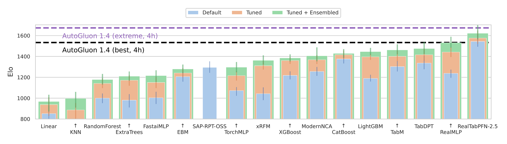
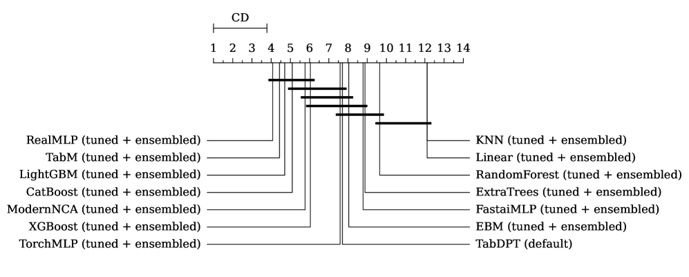
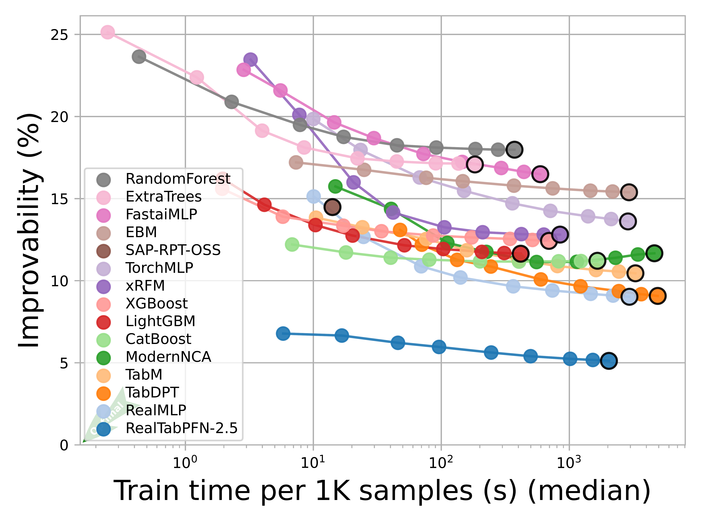
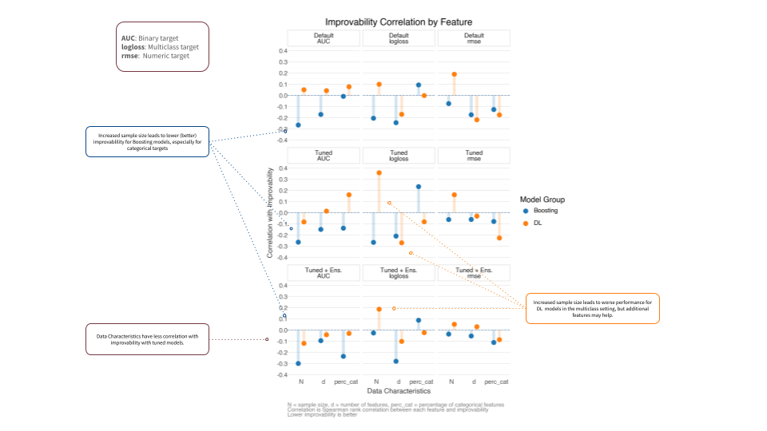
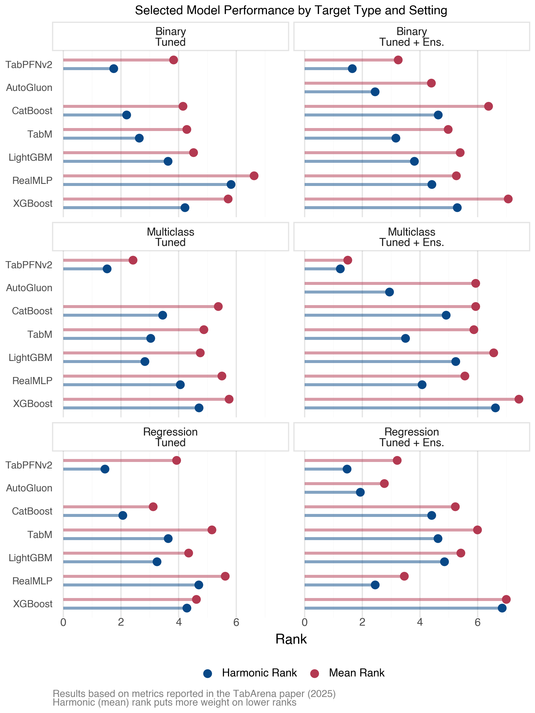
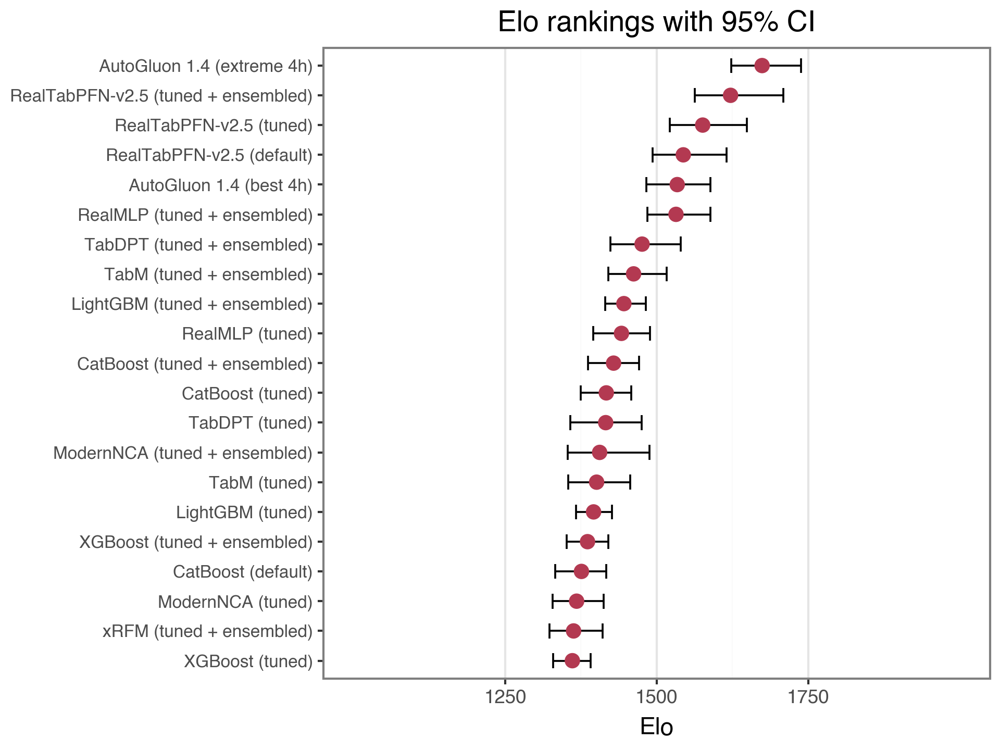
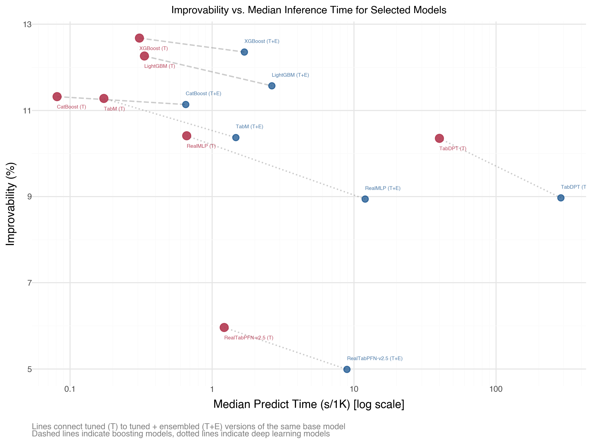

## Introduction

It’s been nearly four years since I [first summarized](../2021-07-15-dl-for-tabular/) the state of deep learning (DL) for tabular data, and about three years since my [follow-up post](../2022-04-01-more-dl-for-tabular/). Back then, the verdict was clear: for most tabular scenarios, gradient boosting methods like XGBoost, LightGBM, and CatBoost were the pragmatic choice. Complex DL architectures, like TabNet and even the relatively newer transformer-based models, struggled to consistently outperform these boosting approaches, which meant they were impractical for most use cases.

The question now is: has anything fundamentally changed?

Let’s see if the landscape has shifted and tabular DL has finally found its place, or if we’re still in “[XGBoost is all you need](https://www.xgblog.ai/p/xgboost-is-all-you-need)” territory.

## Quick Take (if you’re in a hurry)

Key takeaways:

- Several new deep learning models show impressive performance compared to boosting, but context still matters.
- It’s significantly easier to implement and experiment with modern tabular DL methods.
- We now have more rigorous benchmarking environments with standardized datasets and evaluation protocols.
- Foundation models for tabular data are emerging and have had success, but it’s a bit early to say how transformative they’ll be in practice.
- For most practitioners: boosting remains the pragmatic baseline. However, you should start to consider DL methods if predictive performance is critical and you have the resources to invest in experimentation.

Given the advances discussed here, I plan on adding a chapter devoted to tabular DL to the web edition of my book, [Models Demystified](https://m-clark.github.io/book-of-models/).

Now, let’s dig into the details.

## What’s Changed: Evaluation and Accessibility

### Better Evaluation Standards

One major improvement in tabular data modeling is the emergence of more rigorous benchmarking. **TabArena** ([leaderboard](https://huggingface.co/spaces/TabArena/leaderboard)) and [TALENT](https://github.com/LAMDA-Tabular/TALENT) provide standardized datasets, consistent evaluation metrics, and transparency in preprocessing, which addresses the apples-to-oranges comparison problems from earlier papers. TabArena, which will be the primary reference here, has set a new standard for evaluating tabular DL models with:

- A curated set of tabular datasets for binary/multiclass classification and regression tasks
- Consistent evaluation metrics across different model types
- A public leaderboard tracking model performance
- Transparency in preprocessing and hyperparameter choices
- Focus on heterogeneous datasets that better reflect real-world tabular data scenarios
- Use of Elo-style model ranking for easier model comparisons

These new benchmarks address one of the major frustrations from my previous post summaries: papers often used different datasets, preprocessing pipelines, and hyperparameter tuning budgets, which made fair comparisons difficult at best. They also often focused primarily on very homogeneous data, which isn’t representative of typical real-world tabular data, and sometimes focused only classification settings. This is a far better assessment, and gives us more confidence when comparing methods.

### Current Leaderboard Landscape

As of March 2026, the TabArena leaderboard shows some interesting patterns. Here are the ELO rankings for tested models using default, tuned and tuned + ensembled versions of each model type:



Figure 1: TabArena Leaderboard

The key insight from this is that some newer DL models are not only competitive with boosting, a few typically win in head-to-head comparisons against boosting models. For example, among the tuned + ensemble models the top 4 DL models win \> 50% of the time against LGBM, XGB, and CatBost.


Figure 2: Head-to-Head Model Comparisons

One important side note: performance is typically not going to be statistically different for models that are similarly ranked, and papers will often provide something like a critical difference diagram to show this. So while the top 4 DL models are all ranked above the boosting models, that doesn’t necessarily mean they’re statistically better than boosting models.

Take the following image from the TabArena paper based on all datasets. It shows that the top six models, which includes the big 3 boosting models, are not statistically different from each other[^1].

[](../../img/dl-foundational/critical_difference_tabarena.png "Figure 3: Critical Difference Diagram (Figure A.12 from the TabArena paper (2025))")

Figure 3: Critical Difference Diagram (Figure A.12 from the TabArena paper (2025))

### Practical Implementation Tools

The even bigger story is accessibility. Modern tools make it trivial to use these methods, so let’s try it out for ourselves!

## Making Tabular DL Practical

### Using pytabkit

[pytabkit](https://github.com/dholzmueller/pytabkit) provides implementations of state-of-the-art tabular DL models with:

- Optimized hyperparameter defaults based on extensive benchmarking
- Unified API similar to scikit-learn
- Automated preprocessing for heterogeneous data
- Support for both classification and regression

This is significant because one of the historical barriers to using tabular DL was implementation difficulty. While boosting modules were already easy to add to typical ML pipelines and often worked well out of the box, DL models often required custom code, careful tuning, and extensive experimentation to get good results.

Let’s see it in action with a simple example. We’ll generate a synthetic dataset with mixed numeric and categorical features, then train a RealMLP model and compare it to an XGBoost baseline.

Show the code: Create Classification Data

``` python
from pytabkit import RealMLP_TD_Classifier

from sklearn.model_selection import train_test_split
from sklearn.datasets import make_classification
from sklearn.metrics import accuracy_score, roc_auc_score, log_loss, f1_score
from sklearn.model_selection import StratifiedKFold

import pandas as pd
import numpy as np
import string


# Generate a classification dataset
X, y = make_classification(
    n_samples=5000,
    n_features=15,
    n_informative=8,
    n_redundant=3,
    n_classes=2,
    random_state=42,
    # make it a more difficult problem
    flip_y=0.2,
    class_sep=0.1,
    n_clusters_per_class=2,
)


# Convert to DataFrame for easier handling
feature_names = [f"Feature_{i}" for i in range(X.shape[1])]
X = pd.DataFrame(X, columns=feature_names)

# Add three categorical columns with 3, 5, and 12 categories, using letters as group names
X['Cat_3'] = pd.cut(X['Feature_0'], bins=3, labels=list(string.ascii_uppercase[:3])).astype('category')
X['Cat_5'] = pd.cut(X['Feature_1'], bins=5, labels=list(string.ascii_uppercase[:5])).astype('category')
X['Cat_12'] = pd.cut(X['Feature_2'], bins=12, labels=list(string.ascii_uppercase[:12])).astype('category')


# Use a single train/test split
X_train, X_test, y_train, y_test = train_test_split(X, y, test_size=0.2, random_state=42, stratify=y)

# Example CV splitter for pytabkit (if needed)
cv_splitter = StratifiedKFold(n_splits=5, shuffle=True, random_state=42)
# Get train/validation indices from the splitter
# X_val, y_val = X_train.iloc[val_idx], y_train[val_idx]

val_idxs_list = [val_idxs for train_idxs, val_idxs in cv_splitter.split(X_train, y_train)]

# make sure that each validation set has the same length, so we can exploit vectorization
max_len = max([len(val_idxs) for val_idxs in val_idxs_list])
val_idxs_list = [val_idxs[:max_len] for val_idxs in val_idxs_list]
val_idxs = np.asarray(val_idxs_list)

print(f"Train size: {X_train.shape[0]}, Test size: {X_test.shape[0]}, Baseline rate: {np.mean(y):.2f}")
```

With data in hand, we can train a RealMLP model.

``` python
model_realmmlp = RealMLP_TD_Classifier(
    device='mps',
    random_state=0,
    n_cv=5,
    val_metric_name='cross_entropy',
    use_ls=False,
    verbosity=2,  # will show per epoch loss
    # example modifications
    # n_refit=1,
    # n_repeats=1,
    # n_epochs=256,
    # batch_size=256,
    # hidden_sizes=[256] * 3,
    # lr=0.04,
)

model_realmmlp.fit(
    X_train,
    y_train,
    val_idxs=val_idxs,
    cat_col_names=['Cat_3', 'Cat_5', 'Cat_12']
)
```

On an old Macbook M1, this ran just at around one minute with the default 256 epochs, and it doesn’t look like we needed that many ([Figure 4](#fig-RealMLPTraining)). We definitely don’t need to sweat that kind of time on a dataset of this size regardless. Now let’s evaluate the model on the test set. Note that inference is near instant for this model.


Figure 4: RealMLP Training Log Loss

Show the code: Evaluate RealMLP

``` python
y_pred = model_realmmlp.predict(X_test)
y_proba = model_realmmlp.predict_proba(X_test)[:, 1]

metrics_realmlp = {
    "Accuracy": accuracy_score(y_test, y_pred),
    "ROC AUC": roc_auc_score(y_test, y_proba),
    "Log Loss": log_loss(y_test, y_proba),
    "F1 Score": f1_score(y_test, y_pred)
}

metrics_realmlp = pd.DataFrame(metrics_realmlp, index=["RealMLP"])
print(metrics_realmlp)
```

| Accuracy | ROC AUC | Log Loss | F1 Score |
|----------|---------|----------|----------|
| 0.772    | 0.838   | 0.505    | 0.767    |

Now we can compare to XGBoost as the representative of the boosting approach. With pytabkit we can use default parameter settings derived from models used across a variety of data sets (`TD` = tuned defaults), making it easy to get started very well. Model training with data of this size took just a couple seconds.

``` python
from pytabkit import XGB_TD_Classifier

model_xgb = XGB_TD_Classifier(
    device='mps',
    random_state=0,
    n_cv=5
)

model_xgb.fit(
    X_train,
    y_train,
    val_idxs=val_idxs,
    cat_col_names=['Cat_3', 'Cat_5', 'Cat_12']
)
```

Show the code: Evaluate XGBoost

``` python
y_pred = model_xgb.predict(X_test)
y_proba = model_xgb.predict_proba(X_test)[:, 1]

metrics_xgb = {
    "Accuracy": accuracy_score(y_test, y_pred),
    "ROC AUC": roc_auc_score(y_test, y_proba),
    "Log Loss": log_loss(y_test, y_proba),
    "F1 Score": f1_score(y_test, y_pred)
}
```

| Model   | Accuracy | ROC AUC | Log Loss | F1 Score |
|---------|----------|---------|----------|----------|
| XGB     | 0.752    | 0.824   | 0.567    | 0.750    |
| RealMLP | 0.772    | 0.838   | 0.505    | 0.767    |

While boosting performs well, in very little time we can get not only competitive but even better results with a modern DL approach. Of course, this is just one (simulated) dataset that shows how easy it is, but the TabArena results suggest this generalizes well beyond also. There we see that RealMLP is one of the top performers across a variety of datasets, and beats XGBoost in head-to-head comparisons more than 75% of the time ([Figure 2](#fig-h2h)).

### Even Easier: AutoGluon

[AutoGluon](https://auto.gluon.ai/stable/index.html) is a popular AutoML library that has recently added support for some of the newer tabular DL models, including many of those in pytabkit. This means you can get competitive performance with minimal code and tuning for multiple models, whether boosting, DL, or other approaches. Here we use 3 DL models and 3 boosting models[^2].

``` python
from autogluon.tabular import TabularDataset, TabularPredictor

X_train_ag = TabularDataset(X_train.assign(target=y_train))
X_test_ag = TabularDataset(X_test)

model_ag = (
    TabularPredictor(label='target', eval_metric='log_loss')
    .fit(
        X_train_ag,
        num_bag_folds=5,
        # num_bag_sets=1,
        # num_stack_levels=0,
        # you can set these and/or let AutoGluon search 
        hyperparameters={
            'REALTABPFN-V2.5': {'device': 'mps'},
            'REALMLP': {},
            'TABM': {},
            'GBM': {},
            'XGB': {},
            'CAT': {},
        },
        # presets='best_quality', # multiple stacking, typically better performance
                                  # but much longer training time
    )
)
```

Show the code: AutoGluon Predictions

``` python
y_pred = model_ag.predict(X_test_ag)
y_proba = model_ag.predict_proba(X_test_ag).loc[:, 1]
```

One very nice aspect of AutoGluon is its easily accesible ‘leaderboard’ so you can compare and contrast your models immediately. The best non-ensemble model was RealTabPFN-v2.5. It also makes very clear just how much more time it took to get the best performance (in seconds), which is a lot. Whether it’s worth it will depend on your context.

``` python
ag_leaderboard = model_ag.leaderboard(X_test_ag.assign(target=y_test))
```

| model | score_test | score_val | eval_metric | pred_time_test | pred_time_val | fit_time | pred_time_test_marginal | pred_time_val_marginal | fit_time_marginal |
|----|----|----|----|----|----|----|----|----|----|
| WeightedEnsemble_L2 | −0.858 | −0.434 | log_loss | 128.79 | 450.09 | 451.64 | 0.00 | 0.00 | 0.06 |
| RealTabPFN-v2.5 | −0.869 | −0.434 | log_loss | 128.78 | 450.09 | 451.58 | 128.78 | 450.09 | 451.58 |
| XGBoost | −0.980 | −0.505 | log_loss | 0.09 | 0.03 | 0.95 | 0.09 | 0.03 | 0.95 |
| LightGBM | −1.030 | −0.498 | log_loss | 0.04 | 0.07 | 0.90 | 0.04 | 0.07 | 0.90 |
| CatBoost | −1.095 | −0.487 | log_loss | 0.06 | 0.15 | 10.70 | 0.06 | 0.15 | 10.70 |
| TabM | −1.096 | −0.488 | log_loss | 0.46 | 0.40 | 169.27 | 0.46 | 0.40 | 169.27 |
| RealMLP | −1.280 | −0.483 | log_loss | 0.20 | 0.45 | 38.10 | 0.20 | 0.45 | 38.10 |

  

Now let’s compare all our approaches. Standard XGB with tuned defaults did pretty well, but our RealMLP model did better, and AutoGluon did even better still in terms of loss.

| Model     | Accuracy | ROC AUC | Log Loss | F1 Score |
|-----------|----------|---------|----------|----------|
| XGB       | 0.752    | 0.824   | 0.567    | 0.750    |
| RealMLP   | 0.772    | 0.838   | 0.505    | 0.767    |
| AutoGluon | 0.798    | 0.865   | 0.464    | 0.793    |

Note that a fairer comparison would be to give the boosting and RealMLP models the same HPO/ensembling treatment, which is just as easy by using the `*_HPO_Classifier` versions of those models in pytabkit, and would likely improve their performance as well. However, I wanted to show the performance you can get with the viable defaults that would still be quick to train.

## Performance Factors and Practical Guidance

Understanding when different models excel requires examining how dataset characteristics relate to performance.

### What the Data Shows

TabArna shows improvability plot showing how models benefit from additional compute, though it conflates dataset characteristics in ways that make it difficult to isolate individual effects. The key insight: **compute investment returns vary dramatically by model type**. Some DL models may start well and plateau quickly (TabPFN-v2.5), others improve consistently with more training (REALMLP, TABM). Boosting methods show more modest gains, which may reflect their already strong performance with default settings, and they take much less time to train[^3].



Figure 5: Improvability vs. Train Time (TabArena Early 2026)

The TabArena paper provides tabled performance metrics across all datasets for the models available when published. Looking more closely at how sample size, features, and categorical density relate to performance we see:

- Increased sample/feature count correlates with better boosting performance (primarily categorical targets, default parameters)
- Categorical feature percentage shows mixed effects across target types
- For multiclass targets, increased features particularly benefit DL models
- Default settings benefit more from increased data

[](../../img/dl-foundational/improvability_correlation_annotation.png "Figure 6: Improvability vs. Data Characteristics")

Figure 6: Improvability vs. Data Characteristics

There are notable limitations to this analysis. To begin, it’s based on aggregate scores reported in the TabArena paper (averaged across multiple runs), and that uncertainty isn’t reflected. Additionally, the analysis groups models post-hoc (e.g., “DL” vs “boosting”) and focuses on top performers rather than all tested models. The correlations shown are exploratory and shouldn’t be interpreted as causal relationships between data characteristics and model performance. And finally, that paper did not include TabICL-v2 or TabPFN-v2.5.

**Target type considerations:**

- Binary: DL typically edges out boosting, but requires ensembling to do so
- Multiclass: DL (mostly TabPFN-v2.5) shows consistent advantages
- Numeric: Boosting gains ground, may match/exceed DL for tuned models, but DL still has strong showings, especially with more features



Figure 7: Performance by Target Type

The overall takeaway: **data nuances matter, and empirical testing beats general rules**.

### Making the Decision

Given these performance patterns, here’s how to approach model selection based on your practical constraints:

**Boosting as the baseline:** Tree-based methods (XGBoost, LightGBM, CatBoost) work well across all data sizes, are computationally efficient, and all packages support GPU for even faster training. And when it comes to inference efficiency, they are still the ones to beat ([Figure 8](#fig-elo-inf)). As another baseline alternative, statistical models[^4] remain viable for millions of samples with interpretability needs.

**Consider DL when you have the resources and performance matters:**

- **Small data (\<10k rows)**: Some DL models excel if compute permits. Otherwise boosting/statistical models work fine.

- **Small to medium data (~10k-100k rows)**: TabPFN-v2.5, RealMLP, TabICL-v2 frequently outperform boosting. Worth trying if:

  - Performance gains matter more than training time
  - GPU resources available
  - Model retraining is infrequent

- **Medium to large data (~100k-1M rows)**: TabICL-v2 can beat boosting but requires significant compute. Consider it only if:

  - You need the absolute best performance
  - Computational cost is acceptable
  - You have infrastructure to support it

- **Very large data (\>1M rows)**: Boosting is your primary choice. Few DL models scale well to this level. But keep an eye on this, particularly with the recent success of TabICL-v2 on larger datasets.

Tools like pytabkit and AutoGluon make experimentation straightforward enough to test on your own data, especially if you’re already using boosting and want to explore potential performance gains.

## Looking Ahead: Foundation Models for Tabular Data

### The Promise

Recent work has explored pre-training models on large collections of tabular datasets and/or synthetic data, then fine-tuning for specific tasks. This is similar to the paradigm that revolutionized NLP and vision. But do they work?

The idea is that just like in other domains, we can leverage large amounts of tabular data to learn generalizable representations that can be fine-tuned for specific tasks. This could potentially allow us to:

- Achieve better performance with less task-specific data
- Handle heterogeneous features more effectively
- Enable zero-shot or few-shot learning on new tabular tasks

Key models include TabPFN, Mitra (Amazon), TabICL, and others.

### The Reality

Results are hit and miss. Some foundation models obviously do well when we look at the leaderboard… if the data is not large, with some even restricted to smaller sizes. Note that TabArena dataset sizes max out at 150k, which is considered ‘medium’ size. Even then, training and inference time may be prohibitive in many cases. Right now you could use MLP approaches like TabM and RealMLP with faster yet comparable results. But more to the point, it is *very* common in the tabular domain to see much larger datasets, and boosting models are still working fine even with millions of rows, and can utilize GPUs as well.

## What I’d Still Like to See

Reflecting on my 2022 wishlist what progress has been made and what is still missing:

**Progress made:**

- ✅ Better implementation tools
- ✅ Standardized benchmarking
- ✅ More rigorous/realistic comparisons

**Would like more:**

- ❌ Clearer guidance on when complexity pays off: winning is not enough, especially if not statistically better than several other models, some of which would be faster to train.
- ❌ Minor: Better/automatic handling of missing data: tool implementation if present at all is pretty basic[^5]. Not as much an issue for tree-based models, but still one for DL models.
- ❌ Very minor: comparisons with better statistical models than simple linear (e.g., GAMM that can model nonlinear relationships)

I think the biggest issue is a breakdown of specific data characteristics and how they relate to model performance, if they do consistently. Computational efficiency *in general* is certainly worth focusing on primarily, but practitioners need to know ‘is my data too large for spending time for this model?’ or ‘is my target/feature combination going to result in less performance’[^6]. I can appreciate the difficulty in addressing this in a simple fashion, it may not even be possible. I made an effort to illuminate some of this above, but I had to use secondary sources and aggregation that may not be the most accurate reflection. But if there are trends, a clearer delineation of these relationships would be very helpful for practitioners trying to decide which type of model to use for their context.

## Conclusion

Four years ago I concluded that DL wasn’t ready for most tabular tasks. Today, the tabular DL landscape has matured considerably. We have better benchmarks, better tools, and a little bit better understanding of where these methods excel. So today the answer is more nuanced: **DL models now regularly outperform boosting on realistic benchmarks, but the conditions under which they excel aren’t always clearcut.**

The TabArena results show that modern DL models (TabPFN-v2.5, RealMLP, TabICL-v2) often win head-to-head comparisons against boosting. However, examining when and why reveals considerable complexity:

- Performance advantages vary by dataset size, target type, and feature characteristics
- The relationships between data properties and model performance are not clear-cut
- Computational costs (training time, memory) can be much higher for only modest performance gains
- Most benchmark datasets remain \<150k rows, while production data is often much larger

Bear in mind, even a linear model still beats even DL models 5-10% of the time, so you just never know.

In general:

**XGBoost and friends remain the pragmatic starting point** for most tabular work. They’re fast, well-understood, GPU-enabled, and work well across diverse problem types and data sizes.

**DL methods are now genuinely competitive**. However, as they often require more resources to implement effectively, it will be important to consider the specific context of your problem. For smaller datasets or when chasing that last bit of performance, DL models like TabICL and RealMLP can be a great choice.

The “all you need” framing misses the point. The real question is: **“What trade-offs are acceptable for your specific problem?”** Performance vs. speed? Predictive accuracy vs. interpretability? Computational cost vs. marginal gains?

In 2026, we have better tools to explore those questions. Tools like pytabkit and AutoGluon make it straightforward, and the benchmarks provide valuable guidance. But they can’t tell you whether a 2% performance improvement is worth 10x longer training for your particular use case.

Foundation models represent an exciting direction, but almost all currently remain limited by data size constraints and computational costs. The rapid progress suggests checking back in another year might reveal more practical options. For now, start with boosting, experiment with DL if resources permit, and let your context guide your modeling decision.

## Extra Stuff

#### Previous posts in this series

- [This is definitely not all you need (2021)](../2021-07-15-dl-for-tabular/)
- [Deep Learning for Tabular Data (2022)](../2022-04-01-more-dl-for-tabular/)

#### Papers and other resources

- [TabArena Leaderboard](https://huggingface.co/spaces/TabArena/leaderboard)
- [TabArena Paper](https://arxiv.org/abs/2506.16791)
- [pytabkit GitHub](https://github.com/dholzmueller/pytabkit)
- [TALENT Paper](https://arxiv.org/abs/2407.00956)
- [The State of Tabular Foundation Models](https://mindfulmodeler.substack.com/p/the-state-of-tabular-foundation-models)

#### Comparison of some current DL Tabular models

| Feature | TabPFN v2.5 | TabICL-v2 | TabDPT | TabM | RealMLP |
|----|----|----|----|----|----|
| Model Type | Foundation (TFM) | Foundation (TFM) | Foundation (TFM) | Ensemble\* (MLP) | Enhanced (MLP) |
| Paradigm | In-Context Learning | In-Context Learning | In-Context Learning | Supervised | Supervised |
| Pre-training | Synthetic Data | Synthetic Data+ | Real Data (SSL) | N/A | N/A |
| Max Samples | ~50,000 | 1,024,000+ | ~2,048 (context length) | Unlimited (batch) | Unlimited (batch) |
| Key Advantage | No tuning required | Speed & Scale | Missing data robustness | Ensemble power | Strong baseline |

- TFM: Tabular Foundation Model
- MLP: Multi-Layer Perceptron
- Ensemble\*: TabM is an efficient imitation of an ensemble of MLPs, but is not itself an ensemble model in the traditional sense.
- Synthetic Data+: Pre-trained on synthetic data, but also augmented with real data during training
- SSL: Self-Supervised Learning

#### Elo vs. Inference Time

The following shows that when it comes to inference time, boosting holds a clear advantage, but MLP models are also good. This advantage is lessened for ensemble approaches, where DL models also gain more in terms of improvability.

[](../../img/dl-foundational/elo_vs_inference_time.png "Figure 8: Elo vs. Inference Time for Selected Models (TabArena Early 2026)")

Figure 8: Elo vs. Inference Time for Selected Models (TabArena Early 2026)

[](../../img/dl-foundational/inference_vs_improvability.png "Figure 9: Improvability vs Inference Time (TabArena Early 2026)")

Figure 9: Improvability vs Inference Time (TabArena Early 2026)

## References

Erickson, Nick, Lennart Purucker, Andrej Tschalzev, et al. 2025. *TabArena: A Living Benchmark for Machine Learning on Tabular Data*. <https://arxiv.org/abs/2506.16791>.

Gorishniy, Yury, Akim Kotelnikov, and Artem Babenko. 2025. *TabM: Advancing Tabular Deep Learning with Parameter-Efficient Ensembling*. <https://arxiv.org/abs/2410.24210>.

Grinsztajn, Léo, Klemens Flöge, Oscar Key, et al. 2025. *TabPFN-2.5: Advancing the State of the Art in Tabular Foundation Models*. <http://arxiv.org/abs/2511.08667>.

Holzmüller, David, Léo Grinsztajn, and Ingo Steinwart. 2025. *Better by Default: Strong Pre-Tuned MLPs and Boosted Trees on Tabular Data*. <https://arxiv.org/abs/2407.04491>.

Qu, Jingang, David Holzmüller, Gaël Varoquaux, and Marine Le Morvan. 2026. *TabICLv2: A Better, Faster, Scalable, and Open Tabular Foundation Model*. <https://arxiv.org/abs/2602.11139>.

## Footnotes

## Reuse

[CC BY-SA 4.0](https://creativecommons.org/licenses/by-sa/4.0/)

## Citation

BibTeX citation:

``` quarto-appendix-bibtex
@online{clark2026,
  author = {Clark, Michael},
  title = {Is {Boosting} {Still} {All} {You} {Need} for {Tabular}
    {Data?}},
  date = {2026-03-01},
  url = {https://m-clark.github.io/posts/2026-03-01-dl-for-tabular-foundational/},
  langid = {en}
}
```

For attribution, please cite this work as:

Clark, Michael. 2026. “Is Boosting Still All You Need for Tabular Data?” March 1. <https://m-clark.github.io/posts/2026-03-01-dl-for-tabular-foundational/>.

[^1]: The TabArena paper, which lags the website, does not include TabPFN-v2.5 or TabICL-v2, which are both top performers now. While it did include TabPFN-v2, that model is not applicable to larger datasets, and the image only includes models that were tested on all datasets, so doesn’t include it.

[^2]: Amazon provides its own tabular foundation model Mitra, but it wouldn’t run due to memory issues on my old machine.

[^3]: TabArena also shows inference time vs. improvability, which is important for production use. But if inference time is at all a concern, such as in real-time applications, you likely won’t use any model that can’t deliver nearly that. If it’s not a concern, then the differences among the best DL/boosting models probably won’t matter much to you.

[^4]: By statistical models I mean models from the traditional statistical modeling tradition that emphasize understanding relationships and quantifying uncertainty, like generalized linear, additive, and mixed models, etc. These are often implemented in packages like statsmodels in Python or throughout the R ecosystem. They typically provide interpretable parameters, standard errors, and hypothesis testing frameworks, though they may not always achieve the same predictive performance as more flexible machine learning models.

[^5]: AutoGluon has some support for missing data, but is mostly relying on boosting splits on missing values with ensembled models. For DL models, it appears to be basically mean imputation for numeric features, adding a missing label for categorical features, and just dropping samples with missing data on the target.

[^6]: I think some of the datasets may be overkill with the number of features, and may not be indicative of typical tabular settings. I’ve consulted across dozens of industries and academic disciplines, and the most I’ve ever had for a tabular model where the data was truly heterogeneous was a little over 100. The reason for this, and other times where the number of features was several dozen or so, was mostly due to the client not having the domain knowledge to do initial feature selection (IIRC, the actual useful number was \< 10). The problem is that in the tabular domain, adding more features typically adds noise and redundancy rather than value. Needing hundreds for a particular problem with no obvious reduction is likely very domain specific, where features are all of the same type (e.g. biological data). In those cases, I would suspect DL modeling approaches, even those from non-tabular domains, would do well with such data.
