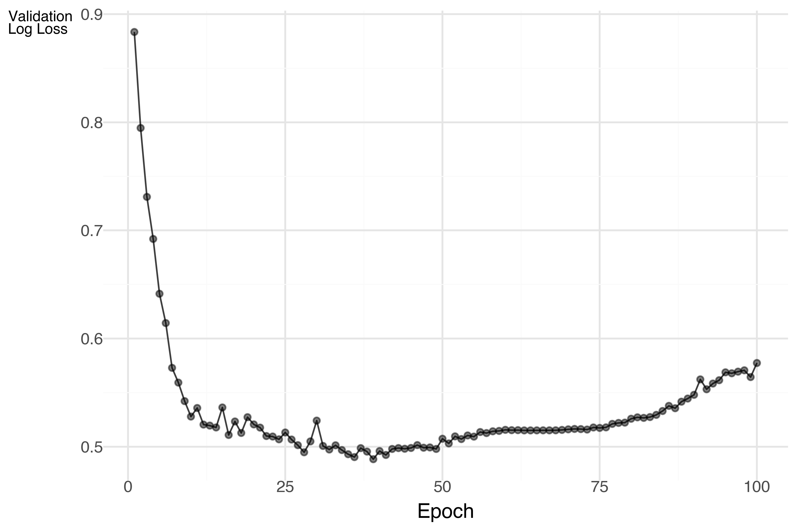
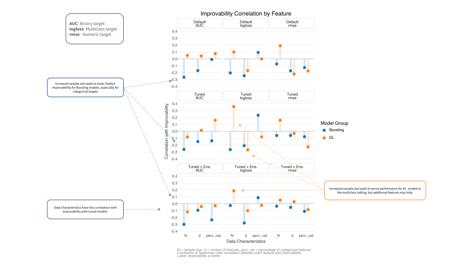

```{r}
#| label: setup
#| echo: false

# this forces the doc to use knitr for execution, otherwise I find lua errors with GT among other issues
```


## Introduction

It's been nearly four years since I [first summarized](../2021-07-15-dl-for-tabular/) the state of deep learning (DL) for tabular data, and about three years since my [follow-up post](../2022-04-01-more-dl-for-tabular/). Back then, the verdict was pretty clear: for most tabular data scenarios, especially those with heterogeneous features and even very large sample sizes, gradient boosting methods like XGBoost, LightGBM, and CatBoost, were still the pragmatic and performant choice. Complex DL architectures like TabNet and even transformer-based models struggled to consistently outperform these boosting approaches, which meant they weren't really viable options for most practitioners or production.

The question now is: has anything fundamentally changed?

Let's see if the landscape has shifted, or if we're still in "[XGBoost is all you need](https://www.xgblog.ai/p/xgboost-is-all-you-need)" territory.


## Quick Take (if you're in a hurry)

Key takeaways:

- Several new deep learning models show impressive performance compared to boosting, but context still matters
- It's significantly easier to implement and experiment with modern tabular DL methods
- **TabArena** has created a more rigorous benchmarking environment with standardized datasets and evaluation protocols
- Foundation models for tabular data are emerging and have had success, but it's a bit early to say how transformative they'll be in practice yet 
- For most practitioners: you’d still do very well with boosting, especially for heterogeneous data and with limited time/resources. However, you should start to consider DL methods if predictive performance is critical and you have the resources to invest in experimentation.

Now, let's dig into the details.


## What's Changed: Benchmarking and Accessibility

### Better Evaluation Standards

One major improvement is the emergence of more rigorous benchmarking. **TabArena** ([leaderboard](https://huggingface.co/spaces/TabArena/leaderboard)) and [TALENT](https://github.com/LAMDA-Tabular/TALENT) provide standardized datasets, consistent evaluation metrics, and transparency in preprocessing—addressing the apples-to-oranges comparison problems from earlier papers. TabArena, which will be the primary reference here, has set a new standard for evaluating tabular DL models with:

- A curated set of tabular datasets with standardized train/test splits
- Consistent evaluation metrics across different model types
- A public leaderboard tracking model performance
- Transparency in preprocessing and hyperparameter choices
- Focus on heterogeneous datasets that better reflect real-world tabular data scenarios
- Use of elo-style model ranking for easier model comparisons

Current benchmarks address one of the major frustrations from my previous post summaries: papers often used different datasets, preprocessing pipelines, and hyperparameter tuning budgets, making fair comparisons nearly impossible. They also often focused primarily on very homogeneous data, which isn't representative of typical real-world tabular data, and sometimes only classification targets. This is a far better assessment, and gives us more confidence when comparing methods.


### Current Leaderboard Landscape

As of `r format(Sys.Date(), "%B %Y")`, the TabArena leaderboard shows some interesting patterns:


{#fig-TabArena}


The key insight from these benchmarks is that some newer DL models *are* not only competitive with boosting, a few typically win in head-to-head comparisons against boosting models. For example, the top 4 DL models win > 50% of the time against LGBM, XGB, and CatBost.

{#fig-h2h width=80%}

### Practical Implementation Tools

The even bigger story is accessibility. Modern tools make it trivial to try these methods, so let's try it out for ourselves!


<!-- **Initial observations:**

- **Top performers**: Not boosting models!
- **Boosting methods**: Still highly competitive
- **Deep learning methods**: Show strength on larger datasets but with notable variability
- **Ensemble methods**: Continue to dominate when allowed, but may not notably improve some models

### What's Different from before?

The key shift isn't necessarily that DL models are winning outright, but rather:

1. **Better standardization**: We can now make more apples-to-apples comparisons with data we care about
2. **Improved implementations**: Available tools provide optimized, well-tuned versions of complex architectures
3. **Pre-training approaches**: Some models leverage transfer learning from other tabular datasets
4. **Feature engineering automation**: Modern DL approaches are better at handling raw heterogeneous features
5. **DL is better**: At least some DL models are now regularly outperforming comparable boosting models on certain datasets, especially larger ones.

But the fundamental question remains: **Is the additional complexity worth it?** Let's find out! -->


## Making Tabular DL Practical

### Using pytabkit

[pytabkit](https://github.com/dholzmueller/pytabkit) provides implementations of state-of-the-art tabular DL models with:

- Optimized hyperparameter defaults based on extensive benchmarking
- Unified API similar to scikit-learn
- Automated preprocessing for heterogeneous data
- Support for both classification and regression

This is significant because one of the historical barriers to using tabular DL was implementation difficulty. While boosting modules were already easy to add to typical ML pipelines and often worked well out of the box, DL models often required custom code, careful tuning, and extensive experimentation to get good results. 

Let's see it in action with a simple example. We'll generate a synthetic dataset with mixed numeric and categorical features, then train a RealMLP model and compare it to an XGBoost baseline.


```{python}
#| label: imports
#| echo: false
#| eval: true
from great_tables import GT
from pytabkit import RealMLP_TD_Classifier

from sklearn.model_selection import train_test_split
from sklearn.datasets import make_classification
from sklearn.metrics import accuracy_score, roc_auc_score, log_loss, f1_score
from sklearn.model_selection import StratifiedKFold

import pandas as pd
import numpy as np
import string

```

```{python}
#| label: data-prep
#| code-fold: true
#| code-summary: "Show the code: Create Classification Data"

from pytabkit import RealMLP_TD_Classifier

from sklearn.model_selection import train_test_split
from sklearn.datasets import make_classification
from sklearn.metrics import accuracy_score, roc_auc_score, log_loss, f1_score
from sklearn.model_selection import StratifiedKFold

import pandas as pd
import numpy as np
import string


# Generate a classification dataset
X, y = make_classification(
    n_samples=5000,
    n_features=15,
    n_informative=8,
    n_redundant=3,
    n_classes=2,
    random_state=42,
    # make it a more difficult problem
    flip_y=0.2,
    class_sep=0.1,
    n_clusters_per_class=2,
)


# Convert to DataFrame for easier handling
feature_names = [f"Feature_{i}" for i in range(X.shape[1])]
X = pd.DataFrame(X, columns=feature_names)

# Add three categorical columns with 3, 5, and 12 categories, using letters as group names
X['Cat_3'] = pd.cut(X['Feature_0'], bins=3, labels=list(string.ascii_uppercase[:3])).astype('category')
X['Cat_5'] = pd.cut(X['Feature_1'], bins=5, labels=list(string.ascii_uppercase[:5])).astype('category')
X['Cat_12'] = pd.cut(X['Feature_2'], bins=12, labels=list(string.ascii_uppercase[:12])).astype('category')


# Use a single train/test split
X_train, X_test, y_train, y_test = train_test_split(X, y, test_size=0.2, random_state=42, stratify=y)

# Example CV splitter for pytabkit (if needed)
cv_splitter = StratifiedKFold(n_splits=5, shuffle=True, random_state=42)
# Get train/validation indices from the splitter
# X_val, y_val = X_train.iloc[val_idx], y_train[val_idx]

val_idxs_list = [val_idxs for train_idxs, val_idxs in cv_splitter.split(X_train, y_train)]

# make sure that each validation set has the same length, so we can exploit vectorization
max_len = max([len(val_idxs) for val_idxs in val_idxs_list])
val_idxs_list = [val_idxs[:max_len] for val_idxs in val_idxs_list]
val_idxs = np.asarray(val_idxs_list)

print(f"Train size: {X_train.shape[0]}, Test size: {X_test.shape[0]}, Baseline rate: {np.mean(y):.2f}")
```

With data in hand, we can train a RealMLP model. 


```{python}
#| label: Train RealMLP
 
model_realmmlp = RealMLP_TD_Classifier(
    device='mps',
    random_state=0,
    n_cv=5,
    val_metric_name='cross_entropy',
    verbosity=2,  # will show per epoch loss
    # example modifications
    # n_refit=1,
    # n_repeats=1,
    # n_epochs=256,
    # batch_size=256,
    # hidden_sizes=[256] * 3,
    # lr=0.04,
)

model_realmmlp.fit(
    X_train,
    y_train,
    val_idxs=val_idxs,
    cat_col_names=['Cat_3', 'Cat_5', 'Cat_12']
)
```


```{python}
#| label: Train RealMLP with Timing
#| echo: false
import time

start_time = time.time()

# Fit the model
RealMLP_TD_Classifier(
    device='mps',
    random_state=0,
    n_cv=5,
    val_metric_name='cross_entropy').fit(X_train, y_train, val_idxs=val_idxs, cat_col_names=['Cat_3', 'Cat_5', 'Cat_12'])

end_time = time.time()
print(f"Training time: {end_time - start_time:.2f} seconds")
```

```{python}
#| label: Capture RealMLP Training History
#| echo: false
#| eval: false
import io
import sys
import logging

# Capture stdout during training
class Capturing(list):
    def __init__(self):
        super().__init__()
        self._stdout_io = io.StringIO()
        self._stderr_io = io.StringIO()
        self._old_stdout = None
        self._old_stderr = None
        self._logger = logging.getLogger()
        self._old_handlers = None
    def __enter__(self):
        self._old_stdout = sys.stdout
        self._old_stderr = sys.stderr
        sys.stdout = self._stdout_io
        sys.stderr = self._stderr_io
        # capture root logger output to stderr buffer
        self._old_handlers = self._logger.handlers[:]
        for h in self._old_handlers:
            self._logger.removeHandler(h)
        handler = logging.StreamHandler(self._stderr_io)
        handler.setLevel(logging.INFO)
        self._logger.addHandler(handler)
        return self
    def __exit__(self, exc_type, exc, tb):
        # restore std streams
        sys.stdout = self._old_stdout
        sys.stderr = self._old_stderr
        # restore logging handlers
        for h in self._logger.handlers[:]:
            self._logger.removeHandler(h)
        for h in self._old_handlers:
            self._logger.addHandler(h)
        # combine stdout and stderr lines
        self.extend(self._stdout_io.getvalue().splitlines())
        self.extend(self._stderr_io.getvalue().splitlines())


with Capturing() as output:
    model_realmmlp_eval = RealMLP_TD_Classifier(
        device='mps',
        random_state=0,
        n_cv=5,
        val_metric_name='cross_entropy',
        n_epochs=1000,
        verbosity=2,
    )
    model_realmmlp_eval.fit(
        X_train, y_train, val_idxs=val_idxs, cat_col_names=['Cat_3', 'Cat_5', 'Cat_12']
    )

# Example: Extract log loss per epoch from captured output
import re

epoch_logloss = []
# match lines like:
# 'Epoch 1/5: val cross_entropy = 0.914697'
# 'Epoch 2/5 - val cross_entropy: 1.23e-3'
regex = re.compile(
    r'Epoch\s+(\d+)(?:/\d+)?\s*[:\-].*?val\s+cross_entropy\s*[=:]\s*([0-9]*\.?[0-9]+(?:[eE][+-]?\d+)?)',
    re.IGNORECASE,
)
for line in output:
    m = regex.search(line)
    if m:
        epoch = int(m.group(1))
        val_loss = float(m.group(2))
        epoch_logloss.append({'epoch': epoch, 'val_loss': val_loss})


# Convert to DataFrame for plotting or saving
df_logloss = pd.DataFrame(epoch_logloss)
df_logloss.to_csv(
    'data/dl-foundational/realmmlp_training_log.csv',
    index=False,
)
```

On an old Macbook M1 this ran just at around one minute with the default 256 epochs, and it doesn't look like we needed that many (#fig-RealMLPTraining). We definitely don't need to sweat that kind of time on a dataset of this size regardless. Now let's evaluate the model on the test set. Note that inference is near instant for this model.


{#fig-RealMLPTraining width=80%}

```{python}
#| label: RealMLP Training Plot
#| echo: false
#| eval: false
#| fig-cap: "RealMLP Validation Log Loss per Epoch"
#| out-width: 80%

df_logloss = pd.read_csv(
        'data/dl-foundational/realmmlp_training_log.csv'
    )

from plotnine import *

p = (
    ggplot(df_logloss.query('epoch <= 100'), aes(x='epoch', y='val_loss')) +
    geom_line(color='black', alpha=.75) +
    # geom_smooth(se=False, method='loess') +
    geom_point(color='black', alpha=0.5) +
    labs(title='', x='Epoch', y='Validation\nLog Loss') +
    theme_minimal() +
    theme(
        axis_title_y=element_text(angle=0, vjust=1, size=8),
        axis_title_x=element_text(size=8),
    )
)

p.show()

p.save(
    'img/dl-foundational/2025-03-01-dl-for-tabular-foundational/realmmlp_training_plot.png',
    width=6, height=4, dpi=300
)
```

```{python}
#| label: metrics_realmlp
#| code-fold: true
#| code-summary: "Show the code: Evaluate RealMLP"
y_pred = model_realmmlp.predict(X_test)
y_proba = model_realmmlp.predict_proba(X_test)[:, 1]

metrics_realmlp = {
    "Accuracy": accuracy_score(y_test, y_pred),
    "ROC AUC": roc_auc_score(y_test, y_proba),
    "Log Loss": log_loss(y_test, y_proba),
    "F1 Score": f1_score(y_test, y_pred)
}

metrics_realmlp = pd.DataFrame(metrics_realmlp, index=["RealMLP"])
print(metrics_realmlp)
```

```{python}
#| label: Save RealMLP Metrics
#| echo: false
pd.DataFrame(metrics_realmlp).to_csv('data/dl-foundational/realmmlp_metrics.csv')
```

```{python}
#| label: Display RealMLP Metrics
#| eval: true
#| echo: false
#| classes: plain  # to get rid of ridiculous default quarto row-striping

from great_tables import GT
import pandas as pd

metrics_realmlp = pd.read_csv('data/dl-foundational/realmmlp_metrics.csv', index_col=0)

GT(metrics_realmlp).tab_options(
    column_labels_background_color="#084887",
).fmt_number(decimals=3)
```

Compare to XGBoost. With pytabkit we can use defaults based on models used across a variety of data sets (`TD` = tuned defaults), making it easy to get started very well. Model training with data of this size took just a couple seconds.

```{python}
#| label: Train XGBoost
from pytabkit import XGB_TD_Classifier

model_xgb = XGB_TD_Classifier(
    device='mps',
    random_state=0,
    n_cv=5
)

model_xgb.fit(
    X_train,
    y_train,
    val_idxs=val_idxs,
    cat_col_names=['Cat_3', 'Cat_5', 'Cat_12']
)
```

```{python}
#| label: Evaluate XGBoost
#| code-fold: true
#| code-summary: "Show the code: Evaluate XGBoost"
y_pred = model_xgb.predict(X_test)
y_proba = model_xgb.predict_proba(X_test)[:, 1]

metrics_xgb = {
    "Accuracy": accuracy_score(y_test, y_pred),
    "ROC AUC": roc_auc_score(y_test, y_proba),
    "Log Loss": log_loss(y_test, y_proba),
    "F1 Score": f1_score(y_test, y_pred)
}
```

```{python}
#| label: Save XGB Metrics
#| echo: false
#| eval: false

pd.DataFrame(metrics_xgb, index=["XGB"]).to_csv('data/dl-foundational/xgb_metrics.csv')
```


```{python}
#| label: Comparing Metrics
#| eval: true
#| echo: false
#| classes: plain  # to get rid of ridiculous default quarto row-striping

import polars as pl
import polars.selectors as cs
metrics_xgb = pd.read_csv('data/dl-foundational/xgb_metrics.csv', index_col=0)


results = pd.concat([
    metrics_xgb,
    metrics_realmlp
]).reset_index().rename(columns={"index": "Model"})

results = pl.from_dataframe(results)
# results = results.rename({col: col.replace(" ", "_") for col in results.columns})

(
    GT(results)
    .tab_options(
      # heading_background_color="#084887",
      # column_labels_border_top_color="#084887",
      column_labels_background_color="#084887",
    )
    # .tab_style(
    #   style=style.fill(color="lightblue"),
    #     locations=loc.body(rows=0)
    # )
    .fmt_number(columns=cs.numeric(), decimals=3)
)

```

While boosting appears to do fine, in very little time we can get not only competitive but even better results with a modern DL approach. Of course, this is just one (simulated) dataset that shows how easy it is, but the TabArena results suggest this generalizes well beyond also. There we see that RealMLP is one of the top performers across a variety of datasets, and beats XGBoost in head-to-head comparisons more than 75% of the time (@fig-h2h).


### Even Easier: AutoGluon

[AutoGluon](https://auto.gluon.ai/stable/index.html) is a popular AutoML library that has recently added support for some of the newer tabular DL models, including many of those in pytabkit. This means you can get competitive performance with minimal code and tuning for multiple models, whether boosting, DL, or other approaches. Here we use 3 DL models and 3 boosting models[^mitra].

[^mitra]: Amazon provides its own tabular foundation model Mitra, but it wouldn't run due to memory issues on my old machine.

```{python}
#| label: AutoGluon Example
from autogluon.tabular import TabularDataset, TabularPredictor

X_train_ag = TabularDataset(X_train.assign(target=y_train))
X_test_ag = TabularDataset(X_test)

model_ag = (
    TabularPredictor(label='target', eval_metric='logloss')
    .fit(
        X_train_ag,
        num_bag_folds=5,
        # num_bag_sets=1,
        # num_stack_levels=0,
        # you can set these and/or let AutoGluon search 
        hyperparameters={
            'REALTABPFN-V2.5': {'device': 'mps'},
            'REALMLP': {},
            'TABM': {},
            'GBM': {},
            'XGB': {},
            'CAT': {},
        }
    )
)
```

```{python}
#| label: Load AutoGluon Model
#| echo: false
# model_ag = TabularPredictor.load('AutoGluonModels/ag-20260218_010457')
```

```{python}
#| label: AutoGluon Leaderboard Plot
#| echo: false
# model_ag.plot_ensemble_model() # requires pygraphviz and f that
```

```{python}
#| label: AutoGluon Predictions
#| code-fold: true
#| code-summary: "Show the code: AutoGluon Predictions"
y_pred = model_ag.predict(X_test_ag)
y_proba = model_ag.predict_proba(X_test_ag).loc[:, 1]
```


```{python}
#| label: import previous ag metrics 
#| echo: false
#| eval: true
import os
import pandas as pd

ag_leaderboard_path = 'data/dl-foundational/autogluon_leaderboard.csv'
if os.path.exists(ag_leaderboard_path):
  ag_leaderboard = pd.read_csv(ag_leaderboard_path, index_col=0)

best_model = ag_leaderboard.loc[0, 'model']
# Get best non-ensemble model (doesn't have 'Ensemble' in model name)
non_ensemble = ag_leaderboard.loc[~ag_leaderboard['model'].str.contains('Ensemble', case=False), 'model'].tolist()
best_non_ensemble = non_ensemble[0].replace('_BAG_L1', '')  # replace spaces with underscores for consistency
```

One very nice aspect of AutoGluon is its easily accesible 'leaderboard' so you can compare and contrast your models immediately. The best non-ensemble model was `{r} py$best_non_ensemble`. It also makes very clear just how much more time it took to get the best performance (in seconds), which is a lot. Whether it's worth it will depend on your context.

```{python}
#| label: AutoGluon Leaderboard Code
ag_leaderboard = model_ag.leaderboard(X_test_ag.assign(target=y_test))
```


```{python}
#| label: AutoGluon Leaderboard
#| echo: false

em =  ['accuracy', 'roc_auc', 'logloss', 'f1']
ag_leaderboard = model_ag.leaderboard(X_test_ag.assign(target=y_test), extra_metrics=em)

ag_leaderboard.columns
ag_leaderboard[['model', 'score_test', 'score_val'] + em]
```

```{python}
#| label: Display AutoGluon Leaderboard
#| echo: false
#| eval: true
#| classes: plain  # to get rid of ridiculous default quarto row-striping


# ag_leaderboard.to_csv('data/dl-foundational/autogluon_leaderboard.csv')

ag_leaderboard = pd.read_csv('data/dl-foundational/autogluon_leaderboard.csv', index_col=0)
(
  GT(pl.from_dataframe(ag_leaderboard).drop(['stack_level', 'can_infer', 'fit_order', '__index_level_0__']))
  .tab_options(
    column_labels_background_color="#084887",
  )
  .fmt_number(columns=cs.numeric(), decimals=3)
)
```

<br>


Now let's compare all our approaches. Standard XGB with tuned defaults did pretty well, but our RealMLP model did better, and AutoGluon did even better still in terms of loss.

```{python}
#| label: AutoGluon Metrics
#| echo: false
metrics_autogluon = {
    "Accuracy": accuracy_score(y_test, y_pred),
    "ROC AUC": float(roc_auc_score(y_test, y_proba)),
    "Log Loss": log_loss(y_test, y_proba),
    "F1 Score": f1_score(y_test, y_pred)
}

pd.DataFrame(metrics_autogluon, index=["AutoGluon"]).to_csv('data/dl-foundational/autogluon_metrics.csv')
```


```{python}
#| label: Comparing All Models
#| echo: false
#| eval: true
#| classes: plain  # to get rid of ridiculous default quarto row-striping
metrics_autogluon = pd.read_csv(
  'data/dl-foundational/autogluon_metrics.csv',
  index_col=0
)

results = pd.concat([
    metrics_xgb,
    metrics_realmlp,
    metrics_autogluon,
]).reset_index().rename(columns={"index": "Model"})

results = pl.from_dataframe(results)

(
    GT(results)
    .tab_options(
      # heading_background_color="#084887",
      # column_labels_border_top_color="#084887",
      column_labels_background_color="#084887",
    )
    # .tab_style(
    #   style=style.fill(color="lightblue"),
    #     locations=loc.body(rows=0)
    # )
    .fmt_number(columns=cs.numeric(), decimals=3)
)
```

```{python}
#| label: Clean Up AutoGluon Models
#| echo: false

# predictor.delete_models(models_to_keep=[], delete_from_disk=True)
```


## What Affects Performance?

The performance of any model on tabular data can be influenced by several factors:

- **Dataset characteristics**: The number of samples, features, and the degree of heterogeneity can impact which model performs best. DL models may excel with larger datasets and more complex feature interactions, while boosting methods may perform better with smaller datasets or more homogeneous features.
- **Hyperparameter tuning**: DL models often require more careful tuning of hyperparameters (e.g., learning rate, architecture, batch size) compared to boosting methods, which can be more robust to default settings. However, tools like pytabkit and AutoGluon are making this easier by providing optimized defaults and automated tuning.
- **Computational resources**: DL models typically require more computational power and longer training times to get that better performance, especially for larger datasets and more complex architectures. Boosting methods are generally faster to train and can be more efficient for smaller datasets or when resources are limited.
- **Ensembling**: Combining multiple models can often improve performance, but the benefits may vary depending on the dataset and the models being combined. Some DL models may benefit more from ensembling than boosting methods, but this can also increase training time and complexity.

TabArena provides the following plot. On the y-axis, which is **improvability** or is how much better the 'best' model is relative to the one in question. If your model did just as well as the best improvability would be 0, as there would be no room for improvement. The x-axis is difficult to parse because it's a combination of dataset characteristics like sample size and number of features. Plus the display choices make it hard to see the relationship between different models. TabPFN doesn't gain much with increased training time, but that is partly because it does so well to begin with. Furthermore, we  may see better improvement if that training time is due to increased features or increased samples, but it's not clear from that plot. Note that each point represents a larger ensemble of different configurations of the model from 1 parameter set on the left to 201 on the right, so the training time is the median time during that training process[^improveplot].


{#fig-improvability-tab-arena width=80%} 

[^improveplot]: So many issues with this visualization. If you don't understand it, don't worry about it, it conflates many different things to the point of being minimally useful at best. This is even acknowledged in the paper. 

The takeaway from the plot is that deep learning has officially caught up to gradient-boosted trees on tabular data, but claiming that top spot requires a massive "training tax"—specifically, ensembling dozens of configurations to squeak past standard baselines. While models like RealMLP offer the absolute highest accuracy if you have unlimited resources, trees like CatBoost remain the practical choice, delivering stable, near-peak performance at a fraction of the compute and inference cost. Unless you are chasing the final fraction of a percent in accuracy at any price, traditional tree-based models are still the most efficient tool for the job.


If we actually break out the reported relationships in the TabArena paper, a couple things become more clear. I looked at the top 4 DL models and their performance relative to standard 3 boosting methods, and  how sample size, number of features, and heterogeneity (based on percentage of categorical features) relate to improvability[^improve_calc]. I found that:

- Increased sample and feature set is correlated with better performance for boosting, but this relationship seems to be mostly for categorical targets and/or the default parameters.
- The percentage of categorical features seems a mixed bag for boosting and DL models, but may help boosting methods for binary and numeric targets. For DL models this seems to be more helpful for numeric targets, but not binary or multiclass.
- For multiclass targets, increased feature set helps DL models.
- Default settings benefit more from increased data, likely because the tuned/ensembled models are already doing much better in the same settings, so there's less room for improvement.


{#fig-improvability-sample-size height=1200"}


[^improve_calc]: The TabArena paper reports rmse for numeric outcomes, logloss for multiclass, and AUC for binary. Their conception of improvability is 100* (err - best) / err, where err is the error of the model in question and best is the error of the best model for that dataset/setting/metric. For AUC, which is already on a 0-1 scale, I used the percentage point difference: 100*(best_auc - model_auc), which is more interpretable than a ratio of proportions. This has no bearing on the correlation in the end.

While there may be some apparent trends, I think the overall takeaway here is that data nuances matter, and it is difficult to say ahead of time how a model will perform.


### How long does it take?

When considering whether to use DL methods for tabular data, training and inference time are important factors. While DL models can offer performance improvements, they require more computational resources and longer training times compared to boosting methods. This is especially true for larger datasets and more complex architectures.

In our example, the RealMLP model took about one minute to train on a small dataset with an old M1 chip, while XGBoost took just a couple seconds. The AutoGluon approach had several models to work through and then combine, but even then was less than 10 minutes. This sort of difference is manageable for many applications, especially if you're looking for that extra bit of performance and have the resources to invest in tuning. Autogluon makes it even easier to implement multiple models quickly, with ensemble results that will often be the best you'll get.

Of course, with larger data comes more pronounced gaps. Some models like Tab-PFN* will not even be applicable beyond a certain point, and others will just not be viable for the data context. For some, they may already do quite well in smaller data settings (like Tab-PFN), while others may generally do better with more data/ensembling. 

For DL models and tabular data, the ease at which we can implement these models means it's worth trying them out on your own data, especially if you're already using boosting methods and want to see if you can eke out some extra performance.


```{python}
#| label: Load TabArena Data
#| echo: false
df_tabarena_paper_metrics = pd.read_csv('data/dl-foundational/dataset_metric_summary.csv', na_values=['-'])
df_tabarena_paper_datasets = pd.read_csv('data/dl-foundational/dataset_summary.csv', na_values=['-'])

import polars as pl
import polars.selectors as cs

df_tabarena_paper_metrics_score_only = pl.from_pandas(df_tabarena_paper_metrics)

import re


# Identify columns that start with 'RF:AutoGluon'
cols = df_tabarena_paper_metrics_score_only[:, 'RF':'AutoGluon'].columns

df_tabarena_paper_metrics_score_only = df_tabarena_paper_metrics_score_only.with_columns(
    [
        pl.col(col)
        .cast(pl.Utf8)
        .str.replace(r"±.*", "")
        # .str.strip()
        .replace('', None)
        .cast(pl.Float64)
        .alias(col)
        for col in cols
    ]
)

df_tabarena_paper_datasets
df_tabarena_paper_metrics_score_only

# df_tabarena_paper_metrics_score_only
set(df_tabarena_paper_datasets['Name']) - set(df_tabarena_paper_metrics_score_only['ID'].unique()), set(df_tabarena_paper_metrics_score_only['ID'].unique()) - set(df_tabarena_paper_datasets['Name'])

# Replace 'HR_Analytics_Job_Change_of_Data_Scientists' with 'HR_Analytics_Job_Change' in the 'Name' column
df_tabarena_paper_datasets['Name'] = df_tabarena_paper_datasets['Name'].replace(
    'HR_Analytics_Job_Change_of_Data_Scientists', 'HR_Analytics_Job_Change'
)
df_tabarena_paper_datasets = pl.from_pandas(df_tabarena_paper_datasets)
```

```{python}
#| label: Merge and Process TabArena Data
#| echo: false


# Merge TabArena dataset and metrics tables using polars
df_merged = df_tabarena_paper_datasets.join(
    df_tabarena_paper_metrics_score_only,
    left_on="Name",
    right_on="ID",
    how="inner"
)

# Melt columns RF through AutoGluon into 'Model' and 'Score'
model_cols = df_merged.columns[df_merged.columns.index('RF'):df_merged.columns.index('AutoGluon') + 1]


df_long = df_merged.unpivot(
    index=[col for col in df_merged.columns if col not in model_cols],
    on=model_cols,
    variable_name='Model',
    value_name='Score'
)

# df_long.columns
# create a column best for each metric-Name-Setting combo. You will have to select best based on the metric (e.g. logloss is better when lower, while accuracy is better when higher)

# Compute normalized improvability score for each (Name, Setting, Metric) group
# For logloss/rmse (lower is better): improvability = (err - best) / err
# For AUC (higher is better): improvability = 1 - (err - best) / err

# Compute improvability for each row, relative to the best for that (Name, Setting, Metric) group
# Compute groupwise best value for each row
df_long = df_long.with_columns([
    pl.when(
        (pl.col('Metric') == 'logloss') | (pl.col('Metric') == 'rmse')
    )
    .then(
        pl.col('Score').min().over(['Name', 'Setting', 'Metric'])
    )
    .otherwise(
        pl.col('Score').filter(pl.col('Score').is_not_null()).max().over(['Name', 'Setting', 'Metric'])
    )
    .alias('BestScore')
])

# Calculate improvability relative to the groupwise best
df_long = df_long.with_columns([
    pl.when(
        (pl.col('Metric') == 'logloss') | (pl.col('Metric') == 'rmse')
    )
    .then(
        ((pl.col('Score') - pl.col('BestScore')) / pl.col('Score') * 100)
    )
    .otherwise(
        ((pl.col('BestScore') - pl.col('Score')) *100) # / pl.col('Score') * 100)
    )
    .alias('improvability')
])


with pl.Config(tbl_cols=-1):
    print(df_long.describe())

# df_long.filter(pl.col('Name').eq('APSFailure'))
# df_long['Model'].unique()
# df_long.columns

# df_long.filter(pl.col('Name').eq('airfoil_self_noise')).select(['Name','Model', 'Setting', 'Score', 'BestScore', 'improvability', 'Metric']).sort('Setting', 'Score').filter(pl.col('improvability').lt(1.5))


df_long.write_csv('data/dl-foundational/df_metrics_by_data.csv')
```

```{python}
#| label: Plot TabArena Performance
#| echo: false
# Plot Score by Model, colored by whether it's the best for that dataset/setting/metric
from plotnine import *
p = (
    ggplot(df_long.filter(pl.col('Model').is_in(['XGBoost', 'LightGBM', 'CatBoost', 'RealMLP', 'TabM', 'TabPFN', 'TabDPT', 'AutoGluon'])), aes(x='d', y='improvability')) +
    geom_text(aes(label='Model', size ='N')) +
    facet_wrap('~ Setting + Metric', scales='free') +
    theme_bw() +
    labs(title='Model Performance by Dataset', x='Model', y='Improvability')
)

p.show()
```


## What to Do Now

This is how I see things at this point.

### Start Here (Decision Framework)

- Small data (<10k) and infrequent model runs: anything you want that works including strong statistical models like generalized additive mixed models (GAMs).
- Small data and frequent runs: boosting/MLP-based models like RealMLP, TabM, TabICL.
- Medium data (up to 250k) and infrequent runs: try DL models if resources permit.
- Medium data and frequent runs: boosting/MLP-based models.
- Large data (>250k): boosting is your primary go to. If you really want to do DL, consider TabICL-v2.

Other considerations will include multiclass outcomes, number of features, non-standard loss functions, computational resources available at inference and more. But right now it seems you can get the best performance on small to moderate data with DL models, but the cost of that performance is more time and resources, and the benefits are less clear for larger data.


## Looking Ahead: Foundation Models for Tabular Data

### The Promise

Recent work has explored pre-training models on large collections of tabular datasets and/or synthetic data, then fine-tuning for specific tasks.  This is similar to the paradigm that revolutionized NLP and vision. But do they work?

The idea is that just like in other domains, we can leverage large amounts of tabular data to learn generalizable representations that can be fine-tuned for specific tasks. This could potentially allow us to:

- Achieve better performance with less task-specific data
- Handle heterogeneous features more effectively
- Enable zero-shot or few-shot learning on new tabular tasks

Key models include TabPFN and variants, Mitra (Amazon), TabICL, and others. 


### The Reality

Results are hit and miss. Some such as TabPFN obviously do well if we look at the leaderboard... if the data is not large. Others like TabICL are restricted to classification[^onlyclass].  Note that TabArena data maxes out at 150k which is considered 'medium' size.  Even then, training and inference time may be prohibitive in many cases. Right now you could use MLP approaches like TabM and RealMLP with faster yet comparable results. But more to the point, it is *very* common in the tabular domain to see much larger datasets, and boosting models are still working fine even with millions of rows, and can utilize GPUs as well.


[^onlyclass]: I'm not sure what the reasoning for focusing only on classification was, but TabICL-v2, released a few days before I started this post, is now applicable to regression tasks. The authors claim it beats everything.


## What I'd Still Like to See

Reflecting on my 2022 wishlist what progress has been made and what is still missing:

**Progress made:**

- ✅ Better implementation tools
- ✅ Standardized benchmarking
- ✅ More rigorous/realistic comparisons

**Would like more:**

- ❌ Clearer guidance on when complexity pays off
- ❌ Fair comparisons with better statistical methods than linear/knn regression (e.g., GAMM)

I think the biggest issue is a breakdown of specific data characteristics and how they relate to model performance. Efficiency is certainly worth focusing on, but practitioners need to know 'is my data too large for this model?' or 'do I have enough features for this model to be worth it?'[^nfeatures]. I can appreciate trying to tie them all together in one plot, but a clearer delineation of these relationships would be very helpful for practitioners trying to decide which model to use for their specific problem.

[^nfeatures]: I think some of the data is going far overboard with the number of features. I've consulted across dozens of disciplines and the most I've ever had for a tabular model was a little over 100, which was mostly due to the client not having the domain knowledge to do feature selection (IIRC, the actual useful number was < 10). 

## Conclusion

Four years ago I concluded that DL wasn't ready for most tabular tasks. Today, the tabular DL landscape has matured considerably. We have better benchmarks, better tools, and a little bit better understanding of where these methods excel. Some DL models now regularly outperform boosting on realistic benchmarks and are ready for use, but still not always necessary. In general: 

**XGBoost and friends are still the pragmatic starting point** for most tabular data tasks, especially with heterogeneous features and modest sample sizes. They're fast, well-understood, and more easily tunable than ever.

**DL methods for tabular data have become practically competitive**. However, as they often require more resources to implement effectively, it will be important to consider the specific context of your problem, including dataset size, feature characteristics, and computational constraints. For smaller datasets or when chasing that last bit of performance, DL models like TabICL and RealMLP can be a great choice.

The "all you need" framing from paper titles misses the point. The real question is: **"What do you need for *your* specific problem?"** In 2026, we have better tools to explore that question, but the answer will often still point to classical ML methods for tabular data work.

That said, the rapid progress in this space suggests checking back in another year or so might reveal even more interesting developments. Foundation models are still early in development, and the community is actively exploring how to make them more efficient and effective. In the meantime, the best approach is to experiment with your own data, use benchmarks like TabArena for inspiration, and don't be afraid to start simple and iterate from there.


## References

**Previous posts in this series:**

- [This is definitely not all you need (2021)](../2021-07-15-dl-for-tabular/)
- [Deep Learning for Tabular Data (2022)](../2022-04-01-more-dl-for-tabular/)

**Resources:**

- [TabArena Leaderboard](https://huggingface.co/spaces/TabArena/leaderboard)
- [TabArena Paper](https://arxiv.org/abs/2506.16791)
- [pytabkit GitHub](https://github.com/dholzmueller/pytabkit)
- [TALENT Paper](https://arxiv.org/abs/2407.00956)
- [The State of Tabular Foundation Models](https://mindfulmodeler.substack.com/p/the-state-of-tabular-foundation-models)